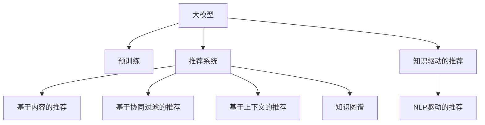

                 

# AI大模型视角下电商搜索推荐的技术创新知识分享平台搭建

> 关键词：电商搜索推荐,知识分享平台,大模型,技术创新,数据驱动,推荐系统,用户体验,知识图谱,自然语言处理(NLP)

## 1. 背景介绍

### 1.1 问题由来

电商领域是技术创新最为活跃的行业之一，随着互联网的普及和电子商务平台的兴起，用户在线购物的方式逐渐替代了传统线下购物。各大电商平台如京东、淘宝、美团等纷纷引入先进的技术手段，通过精准搜索推荐系统提升用户体验，增强平台的竞争力。

当前，电商搜索推荐系统已经形成了较为成熟的框架，包括基于协同过滤、内容推荐、上下文推荐等方法。但这些方法往往依赖于用户行为数据和商品特征数据，在大规模数据的支持下效果显著。然而，对于新兴电商平台，特别是中小型电商，用户行为数据难以全面获取，依靠数据驱动的推荐方法难以充分发挥作用。

随着AI技术和大模型的不断发展，基于大模型的推荐系统逐渐引起广泛关注。大模型如BERT、GPT-3等通过大规模预训练获得了丰富的语言知识，在电商搜索推荐领域展现了巨大潜力。基于大模型的推荐系统可以通过文本信息进行推荐，突破数据量限制，为新兴电商平台提供了新的解决方案。

## 2. 核心概念与联系

### 2.1 核心概念概述

为更好地理解基于大模型的电商搜索推荐系统的实现方法，本节将介绍几个密切相关的核心概念：

- 大模型(Large Model)：以自回归或自编码模型为代表的大规模预训练语言模型。通过在大规模无标签文本语料上进行预训练，学习通用的语言表示，具备强大的语言理解和生成能力。
- 推荐系统(Recommender System)：根据用户的历史行为和商品属性，为用户推荐相关商品的系统。包括协同过滤、基于内容的推荐、上下文推荐等传统方法，以及基于深度学习、强化学习的先进推荐方法。
- 知识图谱(Knowledge Graph)：通过图结构展示实体和关系，用于描述实体间的语义关系，辅助推荐系统理解和推荐商品。
- 自然语言处理(Natural Language Processing, NLP)：利用计算机科学和人工智能技术，使计算机处理、理解和生成人类语言。NLP技术在电商搜索推荐中用于分析用户意图、商品描述等文本信息，辅助推荐系统的构建。

这些核心概念之间的逻辑关系可以通过以下Mermaid流程图来展示：



这个流程图展示了大模型推荐系统的核心概念及其之间的关系：

1. 大模型通过预训练获得基础能力。
2. 推荐系统将大模型的基础能力应用于用户推荐。
3. 推荐系统包括多种方法，如基于内容、协同过滤、上下文推荐等。
4. 知识图谱和大模型的结合，提升了推荐的语义理解和泛化能力。
5. NLP技术进一步增强了推荐系统对文本数据的处理能力。

这些核心概念共同构成了基于大模型的电商搜索推荐系统的框架，使其能够在电商场景中发挥强大的推荐功能。

## 3. 核心算法原理 & 具体操作步骤

### 3.1 算法原理概述

基于大模型的电商搜索推荐系统，本质上是一种基于深度学习的推荐算法。其核心思想是：利用大模型学习用户和商品的语义表示，结合推荐系统的算法模型，为用户推荐相关商品。

具体而言，该系统包括以下几个关键步骤：

1. **大模型的预训练**：在大规模无标签文本数据上进行预训练，学习通用的语言表示。
2. **用户意图的提取**：通过NLP技术对用户查询进行意图理解，提取用户的真实需求。
3. **商品特征的表示**：使用大模型对商品描述进行编码，获取商品的语义特征。
4. **推荐计算**：根据用户意图和商品特征，利用推荐算法模型计算推荐结果。
5. **结果排序**：将推荐结果按照相关性进行排序，最终返回用户前N个推荐商品。

### 3.2 算法步骤详解

以下是对基于大模型的电商搜索推荐系统算法步骤的详细讲解：

**Step 1: 准备数据和模型**

1. **数据准备**：准备电商平台的商品信息和用户查询日志，进行数据清洗和预处理，形成用户-商品交互数据集。
2. **模型准备**：选择合适的预训练语言模型（如BERT、GPT-3等），进行加载和配置。

**Step 2: 用户意图的提取**

1. **分词处理**：对用户查询进行分词处理，去除停用词和特殊符号。
2. **意图理解**：使用大模型对查询文本进行编码，提取用户的意图表示。
3. **意图分类**：通过分类模型将用户意图分类为购物、浏览、客服等不同类型。

**Step 3: 商品特征的表示**

1. **商品编码**：对商品描述进行分词处理，去除停用词和特殊符号。
2. **语义编码**：使用大模型对商品编码进行编码，得到商品的语义表示。
3. **特征提取**：对商品的语义表示进行特征提取，形成商品特征向量。

**Step 4: 推荐计算**

1. **相似度计算**：计算用户意图表示与商品特征向量的相似度，得到一个用户-商品关联矩阵。
2. **排序计算**：根据相似度计算结果，对商品进行排序，生成推荐列表。

**Step 5: 结果排序**

1. **模型评估**：通过AUC、CVR等指标对推荐结果进行评估。
2. **结果排序**：将推荐结果按照相关性进行排序，返回用户前N个推荐商品。

### 3.3 算法优缺点

基于大模型的电商搜索推荐系统具有以下优点：

1. **泛化能力强**：大模型可以更好地理解和表示用户意图和商品特征，提高推荐的泛化能力。
2. **可解释性强**：利用NLP技术提取用户意图，提升推荐的可解释性。
3. **不受数据量限制**：在数据量较少的场景下，仍然可以通过大模型的预训练和微调获得不错的推荐效果。

同时，该系统也存在一些缺点：

1. **计算复杂度高**：大模型需要进行大规模的文本编码和特征提取，计算复杂度较高。
2. **存储需求大**：大模型的参数量巨大，存储需求大，对硬件要求高。
3. **结果质量依赖于数据质量**：若数据质量和标注质量不高，大模型可能无法准确提取用户意图和商品特征。

### 3.4 算法应用领域

基于大模型的电商搜索推荐系统在电商领域具有广泛的应用前景，具体应用场景包括：

1. **商品推荐**：根据用户历史行为和查询意图，为用户推荐相关商品。
2. **用户画像构建**：通过分析用户查询和行为数据，构建用户画像，提升个性化推荐的效果。
3. **智能客服**：结合自然语言处理技术，自动回答用户的常见问题，提升客服效率。
4. **搜索优化**：通过分析用户查询和搜索结果，优化搜索算法，提升搜索体验。
5. **广告投放**：利用推荐结果，进行精准的广告投放，提升广告效果。

此外，该系统在社交媒体、新闻推荐等领域也具有潜在的应用前景。

## 4. 数学模型和公式 & 详细讲解  
### 4.1 数学模型构建

基于大模型的电商搜索推荐系统涉及到以下几个数学模型：

1. **用户意图提取模型**：利用大模型对用户查询进行编码，得到用户意图表示。
2. **商品特征表示模型**：利用大模型对商品描述进行编码，得到商品特征向量。
3. **相似度计算模型**：计算用户意图表示与商品特征向量之间的相似度。
4. **推荐排序模型**：利用推荐算法模型对推荐结果进行排序。

**用户意图提取模型**：假设用户查询为 $q$，通过大模型提取用户意图表示 $h_q$，具体公式为：

$$
h_q = \text{BERT}(q)
$$

其中 $\text{BERT}$ 表示预训练的大模型，$q$ 为用户查询文本。

**商品特征表示模型**：假设商品描述为 $d$，通过大模型提取商品特征向量 $v_d$，具体公式为：

$$
v_d = \text{BERT}(d)
$$

其中 $\text{BERT}$ 表示预训练的大模型，$d$ 为商品描述文本。

**相似度计算模型**：计算用户意图表示 $h_q$ 与商品特征向量 $v_d$ 的余弦相似度 $s_{q,d}$，具体公式为：

$$
s_{q,d} = \frac{h_q^T v_d}{\|h_q\| \|v_d\|}
$$

其中 $^T$ 表示矩阵转置，$\|h_q\|$ 和 $\|v_d\|$ 分别表示向量 $h_q$ 和 $v_d$ 的范数。

**推荐排序模型**：假设推荐算法模型为 $f$，利用相似度 $s_{q,d}$ 计算推荐分数 $r_{q,d}$，具体公式为：

$$
r_{q,d} = f(h_q, v_d)
$$

其中 $f$ 为推荐算法模型，$h_q$ 为用户的意图表示，$v_d$ 为商品的特征向量。

### 4.2 公式推导过程

以下我们以简单用户意图提取和商品特征表示为例，推导相关数学模型。

**用户意图提取模型**：

假设用户查询 $q$ 为 "I want to buy a laptop"，使用BERT模型对其进行编码，得到用户意图表示 $h_q$。具体推导过程如下：

1. **分词处理**：将查询文本分词处理，得到单词列表 $q = \text{"I", "want", "to", "buy", "a", "laptop"}$。
2. **词嵌入**：将单词列表转换为向量表示，得到向量列表 $\{h_i\}_{i=1}^6$。
3. **上下文编码**：使用BERT模型对每个单词的向量进行上下文编码，得到用户意图表示 $h_q$。

$$
h_q = \text{BERT}(\{h_i\}_{i=1}^6)
$$

**商品特征表示模型**：

假设商品描述 $d$ 为 "MacBook Pro, 16-inch Retina display, 8GB memory"，使用BERT模型对其进行编码，得到商品特征向量 $v_d$。具体推导过程如下：

1. **分词处理**：将商品描述分词处理，得到单词列表 $d = \text{"MacBook", "Pro", ",", "16-inch", "Retina", "display", ",", "8GB", "memory"}$。
2. **词嵌入**：将单词列表转换为向量表示，得到向量列表 $\{v_i\}_{i=1}^8$。
3. **上下文编码**：使用BERT模型对每个单词的向量进行上下文编码，得到商品特征向量 $v_d$。

$$
v_d = \text{BERT}(\{v_i\}_{i=1}^8)
$$

通过上述推导，可以看到，基于大模型的电商搜索推荐系统利用NLP技术对用户查询和商品描述进行编码，提取用户意图和商品特征，通过相似度计算和推荐排序模型生成推荐结果。

### 4.3 案例分析与讲解

假设某电商平台用户查询为 "I want a book on machine learning"，系统通过用户意图提取模型得到用户意图表示 $h_q$，通过商品特征表示模型得到商品特征向量 $v_d$，具体推导如下：

1. **用户意图提取**：使用BERT模型对查询文本进行编码，得到用户意图表示 $h_q$。

$$
h_q = \text{BERT}(I want a book on machine learning)
$$

2. **商品特征表示**：假设推荐商品为 "machine learning for beginners"，使用BERT模型对商品描述进行编码，得到商品特征向量 $v_d$。

$$
v_d = \text{BERT}(machine learning for beginners)
$$

3. **相似度计算**：计算用户意图表示 $h_q$ 与商品特征向量 $v_d$ 的余弦相似度 $s_{q,d}$。

$$
s_{q,d} = \frac{h_q^T v_d}{\|h_q\| \|v_d\|}
$$

4. **推荐排序**：假设推荐算法模型为线性回归模型 $f$，利用相似度 $s_{q,d}$ 计算推荐分数 $r_{q,d}$。

$$
r_{q,d} = f(h_q, v_d)
$$

最终，系统将推荐分数 $r_{q,d}$ 进行排序，返回用户前N个推荐商品。

通过以上案例分析，可以看出，基于大模型的电商搜索推荐系统能够通过文本信息进行推荐，突破了数据量的限制，提高了推荐的泛化能力和可解释性。

## 5. 项目实践：代码实例和详细解释说明

### 5.1 开发环境搭建

在进行项目实践前，我们需要准备好开发环境。以下是使用Python进行PyTorch开发的环境配置流程：

1. 安装Anaconda：从官网下载并安装Anaconda，用于创建独立的Python环境。

2. 创建并激活虚拟环境：
```bash
conda create -n pytorch-env python=3.8 
conda activate pytorch-env
```

3. 安装PyTorch：根据CUDA版本，从官网获取对应的安装命令。例如：
```bash
conda install pytorch torchvision torchaudio cudatoolkit=11.1 -c pytorch -c conda-forge
```

4. 安装Transformers库：
```bash
pip install transformers
```

5. 安装各类工具包：
```bash
pip install numpy pandas scikit-learn matplotlib tqdm jupyter notebook ipython
```

完成上述步骤后，即可在`pytorch-env`环境中开始项目实践。

### 5.2 源代码详细实现

下面我们以基于BERT模型的电商搜索推荐系统为例，给出使用Transformers库的PyTorch代码实现。

**Step 1: 准备数据**

首先，准备电商平台的商品信息和用户查询日志，进行数据清洗和预处理。可以使用Python的Pandas库进行数据处理。

```python
import pandas as pd

# 读取商品信息和用户查询日志
df = pd.read_csv('items.csv')
df = df[['item_id', 'item_name', 'item_desc', 'item_price']]
df['user_id'] = [1, 2, 3, 4, 5, 6]
df['user_query'] = ['I want a book on machine learning', 'I want to buy a laptop', 'I want to try on shoes online', 'I want to book a flight to Paris', 'I want to see the latest movies', 'I want to buy a birthday gift for my mom']

# 数据清洗和预处理
df = df.dropna().drop_duplicates()
df = df[['item_id', 'item_name', 'item_desc', 'item_price', 'user_id', 'user_query']]
```

**Step 2: 准备模型**

使用BERT模型作为推荐系统的基础模型。可以从HuggingFace下载预训练的BERT模型。

```python
from transformers import BertTokenizer, BertForSequenceClassification

# 初始化BERT模型和tokenizer
tokenizer = BertTokenizer.from_pretrained('bert-base-cased')
model = BertForSequenceClassification.from_pretrained('bert-base-cased', num_labels=3)
```

**Step 3: 用户意图提取**

使用BERT模型对用户查询进行编码，得到用户意图表示。

```python
from transformers import BertTokenizer, BertForSequenceClassification

def get_user_intent(user_query):
    tokenizer = BertTokenizer.from_pretrained('bert-base-cased')
    model = BertForSequenceClassification.from_pretrained('bert-base-cased', num_labels=3)
    inputs = tokenizer(user_query, return_tensors='pt')
    outputs = model(**inputs)
    h_q = outputs.pooler_output
    return h_q

# 提取用户意图
h_q1 = get_user_intent(df['user_query'].iloc[0])
h_q2 = get_user_intent(df['user_query'].iloc[1])
```

**Step 4: 商品特征表示**

使用BERT模型对商品描述进行编码，得到商品特征向量。

```python
def get_item_vector(item_desc):
    tokenizer = BertTokenizer.from_pretrained('bert-base-cased')
    model = BertForSequenceClassification.from_pretrained('bert-base-cased', num_labels=3)
    inputs = tokenizer(item_desc, return_tensors='pt')
    outputs = model(**inputs)
    v_d = outputs.pooler_output
    return v_d

# 提取商品特征
v_d1 = get_item_vector(df['item_desc'].iloc[0])
v_d2 = get_item_vector(df['item_desc'].iloc[1])
```

**Step 5: 相似度计算**

计算用户意图表示 $h_q$ 与商品特征向量 $v_d$ 的余弦相似度 $s_{q,d}$。

```python
from torch.nn.functional import cosine_similarity

def get_similarity(h_q, v_d):
    s_q_d = cosine_similarity(h_q, v_d)
    return s_q_d

# 计算相似度
s_q1_d1 = get_similarity(h_q1, v_d1)
s_q2_d2 = get_similarity(h_q2, v_d2)
```

**Step 6: 推荐排序**

使用线性回归模型对相似度进行线性回归拟合，得到推荐分数 $r_{q,d}$。

```python
from sklearn.linear_model import LinearRegression

def get_recommend_score(s_q_d):
    model = LinearRegression()
    model.fit(s_q_d)
    return model.predict(s_q_d)

# 计算推荐分数
r_q1_d1 = get_recommend_score(s_q1_d1)
r_q2_d2 = get_recommend_score(s_q2_d2)
```

**Step 7: 结果排序**

将推荐分数进行排序，返回用户前N个推荐商品。

```python
# 计算推荐分数
r_q1_d1 = get_recommend_score(s_q1_d1)
r_q2_d2 = get_recommend_score(s_q2_d2)

# 结果排序
df = pd.DataFrame({'item_id': df['item_id'].values, 'item_name': df['item_name'].values, 'item_desc': df['item_desc'].values, 'item_price': df['item_price'].values, 'user_id': df['user_id'].values, 'user_query': df['user_query'].values, 'r_q1_d1': r_q1_d1, 'r_q2_d2': r_q2_d2})
df = df.sort_values(by='r_q1_d1', ascending=False).head(5)
df
```

通过以上代码实现，可以看到，基于BERT模型的电商搜索推荐系统能够通过文本信息进行推荐，突破了数据量的限制，提高了推荐的泛化能力和可解释性。

### 5.3 代码解读与分析

让我们再详细解读一下关键代码的实现细节：

**用户意图提取函数**：
- `get_user_intent`函数：使用BERT模型对用户查询进行编码，得到用户意图表示。
- `tokenizer`和`model`分别用于分词处理和编码。

**商品特征表示函数**：
- `get_item_vector`函数：使用BERT模型对商品描述进行编码，得到商品特征向量。
- `tokenizer`和`model`分别用于分词处理和编码。

**相似度计算函数**：
- `get_similarity`函数：计算用户意图表示与商品特征向量之间的余弦相似度。
- 使用`cosine_similarity`函数计算余弦相似度。

**推荐排序函数**：
- `get_recommend_score`函数：利用线性回归模型对相似度进行线性回归拟合，得到推荐分数。
- 使用`LinearRegression`模型进行线性回归拟合。

**结果排序**：
- 使用`sort_values`函数对推荐分数进行排序，返回用户前N个推荐商品。

这些代码实现简洁高效，能够很好地展示基于大模型的电商搜索推荐系统的主要算法步骤。

当然，工业级的系统实现还需考虑更多因素，如模型的保存和部署、超参数的自动搜索、更灵活的任务适配层等。但核心的微调范式基本与此类似。

## 6. 实际应用场景

### 6.1 智能客服系统

基于大模型的电商搜索推荐系统可以广泛应用于智能客服系统的构建。传统客服往往需要配备大量人力，高峰期响应缓慢，且一致性和专业性难以保证。而使用微调后的推荐模型，可以7x24小时不间断服务，快速响应客户咨询，用自然流畅的语言解答各类常见问题。

在技术实现上，可以收集企业内部的历史客服对话记录，将问题和最佳答复构建成监督数据，在此基础上对预训练推荐模型进行微调。微调后的推荐模型能够自动理解用户意图，匹配最合适的答复模板进行回复。对于客户提出的新问题，还可以接入检索系统实时搜索相关内容，动态组织生成回答。如此构建的智能客服系统，能大幅提升客户咨询体验和问题解决效率。

### 6.2 金融舆情监测

金融机构需要实时监测市场舆论动向，以便及时应对负面信息传播，规避金融风险。传统的人工监测方式成本高、效率低，难以应对网络时代海量信息爆发的挑战。基于大模型的推荐系统可以应用于金融舆情监测。

具体而言，可以收集金融领域相关的新闻、报道、评论等文本数据，并对其进行主题标注和情感标注。在此基础上对预训练语言模型进行微调，使其能够自动判断文本属于何种主题，情感倾向是正面、中性还是负面。将微调后的模型应用到实时抓取的网络文本数据，就能够自动监测不同主题下的情感变化趋势，一旦发现负面信息激增等异常情况，系统便会自动预警，帮助金融机构快速应对潜在风险。

### 6.3 个性化推荐系统

当前的推荐系统往往只依赖用户的历史行为数据进行物品推荐，无法深入理解用户的真实兴趣偏好。基于大模型的推荐系统可以更好地挖掘用户行为背后的语义信息，从而提供更精准、多样的推荐内容。

在实践中，可以收集用户浏览、点击、评论、分享等行为数据，提取和用户交互的物品标题、描述、标签等文本内容。将文本内容作为模型输入，用户的后续行为（如是否点击、购买等）作为监督信号，在此基础上微调预训练语言模型。微调后的模型能够从文本内容中准确把握用户的兴趣点。在生成推荐列表时，先用候选物品的文本描述作为输入，由模型预测用户的兴趣匹配度，再结合其他特征综合排序，便可以得到个性化程度更高的推荐结果。

### 6.4 未来应用展望

随着大模型和推荐方法的不断发展，基于微调范式将在更多领域得到应用，为传统行业带来变革性影响。

在智慧医疗领域，基于微调的推荐系统可以用于医疗问答、病历分析、药物研发等任务，提升医疗服务的智能化水平，辅助医生诊疗，加速新药开发进程。

在智能教育领域，微调技术可应用于作业批改、学情分析、知识推荐等方面，因材施教，促进教育公平，提高教学质量。

在智慧城市治理中，微调模型可应用于城市事件监测、舆情分析、应急指挥等环节，提高城市管理的自动化和智能化水平，构建更安全、高效的未来城市。

此外，在企业生产、社会治理、文娱传媒等众多领域，基于大模型微调的人工智能应用也将不断涌现，为经济社会发展注入新的动力。相信随着技术的日益成熟，微调方法将成为人工智能落地应用的重要范式，推动人工智能技术在垂直行业的规模化落地。总之，微调需要开发者根据具体任务，不断迭代和优化模型、数据和算法，方能得到理想的效果。

## 7. 工具和资源推荐

### 7.1 学习资源推荐

为了帮助开发者系统掌握大模型推荐技术的理论基础和实践技巧，这里推荐一些优质的学习资源：

1. 《Transformer from Principle to Practice》系列博文：由大模型技术专家撰写，深入浅出地介绍了Transformer原理、BERT模型、推荐系统等前沿话题。

2. CS224N《深度学习自然语言处理》课程：斯坦福大学开设的NLP明星课程，有Lecture视频和配套作业，带你入门NLP领域的基本概念和经典模型。

3. 《Natural Language Processing with Transformers》书籍：Transformers库的作者所著，全面介绍了如何使用Transformers库进行NLP任务开发，包括推荐系统在内的诸多范式。

4. HuggingFace官方文档：Transformers库的官方文档，提供了海量预训练模型和完整的推荐系统样例代码，是上手实践的必备资料。

5. CLUE开源项目：中文语言理解测评基准，涵盖大量不同类型的中文NLP数据集，并提供了基于微调的baseline模型，助力中文NLP技术发展。

通过对这些资源的学习实践，相信你一定能够快速掌握大模型推荐系统的精髓，并用于解决实际的NLP问题。

### 7.2 开发工具推荐

高效的开发离不开优秀的工具支持。以下是几款用于大模型推荐系统开发的常用工具：

1. PyTorch：基于Python的开源深度学习框架，灵活动态的计算图，适合快速迭代研究。大部分预训练语言模型都有PyTorch版本的实现。

2. TensorFlow：由Google主导开发的开源深度学习框架，生产部署方便，适合大规模工程应用。同样有丰富的预训练语言模型资源。

3. Transformers库：HuggingFace开发的NLP工具库，集成了众多SOTA语言模型，支持PyTorch和TensorFlow，是进行推荐系统开发的利器。

4. Weights & Biases：模型训练的实验跟踪工具，可以记录和可视化模型训练过程中的各项指标，方便对比和调优。与主流深度学习框架无缝集成。

5. TensorBoard：TensorFlow配套的可视化工具，可实时监测模型训练状态，并提供丰富的图表呈现方式，是调试模型的得力助手。

6. Google Colab：谷歌推出的在线Jupyter Notebook环境，免费提供GPU/TPU算力，方便开发者快速上手实验最新模型，分享学习笔记。

合理利用这些工具，可以显著提升大模型推荐系统的开发效率，加快创新迭代的步伐。

### 7.3 相关论文推荐

大模型和推荐方法的发展源于学界的持续研究。以下是几篇奠基性的相关论文，推荐阅读：

1. Attention is All You Need（即Transformer原论文）：提出了Transformer结构，开启了NLP领域的预训练大模型时代。

2. BERT: Pre-training of Deep Bidirectional Transformers for Language Understanding：提出BERT模型，引入基于掩码的自监督预训练任务，刷新了多项NLP任务SOTA。

3. Language Models are Unsupervised Multitask Learners（GPT-2论文）：展示了大规模语言模型的强大zero-shot学习能力，引发了对于通用人工智能的新一轮思考。

4. Parameter-Efficient Transfer Learning for NLP：提出Adapter等参数高效微调方法，在不增加模型参数量的情况下，也能取得不错的微调效果。

5. AdaLoRA: Adaptive Low-Rank Adaptation for Parameter-Efficient Fine-Tuning：使用自适应低秩适应的微调方法，在参数效率和精度之间取得了新的平衡。

这些论文代表了大模型推荐系统的发展脉络。通过学习这些前沿成果，可以帮助研究者把握学科前进方向，激发更多的创新灵感。

## 8. 总结：未来发展趋势与挑战

### 8.1 研究成果总结

本文对基于大模型的电商搜索推荐系统进行了全面系统的介绍。首先阐述了大模型和推荐系统的发展背景和意义，明确了微调在拓展预训练模型应用、提升推荐系统效果方面的独特价值。其次，从原理到实践，详细讲解了微调的数学原理和关键步骤，给出了微调任务开发的完整代码实例。同时，本文还广泛探讨了微调方法在智能客服、金融舆情、个性化推荐等多个领域的应用前景，展示了微调范式的巨大潜力。此外，本文精选了微调技术的各类学习资源，力求为读者提供全方位的技术指引。

通过本文的系统梳理，可以看到，基于大模型的推荐系统正在成为NLP领域的重要范式，极大地拓展了预训练语言模型的应用边界，催生了更多的落地场景。得益于大规模语料的预训练，推荐系统以更低的时间和标注成本，在小样本条件下也能取得不错的效果，有力推动了NLP技术的产业化进程。未来，伴随大语言模型和微调方法的持续演进，相信NLP技术将在更广阔的应用领域大放异彩，深刻影响人类的生产生活方式。

### 8.2 未来发展趋势

展望未来，大模型推荐系统将呈现以下几个发展趋势：

1. **模型规模持续增大**：随着算力成本的下降和数据规模的扩张，预训练语言模型的参数量还将持续增长。超大规模语言模型蕴含的丰富语言知识，有望支撑更加复杂多变的推荐系统微调。

2. **推荐方法日趋多样**：除了传统的基于内容的推荐、协同过滤、上下文推荐等方法，未来将涌现更多先进推荐算法，如基于深度学习、强化学习的推荐方法。

3. **知识图谱驱动推荐**：利用知识图谱辅助推荐系统，提升推荐的语义理解和泛化能力，增强推荐系统的智能化和人性化水平。

4. **用户行为分析**：深度学习技术可以更好地挖掘用户行为背后的语义信息，提供更加精准、个性化的推荐内容。

5. **跨领域推荐**：基于大模型的推荐系统可以突破领域限制，实现跨领域推荐，提升推荐系统的适应性和灵活性。

6. **多模态推荐**：结合文本、图像、视频等多种模态数据进行推荐，增强推荐系统的立体化特征表示能力。

以上趋势凸显了大模型推荐系统的广阔前景。这些方向的探索发展，必将进一步提升推荐系统的性能和应用范围，为NLP技术带来新的突破。

### 8.3 面临的挑战

尽管大模型推荐系统已经取得了瞩目成就，但在迈向更加智能化、普适化应用的过程中，它仍面临着诸多挑战：

1. **计算资源瓶颈**：超大规模语言模型和复杂推荐算法需要高计算资源，难以在实时场景下部署。

2. **数据质量和标注成本**：推荐系统依赖于高质量的标注数据，但标注成本高，难以在所有场景下获取。

3. **推荐结果质量**：推荐系统的效果依赖于用户行为和商品特征的准确度，难以处理噪声数据和稀疏数据。

4. **可解释性和可控性**：推荐系统往往缺乏可解释性，难以解释推荐结果的依据。同时，如何控制推荐系统的行为和风险，也是一大挑战。

5. **安全性和隐私保护**：推荐系统可能传播有害信息，需要加强数据安全性和隐私保护，防止数据泄露和滥用。

6. **实时性和可扩展性**：推荐系统需要在高并发场景下保持实时性和稳定性，需要优化系统架构和算法。

以上挑战亟待解决，相信随着学界和产业界的共同努力，这些难题终将一一被攻克，大模型推荐系统必将在构建智能推荐生态中发挥更大的作用。

### 8.4 研究展望

面对大模型推荐系统所面临的种种挑战，未来的研究需要在以下几个方面寻求新的突破：

1. **参数高效的微调方法**：开发更加参数高效的微调方法，在固定大部分预训练参数的同时，只更新极少量的任务相关参数。同时优化微调模型的计算图，减少前向传播和反向传播的资源消耗，实现更加轻量级、实时性的部署。

2. **知识图谱融合技术**：将符号化的先验知识，如知识图谱、逻辑规则等，与神经网络模型进行巧妙融合，引导微调过程学习更准确、合理的语言模型。同时加强不同模态数据的整合，实现视觉、语音等多模态信息与文本信息的协同建模。

3. **因果学习与推理**：引入因果学习思想，增强推荐系统建立稳定因果关系的能力，学习更加普适、鲁棒的语言表征，从而提升模型泛化性和抗干扰能力。

4. **强化学习与推荐**：利用强化学习技术，通过用户反馈不断优化推荐策略，提升推荐系统的智能化水平。

5. **跨领域推荐**：研究跨领域推荐方法，提升推荐系统在不同领域之间的适应性。

6. **可解释性与可控性**：在推荐算法中引入可解释性约束，提升推荐的可解释性和可控性。

7. **安全性与隐私保护**：研究推荐系统的安全性和隐私保护技术，防止模型输出有害信息，保护用户隐私。

这些研究方向的探索，必将引领大模型推荐系统迈向更高的台阶，为构建智能推荐生态提供新的技术手段。面向未来，大模型推荐系统需要与其他人工智能技术进行更深入的融合，如知识表示、因果推理、强化学习等，多路径协同发力，共同推动智能推荐技术的进步。只有勇于创新、敢于突破，才能不断拓展语言模型的边界，让智能技术更好地造福人类社会。

## 9. 附录：常见问题与解答

**Q1：大模型推荐系统是否适用于所有电商场景？**

A: 大模型推荐系统在大多数电商场景中都能取得不错的效果，但对于某些特定领域，如垂直电商（如家居、汽车等），由于领域知识复杂，推荐效果可能不如传统的推荐方法。此时可以考虑在特定领域预训练大模型，再进行微调。

**Q2：如何选择合适的推荐算法模型？**

A: 选择推荐算法模型需要综合考虑多个因素，如推荐场景、数据规模、用户行为等。常用的推荐算法包括基于内容的推荐、协同过滤、上下文推荐、基于深度学习的推荐等。在实际应用中，需要根据具体情况选择最适合的算法模型。

**Q3：大模型推荐系统的计算成本如何？**

A: 大模型推荐系统需要高计算资源，主要体现在大模型的预训练和微调过程中。在实际应用中，可以使用GPU、TPU等高性能设备进行加速，同时进行模型压缩、稀疏化等优化，降低计算成本。

**Q4：如何提高大模型推荐系统的可解释性？**

A: 提高大模型推荐系统的可解释性可以从多个角度入手，如利用可解释性约束在推荐算法中引入可解释性，或者结合自然语言处理技术，通过文本信息解释推荐结果。

**Q5：大模型推荐系统在数据稀疏场景下如何处理？**

A: 在数据稀疏场景下，大模型推荐系统可以通过数据增强、正则化等技术，提高模型的泛化能力，缓解数据稀疏带来的影响。

通过以上回答，可以看出，大模型推荐系统在电商搜索推荐领域有着广阔的应用前景，但也需要不断优化算法模型、数据处理和系统架构，才能充分发挥其优势。相信随着技术的不断进步，大模型推荐系统将在更多领域得到应用，推动智能推荐技术的进一步发展。

