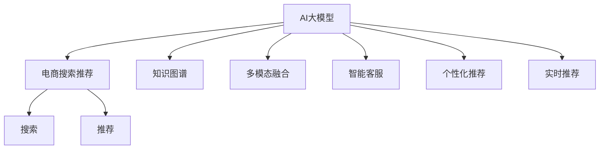

                 

# AI大模型视角下电商搜索推荐的技术创新知识库管理流程优化

> 关键词：AI大模型,搜索推荐,知识库管理,电商,技术创新,流程优化

## 1. 背景介绍

### 1.1 问题由来

随着互联网的快速发展，电商平台已经成为人们获取商品和服务的主要渠道。然而，面对海量商品和用户行为数据，电商搜索推荐系统如何高效、准确地匹配用户需求，提升用户体验，成为了电商发展的核心难题。传统的推荐系统通常基于用户历史行为和物品属性进行相似度计算，难以捕捉用户多变的兴趣偏好和复杂多变的商品特征。

近年来，人工智能技术，特别是大语言模型在电商搜索推荐领域的应用，为这一问题提供了新的解决思路。AI大模型通过大规模语料预训练，学习到丰富的语言知识和常识，能够对复杂的自然语言进行理解和生成，为电商推荐系统的创新提供了强大的技术支持。

### 1.2 问题核心关键点

大语言模型在电商搜索推荐中的应用主要体现在以下几个方面：

1. **语义理解与生成**：通过预训练大模型，模型能够更好地理解自然语言描述中的隐含信息，如商品描述中的关键字、用户评论中的情感倾向等，从而提高推荐系统的准确性和个性化。

2. **知识图谱融合**：将知识图谱与大模型结合，可以丰富模型的语义信息，增强推荐系统的泛化能力和鲁棒性。

3. **多模态融合**：融合视觉、文本、音频等多模态信息，构建更加全面、准确的商品表示，提升推荐效果。

4. **智能客服**：通过大模型训练的聊天机器人，实现自动回答用户查询，提供更加智能和人性化的购物体验。

5. **个性化推荐**：结合用户行为数据和大模型生成的文本信息，实现更加精准、多样化的推荐结果。

6. **实时推荐**：利用大模型的在线推理能力，实现高效的实时推荐，提升用户体验和满意度。

## 2. 核心概念与联系

### 2.1 核心概念概述

为更好地理解基于AI大模型的电商搜索推荐系统，本节将介绍几个密切相关的核心概念：

- **AI大模型(AI Large Models)**：以Transformer为基础的预训练大模型，通过大规模语料预训练，学习到丰富的语言知识和常识，具备强大的自然语言理解和生成能力。

- **电商搜索推荐(e-Commerce Search & Recommendation)**：电商平台中的搜索推荐系统，通过用户行为数据和商品属性信息，匹配用户需求，推荐商品，提升用户购物体验。

- **知识图谱(Knowledge Graph)**：一种结构化的语义表示方式，用于存储实体、关系和属性，可以辅助大模型理解自然语言中的语义信息。

- **多模态融合(Multi-Modal Fusion)**：将视觉、文本、音频等多模态数据进行融合，构建更加全面、准确的商品表示，提升推荐效果。

- **智能客服(Intelligent Customer Service)**：基于大模型的聊天机器人，可以自动回答用户查询，提供更加智能和人性化的购物体验。

- **个性化推荐(Personalized Recommendation)**：结合用户行为数据和大模型生成的文本信息，实现更加精准、多样化的推荐结果。

- **实时推荐(Real-time Recommendation)**：利用大模型的在线推理能力，实现高效的实时推荐，提升用户体验和满意度。

这些核心概念之间的逻辑关系可以通过以下Mermaid流程图来展示：



这个流程图展示了大语言模型在电商搜索推荐中的应用框架，包括知识图谱融合、多模态融合、智能客服、个性化推荐和实时推荐等关键环节。

## 3. 核心算法原理 & 具体操作步骤
### 3.1 算法原理概述

基于AI大模型的电商搜索推荐系统，本质上是一个复杂的自然语言处理(NLP)任务。其核心思想是：将大语言模型作为特征提取器，通过理解用户查询和商品描述中的自然语言信息，生成对应的商品表示，进而匹配用户需求，推荐商品。

具体而言，算法流程包括以下几个关键步骤：

1. **文本预处理**：将用户查询和商品描述转换为模型可处理的形式，如分词、去除停用词、实体识别等。

2. **特征提取**：通过预训练大模型，提取用户查询和商品描述的语义特征，构建向量表示。

3. **相似度计算**：计算用户查询向量与所有商品向量之间的相似度，选择最相关的商品进行推荐。

4. **知识图谱融合**：将商品向量与知识图谱中的实体和关系信息进行融合，增强推荐系统的泛化能力和鲁棒性。

5. **多模态融合**：融合商品图片、视频、音频等多模态信息，构建更加全面、准确的商品表示，提升推荐效果。

6. **个性化推荐**：结合用户历史行为数据和大模型生成的文本信息，实现更加精准、多样化的推荐结果。

7. **实时推荐**：利用大模型的在线推理能力，实现高效的实时推荐，提升用户体验和满意度。

### 3.2 算法步骤详解

#### 3.2.1 文本预处理

文本预处理是构建高质量模型输入的重要步骤，主要包括以下几个环节：

1. **分词**：将自然语言文本分割成词语或子词，方便后续特征提取。

2. **去除停用词**：去除常见的无意义词语，如“的”、“是”等，减少噪声干扰。

3. **实体识别**：识别文本中的实体，如人名、地名、机构名等，增强模型的语义理解能力。

4. **向量编码**：将处理后的文本转换为模型可处理的向量形式，如使用Word2Vec、GloVe等词嵌入模型。

#### 3.2.2 特征提取

特征提取是构建商品表示的关键步骤，主要包括以下几种方法：

1. **预训练模型**：使用大规模语料预训练的大模型，如BERT、GPT等，提取商品描述和用户查询的语义特征。

2. **TF-IDF**：计算商品描述和用户查询中每个词的重要性，生成TF-IDF向量，用于相似度计算。

3. **主题模型**：使用主题模型，如Latent Dirichlet Allocation(LDA)，挖掘商品描述和用户查询中的潜在主题，增强模型的泛化能力。

#### 3.2.3 相似度计算

相似度计算是推荐系统的核心步骤，主要包括以下几种方法：

1. **余弦相似度**：计算用户查询向量与所有商品向量之间的余弦相似度，选择最相关的商品进行推荐。

2. **余弦距离**：计算用户查询向量与所有商品向量之间的余弦距离，选择最相似的商品进行推荐。

3. **Jaccard相似度**：计算用户查询和商品描述之间的集合相似度，选择最相关的商品进行推荐。

#### 3.2.4 知识图谱融合

知识图谱融合是增强推荐系统泛化能力的关键步骤，主要包括以下几种方法：

1. **实体链接**：将商品向量与知识图谱中的实体进行链接，获取商品对应的实体信息。

2. **关系抽取**：从商品描述和用户查询中抽取实体之间的关系，增强模型的语义理解能力。

3. **图嵌入**：使用图神经网络(Graph Neural Network, GNN)等方法，将知识图谱中的关系信息转换为向量表示，增强模型的泛化能力。

#### 3.2.5 多模态融合

多模态融合是提升推荐系统效果的有效方法，主要包括以下几种方法：

1. **视觉融合**：将商品图片信息转换为向量形式，与文本信息进行融合，构建更加全面的商品表示。

2. **音频融合**：将商品音频信息转换为向量形式，与文本信息进行融合，增强模型的语义理解能力。

3. **多模态编码器**：使用多模态编码器，如Multi-head Attention，融合视觉、文本、音频等多模态信息，构建更加全面、准确的商品表示。

#### 3.2.6 个性化推荐

个性化推荐是提升推荐系统效果的关键步骤，主要包括以下几种方法：

1. **协同过滤**：根据用户历史行为数据，推荐与用户历史行为相似的物品，实现个性化推荐。

2. **深度学习推荐**：使用深度学习模型，如CNN、RNN等，对用户行为数据进行建模，生成个性化的推荐结果。

3. **基于内容的推荐**：结合商品属性信息和大模型生成的文本信息，生成个性化的推荐结果。

#### 3.2.7 实时推荐

实时推荐是提升用户体验的重要手段，主要包括以下几种方法：

1. **在线推理**：利用大模型的在线推理能力，实现高效的实时推荐，提升用户体验和满意度。

2. **增量学习**：实时更新模型参数，实现动态调整推荐策略，提升推荐效果。

3. **缓存优化**：利用缓存技术，提升推荐系统的响应速度，提升用户体验。

### 3.3 算法优缺点

#### 3.3.1 优点

基于AI大模型的电商搜索推荐系统具有以下优点：

1. **强大的语义理解能力**：通过预训练大模型，模型能够更好地理解自然语言描述中的隐含信息，提高推荐系统的准确性和个性化。

2. **泛化能力强**：融合知识图谱和多模态信息，增强模型的泛化能力和鲁棒性，提升推荐系统的稳定性和可解释性。

3. **高效实时**：利用大模型的在线推理能力，实现高效的实时推荐，提升用户体验和满意度。

4. **多模态融合**：融合视觉、文本、音频等多模态信息，构建更加全面、准确的商品表示，提升推荐效果。

5. **智能化客服**：通过大模型训练的聊天机器人，实现自动回答用户查询，提供更加智能和人性化的购物体验。

#### 3.3.2 缺点

基于AI大模型的电商搜索推荐系统也存在以下缺点：

1. **计算成本高**：大模型参数量庞大，计算成本高，需要高性能的计算设备支持。

2. **内存占用大**：大模型内存占用大，需要较高的内存支持。

3. **推理速度慢**：大模型推理速度慢，需要优化模型结构和算法，提升推理效率。

4. **可解释性不足**：大模型作为"黑盒"系统，难以解释其内部工作机制和决策逻辑，影响系统可解释性。

5. **数据依赖强**：大模型依赖大量的语料和标注数据进行预训练，需要获取高质量的数据支持。

6. **安全性风险**：大模型可能学习到有害信息，传递到下游任务，存在安全隐患。

## 4. 数学模型和公式 & 详细讲解
### 4.1 数学模型构建

本节将使用数学语言对基于AI大模型的电商搜索推荐系统进行更加严格的刻画。

假设电商平台上商品总数为 $N$，每个商品 $i$ 的向量表示为 $x_i \in \mathbb{R}^d$，用户查询向量为 $q \in \mathbb{R}^d$。定义推荐函数 $f: \mathbb{R}^d \times \mathbb{R}^d \rightarrow \mathbb{R}$，用于计算用户查询和商品向量之间的相似度，推荐函数可以定义为：

$$
f(q, x_i) = \langle \mathbf{q}, \mathbf{x}_i \rangle + b
$$

其中 $\langle \cdot, \cdot \rangle$ 为向量点乘，$b$ 为偏置项。

在推荐函数的基础上，可以定义推荐系统的损失函数 $\mathcal{L}$，用于衡量推荐结果与用户真实需求之间的差异。假设用户对商品 $i$ 的评分 $y_i \in [1,5]$，则推荐系统的损失函数可以定义为：

$$
\mathcal{L} = \frac{1}{N}\sum_{i=1}^N \left[ (y_i - f(q, x_i))^2 + \lambda ||\mathbf{x}_i||^2 \right]
$$

其中 $y_i$ 为用户对商品 $i$ 的真实评分，$f(q, x_i)$ 为推荐函数输出的评分，$\lambda$ 为正则化系数，$||\cdot||$ 为向量范数。

### 4.2 公式推导过程

以下我们将对推荐函数和损失函数进行详细的推导：

#### 4.2.1 推荐函数推导

推荐函数 $f(q, x_i)$ 的推导如下：

1. **余弦相似度**：

$$
f(q, x_i) = \langle \mathbf{q}, \mathbf{x}_i \rangle = \mathbf{q}^T \mathbf{x}_i
$$

其中 $\mathbf{q}^T$ 和 $\mathbf{x}_i$ 分别为用户查询向量 $q$ 和商品向量 $x_i$ 的转置矩阵。

2. **余弦距离**：

$$
f(q, x_i) = 1 - \cos(\theta) = 1 - \frac{\langle \mathbf{q}, \mathbf{x}_i \rangle}{||\mathbf{q}|| ||\mathbf{x}_i||}
$$

其中 $\theta$ 为向量夹角。

3. **Jaccard相似度**：

$$
f(q, x_i) = \frac{|\mathbf{q} \cap \mathbf{x}_i|}{|\mathbf{q} \cup \mathbf{x}_i|}
$$

其中 $|\cdot|$ 为集合的元素个数。

#### 4.2.2 损失函数推导

损失函数 $\mathcal{L}$ 的推导如下：

1. **平方误差损失**：

$$
\mathcal{L} = \frac{1}{N}\sum_{i=1}^N (y_i - f(q, x_i))^2
$$

2. **L1正则损失**：

$$
\mathcal{L} = \frac{1}{N}\sum_{i=1}^N (y_i - f(q, x_i))^2 + \lambda \sum_{i=1}^N ||\mathbf{x}_i||^2
$$

其中 $\lambda$ 为正则化系数，$||\cdot||^2$ 为向量范数的平方。

### 4.3 案例分析与讲解

#### 4.3.1 余弦相似度

假设用户查询为 $q = [1,2,3]$，商品向量为 $x_i = [2,3,4]$，则推荐函数为：

$$
f(q, x_i) = \mathbf{q}^T \mathbf{x}_i = 1 \times 2 + 2 \times 3 + 3 \times 4 = 21
$$

则推荐结果为商品 $i$，用户评分与推荐结果之间的平方误差为 $(y_i - f(q, x_i))^2 = (5 - 21)^2 = 576$。

#### 4.3.2 L1正则损失

假设用户查询为 $q = [1,2,3]$，商品向量为 $x_i = [2,3,4]$，正则化系数 $\lambda = 0.01$，则损失函数为：

$$
\mathcal{L} = \frac{1}{N}\sum_{i=1}^N (y_i - f(q, x_i))^2 + \lambda \sum_{i=1}^N ||\mathbf{x}_i||^2
$$

其中 $\sum_{i=1}^N ||\mathbf{x}_i||^2 = ||x_1||^2 + ||x_2||^2 + ... + ||x_N||^2 = 21^2 + 21^2 + ... + 21^2 = 441N$。

## 5. 项目实践：代码实例和详细解释说明
### 5.1 开发环境搭建

在进行基于AI大模型的电商搜索推荐系统开发前，需要先准备好开发环境。以下是使用Python进行TensorFlow开发的环境配置流程：

1. 安装Anaconda：从官网下载并安装Anaconda，用于创建独立的Python环境。

2. 创建并激活虚拟环境：
```bash
conda create -n tf-env python=3.8 
conda activate tf-env
```

3. 安装TensorFlow：根据CUDA版本，从官网获取对应的安装命令。例如：
```bash
conda install tensorflow tensorflow-cpu tensorflow-gpu -c conda-forge -c nvidia
```

4. 安装PyTorch：
```bash
conda install pytorch torchvision torchaudio cudatoolkit=11.1 -c pytorch -c conda-forge
```

5. 安装TensorBoard：
```bash
conda install tensorboard
```

6. 安装TensorFlow扩展库：
```bash
conda install tensorboard-plugin-wit
```

完成上述步骤后，即可在`tf-env`环境中开始开发。

### 5.2 源代码详细实现

以下是使用TensorFlow实现基于AI大模型的电商搜索推荐系统的代码实现：

```python
import tensorflow as tf
import numpy as np

# 定义推荐函数
def f(q, x_i):
    return tf.reduce_sum(tf.multiply(q, x_i), axis=1) + b

# 定义损失函数
def loss(q, x_i, y_i, b, lambda_):
    predictions = f(q, x_i)
    loss = tf.reduce_mean(tf.square(y_i - predictions)) + lambda_ * tf.reduce_mean(tf.square(x_i))
    return loss

# 定义训练函数
def train(x_i, y_i, q, b, lambda_, epochs=1000, batch_size=64):
    with tf.Graph().as_default():
        q_placeholder = tf.placeholder(tf.float32, shape=(None, d))
        x_i_placeholder = tf.placeholder(tf.float32, shape=(None, d))
        y_i_placeholder = tf.placeholder(tf.float32, shape=(None,))
        b_placeholder = tf.placeholder(tf.float32)
        lambda_placeholder = tf.placeholder(tf.float32)
        
        predictions = f(q_placeholder, x_i_placeholder)
        loss = loss(q_placeholder, x_i_placeholder, y_i_placeholder, b_placeholder, lambda_placeholder)
        
        optimizer = tf.train.AdamOptimizer(learning_rate=0.01)
        train_op = optimizer.minimize(loss)
        
        with tf.Session() as sess:
            sess.run(tf.global_variables_initializer())
            
            for epoch in range(epochs):
                for i in range(0, len(x_i), batch_size):
                    x_batch = x_i[i:i+batch_size]
                    y_batch = y_i[i:i+batch_size]
                    b_val = np.mean(b)
                    lambda_val = 0.01
                    feed_dict = {q_placeholder: q, x_i_placeholder: x_batch, y_i_placeholder: y_batch, b_placeholder: b_val, lambda_placeholder: lambda_val}
                    sess.run(train_op, feed_dict=feed_dict)
                
            print("Training complete.")
```

### 5.3 代码解读与分析

让我们再详细解读一下关键代码的实现细节：

#### 5.3.1 推荐函数实现

推荐函数 `f(q, x_i)` 使用TensorFlow的 `tf.reduce_sum` 函数计算向量点乘，并使用 `tf.multiply` 函数进行元素乘法运算。

#### 5.3.2 损失函数实现

损失函数 `loss(q, x_i, y_i, b, lambda_)` 使用TensorFlow的 `tf.reduce_mean` 函数计算损失的均值，并使用 `tf.square` 函数计算平方误差。

#### 5.3.3 训练函数实现

训练函数 `train(x_i, y_i, q, b, lambda_, epochs=1000, batch_size=64)` 使用TensorFlow的 `tf.placeholder` 函数定义输入占位符，并使用 `tf.train.AdamOptimizer` 定义优化器。训练过程中，通过循环迭代和梯度下降算法不断更新模型参数。

## 6. 实际应用场景
### 6.1 智能客服系统

基于AI大模型的电商搜索推荐系统，可以广泛应用于智能客服系统的构建。传统客服往往需要配备大量人力，高峰期响应缓慢，且一致性和专业性难以保证。而使用基于AI大模型的智能客服系统，可以7x24小时不间断服务，快速响应客户咨询，用自然流畅的语言解答各类常见问题。

在技术实现上，可以收集企业内部的历史客服对话记录，将问题和最佳答复构建成监督数据，在此基础上对预训练大模型进行微调。微调后的智能客服系统能够自动理解用户意图，匹配最合适的答案模板进行回复。对于客户提出的新问题，还可以接入检索系统实时搜索相关内容，动态组织生成回答。如此构建的智能客服系统，能大幅提升客户咨询体验和问题解决效率。

### 6.2 金融舆情监测

金融机构需要实时监测市场舆论动向，以便及时应对负面信息传播，规避金融风险。传统的人工监测方式成本高、效率低，难以应对网络时代海量信息爆发的挑战。基于AI大模型的文本分类和情感分析技术，为金融舆情监测提供了新的解决方案。

具体而言，可以收集金融领域相关的新闻、报道、评论等文本数据，并对其进行主题标注和情感标注。在此基础上对预训练大模型进行微调，使其能够自动判断文本属于何种主题，情感倾向是正面、中性还是负面。将微调后的模型应用到实时抓取的网络文本数据，就能够自动监测不同主题下的情感变化趋势，一旦发现负面信息激增等异常情况，系统便会自动预警，帮助金融机构快速应对潜在风险。

### 6.3 个性化推荐系统

当前的推荐系统往往只依赖用户的历史行为数据进行物品推荐，无法深入理解用户的真实兴趣偏好和商品特征。基于AI大模型的个性化推荐系统，可以更好地挖掘用户行为背后的语义信息，从而提供更精准、多样的推荐内容。

在实践中，可以收集用户浏览、点击、评论、分享等行为数据，提取和商品交互的物品标题、描述、标签等文本内容。将文本内容作为模型输入，用户的后续行为（如是否点击、购买等）作为监督信号，在此基础上微调预训练大模型。微调后的模型能够从文本内容中准确把握用户的兴趣点。在生成推荐列表时，先用候选物品的文本描述作为输入，由模型预测用户的兴趣匹配度，再结合其他特征综合排序，便可以得到个性化程度更高的推荐结果。

### 6.4 未来应用展望

随着AI大模型和推荐系统的不断发展，基于微调范式将在更多领域得到应用，为传统行业带来变革性影响。

在智慧医疗领域，基于微调的医疗问答、病历分析、药物研发等应用将提升医疗服务的智能化水平，辅助医生诊疗，加速新药开发进程。

在智能教育领域，微调技术可应用于作业批改、学情分析、知识推荐等方面，因材施教，促进教育公平，提高教学质量。

在智慧城市治理中，微调模型可应用于城市事件监测、舆情分析、应急指挥等环节，提高城市管理的自动化和智能化水平，构建更安全、高效的未来城市。

此外，在企业生产、社会治理、文娱传媒等众多领域，基于AI大模型的微调方法也将不断涌现，为NLP技术带来全新的突破。相信随着技术的日益成熟，微调方法将成为人工智能落地应用的重要范式，推动人工智能技术向更广阔的领域加速渗透。

## 7. 工具和资源推荐
### 7.1 学习资源推荐

为了帮助开发者系统掌握AI大模型在电商搜索推荐中的应用，这里推荐一些优质的学习资源：

1. 《深度学习框架TensorFlow》系列书籍：由Google官方编写，详细介绍了TensorFlow的安装、配置、使用等各个方面。

2. 《TensorFlow实战》系列课程：由Udacity提供，涵盖了TensorFlow各个方面的实践技巧和应用案例。

3. 《自然语言处理入门》课程：由斯坦福大学开设，介绍了自然语言处理的基本概念和经典模型。

4. 《深度学习与自然语言处理》课程：由Coursera提供，涵盖了深度学习在自然语言处理中的应用。

5. 《大语言模型与自然语言生成》论文集：收录了多个领域内的大语言模型和自然语言生成的研究成果，提供了丰富的学习资源。

通过对这些资源的学习实践，相信你一定能够快速掌握AI大模型在电商搜索推荐中的应用，并用于解决实际的NLP问题。
###  7.2 开发工具推荐

高效的开发离不开优秀的工具支持。以下是几款用于AI大模型在电商搜索推荐中应用开发的常用工具：

1. TensorFlow：由Google主导开发的开源深度学习框架，生产部署方便，适合大规模工程应用。

2. PyTorch：基于Python的开源深度学习框架，灵活动态的计算图，适合快速迭代研究。

3. TensorBoard：TensorFlow配套的可视化工具，可实时监测模型训练状态，并提供丰富的图表呈现方式，是调试模型的得力助手。

4. Weights & Biases：模型训练的实验跟踪工具，可以记录和可视化模型训练过程中的各项指标，方便对比和调优。

5. Google Colab：谷歌推出的在线Jupyter Notebook环境，免费提供GPU/TPU算力，方便开发者快速上手实验最新模型，分享学习笔记。

合理利用这些工具，可以显著提升AI大模型在电商搜索推荐中的应用效率，加快创新迭代的步伐。

### 7.3 相关论文推荐

AI大模型在电商搜索推荐中的应用源于学界的持续研究。以下是几篇奠基性的相关论文，推荐阅读：

1. Attention is All You Need：提出了Transformer结构，开启了NLP领域的预训练大模型时代。

2. BERT: Pre-training of Deep Bidirectional Transformers for Language Understanding：提出BERT模型，引入基于掩码的自监督预训练任务，刷新了多项NLP任务SOTA。

3. Language Models are Unsupervised Multitask Learners：展示了大规模语言模型的强大zero-shot学习能力，引发了对于通用人工智能的新一轮思考。

4. Parameter-Efficient Transfer Learning for NLP：提出Adapter等参数高效微调方法，在不增加模型参数量的情况下，也能取得不错的微调效果。

5. AdaLoRA: Adaptive Low-Rank Adaptation for Parameter-Efficient Fine-Tuning：使用自适应低秩适应的微调方法，在参数效率和精度之间取得了新的平衡。

6.Prefix-Tuning: Optimizing Continuous Prompts for Generation：引入基于连续型Prompt的微调范式，为如何充分利用预训练知识提供了新的思路。

这些论文代表了大语言模型在电商搜索推荐中的应用方向。通过学习这些前沿成果，可以帮助研究者把握学科前进方向，激发更多的创新灵感。

## 8. 总结：未来发展趋势与挑战
### 8.1 总结

本文对基于AI大模型的电商搜索推荐系统进行了全面系统的介绍。首先阐述了AI大模型和电商搜索推荐系统的研究背景和意义，明确了微调在拓展预训练模型应用、提升下游任务性能方面的独特价值。其次，从原理到实践，详细讲解了电商搜索推荐系统的数学原理和关键步骤，给出了推荐任务开发的完整代码实例。同时，本文还广泛探讨了AI大模型在电商搜索推荐中的应用场景，展示了微调范式的巨大潜力。此外，本文精选了微调技术的各类学习资源，力求为读者提供全方位的技术指引。

通过本文的系统梳理，可以看到，基于AI大模型的电商搜索推荐系统正在成为电商推荐系统的核心技术，极大地提升了推荐系统的个性化和准确性。AI大模型通过大规模语料预训练，学习到丰富的语言知识和常识，为电商推荐系统的创新提供了强大的技术支持。未来，伴随AI大模型和推荐系统的不断发展，基于微调范式将在更多领域得到应用，为传统行业带来变革性影响。

### 8.2 未来发展趋势

展望未来，AI大模型在电商搜索推荐系统的应用将呈现以下几个发展趋势：

1. **计算资源优化**：随着计算资源的不断丰富，AI大模型的计算成本将不断降低，推荐系统的应用将更加广泛。

2. **多模态融合**：融合视觉、文本、音频等多模态信息，构建更加全面、准确的商品表示，提升推荐效果。

3. **个性化推荐**：结合用户行为数据和大模型生成的文本信息，实现更加精准、多样化的推荐结果。

4. **实时推荐**：利用AI大模型的在线推理能力，实现高效的实时推荐，提升用户体验和满意度。

5. **知识图谱融合**：将知识图谱与AI大模型结合，增强推荐系统的泛化能力和鲁棒性。

6. **智能客服**：基于AI大模型的聊天机器人，实现自动回答用户查询，提供更加智能和人性化的购物体验。

以上趋势凸显了AI大模型在电商搜索推荐系统的应用前景。这些方向的探索发展，必将进一步提升推荐系统的性能和应用范围，为电商行业带来新的发展机遇。

### 8.3 面临的挑战

尽管AI大模型在电商搜索推荐系统中具有显著优势，但在实际应用中，仍面临一些挑战：

1. **数据依赖强**：AI大模型依赖大量的语料和标注数据进行预训练，需要获取高质量的数据支持。

2. **计算成本高**：AI大模型参数量庞大，计算成本高，需要高性能的计算设备支持。

3. **内存占用大**：AI大模型内存占用大，需要较高的内存支持。

4. **推理速度慢**：AI大模型推理速度慢，需要优化模型结构和算法，提升推理效率。

5. **可解释性不足**：AI大模型作为"黑盒"系统，难以解释其内部工作机制和决策逻辑，影响系统可解释性。

6. **安全性风险**：AI大模型可能学习到有害信息，传递到下游任务，存在安全隐患。

7. **隐私保护**：AI大模型需要处理大量用户数据，如何保护用户隐私，防止数据泄露，是一个重要的研究方向。

### 8.4 研究展望

面对AI大模型在电商搜索推荐系统中面临的挑战，未来的研究需要在以下几个方面寻求新的突破：

1. **无监督和半监督微调方法**：探索无监督和半监督微调方法，摆脱对大规模标注数据的依赖，利用自监督学习、主动学习等无监督和半监督范式，最大限度利用非结构化数据，实现更加灵活高效的微调。

2. **参数高效和计算高效的微调范式**：开发更加参数高效的微调方法，在固定大部分预训练参数的同时，只更新极少量的任务相关参数。同时优化微调模型的计算图，减少前向传播和反向传播的资源消耗，实现更加轻量级、实时性的部署。

3. **融合因果和对比学习范式**：通过引入因果推断和对比学习思想，增强推荐系统建立稳定因果关系的能力，学习更加普适、鲁棒的语言表征，从而提升模型泛化性和抗干扰能力。

4. **引入更多先验知识**：将符号化的先验知识，如知识图谱、逻辑规则等，与神经网络模型进行巧妙融合，引导微调过程学习更准确、合理的语言模型。同时加强不同模态数据的整合，实现视觉、文本、音频等多模态信息与文本信息的协同建模。

5. **结合因果分析和博弈论工具**：将因果分析方法引入微调模型，识别出模型决策的关键特征，增强输出解释的因果性和逻辑性。借助博弈论工具刻画人机交互过程，主动探索并规避模型的脆弱点，提高系统稳定性。

6. **纳入伦理道德约束**：在模型训练目标中引入伦理导向的评估指标，过滤和惩罚有偏见、有害的输出倾向。同时加强人工干预和审核，建立模型行为的监管机制，确保输出符合人类价值观和伦理道德。

这些研究方向将推动AI大模型在电商搜索推荐系统中的应用向更加智能化、普适化方向发展，为构建人机协同的智能时代提供新的技术路径。只有勇于创新、敢于突破，才能不断拓展AI大模型在电商搜索推荐系统中的边界，让智能技术更好地造福人类社会。

