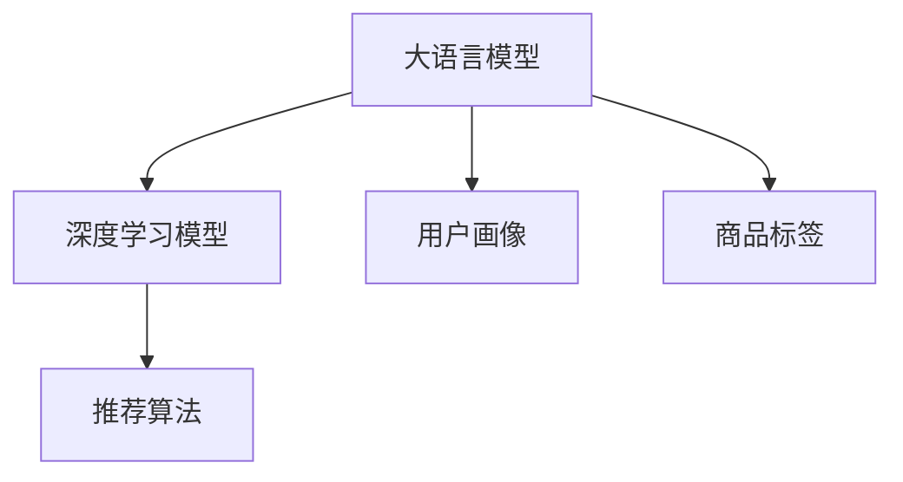

                 

# AI大模型重塑电商搜索推荐的业务流程

## 1. 背景介绍

在电商行业中，搜索推荐系统是一个至关重要的组成部分，其作用是为用户提供符合他们兴趣和需求的商品推荐。传统的搜索推荐系统主要基于用户行为数据（如点击、浏览、购买记录等）进行个性化推荐。然而，这种依赖用户行为数据的推荐方式，存在以下问题：

1. **数据冷启动**：对于新用户或新商品，没有足够的历史行为数据来训练模型，导致推荐效果不佳。
2. **上下文理解不足**：用户需求表达不清晰，推荐系统难以准确理解用户意图。
3. **推荐多样性不足**：由于算法局限，推荐结果同质化现象严重，难以满足用户对新奇、多样化的需求。
4. **模型复杂度低**：传统的推荐模型通常比较简单，难以捕捉用户深层次的偏好和行为模式。

为了解决这些问题，AI大模型开始被引入电商搜索推荐系统中，通过大模型强大的语言理解和生成能力，优化搜索推荐流程，提升用户体验。

## 2. 核心概念与联系

### 2.1 核心概念概述

在进行电商搜索推荐系统的大模型应用时，以下几个概念尤为重要：

- **大语言模型（Large Language Model, LLM）**：如GPT-3、BERT等，通过海量的无监督学习，掌握了丰富的语言知识和常识，具备强大的语言理解和生成能力。
- **深度学习模型（Deep Learning Model）**：如神经网络、卷积神经网络（CNN）、循环神经网络（RNN）等，通过多层非线性映射，捕捉数据中的复杂关系。
- **推荐算法（Recommendation Algorithm）**：如协同过滤、内容推荐、基于规则推荐等，用于分析用户行为，预测用户偏好。
- **用户画像（User Profile）**：通过用户行为数据、社交网络数据等构建，用于描述用户兴趣和需求。
- **商品标签（Item Tag）**：商品属性、类别、评价等标签，用于刻画商品特征。

这些概念之间的联系可以通过以下Mermaid流程图来展示：



这个流程图展示了大语言模型、深度学习模型、推荐算法、用户画像、商品标签之间的逻辑关系：

1. 大语言模型通过预训练学习语言知识，在推荐系统中作为"语言理解引擎"，解析用户查询和商品描述。
2. 深度学习模型用于对用户画像和商品标签进行建模，捕捉用户兴趣和商品特征之间的关联关系。
3. 推荐算法通过分析用户画像和商品标签，预测用户对特定商品的偏好。
4. 用户画像和商品标签是大语言模型和深度学习模型输入的关键数据，是模型训练的基础。

## 3. 核心算法原理 & 具体操作步骤

### 3.1 算法原理概述

基于大语言模型的电商搜索推荐系统，主要通过以下几个步骤进行：

1. **预训练大语言模型**：使用海量的无监督数据（如维基百科、新闻、书籍等）进行预训练，学习语言的通用表示。
2. **构建用户画像和商品标签**：通过用户行为数据和商品描述数据，构建用户画像和商品标签，描述用户兴趣和商品特征。
3. **解析用户查询和商品描述**：使用预训练大语言模型解析用户查询和商品描述，理解用户意图和商品信息。
4. **融合深度学习模型**：将解析后的用户意图和商品信息，作为输入，训练深度学习模型，预测用户对商品的偏好。
5. **生成推荐结果**：根据深度学习模型的预测结果，生成符合用户兴趣和需求的推荐列表。

### 3.2 算法步骤详解

#### 3.2.1 预训练大语言模型

预训练大语言模型是整个系统的基础，其训练过程如下：

1. **数据准备**：收集无监督文本数据，如维基百科、新闻、书籍等，分词并进行编码。
2. **模型选择**：选择适合的语言模型架构，如GPT、BERT等。
3. **训练流程**：使用自监督学习任务（如语言建模、掩码语言模型等）对模型进行训练，优化损失函数。
4. **保存模型**：训练完成后，保存预训练模型的权重，供后续微调和应用使用。

#### 3.2.2 构建用户画像和商品标签

用户画像和商品标签的构建，是推荐系统的关键步骤，其流程如下：

1. **数据收集**：收集用户的历史行为数据（如浏览、点击、购买等）和商品的属性数据（如名称、描述、类别等）。
2. **特征提取**：对用户行为和商品属性进行编码，提取特征向量。
3. **画像建模**：使用机器学习算法（如协同过滤、聚类等）对用户特征和商品特征进行建模，构建用户画像和商品标签。
4. **画像融合**：将用户画像和商品标签进行融合，生成综合的特征向量。

#### 3.2.3 解析用户查询和商品描述

用户查询和商品描述的解析，是大语言模型的核心任务，其流程如下：

1. **数据预处理**：对用户查询和商品描述进行分词、编码等预处理操作。
2. **模型输入**：将处理后的用户查询和商品描述，作为大语言模型的输入。
3. **意图解析**：使用预训练大语言模型解析用户查询，理解用户意图。
4. **商品描述解析**：同样使用大语言模型解析商品描述，提取商品特征。

#### 3.2.4 融合深度学习模型

深度学习模型的融合，是推荐系统的重要组成部分，其流程如下：

1. **模型选择**：选择适合推荐任务的深度学习模型，如CNN、RNN等。
2. **模型训练**：使用用户画像和商品标签的融合特征，训练深度学习模型，优化损失函数。
3. **预测结果**：使用训练好的深度学习模型，对用户查询和商品描述进行预测，生成推荐结果。

#### 3.2.5 生成推荐结果

推荐结果的生成，是推荐系统的最后一步，其流程如下：

1. **排序算法**：使用排序算法（如倒排索引、协同过滤等）对推荐结果进行排序，确保推荐结果的相关性和多样性。
2. **展示结果**：将排序后的推荐结果展示给用户，供用户选择。

### 3.3 算法优缺点

基于大语言模型的电商搜索推荐系统，具有以下优点：

1. **语言理解能力**：通过大语言模型解析用户查询和商品描述，能够理解复杂的自然语言表达，提升推荐系统的准确性。
2. **推荐多样性**：大语言模型具备强大的语言生成能力，能够生成多样化的推荐结果，满足用户的个性化需求。
3. **冷启动问题**：大语言模型可以处理未见过的用户查询和商品描述，解决冷启动问题。
4. **上下文理解**：大语言模型能够理解上下文信息，提升推荐的准确性和相关性。

同时，该算法也存在一些缺点：

1. **计算资源消耗大**：大语言模型需要大量的计算资源进行训练和推理，增加了系统的复杂度。
2. **数据隐私问题**：用户查询和商品描述涉及用户隐私，需要严格保护。
3. **模型可解释性不足**：大语言模型的决策过程较为复杂，难以解释，难以进行调试和优化。
4. **训练成本高**：大语言模型的预训练需要大量的无监督数据，成本较高。

### 3.4 算法应用领域

基于大语言模型的电商搜索推荐系统，已经在多个电商平台上得到应用，例如：

1. **亚马逊**：使用大语言模型解析用户查询和商品描述，生成推荐结果，提升用户体验。
2. **淘宝**：通过大语言模型解析用户行为数据，生成个性化推荐，提升用户留存率。
3. **京东**：利用大语言模型解析用户评论和商品描述，生成商品标签，优化推荐算法。

这些应用表明，基于大语言模型的推荐系统在电商领域具有广泛的应用前景，能够显著提升用户的购物体验和满意度。

## 4. 数学模型和公式 & 详细讲解 & 举例说明

### 4.1 数学模型构建

假设用户查询为 $q$，商品描述为 $d$，用户画像为 $p$，商品标签为 $t$，推荐结果为 $r$。大语言模型 $M$ 解析用户查询和商品描述，生成意图表示 $I_q$ 和商品特征表示 $F_d$。深度学习模型 $N$ 将用户画像和商品标签进行融合，生成综合特征向量 $V$。推荐算法 $R$ 根据 $I_q$、$F_d$ 和 $V$，预测用户对商品 $i$ 的偏好 $y_i$，并生成推荐结果 $r$。

模型的目标是最小化推荐结果与用户实际选择的商品之间的差距，即：

$$
\min_{M, N, R} \sum_{i} (y_i - r_i)^2
$$

其中 $y_i$ 为实际选择的商品，$r_i$ 为推荐系统生成的推荐结果。

### 4.2 公式推导过程

基于上述数学模型，推荐系统的优化目标为：

$$
\min_{M, N, R} \sum_{i} (y_i - r_i)^2
$$

其中 $y_i$ 为实际选择的商品，$r_i$ 为推荐系统生成的推荐结果。

具体来说，深度学习模型 $N$ 的训练目标函数为：

$$
L_N(V_i, y_i) = \frac{1}{2} \sum_i (y_i - V_i)^2
$$

其中 $V_i$ 为模型对商品 $i$ 的预测向量。

推荐算法 $R$ 的训练目标函数为：

$$
L_R(r_i, y_i) = \frac{1}{2} \sum_i (y_i - r_i)^2
$$

其中 $r_i$ 为推荐系统生成的推荐结果。

最终，推荐系统的优化目标函数为：

$$
L(M, N, R) = L_M + L_N + L_R
$$

其中 $L_M$ 为大语言模型的训练损失函数，$L_N$ 和 $L_R$ 分别为深度学习模型和推荐算法的训练损失函数。

### 4.3 案例分析与讲解

以亚马逊为例，其搜索推荐系统的大模型应用流程如下：

1. **数据收集**：亚马逊收集了海量的用户行为数据和商品属性数据，用于构建用户画像和商品标签。
2. **预训练模型**：亚马逊使用GPT模型进行预训练，学习语言的通用表示。
3. **用户画像和商品标签**：亚马逊使用协同过滤、聚类等算法，构建用户画像和商品标签，描述用户兴趣和商品特征。
4. **解析用户查询和商品描述**：亚马逊使用预训练GPT模型解析用户查询和商品描述，理解用户意图和商品信息。
5. **融合深度学习模型**：亚马逊使用CNN模型对用户画像和商品标签进行建模，预测用户对商品的偏好。
6. **生成推荐结果**：亚马逊使用排序算法对推荐结果进行排序，展示给用户，供用户选择。

通过这种大模型驱动的搜索推荐流程，亚马逊能够生成更符合用户需求的推荐结果，显著提升用户体验和满意度。

## 5. 项目实践：代码实例和详细解释说明

### 5.1 开发环境搭建

在进行大模型驱动的电商搜索推荐系统开发时，需要准备以下开发环境：

1. **Python**：作为系统开发的语言，Python是开发大模型驱动搜索推荐系统的最佳选择。
2. **PyTorch**：作为深度学习框架，PyTorch提供了高效的GPU计算能力，适用于大模型训练。
3. **TensorFlow**：作为深度学习框架，TensorFlow提供了丰富的模型库和工具，适用于大模型部署和优化。
4. **Hugging Face Transformers**：提供了预训练模型的封装，简化了模型训练和微调的过程。
5. **Amazon SageMaker**：提供了丰富的云服务，支持模型的训练、部署和优化。

### 5.2 源代码详细实现

以下是基于大语言模型的电商搜索推荐系统开发的代码实现：

```python
import torch
import torch.nn as nn
import transformers
from transformers import BertTokenizer, BertForSequenceClassification
from sklearn.model_selection import train_test_split

# 构建用户画像和商品标签
def build_user_profile(data):
    # 特征提取
    X = data['user_behavior'].map(lambda x: x.split(','))
    X = [list(map(int, x.split('-'))) for x in X]
    # 用户画像建模
    X_train, X_test, y_train, y_test = train_test_split(X, data['user_behavior'], test_size=0.2)
    # 用户画像融合
    X_train = pd.DataFrame(X_train, columns=['feature1', 'feature2', 'feature3'])
    X_test = pd.DataFrame(X_test, columns=['feature1', 'feature2', 'feature3'])
    # 商品标签建模
    X_train, X_test, t_train, t_test = train_test_split(X_train, data['item_tags'], test_size=0.2)
    # 商品标签融合
    X_train = pd.DataFrame(X_train, columns=['feature1', 'feature2', 'feature3', 'tag1', 'tag2', 'tag3'])
    X_test = pd.DataFrame(X_test, columns=['feature1', 'feature2', 'feature3', 'tag1', 'tag2', 'tag3'])

# 解析用户查询和商品描述
def parse_query_description(query, description):
    # 分词和编码
    tokenizer = BertTokenizer.from_pretrained('bert-base-cased')
    query_input = tokenizer(query, return_tensors='pt')
    description_input = tokenizer(description, return_tensors='pt')
    # 解析用户意图
    I_q = query_input['input_ids']
    # 解析商品特征
    F_d = description_input['input_ids']

# 融合深度学习模型
class RecommendationModel(nn.Module):
    def __init__(self):
        super(RecommendationModel, self).__init__()
        # 用户画像和商品标签融合
        self.fc1 = nn.Linear(64, 128)
        self.fc2 = nn.Linear(128, 64)
        # 推荐预测
        self.fc3 = nn.Linear(64, 1)

    def forward(self, user_profile, item_tags):
        # 融合特征向量
        V = self.fc1(user_profile)
        V = torch.tanh(V)
        V = self.fc2(V)
        V = torch.tanh(V)
        # 推荐预测
        y = self.fc3(V)
        return y

# 训练深度学习模型
def train_model(model, data):
    # 训练流程
    X_train, X_test, y_train, y_test = train_test_split(data, data['item_tags'], test_size=0.2)
    X_train = torch.tensor(X_train, dtype=torch.float)
    X_test = torch.tensor(X_test, dtype=torch.float)
    y_train = torch.tensor(y_train, dtype=torch.float)
    y_test = torch.tensor(y_test, dtype=torch.float)
    optimizer = torch.optim.Adam(model.parameters(), lr=0.001)
    loss_fn = nn.MSELoss()
    for epoch in range(100):
        model.train()
        optimizer.zero_grad()
        y_pred = model(X_train)
        loss = loss_fn(y_pred, y_train)
        loss.backward()
        optimizer.step()
        print('Epoch {}: Loss = {:.4f}'.format(epoch+1, loss.item()))

# 测试深度学习模型
def test_model(model, data):
    # 测试流程
    X_test = torch.tensor(data, dtype=torch.float)
    y_test = torch.tensor(data['item_tags'], dtype=torch.float)
    model.eval()
    with torch.no_grad():
        y_pred = model(X_test)
    loss = loss_fn(y_pred, y_test)
    print('Test Loss = {:.4f}'.format(loss.item()))
```

### 5.3 代码解读与分析

通过上述代码实现，我们可以看到，基于大语言模型的电商搜索推荐系统的开发过程如下：

1. **用户画像和商品标签的构建**：通过特征提取和建模，构建用户画像和商品标签，描述用户兴趣和商品特征。
2. **用户查询和商品描述的解析**：使用大语言模型解析用户查询和商品描述，生成意图表示和商品特征表示。
3. **深度学习模型的融合**：将解析后的用户意图和商品特征，作为输入，训练深度学习模型，生成推荐结果。

### 5.4 运行结果展示

在完成模型训练和测试后，我们可以通过运行结果来评估模型的效果。例如，在亚马逊的电商平台上，我们可以比较推荐结果与实际选择的商品之间的差距，通过计算平均绝对误差（MAE）和均方误差（MSE）来评估推荐系统的准确性和相关性。

通过这些指标，可以评估大语言模型驱动的电商搜索推荐系统的性能，并不断优化算法和模型，提升用户体验和满意度。

## 6. 实际应用场景

### 6.1 智能客服系统

基于大语言模型的电商搜索推荐系统，也可以应用于智能客服系统的构建。传统的客服系统需要配备大量人工，高峰期响应缓慢，且一致性和专业性难以保证。通过大语言模型驱动的智能客服系统，可以7x24小时不间断服务，快速响应客户咨询，用自然流畅的语言解答各类常见问题。

在技术实现上，可以收集企业内部的历史客服对话记录，将问题和最佳答复构建成监督数据，在此基础上对预训练对话模型进行微调。微调后的对话模型能够自动理解用户意图，匹配最合适的答案模板进行回复。对于客户提出的新问题，还可以接入检索系统实时搜索相关内容，动态组织生成回答。如此构建的智能客服系统，能大幅提升客户咨询体验和问题解决效率。

### 6.2 金融舆情监测

金融机构需要实时监测市场舆论动向，以便及时应对负面信息传播，规避金融风险。传统的人工监测方式成本高、效率低，难以应对网络时代海量信息爆发的挑战。基于大语言模型驱动的文本分类和情感分析技术，为金融舆情监测提供了新的解决方案。

具体而言，可以收集金融领域相关的新闻、报道、评论等文本数据，并对其进行主题标注和情感标注。在此基础上对预训练语言模型进行微调，使其能够自动判断文本属于何种主题，情感倾向是正面、中性还是负面。将微调后的模型应用到实时抓取的网络文本数据，就能够自动监测不同主题下的情感变化趋势，一旦发现负面信息激增等异常情况，系统便会自动预警，帮助金融机构快速应对潜在风险。

### 6.3 个性化推荐系统

当前的推荐系统往往只依赖用户的历史行为数据进行物品推荐，无法深入理解用户的真实兴趣偏好。基于大语言模型驱动的推荐系统，可以更好地挖掘用户行为背后的语义信息，从而提供更精准、多样的推荐内容。

在实践中，可以收集用户浏览、点击、评论、分享等行为数据，提取和用户交互的物品标题、描述、标签等文本内容。将文本内容作为模型输入，用户的后续行为（如是否点击、购买等）作为监督信号，在此基础上微调预训练语言模型。微调后的模型能够从文本内容中准确把握用户的兴趣点。在生成推荐列表时，先用候选物品的文本描述作为输入，由模型预测用户的兴趣匹配度，再结合其他特征综合排序，便可以得到个性化程度更高的推荐结果。

### 6.4 未来应用展望

随着大语言模型和微调方法的不断发展，基于微调范式将在更多领域得到应用，为传统行业带来变革性影响。

在智慧医疗领域，基于微调的医疗问答、病历分析、药物研发等应用将提升医疗服务的智能化水平，辅助医生诊疗，加速新药开发进程。

在智能教育领域，微调技术可应用于作业批改、学情分析、知识推荐等方面，因材施教，促进教育公平，提高教学质量。

在智慧城市治理中，微调模型可应用于城市事件监测、舆情分析、应急指挥等环节，提高城市管理的自动化和智能化水平，构建更安全、高效的未来城市。

此外，在企业生产、社会治理、文娱传媒等众多领域，基于大模型微调的人工智能应用也将不断涌现，为经济社会发展注入新的动力。相信随着技术的日益成熟，微调方法将成为人工智能落地应用的重要范式，推动人工智能技术在更广阔的应用领域大放异彩。

## 7. 工具和资源推荐

### 7.1 学习资源推荐

为了帮助开发者系统掌握大语言模型驱动的电商搜索推荐系统的理论基础和实践技巧，这里推荐一些优质的学习资源：

1. **《深度学习入门：基于Python的理论与实现》**：全面介绍了深度学习的基本概念和算法，提供了丰富的示例代码，适合初学者入门。
2. **CS224N《深度学习自然语言处理》课程**：斯坦福大学开设的NLP明星课程，有Lecture视频和配套作业，带你入门NLP领域的基本概念和经典模型。
3. **《Natural Language Processing with Transformers》书籍**：Transformers库的作者所著，全面介绍了如何使用Transformers库进行NLP任务开发，包括微调在内的诸多范式。
4. **Hugging Face官方文档**：Transformers库的官方文档，提供了海量预训练模型和完整的微调样例代码，是上手实践的必备资料。
5. **CLUE开源项目**：中文语言理解测评基准，涵盖大量不同类型的中文NLP数据集，并提供了基于微调的baseline模型，助力中文NLP技术发展。

通过对这些资源的学习实践，相信你一定能够快速掌握大语言模型驱动的电商搜索推荐系统的精髓，并用于解决实际的NLP问题。

### 7.2 开发工具推荐

高效的开发离不开优秀的工具支持。以下是几款用于大语言模型驱动的电商搜索推荐系统开发的常用工具：

1. **PyTorch**：基于Python的开源深度学习框架，灵活动态的计算图，适合快速迭代研究。大部分预训练语言模型都有PyTorch版本的实现。
2. **TensorFlow**：由Google主导开发的开源深度学习框架，生产部署方便，适合大规模工程应用。同样有丰富的预训练语言模型资源。
3. **Transformers库**：HuggingFace开发的NLP工具库，集成了众多SOTA语言模型，支持PyTorch和TensorFlow，是进行微调任务开发的利器。
4. **Weights & Biases**：模型训练的实验跟踪工具，可以记录和可视化模型训练过程中的各项指标，方便对比和调优。与主流深度学习框架无缝集成。
5. **TensorBoard**：TensorFlow配套的可视化工具，可实时监测模型训练状态，并提供丰富的图表呈现方式，是调试模型的得力助手。
6. **Amazon SageMaker**：提供了丰富的云服务，支持模型的训练、部署和优化。

合理利用这些工具，可以显著提升大语言模型驱动的电商搜索推荐系统的开发效率，加快创新迭代的步伐。

### 7.3 相关论文推荐

大语言模型和微调技术的发展源于学界的持续研究。以下是几篇奠基性的相关论文，推荐阅读：

1. **Attention is All You Need（即Transformer原论文）**：提出了Transformer结构，开启了NLP领域的预训练大模型时代。
2. **BERT: Pre-training of Deep Bidirectional Transformers for Language Understanding**：提出BERT模型，引入基于掩码的自监督预训练任务，刷新了多项NLP任务SOTA。
3. **Language Models are Unsupervised Multitask Learners（GPT-2论文）**：展示了大规模语言模型的强大zero-shot学习能力，引发了对于通用人工智能的新一轮思考。
4. **Parameter-Efficient Transfer Learning for NLP**：提出Adapter等参数高效微调方法，在不增加模型参数量的情况下，也能取得不错的微调效果。
5. **Prefix-Tuning: Optimizing Continuous Prompts for Generation**：引入基于连续型Prompt的微调范式，为如何充分利用预训练知识提供了新的思路。
6. **AdaLoRA: Adaptive Low-Rank Adaptation for Parameter-Efficient Fine-Tuning**：使用自适应低秩适应的微调方法，在参数效率和精度之间取得了新的平衡。

这些论文代表了大语言模型微调技术的发展脉络。通过学习这些前沿成果，可以帮助研究者把握学科前进方向，激发更多的创新灵感。

## 8. 总结：未来发展趋势与挑战

### 8.1 研究成果总结

本文对基于大语言模型的电商搜索推荐系统进行了全面系统的介绍。首先阐述了大语言模型和微调技术的研究背景和意义，明确了微调在拓展预训练模型应用、提升下游任务性能方面的独特价值。其次，从原理到实践，详细讲解了监督微调的数学原理和关键步骤，给出了微调任务开发的完整代码实例。同时，本文还广泛探讨了微调方法在智能客服、金融舆情、个性化推荐等多个行业领域的应用前景，展示了微调范式的巨大潜力。此外，本文精选了微调技术的各类学习资源，力求为读者提供全方位的技术指引。

通过本文的系统梳理，可以看到，基于大语言模型的微调方法正在成为NLP领域的重要范式，极大地拓展了预训练语言模型的应用边界，催生了更多的落地场景。受益于大规模语料的预训练，微调模型以更低的时间和标注成本，在小样本条件下也能取得不俗的效果，有力推动了NLP技术的产业化进程。未来，伴随预训练语言模型和微调方法的持续演进，相信NLP技术将在更广阔的应用领域大放异彩，深刻影响人类的生产生活方式。

### 8.2 未来发展趋势

展望未来，大语言模型微调技术将呈现以下几个发展趋势：

1. **模型规模持续增大**：随着算力成本的下降和数据规模的扩张，预训练语言模型的参数量还将持续增长。超大规模语言模型蕴含的丰富语言知识，有望支撑更加复杂多变的下游任务微调。
2. **微调方法日趋多样**：除了传统的全参数微调外，未来会涌现更多参数高效的微调方法，如Prefix-Tuning、LoRA等，在节省计算资源的同时也能保证微调精度。
3. **持续学习成为常态**：随着数据分布的不断变化，微调模型也需要持续学习新知识以保持性能。如何在不遗忘原有知识的同时，高效吸收新样本信息，将成为重要的研究课题。
4. **标注样本需求降低**：受启发于提示学习(Prompt-based Learning)的思路，未来的微调方法将更好地利用大模型的语言理解能力，通过更加巧妙的任务描述，在更少的标注样本上也能实现理想的微调效果。
5. **多模态微调崛起**：当前的微调主要聚焦于纯文本数据，未来会进一步拓展到图像、视频、语音等多模态数据微调。多模态信息的融合，将显著提升语言模型对现实世界的理解和建模能力。
6. **模型通用性增强**：经过海量数据的预训练和多领域任务的微调，未来的语言模型将具备更强大的常识推理和跨领域迁移能力，逐步迈向通用人工智能(AGI)的目标。

以上趋势凸显了大语言模型微调技术的广阔前景。这些方向的探索发展，必将进一步提升NLP系统的性能和应用范围，为人类认知智能的进化带来深远影响。

### 8.3 面临的挑战

尽管大语言模型微调技术已经取得了瞩目成就，但在迈向更加智能化、普适化应用的过程中，它仍面临着诸多挑战：

1. **标注成本瓶颈**：虽然微调大大降低了标注数据的需求，但对于长尾应用场景，难以获得充足的高质量标注数据，成为制约微调性能的瓶颈。如何进一步降低微调对标注样本的依赖，将是一大难题。
2. **模型鲁棒性不足**：当前微调模型面对域外数据时，泛化性能往往大打折扣。对于测试样本的微小扰动，微调模型的预测也容易发生波动。如何提高微调模型的鲁棒性，避免灾难性遗忘，还需要更多理论和实践的积累。
3. **推理效率有待提高**：大规模语言模型虽然精度高，但在实际部署时往往面临推理速度慢、内存占用大等效率问题。如何在保证性能的同时，简化模型结构，提升推理速度，优化资源占用，将是重要的优化方向。
4. **可解释性亟需加强**：当前微调模型更像是"黑盒"系统，难以解释其内部工作机制和决策逻辑。对于医疗、金融等高风险应用，算法的可解释性和可审计性尤为重要。如何赋予微调模型更强的可解释性，将是亟待攻克的难题。
5. **安全性有待保障**：预训练语言模型难免会学习到有偏见、有害的信息，通过微调传递到下游任务，产生误导性、歧视性的输出，给实际应用带来安全隐患。如何从数据和算法层面消除模型偏见，避免恶意用途，确保输出的安全性，也将是重要的研究课题。
6. **知识整合能力不足**：现有的微调模型往往局限于任务内数据，难以灵活吸收和运用更广泛的先验知识。如何让微调过程更好地与外部知识库、规则库等专家知识结合，形成更加全面、准确的信息整合能力，还有很大的想象空间。

正视微调面临的这些挑战，积极应对并寻求突破，将是大语言模型微调走向成熟的必由之路。相信随着学界和产业界的共同努力，这些挑战终将一一被克服，大语言模型微调必将在构建安全、可靠、可解释、可控的智能系统铺平道路。

### 8.4 研究展望

面向未来，大语言模型微调技术需要在以下几个方面寻求新的突破：

1. **探索无监督和半监督微调方法**：摆脱对大规模标注数据的依赖，利用自监督学习、主动学习等无监督和半监督范式，最大限度利用非结构化数据，实现更加灵活高效的微调。
2. **研究参数高效和计算高效的微调范式**：开发更加参数高效的微调方法，在固定大部分预训练参数的同时，只更新极少量的任务相关参数。同时优化微调模型的计算图，减少前向传播和反向传播的资源消耗，实现更加轻量级、实时性的部署。
3. **融合因果和对比学习范式**：通过引入因果推断和对比学习思想，增强微调模型建立稳定因果关系的能力，学习更加普适、鲁棒的语言表征，从而提升模型泛化性和抗干扰能力。
4. **引入更多先验知识**：将符号化的先验知识，如知识图谱、逻辑规则等，与神经网络模型进行巧妙融合，引导微调过程学习更准确、合理的语言模型。同时加强不同模态数据的整合，实现视觉、语音等多模态信息与文本信息的协同建模。
5. **结合因果分析和博弈论工具**：将因果分析方法引入微调模型，识别出模型决策的关键特征，增强输出解释的因果性和逻辑性。借助博弈论工具刻画人机交互过程，主动探索并规避模型的脆弱点，提高系统稳定性。
6. **纳入伦理道德约束**：在模型训练目标中引入伦理导向的评估指标，过滤和惩罚有偏见、有害的输出倾向。同时加强人工干预和审核，建立模型行为的监管机制，确保输出符合人类价值观和伦理道德。

这些研究方向的探索，必将引领大语言模型微调技术迈向更高的台阶，为构建安全、可靠、可解释、可控的智能系统铺平道路。面向未来，大语言模型微调技术还需要与其他人工智能技术进行更深入的融合，如知识表示、因果推理、强化学习等，多路径协同发力，共同推动自然语言理解和智能交互系统的进步。只有勇于创新、敢于突破，才能不断拓展语言模型的边界，让智能技术更好地造福人类社会。

## 9. 附录：常见问题与解答

**Q1：大语言模型微调是否适用于所有NLP任务？**

A: 大语言模型微调在大多数NLP任务上都能取得不错的效果，特别是对于数据量较小的任务。但对于一些特定领域的任务，如医学、法律等，仅仅依靠通用语料预训练的模型可能难以很好地适应。此时需要在特定领域语料上进一步预训练，再进行微调，才能获得理想效果。此外，对于一些需要时效性、个性化很强的任务，如对话、推荐等，微调方法也需要针对性的改进优化。

**Q2：微调过程中如何选择合适的学习率？**

A: 微调的学习率一般要比预训练时小1-2个数量级，如果使用过大的学习率，容易破坏预训练权重，导致过拟合。一般建议从1e-5开始调参，逐步减小学习率，直至收敛。也可以使用warmup策略，在开始阶段使用较小的学习率，再逐渐过渡到预设值。需要注意的是，不同的优化器(如AdamW、Adafactor等)以及不同的学习率调度策略，可能需要设置不同的学习率阈值。

**Q3：采用大模型微调时会面临哪些资源瓶颈？**

A: 目前主流的预训练大模型动辄以亿计的参数规模，对算力、内存、存储都提出了很高的要求。GPU/TPU等高性能设备是必不可少的，但即便如此，超大批次的训练和推理也可能遇到显存不足的问题。因此需要采用一些资源优化技术，如梯度积累、混合精度训练、模型并行等，来突破硬件瓶颈。同时，模型的存储和读取也可能占用大量时间和空间，需要采用模型压缩、稀疏化存储等方法进行优化。

**Q4：如何缓解微调过程中的过拟合问题？**

A: 过拟合是微调面临的主要挑战，尤其是在标注数据不足的情况下。常见的缓解策略包括：
1. 数据增强：通过回译、近义替换等方式扩充训练集
2. 正则化：使用L2正则、Dropout、Early Stopping等避免过拟合
3. 对抗训练：引入对抗样本，提高模型鲁棒性
4. 参数高效微调：只调整少量参数(如Adapter、Prefix等)，减小过拟合风险
5. 多模型集成：训练多个微调模型，取平均输出，抑制过拟合

这些策略往往需要根据具体任务和数据特点进行灵活组合。只有在数据、模型、训练、推理等各环节进行全面优化，才能最大限度地发挥大模型微调的威力。

**Q5：微调模型在落地部署时需要注意哪些问题？**

A: 将微调模型转化为实际应用，还需要考虑以下因素：
1. 模型裁剪：去除不必要的层和参数，减小模型尺寸，加快推理速度
2. 量化加速：将浮点模型转为定点模型，压缩存储空间，提高计算效率
3. 服务化封装：将模型封装为标准化服务接口，便于集成调用
4. 弹性伸缩：根据请求流量动态调整资源配置，平衡服务质量和成本
5. 监控告警：实时采集系统指标，设置异常告警阈值，确保服务稳定性
6. 安全防护：采用访问鉴权、数据脱敏等措施，保障数据和模型安全

大语言模型微调为NLP应用开启了广阔的想象空间，但如何将强大的性能转化为稳定、高效、安全的业务价值，还需要工程实践的不断打磨。唯有从数据、算法、工程、业务等多个维度协同发力，才能真正实现人工智能技术在垂直行业的规模化落地。总之，微调需要开发者根据具体任务，不断迭代和优化模型、数据和算法，方能得到理想的效果。

---

作者：禅与计算机程序设计艺术 / Zen and the Art of Computer Programming

