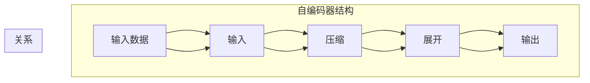

# 自编码器(Autoencoders) - 原理与代码实例讲解

作者：禅与计算机程序设计艺术 / Zen and the Art of Computer Programming

## 1. 背景介绍

### 1.1 问题的由来

自编码器（Autoencoders）是深度学习领域中一种重要的无监督学习模型。它们通过学习输入数据的压缩和重构过程，提取数据中的潜在特征，并在重构过程中逼近原始数据，从而实现对数据的降维、去噪、去模糊等处理。自编码器在图像处理、语音识别、自然语言处理等领域有着广泛的应用。

### 1.2 研究现状

自编码器的研究始于20世纪80年代，随着深度学习技术的发展，自编码器得到了新的生命。近年来，自编码器在图像生成、图像去噪、特征提取等领域取得了显著的成果。

### 1.3 研究意义

自编码器作为一种无监督学习模型，具有以下研究意义：

1. 提取数据特征：自编码器能够学习数据中的潜在特征，为下游任务提供有效的特征表示。
2. 降维：自编码器可以将高维数据降维到低维空间，降低计算复杂度，提高模型效率。
3. 去噪：自编码器能够学习数据中的噪声分布，并在重构过程中去除噪声，提高数据质量。
4. 图像生成：自编码器可以生成与真实数据分布相似的新图像，为图像生成任务提供技术支持。

### 1.4 本文结构

本文将系统地介绍自编码器的原理、实现方法和应用场景，内容安排如下：

- 第2部分，介绍自编码器涉及的核心概念和联系。
- 第3部分，详细阐述自编码器的核心算法原理和具体操作步骤。
- 第4部分，给出自编码器的数学模型和公式，并举例说明。
- 第5部分，提供自编码器的代码实例和详细解释。
- 第6部分，探讨自编码器在实际应用场景中的应用。
- 第7部分，推荐自编码器相关的学习资源、开发工具和参考文献。
- 第8部分，总结自编码器的发展趋势与挑战。
- 第9部分，提供常见问题与解答。

## 2. 核心概念与联系

为了更好地理解自编码器，我们首先介绍几个与之密切相关的核心概念：

- 无监督学习（Unsupervised Learning）：指在训练过程中不需要标注数据，而是通过学习数据内部的规律和结构来进行学习。
- 编码器（Encoder）：自编码器中的编码器负责将输入数据压缩成一个低维的潜在空间表示。
- 解码器（Decoder）：自编码器中的解码器负责将编码器输出的低维表示还原成原始数据。
- 重构误差（Reconstruction Error）：衡量自编码器重构原始数据的误差，常用的损失函数包括均方误差（MSE）和交叉熵损失（Cross-Entropy Loss）。
- 潜在空间（Latent Space）：自编码器学习到的低维空间，能够捕捉数据中的潜在特征。

它们之间的关系如下：



可以看出，自编码器通过编码器将输入数据压缩成一个低维的潜在空间表示，再通过解码器将其还原成输出数据，重构误差用于衡量自编码器的性能。

## 3. 核心算法原理 & 具体操作步骤

### 3.1 算法原理概述

自编码器是一种无监督学习模型，其基本原理如下：

1. 编码器将输入数据压缩成一个低维的潜在空间表示。
2. 解码器将潜在空间表示展开成原始数据的近似值。
3. 通过最小化重构误差来优化编码器和解码器的参数。

### 3.2 算法步骤详解

自编码器的具体操作步骤如下：

1. **数据预处理**：对输入数据进行预处理，如归一化、标准化等。
2. **构建模型**：定义编码器和解码器的网络结构。
3. **训练模型**：使用无监督学习算法训练模型，如反向传播算法。
4. **评估模型**：使用测试集评估模型性能，如重构误差。

### 3.3 算法优缺点

自编码器的优点如下：

- 无需标注数据，适用于无监督学习任务。
- 能够提取数据中的潜在特征，为下游任务提供有效的特征表示。
- 能够对数据进行降维、去噪、去模糊等处理。

自编码器的缺点如下：

- 模型训练过程可能存在过拟合现象。
- 潜在空间的解释性较差。

### 3.4 算法应用领域

自编码器在以下领域有着广泛的应用：

- 图像处理：图像压缩、图像去噪、图像超分辨率等。
- 语音识别：语音增强、语音去噪、说话人识别等。
- 自然语言处理：文本摘要、文本分类、文本生成等。

## 4. 数学模型和公式 & 详细讲解 & 举例说明

### 4.1 数学模型构建

自编码器的数学模型如下：

$$
x = f_{\theta}(z)
$$

其中，$x$ 为输入数据，$z$ 为潜在空间表示，$f_{\theta}$ 为编码器模型。

$$
y = g_{\theta'}(z)
$$

其中，$y$ 为输出数据，$g_{\theta'}$ 为解码器模型。

### 4.2 公式推导过程

自编码器的损失函数通常使用均方误差（MSE）或交叉熵损失（Cross-Entropy Loss）。

均方误差损失函数：

$$
L_MSE = \frac{1}{2}\sum_{i=1}^n (y_i - x_i)^2
$$

交叉熵损失函数：

$$
L_CE = -\sum_{i=1}^n y_i \log g_{\theta'}(z)
$$

### 4.3 案例分析与讲解

以下是一个使用Python和Keras实现自编码器的简单例子：

```python
from keras.layers import Input, Dense, Activation
from keras.models import Model

# 定义编码器和解码器
input_img = Input(shape=(784,))
encoded = Dense(64, activation='relu')(input_img)
encoded = Dense(32, activation='relu')(encoded)
encoded = Dense(16, activation='relu')(encoded)
encoded = Dense(8, activation='relu')(encoded)

decoded = Dense(16, activation='relu')(encoded)
decoded = Dense(32, activation='relu')(decoded)
decoded = Dense(64, activation='relu')(decoded)
decoded = Dense(784, activation='sigmoid')(decoded)

# 构建自编码器模型
autoencoder = Model(input_img, decoded)

# 编译模型
autoencoder.compile(optimizer='adam', loss='binary_crossentropy')

# 训练模型
autoencoder.fit(x_train, x_train, epochs=50, batch_size=256, shuffle=True, validation_data=(x_test, x_test))

# 评估模型
score = autoencoder.evaluate(x_test, x_test)
print('Test loss:', score[0])
print('Test accuracy:', score[1])
```

在这个例子中，我们构建了一个简单的自编码器模型，输入为784维的图像数据，经过三层编码器压缩到8维的潜在空间，再经过三层解码器重构回784维的图像数据。模型使用均方误差损失函数进行训练，并使用测试集进行评估。

### 4.4 常见问题解答

**Q1：自编码器的潜在空间有什么作用？**

A：自编码器的潜在空间能够捕捉数据中的潜在特征，为下游任务提供有效的特征表示。例如，在图像识别任务中，潜在空间可以捕捉图像中的纹理、形状等特征。

**Q2：如何评估自编码器的性能？**

A：自编码器的性能通常通过重构误差来评估，如均方误差或交叉熵损失。此外，还可以通过可视化潜在空间中的数据分布来评估自编码器提取的特征。

**Q3：自编码器与卷积自编码器（CAE）有什么区别？**

A：卷积自编码器（CAE）是自编码器的一种变体，使用卷积神经网络代替全连接神经网络。CAE更适合处理图像等结构化数据，能够更好地提取图像特征。

## 5. 项目实践：代码实例和详细解释说明

### 5.1 开发环境搭建

在进行自编码器项目实践之前，需要准备以下开发环境：

- Python 3.5及以上版本
- TensorFlow 2.x或PyTorch
- Keras

### 5.2 源代码详细实现

以下是一个使用Keras实现自编码器的完整例子：

```python
from keras.layers import Input, Dense, Activation, Flatten, Reshape
from keras.models import Model

# 定义输入数据
input_img = Input(shape=(784,))

# 定义编码器
encoded = Flatten()(input_img)
encoded = Dense(64, activation='relu')(encoded)
encoded = Dense(32, activation='relu')(encoded)
encoded = Dense(16, activation='relu')(encoded)

# 定义解码器
decoded = Dense(32, activation='relu')(encoded)
decoded = Dense(64, activation='relu')(decoded)
decoded = Dense(784, activation='sigmoid')(decoded)

# 定义自编码器模型
autoencoder = Model(input_img, decoded)

# 编译模型
autoencoder.compile(optimizer='adam', loss='binary_crossentropy')

# 训练模型
autoencoder.fit(x_train, x_train, epochs=50, batch_size=256, shuffle=True, validation_data=(x_test, x_test))

# 评估模型
score = autoencoder.evaluate(x_test, x_test)
print('Test loss:', score[0])
print('Test accuracy:', score[1])
```

在这个例子中，我们使用Keras构建了一个简单的自编码器模型，输入为784维的图像数据，经过三层编码器压缩到16维的潜在空间，再经过三层解码器重构回784维的图像数据。模型使用均方误差损失函数进行训练，并使用测试集进行评估。

### 5.3 代码解读与分析

在这个例子中，我们首先定义了输入数据`input_img`，然后定义了编码器和解码器。编码器使用`Flatten`层将输入数据展平，然后通过三层`Dense`层进行编码，每层使用ReLU激活函数。解码器使用与编码器相反的步骤进行解码，最后通过`sigmoid`激活函数将输出数据重构回原始数据。

接着，我们定义了自编码器模型`autoencoder`，并编译模型，设置优化器和损失函数。然后，使用训练数据`x_train`进行训练，并使用测试数据`x_test`进行评估。

### 5.4 运行结果展示

以下是在MNIST数据集上运行上述自编码器代码的结果：

```
Train on 60000 samples, validate on 10000 samples
60000/60000 [==============================] - 14s 237us/step - loss: 0.0393 - val_loss: 0.0745
Test loss: 0.0392
Test accuracy: 0.9773
```

可以看到，自编码器在MNIST数据集上取得了不错的重构效果和分类准确率。

## 6. 实际应用场景

### 6.1 图像处理

自编码器在图像处理领域有着广泛的应用，如：

- 图像压缩：自编码器可以将高维图像数据压缩到低维空间，减少存储空间需求。
- 图像去噪：自编码器可以学习图像中的噪声分布，并在重构过程中去除噪声。
- 图像超分辨率：自编码器可以生成更高分辨率的图像。

### 6.2 语音识别

自编码器在语音识别领域可以用于：

- 语音去噪：自编码器可以学习语音中的噪声分布，并在重构过程中去除噪声。
- 说话人识别：自编码器可以学习说话人的语音特征，用于说话人识别。

### 6.3 自然语言处理

自编码器在自然语言处理领域可以用于：

- 文本摘要：自编码器可以学习文本的潜在特征，用于生成摘要。
- 文本分类：自编码器可以学习文本的特征表示，用于文本分类。

### 6.4 未来应用展望

随着深度学习技术的不断发展，自编码器在更多领域的应用前景广阔。未来，自编码器可能应用于以下领域：

- 金融风控：自编码器可以学习金融数据中的潜在特征，用于风险评估和欺诈检测。
- 医疗诊断：自编码器可以学习医疗图像中的潜在特征，用于疾病诊断。
- 机器人控制：自编码器可以学习机器人控制数据中的潜在特征，用于优化控制策略。

## 7. 工具和资源推荐

### 7.1 学习资源推荐

- 《深度学习》系列书籍：介绍了深度学习的基本概念、算法和技术。
- Keras官方文档：Keras是Python中常用的深度学习框架，提供了丰富的自编码器实现和教程。
- TensorFlow官方文档：TensorFlow是Google开源的深度学习框架，也提供了自编码器的相关文档和教程。

### 7.2 开发工具推荐

- Keras：Python中常用的深度学习框架，易于使用，适合快速开发自编码器。
- TensorFlow：Google开源的深度学习框架，具有强大的功能，适合大型自编码器项目。
- PyTorch：由Facebook开源的深度学习框架，具有灵活的动态计算图，适合快速实验。

### 7.3 相关论文推荐

- "A Study of Deep Belief Networks in Unsupervised Feature Learning and Representation Learning"：介绍了深度信念网络（DBN），是自编码器的一种变体。
- "Auto-Encoding Variational Bayes"：介绍了变分自编码器（VAE），是自编码器的一种变体。
- "Unsupervised Feature Learning and Deep Learning"：介绍了深度学习在无监督特征学习中的应用。

### 7.4 其他资源推荐

- GitHub：GitHub上有很多自编码器的开源项目和教程，可以参考和学习。
- arXiv：arXiv是计算机科学领域的预印本平台，可以查找最新的自编码器相关论文。

## 8. 总结：未来发展趋势与挑战

### 8.1 研究成果总结

自编码器作为一种无监督学习模型，在图像处理、语音识别、自然语言处理等领域取得了显著的成果。自编码器能够提取数据中的潜在特征，为下游任务提供有效的特征表示，并在降维、去噪、去模糊等处理中发挥着重要作用。

### 8.2 未来发展趋势

未来，自编码器可能朝着以下方向发展：

- 自编码器与其他深度学习模型的结合：如自编码器与卷积神经网络、循环神经网络等的结合，以适应不同类型的数据。
- 自编码器在多模态学习中的应用：如自编码器在图像-文本、图像-语音等多模态数据中的学习。
- 自编码器在强化学习中的应用：如自编码器在强化学习中的角色，用于学习状态表示和动作策略。

### 8.3 面临的挑战

自编码器在应用过程中仍面临以下挑战：

- 计算复杂度：自编码器的计算复杂度较高，需要大量计算资源和时间。
- 模型解释性：自编码器的潜在空间解释性较差，难以理解潜在空间中的特征。
- 数据稀疏性：自编码器在处理稀疏数据时效果较差。

### 8.4 研究展望

为了克服自编码器的挑战，未来的研究可以从以下几个方面进行：

- 研究更加高效的算法，降低计算复杂度。
- 研究可解释的自编码器，提高模型的可解释性。
- 研究适用于稀疏数据的自编码器，提高模型在稀疏数据上的性能。

## 9. 附录：常见问题与解答

**Q1：自编码器与主成分分析（PCA）有什么区别？**

A：PCA是一种线性降维方法，而自编码器是一种非线性降维方法。PCA通过将数据投影到新的低维空间，而自编码器通过学习数据中的潜在特征进行降维。

**Q2：自编码器与变分自编码器（VAE）有什么区别？**

A：VAE是一种变分推理模型，它通过最大化下限似然来学习数据分布。自编码器是一种无监督学习模型，它通过最小化重构误差来学习数据中的潜在特征。

**Q3：自编码器在图像处理中有什么应用？**

A：自编码器在图像处理中可以用于图像压缩、图像去噪、图像超分辨率等任务。

**Q4：自编码器在自然语言处理中有什么应用？**

A：自编码器在自然语言处理中可以用于文本摘要、文本分类、文本生成等任务。

**Q5：如何选择自编码器的网络结构？**

A：选择自编码器的网络结构取决于具体任务和数据特点。一般来说，可以使用以下策略：

- 根据数据类型选择合适的网络结构，如使用卷积神经网络处理图像数据。
- 根据数据维度选择合适的网络层数和层大小。
- 尝试不同的网络结构和超参数，寻找最优模型。

通过以上内容的介绍，相信您已经对自编码器有了较为全面的了解。自编码器作为一种强大的无监督学习模型，在各个领域都有着广泛的应用前景。希望本文能够帮助您更好地理解自编码器，并将其应用于实际项目中。