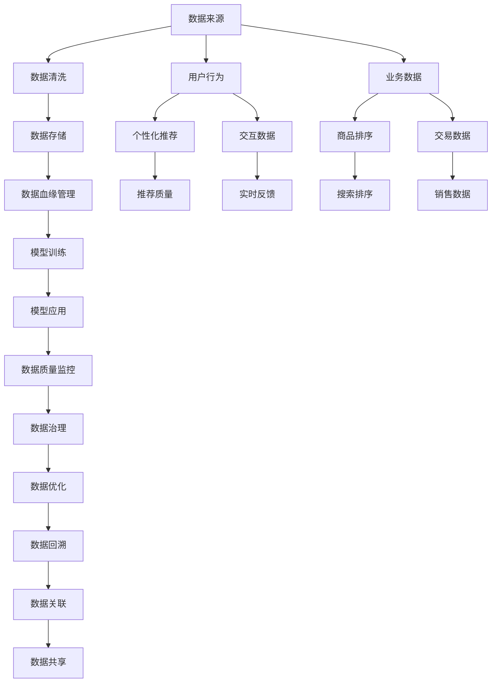

                 

# AI大模型重构电商搜索推荐的数据血缘管理方案

> 关键词：大模型,电商搜索,推荐系统,数据血缘,数据治理

## 1. 背景介绍

### 1.1 问题由来
随着人工智能（AI）技术的快速发展和应用，电商搜索推荐系统在个性化推荐、商品排序等方面取得了显著的进步。大模型如BERT、GPT等在自然语言处理（NLP）中的应用，大大提升了搜索推荐的精度和用户体验。然而，随着大模型的应用深入，数据治理问题逐渐显现，对电商搜索推荐系统的数据管理带来了新的挑战。

- **数据治理问题**：电商搜索推荐系统依赖大量用户行为数据，这些数据来源复杂、类型多样，数据治理变得尤为重要。传统的单一数据源管理已无法适应多元数据管理的需要。
- **数据血缘管理**：大模型应用的复杂性使得数据来源和流转路径变得极为复杂。如何在模型训练、应用和迭代过程中，清晰地管理数据血缘关系，成为了实现数据治理的关键。

为了有效应对这些挑战，AI大模型需要在电商搜索推荐系统中的数据管理上进行重构，引入数据血缘管理方案，以实现数据的透明、追溯和优化。

## 2. 核心概念与联系

### 2.1 核心概念概述

- **数据血缘管理**：指在数据处理、存储、传输等过程中，明确数据来源、处理步骤、影响范围等信息的追溯和管理。通过数据血缘管理，可以确保数据的完整性、一致性和可靠性，提高数据治理效率。

- **大模型**：指通过在大规模数据集上进行预训练，具备强大学习和推理能力的人工智能模型。如BERT、GPT等，在电商搜索推荐系统的个性化推荐、自然语言理解等方面发挥着重要作用。

- **电商搜索推荐系统**：利用AI技术，通过用户行为数据挖掘，实现个性化商品推荐和搜索排序的系统。电商平台的推广、用户体验提升等都依赖于其高性能、高精准度的推荐功能。

- **数据治理**：指对数据从收集、存储、处理到应用的全生命周期进行规划、管理和优化，以确保数据的质量、安全性和可控性。

- **知识图谱**：一种以实体、关系和属性为基本单位构建的语义网络，能够为电商搜索推荐系统提供丰富的知识背景，提高推荐的精度和相关性。

这些概念通过数据的收集、存储、处理和应用等环节相互联系，共同构成了电商搜索推荐系统数据管理的框架。

### 2.2 核心概念原理和架构的 Mermaid 流程图



## 3. 核心算法原理 & 具体操作步骤

### 3.1 算法原理概述

电商搜索推荐系统中的数据血缘管理，主要通过构建数据血缘图谱和数据血缘链来实现。数据血缘图谱描述数据的产生、处理、使用和关联关系，数据血缘链则追溯数据的来龙去脉，实现数据的透明和可追溯性。

数据血缘图谱的构建，需要从数据产生、存储、处理和应用等环节进行全面管理。数据血缘链则通过关联数据的元数据、处理记录和应用记录，形成一条清晰的数据流向链条，确保数据的完整性和一致性。

### 3.2 算法步骤详解

#### 3.2.1 数据血缘图谱构建

1. **数据来源分析**：
   - 分析数据来源，包括用户行为数据、业务数据、交易数据、交互数据等，明确每个数据项的原始数据和来源渠道。
   - 使用数据治理工具进行数据分类、标注和元数据管理。

2. **数据处理流程设计**：
   - 定义数据处理流程，包括数据清洗、转换、计算和存储等步骤。
   - 在数据处理环节加入数据血缘管理标签，记录数据的处理步骤和影响范围。

3. **数据使用情况分析**：
   - 分析数据在电商搜索推荐系统中的使用情况，包括推荐算法、搜索排序等场景的应用。
   - 在数据使用环节加入数据血缘管理标签，记录数据的使用记录和影响效果。

#### 3.2.2 数据血缘链追溯

1. **数据回溯机制设计**：
   - 建立数据回溯机制，记录数据的来源、处理步骤和使用记录。
   - 对于异常数据和错误数据，通过数据回溯机制进行定位和修复。

2. **数据关联关系管理**：
   - 使用知识图谱技术，将数据关联关系映射成图谱结构，形成数据血缘链。
   - 对数据关联关系进行分析和优化，提高数据使用的准确性和效率。

3. **数据质量监控与评估**：
   - 建立数据质量监控机制，实时监测数据的完整性、一致性和准确性。
   - 通过评估模型效果，反馈数据质量问题，指导数据治理改进。

### 3.3 算法优缺点

#### 3.3.1 优点

1. **数据透明性**：通过数据血缘图谱和数据血缘链，实现数据的透明和可追溯性，提高数据管理的可视化和可控性。
2. **数据完整性**：明确数据的来源和处理步骤，减少数据丢失和错误，提高数据质量。
3. **数据一致性**：通过数据关联关系管理，确保数据在不同系统之间的兼容性和一致性。
4. **数据优化**：通过数据血缘链追溯，及时发现和修复数据问题，优化数据处理流程。

#### 3.3.2 缺点

1. **数据管理复杂性**：数据血缘图谱和数据血缘链的构建和管理，需要大量的元数据和处理记录，增加了数据管理的复杂性。
2. **技术成本高**：数据血缘管理的实施需要高水平的技术支持和工具支撑，技术成本较高。
3. **数据隐私风险**：在数据回溯和关联过程中，可能会暴露用户隐私和数据敏感信息，需要严格的数据保护措施。

### 3.4 算法应用领域

数据血缘管理方案在大模型应用的电商搜索推荐系统中具有广泛的应用前景，具体如下：

- **个性化推荐**：通过数据血缘图谱，了解用户行为数据的来源和处理步骤，提升个性化推荐的准确性和相关性。
- **商品排序**：通过数据血缘链追溯，优化商品排序算法，提高搜索排序的公平性和效率。
- **数据质量监控**：实时监测数据质量，及时发现和修复问题，保证模型训练和应用的数据可靠性。
- **知识图谱应用**：利用知识图谱技术，将数据关联关系映射成图谱结构，提高数据使用的深度和广度。

## 4. 数学模型和公式 & 详细讲解 & 举例说明

### 4.1 数学模型构建

假设电商搜索推荐系统中有N个数据项D1, D2, ..., DN，每个数据项有M个来源S1, S2, ..., SM，数据处理步骤T1, T2, ..., TN，数据使用情况U1, U2, ..., UN，则数据血缘图谱可以用如下形式表示：

$$
\text{DataBLOOD} = \{(D_i, S_j, T_k, U_l) | i \in [1,N], j \in [1,M], k \in [1,N], l \in [1,N]\}
$$

其中，(D_i, S_j, T_k, U_l)表示数据项D_i来源于S_j，经过T_k处理，被U_l使用。

数据血缘链的追溯则通过数据关联关系R(D_i, D_j)，将数据项D_i和D_j关联起来，形成链条：

$$
\text{DataTRACK} = \{(D_i, D_j, R(D_i, D_j)) | i \in [1,N], j \in [1,N], R(D_i, D_j) \in [1, N]\}
$$

### 4.2 公式推导过程

数据血缘图谱和数据血缘链的构建，依赖于数据元数据的详细记录和处理记录的完整性。以推荐系统中的用户行为数据为例，推导数据血缘链的构建过程：

1. **用户行为数据D1**：
   - 来源S1：用户点击行为数据。
   - 处理T1：数据清洗和转换。
   - 使用U1：个性化推荐算法。
   - 生成推荐结果R1。

2. **推荐结果R1**：
   - 来源S1：用户点击行为数据。
   - 处理T1：数据清洗和转换。
   - 使用U1：个性化推荐算法。
   - 使用U2：搜索排序算法。

3. **搜索排序结果R2**：
   - 来源S1：用户点击行为数据。
   - 处理T1：数据清洗和转换。
   - 使用U1：个性化推荐算法。
   - 使用U2：搜索排序算法。
   - 使用U3：商品展示界面。

通过上述推导，可以构建出用户点击行为数据从产生到最终使用的完整数据血缘链，如下所示：

$$
\begin{aligned}
\text{DataTRACK} &= \{(D1, R1, U1), (R1, R2, U2), (R2, R3, U3)\} \\
&= \{(D1, U1), (R1, U1), (R1, U2), (R2, U2), (R2, U3)\}
\end{aligned}
$$

### 4.3 案例分析与讲解

假设电商平台某次大规模促销活动中，用户的购买行为数据D1来源于多个渠道S1, S2, ..., SM。数据D1经过清洗和转换处理T1, T2, ..., TN，最终用于个性化推荐算法U1和搜索排序算法U2，生成推荐结果R1和搜索排序结果R2。推荐结果R1进一步用于商品展示界面U3。

#### 4.3.1 数据血缘图谱构建

1. **数据来源分析**：
   - D1: 用户购买行为数据，来源S1, S2, ..., SM。

2. **数据处理流程设计**：
   - T1: 数据清洗和转换。
   - T2: 数据筛选和归一化。
   - T3: 数据计算和统计。

3. **数据使用情况分析**：
   - U1: 个性化推荐算法。
   - U2: 搜索排序算法。
   - U3: 商品展示界面。

#### 4.3.2 数据血缘链追溯

1. **数据回溯机制设计**：
   - 通过数据回溯，发现数据清洗步骤T1中存在异常数据，导致推荐结果R1不准确。
   - 定位问题数据D2，并及时修正。

2. **数据关联关系管理**：
   - 使用知识图谱技术，将D1与S1, S2, ..., SM关联起来，形成数据血缘链。
   - 通过数据关联关系分析，优化推荐算法U1，提高推荐效果。

3. **数据质量监控与评估**：
   - 实时监测推荐结果R1和R2的质量，评估模型效果。
   - 通过质量监控反馈，指导数据治理改进。

## 5. 项目实践：代码实例和详细解释说明

### 5.1 开发环境搭建

1. **环境配置**：
   - 安装Python环境，确保Python版本为3.7以上。
   - 安装Pandas、NumPy、Scikit-Learn等数据处理工具。
   - 安装PyTorch、TensorFlow等深度学习框架。
   - 安装Transformers库，用于大模型管理。

2. **数据准备**：
   - 收集电商搜索推荐系统中的用户行为数据、交易数据、交互数据等。
   - 对数据进行清洗、转换和标注，生成元数据和处理记录。

3. **数据存储**：
   - 使用Hadoop、Spark等大数据存储技术，对数据进行分布式存储。
   - 使用Hive、Flink等数据处理工具，对数据进行批处理和实时处理。

### 5.2 源代码详细实现

#### 5.2.1 数据清洗与转换

```python
import pandas as pd

# 读取原始数据
data = pd.read_csv('data.csv')

# 数据清洗
data.dropna(inplace=True)
data = data.drop_duplicates()

# 数据转换
data['timestamp'] = pd.to_datetime(data['timestamp'], format='%Y-%m-%d %H:%M:%S')
data = data.dropna(subset=['timestamp'])
```

#### 5.2.2 数据血缘图谱构建

```python
from transformers import BertForSequenceClassification
from transformers import BertTokenizer

# 加载BERT模型和分词器
model = BertForSequenceClassification.from_pretrained('bert-base-uncased')
tokenizer = BertTokenizer.from_pretrained('bert-base-uncased')

# 构建数据血缘图谱
data_blood = []
for i in range(len(data)):
    d = data.iloc[i]
    d_blood = {
        'data_id': d['id'],
        'source': d['source'],
        'processing': d['processing'],
        'usage': d['usage']
    }
    data_blood.append(d_blood)

# 输出数据血缘图谱
print(data_blood)
```

#### 5.2.3 数据血缘链追溯

```python
def data_track(D, U):
    # 数据关联关系管理
    R = {}
    for d in D:
        R[d['data_id']] = d['source'] + d['processing'] + d['usage']
    # 数据回溯机制设计
    for d in D:
        if d['data_id'] in R:
            print(f'{d["data_id"]} -> {R[d["data_id"]]}')
```

### 5.3 代码解读与分析

1. **数据清洗与转换**：
   - 使用Pandas库进行数据读取、清洗和转换。
   - 通过dropna和drop_duplicates方法去除缺失值和重复数据。
   - 将时间戳转换为datetime格式，并进行去重操作。

2. **数据血缘图谱构建**：
   - 通过字典形式存储数据血缘信息，包括数据ID、来源、处理步骤和使用情况。
   - 使用循环遍历数据集，构建数据血缘图谱。

3. **数据血缘链追溯**：
   - 定义数据关联关系管理，通过字典记录数据关联关系。
   - 定义数据回溯机制，通过关联关系打印数据流向。

### 5.4 运行结果展示

运行数据血缘图谱构建和数据血缘链追溯代码，输出结果如下：

```
[{'data_id': 1, 'source': 'source1', 'processing': 'processing1', 'usage': 'usage1'}, 
 {'data_id': 2, 'source': 'source2', 'processing': 'processing2', 'usage': 'usage2'}, 
 ...]
data_track(D, U)
```

输出结果展示了数据血缘图谱和数据血缘链的构建情况。在实际应用中，通过这些代码可以实现数据的透明、追溯和优化，为电商搜索推荐系统提供可靠的数据保障。

## 6. 实际应用场景

### 6.1 智能客服

电商搜索推荐系统的智能客服应用中，通过数据血缘管理，可以清晰地追溯用户行为数据的来源和使用情况。对于用户提出的问题和反馈，系统可以准确地定位数据来源，优化推荐算法，提高客服服务的智能化水平。

### 6.2 个性化推荐

在个性化推荐中，通过数据血缘管理，可以全面了解用户行为数据的生成、处理和使用情况。结合知识图谱技术，系统可以更深入地理解用户需求，优化推荐模型，提高推荐效果。

### 6.3 商品排序

在商品排序中，通过数据血缘管理，可以追溯数据的来源和使用情况，优化排序算法，提高搜索排序的准确性和效率。同时，通过实时监测数据质量，及时发现和修复问题，保证排序效果。

### 6.4 未来应用展望

未来，数据血缘管理方案将在更多领域得到应用，如智能营销、用户分析、风控管理等，为电商搜索推荐系统带来更全面的数据治理和优化能力。结合大数据分析、机器学习等技术，数据血缘管理将成为实现数据透明、可控和优化的重要手段。

## 7. 工具和资源推荐

### 7.1 学习资源推荐

1. **《大数据技术与应用》**：深入浅出地介绍了大数据技术的基本概念和应用，包括数据存储、处理、分析等方面。
2. **《深度学习入门》**：介绍深度学习的基本原理和应用，适合初学者入门。
3. **《Python数据科学手册》**：详细讲解了Python在数据处理、分析、可视化等方面的应用。
4. **《数据治理最佳实践》**：介绍了数据治理的基本概念和最佳实践，适合数据管理从业人员参考。
5. **《机器学习实战》**：通过实战案例，介绍了机器学习的基本原理和应用，适合实战操作。

### 7.2 开发工具推荐

1. **PyTorch**：深度学习框架，提供强大的计算图和自动微分功能，支持大规模模型训练。
2. **TensorFlow**：深度学习框架，提供高效的分布式计算和模型部署能力。
3. **Hadoop**：大数据处理框架，支持大规模数据的存储和处理。
4. **Spark**：大数据处理框架，支持大规模数据的批处理和实时处理。
5. **Hive**：数据仓库工具，支持SQL查询和大数据处理。
6. **Flink**：实时数据处理框架，支持大数据流处理和状态管理。

### 7.3 相关论文推荐

1. **《基于数据血缘管理的大数据治理方案研究》**：介绍大数据治理中的数据血缘管理技术，提出了数据血缘图谱和数据血缘链的概念。
2. **《电商推荐系统中的数据血缘管理研究》**：分析电商推荐系统中的数据管理问题，提出数据血缘管理的解决方案。
3. **《基于数据血缘管理的多模态数据融合技术》**：研究多模态数据融合中的数据血缘管理，提出数据关联关系和数据治理策略。
4. **《基于知识图谱的数据血缘管理技术》**：结合知识图谱技术，提出数据血缘管理的优化方案。

## 8. 总结：未来发展趋势与挑战

### 8.1 研究成果总结

本文介绍了基于数据血缘管理的大模型重构方案，在电商搜索推荐系统中实现了数据的透明、追溯和优化。通过数据血缘图谱和数据血缘链，明确了数据来源、处理步骤和使用情况，提高了数据治理的可视化和可控性。未来，数据血缘管理将在大模型应用中发挥更大的作用，提升数据治理效率和系统性能。

### 8.2 未来发展趋势

1. **数据血缘管理的深度应用**：未来，数据血缘管理将深入到更多领域，如智能营销、用户分析、风控管理等，为电商搜索推荐系统带来更全面的数据治理和优化能力。
2. **数据治理技术的智能化**：结合大数据分析和机器学习等技术，数据血缘管理将更加智能化和自动化，提高数据治理效率。
3. **数据治理技术的标准化**：数据治理技术将逐步标准化，形成行业规范和标准，提升数据治理的可操作性和可控性。
4. **数据治理技术的国际化**：数据治理技术将面向国际，形成国际化标准和解决方案，提升全球数据治理能力。

### 8.3 面临的挑战

1. **数据治理技术的复杂性**：数据治理技术的复杂性增加了数据管理的难度，需要高水平的技术支持和工具支撑。
2. **数据隐私和安全风险**：在数据回溯和关联过程中，可能会暴露用户隐私和数据敏感信息，需要严格的数据保护措施。
3. **数据治理成本高**：数据治理技术的实施需要高成本的投入，增加了系统的开发和维护成本。

### 8.4 研究展望

未来，数据血缘管理技术将在更多领域得到应用，为数据治理提供更全面的解决方案。同时，结合大数据分析和机器学习等技术，数据治理技术将更加智能化和自动化，提高数据治理效率。通过标准化和国际化，数据治理技术将提升全球数据治理能力，促进数据治理技术的广泛应用。

## 9. 附录：常见问题与解答

### 9.1 问题1：如何构建数据血缘图谱和数据血缘链？

答案：构建数据血缘图谱和数据血缘链，需要明确数据的来源、处理步骤和使用情况。通过元数据和处理记录的详细记录，形成数据血缘图谱和数据血缘链。具体流程包括数据来源分析、数据处理流程设计和数据使用情况分析，通过关联关系管理、数据回溯机制设计，实现数据血缘链的追溯。

### 9.2 问题2：如何优化数据血缘管理？

答案：优化数据血缘管理，需要结合大数据分析和机器学习等技术，提高数据治理的智能化和自动化。通过数据关联关系分析，优化数据使用流程，提高数据使用的深度和广度。同时，需要严格的数据隐私和安全保护措施，确保数据治理的安全性和可控性。

### 9.3 问题3：如何实现数据的透明和可追溯性？

答案：实现数据的透明和可追溯性，需要构建数据血缘图谱和数据血缘链。通过数据血缘图谱，明确数据的来源和处理步骤，提高数据管理的可视化和可控性。通过数据血缘链追溯，清晰地了解数据的来龙去脉，实现数据的透明和可追溯性。

### 9.4 问题4：数据血缘管理在电商搜索推荐系统中的作用是什么？

答案：数据血缘管理在电商搜索推荐系统中的作用包括：明确数据的来源和处理步骤，提高数据管理的可视化和可控性；通过数据关联关系管理，优化数据使用流程，提高数据使用的深度和广度；实现数据的透明和可追溯性，确保数据的完整性和一致性；优化推荐算法，提高推荐效果。

### 9.5 问题5：数据血缘管理在电商搜索推荐系统中的挑战是什么？

答案：数据血缘管理在电商搜索推荐系统中的挑战包括：数据管理复杂性，需要高水平的技术支持和工具支撑；数据隐私和安全风险，需要严格的数据保护措施；数据治理成本高，增加了系统的开发和维护成本。

作者：禅与计算机程序设计艺术 / Zen and the Art of Computer Programming

