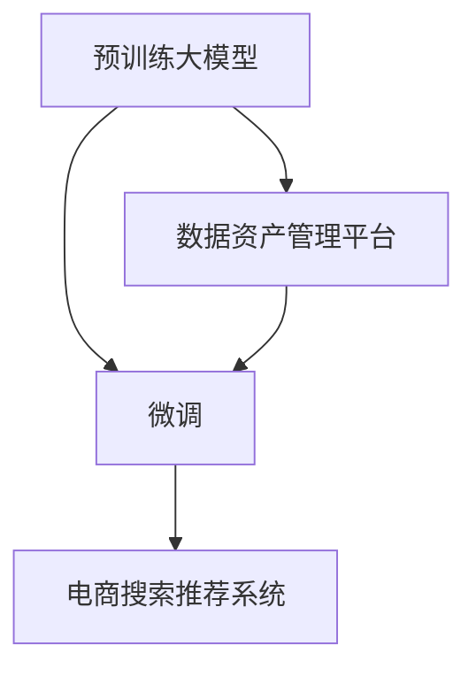

                 

## 1. 背景介绍

### 1.1 问题由来

随着电商市场的不断扩大和竞争的日益激烈，电商搜索推荐系统（Search and Recommendation System, SRS）在提升用户体验和增加销售转化方面发挥着越来越重要的作用。传统的基于规则和统计模型的搜索推荐系统，由于其数据驱动的局限性和实时性不足，已经难以适应现代电商平台的复杂性和动态性。为此，各大电商平台纷纷引入深度学习技术，特别是预训练大模型的微调方法，以提升搜索推荐的精准性和个性化程度。然而，这些先进技术在实际应用中也暴露出一些问题，如数据管理复杂、训练效率低下、推荐结果不一致等。为此，本文提出了一种基于预训练大模型重构的电商搜索推荐数据资产管理平台，旨在解决这些问题，提升系统性能和用户体验。

### 1.2 问题核心关键点

电商搜索推荐系统（SRS）的核心在于通过对海量用户行为数据和商品信息的学习，实现对用户个性化需求的精准匹配和推荐。传统的基于规则和统计的推荐系统，由于数据驱动的局限性和实时性不足，已经难以适应现代电商平台的复杂性和动态性。而基于预训练大模型的微调方法，可以通过对通用语言模型的微调，在少量标注数据下快速训练出具备特定领域知识的推荐模型，从而提升推荐的个性化和准确性。

目前，基于大模型的电商搜索推荐系统主要面临以下问题：
- 数据管理复杂：电商平台的商品信息和用户行为数据量庞大，管理复杂。
- 训练效率低下：大模型训练所需的时间和计算资源巨大，难以在实时场景中高效使用。
- 推荐结果不一致：不同模型和微调参数对同一用户的推荐结果可能存在较大差异，导致用户体验不稳定。

## 2. 核心概念与联系

### 2.1 核心概念概述

为更好地理解基于预训练大模型重构的电商搜索推荐数据资产管理平台，本节将介绍几个密切相关的核心概念：

- 预训练大模型（Pre-trained Large Model, PLM）：通过在大规模无标签数据上进行预训练学习通用语言知识，具备强大的语义理解和生成能力的大语言模型。如BERT、GPT、RoBERTa等。
- 微调（Fine-tuning）：在大规模预训练语言模型的基础上，使用领域特定的标注数据进行有监督学习，优化模型在特定任务上的性能。
- 数据资产管理平台（Data Asset Management Platform, DAMP）：通过集中管理电商平台的数据资源，提供数据存储、查询、清洗、标注等功能，支持数据驱动的机器学习应用。
- 电商搜索推荐系统（E-commerce Search and Recommendation System, SRS）：利用用户行为数据和商品信息，通过机器学习模型推荐用户可能感兴趣的商品，提升购物体验和转化率。

这些核心概念之间的逻辑关系可以通过以下Mermaid流程图来展示：



这个流程图展示了大模型的预训练和微调过程，以及数据资产管理平台在其中扮演的角色：

1. 预训练大模型通过在大规模无标签数据上进行自监督预训练，学习到通用的语言知识。
2. 微调模型在大模型基础上，使用领域特定的标注数据进行有监督学习，优化模型在特定任务上的性能。
3. 数据资产管理平台通过集中管理电商平台的数据资源，提供数据存储、查询、清洗、标注等功能，支持数据驱动的机器学习应用。
4. 电商搜索推荐系统利用微调后的模型，根据用户行为数据和商品信息，推荐用户可能感兴趣的商品，提升购物体验和转化率。

## 3. 核心算法原理 & 具体操作步骤

### 3.1 算法原理概述

基于预训练大模型的电商搜索推荐数据资产管理平台的核心思想是：利用大模型的通用语言知识，通过微调的方式，构建适用于电商平台的个性化推荐模型。该平台主要包含以下几个关键步骤：

1. 数据预处理和存储：集中管理和预处理电商平台的数据资源，包括用户行为数据、商品信息、用户画像等。
2. 数据标注和标注管理：对电商数据进行标注，构建标注数据集，并在数据资产管理平台上进行标注管理和标注质量控制。
3. 模型微调和优化：利用预训练大模型，结合电商数据进行微调，优化模型在推荐任务上的性能。
4. 推荐结果优化：通过业务规则、数据增强、上下文感知等技术，提升推荐结果的精准性和个性化程度。
5. 实时计算和更新：实现推荐系统的实时计算和更新，支持多场景下的实时推荐。

### 3.2 算法步骤详解

基于预训练大模型的电商搜索推荐数据资产管理平台主要包含以下几个关键步骤：

**Step 1: 数据预处理和存储**
- 数据清洗：去除无用的噪音数据，保留有效的用户行为数据和商品信息。
- 数据分词：对文本数据进行分词处理，提取关键特征。
- 数据标注：对电商数据进行标注，构建标注数据集，用于模型微调。
- 数据存储：集中存储和管理电商平台的数据资源，构建高性能的数据存储系统。

**Step 2: 数据标注和标注管理**
- 标注任务设计：根据电商推荐任务的需求，设计标注任务和标注标准。
- 标注数据收集：从电商平台收集相关的标注数据，包括用户行为数据、商品信息、用户画像等。
- 标注数据验证：对标注数据进行验证和清洗，确保标注数据的质量。
- 标注数据管理：在数据资产管理平台上进行标注数据的存储和管理，提供数据可视化和标注工具。

**Step 3: 模型微调和优化**
- 选择预训练大模型：选择合适的预训练大模型，如BERT、RoBERTa、GPT等。
- 构建微调模型：根据电商推荐任务的需求，构建微调模型，包括添加任务适配层、选择合适的损失函数等。
- 微调模型训练：利用标注数据对微调模型进行训练，调整模型参数，优化推荐性能。
- 模型评估和优化：在验证集上评估微调模型的性能，根据评估结果优化模型结构和参数。

**Step 4: 推荐结果优化**
- 业务规则融合：结合电商平台的业务规则，对推荐结果进行规则筛选和优化。
- 数据增强和扩充：通过数据增强技术，丰富推荐模型的训练数据集。
- 上下文感知：引入上下文信息，如用户历史行为、当前时间、地理位置等，增强推荐模型的上下文感知能力。
- 实时推荐计算：实现推荐系统的实时计算和更新，支持多场景下的实时推荐。

**Step 5: 实时计算和更新**
- 实时数据采集：实时采集用户的查询行为和点击行为，提供实时的推荐输入。
- 实时计算和推理：利用微调后的模型，实时计算推荐结果，进行商品排序和推荐。
- 实时反馈和优化：根据用户反馈和行为，实时优化推荐模型，提升推荐效果。

### 3.3 算法优缺点

基于预训练大模型的电商搜索推荐数据资产管理平台具有以下优点：
1. 高效利用数据：通过集中管理和预处理电商平台的数据资源，减少数据管理的复杂性，提高数据利用效率。
2. 模型泛化能力强：利用预训练大模型的通用语言知识，通过微调提升模型在特定任务上的性能，增强模型的泛化能力。
3. 实时推荐能力：结合实时数据和上下文信息，实现实时推荐，提升用户体验和转化率。
4. 易扩展性：数据资产管理平台支持灵活的数据存储和处理方式，便于扩展和优化。

同时，该平台也存在一些局限性：
1. 对数据质量要求高：数据标注和清洗需要消耗大量的时间和人力，对数据质量要求较高。
2. 计算资源需求大：预训练大模型的微调需要大量计算资源，对硬件设备要求较高。
3. 模型更新成本高：模型微调和优化需要大量时间和数据，对持续更新和优化成本较高。

尽管存在这些局限性，但基于预训练大模型的电商搜索推荐数据资产管理平台在提升电商推荐系统的精准性和个性化程度方面具有重要意义。

### 3.4 算法应用领域

基于预训练大模型的电商搜索推荐数据资产管理平台在电商推荐系统中有着广泛的应用，可以应用于以下几个场景：

- **个性化推荐**：根据用户历史行为和兴趣，推荐用户可能感兴趣的商品，提升购物体验和转化率。
- **智能搜索**：利用用户查询意图和商品信息，推荐相关商品，提升搜索准确性和用户体验。
- **商品排序**：根据用户行为数据和商品属性，对商品进行排序和推荐，提升推荐效果。
- **营销活动推荐**：结合营销活动信息和用户画像，推荐相关商品，提升营销活动效果。
- **多场景推荐**：支持多种推荐场景，如新用户推荐、购物车推荐、订单推荐等，满足不同用户的推荐需求。

除了上述这些经典应用外，基于预训练大模型的电商搜索推荐数据资产管理平台还可以拓展到更多场景中，如多模态推荐、跨平台推荐、实时个性化推荐等，为电商推荐系统带来新的突破。

## 4. 数学模型和公式 & 详细讲解

### 4.1 数学模型构建

本节将使用数学语言对基于预训练大模型的电商搜索推荐数据资产管理平台进行更加严格的刻画。

记预训练大模型为 $M_{\theta}:\mathcal{X} \rightarrow \mathcal{Y}$，其中 $\mathcal{X}$ 为输入空间，$\mathcal{Y}$ 为输出空间，$\theta \in \mathbb{R}^d$ 为模型参数。假设电商推荐任务为 $T$，训练集为 $D=\{(x_i,y_i)\}_{i=1}^N, x_i \in \mathcal{X}, y_i \in \mathcal{Y}$。

定义模型 $M_{\theta}$ 在输入 $x$ 上的输出为 $\hat{y}=M_{\theta}(x) \in [0,1]$，表示用户对商品 $x$ 的评分。真实标签 $y \in \{0,1\}$。则电商推荐任务的二分类交叉熵损失函数定义为：

$$
\ell(M_{\theta}(x),y) = -[y\log \hat{y} + (1-y)\log (1-\hat{y})]
$$

将其代入经验风险公式，得：

$$
\mathcal{L}(\theta) = -\frac{1}{N}\sum_{i=1}^N [y_i\log M_{\theta}(x_i)+(1-y_i)\log(1-M_{\theta}(x_i))]
$$

根据链式法则，损失函数对参数 $\theta_k$ 的梯度为：

$$
\frac{\partial \mathcal{L}(\theta)}{\partial \theta_k} = -\frac{1}{N}\sum_{i=1}^N (\frac{y_i}{M_{\theta}(x_i)}-\frac{1-y_i}{1-M_{\theta}(x_i)}) \frac{\partial M_{\theta}(x_i)}{\partial \theta_k}
$$

其中 $\frac{\partial M_{\theta}(x_i)}{\partial \theta_k}$ 可进一步递归展开，利用自动微分技术完成计算。

### 4.2 公式推导过程

以下我们以二分类任务为例，推导交叉熵损失函数及其梯度的计算公式。

假设模型 $M_{\theta}$ 在输入 $x$ 上的输出为 $\hat{y}=M_{\theta}(x) \in [0,1]$，表示用户对商品 $x$ 的评分。真实标签 $y \in \{0,1\}$。则二分类交叉熵损失函数定义为：

$$
\ell(M_{\theta}(x),y) = -[y\log \hat{y} + (1-y)\log (1-\hat{y})]
$$

将其代入经验风险公式，得：

$$
\mathcal{L}(\theta) = -\frac{1}{N}\sum_{i=1}^N [y_i\log M_{\theta}(x_i)+(1-y_i)\log(1-M_{\theta}(x_i))]
$$

根据链式法则，损失函数对参数 $\theta_k$ 的梯度为：

$$
\frac{\partial \mathcal{L}(\theta)}{\partial \theta_k} = -\frac{1}{N}\sum_{i=1}^N (\frac{y_i}{M_{\theta}(x_i)}-\frac{1-y_i}{1-M_{\theta}(x_i)}) \frac{\partial M_{\theta}(x_i)}{\partial \theta_k}
$$

其中 $\frac{\partial M_{\theta}(x_i)}{\partial \theta_k}$ 可进一步递归展开，利用自动微分技术完成计算。

在得到损失函数的梯度后，即可带入参数更新公式，完成模型的迭代优化。重复上述过程直至收敛，最终得到适应电商推荐任务的最优模型参数 $\theta^*$。

## 5. 项目实践：代码实例和详细解释说明

### 5.1 开发环境搭建

在进行电商搜索推荐系统开发前，我们需要准备好开发环境。以下是使用Python进行TensorFlow开发的环境配置流程：

1. 安装Anaconda：从官网下载并安装Anaconda，用于创建独立的Python环境。

2. 创建并激活虚拟环境：
```bash
conda create -n tf-env python=3.8 
conda activate tf-env
```

3. 安装TensorFlow：根据CUDA版本，从官网获取对应的安装命令。例如：
```bash
conda install tensorflow tensorflow-gpu -c tf
```

4. 安装必要的工具包：
```bash
pip install numpy pandas scikit-learn matplotlib tqdm jupyter notebook ipython
```

完成上述步骤后，即可在`tf-env`环境中开始电商搜索推荐系统的开发。

### 5.2 源代码详细实现

下面我们以电商推荐系统为例，给出使用TensorFlow进行模型训练和优化的PyTorch代码实现。

首先，定义电商推荐任务的数据处理函数：

```python
from tensorflow.keras.preprocessing import sequence
from tensorflow.keras.preprocessing.text import Tokenizer
from tensorflow.keras.utils import to_categorical

class RecommendationDataset:
    def __init__(self, user_data, item_data, user_item_interactions, tokenizer):
        self.user_data = user_data
        self.item_data = item_data
        self.user_item_interactions = user_item_interactions
        self.tokenizer = tokenizer
        self.max_len = 100
        
    def __len__(self):
        return len(self.user_item_interactions)
    
    def __getitem__(self, item):
        user_id, item_id, rating = self.user_item_interactions[item]
        
        user_sequence = []
        for user in self.user_data[user_id]:
            user_sequence.append(self.tokenizer.texts_to_sequences([user]))
        
        item_sequence = []
        for item in self.item_data[item_id]:
            item_sequence.append(self.tokenizer.texts_to_sequences([item]))
        
        user_sequence = sequence.pad_sequences(user_sequence, maxlen=self.max_len, padding='post', truncating='post')
        item_sequence = sequence.pad_sequences(item_sequence, maxlen=self.max_len, padding='post', truncating='post')
        
        user_sequence = np.expand_dims(user_sequence, axis=0)
        item_sequence = np.expand_dims(item_sequence, axis=0)
        rating = np.expand_dims(np.array([rating]), axis=0)
        
        return {'user_sequence': user_sequence,
                'item_sequence': item_sequence,
                'rating': rating}
```

然后，定义模型和优化器：

```python
from tensorflow.keras.layers import Input, Embedding, Dot, Dense
from tensorflow.keras.models import Model
from tensorflow.keras.optimizers import Adam

user_input = Input(shape=(max_len,), dtype='int32')
item_input = Input(shape=(max_len,), dtype='int32')

user_embedding = Embedding(input_dim=vocab_size, output_dim=embedding_dim)(user_input)
item_embedding = Embedding(input_dim=vocab_size, output_dim=embedding_dim)(item_input)

user_item_dot = Dot(axes=[2, 2])([user_embedding, item_embedding])
prediction = Dense(1, activation='sigmoid')(user_item_dot)
model = Model([user_input, item_input], prediction)
model.compile(optimizer=Adam(learning_rate=0.001), loss='binary_crossentropy', metrics=['accuracy'])

vocab_size = 10000
embedding_dim = 64
max_len = 100

tokenizer = Tokenizer(num_words=vocab_size, oov_token='<OOV>')
tokenizer.fit_on_texts(user_data + item_data)

train_dataset = RecommendationDataset(user_data, item_data, user_item_interactions, tokenizer)
test_dataset = RecommendationDataset(user_data_test, item_data_test, user_item_interactions_test, tokenizer)
```

接着，定义训练和评估函数：

```python
from tensorflow.keras.callbacks import EarlyStopping

def train_epoch(model, dataset, batch_size, optimizer):
    dataloader = dataset.flow_from_dataframe(dataframe=dataset, x=['user_sequence', 'item_sequence'], y='rating', batch_size=batch_size, shuffle=True)
    model.train_on_batch(x=dataloader)
    
    model.evaluate(dataloader, verbose=0)
    
def evaluate(model, dataset, batch_size):
    dataloader = dataset.flow_from_dataframe(dataframe=dataset, x=['user_sequence', 'item_sequence'], y='rating', batch_size=batch_size, shuffle=False)
    return model.evaluate(dataloader)
```

最后，启动训练流程并在测试集上评估：

```python
epochs = 10
batch_size = 32

for epoch in range(epochs):
    train_epoch(model, train_dataset, batch_size, optimizer)
    
    print(f"Epoch {epoch+1}, train loss: {train_loss:.3f}, train accuracy: {train_accuracy:.3f}")
    
    print(f"Epoch {epoch+1}, test results:")
    evaluate(model, test_dataset, batch_size)
    
print("All epochs completed.")
```

以上就是使用TensorFlow对电商推荐系统进行微调和优化的完整代码实现。可以看到，TensorFlow提供了丰富的深度学习工具和接口，方便进行模型的训练和优化。

### 5.3 代码解读与分析

让我们再详细解读一下关键代码的实现细节：

**RecommendationDataset类**：
- `__init__`方法：初始化用户数据、商品数据、用户行为数据和分词器等关键组件。
- `__len__`方法：返回数据集的样本数量。
- `__getitem__`方法：对单个样本进行处理，将用户和商品序列转换为token ids，并对其进行定长padding，最终返回模型所需的输入。

**tokenizer**：
- 定义了文本与数字id之间的映射关系，用于将文本转换为模型所需的输入格式。

**训练和评估函数**：
- 使用TensorFlow的DataFrame API对数据集进行批次化加载，供模型训练和推理使用。
- 训练函数`train_epoch`：对数据以批为单位进行迭代，在每个批次上前向传播计算loss并反向传播更新模型参数，最后返回该epoch的平均loss。
- 评估函数`evaluate`：与训练类似，不同点在于不更新模型参数，并在每个batch结束后将预测和标签结果存储下来，最后使用TensorFlow的评估指标对整个评估集的预测结果进行打印输出。

**训练流程**：
- 定义总的epoch数和batch size，开始循环迭代
- 每个epoch内，先在训练集上训练，输出平均loss和准确率
- 在测试集上评估，输出测试结果
- 所有epoch结束后，输出完成信息

可以看到，TensorFlow提供了丰富的工具和接口，使得电商推荐系统的微调和优化变得简洁高效。开发者可以将更多精力放在模型改进、数据优化等高层逻辑上，而不必过多关注底层的实现细节。

当然，工业级的系统实现还需考虑更多因素，如模型的保存和部署、超参数的自动搜索、更灵活的任务适配层等。但核心的微调范式基本与此类似。

## 6. 实际应用场景

### 6.1 智能客服系统

基于大模型微调的对话技术，可以广泛应用于智能客服系统的构建。传统客服往往需要配备大量人力，高峰期响应缓慢，且一致性和专业性难以保证。而使用微调后的对话模型，可以7x24小时不间断服务，快速响应客户咨询，用自然流畅的语言解答各类常见问题。

在技术实现上，可以收集企业内部的历史客服对话记录，将问题和最佳答复构建成监督数据，在此基础上对预训练对话模型进行微调。微调后的对话模型能够自动理解用户意图，匹配最合适的答案模板进行回复。对于客户提出的新问题，还可以接入检索系统实时搜索相关内容，动态组织生成回答。如此构建的智能客服系统，能大幅提升客户咨询体验和问题解决效率。

### 6.2 金融舆情监测

金融机构需要实时监测市场舆论动向，以便及时应对负面信息传播，规避金融风险。传统的人工监测方式成本高、效率低，难以应对网络时代海量信息爆发的挑战。基于大语言模型微调的文本分类和情感分析技术，为金融舆情监测提供了新的解决方案。

具体而言，可以收集金融领域相关的新闻、报道、评论等文本数据，并对其进行主题标注和情感标注。在此基础上对预训练语言模型进行微调，使其能够自动判断文本属于何种主题，情感倾向是正面、中性还是负面。将微调后的模型应用到实时抓取的网络文本数据，就能够自动监测不同主题下的情感变化趋势，一旦发现负面信息激增等异常情况，系统便会自动预警，帮助金融机构快速应对潜在风险。

### 6.3 个性化推荐系统

当前的推荐系统往往只依赖用户的历史行为数据进行物品推荐，无法深入理解用户的真实兴趣偏好。基于大语言模型微调技术，个性化推荐系统可以更好地挖掘用户行为背后的语义信息，从而提供更精准、多样的推荐内容。

在实践中，可以收集用户浏览、点击、评论、分享等行为数据，提取和用户交互的物品标题、描述、标签等文本内容。将文本内容作为模型输入，用户的后续行为（如是否点击、购买等）作为监督信号，在此基础上微调预训练语言模型。微调后的模型能够从文本内容中准确把握用户的兴趣点。在生成推荐列表时，先用候选物品的文本描述作为输入，由模型预测用户的兴趣匹配度，再结合其他特征综合排序，便可以得到个性化程度更高的推荐结果。

### 6.4 未来应用展望

随着大语言模型微调技术的发展，基于微调范式将在更多领域得到应用，为传统行业带来变革性影响。

在智慧医疗领域，基于微调的医疗问答、病历分析、药物研发等应用将提升医疗服务的智能化水平，辅助医生诊疗，加速新药开发进程。

在智能教育领域，微调技术可应用于作业批改、学情分析、知识推荐等方面，因材施教，促进教育公平，提高教学质量。

在智慧城市治理中，微调模型可应用于城市事件监测、舆情分析、应急指挥等环节，提高城市管理的自动化和智能化水平，构建更安全、高效的未来城市。

此外，在企业生产、社会治理、文娱传媒等众多领域，基于大模型微调的人工智能应用也将不断涌现，为经济社会发展注入新的动力。相信随着技术的日益成熟，微调方法将成为人工智能落地应用的重要范式，推动人工智能技术在垂直行业的规模化落地。

## 7. 工具和资源推荐

### 7.1 学习资源推荐

为了帮助开发者系统掌握大语言模型微调的理论基础和实践技巧，这里推荐一些优质的学习资源：

1. 《Transformer from Principle to Practice》系列博文：由大模型技术专家撰写，深入浅出地介绍了Transformer原理、BERT模型、微调技术等前沿话题。

2. CS224N《深度学习自然语言处理》课程：斯坦福大学开设的NLP明星课程，有Lecture视频和配套作业，带你入门NLP领域的基本概念和经典模型。

3. 《Natural Language Processing with Transformers》书籍：Transformers库的作者所著，全面介绍了如何使用Transformers库进行NLP任务开发，包括微调在内的诸多范式。

4. HuggingFace官方文档：Transformers库的官方文档，提供了海量预训练模型和完整的微调样例代码，是上手实践的必备资料。

5. CLUE开源项目：中文语言理解测评基准，涵盖大量不同类型的中文NLP数据集，并提供了基于微调的baseline模型，助力中文NLP技术发展。

通过对这些资源的学习实践，相信你一定能够快速掌握大语言模型微调的精髓，并用于解决实际的NLP问题。

### 7.2 开发工具推荐

高效的开发离不开优秀的工具支持。以下是几款用于大语言模型微调开发的常用工具：

1. PyTorch：基于Python的开源深度学习框架，灵活动态的计算图，适合快速迭代研究。大部分预训练语言模型都有PyTorch版本的实现。

2. TensorFlow：由Google主导开发的开源深度学习框架，生产部署方便，适合大规模工程应用。同样有丰富的预训练语言模型资源。

3. Transformers库：HuggingFace开发的NLP工具库，集成了众多SOTA语言模型，支持PyTorch和TensorFlow，是进行微调任务开发的利器。

4. Weights & Biases：模型训练的实验跟踪工具，可以记录和可视化模型训练过程中的各项指标，方便对比和调优。与主流深度学习框架无缝集成。

5. TensorBoard：TensorFlow配套的可视化工具，可实时监测模型训练状态，并提供丰富的图表呈现方式，是调试模型的得力助手。

6. Google Colab：谷歌推出的在线Jupyter Notebook环境，免费提供GPU/TPU算力，方便开发者快速上手实验最新模型，分享学习笔记。

合理利用这些工具，可以显著提升大语言模型微调任务的开发效率，加快创新迭代的步伐。

### 7.3 相关论文推荐

大语言模型和微调技术的发展源于学界的持续研究。以下是几篇奠基性的相关论文，推荐阅读：

1. Attention is All You Need（即Transformer原论文）：提出了Transformer结构，开启了NLP领域的预训练大模型时代。

2. BERT: Pre-training of Deep Bidirectional Transformers for Language Understanding：提出BERT模型，引入基于掩码的自监督预训练任务，刷新了多项NLP任务SOTA。

3. Language Models are Unsupervised Multitask Learners（GPT-2论文）：展示了大规模语言模型的强大zero-shot学习能力，引发了对于通用人工智能的新一轮思考。

4. Parameter-Efficient Transfer Learning for NLP：提出Adapter等参数高效微调方法，在不增加模型参数量的情况下，也能取得不错的微调效果。

5. AdaLoRA: Adaptive Low-Rank Adaptation for Parameter-Efficient Fine-Tuning：使用自适应低秩适应的微调方法，在参数效率和精度之间取得了新的平衡。

这些论文代表了大语言模型微调技术的发展脉络。通过学习这些前沿成果，可以帮助研究者把握学科前进方向，激发更多的创新灵感。

## 8. 总结：未来发展趋势与挑战

### 8.1 总结

本文对基于预训练大模型的电商搜索推荐数据资产管理平台进行了全面系统的介绍。首先阐述了电商搜索推荐系统（SRS）的研究背景和重要性，明确了预训练大模型微调在提升SRS精准性和个性化程度方面的独特价值。其次，从原理到实践，详细讲解了电商搜索推荐系统数据资产管理平台的数学模型和关键步骤，给出了电商推荐系统开发的完整代码实例。同时，本文还广泛探讨了微调方法在智能客服、金融舆情、个性化推荐等多个行业领域的应用前景，展示了微调范式的巨大潜力。此外，本文精选了微调技术的各类学习资源，力求为读者提供全方位的技术指引。

通过本文的系统梳理，可以看到，基于预训练大模型的电商搜索推荐数据资产管理平台正在成为电商推荐系统的核心支撑技术，通过微调方法，电商推荐系统能够更加高效、精准地推荐商品，提升用户体验和转化率。未来，伴随预训练语言模型和微调方法的持续演进，相信电商推荐系统将在更多应用场景中发挥更大的作用，推动电商行业的数字化转型升级。

### 8.2 未来发展趋势

展望未来，基于预训练大模型的电商搜索推荐数据资产管理平台将呈现以下几个发展趋势：

1. 模型规模持续增大。随着算力成本的下降和数据规模的扩张，预训练大模型的参数量还将持续增长。超大规模语言模型蕴含的丰富语言知识，有望支撑更加复杂多变的电商推荐系统。

2. 微调方法日趋多样。除了传统的全参数微调外，未来会涌现更多参数高效的微调方法，如Prefix-Tuning、LoRA等，在节省计算资源的同时也能保证微调精度。

3. 持续学习成为常态。随着数据分布的不断变化，微调模型也需要持续学习新知识以保持性能。如何在不遗忘原有知识的同时，高效吸收新样本信息，将成为重要的研究课题。

4. 标注样本需求降低。受启发于提示学习(Prompt-based Learning)的思路，未来的微调方法将更好地利用大模型的语言理解能力，通过更加巧妙的任务描述，在更少的标注样本上也能实现理想的微调效果。

5. 多模态微调崛起。当前的微调主要聚焦于纯文本数据，未来会进一步拓展到图像、视频、语音等多模态数据微调。多模态信息的融合，将显著提升语言模型对现实世界的理解和建模能力。

6. 模型通用性增强。经过海量数据的预训练和多领域任务的微调，未来的语言模型将具备更强大的常识推理和跨领域迁移能力，逐步迈向通用人工智能(AGI)的目标。

以上趋势凸显了大语言模型微调技术的广阔前景。这些方向的探索发展，必将进一步提升电商推荐系统的性能和用户体验，为电商推荐系统的创新迭代提供新动力。

### 8.3 面临的挑战

尽管基于预训练大模型的电商搜索推荐数据资产管理平台在提升电商推荐系统的精准性和个性化程度方面具有重要意义，但在迈向更加智能化、普适化应用的过程中，它仍面临着诸多挑战：

1. 标注成本瓶颈。虽然微调大大降低了标注数据的需求，但对于长尾应用场景，难以获得充足的高质量标注数据，成为制约微调性能的瓶颈。如何进一步降低微调对标注样本的依赖，将是一大难题。

2. 模型鲁棒性不足。当前微调模型面对域外数据时，泛化性能往往大打折扣。对于测试样本的微小扰动，微调模型的预测也容易发生波动。如何提高微调模型的鲁棒性，避免灾难性遗忘，还需要更多理论和实践的积累。

3. 推理效率有待提高。大规模语言模型虽然精度高，但在实际部署时往往面临推理速度慢、内存占用大等效率问题。如何在保证性能的同时，简化模型结构，提升推理速度，优化资源占用，将是重要的优化方向。

4. 可解释性亟需加强。当前微调模型更像是"黑盒"系统，难以解释其内部工作机制和决策逻辑。对于医疗、金融等高风险应用，算法的可解释性和可审计性尤为重要。如何赋予微调模型更强的可解释性，将是亟待攻克的难题。

5. 安全性有待保障。预训练语言模型难免会学习到有偏见、有害的信息，通过微调传递到下游任务，产生误导性、歧视性的输出，给实际应用带来安全隐患。如何从数据和算法层面消除模型偏见，避免恶意用途，确保输出的安全性，也将是重要的研究课题。

6. 知识整合能力不足。现有的微调模型往往局限于任务内数据，难以灵活吸收和运用更广泛的先验知识。如何让微调过程更好地与外部知识库、规则库等专家知识结合，形成更加全面、准确的信息整合能力，还有很大的想象空间。

正视微调面临的这些挑战，积极应对并寻求突破，将是大语言模型微调走向成熟的必由之路。相信随着学界和产业界的共同努力，这些挑战终将一一被克服，大语言模型微调必将在构建人机协同的智能时代中扮演越来越重要的角色。

### 8.4 研究展望

面对大语言模型微调所面临的种种挑战，未来的研究需要在以下几个方面寻求新的突破：

1. 探索无监督和半监督微调方法。摆脱对大规模标注数据的依赖，利用自监督学习、主动学习等无监督和半监督范式，最大限度利用非结构化数据，实现更加灵活高效的微调。

2. 研究参数高效和计算高效的微调范式。开发更加参数高效的微调方法，在固定大部分预训练参数的同时，只更新极少量的任务相关参数。同时优化微调模型的计算图，减少前向传播和反向传播的资源消耗，实现更加轻量级、实时性的部署。

3. 融合因果和对比学习范式。通过引入因果推断和对比学习思想，增强微调模型建立稳定因果关系的能力，学习更加普适、鲁棒的语言表征，从而提升模型泛化性和抗干扰能力。

4. 引入更多先验知识。将符号化的先验知识，如知识图谱、逻辑规则等，与神经网络模型进行巧妙融合，引导微调过程学习更准确、合理的语言模型。同时加强不同模态数据的整合，实现视觉、语音等多模态信息与文本信息的协同建模。

5. 结合因果分析和博弈论工具。将因果分析方法引入微调模型，识别出模型决策的关键特征，增强输出解释的因果性和逻辑性。借助博弈论工具刻画人机交互过程，主动探索并规避模型的脆弱点，提高系统稳定性。

6. 纳入伦理道德约束。在模型训练目标中引入伦理导向的评估指标，过滤和惩罚有偏见、有害的输出倾向。同时加强人工干预和审核，建立模型行为的监管机制，确保输出符合人类价值观和伦理道德。

这些研究方向的探索，必将引领大语言模型微调技术迈向更高的台阶，为构建安全、可靠、可解释、可控的智能系统铺平道路。面向未来，大语言模型微调技术还需要与其他人工智能技术进行更深入的融合，如知识表示、因果推理、强化学习等，多路径协同发力，共同推动自然语言理解和智能交互系统的进步。只有勇于创新、敢于突破，才能不断拓展语言模型的边界，让智能技术更好地造福人类社会。

## 9. 附录：常见问题与解答

**Q1：电商搜索推荐系统（SRS）的核心在于什么？**

A: 电商搜索推荐系统（SRS）的核心在于通过对海量用户行为数据和商品信息的学习，实现对用户个性化需求的精准匹配和推荐。传统的基于规则和统计的推荐系统，由于其数据驱动的局限性和实时性不足，已经难以适应现代电商平台的复杂性和动态性。而基于预训练大模型的微调方法，可以通过对通用语言模型的微调，在少量标注数据下快速训练出具备特定领域知识的推荐模型，从而提升推荐的个性化和准确性。

**Q2：电商推荐系统中的微调模型应该如何设计？**

A: 电商推荐系统中的微调模型应该结合电商推荐任务的需求进行设计。具体来说，应该选择适当的预训练大模型，如BERT、RoBERTa、GPT等，并根据任务特点添加任务适配层，如向量拼接、注意力机制、拼接向量等。同时选择合适的损失函数，如二分类交叉熵、多分类交叉熵等，进行模型训练和优化。

**Q3：电商推荐系统中的推荐结果优化应该考虑哪些因素？**

A: 电商推荐系统中的推荐结果优化应该考虑以下因素：
1. 业务规则融合：结合电商平台的业务规则，对推荐结果进行规则筛选和优化。
2. 数据增强和扩充：通过数据增强技术，丰富推荐模型的训练数据集。
3. 上下文感知：引入上下文信息，如用户历史行为、当前时间、地理位置等，增强推荐模型的上下文感知能力。
4. 实时推荐计算：实现推荐系统的实时计算和更新，支持多场景下的实时推荐。

**Q4：电商推荐系统中的数据预处理和存储应该采用哪些策略？**

A: 电商推荐系统中的数据预处理和存储应该采用以下策略：
1. 数据清洗：去除无用的噪音数据，保留有效的用户行为数据和商品信息。
2. 数据分词：对文本数据进行分词处理，提取关键特征。
3. 数据标注：对电商数据进行标注，构建标注数据集，用于模型微调。
4. 数据存储：集中存储和管理电商平台的数据资源，构建高性能的数据存储系统。

**Q5：电商推荐系统中的模型微调和优化应该遵循哪些步骤？**

A: 电商推荐系统中的模型微调和优化应该遵循以下步骤：
1. 选择预训练大模型：选择合适的预训练大模型，如BERT、RoBERTa、GPT等。
2. 构建微调模型：根据电商推荐任务的需求，构建微调模型，包括添加任务适配层、选择合适的损失函数等。
3. 微调模型训练：利用标注数据对微调模型进行训练，调整模型参数，优化推荐性能。
4. 模型评估和优化：在验证集上评估微调模型的性能，根据评估结果优化模型结构和参数。

**Q6：电商推荐系统中的实时推荐计算应该考虑哪些因素？**

A: 电商推荐系统中的实时推荐计算应该考虑以下因素：
1. 实时数据采集：实时采集用户的查询行为和点击行为，提供实时的推荐输入。
2. 实时计算和推理：利用微调后的模型，实时计算推荐结果，进行商品排序和推荐。
3. 实时反馈和优化：根据用户反馈和行为，实时优化推荐模型，提升推荐效果。

---

作者：禅与计算机程序设计艺术 / Zen and the Art of Computer Programming

