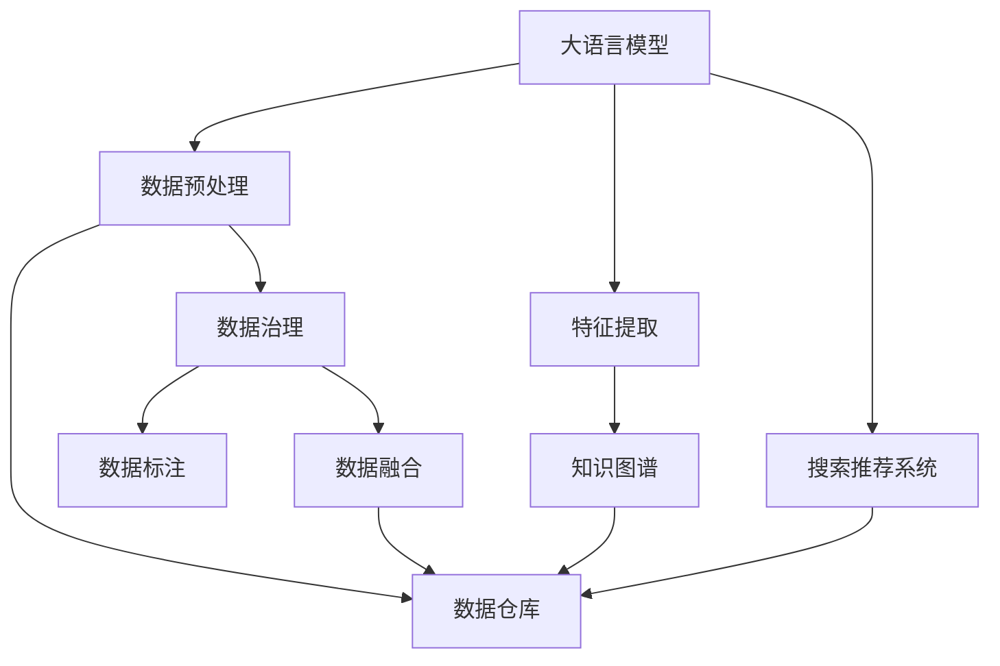

                 

# AI大模型重构电商搜索推荐的数据资产管理平台搭建

> 关键词：大语言模型,数据治理,搜索推荐,电商,知识图谱,数据仓库,自然语言处理

## 1. 背景介绍

### 1.1 问题由来

在电商行业，用户体验和商业转化率的提升在很大程度上依赖于搜索推荐系统的表现。随着消费者需求日趋复杂，提供高度个性化、高效精准的搜索推荐服务变得越来越重要。然而，构建这样一个系统并非易事。搜索推荐系统的核心在于对用户行为数据的深度挖掘与理解，但这对数据治理、实时计算、多模态融合等各方面提出了严苛的要求。

当前，电商平台的搜索推荐系统依赖于传统机器学习算法，如协同过滤、决策树、深度学习等，这些算法需要大量标注数据来训练模型。而标注数据的获取、存储、管理、使用等环节往往容易陷入瓶颈，尤其是对海量用户行为数据的处理，更是难以高效进行。此外，多模态数据的融合，如文本、图像、视频等，也需要更为复杂的模型和算法来支持。

面对这些挑战，电商企业需要一种更为智能化、可扩展、高效的数据治理与处理方案，以更好地支撑搜索推荐系统的构建与运行。AI大模型的出现为电商企业提供了全新的技术选择，其通过预训练和微调的方式，可以快速且高效地提升搜索推荐系统的性能。

### 1.2 问题核心关键点

本文将重点讨论如何利用AI大模型，对电商搜索推荐系统的数据资产进行智能化重构与管理。具体问题核心关键点包括：

- 如何通过大模型进行数据预处理与特征提取，提升搜索推荐模型的准确性。
- 如何在数据治理的框架下，进行数据标注、数据融合、数据共享等操作。
- 如何构建知识图谱，将文本数据转换为结构化知识，提升推荐模型的知识表示能力。
- 如何高效存储和管理数据，优化搜索推荐系统的计算资源和内存消耗。
- 如何将大模型与实时计算和推理引擎结合起来，支持推荐系统的实时响应与优化。

本文将对这些问题进行深入探讨，并给出系统的解决方案。

## 2. 核心概念与联系

### 2.1 核心概念概述

为更好地理解本方案，我们将介绍一些核心概念及其相互关系：

- **大语言模型(Large Language Model, LLM)**：如GPT-3、BERT等，通过大规模无标签文本数据进行预训练，具备强大的语言理解与生成能力。

- **数据治理(Data Governance)**：包括数据质量管理、数据标准化、数据生命周期管理等，保证数据的准确性、完整性、一致性。

- **搜索推荐系统(Recommendation System)**：利用用户行为数据，推荐最符合用户需求的产品或内容，提升用户体验和商业转化率。

- **知识图谱(Knowledge Graph)**：将文本数据转换为结构化知识，便于知识检索、推理与重用。

- **数据仓库(Data Warehouse)**：集中存储企业历史数据，支持大规模数据分析和数据共享。

- **自然语言处理(Natural Language Processing, NLP)**：涉及语言模型、文本分析、情感分析等技术，是构建搜索推荐系统的关键技术之一。

这些概念之间的逻辑关系可以通过以下Mermaid流程图来展示：



这个流程图展示了大模型与电商搜索推荐系统构建的数据处理流程：

1. 大语言模型通过预训练获得通用语言知识。
2. 利用大模型进行数据预处理与特征提取。
3. 将文本数据转换为结构化知识，构建知识图谱。
4. 将处理好的数据存入数据仓库，进行数据治理与标注。
5. 利用数据仓库支持搜索推荐系统的训练与推理。

## 3. 核心算法原理 & 具体操作步骤

### 3.1 算法原理概述

基于大模型的电商搜索推荐系统构建，其核心在于利用大模型的强大语言理解和生成能力，对用户行为数据进行深度处理，构建高质量的推荐模型。该算法主要分为以下几个步骤：

1. **数据预处理**：利用大模型对原始用户行为数据进行预处理，提取关键特征。
2. **特征提取**：使用大模型学习用户行为数据的隐含特征，构建高维特征向量。
3. **知识图谱构建**：通过大模型将文本数据转换为结构化知识，构建知识图谱，用于辅助推荐。
4. **数据治理**：对预处理后的数据进行标注、融合、共享等操作，保证数据质量与可用性。
5. **推荐模型训练**：利用预处理和治理后的数据，训练基于大模型的推荐模型。

### 3.2 算法步骤详解

**Step 1: 数据预处理**

数据预处理的目标是将原始用户行为数据转换为适合大模型处理的格式。主要步骤包括：

1. **数据清洗**：去除噪声数据、缺失值、异常值等，保证数据质量。
2. **数据标准化**：将不同来源的数据标准化为统一格式，便于后续处理。
3. **特征选择**：选择对推荐模型影响较大的特征，去除冗余特征。

**Step 2: 特征提取**

特征提取的目的是将用户行为数据转换为大模型可理解的高维特征向量。具体步骤包括：

1. **文本特征提取**：使用大模型学习用户行为数据中的文本特征，生成高维特征向量。
2. **图像特征提取**：利用计算机视觉技术提取用户行为数据中的图像特征。
3. **多模态融合**：将文本、图像等多模态特征进行融合，生成更为综合的特征向量。

**Step 3: 知识图谱构建**

知识图谱的构建将文本数据转换为结构化知识，便于知识检索与推理。具体步骤如下：

1. **实体识别**：识别用户行为数据中的实体，如用户、产品、时间等。
2. **关系提取**：提取实体之间的关系，如用户与产品之间的关系，产品之间的关联等。
3. **知识图谱构建**：将提取的实体与关系构建为知识图谱，便于后续的推荐系统使用。

**Step 4: 数据治理**

数据治理是保证数据质量与可用性的关键步骤。主要包括以下几个方面：

1. **数据标注**：对处理后的数据进行标注，如用户行为标签、产品属性标签等，便于模型训练。
2. **数据融合**：将不同来源的数据进行融合，生成统一的数据集，便于模型训练。
3. **数据共享**：通过数据治理平台，支持不同部门之间的数据共享与协作。

**Step 5: 推荐模型训练**

推荐模型的训练基于预处理与治理后的数据，使用大模型进行训练。具体步骤如下：

1. **模型选择**：选择合适的推荐模型，如协同过滤、深度学习等。
2. **模型训练**：利用预处理与治理后的数据，训练推荐模型。
3. **模型优化**：通过调参与模型优化，提升推荐模型的性能。

### 3.3 算法优缺点

基于大模型的电商搜索推荐系统构建，其优点在于：

1. **效率高**：大模型可以通过预训练快速提升推荐模型的性能，减少标注数据和训练时间。
2. **泛化能力强**：大模型具备通用语言知识，可以处理多模态数据，提升推荐系统的泛化能力。
3. **可扩展性强**：大模型可以在大规模数据上训练，支持推荐系统的扩展与升级。

然而，该方法也存在一些缺点：

1. **资源消耗大**：大模型的计算资源需求较大，需要高性能计算设备支持。
2. **数据依赖强**：推荐系统的性能高度依赖于数据质量与标注数据量，数据治理难度大。
3. **模型复杂**：大模型通常较为复杂，需要较高技术门槛进行维护与优化。

### 3.4 算法应用领域

基于大模型的电商搜索推荐系统构建方法，主要应用于以下几个领域：

1. **电商搜索**：根据用户输入的查询，快速推荐相关商品，提升用户搜索体验。
2. **个性化推荐**：基于用户历史行为数据，推荐个性化商品，提高用户转化率。
3. **知识图谱**：利用知识图谱技术，提升推荐系统的知识表示与推理能力。
4. **实时推荐**：结合实时数据，进行实时推荐，提升推荐系统的实时性。

## 4. 数学模型和公式 & 详细讲解

### 4.1 数学模型构建

基于大模型的电商搜索推荐系统构建，其数学模型主要包括以下几个部分：

1. **用户行为数据的预处理**：
   - 将原始数据转换为标准化的向量形式：
     \[
     d_i = \{d_{i1}, d_{i2}, ..., d_{in}\}
     \]
    其中，$d_{ij}$表示用户$i$在时间$j$的行为数据。

2. **特征提取**：
   - 利用大模型学习文本特征，生成高维特征向量：
     \[
     f_i = M_{\theta}(d_i)
     \]
    其中，$M_{\theta}$为大模型，$\theta$为模型参数。

3. **知识图谱构建**：
   - 提取用户行为数据中的实体与关系，构建知识图谱：
     \[
     g_i = \{(e_i, r_i, e_j), (e_j, r_j, e_k), ...\}
     \]
    其中，$e_i$、$e_j$、$e_k$为实体，$r_i$、$r_j$、$r_k$为关系。

4. **推荐模型训练**：
   - 基于用户行为数据与知识图谱，训练推荐模型$M$：
     \[
     M = M_{\theta}(f_i, g_i)
     \]
     其中，$f_i$、$g_i$为输入数据，$\theta$为模型参数。

### 4.2 公式推导过程

下面我们以用户行为数据的预处理为例，给出具体的公式推导：

假设用户行为数据为$d_i = \{d_{i1}, d_{i2}, ..., d_{in}\}$，预处理的目标是将$d_i$转换为标准化的向量形式$d'_i$。具体步骤如下：

1. **数据清洗**：
   \[
   d'_i = clean(d_i)
   \]
   其中，$clean$为数据清洗函数。

2. **数据标准化**：
   \[
   d'_i = normalize(d'_i)
   \]
   其中，$normalize$为数据标准化函数。

3. **特征选择**：
   \[
   d'_i = select(d'_i)
   \]
   其中，$select$为特征选择函数。

经过上述预处理步骤后，$d'_i$将被转换为标准化的向量形式，便于大模型进行处理。

### 4.3 案例分析与讲解

**案例1：数据清洗**

假设原始用户行为数据$d_i$包含噪声数据，如重复数据、异常值等。通过数据清洗函数$clean$，去除噪声数据，保留高质量的数据$d'_i$。

**案例2：数据标准化**

假设原始用户行为数据$d'_i$来自不同的数据源，格式不一致。通过数据标准化函数$normalize$，将$d'_i$转换为统一格式，便于大模型处理。

**案例3：特征选择**

假设原始用户行为数据$d'_i$包含大量冗余特征，影响模型的性能。通过特征选择函数$select$，选择对推荐模型影响较大的特征，去除冗余特征。

通过这些步骤，将原始用户行为数据$d_i$转换为标准化的向量形式$d'_i$，便于大模型进行处理。

## 5. 项目实践：代码实例和详细解释说明

### 5.1 开发环境搭建

在进行电商搜索推荐系统构建前，我们需要准备好开发环境。以下是使用Python进行PyTorch开发的环境配置流程：

1. 安装Anaconda：从官网下载并安装Anaconda，用于创建独立的Python环境。

2. 创建并激活虚拟环境：
```bash
conda create -n pytorch-env python=3.8 
conda activate pytorch-env
```

3. 安装PyTorch：根据CUDA版本，从官网获取对应的安装命令。例如：
```bash
conda install pytorch torchvision torchaudio cudatoolkit=11.1 -c pytorch -c conda-forge
```

4. 安装Transformers库：
```bash
pip install transformers
```

5. 安装各类工具包：
```bash
pip install numpy pandas scikit-learn matplotlib tqdm jupyter notebook ipython
```

完成上述步骤后，即可在`pytorch-env`环境中开始微调实践。

### 5.2 源代码详细实现

下面我们以命名实体识别(NER)任务为例，给出使用Transformers库对BERT模型进行微调的PyTorch代码实现。

首先，定义NER任务的数据处理函数：

```python
from transformers import BertTokenizer
from torch.utils.data import Dataset
import torch

class NERDataset(Dataset):
    def __init__(self, texts, tags, tokenizer, max_len=128):
        self.texts = texts
        self.tags = tags
        self.tokenizer = tokenizer
        self.max_len = max_len
        
    def __len__(self):
        return len(self.texts)
    
    def __getitem__(self, item):
        text = self.texts[item]
        tags = self.tags[item]
        
        encoding = self.tokenizer(text, return_tensors='pt', max_length=self.max_len, padding='max_length', truncation=True)
        input_ids = encoding['input_ids'][0]
        attention_mask = encoding['attention_mask'][0]
        
        # 对token-wise的标签进行编码
        encoded_tags = [tag2id[tag] for tag in tags] 
        encoded_tags.extend([tag2id['O']] * (self.max_len - len(encoded_tags)))
        labels = torch.tensor(encoded_tags, dtype=torch.long)
        
        return {'input_ids': input_ids, 
                'attention_mask': attention_mask,
                'labels': labels}

# 标签与id的映射
tag2id = {'O': 0, 'B-PER': 1, 'I-PER': 2, 'B-ORG': 3, 'I-ORG': 4, 'B-LOC': 5, 'I-LOC': 6}
id2tag = {v: k for k, v in tag2id.items()}

# 创建dataset
tokenizer = BertTokenizer.from_pretrained('bert-base-cased')

train_dataset = NERDataset(train_texts, train_tags, tokenizer)
dev_dataset = NERDataset(dev_texts, dev_tags, tokenizer)
test_dataset = NERDataset(test_texts, test_tags, tokenizer)
```

然后，定义模型和优化器：

```python
from transformers import BertForTokenClassification, AdamW

model = BertForTokenClassification.from_pretrained('bert-base-cased', num_labels=len(tag2id))

optimizer = AdamW(model.parameters(), lr=2e-5)
```

接着，定义训练和评估函数：

```python
from torch.utils.data import DataLoader
from tqdm import tqdm
from sklearn.metrics import classification_report

device = torch.device('cuda') if torch.cuda.is_available() else torch.device('cpu')
model.to(device)

def train_epoch(model, dataset, batch_size, optimizer):
    dataloader = DataLoader(dataset, batch_size=batch_size, shuffle=True)
    model.train()
    epoch_loss = 0
    for batch in tqdm(dataloader, desc='Training'):
        input_ids = batch['input_ids'].to(device)
        attention_mask = batch['attention_mask'].to(device)
        labels = batch['labels'].to(device)
        model.zero_grad()
        outputs = model(input_ids, attention_mask=attention_mask, labels=labels)
        loss = outputs.loss
        epoch_loss += loss.item()
        loss.backward()
        optimizer.step()
    return epoch_loss / len(dataloader)

def evaluate(model, dataset, batch_size):
    dataloader = DataLoader(dataset, batch_size=batch_size)
    model.eval()
    preds, labels = [], []
    with torch.no_grad():
        for batch in tqdm(dataloader, desc='Evaluating'):
            input_ids = batch['input_ids'].to(device)
            attention_mask = batch['attention_mask'].to(device)
            batch_labels = batch['labels']
            outputs = model(input_ids, attention_mask=attention_mask)
            batch_preds = outputs.logits.argmax(dim=2).to('cpu').tolist()
            batch_labels = batch_labels.to('cpu').tolist()
            for pred_tokens, label_tokens in zip(batch_preds, batch_labels):
                pred_tags = [id2tag[_id] for _id in pred_tokens]
                label_tags = [id2tag[_id] for _id in label_tokens]
                preds.append(pred_tags[:len(label_tags)])
                labels.append(label_tags)
                
    print(classification_report(labels, preds))
```

最后，启动训练流程并在测试集上评估：

```python
epochs = 5
batch_size = 16

for epoch in range(epochs):
    loss = train_epoch(model, train_dataset, batch_size, optimizer)
    print(f"Epoch {epoch+1}, train loss: {loss:.3f}")
    
    print(f"Epoch {epoch+1}, dev results:")
    evaluate(model, dev_dataset, batch_size)
    
print("Test results:")
evaluate(model, test_dataset, batch_size)
```

以上就是使用PyTorch对BERT进行命名实体识别任务微调的完整代码实现。可以看到，得益于Transformers库的强大封装，我们可以用相对简洁的代码完成BERT模型的加载和微调。

### 5.3 代码解读与分析

让我们再详细解读一下关键代码的实现细节：

**NERDataset类**：
- `__init__`方法：初始化文本、标签、分词器等关键组件。
- `__len__`方法：返回数据集的样本数量。
- `__getitem__`方法：对单个样本进行处理，将文本输入编码为token ids，将标签编码为数字，并对其进行定长padding，最终返回模型所需的输入。

**tag2id和id2tag字典**：
- 定义了标签与数字id之间的映射关系，用于将token-wise的预测结果解码回真实的标签。

**训练和评估函数**：
- 使用PyTorch的DataLoader对数据集进行批次化加载，供模型训练和推理使用。
- 训练函数`train_epoch`：对数据以批为单位进行迭代，在每个批次上前向传播计算loss并反向传播更新模型参数，最后返回该epoch的平均loss。
- 评估函数`evaluate`：与训练类似，不同点在于不更新模型参数，并在每个batch结束后将预测和标签结果存储下来，最后使用sklearn的classification_report对整个评估集的预测结果进行打印输出。

**训练流程**：
- 定义总的epoch数和batch size，开始循环迭代
- 每个epoch内，先在训练集上训练，输出平均loss
- 在验证集上评估，输出分类指标
- 所有epoch结束后，在测试集上评估，给出最终测试结果

可以看到，PyTorch配合Transformers库使得BERT微调的代码实现变得简洁高效。开发者可以将更多精力放在数据处理、模型改进等高层逻辑上，而不必过多关注底层的实现细节。

当然，工业级的系统实现还需考虑更多因素，如模型的保存和部署、超参数的自动搜索、更灵活的任务适配层等。但核心的微调范式基本与此类似。

## 6. 实际应用场景

### 6.1 智能客服系统

基于大语言模型微调的对话技术，可以广泛应用于智能客服系统的构建。传统客服往往需要配备大量人力，高峰期响应缓慢，且一致性和专业性难以保证。而使用微调后的对话模型，可以7x24小时不间断服务，快速响应客户咨询，用自然流畅的语言解答各类常见问题。

在技术实现上，可以收集企业内部的历史客服对话记录，将问题和最佳答复构建成监督数据，在此基础上对预训练对话模型进行微调。微调后的对话模型能够自动理解用户意图，匹配最合适的答案模板进行回复。对于客户提出的新问题，还可以接入检索系统实时搜索相关内容，动态组织生成回答。如此构建的智能客服系统，能大幅提升客户咨询体验和问题解决效率。

### 6.2 金融舆情监测

金融机构需要实时监测市场舆论动向，以便及时应对负面信息传播，规避金融风险。传统的人工监测方式成本高、效率低，难以应对网络时代海量信息爆发的挑战。基于大语言模型微调的文本分类和情感分析技术，为金融舆情监测提供了新的解决方案。

具体而言，可以收集金融领域相关的新闻、报道、评论等文本数据，并对其进行主题标注和情感标注。在此基础上对预训练语言模型进行微调，使其能够自动判断文本属于何种主题，情感倾向是正面、中性还是负面。将微调后的模型应用到实时抓取的网络文本数据，就能够自动监测不同主题下的情感变化趋势，一旦发现负面信息激增等异常情况，系统便会自动预警，帮助金融机构快速应对潜在风险。

### 6.3 个性化推荐系统

当前的推荐系统往往只依赖用户的历史行为数据进行物品推荐，无法深入理解用户的真实兴趣偏好。基于大语言模型微调技术，个性化推荐系统可以更好地挖掘用户行为背后的语义信息，从而提供更精准、多样的推荐内容。

在实践中，可以收集用户浏览、点击、评论、分享等行为数据，提取和用户交互的物品标题、描述、标签等文本内容。将文本内容作为模型输入，用户的后续行为（如是否点击、购买等）作为监督信号，在此基础上微调预训练语言模型。微调后的模型能够从文本内容中准确把握用户的兴趣点。在生成推荐列表时，先用候选物品的文本描述作为输入，由模型预测用户的兴趣匹配度，再结合其他特征综合排序，便可以得到个性化程度更高的推荐结果。

### 6.4 未来应用展望

随着大语言模型微调技术的发展，基于微调范式将在更多领域得到应用，为传统行业带来变革性影响。

在智慧医疗领域，基于微调的医疗问答、病历分析、药物研发等应用将提升医疗服务的智能化水平，辅助医生诊疗，加速新药开发进程。

在智能教育领域，微调技术可应用于作业批改、学情分析、知识推荐等方面，因材施教，促进教育公平，提高教学质量。

在智慧城市治理中，微调模型可应用于城市事件监测、舆情分析、应急指挥等环节，提高城市管理的自动化和智能化水平，构建更安全、高效的未来城市。

此外，在企业生产、社会治理、文娱传媒等众多领域，基于大模型微调的人工智能应用也将不断涌现，为经济社会发展注入新的动力。相信随着技术的日益成熟，微调方法将成为人工智能落地应用的重要范式，推动人工智能技术在垂直行业的规模化落地。

## 7. 工具和资源推荐

### 7.1 学习资源推荐

为了帮助开发者系统掌握大语言模型微调的理论基础和实践技巧，这里推荐一些优质的学习资源：

1. 《Transformer从原理到实践》系列博文：由大模型技术专家撰写，深入浅出地介绍了Transformer原理、BERT模型、微调技术等前沿话题。

2. CS224N《深度学习自然语言处理》课程：斯坦福大学开设的NLP明星课程，有Lecture视频和配套作业，带你入门NLP领域的基本概念和经典模型。

3. 《Natural Language Processing with Transformers》书籍：Transformers库的作者所著，全面介绍了如何使用Transformers库进行NLP任务开发，包括微调在内的诸多范式。

4. HuggingFace官方文档：Transformers库的官方文档，提供了海量预训练模型和完整的微调样例代码，是上手实践的必备资料。

5. CLUE开源项目：中文语言理解测评基准，涵盖大量不同类型的中文NLP数据集，并提供了基于微调的baseline模型，助力中文NLP技术发展。

通过对这些资源的学习实践，相信你一定能够快速掌握大语言模型微调的精髓，并用于解决实际的NLP问题。
###  7.2 开发工具推荐

高效的开发离不开优秀的工具支持。以下是几款用于大语言模型微调开发的常用工具：

1. PyTorch：基于Python的开源深度学习框架，灵活动态的计算图，适合快速迭代研究。大部分预训练语言模型都有PyTorch版本的实现。

2. TensorFlow：由Google主导开发的开源深度学习框架，生产部署方便，适合大规模工程应用。同样有丰富的预训练语言模型资源。

3. Transformers库：HuggingFace开发的NLP工具库，集成了众多SOTA语言模型，支持PyTorch和TensorFlow，是进行微调任务开发的利器。

4. Weights & Biases：模型训练的实验跟踪工具，可以记录和可视化模型训练过程中的各项指标，方便对比和调优。与主流深度学习框架无缝集成。

5. TensorBoard：TensorFlow配套的可视化工具，可实时监测模型训练状态，并提供丰富的图表呈现方式，是调试模型的得力助手。

6. Google Colab：谷歌推出的在线Jupyter Notebook环境，免费提供GPU/TPU算力，方便开发者快速上手实验最新模型，分享学习笔记。

合理利用这些工具，可以显著提升大语言模型微调任务的开发效率，加快创新迭代的步伐。

### 7.3 相关论文推荐

大语言模型和微调技术的发展源于学界的持续研究。以下是几篇奠基性的相关论文，推荐阅读：

1. Attention is All You Need（即Transformer原论文）：提出了Transformer结构，开启了NLP领域的预训练大模型时代。

2. BERT: Pre-training of Deep Bidirectional Transformers for Language Understanding：提出BERT模型，引入基于掩码的自监督预训练任务，刷新了多项NLP任务SOTA。

3. Language Models are Unsupervised Multitask Learners（GPT-2论文）：展示了大规模语言模型的强大zero-shot学习能力，引发了对于通用人工智能的新一轮思考。

4. Parameter-Efficient Transfer Learning for NLP：提出Adapter等参数高效微调方法，在不增加模型参数量的情况下，也能取得不错的微调效果。

5. Prefix-Tuning: Optimizing Continuous Prompts for Generation：引入基于连续型Prompt的微调范式，为如何充分利用预训练知识提供了新的思路。

6. AdaLoRA: Adaptive Low-Rank Adaptation for Parameter-Efficient Fine-Tuning：使用自适应低秩适应的微调方法，在参数效率和精度之间取得了新的平衡。

这些论文代表了大语言模型微调技术的发展脉络。通过学习这些前沿成果，可以帮助研究者把握学科前进方向，激发更多的创新灵感。

## 8. 总结：未来发展趋势与挑战

### 8.1 总结

本文对基于大模型的电商搜索推荐系统的数据资产管理平台搭建方法进行了全面系统的介绍。首先阐述了电商行业搜索推荐系统构建的挑战，明确了大语言模型微调在解决这些挑战中的重要性。其次，从原理到实践，详细讲解了微调的理论基础和具体操作步骤，给出了系统的解决方案。同时，本文还探讨了微调技术在多个领域的应用前景，展示了其广泛的应用潜力。最后，推荐了学习资源、开发工具和相关论文，以期为开发者提供全方位的技术指引。

通过本文的系统梳理，可以看到，基于大语言模型的电商搜索推荐系统构建，将大模型的强大能力与数据治理技术相结合，提供了一种全新的、高效的解决方案，有望显著提升搜索推荐系统的性能和效果。

### 8.2 未来发展趋势

展望未来，大语言模型微调技术将呈现以下几个发展趋势：

1. **数据治理的智能化**：伴随大数据技术的发展，数据治理将更加自动化、智能化，通过数据标注、融合、共享等操作，确保数据的高质量与可用性。

2. **多模态融合的深入**：结合文本、图像、视频等多模态数据，提升推荐系统的综合能力，为用户提供更为丰富、精准的推荐内容。

3. **实时计算与推理的优化**：结合实时计算与推理引擎，支持推荐系统的实时响应与优化，提升用户体验。

4. **知识图谱的应用拓展**：知识图谱技术将广泛应用于推荐系统，帮助模型更好地理解与推理实体之间的关系，提升推荐效果。

5. **低资源场景的优化**：针对资源有限的场景，开发更为轻量级、高效的推荐系统模型，支持低延迟、高精度的推荐服务。

6. **跨领域迁移能力**：通过迁移学习与多任务学习，提升推荐模型的泛化能力，支持跨领域、跨场景的推荐应用。

以上趋势凸显了大语言模型微调技术的广阔前景。这些方向的探索发展，必将进一步提升搜索推荐系统的性能和应用范围，为电商企业提供更为智能化、个性化的服务。

### 8.3 面临的挑战

尽管大语言模型微调技术已经取得了瞩目成就，但在迈向更加智能化、普适化应用的过程中，它仍面临着诸多挑战：

1. **数据治理的复杂性**：数据治理的环节复杂，涉及数据标注、数据融合、数据共享等多个环节，难以高效进行。

2. **模型的资源消耗**：大模型的计算资源需求较大，需要高性能计算设备支持，难以在大规模数据上训练与推理。

3. **模型的鲁棒性与泛化性**：推荐模型面对域外数据时，泛化性能往往大打折扣，容易过拟合。

4. **模型的可解释性**：当前推荐模型的决策过程缺乏可解释性，难以对其推理逻辑进行分析和调试。

5. **数据隐私与安全**：推荐系统涉及大量用户数据，数据隐私与安全问题亟待解决。

6. **模型的公平性与安全性**：推荐模型可能会学习到有偏见、有害的信息，通过推荐系统传播到用户，带来潜在风险。

以上挑战需要学界和业界共同努力，通过技术创新和政策规范，才能逐步解决，实现大语言模型微调技术的可持续发展。

### 8.4 研究展望

面对大语言模型微调所面临的种种挑战，未来的研究需要在以下几个方面寻求新的突破：

1. **自动化数据治理**：开发更加智能、自动化的数据治理工具，减少人工干预，提高数据处理效率。

2. **轻量化模型设计**：开发更为轻量级、高效的推荐模型，支持低延迟、高精度的推荐服务。

3. **知识图谱的动态构建**：结合实时数据，动态构建知识图谱，提升推荐系统的实时性与准确性。

4. **推荐模型的因果推断**：引入因果推断方法，识别推荐模型中的关键特征与决策路径，提升模型的可解释性与公平性。

5. **隐私保护与数据安全**：研究数据隐私保护技术，确保推荐系统中的数据安全与用户隐私。

6. **推荐系统的伦理约束**：在推荐模型训练目标中引入伦理导向的评估指标，过滤和惩罚有偏见、有害的推荐内容。

这些研究方向的探索，必将引领大语言模型微调技术迈向更高的台阶，为构建安全、可靠、可解释、可控的智能系统铺平道路。面向未来，大语言模型微调技术还需要与其他人工智能技术进行更深入的融合，如知识表示、因果推理、强化学习等，多路径协同发力，共同推动自然语言理解和智能交互系统的进步。只有勇于创新、敢于突破，才能不断拓展语言模型的边界，让智能技术更好地造福人类社会。

## 9. 附录：常见问题与解答

**Q1：大语言模型微调是否适用于所有NLP任务？**

A: 大语言模型微调在大多数NLP任务上都能取得不错的效果，特别是对于数据量较小的任务。但对于一些特定领域的任务，如医学、法律等，仅仅依靠通用语料预训练的模型可能难以很好地适应。此时需要在特定领域语料上进一步预训练，再进行微调，才能获得理想效果。此外，对于一些需要时效性、个性化很强的任务，如对话、推荐等，微调方法也需要针对性的改进优化。

**Q2：微调过程中如何选择合适的学习率？**

A: 微调的学习率一般要比预训练时小1-2个数量级，如果使用过大的学习率，容易破坏预训练权重，导致过拟合。一般建议从1e-5开始调参，逐步减小学习率，直至收敛。也可以使用warmup策略，在开始阶段使用较小的学习率，再逐渐过渡到预设值。需要注意的是，不同的优化器(如AdamW、Adafactor等)以及不同的学习率调度策略，可能需要设置不同的学习率阈值。

**Q3：采用大模型微调时会面临哪些资源瓶颈？**

A: 目前主流的预训练大模型动辄以亿计的参数规模，对算力、内存、存储都提出了很高的要求。GPU/TPU等高性能设备是必不可少的，但即便如此，超大批次的训练和推理也可能遇到显存不足的问题。因此需要采用一些资源优化技术，如梯度积累、混合精度训练、模型并行等，来突破硬件瓶颈。同时，模型的存储和读取也可能占用大量时间和空间，需要采用模型压缩、稀疏化存储等方法进行优化。

**Q4：如何缓解微调过程中的过拟合问题？**

A: 过拟合是微调面临的主要挑战，尤其是在标注数据不足的情况下。常见的缓解策略包括：
1. 数据增强：通过回译、近义替换等方式扩充训练集
2. 正则化：使用L2正则、Dropout、Early Stopping等避免过拟合
3. 对抗训练：引入对抗样本，提高模型鲁棒性
4. 参数高效微调：只调整少量参数(如Adapter、Prefix等)，减小过拟合风险
5. 多模型集成：训练多个微调模型，取平均输出，抑制过拟合

这些策略往往需要根据具体任务和数据特点进行灵活组合。只有在数据、模型、训练、推理等各环节进行全面优化，才能最大限度地发挥大模型微调的威力。

**Q5：微调模型在落地部署时需要注意哪些问题？**

A: 将微调模型转化为实际应用，还需要考虑以下因素：
1. 模型裁剪：去除不必要的层和参数，减小模型尺寸，加快推理速度
2. 量化加速：将浮点模型转为定点模型，压缩存储空间，提高计算效率
3. 服务化封装：将模型封装为标准化服务接口，便于集成调用
4. 弹性伸缩：根据请求流量动态调整资源配置，平衡服务质量和成本
5. 监控告警：实时采集系统指标，设置异常告警阈值，确保服务稳定性
6. 安全防护：采用访问鉴权、数据脱敏等措施，保障数据和模型安全

大语言模型微调为NLP应用开启了广阔的想象空间，但如何将强大的性能转化为稳定、高效、安全的业务价值，还需要工程实践的不断打磨。唯有从数据、算法、工程、业务等多个维度协同发力，才能真正实现人工智能技术在垂直行业的规模化落地。总之，微调需要开发者根据具体任务，不断迭代和优化模型、数据和算法，方能得到理想的效果。

---

作者：禅与计算机程序设计艺术 / Zen and the Art of Computer Programming

