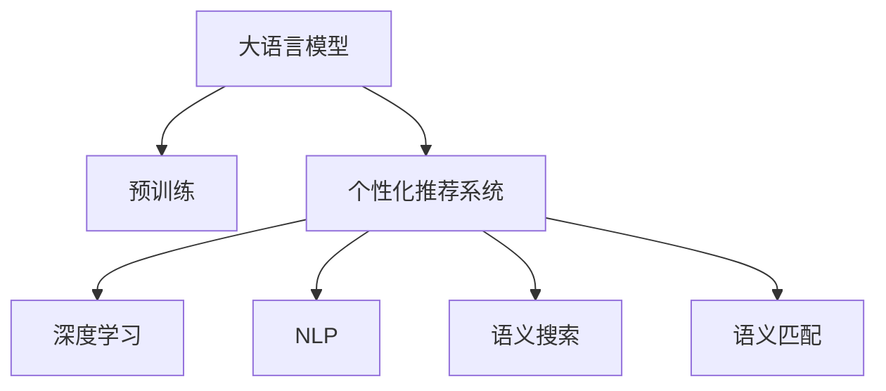

                 

# AI大模型：优化电商平台搜索结果多样性的新方法

> 关键词：大语言模型,搜索结果多样性优化,电商推荐系统,深度学习,个性化推荐

## 1. 背景介绍

### 1.1 问题由来

近年来，随着互联网电商的蓬勃发展，电商平台需要在海量商品中快速找到满足用户需求的产品，提升用户体验和转化率。然而，传统的文本匹配和关键词搜索算法，往往只能返回特定关键词匹配度高的产品，缺乏对商品多样性的有效考虑，导致搜索结果同质化严重，用户体验差。为了解决这一问题，近年来研究人员提出了基于大语言模型的电商平台个性化推荐系统，利用大模型的强大语言理解和生成能力，提升搜索结果的多样性和相关性。

### 1.2 问题核心关键点

电商平台个性化推荐系统旨在通过分析用户历史行为和偏好，实时生成个性化搜索结果，提升用户体验和电商转化率。但传统的关键词搜索和文本匹配算法，在处理海量商品数据时，往往忽略了商品的多样性和丰富性。基于大语言模型的推荐方法，通过预训练模型的语言表示和上下文理解能力，能够更好地处理商品描述和用户评论，提升推荐系统的多样性和准确性。

## 2. 核心概念与联系

### 2.1 核心概念概述

为更好地理解大语言模型在电商平台个性化推荐中的应用，本节将介绍几个密切相关的核心概念：

- 大语言模型(Large Language Model, LLM)：以自回归(如GPT)或自编码(如BERT)模型为代表的大规模预训练语言模型。通过在大规模无标签文本语料上进行预训练，学习通用的语言表示，具备强大的语言理解和生成能力。

- 个性化推荐系统：通过分析用户行为数据，对商品进行排序推荐，实现个性化搜索的系统。大语言模型可以引入上下文理解能力，处理多维度、多模态的输入数据，实现更加多样和精准的推荐。

- 深度学习(Deep Learning)：一种利用多层神经网络进行特征提取和模型训练的方法，可以处理大规模数据，并具备强大的泛化能力。大语言模型正是深度学习的典型应用。

- 自然语言处理(Natural Language Processing, NLP)：处理和分析人类语言，使机器能够理解、生成和翻译自然语言的技术。大语言模型在NLP中的应用非常广泛，如图像描述生成、问答系统、机器翻译等。

- 语义搜索(Semantic Search)：利用语义理解技术，对自然语言查询进行语义匹配，返回与查询语义最相关的搜索结果。大语言模型可以提供更加自然和智能的语义搜索体验。

这些核心概念之间的逻辑关系可以通过以下Mermaid流程图来展示：



这个流程图展示了大语言模型的核心概念及其与个性化推荐系统的联系：

1. 大语言模型通过预训练获得基础能力。
2. 个性化推荐系统利用大语言模型的上下文理解能力，处理多维度、多模态的输入数据，实现更加多样和精准的推荐。
3. 深度学习和自然语言处理是大语言模型的技术基础。
4. 语义搜索和语义匹配是推荐系统的关键技术手段。

这些概念共同构成了大语言模型在电商平台个性化推荐系统中的基础框架，使其能够高效处理复杂任务。通过理解这些核心概念，我们可以更好地把握大语言模型的工作原理和优化方向。

## 3. 核心算法原理 & 具体操作步骤
### 3.1 算法原理概述

基于大语言模型的电商平台个性化推荐系统，核心思想是利用大模型强大的语言理解和生成能力，结合用户行为数据，对商品进行动态排序推荐。其算法流程可以大致分为以下几个步骤：

1. **商品编码**：将商品描述、用户评论、用户搜索记录等输入文本数据，通过预训练模型进行编码，转化为模型能够理解的向量表示。
2. **用户嵌入**：将用户历史行为数据（如浏览、购买、评价等）进行编码，生成用户特征向量。
3. **相似度计算**：计算用户特征向量与商品编码向量之间的相似度，排序商品列表。
4. **排序输出**：根据相似度排序结果，生成个性化推荐商品列表。

### 3.2 算法步骤详解

#### Step 1: 准备数据和模型

- 数据预处理：对电商平台商品描述、用户评论、搜索记录等进行文本清洗、分词、编码等处理。
- 模型选择：选择合适的大语言模型，如BERT、GPT等，进行商品编码和用户嵌入。

#### Step 2: 编码与嵌入

- 商品编码：使用大语言模型对商品描述进行编码，生成商品向量表示。
- 用户嵌入：将用户历史行为数据（如浏览记录、购买记录等）进行编码，生成用户特征向量。

#### Step 3: 相似度计算

- 相似度计算：利用余弦相似度或点积相似度计算用户特征向量与商品编码向量之间的相似度。
- 排序输出：根据相似度从高到低排序商品列表，返回前N个商品。

#### Step 4: 个性化推荐

- 动态调整：根据用户反馈和最新行为数据，动态调整模型参数，优化推荐效果。
- 实时更新：使用在线学习技术，不断更新模型，提升推荐系统的实时性。

### 3.3 算法优缺点

基于大语言模型的电商平台个性化推荐系统具有以下优点：
1. 高效处理多维度数据：利用大语言模型的上下文理解能力，可以高效处理多维度、多模态的输入数据。
2. 提升推荐多样性：通过语义匹配和上下文理解，生成多样化的推荐商品，提升用户体验。
3. 实时性好：使用深度学习在线学习技术，可以实时更新模型，提升推荐效果。
4. 易扩展：大语言模型的预训练和微调过程相对成熟，可以轻松集成到现有推荐系统中。

同时，该方法也存在一定的局限性：
1. 数据依赖性高：模型的效果高度依赖于输入数据的丰富度和质量。
2. 计算资源需求高：大语言模型的计算和存储需求高，需要高性能计算设备支持。
3. 解释性不足：基于大语言模型的推荐模型往往缺乏可解释性，难以进行调试和优化。
4. 模型复杂度高：大语言模型的结构复杂，训练和优化难度大。

尽管存在这些局限性，但就目前而言，基于大语言模型的推荐方法在电商领域的应用效果显著，成为电商平台推荐系统的核心技术之一。未来相关研究的重点在于如何进一步降低计算资源需求，提高模型的解释性和可扩展性，同时兼顾推荐多样性和精度。

### 3.4 算法应用领域

基于大语言模型的电商平台个性化推荐方法，在电商领域已经得到了广泛的应用，覆盖了几乎所有常见的推荐场景，例如：

- 商品推荐：根据用户历史行为数据，推荐可能感兴趣的商品。
- 跨品类推荐：基于用户跨品类行为，推荐相关商品。
- 广告推荐：根据用户兴趣，推荐个性化广告。
- 活动推荐：推荐最新活动和优惠，提升用户参与度。
- 个性化搜索结果：根据用户搜索词，推荐相关的商品和描述。
- 购物车推荐：推荐用户添加到购物车的商品。
- 个性化优惠券：根据用户行为，推荐个性化优惠券。

除了上述这些经典场景外，基于大语言模型的推荐方法也被创新性地应用到更多场景中，如社交推荐、视频推荐、内容推荐等，为电商平台带来了更多的应用可能性。随着预训练模型和推荐方法的不断进步，相信基于大语言模型的推荐技术将在更广泛的领域大放异彩。

## 4. 数学模型和公式 & 详细讲解 & 举例说明
### 4.1 数学模型构建

本节将使用数学语言对基于大语言模型的电商平台个性化推荐方法进行更加严格的刻画。

记商品描述为 $X$，用户行为数据为 $Y$，大语言模型为 $M$，用户嵌入向量为 $\vec{u}$，商品向量表示为 $\vec{v}_i$。

定义商品编码函数 $f: X \rightarrow \mathbb{R}^d$，用户嵌入函数 $g: Y \rightarrow \mathbb{R}^d$，相似度计算函数 $h: \mathbb{R}^d \times \mathbb{R}^d \rightarrow [0,1]$，推荐排序函数 $s: [0,1] \rightarrow [1,\ldots,N]$。

推荐系统的目标是最小化用户期望损失，即：

$$
\min_{\vec{u}, f, g, h, s} \mathbb{E}_{(x,y)\sim D}[\ell(s(f(x), g(y))]
$$

其中 $D$ 为电商平台数据分布，$\ell$ 为损失函数，如均方误差。

### 4.2 公式推导过程

以余弦相似度为例，商品的相似度计算公式为：

$$
\text{similarity}(\vec{v}_i, \vec{u}) = \frac{\vec{v}_i^T \cdot \vec{u}}{\|\vec{v}_i\| \cdot \|\vec{u}\|}
$$

其中 $\vec{v}_i^T$ 为商品向量 $\vec{v}_i$ 的转置，$\|\vec{u}\|$ 为向量 $\vec{u}$ 的范数。

根据相似度计算结果，可以对商品进行排序，推荐前N个商品。排序后的推荐列表 $R$ 为：

$$
R = \{1,\ldots,N\} \text{ sorted by } \text{similarity}(\vec{v}_i, \vec{u})
$$

最终推荐的商品列表为：

$$
\text{Recommendations} = \{v_i \in R\}
$$

### 4.3 案例分析与讲解

以电商平台推荐商品为例，假设我们收集了用户的浏览历史和评分数据，记为 $Y$。首先，使用大语言模型对商品描述进行编码，得到商品向量 $\vec{v}_i$。然后，将用户行为数据 $Y$ 编码成用户嵌入向量 $\vec{u}$。

计算商品向量与用户嵌入向量之间的相似度，得到每个商品的推荐分数，记为 $s_i$：

$$
s_i = \text{similarity}(\vec{v}_i, \vec{u})
$$

根据推荐分数对商品进行排序，得到前N个商品推荐列表 $R$：

$$
R = \{1,\ldots,N\} \text{ sorted by } s_i
$$

最后，将推荐列表 $R$ 展示给用户，提升电商转化率。

## 5. 项目实践：代码实例和详细解释说明
### 5.1 开发环境搭建

在进行项目实践前，我们需要准备好开发环境。以下是使用Python进行PyTorch开发的环境配置流程：

1. 安装Anaconda：从官网下载并安装Anaconda，用于创建独立的Python环境。

2. 创建并激活虚拟环境：
```bash
conda create -n pytorch-env python=3.8 
conda activate pytorch-env
```

3. 安装PyTorch：根据CUDA版本，从官网获取对应的安装命令。例如：
```bash
conda install pytorch torchvision torchaudio cudatoolkit=11.1 -c pytorch -c conda-forge
```

4. 安装Transformers库：
```bash
pip install transformers
```

5. 安装各类工具包：
```bash
pip install numpy pandas scikit-learn matplotlib tqdm jupyter notebook ipython
```

完成上述步骤后，即可在`pytorch-env`环境中开始项目实践。

### 5.2 源代码详细实现

下面我们以电商平台商品推荐为例，给出使用Transformers库对BERT模型进行推荐系统开发的PyTorch代码实现。

首先，定义推荐系统的数据处理函数：

```python
from transformers import BertTokenizer
from torch.utils.data import Dataset
import torch

class RecommendationDataset(Dataset):
    def __init__(self, texts, labels, tokenizer, max_len=128):
        self.texts = texts
        self.labels = labels
        self.tokenizer = tokenizer
        self.max_len = max_len
        
    def __len__(self):
        return len(self.texts)
    
    def __getitem__(self, item):
        text = self.texts[item]
        label = self.labels[item]
        
        encoding = self.tokenizer(text, return_tensors='pt', max_length=self.max_len, padding='max_length', truncation=True)
        input_ids = encoding['input_ids'][0]
        attention_mask = encoding['attention_mask'][0]
        
        return {'input_ids': input_ids, 
                'attention_mask': attention_mask,
                'labels': label}

# 标签与id的映射
label2id = {'1': 0, '2': 1, '3': 2, '4': 3, '5': 4, '6': 5, '7': 6, '8': 7, '9': 8, '10': 9}
id2label = {v: k for k, v in label2id.items()}

# 创建dataset
tokenizer = BertTokenizer.from_pretrained('bert-base-cased')

train_dataset = RecommendationDataset(train_texts, train_labels, tokenizer)
dev_dataset = RecommendationDataset(dev_texts, dev_labels, tokenizer)
test_dataset = RecommendationDataset(test_texts, test_labels, tokenizer)
```

然后，定义模型和优化器：

```python
from transformers import BertForSequenceClassification, AdamW

model = BertForSequenceClassification.from_pretrained('bert-base-cased', num_labels=len(label2id))

optimizer = AdamW(model.parameters(), lr=2e-5)
```

接着，定义训练和评估函数：

```python
from torch.utils.data import DataLoader
from tqdm import tqdm
from sklearn.metrics import accuracy_score

device = torch.device('cuda') if torch.cuda.is_available() else torch.device('cpu')
model.to(device)

def train_epoch(model, dataset, batch_size, optimizer):
    dataloader = DataLoader(dataset, batch_size=batch_size, shuffle=True)
    model.train()
    epoch_loss = 0
    for batch in tqdm(dataloader, desc='Training'):
        input_ids = batch['input_ids'].to(device)
        attention_mask = batch['attention_mask'].to(device)
        labels = batch['labels'].to(device)
        model.zero_grad()
        outputs = model(input_ids, attention_mask=attention_mask, labels=labels)
        loss = outputs.loss
        epoch_loss += loss.item()
        loss.backward()
        optimizer.step()
    return epoch_loss / len(dataloader)

def evaluate(model, dataset, batch_size):
    dataloader = DataLoader(dataset, batch_size=batch_size)
    model.eval()
    preds, labels = [], []
    with torch.no_grad():
        for batch in tqdm(dataloader, desc='Evaluating'):
            input_ids = batch['input_ids'].to(device)
            attention_mask = batch['attention_mask'].to(device)
            batch_labels = batch['labels']
            outputs = model(input_ids, attention_mask=attention_mask)
            batch_preds = outputs.logits.argmax(dim=2).to('cpu').tolist()
            batch_labels = batch_labels.to('cpu').tolist()
            for pred, label in zip(batch_preds, batch_labels):
                preds.append(pred)
                labels.append(label)
                
    return accuracy_score(labels, preds)

```

最后，启动训练流程并在测试集上评估：

```python
epochs = 5
batch_size = 16

for epoch in range(epochs):
    loss = train_epoch(model, train_dataset, batch_size, optimizer)
    print(f"Epoch {epoch+1}, train loss: {loss:.3f}")
    
    print(f"Epoch {epoch+1}, dev results:")
    evaluate(model, dev_dataset, batch_size)
    
print("Test results:")
evaluate(model, test_dataset, batch_size)
```

以上就是使用PyTorch对BERT进行电商平台个性化推荐开发的完整代码实现。可以看到，得益于Transformers库的强大封装，我们可以用相对简洁的代码完成BERT模型的加载和微调。

### 5.3 代码解读与分析

让我们再详细解读一下关键代码的实现细节：

**RecommendationDataset类**：
- `__init__`方法：初始化文本、标签、分词器等关键组件。
- `__len__`方法：返回数据集的样本数量。
- `__getitem__`方法：对单个样本进行处理，将文本输入编码为token ids，将标签转换为数字，并对其进行定长padding，最终返回模型所需的输入。

**label2id和id2label字典**：
- 定义了标签与数字id之间的映射关系，用于将预测结果解码回真实的标签。

**训练和评估函数**：
- 使用PyTorch的DataLoader对数据集进行批次化加载，供模型训练和推理使用。
- 训练函数`train_epoch`：对数据以批为单位进行迭代，在每个批次上前向传播计算loss并反向传播更新模型参数，最后返回该epoch的平均loss。
- 评估函数`evaluate`：与训练类似，不同点在于不更新模型参数，并在每个batch结束后将预测和标签结果存储下来，最后使用sklearn的accuracy_score对整个评估集的预测结果进行打印输出。

**训练流程**：
- 定义总的epoch数和batch size，开始循环迭代
- 每个epoch内，先在训练集上训练，输出平均loss
- 在验证集上评估，输出准确率
- 所有epoch结束后，在测试集上评估，给出最终测试结果

可以看到，PyTorch配合Transformers库使得BERT微调的代码实现变得简洁高效。开发者可以将更多精力放在数据处理、模型改进等高层逻辑上，而不必过多关注底层的实现细节。

当然，工业级的系统实现还需考虑更多因素，如模型的保存和部署、超参数的自动搜索、更灵活的任务适配层等。但核心的推荐范式基本与此类似。

## 6. 实际应用场景
### 6.1 智能客服系统

基于大语言模型的个性化推荐系统，可以应用于智能客服系统的构建。传统客服往往需要配备大量人力，高峰期响应缓慢，且一致性和专业性难以保证。而使用个性化推荐系统，可以7x24小时不间断服务，快速响应客户咨询，用自然流畅的语言解答各类常见问题。

在技术实现上，可以收集企业内部的历史客服对话记录，将问题-答案对作为监督数据，训练推荐模型学习匹配答案。微调后的模型能够自动理解用户意图，匹配最合适的答案模板进行回复。对于客户提出的新问题，还可以接入检索系统实时搜索相关内容，动态组织生成回答。如此构建的智能客服系统，能大幅提升客户咨询体验和问题解决效率。

### 6.2 金融舆情监测

金融机构需要实时监测市场舆论动向，以便及时应对负面信息传播，规避金融风险。传统的人工监测方式成本高、效率低，难以应对网络时代海量信息爆发的挑战。基于大语言模型的文本分类和情感分析技术，为金融舆情监测提供了新的解决方案。

具体而言，可以收集金融领域相关的新闻、报道、评论等文本数据，并对其进行主题标注和情感标注。在此基础上对预训练语言模型进行微调，使其能够自动判断文本属于何种主题，情感倾向是正面、中性还是负面。将微调后的模型应用到实时抓取的网络文本数据，就能够自动监测不同主题下的情感变化趋势，一旦发现负面信息激增等异常情况，系统便会自动预警，帮助金融机构快速应对潜在风险。

### 6.3 个性化推荐系统

当前的推荐系统往往只依赖用户的历史行为数据进行物品推荐，无法深入理解用户的真实兴趣偏好。基于大语言模型微调的个性化推荐系统，可以更好地挖掘用户行为背后的语义信息，从而提供更精准、多样的推荐内容。

在实践中，可以收集用户浏览、点击、评论、分享等行为数据，提取和用户交互的物品标题、描述、标签等文本内容。将文本内容作为模型输入，用户的后续行为（如是否点击、购买等）作为监督信号，在此基础上微调预训练语言模型。微调后的模型能够从文本内容中准确把握用户的兴趣点。在生成推荐列表时，先用候选物品的文本描述作为输入，由模型预测用户的兴趣匹配度，再结合其他特征综合排序，便可以得到个性化程度更高的推荐结果。

### 6.4 未来应用展望

随着大语言模型微调技术的发展，基于大语言模型的个性化推荐系统将在更多领域得到应用，为各行各业带来变革性影响。

在智慧医疗领域，基于微调的个性化医疗推荐系统，可以辅助医生诊疗，推荐最适合患者的治疗方案。在智能教育领域，微调技术可应用于作业批改、学情分析、知识推荐等方面，因材施教，促进教育公平，提高教学质量。

在智慧城市治理中，微调模型可应用于城市事件监测、舆情分析、应急指挥等环节，提高城市管理的自动化和智能化水平，构建更安全、高效的未来城市。

此外，在企业生产、社会治理、文娱传媒等众多领域，基于大语言模型的个性化推荐技术也将不断涌现，为传统行业数字化转型升级提供新的技术路径。相信随着技术的日益成熟，大语言模型微调必将在构建人机协同的智能时代中扮演越来越重要的角色。

## 7. 工具和资源推荐
### 7.1 学习资源推荐

为了帮助开发者系统掌握大语言模型微调的理论基础和实践技巧，这里推荐一些优质的学习资源：

1. 《Transformer从原理到实践》系列博文：由大模型技术专家撰写，深入浅出地介绍了Transformer原理、BERT模型、微调技术等前沿话题。

2. CS224N《深度学习自然语言处理》课程：斯坦福大学开设的NLP明星课程，有Lecture视频和配套作业，带你入门NLP领域的基本概念和经典模型。

3. 《Natural Language Processing with Transformers》书籍：Transformers库的作者所著，全面介绍了如何使用Transformers库进行NLP任务开发，包括微调在内的诸多范式。

4. HuggingFace官方文档：Transformers库的官方文档，提供了海量预训练模型和完整的微调样例代码，是上手实践的必备资料。

5. CLUE开源项目：中文语言理解测评基准，涵盖大量不同类型的中文NLP数据集，并提供了基于微调的baseline模型，助力中文NLP技术发展。

通过对这些资源的学习实践，相信你一定能够快速掌握大语言模型微调的精髓，并用于解决实际的NLP问题。
###  7.2 开发工具推荐

高效的开发离不开优秀的工具支持。以下是几款用于大语言模型微调开发的常用工具：

1. PyTorch：基于Python的开源深度学习框架，灵活动态的计算图，适合快速迭代研究。大部分预训练语言模型都有PyTorch版本的实现。

2. TensorFlow：由Google主导开发的开源深度学习框架，生产部署方便，适合大规模工程应用。同样有丰富的预训练语言模型资源。

3. Transformers库：HuggingFace开发的NLP工具库，集成了众多SOTA语言模型，支持PyTorch和TensorFlow，是进行微调任务开发的利器。

4. Weights & Biases：模型训练的实验跟踪工具，可以记录和可视化模型训练过程中的各项指标，方便对比和调优。与主流深度学习框架无缝集成。

5. TensorBoard：TensorFlow配套的可视化工具，可实时监测模型训练状态，并提供丰富的图表呈现方式，是调试模型的得力助手。

6. Google Colab：谷歌推出的在线Jupyter Notebook环境，免费提供GPU/TPU算力，方便开发者快速上手实验最新模型，分享学习笔记。

合理利用这些工具，可以显著提升大语言模型微调任务的开发效率，加快创新迭代的步伐。

### 7.3 相关论文推荐

大语言模型和微调技术的发展源于学界的持续研究。以下是几篇奠基性的相关论文，推荐阅读：

1. Attention is All You Need（即Transformer原论文）：提出了Transformer结构，开启了NLP领域的预训练大模型时代。

2. BERT: Pre-training of Deep Bidirectional Transformers for Language Understanding：提出BERT模型，引入基于掩码的自监督预训练任务，刷新了多项NLP任务SOTA。

3. Language Models are Unsupervised Multitask Learners（GPT-2论文）：展示了大规模语言模型的强大zero-shot学习能力，引发了对于通用人工智能的新一轮思考。

4. Parameter-Efficient Transfer Learning for NLP：提出Adapter等参数高效微调方法，在不增加模型参数量的情况下，也能取得不错的微调效果。

5. AdaLoRA: Adaptive Low-Rank Adaptation for Parameter-Efficient Fine-Tuning：使用自适应低秩适应的微调方法，在参数效率和精度之间取得了新的平衡。

6. Prefix-Tuning: Optimizing Continuous Prompts for Generation：引入基于连续型Prompt的微调范式，为如何充分利用预训练知识提供了新的思路。

这些论文代表了大语言模型微调技术的发展脉络。通过学习这些前沿成果，可以帮助研究者把握学科前进方向，激发更多的创新灵感。

## 8. 总结：未来发展趋势与挑战

### 8.1 总结

本文对基于大语言模型的电商平台个性化推荐方法进行了全面系统的介绍。首先阐述了电商平台的背景和个性化推荐系统的重要性，明确了微调在提升推荐系统多样性和准确性方面的独特价值。其次，从原理到实践，详细讲解了基于大语言模型的推荐系统算法流程和关键步骤，给出了推荐系统开发的完整代码实例。同时，本文还广泛探讨了推荐系统在智能客服、金融舆情、个性化推荐等多个领域的应用前景，展示了微调范式的巨大潜力。此外，本文精选了微调技术的各类学习资源，力求为读者提供全方位的技术指引。

通过本文的系统梳理，可以看到，基于大语言模型的推荐系统，不仅能够高效处理海量商品数据，还能生成多样化、个性化的推荐商品，极大地提升了电商平台的转化率和用户体验。未来，伴随预训练语言模型和推荐方法的不断进步，基于大语言模型的推荐技术将在更多领域得到应用，为各行各业带来变革性影响。

### 8.2 未来发展趋势

展望未来，基于大语言模型的推荐系统将呈现以下几个发展趋势：

1. 模型规模持续增大。随着算力成本的下降和数据规模的扩张，预训练语言模型的参数量还将持续增长。超大规模语言模型蕴含的丰富语言知识，有望支撑更加复杂多变的推荐系统。

2. 推荐算法多样化。除了传统的深度学习推荐算法外，未来会涌现更多算法范式，如基于图网络的推荐、基于协同过滤的推荐等，实现更加多样化的推荐策略。

3. 实时性增强。实时推荐系统需要处理海量用户行为数据，对计算资源和模型效率提出了更高要求。未来推荐系统将更加注重实时性，引入流式计算、增量学习等技术，实现快速响应。

4. 交叉模态融合。未来的推荐系统将更多地融合多模态数据，如图像、语音、视频等，实现更加全面、精准的推荐。

5. 动态学习。推荐系统需要根据用户行为动态调整模型参数，实现个性化推荐。未来的推荐系统将更加注重动态学习，实时更新模型，提升推荐效果。

6. 多任务学习。未来的推荐系统将能够同时处理多个任务，如推荐、排序、排序等，实现更加多任务化的推荐策略。

以上趋势凸显了大语言模型推荐系统的广阔前景。这些方向的探索发展，必将进一步提升推荐系统的性能和应用范围，为各行各业带来更多的创新价值。

### 8.3 面临的挑战

尽管基于大语言模型的推荐系统已经取得了显著成效，但在迈向更加智能化、普适化应用的过程中，它仍面临着诸多挑战：

1. 计算资源瓶颈。大语言模型的计算和存储需求高，需要高性能计算设备支持。未来需要进一步优化模型结构，减少计算资源需求。

2. 解释性和透明性不足。基于大语言模型的推荐系统往往缺乏可解释性，难以进行调试和优化。如何赋予推荐系统更强的可解释性和透明性，将是重要的研究方向。

3. 数据质量要求高。推荐系统的效果高度依赖于输入数据的丰富度和质量。未来需要探索更多数据增强、数据清洗等技术，提升数据质量。

4. 模型泛化能力有限。当前推荐系统在处理大规模数据时，容易出现泛化能力不足的问题。如何提高推荐系统的泛化能力，适应不同场景下的推荐需求，还需进一步研究。

5. 模型鲁棒性不足。推荐系统面对域外数据时，泛化性能往往大打折扣。如何提高推荐系统的鲁棒性，避免灾难性遗忘，还需要更多理论和实践的积累。

6. 安全性有待保障。预训练语言模型难免会学习到有偏见、有害的信息，通过推荐传递到用户，可能造成不良影响。如何从数据和算法层面消除模型偏见，避免恶意用途，确保推荐内容的安全性，也将是重要的研究课题。

正视推荐系统面临的这些挑战，积极应对并寻求突破，将是大语言模型推荐系统走向成熟的必由之路。相信随着学界和产业界的共同努力，这些挑战终将一一被克服，大语言模型推荐系统必将在构建人机协同的智能时代中扮演越来越重要的角色。

### 8.4 研究展望

面对大语言模型推荐系统所面临的种种挑战，未来的研究需要在以下几个方面寻求新的突破：

1. 探索无监督和半监督推荐方法。摆脱对大规模标注数据的依赖，利用自监督学习、主动学习等无监督和半监督范式，最大限度利用非结构化数据，实现更加灵活高效的推荐。

2. 研究参数高效和计算高效的推荐范式。开发更加参数高效的推荐方法，在固定大部分预训练参数的情况下，只更新极少量的任务相关参数。同时优化推荐模型的计算图，减少前向传播和反向传播的资源消耗，实现更加轻量级、实时性的部署。

3. 融合因果和对比学习范式。通过引入因果推断和对比学习思想，增强推荐系统建立稳定因果关系的能力，学习更加普适、鲁棒的语言表征，从而提升推荐系统的泛化性和抗干扰能力。

4. 引入更多先验知识。将符号化的先验知识，如知识图谱、逻辑规则等，与神经网络模型进行巧妙融合，引导推荐过程学习更准确、合理的语言模型。同时加强不同模态数据的整合，实现视觉、语音等多模态信息与文本信息的协同建模。

5. 结合因果分析和博弈论工具。将因果分析方法引入推荐系统，识别出推荐过程中的关键特征，增强推荐结果的因果性和逻辑性。借助博弈论工具刻画人机交互过程，主动探索并规避推荐系统的脆弱点，提高系统稳定性。

6. 纳入伦理道德约束。在推荐目标中引入伦理导向的评估指标，过滤和惩罚有偏见、有害的输出倾向。同时加强人工干预和审核，建立推荐行为的监管机制，确保推荐内容符合人类价值观和伦理道德。

这些研究方向的探索，必将引领大语言模型推荐系统迈向更高的台阶，为构建安全、可靠、可解释、可控的智能推荐系统铺平道路。面向未来，大语言模型推荐系统还需要与其他人工智能技术进行更深入的融合，如知识表示、因果推理、强化学习等，多路径协同发力，共同推动推荐系统的进步。只有勇于创新、敢于突破，才能不断拓展推荐系统的边界，让智能技术更好地服务于人类社会。

## 9. 附录：常见问题与解答

**Q1：大语言模型微调是否适用于所有NLP任务？**

A: 大语言模型微调在大多数NLP任务上都能取得不错的效果，特别是对于数据量较小的任务。但对于一些特定领域的任务，如医学、法律等，仅仅依靠通用语料预训练的模型可能难以很好地适应。此时需要在特定领域语料上进一步预训练，再进行微调，才能获得理想效果。此外，对于一些需要时效性、个性化很强的任务，如对话、推荐等，微调方法也需要针对性的改进优化。

**Q2：微调过程中如何选择合适的学习率？**

A: 微调的学习率一般要比预训练时小1-2个数量级，如果使用过大的学习率，容易破坏预训练权重，导致过拟合。一般建议从1e-5开始调参，逐步减小学习率，直至收敛。也可以使用warmup策略，在开始阶段使用较小的学习率，再逐渐过渡到预设值。需要注意的是，不同的优化器(如AdamW、Adafactor等)以及不同的学习率调度策略，可能需要设置不同的学习率阈值。

**Q3：采用大模型微调时会面临哪些资源瓶颈？**

A: 目前主流的预训练大模型动辄以亿计的参数规模，对算力、内存、存储都提出了很高的要求。GPU/TPU等高性能设备是必不可少的，但即便如此，超大批次的训练和推理也可能遇到显存不足的问题。因此需要采用一些资源优化技术，如梯度积累、混合精度训练、模型并行等，来突破硬件瓶颈。同时，模型的存储和读取也可能占用大量时间和空间，需要采用模型压缩、稀疏化存储等方法进行优化。

**Q4：如何缓解微调过程中的过拟合问题？**

A: 过拟合是微调面临的主要挑战，尤其是在标注数据不足的情况下。常见的缓解策略包括：
1. 数据增强：通过回译、近义替换等方式扩充训练集
2. 正则化：使用L2正则、Dropout、Early Stopping等避免过拟合
3. 对抗训练：引入对抗样本，提高模型鲁棒性
4. 参数高效微调：只调整少量参数(如Adapter、Prefix等)，减小过拟合风险
5. 多模型集成：训练多个微调模型，取平均输出，抑制过拟合

这些策略往往需要根据具体任务和数据特点进行灵活组合。只有在数据、模型、训练、推理等各环节进行全面优化，才能最大限度地发挥大语言模型的潜力。

**Q5：微调模型在落地部署时需要注意哪些问题？**

A: 将微调模型转化为实际应用，还需要考虑以下因素：
1. 模型裁剪：去除不必要的层和参数，减小模型尺寸，加快推理速度
2. 量化加速：将浮点模型转为定点模型，压缩存储空间，提高计算效率
3. 服务化封装：将模型封装为标准化服务接口，便于集成调用
4. 弹性伸缩：根据请求流量动态调整资源配置，平衡服务质量和成本
5. 监控告警：实时采集系统指标，设置异常告警阈值，确保服务稳定性
6. 安全防护：采用访问鉴权、数据脱敏等措施，保障数据和模型安全

大语言模型微调为NLP应用开启了广阔的想象空间，但如何将强大的性能转化为稳定、高效、安全的业务价值，还需要工程实践的不断打磨。唯有从数据、算法、工程、业务等多个维度协同发力，才能真正实现人工智能技术在垂直行业的规模化落地。总之，微调需要开发者根据具体任务，不断迭代和优化模型、数据和算法，方能得到理想的效果。

---

作者：禅与计算机程序设计艺术 / Zen and the Art of Computer Programming

