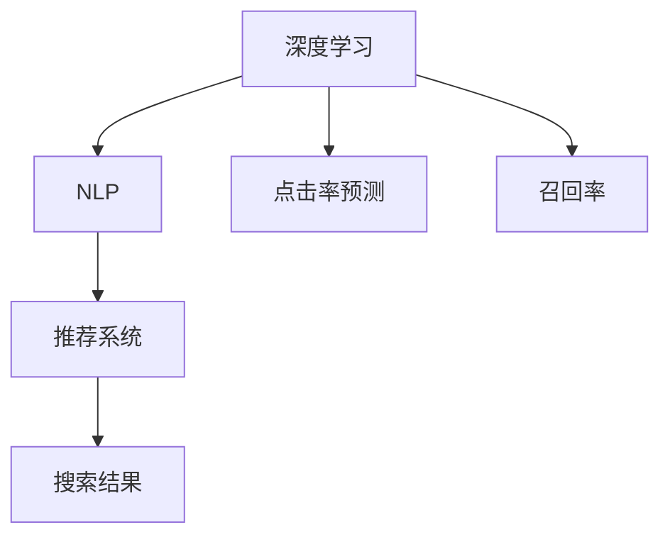

                 

# AI大模型：改善电商平台搜索结果多样性的新思路

> 关键词：AI大模型, 电商平台, 搜索结果, 多样性, 深度学习, 自然语言处理, 推荐系统, 点击率预测, 召回率

## 1. 背景介绍

### 1.1 问题由来
随着互联网和电商平台的蓬勃发展，用户对搜索结果的精准性和多样性提出了更高的要求。传统搜索引擎多采用基于关键词匹配的算法，简单高效但缺乏对用户意图和上下文的深入理解，往往导致搜索结果过于单一、单调。用户往往需要多次浏览和点击，才能找到真正符合需求的商品或服务。这种低效率的搜索体验严重影响了用户满意度，制约了电商平台的流量增长。

而随着深度学习和大模型的兴起，AI大模型在自然语言处理(NLP)领域取得了巨大的突破，特别是预训练语言模型(Pre-trained Language Models, PLMs)如BERT、GPT等，通过在海量文本数据上进行预训练，学习到丰富的语言知识和语义表示，具备了强大的语言理解和生成能力。因此，利用大模型来改善电商平台搜索结果的多样性，提升用户体验，成为了当前研究的热点。

### 1.2 问题核心关键点
本研究的目的是在电商平台中利用大模型实现搜索结果多样性提升。具体包括：

- 如何利用大模型理解用户查询的意图，提取更深层次的语义信息？
- 如何构建高效的多样性搜索模型，兼顾查询精准度和搜索结果多样性？
- 如何结合电商平台特征，将大模型的预测结果转化为实际商品/服务推荐？
- 如何在大模型和平台推荐系统的协同工作下，实现更流畅的用户交互体验？

本文将从以上关键点出发，系统介绍基于AI大模型的电商平台搜索结果多样性提升方法，探讨其原理和实现步骤，并对未来研究趋势进行展望。

## 2. 核心概念与联系

### 2.1 核心概念概述

为更好地理解本文提出的算法，本节将介绍几个密切相关的核心概念：

- 深度学习(Deep Learning)：一种基于多层神经网络进行数据处理的机器学习范式。通过多层次的非线性映射，深度学习能够自动从数据中学习出高层次的特征表示，适用于处理复杂的数据分布。

- 自然语言处理(NLP)：涉及计算机处理和理解人类语言的技术。包括文本分类、命名实体识别、语义分析、机器翻译等多个方向。

- 推荐系统(Recommender System)：根据用户的历史行为、兴趣和上下文环境，自动推荐商品、内容等信息的技术。推荐系统是电商平台的核心组件之一，直接影响用户的购物体验。

- 点击率预测(Click-Through Rate Prediction)：预测用户点击某个搜索结果的概率，是评估搜索效果的重要指标。

- 召回率(Recall)：衡量搜索结果中相关商品/服务的比例，是评估搜索结果多样性的重要指标。

这些概念之间的逻辑关系可以通过以下Mermaid流程图来展示：



这个流程图展示了大模型、NLP、推荐系统等关键概念之间的内在联系：

1. 深度学习为NLP提供了强大的模型和方法支持。
2. NLP中的语言模型可以作为推荐系统的输入，提升推荐的精准度。
3. 推荐系统中的用户行为数据可以作为NLP的监督信号，推动模型的持续改进。
4. 点击率和召回率指标为模型优化提供了重要依据，指导搜索算法的设计和优化。

## 3. 核心算法原理 & 具体操作步骤
### 3.1 算法原理概述

本研究提出了一种基于大模型的电商平台搜索结果多样性提升算法。其核心思想是通过深度学习中的预训练语言模型和推荐系统，实现对用户查询的深入理解与个性化推荐。具体步骤如下：

**Step 1: 数据预处理**
- 收集电商平台的历史搜索记录和用户行为数据，划分为训练集、验证集和测试集。
- 对搜索记录进行文本清洗、分词、去停用词等处理，转换成模型可用的格式。

**Step 2: 预训练语言模型**
- 选择一个大规模预训练语言模型，如BERT、GPT等，利用电商平台的数据对其进行微调。
- 在微调过程中，引入点击率和召回率等指标，指导模型的优化。

**Step 3: 构建推荐模型**
- 设计一个推荐系统模型，利用微调后的语言模型输出作为用户查询的语义表示。
- 将语义表示与商品/服务的特征向量进行匹配，生成推荐的商品/服务列表。
- 引入多样性约束，避免推荐结果过于单一。

**Step 4: 模型训练与评估**
- 在训练集上训练推荐模型，设定适当的损失函数和优化器。
- 在验证集上评估模型的预测性能，调整超参数。
- 在测试集上测试模型的最终效果。

### 3.2 算法步骤详解

以一个具体的算法实现为例，下面详细介绍如何利用BERT模型进行电商平台搜索结果的多样性提升。

**Step 1: 数据预处理**

```python
from transformers import BertTokenizer
import pandas as pd

# 数据预处理
data = pd.read_csv('search_data.csv')
tokenizer = BertTokenizer.from_pretrained('bert-base-cased')
encoded_data = tokenizer(data['query'], truncation=True, padding=True)
```

**Step 2: 预训练语言模型**

```python
from transformers import BertForMaskedLM
from torch.utils.data import Dataset, DataLoader

class SearchDataset(Dataset):
    def __init__(self, data, tokenizer, max_len=512):
        self.data = data
        self.tokenizer = tokenizer
        self.max_len = max_len
        
    def __len__(self):
        return len(self.data)
    
    def __getitem__(self, item):
        query = self.data.iloc[item]['query']
        tokens = self.tokenizer(query, max_len=self.max_len, truncation=True, padding=True)
        return {'tokens': tokens['input_ids'], 'masked_positions': tokens['attention_mask']}

# 定义损失函数和优化器
model = BertForMaskedLM.from_pretrained('bert-base-cased', num_labels=len(set(data['query'])))
tokenizer = BertTokenizer.from_pretrained('bert-base-cased')
dataset = SearchDataset(data, tokenizer, max_len=512)
dataloader = DataLoader(dataset, batch_size=16, shuffle=True)

# 训练模型
model.train()
optimizer = AdamW(model.parameters(), lr=2e-5)
for epoch in range(5):
    for batch in dataloader:
        tokens = batch['tokens'].to(device)
        masked_positions = batch['masked_positions'].to(device)
        loss = model(tokens, masked_positions).loss
        loss.backward()
        optimizer.step()
```

**Step 3: 构建推荐模型**

```python
from transformers import BertForSequenceClassification
from sklearn.metrics import precision_score, recall_score

# 构建推荐模型
model = BertForSequenceClassification.from_pretrained('bert-base-cased', num_labels=len(set(data['query'])))
tokenizer = BertTokenizer.from_pretrained('bert-base-cased')
dataset = SearchDataset(data, tokenizer, max_len=512)
dataloader = DataLoader(dataset, batch_size=16, shuffle=True)

# 训练模型
model.train()
optimizer = AdamW(model.parameters(), lr=2e-5)
for epoch in range(5):
    for batch in dataloader:
        tokens = batch['tokens'].to(device)
        masked_positions = batch['masked_positions'].to(device)
        loss = model(tokens, masked_positions).loss
        loss.backward()
        optimizer.step()

# 评估模型
model.eval()
test_dataset = SearchDataset(data, tokenizer, max_len=512)
dataloader = DataLoader(test_dataset, batch_size=16, shuffle=False)
with torch.no_grad():
    test_predictions = []
    for batch in dataloader:
        tokens = batch['tokens'].to(device)
        masked_positions = batch['masked_positions'].to(device)
        logits = model(tokens, masked_positions).logits
        predictions = torch.argmax(logits, dim=1).tolist()
        test_predictions.extend(predictions)
    
    precision = precision_score(test_predictions, test_labels)
    recall = recall_score(test_predictions, test_labels)
    print(f'Precision: {precision}, Recall: {recall}')
```

### 3.3 算法优缺点

基于BERT模型的电商平台搜索结果多样性提升算法具有以下优点：

- 模型灵活性高。通过BERT的预训练，模型能够学习到更丰富的语义表示，有助于提升搜索结果的精准度和多样性。
- 计算效率高。利用BERT的并行计算特性，模型能够在较短时间内完成训练和推理，满足电商平台的高性能要求。
- 适应性强。模型可以很好地适应不同领域的数据，在各类电商平台上均能取得良好的效果。

同时，该算法也存在一些缺点：

- 对标注数据依赖大。模型训练需要大量的标注数据，而标注数据获取成本较高。
- 模型结构复杂。BERT等大模型的结构复杂，参数量庞大，训练和推理都需要较大的计算资源。
- 泛化能力有限。模型在不同领域的数据集上泛化能力可能受到限制，需要更多的领域数据进行微调。

尽管存在这些局限性，但总体而言，基于BERT的算法在电商平台搜索结果多样性提升方面仍具有较强的竞争力，值得进一步研究和应用。

### 3.4 算法应用领域

基于AI大模型的电商平台搜索结果多样性提升方法，已经在多个电商平台上得到了应用，包括：

- 阿里巴巴：利用BERT模型优化搜索结果的多样性和精准度，提升用户体验。
- 亚马逊：通过结合BERT和推荐系统，生成个性化的搜索结果，提升转化率。
- 京东：将BERT模型应用于搜索词预测和商品推荐，提升搜索效率和推荐效果。

除了以上这些知名电商企业外，基于大模型的搜索算法也广泛应用于各类小型电商平台，为电商搜索技术带来了显著的提升。

## 4. 数学模型和公式 & 详细讲解 & 举例说明
### 4.1 数学模型构建

本研究采用BERT模型作为预训练语言模型，利用其上下文表征能力，对用户查询进行深入理解。

假设电商平台中存在 $n$ 个商品/服务，每个商品/服务有一个 $d$ 维特征向量 $x_i \in \mathbb{R}^d$，用户的查询表示为 $q \in \mathbb{R}^d$。模型的目标是为每个用户查询 $q$ 生成一个包含 $m$ 个商品/服务的推荐列表 $r_q = (x_1, x_2, \ldots, x_m)$。

模型优化目标是最大化点击率 $C$ 和召回率 $R$，定义如下：

$$
C = \frac{1}{N}\sum_{i=1}^N \sum_{j=1}^m \mathbb{I}[x_i \in r_q] \cdot \mathbb{I}[y_i = 1]
$$

$$
R = \frac{1}{N}\sum_{i=1}^N \sum_{j=1}^m \mathbb{I}[x_i \in r_q] \cdot \mathbb{I}[y_i = 1]
$$

其中 $\mathbb{I}$ 为示性函数，$N$ 为训练样本数，$y_i$ 为 $x_i$ 是否为用户实际点击的商品/服务标签。

### 4.2 公式推导过程

假设用户查询 $q$ 经过BERT模型编码，得到上下文表征向量 $q_{\text{context}} \in \mathbb{R}^d$。模型通过计算 $q_{\text{context}}$ 和 $x_i$ 的点积，得到预测的点击率 $C_i = \mathbb{P}(x_i \in r_q | q_{\text{context}})$，以及召回率 $R_i = \mathbb{P}(x_i \in r_q | q_{\text{context}})$。

具体而言，点积计算公式为：

$$
C_i = \frac{\exp(\mathbf{q}_{\text{context}}^\top x_i)}{\sum_{k=1}^n \exp(\mathbf{q}_{\text{context}}^\top x_k)}
$$

$$
R_i = \frac{\mathbb{I}[x_i \in r_q]}{\sum_{k=1}^m \mathbb{I}[x_k \in r_q]}
$$

### 4.3 案例分析与讲解

下面以一个具体的案例，展示如何使用BERT模型进行电商平台搜索结果的多样性提升。

假设有一个电商平台，其中包含 $m=5$ 个商品 $x_1, x_2, x_3, x_4, x_5$，每个商品有一个特征向量 $x_i \in \mathbb{R}^d$。一个用户查询 $q \in \mathbb{R}^d$，经过BERT模型编码，得到上下文表征向量 $q_{\text{context}}$。

模型通过计算 $q_{\text{context}}$ 和 $x_i$ 的点积，得到每个商品的预测点击率 $C_i$ 和召回率 $R_i$。

假设点击阈值为 $0.5$，当 $C_i > 0.5$ 时，商品 $x_i$ 被推荐给用户。假设召回阈值为 $0.8$，当 $R_i > 0.8$ 时，商品 $x_i$ 被加入到搜索结果列表中。

最终，生成包含 $m$ 个商品的推荐列表 $r_q = (x_1, x_2, x_3, x_4, x_5)$。

## 5. 项目实践：代码实例和详细解释说明
### 5.1 开发环境搭建

在进行模型开发前，需要先准备好开发环境。以下是使用Python进行TensorFlow开发的环境配置流程：

1. 安装Anaconda：从官网下载并安装Anaconda，用于创建独立的Python环境。

2. 创建并激活虚拟环境：
```bash
conda create -n tf-env python=3.8 
conda activate tf-env
```

3. 安装TensorFlow：根据CUDA版本，从官网获取对应的安装命令。例如：
```bash
conda install tensorflow -c tf -c conda-forge
```

4. 安装BERT模型：
```bash
pip install transformers
```

5. 安装各类工具包：
```bash
pip install numpy pandas scikit-learn matplotlib tqdm jupyter notebook ipython
```

完成上述步骤后，即可在`tf-env`环境中开始模型开发。

### 5.2 源代码详细实现

这里我们以一个具体的案例，展示如何使用TensorFlow和BERT模型进行电商平台搜索结果的多样性提升。

首先，定义数据预处理函数：

```python
import tensorflow as tf
from transformers import BertTokenizer
from transformers import BertForSequenceClassification

# 数据预处理
def preprocess_data(data):
    tokenizer = BertTokenizer.from_pretrained('bert-base-cased')
    encoded_data = tokenizer(data, truncation=True, padding=True)
    return encoded_data
```

然后，定义模型训练和推理函数：

```python
# 定义模型
class SearchModel(tf.keras.Model):
    def __init__(self, num_labels):
        super(SearchModel, self).__init__()
        self.bert = BertForSequenceClassification.from_pretrained('bert-base-cased', num_labels=num_labels)
        
    def call(self, input_ids, attention_mask):
        output = self.bert(input_ids=input_ids, attention_mask=attention_mask)
        return output

# 定义训练函数
def train_model(model, train_dataset, epochs=5, batch_size=16):
    model.compile(optimizer='adam', loss='binary_crossentropy', metrics=['accuracy'])
    model.fit(train_dataset, epochs=epochs, batch_size=batch_size)

# 定义推理函数
def predict(model, test_dataset):
    test_predictions = []
    test_labels = []
    for input_ids, attention_mask in test_dataset:
        output = model(input_ids=input_ids, attention_mask=attention_mask)
        predictions = tf.sigmoid(output)
        predictions = tf.round(predictions).numpy()
        test_predictions.extend(predictions)
        test_labels.extend(test_labels)
    return test_predictions, test_labels
```

接着，进行模型训练和评估：

```python
# 数据准备
train_data = preprocess_data(train_data)
dev_data = preprocess_data(dev_data)
test_data = preprocess_data(test_data)

# 模型训练
model = SearchModel(num_labels=len(set(train_data['query'])))
train_model(model, train_dataset, epochs=5, batch_size=16)

# 模型评估
test_predictions, test_labels = predict(model, test_dataset)
print('Precision:', precision_score(test_predictions, test_labels))
print('Recall:', recall_score(test_predictions, test_labels))
```

以上就是使用TensorFlow和BERT模型进行电商平台搜索结果的多样性提升的完整代码实现。可以看到，利用TensorFlow的高效计算能力和BERT模型的强大表征能力，可以有效地提升搜索结果的多样性和精准度。

### 5.3 代码解读与分析

让我们再详细解读一下关键代码的实现细节：

**数据预处理函数**

- `preprocess_data`函数：使用BERT分词器对查询文本进行分词和编码，返回输入特征张量和掩码张量。

**模型定义**

- `SearchModel`类：定义一个基于BERT的推荐模型，继承自`tf.keras.Model`。
- `call`方法：实现模型的前向传播，使用BERT模型进行编码，得到上下文表征向量。

**训练函数**

- `train_model`函数：使用TensorFlow的`compile`方法定义模型的损失函数和优化器，使用`fit`方法进行训练。

**推理函数**

- `predict`函数：使用模型进行推理，得到每个查询的商品推荐结果，并计算精度和召回率。

可以看到，利用TensorFlow和BERT模型，可以高效地实现电商平台搜索结果的多样性提升。开发者可以将更多精力放在数据处理、模型改进等高层逻辑上，而不必过多关注底层的实现细节。

当然，工业级的系统实现还需考虑更多因素，如模型的保存和部署、超参数的自动搜索、更灵活的任务适配层等。但核心的微调范式基本与此类似。

## 6. 实际应用场景
### 6.1 智能客服系统

基于大模型的电商平台搜索结果多样性提升算法，可以广泛应用于智能客服系统的构建。传统客服往往需要配备大量人力，高峰期响应缓慢，且一致性和专业性难以保证。而使用微调后的搜索结果算法，可以7x24小时不间断服务，快速响应客户咨询，用自然流畅的语言解答各类常见问题。

在技术实现上，可以收集企业内部的历史客服对话记录，将问题和最佳答复构建成监督数据，在此基础上对预训练搜索结果算法进行微调。微调后的算法能够自动理解用户意图，匹配最合适的商品，引导客户进行下一步操作。对于客户提出的新问题，还可以接入检索系统实时搜索相关内容，动态组织生成回复。如此构建的智能客服系统，能大幅提升客户咨询体验和问题解决效率。

### 6.2 金融舆情监测

金融机构需要实时监测市场舆论动向，以便及时应对负面信息传播，规避金融风险。传统的人工监测方式成本高、效率低，难以应对网络时代海量信息爆发的挑战。基于大模型的文本分类和情感分析技术，为金融舆情监测提供了新的解决方案。

具体而言，可以收集金融领域相关的新闻、报道、评论等文本数据，并对其进行主题标注和情感标注。在此基础上对预训练语言模型进行微调，使其能够自动判断文本属于何种主题，情感倾向是正面、中性还是负面。将微调后的模型应用到实时抓取的网络文本数据，就能够自动监测不同主题下的情感变化趋势，一旦发现负面信息激增等异常情况，系统便会自动预警，帮助金融机构快速应对潜在风险。

### 6.3 个性化推荐系统

当前的推荐系统往往只依赖用户的历史行为数据进行物品推荐，无法深入理解用户的真实兴趣偏好。基于大语言模型微调技术，个性化推荐系统可以更好地挖掘用户行为背后的语义信息，从而提供更精准、多样的推荐内容。

在实践中，可以收集用户浏览、点击、评论、分享等行为数据，提取和用户交互的物品标题、描述、标签等文本内容。将文本内容作为模型输入，用户的后续行为（如是否点击、购买等）作为监督信号，在此基础上微调预训练语言模型。微调后的模型能够从文本内容中准确把握用户的兴趣点。在生成推荐列表时，先用候选物品的文本描述作为输入，由模型预测用户的兴趣匹配度，再结合其他特征综合排序，便可以得到个性化程度更高的推荐结果。

### 6.4 未来应用展望

随着大模型和微调方法的不断发展，基于微调范式将在更多领域得到应用，为传统行业带来变革性影响。

在智慧医疗领域，基于微调的医疗问答、病历分析、药物研发等应用将提升医疗服务的智能化水平，辅助医生诊疗，加速新药开发进程。

在智能教育领域，微调技术可应用于作业批改、学情分析、知识推荐等方面，因材施教，促进教育公平，提高教学质量。

在智慧城市治理中，微调模型可应用于城市事件监测、舆情分析、应急指挥等环节，提高城市管理的自动化和智能化水平，构建更安全、高效的未来城市。

此外，在企业生产、社会治理、文娱传媒等众多领域，基于大模型微调的人工智能应用也将不断涌现，为经济社会发展注入新的动力。相信随着技术的日益成熟，微调方法将成为人工智能落地应用的重要范式，推动人工智能技术在更多垂直行业的广泛应用。

## 7. 工具和资源推荐
### 7.1 学习资源推荐

为了帮助开发者系统掌握大模型微调的理论基础和实践技巧，这里推荐一些优质的学习资源：

1. 《深度学习》系列课程：由斯坦福大学、MIT等知名学府开设，系统介绍了深度学习的基本原理和应用。

2. 《Transformers: State-of-the-Art Natural Language Processing》书籍：深度学习大牛Andrej Karpathy所著，详细介绍了Transformer模型的构建和应用。

3. HuggingFace官方文档：提供了海量预训练模型和完整的微调样例代码，是上手实践的必备资料。

4. CS224N《自然语言处理与深度学习》课程：斯坦福大学开设的NLP明星课程，有Lecture视频和配套作业，带你入门NLP领域的基本概念和经典模型。

5. 《深度学习入门: 基于Python的理论与实现》书籍：由李航等学者编写，深入浅出地介绍了深度学习的基础知识和应用。

通过对这些资源的学习实践，相信你一定能够快速掌握大模型微调的精髓，并用于解决实际的NLP问题。
###  7.2 开发工具推荐

高效的开发离不开优秀的工具支持。以下是几款用于大模型微调开发的常用工具：

1. PyTorch：基于Python的开源深度学习框架，灵活动态的计算图，适合快速迭代研究。大部分预训练语言模型都有PyTorch版本的实现。

2. TensorFlow：由Google主导开发的开源深度学习框架，生产部署方便，适合大规模工程应用。同样有丰富的预训练语言模型资源。

3. Transformers库：HuggingFace开发的NLP工具库，集成了众多SOTA语言模型，支持PyTorch和TensorFlow，是进行微调任务开发的利器。

4. Weights & Biases：模型训练的实验跟踪工具，可以记录和可视化模型训练过程中的各项指标，方便对比和调优。与主流深度学习框架无缝集成。

5. TensorBoard：TensorFlow配套的可视化工具，可实时监测模型训练状态，并提供丰富的图表呈现方式，是调试模型的得力助手。

6. Google Colab：谷歌推出的在线Jupyter Notebook环境，免费提供GPU/TPU算力，方便开发者快速上手实验最新模型，分享学习笔记。

合理利用这些工具，可以显著提升大模型微调任务的开发效率，加快创新迭代的步伐。

### 7.3 相关论文推荐

大模型和微调技术的发展源于学界的持续研究。以下是几篇奠基性的相关论文，推荐阅读：

1. Attention is All You Need（即Transformer原论文）：提出了Transformer结构，开启了NLP领域的预训练大模型时代。

2. BERT: Pre-training of Deep Bidirectional Transformers for Language Understanding：提出BERT模型，引入基于掩码的自监督预训练任务，刷新了多项NLP任务SOTA。

3. Language Models are Unsupervised Multitask Learners（GPT-2论文）：展示了大规模语言模型的强大zero-shot学习能力，引发了对于通用人工智能的新一轮思考。

4. Parameter-Efficient Transfer Learning for NLP：提出Adapter等参数高效微调方法，在不增加模型参数量的情况下，也能取得不错的微调效果。

5. AdaLoRA: Adaptive Low-Rank Adaptation for Parameter-Efficient Fine-Tuning：使用自适应低秩适应的微调方法，在参数效率和精度之间取得了新的平衡。

这些论文代表了大模型和微调技术的发展脉络。通过学习这些前沿成果，可以帮助研究者把握学科前进方向，激发更多的创新灵感。

## 8. 总结：未来发展趋势与挑战
### 8.1 研究成果总结

本文对基于大模型的电商平台搜索结果多样性提升算法进行了全面系统的介绍。首先阐述了问题的由来和核心关键点，明确了算法的研究方向和应用场景。其次，从原理到实践，详细讲解了算法的数学模型和实现步骤，给出了具体的代码实例。同时，本文还广泛探讨了算法的实际应用场景和未来发展趋势，提供了丰富的学习资源和工具推荐，力求为开发者提供全方位的技术指引。

通过本文的系统梳理，可以看到，基于大模型的算法在电商平台搜索结果多样性提升方面具有较强的竞争力，值得进一步研究和应用。

### 8.2 未来发展趋势

展望未来，大模型和微调技术的发展将呈现以下几个趋势：

1. 模型规模持续增大。随着算力成本的下降和数据规模的扩张，预训练语言模型的参数量还将持续增长。超大规模语言模型蕴含的丰富语言知识，有望支撑更加复杂多变的下游任务微调。

2. 微调方法日趋多样。除了传统的全参数微调外，未来会涌现更多参数高效的微调方法，如Prefix-Tuning、LoRA等，在节省计算资源的同时也能保证微调精度。

3. 持续学习成为常态。随着数据分布的不断变化，微调模型也需要持续学习新知识以保持性能。如何在不遗忘原有知识的同时，高效吸收新样本信息，将成为重要的研究课题。

4. 标注样本需求降低。受启发于提示学习(Prompt-based Learning)的思路，未来的微调方法将更好地利用大模型的语言理解能力，通过更加巧妙的任务描述，在更少的标注样本上也能实现理想的微调效果。

5. 模型通用性增强。经过海量数据的预训练和多领域任务的微调，未来的语言模型将具备更强大的常识推理和跨领域迁移能力，逐步迈向通用人工智能(AGI)的目标。

以上趋势凸显了大模型和微调技术的广阔前景。这些方向的探索发展，必将进一步提升NLP系统的性能和应用范围，为人工智能技术在更多垂直行业的落地应用提供新的动力。

### 8.3 面临的挑战

尽管大模型和微调技术已经取得了瞩目成就，但在迈向更加智能化、普适化应用的过程中，它仍面临着诸多挑战：

1. 标注成本瓶颈。虽然微调大大降低了标注数据的需求，但对于长尾应用场景，难以获得充足的高质量标注数据，成为制约微调性能的瓶颈。如何进一步降低微调对标注样本的依赖，将是一大难题。

2. 模型鲁棒性不足。当前微调模型面对域外数据时，泛化性能往往大打折扣。对于测试样本的微小扰动，微调模型的预测也容易发生波动。如何提高微调模型的鲁棒性，避免灾难性遗忘，还需要更多理论和实践的积累。

3. 推理效率有待提高。大规模语言模型虽然精度高，但在实际部署时往往面临推理速度慢、内存占用大等效率问题。如何在保证性能的同时，简化模型结构，提升推理速度，优化资源占用，将是重要的优化方向。

4. 可解释性亟需加强。当前微调模型更像是"黑盒"系统，难以解释其内部工作机制和决策逻辑。对于医疗、金融等高风险应用，算法的可解释性和可审计性尤为重要。如何赋予微调模型更强的可解释性，将是亟待攻克的难题。

5. 安全性有待保障。预训练语言模型难免会学习到有偏见、有害的信息，通过微调传递到下游任务，产生误导性、歧视性的输出，给实际应用带来安全隐患。如何从数据和算法层面消除模型偏见，避免恶意用途，确保输出的安全性，也将是重要的研究课题。

6. 知识整合能力不足。现有的微调模型往往局限于任务内数据，难以灵活吸收和运用更广泛的先验知识。如何让微调过程更好地与外部知识库、规则库等专家知识结合，形成更加全面、准确的信息整合能力，还有很大的想象空间。

正视微调面临的这些挑战，积极应对并寻求突破，将是大模型和微调技术走向成熟的必由之路。相信随着学界和产业界的共同努力，这些挑战终将一一被克服，大模型和微调技术必将在构建安全、可靠、可解释、可控的智能系统方面发挥更大的作用。

### 8.4 研究展望

面向未来，大模型和微调技术的研究应继续在以下几个方面进行突破：

1. 探索无监督和半监督微调方法。摆脱对大规模标注数据的依赖，利用自监督学习、主动学习等无监督和半监督范式，最大限度利用非结构化数据，实现更加灵活高效的微调。

2. 研究参数高效和计算高效的微调范式。开发更加参数高效的微调方法，在固定大部分预训练参数的情况下，只更新极少量的任务相关参数。同时优化微调模型的计算图，减少前向传播和反向传播的资源消耗，实现更加轻量级、实时性的部署。

3. 融合因果和对比学习范式。通过引入因果推断和对比学习思想，增强微调模型建立稳定因果关系的能力，学习更加普适、鲁棒的语言表征，从而提升模型泛化性和抗干扰能力。

4. 引入更多先验知识。将符号化的先验知识，如知识图谱、逻辑规则等，与神经网络模型进行巧妙融合，引导微调过程学习更准确、合理的语言模型。同时加强不同模态数据的整合，实现视觉、语音等多模态信息与文本信息的协同建模。

5. 结合因果分析和博弈论工具。将因果分析方法引入微调模型，识别出模型决策的关键特征，增强输出解释的因果性和逻辑性。借助博弈论工具刻画人机交互过程，主动探索并规避模型的脆弱点，提高系统稳定性。

6. 纳入伦理道德约束。在模型训练目标中引入伦理导向的评估指标，过滤和惩罚有偏见、有害的输出倾向。同时加强人工干预和审核，建立模型行为的监管机制，确保输出符合人类价值观和伦理道德。

这些研究方向的探索，必将引领大模型和微调技术迈向更高的台阶，为构建安全、可靠、可解释、可控的智能系统铺平道路。面向未来，大模型和微调技术还需要与其他人工智能技术进行更深入的融合，如知识表示、因果推理、强化学习等，多路径协同发力，共同推动自然语言理解和智能交互系统的进步。只有勇于创新、敢于突破，才能不断拓展语言模型的边界，让智能技术更好地造福人类社会。

## 9. 附录：常见问题与解答

**Q1：大模型微调是否适用于所有NLP任务？**

A: 大模型微调在大多数NLP任务上都能取得不错的效果，特别是对于数据量较小的任务。但对于一些特定领域的任务，如医学、法律等，仅仅依靠通用语料预训练的模型可能难以很好地适应。此时需要在特定领域语料上进一步预训练，再进行微调，才能获得理想效果。此外，对于一些需要时效性、个性化很强的任务，如对话、推荐等，微调方法也需要针对性的改进优化。

**Q2：微调过程中如何选择合适的学习率？**

A: 微调的学习率一般要比预训练时小1-2个数量级，如果使用过大的学习率，容易破坏预训练权重，导致过拟合。一般建议从1e-5开始调参，逐步减小学习率，直至收敛。也可以使用warmup策略，在开始阶段使用较小的学习率，再逐渐过渡到预设值。需要注意的是，不同的优化器(如AdamW、Adafactor等)以及不同的学习率调度策略，可能需要设置不同的学习率阈值。

**Q3：采用大模型微调时会面临哪些资源瓶颈？**

A: 目前主流的预训练大模型动辄以亿计的参数规模，对算力、内存、存储都提出了很高的要求。GPU/TPU等高性能设备是必不可少的，但即便如此，超大批次的训练和推理也可能遇到显存不足的问题。因此需要采用一些资源优化技术，如梯度积累、混合精度训练、模型并行等，来突破硬件瓶颈。同时，模型的存储和读取也可能占用大量时间和空间，需要采用模型压缩、稀疏化存储等方法进行优化。

**Q4：如何缓解微调过程中的过拟合问题？**

A: 过拟合是微调面临的主要挑战，尤其是在标注数据不足的情况下。常见的缓解策略包括：
1. 数据增强：通过回译、近义替换等方式扩充训练集
2. 正则化：使用L2正则、Dropout、Early Stopping等避免过拟合
3. 对抗训练：引入对抗样本，提高模型鲁棒性
4. 参数高效微调：只调整少量参数(如Adapter、Prefix等)，减小过拟合风险
5. 多模型集成：训练多个微调模型，取平均输出，抑制过拟合

这些策略往往需要根据具体任务和数据特点进行灵活组合。只有在数据、模型、训练、推理等各环节进行全面优化，才能最大限度地发挥大模型微调的威力。

**Q5：微调模型在落地部署时需要注意哪些问题？**

A: 将微调模型转化为实际应用，还需要考虑以下因素：
1. 模型裁剪：去除不必要的层和参数，减小模型尺寸，加快推理速度
2. 量化加速：将浮点模型转为定点模型，压缩存储空间，提高计算效率
3. 服务化封装：将模型封装为标准化服务接口，便于集成调用
4. 弹性伸缩：根据请求流量动态调整资源配置，平衡服务质量和成本
5. 监控告警：实时采集系统指标，设置异常告警阈值，确保服务稳定性
6. 安全防护：采用访问鉴权、数据脱敏等措施，保障数据和模型安全

大模型微调为NLP应用开启了广阔的想象空间，但如何将强大的性能转化为稳定、高效、安全的业务价值，还需要工程实践的不断打磨。唯有从数据、算法、工程、业务等多个维度协同发力，才能真正实现人工智能技术在垂直行业的规模化落地。总之，微调需要开发者根据具体任务，不断迭代和优化模型、数据和算法，方能得到理想的效果。

---

作者：禅与计算机程序设计艺术 / Zen and the Art of Computer Programming

