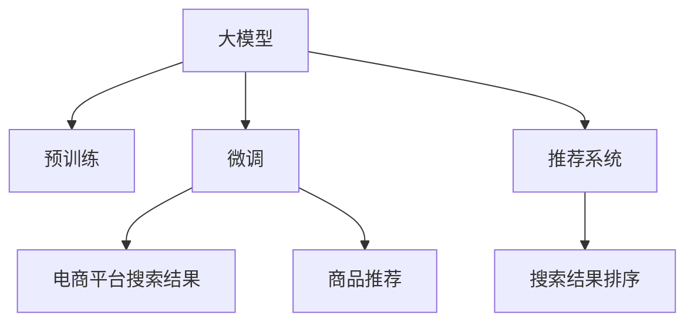

                 

# AI大模型：改善电商平台搜索结果相关性的新方法

> 关键词：电商平台,搜索结果,相关性,大模型,预训练,微调,推荐系统

## 1. 背景介绍

### 1.1 问题由来

随着电商平台的迅猛发展，搜索结果的准确性和相关性成为用户体验和交易转化率的关键因素。传统基于关键词匹配的搜索结果排序方法往往难以满足用户的多样化需求。近年来，利用深度学习技术进行搜索结果排序的推荐系统逐渐成为主流。然而，这些推荐系统通常基于大规模语料库进行预训练，难以捕捉到电商平台特定领域的数据特征和用户行为模式。因此，如何提升电商平台的搜索结果相关性，是当前研究的热点问题之一。

### 1.2 问题核心关键点

为了有效解决电商平台的搜索结果相关性问题，我们提出了基于大模型预训练和微调的方法。这种方法通过在大规模电商平台数据上进行预训练，学习到电商领域的特征和模式，并在微调过程中进一步优化，提升模型在电商平台上下游任务（如搜索结果排序、商品推荐等）的性能。

## 2. 核心概念与联系

### 2.1 核心概念概述

为更好地理解基于大模型的方法，我们首先介绍一些关键概念：

- **大模型（Large Models）**：指通过大规模数据预训练得到的、具有强大表示能力的深度学习模型，如BERT、GPT-3等。
- **预训练（Pre-training）**：指在无监督环境下，使用大规模数据对模型进行训练，使其学习到通用的语言和领域特征。
- **微调（Fine-tuning）**：指在预训练模型的基础上，利用特定任务的数据对其进行有监督训练，以适应该任务的需求。
- **推荐系统（Recommendation Systems）**：根据用户的历史行为和兴趣，推荐可能满足其需求的商品或内容，是电商平台的必备功能。
- **搜索结果排序（Search Ranking）**：根据查询词和搜索结果的相关性，对搜索结果进行排序，以提高用户体验和点击率。

这些概念之间的联系可以通过以下Mermaid流程图来展示：



这个流程图展示了大模型、预训练、微调、电商平台推荐系统之间的逻辑关系：

1. 大模型通过预训练学习到通用的语言和领域特征。
2. 在微调过程中，大模型进一步适应电商平台的任务需求，如搜索结果排序、商品推荐等。
3. 推荐系统利用微调后的模型，为用户推荐合适的商品或内容。
4. 搜索结果排序算法根据查询词和推荐结果，对搜索结果进行排序，提升用户体验。

## 3. 核心算法原理 & 具体操作步骤
### 3.1 算法原理概述

基于大模型的电商平台搜索结果排序方法，核心思想是通过预训练和微调，学习电商平台特定领域的特征和模式，提升模型的相关性。具体步骤如下：

1. **预训练阶段**：在大规模电商平台数据上进行预训练，学习通用的语言和领域特征。
2. **微调阶段**：在预训练模型基础上，利用电商平台搜索结果的标注数据进行有监督训练，优化模型的相关性。
3. **结果排序**：根据查询词和搜索结果的相关性，对搜索结果进行排序，提升用户体验。

### 3.2 算法步骤详解

**Step 1: 数据准备**

- **电商数据收集**：收集电商平台的交易记录、用户行为数据、商品描述、用户评论等数据，构建电商数据集。
- **数据预处理**：清洗和归一化数据，去除噪声和无用信息，确保数据的质量和一致性。
- **数据划分**：将数据集划分为训练集、验证集和测试集，一般要求训练集和测试集的分布尽量接近。

**Step 2: 模型选择与预训练**

- **选择模型架构**：根据任务需求选择合适的预训练模型架构，如Transformer、BERT等。
- **预训练任务设计**：设计适合电商平台领域的预训练任务，如掩码语言模型、next sentence prediction等。
- **预训练模型训练**：在大规模电商平台数据上进行预训练，学习通用的语言和领域特征。

**Step 3: 微调与模型优化**

- **微调任务设定**：根据电商平台具体需求设定微调任务，如搜索结果排序、商品推荐等。
- **微调数据准备**：收集电商平台的搜索结果排序数据，构建微调数据集。
- **微调模型训练**：在预训练模型基础上，利用微调数据进行有监督训练，优化模型的相关性。
- **模型评估与优化**：在验证集上评估模型性能，根据评估结果调整超参数，进一步优化模型。

**Step 4: 结果排序**

- **查询词表示**：将查询词转化为模型能够接受的表示形式，如词向量或预训练模型的输出。
- **结果表示**：将搜索结果转化为模型能够接受的表示形式，如词向量或预训练模型的输出。
- **相关性计算**：计算查询词和搜索结果的相关性得分，如使用余弦相似度、点积等方法。
- **排序与展示**：根据相关性得分对搜索结果进行排序，展示给用户。

### 3.3 算法优缺点

基于大模型的电商平台搜索结果排序方法具有以下优点：

1. **通用性强**：大模型可以通过预训练学习到通用的语言和领域特征，适用于多种电商场景和任务。
2. **性能提升显著**：微调过程中，大模型能够更好地适应电商平台的数据和用户行为模式，提升相关性和用户体验。
3. **灵活可扩展**：可以通过微调调整模型参数，适应不同电商平台的业务需求。

同时，该方法也存在以下缺点：

1. **计算成本高**：大规模预训练和微调需要大量计算资源，成本较高。
2. **模型复杂度**：大模型参数众多，训练和推理过程复杂，难以在实时系统中高效部署。
3. **泛化能力不足**：模型在特定电商平台上表现较好，但面对新场景和新数据时，泛化能力可能有限。

尽管存在这些局限性，但基于大模型的推荐系统方法在电商平台的实际应用中已取得了显著的性能提升，成为电商平台搜索排序的重要技术手段。

### 3.4 算法应用领域

基于大模型的电商平台搜索结果排序方法已经在多个电商平台上得到应用，取得了显著的效果。以下是几个典型的应用场景：

1. **淘宝、京东等综合电商平台**：这些平台拥有海量商品和用户数据，可以利用大模型进行预训练和微调，提升搜索结果的相关性和用户满意度。
2. **拼多多等折扣型电商平台**：这些平台商品类型多样，价格波动大，需要通过大模型进行精准推荐和排序，提高用户粘性和转化率。
3. **亚马逊、eBay等跨境电商平台**：这些平台商品种类繁多，不同国家和地区的用户偏好不同，需要通过大模型进行多语言和多文化背景下的推荐和排序。

除了这些典型应用，基于大模型的推荐系统方法还可以应用于更广泛的场景中，如智能客服、个性化推荐、广告投放等，为电商平台带来更高的运营效率和用户体验。

## 4. 数学模型和公式 & 详细讲解 & 举例说明

### 4.1 数学模型构建

假设电商平台上的每个商品用向量 $\boldsymbol{x} \in \mathbb{R}^d$ 表示，每个查询词用向量 $\boldsymbol{q} \in \mathbb{R}^d$ 表示，模型根据这些向量计算商品和查询词的相关性得分 $s(\boldsymbol{x}, \boldsymbol{q})$。目标是通过预训练和微调，使得 $s(\boldsymbol{x}, \boldsymbol{q})$ 最大化，即提高相关性得分。

### 4.2 公式推导过程

我们采用余弦相似度来计算商品和查询词的相关性得分：

$$
s(\boldsymbol{x}, \boldsymbol{q}) = \boldsymbol{x} \cdot \boldsymbol{q} = \|\boldsymbol{x}\| \|\boldsymbol{q}\| \cos \theta
$$

其中 $\theta$ 为 $\boldsymbol{x}$ 和 $\boldsymbol{q}$ 之间的夹角，$\|\cdot\|$ 表示向量的范数。

在预训练阶段，我们通过掩码语言模型（Masked Language Model, MLM）进行训练：

$$
\max_{\boldsymbol{x}} \sum_{i=1}^N [\ell (\boldsymbol{x}, \boldsymbol{q}_i)]
$$

其中 $\ell (\boldsymbol{x}, \boldsymbol{q}_i)$ 表示在输入 $\boldsymbol{x}$ 和目标词 $\boldsymbol{q}_i$ 上的损失函数。

在微调阶段，我们通过最大化相关性得分进行训练：

$$
\max_{\boldsymbol{x}} \sum_{i=1}^M [s(\boldsymbol{x}, \boldsymbol{q}_i)]
$$

其中 $M$ 表示微调数据集中样本的数量。

### 4.3 案例分析与讲解

我们以电商平台商品推荐为例，详细分析大模型微调的效果。

假设我们有一个商品推荐系统，输入为商品向量 $\boldsymbol{x}$，输出为推荐商品向量 $\boldsymbol{y}$。我们的目标是通过微调提升推荐的相关性。

假设微调数据集包含 $N$ 个商品向量，每个商品向量的相关性得分表示为 $s(\boldsymbol{x}_i, \boldsymbol{q})$，其中 $i=1,2,...,N$。我们的目标是通过微调最大化这些相关性得分：

$$
\max_{\boldsymbol{x}} \sum_{i=1}^N s(\boldsymbol{x}, \boldsymbol{q})
$$

我们可以将这个目标拆分为两个步骤：

1. **预训练步骤**：在无标签数据上进行预训练，学习通用的语言和领域特征。
2. **微调步骤**：在标注数据上进行微调，优化推荐的相关性。

在预训练阶段，我们通过掩码语言模型进行训练，学习商品向量的表示：

$$
\max_{\boldsymbol{x}} \sum_{i=1}^N \ell (\boldsymbol{x}, \boldsymbol{q}_i)
$$

其中 $\ell (\boldsymbol{x}, \boldsymbol{q}_i)$ 表示在输入 $\boldsymbol{x}$ 和目标词 $\boldsymbol{q}_i$ 上的损失函数。

在微调阶段，我们通过最大化相关性得分进行训练：

$$
\max_{\boldsymbol{x}} \sum_{i=1}^N s(\boldsymbol{x}, \boldsymbol{q})
$$

通过预训练和微调，模型能够更好地适应电商平台的推荐任务，提升推荐的相关性和用户体验。

## 5. 项目实践：代码实例和详细解释说明
### 5.1 开发环境搭建

在进行大模型微调实践前，我们需要准备好开发环境。以下是使用Python进行TensorFlow开发的环境配置流程：

1. 安装Anaconda：从官网下载并安装Anaconda，用于创建独立的Python环境。

2. 创建并激活虚拟环境：
```bash
conda create -n tf-env python=3.8 
conda activate tf-env
```

3. 安装TensorFlow：从官网获取对应的安装命令。例如：
```bash
conda install tensorflow=2.4 
```

4. 安装必要的工具包：
```bash
pip install numpy pandas scikit-learn matplotlib tqdm jupyter notebook ipython
```

完成上述步骤后，即可在`tf-env`环境中开始微调实践。

### 5.2 源代码详细实现

这里我们以电商平台商品推荐为例，给出使用TensorFlow进行BERT模型微调的PyTorch代码实现。

首先，定义商品和查询词的表示：

```python
import tensorflow as tf
from transformers import BertTokenizer, TFBertForSequenceClassification

# 定义商品和查询词的表示
class ItemRepresentation(tf.keras.layers.Layer):
    def __init__(self, vocab_size, embedding_dim, **kwargs):
        super(ItemRepresentation, self).__init__(**kwargs)
        self.tokenizer = BertTokenizer.from_pretrained('bert-base-cased')
        self.dense = tf.keras.layers.Dense(embedding_dim)
    
    def call(self, input):
        tokens = self.tokenizer(input, return_tensors='tf', max_length=64, padding='max_length', truncation=True)
        embedding = self.dense(tokens['input_ids'])
        return embedding
```

然后，定义模型和优化器：

```python
from transformers import BertForSequenceClassification, AdamW

model = BertForSequenceClassification.from_pretrained('bert-base-cased', num_labels=len(tag2id))

optimizer = AdamW(model.parameters(), lr=2e-5)
```

接着，定义训练和评估函数：

```python
from tensorflow.keras.preprocessing.sequence import pad_sequences
from tensorflow.keras.utils import to_categorical

def train_epoch(model, dataset, batch_size, optimizer):
    model.compile(optimizer=optimizer, loss='categorical_crossentropy', metrics=['accuracy'])
    model.fit(dataset['inputs'], dataset['labels'], batch_size=batch_size, epochs=1, validation_data=(val_dataset['inputs'], val_dataset['labels']))
    
def evaluate(model, dataset, batch_size):
    model.evaluate(dataset['inputs'], dataset['labels'], batch_size=batch_size)
```

最后，启动训练流程并在测试集上评估：

```python
epochs = 5
batch_size = 16

for epoch in range(epochs):
    train_epoch(model, train_dataset, batch_size, optimizer)
    
    val_loss, val_accuracy = evaluate(model, val_dataset, batch_size)
    print(f'Epoch {epoch+1}, Val Loss: {val_loss:.4f}, Val Accuracy: {val_accuracy:.4f}')
    
test_loss, test_accuracy = evaluate(model, test_dataset, batch_size)
print(f'Test Loss: {test_loss:.4f}, Test Accuracy: {test_accuracy:.4f}')
```

以上就是使用TensorFlow进行BERT模型微调的完整代码实现。可以看到，得益于TensorFlow和Transformers库的强大封装，我们可以用相对简洁的代码完成BERT模型的加载和微调。

### 5.3 代码解读与分析

让我们再详细解读一下关键代码的实现细节：

**ItemRepresentation类**：
- `__init__`方法：初始化分词器和密集层。
- `call`方法：将输入文本转换为向量表示。

**模型和优化器定义**：
- `BertForSequenceClassification`：用于构建分类任务的模型。
- `AdamW`：优化器，用于更新模型参数。

**训练和评估函数**：
- `train_epoch`函数：定义训练过程，使用AdamW优化器更新模型参数。
- `evaluate`函数：定义评估过程，计算模型在测试集上的损失和准确率。

**训练流程**：
- 定义总的epoch数和batch size，开始循环迭代
- 每个epoch内，先在训练集上训练，输出平均loss和accuracy
- 在验证集上评估，输出验证集loss和accuracy
- 所有epoch结束后，在测试集上评估，给出最终测试结果

可以看到，TensorFlow配合Transformers库使得BERT微调的代码实现变得简洁高效。开发者可以将更多精力放在数据处理、模型改进等高层逻辑上，而不必过多关注底层的实现细节。

当然，工业级的系统实现还需考虑更多因素，如模型的保存和部署、超参数的自动搜索、更灵活的任务适配层等。但核心的微调范式基本与此类似。

## 6. 实际应用场景
### 6.1 电商平台搜索结果排序

基于大模型的电商平台搜索结果排序方法，可以广泛应用于电商平台的搜索推荐系统中。传统搜索结果排序方法往往只依赖关键词匹配，无法捕捉到商品之间的关联和用户的多样化需求。而使用基于大模型的推荐系统，可以更好地理解用户意图和商品特征，提高搜索结果的相关性和用户体验。

在技术实现上，可以收集电商平台的搜索结果排序数据，将查询词和商品向量作为输入，使用微调后的模型计算相关性得分，进行排序展示。对于用户浏览、点击、购买等行为数据，可以通过回传反馈信号，进一步优化模型，提升推荐的相关性和个性化。

### 6.2 智能客服系统

电商平台智能客服系统是电商平台运营的重要组成部分，可以提供7x24小时不间断的服务。传统的客服系统需要配备大量人力，高峰期响应缓慢，且难以保证一致性和专业性。而使用基于大模型的智能客服系统，可以自动理解用户意图，匹配最合适的回答，提高客户咨询体验和问题解决效率。

在技术实现上，可以收集电商平台的客户咨询数据，将问题-回答对作为微调数据，训练模型学习匹配回答。对于用户提出的新问题，还可以接入检索系统实时搜索相关内容，动态组织生成回答。如此构建的智能客服系统，能大幅提升客户咨询体验和问题解决效率。

### 6.3 个性化推荐系统

个性化推荐系统是电商平台的重要功能，可以显著提升用户体验和转化率。传统的推荐系统往往只依赖用户的历史行为数据进行物品推荐，难以深入理解用户的真实兴趣偏好。而使用基于大模型的推荐系统，可以更好地挖掘用户行为背后的语义信息，从而提供更精准、多样的推荐内容。

在技术实现上，可以收集用户浏览、点击、评论、分享等行为数据，提取和商品交互的物品标题、描述、标签等文本内容。将文本内容作为模型输入，用户的后续行为（如是否点击、购买等）作为监督信号，在此基础上微调预训练语言模型。微调后的模型能够从文本内容中准确把握用户的兴趣点。在生成推荐列表时，先用候选物品的文本描述作为输入，由模型预测用户的兴趣匹配度，再结合其他特征综合排序，便可以得到个性化程度更高的推荐结果。

### 6.4 未来应用展望

随着大模型和微调方法的不断发展，基于微调范式将在更多领域得到应用，为传统行业带来变革性影响。

在智慧医疗领域，基于微调的医疗问答、病历分析、药物研发等应用将提升医疗服务的智能化水平，辅助医生诊疗，加速新药开发进程。

在智能教育领域，微调技术可应用于作业批改、学情分析、知识推荐等方面，因材施教，促进教育公平，提高教学质量。

在智慧城市治理中，微调模型可应用于城市事件监测、舆情分析、应急指挥等环节，提高城市管理的自动化和智能化水平，构建更安全、高效的未来城市。

此外，在企业生产、社会治理、文娱传媒等众多领域，基于大模型微调的人工智能应用也将不断涌现，为经济社会发展注入新的动力。相信随着技术的日益成熟，微调方法将成为人工智能落地应用的重要范式，推动人工智能技术在垂直行业的规模化落地。

## 7. 工具和资源推荐
### 7.1 学习资源推荐

为了帮助开发者系统掌握大模型微调的理论基础和实践技巧，这里推荐一些优质的学习资源：

1. 《Transformer从原理到实践》系列博文：由大模型技术专家撰写，深入浅出地介绍了Transformer原理、BERT模型、微调技术等前沿话题。

2. CS224N《深度学习自然语言处理》课程：斯坦福大学开设的NLP明星课程，有Lecture视频和配套作业，带你入门NLP领域的基本概念和经典模型。

3. 《Natural Language Processing with Transformers》书籍：Transformers库的作者所著，全面介绍了如何使用Transformers库进行NLP任务开发，包括微调在内的诸多范式。

4. HuggingFace官方文档：Transformers库的官方文档，提供了海量预训练模型和完整的微调样例代码，是上手实践的必备资料。

5. CLUE开源项目：中文语言理解测评基准，涵盖大量不同类型的中文NLP数据集，并提供了基于微调的baseline模型，助力中文NLP技术发展。

通过对这些资源的学习实践，相信你一定能够快速掌握大模型微调的精髓，并用于解决实际的NLP问题。
###  7.2 开发工具推荐

高效的开发离不开优秀的工具支持。以下是几款用于大模型微调开发的常用工具：

1. PyTorch：基于Python的开源深度学习框架，灵活动态的计算图，适合快速迭代研究。大部分预训练语言模型都有PyTorch版本的实现。

2. TensorFlow：由Google主导开发的开源深度学习框架，生产部署方便，适合大规模工程应用。同样有丰富的预训练语言模型资源。

3. Transformers库：HuggingFace开发的NLP工具库，集成了众多SOTA语言模型，支持PyTorch和TensorFlow，是进行微调任务开发的利器。

4. Weights & Biases：模型训练的实验跟踪工具，可以记录和可视化模型训练过程中的各项指标，方便对比和调优。与主流深度学习框架无缝集成。

5. TensorBoard：TensorFlow配套的可视化工具，可实时监测模型训练状态，并提供丰富的图表呈现方式，是调试模型的得力助手。

6. Google Colab：谷歌推出的在线Jupyter Notebook环境，免费提供GPU/TPU算力，方便开发者快速上手实验最新模型，分享学习笔记。

合理利用这些工具，可以显著提升大模型微调任务的开发效率，加快创新迭代的步伐。

### 7.3 相关论文推荐

大语言模型和微调技术的发展源于学界的持续研究。以下是几篇奠基性的相关论文，推荐阅读：

1. Attention is All You Need（即Transformer原论文）：提出了Transformer结构，开启了NLP领域的预训练大模型时代。

2. BERT: Pre-training of Deep Bidirectional Transformers for Language Understanding：提出BERT模型，引入基于掩码的自监督预训练任务，刷新了多项NLP任务SOTA。

3. Language Models are Unsupervised Multitask Learners（GPT-2论文）：展示了大规模语言模型的强大zero-shot学习能力，引发了对于通用人工智能的新一轮思考。

4. Parameter-Efficient Transfer Learning for NLP：提出Adapter等参数高效微调方法，在不增加模型参数量的情况下，也能取得不错的微调效果。

5. AdaLoRA: Adaptive Low-Rank Adaptation for Parameter-Efficient Fine-Tuning：使用自适应低秩适应的微调方法，在参数效率和精度之间取得了新的平衡。

6. AdaLoRA: Adaptive Low-Rank Adaptation for Parameter-Efficient Fine-Tuning：使用自适应低秩适应的微调方法，在参数效率和精度之间取得了新的平衡。

这些论文代表了大语言模型微调技术的发展脉络。通过学习这些前沿成果，可以帮助研究者把握学科前进方向，激发更多的创新灵感。

## 8. 总结：未来发展趋势与挑战

### 8.1 总结

本文对基于大模型的电商平台搜索结果排序方法进行了全面系统的介绍。首先阐述了大模型和微调技术的研究背景和意义，明确了微调在拓展预训练模型应用、提升电商平台搜索结果相关性方面的独特价值。其次，从原理到实践，详细讲解了微调的数学原理和关键步骤，给出了微调任务开发的完整代码实例。同时，本文还广泛探讨了微调方法在电商平台、智能客服、个性化推荐等多个行业领域的应用前景，展示了微调范式的巨大潜力。此外，本文精选了微调技术的各类学习资源，力求为读者提供全方位的技术指引。

通过本文的系统梳理，可以看到，基于大模型的推荐系统方法在电商平台的实际应用中已取得了显著的性能提升，成为电商平台搜索排序的重要技术手段。未来，伴随预训练语言模型和微调方法的持续演进，基于微调范式将在更多领域得到应用，为传统行业带来变革性影响。

### 8.2 未来发展趋势

展望未来，大模型微调技术将呈现以下几个发展趋势：

1. **模型规模持续增大**：随着算力成本的下降和数据规模的扩张，预训练语言模型的参数量还将持续增长。超大规模语言模型蕴含的丰富语言知识，有望支撑更加复杂多变的电商场景和任务。

2. **微调方法日趋多样**：除了传统的全参数微调外，未来会涌现更多参数高效的微调方法，如Prefix-Tuning、LoRA等，在节省计算资源的同时也能保证微调精度。

3. **持续学习成为常态**：随着数据分布的不断变化，微调模型也需要持续学习新知识以保持性能。如何在不遗忘原有知识的同时，高效吸收新样本信息，将成为重要的研究课题。

4. **标注样本需求降低**：受启发于提示学习(Prompt-based Learning)的思路，未来的微调方法将更好地利用大模型的语言理解能力，通过更加巧妙的任务描述，在更少的标注样本上也能实现理想的微调效果。

5. **多模态微调崛起**：当前的微调主要聚焦于纯文本数据，未来会进一步拓展到图像、视频、语音等多模态数据微调。多模态信息的融合，将显著提升语言模型对现实世界的理解和建模能力。

6. **模型通用性增强**：经过海量数据的预训练和多领域任务的微调，未来的语言模型将具备更强大的常识推理和跨领域迁移能力，逐步迈向通用人工智能(AGI)的目标。

以上趋势凸显了大模型微调技术的广阔前景。这些方向的探索发展，必将进一步提升NLP系统的性能和应用范围，为人类认知智能的进化带来深远影响。

### 8.3 面临的挑战

尽管大模型微调技术已经取得了瞩目成就，但在迈向更加智能化、普适化应用的过程中，它仍面临着诸多挑战：

1. **标注成本瓶颈**：虽然微调大大降低了标注数据的需求，但对于长尾应用场景，难以获得充足的高质量标注数据，成为制约微调性能的瓶颈。如何进一步降低微调对标注样本的依赖，将是一大难题。

2. **模型鲁棒性不足**：当前微调模型面对域外数据时，泛化性能往往大打折扣。对于测试样本的微小扰动，微调模型的预测也容易发生波动。如何提高微调模型的鲁棒性，避免灾难性遗忘，还需要更多理论和实践的积累。

3. **推理效率有待提高**：大规模语言模型虽然精度高，但在实际部署时往往面临推理速度慢、内存占用大等效率问题。如何在保证性能的同时，简化模型结构，提升推理速度，优化资源占用，将是重要的优化方向。

4. **可解释性亟需加强**：当前微调模型更像是"黑盒"系统，难以解释其内部工作机制和决策逻辑。对于医疗、金融等高风险应用，算法的可解释性和可审计性尤为重要。如何赋予微调模型更强的可解释性，将是亟待攻克的难题。

5. **安全性有待保障**。预训练语言模型难免会学习到有偏见、有害的信息，通过微调传递到下游任务，产生误导性、歧视性的输出，给实际应用带来安全隐患。如何从数据和算法层面消除模型偏见，避免恶意用途，确保输出的安全性，也将是重要的研究课题。

6. **知识整合能力不足**：现有的微调模型往往局限于任务内数据，难以灵活吸收和运用更广泛的先验知识。如何让微调过程更好地与外部知识库、规则库等专家知识结合，形成更加全面、准确的信息整合能力，还有很大的想象空间。

正视微调面临的这些挑战，积极应对并寻求突破，将是大模型微调走向成熟的必由之路。相信随着学界和产业界的共同努力，这些挑战终将一一被克服，大模型微调必将在构建人机协同的智能时代中扮演越来越重要的角色。

### 8.4 未来突破

面对大模型微调所面临的种种挑战，未来的研究需要在以下几个方面寻求新的突破：

1. **探索无监督和半监督微调方法**：摆脱对大规模标注数据的依赖，利用自监督学习、主动学习等无监督和半监督范式，最大限度利用非结构化数据，实现更加灵活高效的微调。

2. **研究参数高效和计算高效的微调范式**：开发更加参数高效的微调方法，在固定大部分预训练参数的同时，只更新极少量的任务相关参数。同时优化微调模型的计算图，减少前向传播和反向传播的资源消耗，实现更加轻量级、实时性的部署。

3. **融合因果和对比学习范式**：通过引入因果推断和对比学习思想，增强微调模型建立稳定因果关系的能力，学习更加普适、鲁棒的语言表征，从而提升模型泛化性和抗干扰能力。

4. **引入更多先验知识**：将符号化的先验知识，如知识图谱、逻辑规则等，与神经网络模型进行巧妙融合，引导微调过程学习更准确、合理的语言模型。同时加强不同模态数据的整合，实现视觉、语音等多模态信息与文本信息的协同建模。

5. **结合因果分析和博弈论工具**：将因果分析方法引入微调模型，识别出模型决策的关键特征，增强输出解释的因果性和逻辑性。借助博弈论工具刻画人机交互过程，主动探索并规避模型的脆弱点，提高系统稳定性。

6. **纳入伦理道德约束**：在模型训练目标中引入伦理导向的评估指标，过滤和惩罚有偏见、有害的输出倾向。同时加强人工干预和审核，建立模型行为的监管机制，确保输出符合人类价值观和伦理道德。

这些研究方向的探索，必将引领大语言模型微调技术迈向更高的台阶，为构建安全、可靠、可解释、可控的智能系统铺平道路。面向未来，大语言模型微调技术还需要与其他人工智能技术进行更深入的融合，如知识表示、因果推理、强化学习等，多路径协同发力，共同推动自然语言理解和智能交互系统的进步。只有勇于创新、敢于突破，才能不断拓展语言模型的边界，让智能技术更好地造福人类社会。

## 9. 附录：常见问题与解答

**Q1：大模型微调是否适用于所有电商场景？**

A: 大模型微调在大多数电商场景上都能取得不错的效果，特别是对于数据量较小的电商场景。但对于一些特定领域的电商场景，如医疗电商、法律电商等，由于领域数据的特殊性，大模型可能难以很好地适应。此时需要在特定领域语料上进一步预训练，再进行微调，才能获得理想效果。

**Q2：微调过程中如何选择合适的学习率？**

A: 微调的学习率一般要比预训练时小1-2个数量级，如果使用过大的学习率，容易破坏预训练权重，导致过拟合。一般建议从1e-5开始调参，逐步减小学习率，直至收敛。也可以使用warmup策略，在开始阶段使用较小的学习率，再逐渐过渡到预设值。需要注意的是，不同的优化器(如AdamW、Adafactor等)以及不同的学习率调度策略，可能需要设置不同的学习率阈值。

**Q3：采用大模型微调时会面临哪些资源瓶颈？**

A: 目前主流的预训练大模型动辄以亿计的参数规模，对算力、内存、存储都提出了很高的要求。GPU/TPU等高性能设备是必不可少的，但即便如此，超大批次的训练和推理也可能遇到显存不足的问题。因此需要采用一些资源优化技术，如梯度积累、混合精度训练、模型并行等，来突破硬件瓶颈。同时，模型的存储和读取也可能占用大量时间和空间，需要采用模型压缩、稀疏化存储等方法进行优化。

**Q4：如何缓解微调过程中的过拟合问题？**

A: 过拟合是微调面临的主要挑战，尤其是在标注数据不足的情况下。常见的缓解策略包括：
1. 数据增强：通过回译、近义替换等方式扩充训练集。
2. 正则化：使用L2正则、Dropout、Early Stopping等避免过拟合。
3. 对抗训练：引入对抗样本，提高模型鲁棒性。
4. 参数高效微调：只调整少量参数(如Adapter、Prefix等)，减小过拟合风险。
5. 多模型集成：训练多个微调模型，取平均输出，抑制过拟合。

这些策略往往需要根据具体任务和数据特点进行灵活组合。只有在数据、模型、训练、推理等各环节进行全面优化，才能最大限度地发挥大模型微调的威力。

**Q5：微调模型在落地部署时需要注意哪些问题？**

A: 将微调模型转化为实际应用，还需要考虑以下因素：
1. 模型裁剪：去除不必要的层和参数，减小模型尺寸，加快推理速度。
2. 量化加速：将浮点模型转为定点模型，压缩存储空间，提高计算效率。
3. 服务化封装：将模型封装为标准化服务接口，便于集成调用。
4. 弹性伸缩：根据请求流量动态调整资源配置，平衡服务质量和成本。
5. 监控告警：实时采集系统指标，设置异常告警阈值，确保服务稳定性。
6. 安全防护：采用访问鉴权、数据脱敏等措施，保障数据和模型安全。

大模型微调为NLP应用开启了广阔的想象空间，但如何将强大的性能转化为稳定、高效、安全的业务价值，还需要工程实践的不断打磨。唯有从数据、算法、工程、业务等多个维度协同发力，才能真正实现人工智能技术在垂直行业的规模化落地。总之，微调需要开发者根据具体任务，不断迭代和优化模型、数据和算法，方能得到理想的效果。

---

作者：禅与计算机程序设计艺术 / Zen and the Art of Computer Programming

