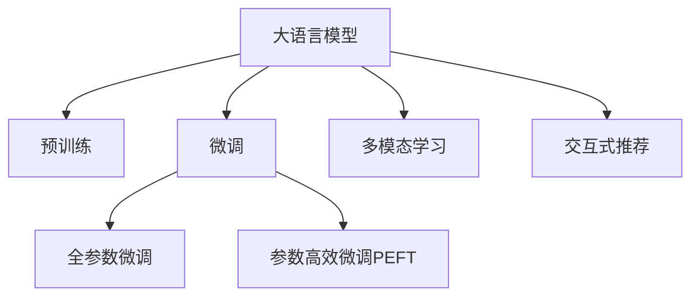

                 

# AI大模型：电商个性化营销的新引擎

## 1. 背景介绍

### 1.1 问题由来
随着互联网的快速发展，电商行业呈现出爆发式增长态势。在如此激烈的市场竞争中，个性化营销成为了商家竞争的关键。传统的粗放式营销策略无法满足日益多样化的用户需求，个性化推荐系统成为了电商企业的必争之地。

传统推荐系统主要基于用户行为数据（如浏览记录、购买记录、评分反馈等）进行推荐。然而，这些数据通常高度依赖于用户历史行为，难以覆盖新的用户和潜在的兴趣点。此外，以固定参数模型为代表的推荐系统也难以动态适应用户需求的变化。

近年来，随着深度学习和大规模预训练语言模型（如BERT、GPT等）的兴起，电商个性化营销进入了一个新阶段。这些模型不仅能够从用户行为数据中提取高层次的语义特征，还能通过语言理解能力捕捉复杂的用户需求。基于大模型的推荐系统能够更灵活、更准确地进行个性化推荐，助力商家提高销售额和用户满意度。

### 1.2 问题核心关键点
大模型在电商个性化营销中的应用，主要通过以下三个关键点实现：

1. **多模态数据融合**：电商领域的数据通常包括文本（如商品描述、评论、搜索查询等）、图片（如商品图片、广告图片等）和用户行为数据（如浏览记录、购买记录等）。大模型能够对这些多模态数据进行高效融合，提取丰富的用户特征。

2. **自适应推荐模型**：传统的推荐模型往往固定，难以适应用户需求的变化。大模型通过微调等手段，能够快速更新推荐策略，应对用户的个性化需求。

3. **自然语言交互**：电商用户在购物时，往往通过搜索、浏览、评论等方式与系统进行自然语言交互。大模型通过语言理解能力，能够更好地捕捉用户需求，提升推荐的准确性。

## 2. 核心概念与联系

### 2.1 核心概念概述

为更好地理解大模型在电商个性化营销中的应用，本节将介绍几个关键概念：

- **大语言模型(Large Language Model, LLM)**：以自回归(如GPT)或自编码(如BERT)模型为代表的大规模预训练语言模型。通过在大规模无标签文本语料上进行预训练，学习通用的语言表示，具备强大的语言理解和生成能力。

- **预训练(Pre-training)**：指在大规模无标签文本语料上，通过自监督学习任务训练通用语言模型的过程。常见的预训练任务包括言语建模、掩码语言模型等。

- **微调(Fine-tuning)**：指在预训练模型的基础上，使用下游任务的少量标注数据，通过有监督学习优化模型在特定任务上的性能。通常只需要调整顶层分类器或解码器，并以较小的学习率更新全部或部分的模型参数。

- **迁移学习(Transfer Learning)**：指将一个领域学习到的知识，迁移应用到另一个不同但相关的领域的学习范式。大模型的预训练-微调过程即是一种典型的迁移学习方式。

- **多模态学习(Multimodal Learning)**：指通过融合不同模态的数据（如文本、图像、声音等），构建多模态学习模型，从而提高模型在多模态场景下的表现。

- **交互式推荐(Interactive Recommendation)**：指通过与用户进行自然语言交互，获取用户实时需求，从而动态生成推荐结果。

这些核心概念之间的逻辑关系可以通过以下Mermaid流程图来展示：



这个流程图展示了大语言模型的核心概念及其之间的关系：

1. 大语言模型通过预训练获得基础能力。
2. 微调是对预训练模型进行任务特定的优化，可以分为全参数微调和参数高效微调（PEFT）。
3. 多模态学习是指对多种类型的数据进行融合，以提高模型对复杂场景的理解能力。
4. 交互式推荐是指与用户进行自然语言交互，获取实时需求，进行动态推荐。

这些概念共同构成了大语言模型在电商个性化营销中的应用框架，使其能够更好地理解用户需求，提供个性化的购物体验。

## 3. 核心算法原理 & 具体操作步骤

### 3.1 算法原理概述

基于大模型的电商个性化推荐，本质上是一个有监督的细粒度迁移学习过程。其核心思想是：将大模型视作一个强大的"特征提取器"，通过在电商场景下的少样本标注数据上进行有监督学习，优化模型在个性化推荐任务上的性能。

具体而言，假设大模型为 $M_{\theta}$，其中 $\theta$ 为模型参数。电商推荐任务的数据集为 $D=\{(x_i, y_i)\}_{i=1}^N$，其中 $x_i$ 为输入（如用户搜索记录、商品描述等），$y_i$ 为输出（如推荐商品ID）。微调的目标是找到新的模型参数 $\hat{\theta}$，使得模型在电商推荐任务上的预测与真实标签尽可能接近，即：

$$
\hat{\theta}=\mathop{\arg\min}_{\theta} \mathcal{L}(M_{\theta},D)
$$

其中 $\mathcal{L}$ 为损失函数，如交叉熵损失函数。通过梯度下降等优化算法，微调过程不断更新模型参数 $\theta$，最小化损失函数 $\mathcal{L}$，使得模型输出逼近真实标签。

### 3.2 算法步骤详解

基于大模型的电商个性化推荐，一般包括以下几个关键步骤：

**Step 1: 准备数据集和模型**

- 收集电商推荐任务的标注数据集 $D$，划分为训练集、验证集和测试集。标注数据应包含用户行为数据（如浏览记录、购买记录等）和商品信息（如商品ID、商品描述等）。
- 选择合适的预训练语言模型 $M_{\theta}$，如BERT、GPT等。

**Step 2: 设计任务适配层**

- 根据电商推荐任务的特点，设计合适的任务适配层。常见的任务适配层包括分类器、回归器、生成器等。
- 为分类任务，通常使用线性分类器和交叉熵损失函数。
- 为回归任务，使用均方误差损失函数。
- 为生成任务，使用语言模型的解码器输出概率分布，并以负对数似然为损失函数。

**Step 3: 设置微调超参数**

- 选择合适的优化算法及其参数，如 AdamW、SGD 等，设置学习率、批大小、迭代轮数等。
- 设置正则化技术及强度，包括权重衰减、Dropout、Early Stopping等。
- 确定冻结预训练参数的策略，如仅微调顶层，或全部参数都参与微调。

**Step 4: 执行梯度训练**

- 将训练集数据分批次输入模型，前向传播计算损失函数。
- 反向传播计算参数梯度，根据设定的优化算法和学习率更新模型参数。
- 周期性在验证集上评估模型性能，根据性能指标决定是否触发 Early Stopping。
- 重复上述步骤直到满足预设的迭代轮数或 Early Stopping 条件。

**Step 5: 测试和部署**

- 在测试集上评估微调后模型 $M_{\hat{\theta}}$ 的性能，对比微调前后的精度提升。
- 使用微调后的模型对新样本进行推理预测，集成到实际的应用系统中。
- 持续收集新的数据，定期重新微调模型，以适应数据分布的变化。

以上是基于大模型的电商个性化推荐的一般流程。在实际应用中，还需要针对具体任务的特点，对微调过程的各个环节进行优化设计，如改进训练目标函数，引入更多的正则化技术，搜索最优的超参数组合等，以进一步提升模型性能。

### 3.3 算法优缺点

基于大模型的电商个性化推荐方法具有以下优点：

1. 简单高效。只需准备少量标注数据，即可对预训练模型进行快速适配，获得较大的性能提升。
2. 通用适用。适用于各种电商推荐任务，包括商品推荐、活动推荐、个性化搜索等，设计简单的任务适配层即可实现微调。
3. 参数高效。利用参数高效微调技术，在固定大部分预训练权重不变的情况下，仍可取得不错的提升。
4. 效果显著。在电商推荐任务上，基于微调的方法已经刷新了最先进的性能指标。

同时，该方法也存在一定的局限性：

1. 依赖标注数据。推荐系统的性能很大程度上取决于标注数据的质量和数量，获取高质量标注数据的成本较高。
2. 推荐范围受限。当推荐数据与用户历史行为分布差异较大时，推荐效果可能不理想。
3. 计算成本高。大模型的参数量和计算量巨大，在电商推荐等大规模场景下，计算成本较高。
4. 可解释性不足。推荐系统的决策过程通常缺乏可解释性，难以对其推理逻辑进行分析和调试。

尽管存在这些局限性，但就目前而言，基于大模型的推荐方法仍然是电商领域的主流范式。未来相关研究的重点在于如何进一步降低推荐对标注数据的依赖，提高模型的少样本学习和跨领域迁移能力，同时兼顾可解释性和伦理安全性等因素。

### 3.4 算法应用领域

基于大模型的电商个性化推荐方法，已经在电商推荐系统、广告投放系统、个性化搜索等多个领域得到了广泛的应用，为电商企业带来了显著的收益提升：

- **电商推荐系统**：通过对用户行为数据和商品信息的融合，进行个性化推荐，提升用户购买转化率。
- **广告投放系统**：根据用户兴趣和行为，生成定向广告，提升广告点击率和转化率。
- **个性化搜索**：对用户查询进行自然语言理解，生成相关搜索结果，提升搜索体验。

除了上述这些经典应用外，大模型推荐技术还被创新性地应用于客户流失预测、库存管理、价格优化等场景，为电商企业带来了新的业务机会。随着预训练模型和推荐方法的不断进步，相信大模型推荐系统将会在更多电商场景中发挥重要作用。

## 4. 数学模型和公式 & 详细讲解  
### 4.1 数学模型构建

本节将使用数学语言对基于大模型的电商个性化推荐过程进行更加严格的刻画。

记大模型为 $M_{\theta}$，电商推荐任务的数据集为 $D=\{(x_i, y_i)\}_{i=1}^N$。假设任务适配层为 $L$，则模型的预测输出为 $L(M_{\theta}(x_i))$。模型在数据集 $D$ 上的经验风险为：

$$
\mathcal{L}(\theta) = \frac{1}{N}\sum_{i=1}^N \ell(L(M_{\theta}(x_i)),y_i)
$$

其中 $\ell$ 为损失函数，如交叉熵损失函数。

微调的优化目标是最小化经验风险，即找到最优参数：

$$
\theta^* = \mathop{\arg\min}_{\theta} \mathcal{L}(\theta)
$$

在实践中，我们通常使用基于梯度的优化算法（如SGD、Adam等）来近似求解上述最优化问题。设 $\eta$ 为学习率，$\lambda$ 为正则化系数，则参数的更新公式为：

$$
\theta \leftarrow \theta - \eta \nabla_{\theta}\mathcal{L}(\theta) - \eta\lambda\theta
$$

其中 $\nabla_{\theta}\mathcal{L}(\theta)$ 为损失函数对参数 $\theta$ 的梯度，可通过反向传播算法高效计算。

### 4.2 公式推导过程

以下我们以二分类推荐任务为例，推导交叉熵损失函数及其梯度的计算公式。

假设模型 $M_{\theta}$ 在输入 $x$ 上的输出为 $\hat{y}=M_{\theta}(x) \in [0,1]$，表示推荐结果为正的概率。真实标签 $y \in \{0,1\}$。则二分类交叉熵损失函数定义为：

$$
\ell(M_{\theta}(x),y) = -[y\log \hat{y} + (1-y)\log (1-\hat{y})]
$$

将其代入经验风险公式，得：

$$
\mathcal{L}(\theta) = -\frac{1}{N}\sum_{i=1}^N [y_i\log L(M_{\theta}(x_i)+(1-y_i)\log(1-L(M_{\theta}(x_i)))
$$

根据链式法则，损失函数对参数 $\theta_k$ 的梯度为：

$$
\frac{\partial \mathcal{L}(\theta)}{\partial \theta_k} = -\frac{1}{N}\sum_{i=1}^N (\frac{y_i}{L(M_{\theta}(x_i))}-\frac{1-y_i}{1-L(M_{\theta}(x_i))}) \frac{\partial L(M_{\theta}(x_i))}{\partial \theta_k}
$$

其中 $\frac{\partial L(M_{\theta}(x_i))}{\partial \theta_k}$ 可进一步递归展开，利用自动微分技术完成计算。

在得到损失函数的梯度后，即可带入参数更新公式，完成模型的迭代优化。重复上述过程直至收敛，最终得到适应电商推荐任务的最优模型参数 $\theta^*$。

## 5. 项目实践：代码实例和详细解释说明
### 5.1 开发环境搭建

在进行电商推荐系统开发前，我们需要准备好开发环境。以下是使用Python进行TensorFlow开发的环境配置流程：

1. 安装Anaconda：从官网下载并安装Anaconda，用于创建独立的Python环境。

2. 创建并激活虚拟环境：
```bash
conda create -n tf-env python=3.8 
conda activate tf-env
```

3. 安装TensorFlow：根据CUDA版本，从官网获取对应的安装命令。例如：
```bash
conda install tensorflow
```

4. 安装各类工具包：
```bash
pip install numpy pandas scikit-learn matplotlib tqdm jupyter notebook ipython
```

完成上述步骤后，即可在`tf-env`环境中开始电商推荐系统的开发。

### 5.2 源代码详细实现

下面我们以电商推荐系统为例，给出使用TensorFlow进行模型微调的PyTorch代码实现。

首先，定义推荐任务的数据处理函数：

```python
import tensorflow as tf
from tensorflow.keras import layers

class RecommendationDataset(tf.keras.layers.Layer):
    def __init__(self, data, tokenizer, max_len=128):
        super(RecommendationDataset, self).__init__()
        self.data = data
        self.tokenizer = tokenizer
        self.max_len = max_len
        
    def call(self, x):
        input_ids = self.tokenizer(x, padding='max_length', truncation=True, max_length=self.max_len)
        labels = self.data['label']
        return {'input_ids': input_ids, 
                'labels': labels}
```

然后，定义模型和优化器：

```python
from transformers import TFAutoModelForSequenceClassification

model = TFAutoModelForSequenceClassification.from_pretrained('bert-base-cased', num_labels=2)

optimizer = tf.keras.optimizers.Adam(learning_rate=2e-5)
```

接着，定义训练和评估函数：

```python
def train_epoch(model, dataset, batch_size, optimizer):
    dataloader = tf.keras.preprocessing.data.Dataset(dataset).batch(batch_size).shuffle(buffer_size=1000)
    model.train()
    epoch_loss = 0
    for batch in tqdm(dataloader, desc='Training'):
        input_ids = batch['input_ids']
        labels = batch['labels']
        model.zero_grad()
        outputs = model(input_ids, labels=labels)
        loss = outputs.loss
        epoch_loss += loss.numpy()
        loss.backward()
        optimizer.apply_gradients(zip(model.trainable_variables, model.trainable_variables_gradients))
    return epoch_loss / len(dataloader)

def evaluate(model, dataset, batch_size):
    dataloader = tf.keras.preprocessing.data.Dataset(dataset).batch(batch_size).shuffle(buffer_size=1000)
    model.eval()
    preds, labels = [], []
    with tf.GradientTape() as tape:
        for batch in tqdm(dataloader, desc='Evaluating'):
            input_ids = batch['input_ids']
            labels = batch['labels']
            model.zero_grad()
            outputs = model(input_ids, labels=labels)
            batch_preds = outputs.logits.argmax(axis=1).numpy()
            batch_labels = labels.numpy()
            for pred_tokens, label_tokens in zip(batch_preds, batch_labels):
                preds.append(pred_tokens[:len(label_tokens)])
                labels.append(label_tokens)
    return classification_report(labels, preds)
```

最后，启动训练流程并在测试集上评估：

```python
epochs = 5
batch_size = 16

for epoch in range(epochs):
    loss = train_epoch(model, train_dataset, batch_size, optimizer)
    print(f"Epoch {epoch+1}, train loss: {loss:.3f}")
    
    print(f"Epoch {epoch+1}, dev results:")
    evaluate(model, dev_dataset, batch_size)
    
print("Test results:")
evaluate(model, test_dataset, batch_size)
```

以上就是使用TensorFlow对BERT进行电商推荐任务微调的完整代码实现。可以看到，得益于TensorFlow的强大封装，我们可以用相对简洁的代码完成BERT模型的加载和微调。

### 5.3 代码解读与分析

让我们再详细解读一下关键代码的实现细节：

**RecommendationDataset类**：
- `__init__`方法：初始化数据、分词器等关键组件。
- `call`方法：对单个样本进行处理，将文本输入编码为token ids，并将标签编码为数字，进行定长padding，最终返回模型所需的输入。

**模型定义**：
- 使用`TFAutoModelForSequenceClassification`定义模型，指定预训练模型和输出维度。
- 使用`Adam`优化器，设置学习率。

**训练和评估函数**：
- 使用`Dataset`对数据集进行批次化加载，供模型训练和推理使用。
- 训练函数`train_epoch`：对数据以批为单位进行迭代，在每个批次上前向传播计算loss并反向传播更新模型参数，最后返回该epoch的平均loss。
- 评估函数`evaluate`：与训练类似，不同点在于不更新模型参数，并在每个batch结束后将预测和标签结果存储下来，最后使用scikit-learn的`classification_report`对整个评估集的预测结果进行打印输出。

**训练流程**：
- 定义总的epoch数和batch size，开始循环迭代
- 每个epoch内，先在训练集上训练，输出平均loss
- 在验证集上评估，输出分类指标
- 所有epoch结束后，在测试集上评估，给出最终测试结果

可以看到，TensorFlow配合BERT库使得电商推荐系统的代码实现变得简洁高效。开发者可以将更多精力放在数据处理、模型改进等高层逻辑上，而不必过多关注底层的实现细节。

当然，工业级的系统实现还需考虑更多因素，如模型的保存和部署、超参数的自动搜索、更灵活的任务适配层等。但核心的微调范式基本与此类似。

## 6. 实际应用场景

### 6.1 智能客服系统

基于大模型微调的对话技术，可以广泛应用于智能客服系统的构建。传统客服往往需要配备大量人力，高峰期响应缓慢，且一致性和专业性难以保证。而使用微调后的对话模型，可以7x24小时不间断服务，快速响应客户咨询，用自然流畅的语言解答各类常见问题。

在技术实现上，可以收集企业内部的历史客服对话记录，将问题和最佳答复构建成监督数据，在此基础上对预训练对话模型进行微调。微调后的对话模型能够自动理解用户意图，匹配最合适的答案模板进行回复。对于客户提出的新问题，还可以接入检索系统实时搜索相关内容，动态组织生成回答。如此构建的智能客服系统，能大幅提升客户咨询体验和问题解决效率。

### 6.2 金融舆情监测

金融机构需要实时监测市场舆论动向，以便及时应对负面信息传播，规避金融风险。传统的人工监测方式成本高、效率低，难以应对网络时代海量信息爆发的挑战。基于大语言模型微调的文本分类和情感分析技术，为金融舆情监测提供了新的解决方案。

具体而言，可以收集金融领域相关的新闻、报道、评论等文本数据，并对其进行主题标注和情感标注。在此基础上对预训练语言模型进行微调，使其能够自动判断文本属于何种主题，情感倾向是正面、中性还是负面。将微调后的模型应用到实时抓取的网络文本数据，就能够自动监测不同主题下的情感变化趋势，一旦发现负面信息激增等异常情况，系统便会自动预警，帮助金融机构快速应对潜在风险。

### 6.3 个性化推荐系统

当前的推荐系统往往只依赖用户的历史行为数据进行物品推荐，无法深入理解用户的真实兴趣偏好。基于大语言模型微调技术，个性化推荐系统可以更好地挖掘用户行为背后的语义信息，从而提供更精准、多样的推荐内容。

在实践中，可以收集用户浏览、点击、评论、分享等行为数据，提取和用户交互的物品标题、描述、标签等文本内容。将文本内容作为模型输入，用户的后续行为（如是否点击、购买等）作为监督信号，在此基础上微调预训练语言模型。微调后的模型能够从文本内容中准确把握用户的兴趣点。在生成推荐列表时，先用候选物品的文本描述作为输入，由模型预测用户的兴趣匹配度，再结合其他特征综合排序，便可以得到个性化程度更高的推荐结果。

### 6.4 未来应用展望

随着大语言模型微调技术的发展，其应用范围将进一步扩展，为更多领域带来变革性影响。

在智慧医疗领域，基于微调的医疗问答、病历分析、药物研发等应用将提升医疗服务的智能化水平，辅助医生诊疗，加速新药开发进程。

在智能教育领域，微调技术可应用于作业批改、学情分析、知识推荐等方面，因材施教，促进教育公平，提高教学质量。

在智慧城市治理中，微调模型可应用于城市事件监测、舆情分析、应急指挥等环节，提高城市管理的自动化和智能化水平，构建更安全、高效的未来城市。

此外，在企业生产、社会治理、文娱传媒等众多领域，基于大模型微调的人工智能应用也将不断涌现，为经济社会发展注入新的动力。相信随着技术的日益成熟，微调方法将成为人工智能落地应用的重要范式，推动人工智能技术在垂直行业的规模化落地。

## 7. 工具和资源推荐

### 7.1 学习资源推荐

为了帮助开发者系统掌握大模型微调的理论基础和实践技巧，这里推荐一些优质的学习资源：

1. 《Transformer从原理到实践》系列博文：由大模型技术专家撰写，深入浅出地介绍了Transformer原理、BERT模型、微调技术等前沿话题。

2. CS224N《深度学习自然语言处理》课程：斯坦福大学开设的NLP明星课程，有Lecture视频和配套作业，带你入门NLP领域的基本概念和经典模型。

3. 《Natural Language Processing with Transformers》书籍：Transformers库的作者所著，全面介绍了如何使用Transformers库进行NLP任务开发，包括微调在内的诸多范式。

4. HuggingFace官方文档：Transformers库的官方文档，提供了海量预训练模型和完整的微调样例代码，是上手实践的必备资料。

5. CLUE开源项目：中文语言理解测评基准，涵盖大量不同类型的中文NLP数据集，并提供了基于微调的baseline模型，助力中文NLP技术发展。

通过对这些资源的学习实践，相信你一定能够快速掌握大语言模型微调的精髓，并用于解决实际的NLP问题。
###  7.2 开发工具推荐

高效的开发离不开优秀的工具支持。以下是几款用于大语言模型微调开发的常用工具：

1. PyTorch：基于Python的开源深度学习框架，灵活动态的计算图，适合快速迭代研究。大部分预训练语言模型都有PyTorch版本的实现。

2. TensorFlow：由Google主导开发的开源深度学习框架，生产部署方便，适合大规模工程应用。同样有丰富的预训练语言模型资源。

3. Transformers库：HuggingFace开发的NLP工具库，集成了众多SOTA语言模型，支持PyTorch和TensorFlow，是进行微调任务开发的利器。

4. Weights & Biases：模型训练的实验跟踪工具，可以记录和可视化模型训练过程中的各项指标，方便对比和调优。与主流深度学习框架无缝集成。

5. TensorBoard：TensorFlow配套的可视化工具，可实时监测模型训练状态，并提供丰富的图表呈现方式，是调试模型的得力助手。

6. Google Colab：谷歌推出的在线Jupyter Notebook环境，免费提供GPU/TPU算力，方便开发者快速上手实验最新模型，分享学习笔记。

合理利用这些工具，可以显著提升大语言模型微调任务的开发效率，加快创新迭代的步伐。

### 7.3 相关论文推荐

大语言模型和微调技术的发展源于学界的持续研究。以下是几篇奠基性的相关论文，推荐阅读：

1. Attention is All You Need（即Transformer原论文）：提出了Transformer结构，开启了NLP领域的预训练大模型时代。

2. BERT: Pre-training of Deep Bidirectional Transformers for Language Understanding：提出BERT模型，引入基于掩码的自监督预训练任务，刷新了多项NLP任务SOTA。

3. Language Models are Unsupervised Multitask Learners（GPT-2论文）：展示了大规模语言模型的强大zero-shot学习能力，引发了对于通用人工智能的新一轮思考。

4. Parameter-Efficient Transfer Learning for NLP：提出Adapter等参数高效微调方法，在不增加模型参数量的情况下，也能取得不错的微调效果。

5. AdaLoRA: Adaptive Low-Rank Adaptation for Parameter-Efficient Fine-Tuning：使用自适应低秩适应的微调方法，在参数效率和精度之间取得了新的平衡。

6. Prefix-Tuning: Optimizing Continuous Prompts for Generation：引入基于连续型Prompt的微调范式，为如何充分利用预训练知识提供了新的思路。

这些论文代表了大语言模型微调技术的发展脉络。通过学习这些前沿成果，可以帮助研究者把握学科前进方向，激发更多的创新灵感。

## 8. 总结：未来发展趋势与挑战

### 8.1 总结

本文对基于大模型的电商个性化推荐方法进行了全面系统的介绍。首先阐述了大模型在电商个性化推荐中的应用背景和意义，明确了微调在拓展预训练模型应用、提升推荐系统性能方面的独特价值。其次，从原理到实践，详细讲解了基于大模型的电商推荐过程，给出了完整的代码实现。同时，本文还广泛探讨了大模型推荐技术在电商、客服、金融等多个领域的应用前景，展示了微调范式的巨大潜力。此外，本文精选了微调技术的各类学习资源，力求为读者提供全方位的技术指引。

通过本文的系统梳理，可以看到，基于大模型的电商推荐方法正在成为电商领域的重要范式，极大地拓展了预训练语言模型的应用边界，催生了更多的落地场景。受益于大规模语料的预训练，推荐系统能够更灵活、更准确地进行个性化推荐，助力商家提高销售额和用户满意度。未来，伴随预训练模型和推荐方法的不断进步，相信电商推荐系统将会在更多电商场景中发挥重要作用。

### 8.2 未来发展趋势

展望未来，基于大模型的电商个性化推荐技术将呈现以下几个发展趋势：

1. 模型规模持续增大。随着算力成本的下降和数据规模的扩张，预训练语言模型的参数量还将持续增长。超大规模语言模型蕴含的丰富语言知识，有望支撑更加复杂多变的电商推荐场景。

2. 微调方法日趋多样。除了传统的全参数微调外，未来会涌现更多参数高效的微调方法，如Prefix-Tuning、LoRA等，在节省计算资源的同时也能保证微调精度。

3. 持续学习成为常态。随着用户需求和市场动态的变化，推荐系统需要持续学习新知识以保持性能。如何在不遗忘原有知识的同时，高效吸收新样本信息，将成为重要的研究课题。

4. 标注样本需求降低。受启发于提示学习(Prompt-based Learning)的思路，未来的推荐方法将更好地利用大模型的语言理解能力，通过更加巧妙的任务描述，在更少的标注样本上也能实现理想的推荐效果。

5. 推荐范围扩展。基于大模型的推荐方法能够涵盖多种类型的数据，包括文本、图像、声音等，从而为推荐系统提供更丰富的信息来源。

6. 多模态融合。电商推荐系统中融合多模态数据，将显著提升推荐模型的表现，更好地满足用户需求。

以上趋势凸显了大模型推荐技术的广阔前景。这些方向的探索发展，必将进一步提升电商推荐系统的性能和应用范围，为电商企业带来新的业务机会。

### 8.3 面临的挑战

尽管基于大模型的推荐方法已经取得了瞩目成就，但在迈向更加智能化、普适化应用的过程中，它仍面临着诸多挑战：

1. 标注成本瓶颈。尽管微调方法可以降低推荐对标注样本的依赖，但对于长尾应用场景，仍然需要收集大量标注数据。如何进一步降低推荐对标注数据的依赖，将是一大难题。

2. 推荐效果泛化性不足。当推荐数据与用户历史行为分布差异较大时，推荐效果可能不理想。如何提高推荐模型的泛化能力，避免过拟合，还需要更多理论和实践的积累。

3. 计算成本高。大模型的参数量和计算量巨大，在电商推荐等大规模场景下，计算成本较高。如何优化模型结构，提高推理效率，是亟需解决的实际问题。

4. 可解释性不足。推荐系统的决策过程通常缺乏可解释性，难以对其推理逻辑进行分析和调试。对于金融、医疗等高风险应用，算法的可解释性和可审计性尤为重要。如何赋予推荐模型更强的可解释性，将是亟待攻克的难题。

5. 安全性有待保障。预训练语言模型难免会学习到有偏见、有害的信息，通过微调传递到推荐系统，产生误导性、歧视性的输出，给实际应用带来安全隐患。如何从数据和算法层面消除模型偏见，避免恶意用途，确保输出的安全性，也将是重要的研究课题。

6. 用户隐私保护。电商推荐系统需要获取用户的购物历史和偏好，如何保护用户隐私，防止数据滥用，是推荐系统面临的重要挑战。

这些挑战凸显了大模型推荐系统在实际应用中的复杂性和挑战性。未来研究需要在数据、模型、算法、隐私保护等多个维度进行全面优化，才能真正实现个性化推荐的可持续发展。

### 8.4 研究展望

面对大模型推荐系统面临的种种挑战，未来的研究需要在以下几个方面寻求新的突破：

1. 探索无监督和半监督推荐方法。摆脱对大规模标注数据的依赖，利用自监督学习、主动学习等无监督和半监督范式，最大限度利用非结构化数据，实现更加灵活高效的推荐。

2. 研究参数高效和计算高效的推荐方法。开发更加参数高效的推荐方法，在固定大部分预训练权重不变的情况下，只更新极少量的任务相关参数。同时优化推荐模型的计算图，减少前向传播和反向传播的资源消耗，实现更加轻量级、实时性的部署。

3. 引入更多先验知识。将符号化的先验知识，如知识图谱、逻辑规则等，与神经网络模型进行巧妙融合，引导推荐过程学习更准确、合理的语言模型。同时加强不同模态数据的整合，实现视觉、语音等多模态信息与文本信息的协同建模。

4. 结合因果分析和博弈论工具。将因果分析方法引入推荐模型，识别出模型决策的关键特征，增强推荐系统的因果性和逻辑性。借助博弈论工具刻画人机交互过程，主动探索并规避推荐系统的脆弱点，提高系统稳定性。

5. 纳入伦理道德约束。在推荐系统训练目标中引入伦理导向的评估指标，过滤和惩罚有偏见、有害的输出倾向。同时加强人工干预和审核，建立推荐系统的监管机制，确保输出符合人类价值观和伦理道德。

6. 加强用户隐私保护。在推荐系统设计中引入隐私保护机制，如差分隐私、联邦学习等，保护用户隐私，防止数据滥用。

这些研究方向的探索，必将引领大模型推荐技术迈向更高的台阶，为构建安全、可靠、可解释、可控的智能推荐系统铺平道路。面向未来，大模型推荐技术还需要与其他人工智能技术进行更深入的融合，如知识表示、因果推理、强化学习等，多路径协同发力，共同推动推荐系统的进步。只有勇于创新、敢于突破，才能不断拓展推荐模型的边界，让推荐技术更好地服务于用户需求。

## 9. 附录：常见问题与解答

**Q1：大模型推荐是否适用于所有电商推荐场景？**

A: 大模型推荐在大多数电商推荐场景上都能取得不错的效果，特别是对于数据量较小的任务。但对于一些特定领域的任务，如特定商品的个性化推荐，仍然需要进一步优化和定制。

**Q2：如何选择合适的学习率？**

A: 推荐系统的学习率一般要比预训练时小1-2个数量级，如果使用过大的学习率，容易破坏预训练权重，导致过拟合。一般建议从1e-5开始调参，逐步减小学习率，直至收敛。也可以使用warmup策略，在开始阶段使用较小的学习率，再逐渐过渡到预设值。

**Q3：推荐系统在落地部署时需要注意哪些问题？**

A: 将推荐系统转化为实际应用，还需要考虑以下因素：
1. 模型裁剪：去除不必要的层和参数，减小模型尺寸，加快推理速度
2. 量化加速：将浮点模型转为定点模型，压缩存储空间，提高计算效率
3. 服务化封装：将模型封装为标准化服务接口，便于集成调用
4. 弹性伸缩：根据请求流量动态调整资源配置，平衡服务质量和成本
5. 监控告警：实时采集系统指标，设置异常告警阈值，确保服务稳定性
6. 安全防护：采用访问鉴权、数据脱敏等措施，保障数据和模型安全

大语言模型推荐为电商推荐系统带来了新的可能性，但如何将强大的性能转化为稳定、高效、安全的业务价值，还需要工程实践的不断打磨。唯有从数据、算法、工程、业务等多个维度协同发力，才能真正实现推荐系统的可持续发展。

总之，大语言模型推荐需要开发者根据具体任务，不断迭代和优化模型、数据和算法，方能得到理想的效果。

---

作者：禅与计算机程序设计艺术 / Zen and the Art of Computer Programming

