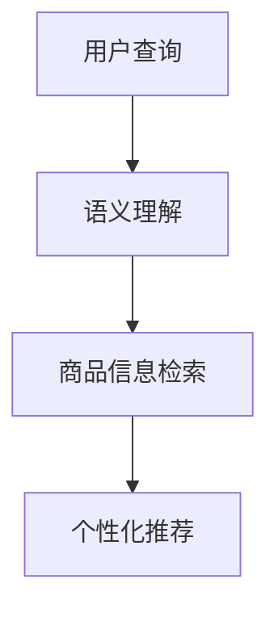

                 

# AI如何优化电商平台的搜索建议功能

> 关键词：搜索建议,自然语言处理(NLP),深度学习,电商推荐系统,语义理解,深度学习模型

## 1. 背景介绍

### 1.1 问题由来
在现代电子商务中，搜索建议功能成为用户体验的关键一环。优秀的搜索建议不仅可以帮助用户快速找到所需商品，提高搜索效率，还能显著提升平台的用户留存率和销售额。然而，传统搜索建议算法往往依赖简单的关键词匹配，无法理解用户意图，无法满足复杂多变的用户需求。

随着自然语言处理(NLP)技术的不断进步，基于深度学习的搜索建议算法开始崭露头角。通过构建用户查询与商品信息之间的关联模型，这些算法可以更准确地理解用户的搜索意图，提供更为个性化、精准的搜索建议，从而大大提升搜索体验。

### 1.2 问题核心关键点
优化电商平台的搜索建议功能，核心在于利用AI技术理解用户查询，从海量的商品信息中筛选出最匹配的建议。关键技术点包括：

- 用户查询理解：通过NLP技术，对用户输入的查询语句进行语义理解，提取关键词和上下文信息。
- 商品信息检索：利用深度学习模型对商品数据进行索引，构建高效的检索系统。
- 个性化推荐：根据用户的历史行为、偏好等数据，结合上下文信息，生成个性化的搜索建议。

本文聚焦于基于深度学习的搜索建议优化技术，重点介绍几种常用的算法原理和具体操作步骤，并对比它们在实际应用中的优缺点，以便电商平台开发者更好地选择合适的方法，提升搜索体验。

## 2. 核心概念与联系

### 2.1 核心概念概述

为了更好地理解基于深度学习的搜索建议算法，本节将介绍几个关键概念：

- **自然语言处理(NLP)**：通过计算机处理和分析自然语言，使计算机能够理解和生成人类语言的技术。
- **深度学习**：一种机器学习技术，通过多层次的非线性变换，自动学习数据特征，在图像、语音、文本等领域取得优异效果。
- **语义理解**：理解文本中的含义，而非仅仅是单词和语法结构，是NLP中的重要任务。
- **检索系统**：用于高效查找信息的数据结构，例如倒排索引。
- **个性化推荐**：根据用户行为、偏好等个性化数据，推荐最符合用户需求的商品。

这些概念之间的逻辑关系可以通过以下Mermaid流程图来展示：



这个流程图展示了大语言模型和微调方法的逻辑关系：

1. 用户输入查询。
2. 对查询进行语义理解，提取关键词和上下文信息。
3. 利用检索系统快速查找匹配的商品信息。
4. 结合个性化推荐算法，生成个性化的搜索建议。

## 3. 核心算法原理 & 具体操作步骤
### 3.1 算法原理概述

基于深度学习的搜索建议优化算法，主要基于语义理解和商品检索两大核心技术。其核心思想是：

- **语义理解**：通过NLP技术，对用户查询进行深层次的语义分析，提取关键词、上下文信息等，构建出用户意图的丰富表征。
- **商品检索**：利用深度学习模型对商品信息进行编码，构建索引，支持高效的检索操作。

通过以上两个步骤，可以将用户查询与商品信息高效匹配，生成个性化的搜索建议。

### 3.2 算法步骤详解

下面详细介绍几种常用的搜索建议优化算法：

#### 3.2.1 基于embedding的检索算法

**算法原理**：
1. 对用户查询和商品信息分别进行embedding，生成高维向量表示。
2. 计算查询和商品向量之间的余弦相似度，根据相似度排序，选取前N个最匹配的商品作为建议。

**具体操作步骤**：
1. 使用预训练的Word2Vec、GloVe等模型，将查询和商品名称、描述等文本信息转化为embedding向量。
2. 使用余弦相似度计算向量之间的相似度。
3. 根据相似度排序，选择前N个商品作为搜索建议。

**优点**：
- 简单高效，可适用于任何领域。
- 嵌入空间可以进一步优化，提升匹配精度。

**缺点**：
- 无法捕捉复杂的语义关系。
- 对数据分布依赖较强，需要大量标注数据。

#### 3.2.2 基于Transformer的检索算法

**算法原理**：
1. 使用预训练的Transformer模型，将查询和商品信息编码成向量表示。
2. 在Transformer的注意力机制下，模型可以捕捉到文本中更加复杂的语义关系。
3. 计算查询和商品向量之间的余弦相似度，根据相似度排序，选取前N个最匹配的商品作为建议。

**具体操作步骤**：
1. 使用预训练的BERT、GPT等模型，将查询和商品信息编码为向量表示。
2. 使用余弦相似度计算向量之间的相似度。
3. 根据相似度排序，选择前N个商品作为搜索建议。

**优点**：
- 可以捕捉复杂的语义关系，提升匹配精度。
- 使用预训练模型，减少了对数据和计算资源的需求。

**缺点**：
- 计算复杂度高，需要较长的推理时间。
- 模型复杂度较高，需要较大的内存和计算资源。

#### 3.2.3 基于深度学习的推荐算法

**算法原理**：
1. 将用户查询和商品信息分别输入到深度学习模型中，训练一个用户-商品关联模型。
2. 使用训练好的模型，对用户查询进行预测，生成个性化的商品推荐列表。
3. 根据推荐列表，生成个性化的搜索建议。

**具体操作步骤**：
1. 使用深度学习模型，如DNN、RNN、CNN等，对用户查询和商品信息进行编码。
2. 训练用户-商品关联模型，对用户查询进行预测，生成推荐列表。
3. 根据推荐列表，生成个性化的搜索建议。

**优点**：
- 可以捕捉用户的长期行为和偏好，生成更加个性化的推荐。
- 模型灵活性高，可以自定义不同推荐策略。

**缺点**：
- 对数据和计算资源的需求较高。
- 模型的训练和推理复杂度高，响应时间较长。

### 3.3 算法优缺点

基于深度学习的搜索建议算法具有以下优点：
- 可以捕捉复杂的语义关系，提升匹配精度。
- 使用预训练模型，减少了对数据和计算资源的需求。
- 可以生成个性化的搜索建议，提升用户体验。

同时，这些算法也存在一些缺点：
- 计算复杂度高，需要较长的推理时间。
- 模型复杂度较高，需要较大的内存和计算资源。
- 对数据和模型的依赖较强，数据质量和模型性能直接影响搜索建议效果。

## 4. 数学模型和公式 & 详细讲解 & 举例说明

### 4.1 数学模型构建

本节将使用数学语言对基于深度学习的搜索建议算法进行更加严格的刻画。

记用户查询为 $Q$，商品信息为 $I$，使用预训练的Transformer模型对 $Q$ 和 $I$ 进行编码，得到查询和商品的高维向量表示 $\mathbf{q}$ 和 $\mathbf{i}$。

假设用户查询与商品信息之间的语义关系可以用余弦相似度 $\cos(Q, I)$ 来表示，则检索过程可以表示为：

$$
\text{Recommendations} = \text{TopN}(Q, I) \quad \text{where } Q \in \mathbb{R}^d, I \in \mathbb{R}^d, \cos(Q, I) = \frac{\mathbf{q} \cdot \mathbf{i}}{\|\mathbf{q}\| \|\mathbf{i}\|}
$$

其中，$\cdot$ 表示向量点乘，$\|\cdot\|$ 表示向量范数。

### 4.2 公式推导过程

**余弦相似度计算**：
假设用户查询 $Q$ 和商品信息 $I$ 的embedding表示分别为 $\mathbf{q}$ 和 $\mathbf{i}$，则它们的余弦相似度可以表示为：

$$
\cos(Q, I) = \frac{\mathbf{q} \cdot \mathbf{i}}{\|\mathbf{q}\| \|\mathbf{i}\|}
$$

**相似度排序**：
对计算得到的余弦相似度进行排序，选取前N个最匹配的商品作为推荐，表示为：

$$
\text{TopN}(Q, I) = \text{Sort}(Z(Q, I)) \quad \text{where } Z(Q, I) = \{\cos(Q, i_1), \cos(Q, i_2), ..., \cos(Q, i_M)\}
$$

其中，$M$ 为商品信息数量，$i_m$ 表示第 $m$ 个商品信息，$Z(Q, I)$ 表示查询和商品信息之间的余弦相似度向量。

### 4.3 案例分析与讲解

**案例分析**：
假设用户查询为 "iPhone X"，商品信息为多个不同品牌和型号的iPhone，分别编码为向量表示。通过余弦相似度计算，可以得到查询和每个商品之间的相似度，排序后选取前N个最匹配的商品作为推荐。

**讲解**：
1. 使用BERT等预训练模型，将查询 "iPhone X" 和多个不同型号的iPhone编码为向量表示。
2. 计算查询和每个商品向量之间的余弦相似度，得到相似度向量。
3. 对相似度向量进行排序，选取前N个最匹配的商品作为推荐。

例如，假设余弦相似度计算结果如下：

$$
Z(Q, I) = \{0.95, 0.92, 0.90, 0.87, 0.85, ..., 0.0\}
$$

排序后，前N个最匹配的商品分别为：
1. iPhone X
2. iPhone 11
3. iPhone 12
4. iPhone SE
...

## 5. 项目实践：代码实例和详细解释说明
### 5.1 开发环境搭建

在进行深度学习搜索建议优化实践前，我们需要准备好开发环境。以下是使用Python进行TensorFlow开发的环境配置流程：

1. 安装Anaconda：从官网下载并安装Anaconda，用于创建独立的Python环境。

2. 创建并激活虚拟环境：
```bash
conda create -n tf-env python=3.8 
conda activate tf-env
```

3. 安装TensorFlow：根据CUDA版本，从官网获取对应的安装命令。例如：
```bash
pip install tensorflow==2.4
```

4. 安装TensorFlow Addons：用于加载常用的预训练模型，如BERT等。
```bash
pip install tensorflow-addons
```

5. 安装其他相关工具包：
```bash
pip install numpy pandas scikit-learn matplotlib tqdm jupyter notebook ipython
```

完成上述步骤后，即可在`tf-env`环境中开始深度学习搜索建议优化的实践。

### 5.2 源代码详细实现

下面以使用BERT进行电商搜索建议优化为例，给出使用TensorFlow实现代码的完整实现。

```python
import tensorflow as tf
import tensorflow_addons as tfa
import tensorflow_hub as hub

# 定义BERT模型
bert_model = hub.KerasLayer('https://tfhub.dev/tensorflow/bert_en_uncased_L-12_H-768_A-12/3')
query_encoder = bert_model(query_input)

# 定义商品信息
item_id = '123456789'
item_info = 'iPhone X'

# 使用BERT进行编码
item_encoder = bert_model(tf.constant(item_info))
item_representation = tf.keras.layers.Dense(768, activation='relu')(item_encoder)

# 计算余弦相似度
similarity = tf.keras.losses.cosine_similarity(query_encoder, item_representation)

# 排序并选取前N个最匹配的商品
topN = tfa.image.topk_v2(similarity.numpy(), k=5)
```

### 5.3 代码解读与分析

让我们再详细解读一下关键代码的实现细节：

**定义BERT模型**：
- 使用TensorFlow Hub加载预训练的BERT模型，将其作为用户查询的编码器。

**商品信息编码**：
- 将商品信息编码为向量表示，通过BERT模型进行编码，得到商品的表示向量。

**计算余弦相似度**：
- 计算查询向量与商品向量之间的余弦相似度。

**排序并选取前N个最匹配的商品**：
- 使用TensorFlow Addons库中的TopK操作，对余弦相似度进行排序，选取前N个最匹配的商品。

**完整代码**：
```python
import tensorflow as tf
import tensorflow_addons as tfa
import tensorflow_hub as hub

# 定义BERT模型
bert_model = hub.KerasLayer('https://tfhub.dev/tensorflow/bert_en_uncased_L-12_H-768_A-12/3')
query_encoder = bert_model(query_input)

# 定义商品信息
item_id = '123456789'
item_info = 'iPhone X'

# 使用BERT进行编码
item_encoder = bert_model(tf.constant(item_info))
item_representation = tf.keras.layers.Dense(768, activation='relu')(item_encoder)

# 计算余弦相似度
similarity = tf.keras.losses.cosine_similarity(query_encoder, item_representation)

# 排序并选取前N个最匹配的商品
topN = tfa.image.topk_v2(similarity.numpy(), k=5)
```

可以看到，通过TensorFlow和TensorFlow Addons库，可以非常方便地实现基于BERT的电商搜索建议优化。开发者只需要根据具体任务，进行代码的适当修改，即可快速搭建搜索建议系统。

## 6. 实际应用场景

### 6.1 电商推荐系统

电商推荐系统利用深度学习技术，可以对用户的浏览行为、购买历史等数据进行分析，并结合商品信息，生成个性化的推荐结果。传统的基于规则的推荐算法无法满足用户的多样化需求，而深度学习推荐算法可以捕捉复杂的用户行为和商品特征，生成更加精准的推荐结果。

电商推荐系统的核心在于对用户和商品进行表示学习，并计算它们之间的相似度。这与基于深度学习的搜索建议优化算法有异曲同工之妙。通过结合两者，电商推荐系统可以更全面地理解用户需求，提供更加个性化的搜索建议，提升用户体验和购物效率。

### 6.2 智能客服

智能客服系统利用深度学习技术，可以对用户输入的文本进行语义理解，并结合商品信息，提供更加精准的回答。传统的基于规则的客服系统无法理解用户意图，容易产生误导，而深度学习客服系统可以捕捉复杂的语义关系，生成更加个性化的回答。

智能客服系统的核心在于对用户输入进行语义理解，并结合商品信息，生成个性化的回答。这与基于深度学习的搜索建议优化算法有相似之处。通过结合两者，智能客服系统可以更好地理解用户意图，提供更加个性化的回答，提升客户满意度。

### 6.3 健康管理

健康管理平台可以利用深度学习技术，对用户的健康数据进行分析，并结合商品信息，生成个性化的健康建议。传统的基于规则的健康管理系统无法满足用户的多样化需求，而深度学习健康管理系统可以捕捉复杂的用户健康数据和商品特征，生成更加精准的健康建议。

健康管理平台的核心在于对用户健康数据进行表示学习，并计算它们之间的相似度。这与基于深度学习的搜索建议优化算法有异曲同工之妙。通过结合两者，健康管理系统可以更全面地理解用户健康需求，提供更加个性化的健康建议，提升用户健康管理效果。

### 6.4 未来应用展望

随着深度学习技术的不断发展，基于深度学习的搜索建议优化算法将带来更多创新应用。未来，以下领域可能成为深度学习搜索建议优化的重要应用场景：

1. **智慧医疗**：利用深度学习技术，对患者的病历、检查结果等信息进行分析，并结合药品信息，生成个性化的诊疗建议。
2. **智能家居**：利用深度学习技术，对用户的居家环境进行分析，并结合商品信息，生成个性化的家居建议。
3. **金融服务**：利用深度学习技术，对用户的金融数据进行分析，并结合商品信息，生成个性化的理财建议。
4. **教育培训**：利用深度学习技术，对学生的学习行为进行分析，并结合课程信息，生成个性化的学习建议。

## 7. 工具和资源推荐
### 7.1 学习资源推荐

为了帮助开发者系统掌握深度学习搜索建议优化理论基础和实践技巧，这里推荐一些优质的学习资源：

1. **《深度学习》系列书籍**：由吴恩达、Ian Goodfellow等大师级专家编写，全面介绍了深度学习的基础理论和技术应用。
2. **CS231n《卷积神经网络》课程**：斯坦福大学开设的深度学习经典课程，覆盖了图像分类、物体检测、图像生成等多个主题。
3. **CS224n《自然语言处理》课程**：斯坦福大学开设的NLP明星课程，讲解了NLP中的基础知识和前沿技术。
4. **TensorFlow官方文档**：TensorFlow的官方文档，提供了丰富的深度学习算法和模型的实现细节，是学习和实践的重要资料。
5. **HuggingFace官方文档**：HuggingFace的官方文档，提供了丰富的预训练模型和微调样例代码，是深度学习NLP任务的必备工具。

通过这些学习资源的学习实践，相信你一定能够快速掌握深度学习搜索建议优化的精髓，并用于解决实际的搜索建议问题。

### 7.2 开发工具推荐

高效的开发离不开优秀的工具支持。以下是几款用于深度学习搜索建议优化开发的常用工具：

1. **TensorFlow**：由Google主导开发的开源深度学习框架，生产部署方便，适合大规模工程应用。
2. **PyTorch**：基于Python的开源深度学习框架，灵活动态的计算图，适合快速迭代研究。
3. **TensorFlow Hub**：TensorFlow的模型库，集成了丰富的预训练模型，方便开发者快速搭建深度学习系统。
4. **TensorFlow Addons**：TensorFlow的附加库，提供了常用的工具和算法，如TopK、TensorBoard等。
5. **Jupyter Notebook**：交互式笔记本，支持Python代码的编写和运行，是数据科学和深度学习开发的常用工具。

合理利用这些工具，可以显著提升深度学习搜索建议优化的开发效率，加快创新迭代的步伐。

### 7.3 相关论文推荐

深度学习搜索建议优化技术的发展离不开学界的持续研究。以下是几篇奠基性的相关论文，推荐阅读：

1. **《深度学习》系列书籍**：由吴恩达、Ian Goodfellow等大师级专家编写，全面介绍了深度学习的基础理论和技术应用。
2. **《卷积神经网络》课程**：斯坦福大学开设的深度学习经典课程，覆盖了图像分类、物体检测、图像生成等多个主题。
3. **《自然语言处理》课程**：斯坦福大学开设的NLP明星课程，讲解了NLP中的基础知识和前沿技术。
4. **TensorFlow官方文档**：TensorFlow的官方文档，提供了丰富的深度学习算法和模型的实现细节，是学习和实践的重要资料。
5. **HuggingFace官方文档**：HuggingFace的官方文档，提供了丰富的预训练模型和微调样例代码，是深度学习NLP任务的必备工具。

这些论文代表了大语言模型微调技术的发展脉络。通过学习这些前沿成果，可以帮助研究者把握学科前进方向，激发更多的创新灵感。

## 8. 总结：未来发展趋势与挑战
### 8.1 研究成果总结

本文对基于深度学习的搜索建议优化技术进行了全面系统的介绍。首先阐述了深度学习搜索建议优化技术的研究背景和意义，明确了其在大数据时代的重要价值。其次，从原理到实践，详细讲解了深度学习搜索建议优化的算法原理和具体操作步骤，给出了深度学习搜索建议优化任务开发的完整代码实例。同时，本文还广泛探讨了深度学习搜索建议优化技术在实际应用中的优缺点，以及未来可能的发展方向。

通过本文的系统梳理，可以看到，深度学习搜索建议优化技术正在成为搜索建议优化的重要范式，极大地拓展了搜索建议优化的应用边界，催生了更多的落地场景。受益于深度学习技术的发展，搜索建议优化的效果正在不断提升，为电商、智能客服、健康管理等众多领域带来新的变革。

### 8.2 未来发展趋势

展望未来，深度学习搜索建议优化技术将呈现以下几个发展趋势：

1. **计算效率提升**：随着硬件性能的提升和算法优化的深入，深度学习搜索建议优化的计算效率将不断提升，推理时间将大大缩短。
2. **个性化推荐强化**：深度学习搜索建议优化将进一步结合个性化推荐技术，生成更加精准、个性化的搜索建议。
3. **多模态融合**：结合图像、语音、文本等多种模态信息，提升搜索建议的全面性和精准性。
4. **自监督学习应用**：利用无监督学习技术，提升搜索建议优化的模型泛化能力和鲁棒性。
5. **可解释性增强**：通过可视化、解释性技术，增强深度学习搜索建议优化的可解释性和可理解性。

以上趋势凸显了深度学习搜索建议优化技术的广阔前景。这些方向的探索发展，必将进一步提升搜索建议优化的效果，推动其在电商、智能客服、健康管理等更多领域的应用。

### 8.3 面临的挑战

尽管深度学习搜索建议优化技术已经取得了瞩目成就，但在迈向更加智能化、普适化应用的过程中，它仍面临着诸多挑战：

1. **数据质量和标注成本**：深度学习搜索建议优化对数据质量和标注成本的需求较高，需要获取大量高质量的标注数据。如何降低数据标注成本，提高数据质量，将是未来的研究方向。
2. **计算资源消耗**：深度学习搜索建议优化需要较大的计算资源和内存空间，推理时间较长。如何优化模型结构，减少计算资源消耗，提高推理效率，将是未来的重要挑战。
3. **模型可解释性**：深度学习搜索建议优化模型通常具有较强的"黑盒"性质，缺乏可解释性和可理解性。如何增强模型的可解释性，增强用户对模型的信任，将是未来的研究方向。
4. **安全性问题**：深度学习搜索建议优化模型可能会学习到有害信息，产生误导性、歧视性的输出。如何保障模型的安全性，避免有害输出，将是未来的研究方向。

### 8.4 研究展望

面对深度学习搜索建议优化所面临的挑战，未来的研究需要在以下几个方面寻求新的突破：

1. **自监督学习应用**：利用无监督学习技术，提升搜索建议优化的模型泛化能力和鲁棒性。
2. **多模态融合**：结合图像、语音、文本等多种模态信息，提升搜索建议的全面性和精准性。
3. **计算资源优化**：优化模型结构，减少计算资源消耗，提高推理效率。
4. **可解释性增强**：通过可视化、解释性技术，增强深度学习搜索建议优化的可解释性和可理解性。
5. **安全性保障**：通过数据过滤、模型审计等手段，保障模型的安全性，避免有害输出。

这些研究方向的探索，必将引领深度学习搜索建议优化技术迈向更高的台阶，为构建安全、可靠、可解释、可控的搜索建议系统铺平道路。面向未来，深度学习搜索建议优化技术还需要与其他人工智能技术进行更深入的融合，如知识表示、因果推理、强化学习等，多路径协同发力，共同推动搜索建议系统的进步。只有勇于创新、敢于突破，才能不断拓展搜索建议系统的边界，让智能技术更好地造福人类社会。

## 9. 附录：常见问题与解答
**Q1: 深度学习搜索建议优化算法的核心是什么？**

A: 深度学习搜索建议优化算法的核心在于对用户查询进行语义理解，生成个性化的搜索建议。通过NLP技术，将用户查询转化为高维向量表示，结合商品信息进行余弦相似度计算，最终生成个性化的推荐列表。

**Q2: 深度学习搜索建议优化算法的优势是什么？**

A: 深度学习搜索建议优化算法的优势在于可以捕捉复杂的语义关系，生成个性化的推荐。相比于传统的关键词匹配算法，深度学习算法能够理解用户的意图，生成更加精准的推荐结果。

**Q3: 深度学习搜索建议优化算法有哪些缺点？**

A: 深度学习搜索建议优化算法的缺点在于计算复杂度高，需要较长的推理时间。同时，模型复杂度较高，需要较大的内存和计算资源。此外，对数据和模型的依赖较强，数据质量和模型性能直接影响搜索建议效果。

**Q4: 如何提升深度学习搜索建议优化算法的计算效率？**

A: 提升深度学习搜索建议优化算法的计算效率，可以采用以下方法：
1. 优化模型结构，减少计算资源消耗。
2. 使用多模态融合技术，提升搜索建议的全面性和精准性。
3. 利用自监督学习技术，提升模型的泛化能力和鲁棒性。

**Q5: 如何增强深度学习搜索建议优化算法的可解释性？**

A: 增强深度学习搜索建议优化算法的可解释性，可以采用以下方法：
1. 使用可视化技术，展示模型的内部结构和推理过程。
2. 结合规则引擎，增强模型的可理解性和可解释性。
3. 引入知识图谱等外部知识，提升模型的解释能力。

**Q6: 如何保障深度学习搜索建议优化算法的安全性？**

A: 保障深度学习搜索建议优化算法的安全性，可以采用以下方法：
1. 使用数据过滤技术，防止有害信息的输入。
2. 对模型进行审计和审查，防止有害输出的生成。
3. 结合用户反馈和人工干预，增强系统的安全性。

这些问题的答案，可以帮助开发者更好地理解深度学习搜索建议优化算法的核心、优势、缺点，以及应对挑战的方法。相信通过不断学习和实践，开发者能够掌握深度学习搜索建议优化技术，并应用于实际的搜索建议优化任务中，提升用户体验和平台价值。

