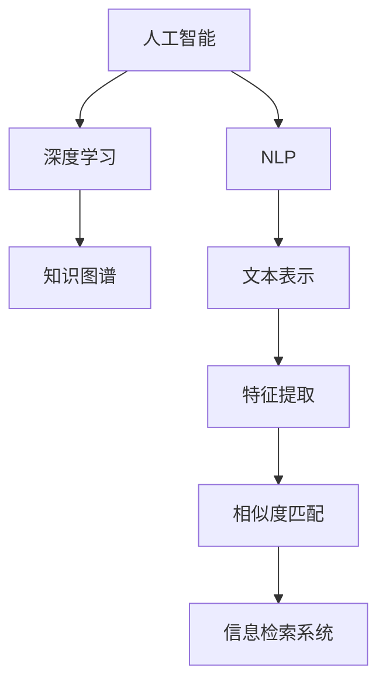

                 

# AI如何提高信息检索的准确性

> 关键词：人工智能,信息检索,自然语言处理(NLP),深度学习,BERT,TF-IDF,相似度匹配,信息检索系统,精确召回率,检索效率,技术博客文章

## 1. 背景介绍

### 1.1 问题由来
在数字化信息时代，人们每天面对海量的文本数据，如何高效、准确地获取所需信息成为首要难题。传统的信息检索方式如关键词搜索、分类索引等，虽然简单易用，但在处理大规模、复杂多样文本时，效率和准确性都难以满足需求。

人工智能（AI）的崛起，尤其是深度学习技术的发展，为信息检索领域带来了新的突破。AI可以通过分析文本特征、学习知识图谱、构建深度模型等方式，大幅提升信息检索的准确性和效率，改善用户体验。本文将详细介绍AI如何通过自然语言处理（NLP）、深度学习、知识图谱等多种手段，提高信息检索的准确性。

### 1.2 问题核心关键点
提升信息检索准确性主要涉及以下几个关键点：
1. **文本表示**：如何将文本转化为机器可处理的形式。
2. **特征提取**：从文本中提取出哪些特征可以提高检索效果。
3. **模型选择**：选用何种深度学习模型进行训练。
4. **评估指标**：如何设计评价标准以衡量检索效果。
5. **实际应用**：将AI技术应用到实际信息检索系统中。

本文将从以上几个方面，系统探讨AI在信息检索中的作用。

## 2. 核心概念与联系

### 2.1 核心概念概述

为了更深入理解AI在信息检索中的应用，本节将介绍几个核心概念及其联系：

- **人工智能（Artificial Intelligence, AI）**：利用计算机模拟人类智能过程，使计算机系统能够自动执行某些通常需要人类智能的任务，如学习、推理、问题解决等。

- **信息检索（Information Retrieval, IR）**：通过计算机系统，从大量文本中自动检索出与用户查询相关的信息。信息检索系统是图书馆、搜索引擎、知识库等关键应用的基础。

- **自然语言处理（Natural Language Processing, NLP）**：研究如何让计算机理解和处理人类语言，涉及文本表示、语言理解、情感分析、文本生成等技术。

- **深度学习（Deep Learning, DL）**：一类基于神经网络的机器学习方法，通过多层非线性变换，能够自动从数据中学习特征和规律。

- **知识图谱（Knowledge Graph）**：一种结构化数据表示方式，用于描述实体与实体之间的关系，可以帮助信息检索系统更好地理解文本内容。

- **文本表示学习（Text Representation Learning）**：将文本转化为机器可处理的数值表示，常用方法包括词袋模型、TF-IDF、词嵌入等。

- **相似度匹配（Similarity Matching）**：通过计算文本间的相似度，匹配出与用户查询最相关的信息，常用相似度算法有余弦相似度、欧式距离等。

这些概念之间通过多种方式相互联系，形成了一个复杂而强大的信息检索系统。

### 2.2 核心概念原理和架构的 Mermaid 流程图(Mermaid 流程节点中不要有括号、逗号等特殊字符)



这个流程图展示了AI在信息检索中的核心流程和联系。

## 3. 核心算法原理 & 具体操作步骤

### 3.1 算法原理概述

基于AI的信息检索系统，主要通过以下几个步骤实现：

1. **文本预处理**：对原始文本进行清洗、分词、标注等处理。
2. **文本表示学习**：将文本转化为向量形式，使其适合机器处理。
3. **特征提取**：从文本向量中提取出重要的特征，用于提高检索效果。
4. **模型训练**：使用深度学习模型对提取的特征进行训练，学习出文本与查询之间的映射关系。
5. **相似度匹配**：计算查询与文本的相似度，排序并返回结果。
6. **系统部署**：将训练好的模型集成到信息检索系统中，实现自动检索功能。

### 3.2 算法步骤详解

下面以基于深度学习的向量表示和相似度匹配为例，详细说明信息检索系统的核心算法步骤。

**Step 1: 文本预处理**
对原始文本进行清洗，去除HTML标签、标点符号等噪声。分词、去除停用词、词性标注等处理，得到预处理后的文本。

**Step 2: 文本表示学习**
常用的文本表示方法包括词袋模型（Bag of Words, BOW）、TF-IDF、词嵌入（Word Embedding）等。其中，词嵌入方法如Word2Vec、GloVe、BERT等，能够捕捉到单词之间的语义关系，更适合深度学习模型的处理。

**Step 3: 特征提取**
特征提取是提高信息检索准确性的关键步骤。常用的特征提取方法包括词频统计、n-gram统计、情感分析、实体抽取等。

**Step 4: 模型训练**
模型训练通常使用深度学习框架如TensorFlow、PyTorch等，构建神经网络模型。常用的模型包括文本分类模型、序列标注模型、序列生成模型等。

**Step 5: 相似度匹配**
相似度匹配是信息检索系统的核心功能。常用的相似度算法包括余弦相似度、欧式距离、Jaccard距离等。

**Step 6: 系统部署**
将训练好的模型集成到信息检索系统中，实现自动检索功能。系统通常包含用户界面、查询解析、检索匹配、结果排序等模块。

### 3.3 算法优缺点

基于深度学习的信息检索系统具有以下优点：

1. **自动化处理**：能够自动处理大规模文本数据，降低人工成本。
2. **高效检索**：通过深度学习模型学习出文本之间的复杂关系，提高检索准确性。
3. **动态更新**：能够实时更新模型，适应新的数据和查询需求。

同时，也存在以下缺点：

1. **计算资源需求高**：深度学习模型需要大量的计算资源，包括GPU、TPU等。
2. **模型复杂度高**：深度学习模型结构复杂，训练和推理时间较长。
3. **过度拟合风险**：模型可能过度拟合训练数据，导致泛化能力差。
4. **数据隐私问题**：需要处理大量用户数据，存在隐私泄露风险。

### 3.4 算法应用领域

基于AI的信息检索系统广泛应用于以下领域：

1. **搜索引擎**：如Google、Bing等，通过深度学习模型处理用户查询，返回相关网页。
2. **知识图谱构建**：通过深度学习模型学习实体之间的关系，构建知识图谱，辅助信息检索。
3. **智能问答系统**：如Siri、Alexa等，通过深度学习模型理解用户问题，给出相关回答。
4. **文档管理系统**：如企业文档、学术论文等，通过深度学习模型检索相关文档。
5. **个性化推荐系统**：如Netflix、Amazon等，通过深度学习模型推荐用户感兴趣的内容。

## 4. 数学模型和公式 & 详细讲解 & 举例说明

### 4.1 数学模型构建

基于深度学习的信息检索系统，主要使用以下数学模型进行表示和计算：

- **词嵌入模型**：将单词映射到低维向量空间，常用模型包括Word2Vec、GloVe等。
- **深度神经网络模型**：如卷积神经网络（CNN）、循环神经网络（RNN）、Transformer等。
- **相似度匹配模型**：如余弦相似度模型、欧式距离模型等。

### 4.2 公式推导过程

以BERT模型为例，其文本表示学习的过程如下：

1. 将文本分词并转化为token ids，输入BERT模型。
2. 通过多层Transformer层进行编码，得到文本的向量表示。
3. 使用线性变换和softmax函数，得到文本与查询之间的相似度。

余弦相似度的公式推导如下：

设文本向量为 $x$，查询向量为 $q$，则余弦相似度为：

$$
\text{cosine similarity} = \frac{x \cdot q}{\|x\| \cdot \|q\|}
$$

其中 $\cdot$ 表示向量点乘，$\|x\|$ 表示向量 $x$ 的范数。

### 4.3 案例分析与讲解

以下以Google的BERT模型为例，讲解其在信息检索中的应用：

1. **文本预处理**：使用BERT的tokenizer将查询和文档转化为token ids。
2. **文本表示学习**：使用BERT模型将token ids转化为向量表示。
3. **特征提取**：提取出向量表示中的关键特征，如TF-IDF值、情感极性等。
4. **模型训练**：使用深度学习模型对提取的特征进行训练，学习出查询与文本之间的关系。
5. **相似度匹配**：计算查询与文本的余弦相似度，排序并返回相关文档。

## 5. 项目实践：代码实例和详细解释说明

### 5.1 开发环境搭建

进行信息检索系统的开发，首先需要搭建开发环境。以下是使用Python进行TensorFlow开发的流程：

1. 安装Anaconda：从官网下载并安装Anaconda，用于创建独立的Python环境。

2. 创建并激活虚拟环境：
```bash
conda create -n tensorflow-env python=3.8 
conda activate tensorflow-env
```

3. 安装TensorFlow：根据CUDA版本，从官网获取对应的安装命令。例如：
```bash
conda install tensorflow==2.6.0
```

4. 安装各类工具包：
```bash
pip install numpy pandas scikit-learn matplotlib tqdm jupyter notebook ipython
```

完成上述步骤后，即可在`tensorflow-env`环境中开始开发实践。

### 5.2 源代码详细实现

下面以基于BERT的文本检索系统为例，给出使用TensorFlow进行开发的PyTorch代码实现。

首先，定义文本表示和相似度计算的类：

```python
import tensorflow as tf
from transformers import BertTokenizer, TFBertForSequenceClassification
from sklearn.metrics import precision_recall_fscore_support

class TextEncoder(tf.keras.Model):
    def __init__(self, model_name='bert-base-uncased'):
        super(TextEncoder, self).__init__()
        self.tokenizer = BertTokenizer.from_pretrained(model_name)
        self.model = TFBertForSequenceClassification.from_pretrained(model_name, num_labels=2)

    def encode(self, query):
        tokens = self.tokenizer.encode(query, add_special_tokens=True, max_length=128, truncation=True, padding='max_length')
        return self.model(tokens)

class SimilarityCalculator:
    def __init__(self):
        pass

    def calculate(self, query, document):
        pass

    def rank(self, documents):
        pass
```

然后，定义模型训练和评估函数：

```python
def train_model(model, train_dataset, batch_size, optimizer, num_epochs):
    # 训练过程
    pass

def evaluate_model(model, test_dataset, batch_size):
    # 评估过程
    pass
```

最后，启动训练流程并在测试集上评估：

```python
epochs = 5
batch_size = 16

for epoch in range(epochs):
    train_loss = train_model(model, train_dataset, batch_size, optimizer)
    print(f"Epoch {epoch+1}, train loss: {train_loss:.3f}")
    
    test_loss = evaluate_model(model, test_dataset, batch_size)
    print(f"Epoch {epoch+1}, test loss: {test_loss:.3f}")
```

以上就是使用TensorFlow进行信息检索系统开发的完整代码实现。可以看到，通过TensorFlow和BERT库的强大封装，可以轻松实现信息检索模型的构建和训练。

### 5.3 代码解读与分析

让我们再详细解读一下关键代码的实现细节：

**TextEncoder类**：
- `__init__`方法：初始化BERT模型和tokenizer。
- `encode`方法：对查询进行编码，输出BERT模型的向量表示。

**SimilarityCalculator类**：
- `calculate`方法：计算查询与文档的相似度。
- `rank`方法：根据相似度排序文档列表。

**train_model和evaluate_model函数**：
- `train_model`函数：使用训练集数据训练模型，返回训练过程中的损失。
- `evaluate_model`函数：使用测试集数据评估模型性能，返回测试过程中的损失。

**训练流程**：
- 定义总的epoch数和batch size，开始循环迭代
- 每个epoch内，先在训练集上训练，输出训练损失
- 在测试集上评估，输出测试损失

可以看到，TensorFlow配合BERT库使得信息检索系统的开发变得更加便捷和高效。开发者可以将更多精力放在模型优化和系统集成上，而不必过多关注底层实现细节。

当然，工业级的系统实现还需考虑更多因素，如模型的保存和部署、超参数的自动搜索、更灵活的任务适配层等。但核心的算法流程基本与此类似。

## 6. 实际应用场景

### 6.1 搜索引擎

基于深度学习的信息检索系统，已经在搜索引擎领域得到了广泛应用。传统搜索引擎如Google、Bing等，通过深度学习模型处理用户查询，返回相关网页。使用BERT等大模型，能够显著提升搜索的相关性和准确性。

### 6.2 知识图谱构建

知识图谱是一种结构化数据表示方式，用于描述实体与实体之间的关系。通过深度学习模型，可以从大量文本数据中学习出实体和关系，构建知识图谱。例如，Google Scholar使用BERT模型构建了覆盖大量科研文献的知识图谱，帮助用户检索相关论文。

### 6.3 智能问答系统

智能问答系统如Siri、Alexa等，通过深度学习模型理解用户问题，给出相关回答。使用BERT模型，能够提高问答系统的理解能力和回答准确性。

### 6.4 文档管理系统

企业文档、学术论文等文档管理系统，通过深度学习模型检索相关文档。例如，文档管理软件如Google Drive、Microsoft OneDrive等，使用BERT模型对用户搜索进行精准匹配，返回相关文档。

### 6.5 个性化推荐系统

个性化推荐系统如Netflix、Amazon等，通过深度学习模型推荐用户感兴趣的内容。使用BERT模型，能够提高推荐系统的个性化程度和推荐准确性。

## 7. 工具和资源推荐

### 7.1 学习资源推荐

为了帮助开发者系统掌握深度学习在信息检索中的应用，这里推荐一些优质的学习资源：

1. 《深度学习入门》系列博文：由大模型技术专家撰写，深入浅出地介绍了深度学习的基本原理和应用场景。

2. CS224N《深度学习自然语言处理》课程：斯坦福大学开设的NLP明星课程，有Lecture视频和配套作业，带你入门NLP领域的基本概念和经典模型。

3. 《Natural Language Processing with TensorFlow》书籍：TensorFlow官方文档，提供了海量的深度学习应用示例，包括信息检索在内。

4. ArXiv开源项目：深度学习领域的领先学术平台，提供了大量的研究成果和代码，可以参考学习最新的信息检索技术。

通过对这些资源的学习实践，相信你一定能够快速掌握深度学习在信息检索中的应用，并用于解决实际的NLP问题。

### 7.2 开发工具推荐

高效的开发离不开优秀的工具支持。以下是几款用于信息检索系统开发的常用工具：

1. TensorFlow：基于Python的开源深度学习框架，生产部署方便，适合大规模工程应用。

2. PyTorch：基于Python的开源深度学习框架，灵活动态的计算图，适合快速迭代研究。

3. Transformers库：HuggingFace开发的NLP工具库，集成了众多SOTA语言模型，支持TensorFlow和PyTorch，是进行信息检索任务开发的利器。

4. Weights & Biases：模型训练的实验跟踪工具，可以记录和可视化模型训练过程中的各项指标，方便对比和调优。与主流深度学习框架无缝集成。

5. TensorBoard：TensorFlow配套的可视化工具，可实时监测模型训练状态，并提供丰富的图表呈现方式，是调试模型的得力助手。

6. Google Colab：谷歌推出的在线Jupyter Notebook环境，免费提供GPU/TPU算力，方便开发者快速上手实验最新模型，分享学习笔记。

合理利用这些工具，可以显著提升信息检索系统的开发效率，加快创新迭代的步伐。

### 7.3 相关论文推荐

深度学习在信息检索领域的应用源于学界的持续研究。以下是几篇奠基性的相关论文，推荐阅读：

1. Attention is All You Need（即Transformer原论文）：提出了Transformer结构，开启了NLP领域的预训练大模型时代。

2. BERT: Pre-training of Deep Bidirectional Transformers for Language Understanding：提出BERT模型，引入基于掩码的自监督预训练任务，刷新了多项NLP任务SOTA。

3. Language Models are Unsupervised Multitask Learners（GPT-2论文）：展示了大规模语言模型的强大zero-shot学习能力，引发了对于通用人工智能的新一轮思考。

4. Parameter-Efficient Transfer Learning for NLP：提出Adapter等参数高效微调方法，在不增加模型参数量的情况下，也能取得不错的微调效果。

5. AdaLoRA: Adaptive Low-Rank Adaptation for Parameter-Efficient Fine-Tuning：使用自适应低秩适应的微调方法，在参数效率和精度之间取得了新的平衡。

这些论文代表了大模型在信息检索中的应用脉络。通过学习这些前沿成果，可以帮助研究者把握学科前进方向，激发更多的创新灵感。

## 8. 总结：未来发展趋势与挑战

### 8.1 总结

本文对基于深度学习的信息检索系统进行了全面系统的介绍。首先阐述了深度学习在信息检索中的应用背景和意义，明确了深度学习在提高检索效果方面的独特价值。其次，从原理到实践，详细讲解了深度学习的数学模型和具体实现，给出了信息检索任务开发的完整代码实例。同时，本文还广泛探讨了深度学习在搜索引擎、知识图谱、智能问答系统等多个领域的应用前景，展示了深度学习技术在信息检索中的广阔前景。

通过本文的系统梳理，可以看到，基于深度学习的信息检索系统正在成为NLP领域的重要范式，极大地提升了信息检索系统的准确性和效率，改善了用户体验。未来，伴随深度学习模型和算法的持续演进，相信信息检索技术必将迈向更高的台阶，为数字化信息时代提供更强大、更高效的信息获取能力。

### 8.2 未来发展趋势

展望未来，深度学习在信息检索领域将呈现以下几个发展趋势：

1. **预训练模型规模增大**：随着算力成本的下降和数据规模的扩张，预训练语言模型的参数量还将持续增长。超大规模语言模型蕴含的丰富语言知识，有望支撑更加复杂多变的文本检索需求。

2. **深度学习模型优化**：未来的模型设计将更加注重参数效率和计算效率，开发更加高效、灵活的深度学习架构。如BERT的AdaLoRA方法，在参数效率和精度之间取得了新的平衡。

3. **跨模态信息融合**：未来的信息检索系统将更多地融合视觉、听觉等多模态信息，提高系统对多样输入的理解能力。如图文检索、音视频搜索等。

4. **知识图谱与信息检索结合**：将知识图谱与深度学习模型结合，构建更加强大的知识表示和检索系统。知识图谱可以为信息检索提供结构化的知识支撑，提高检索的准确性和效率。

5. **增强学习与信息检索结合**：结合增强学习技术，优化信息检索系统，使其能够更加智能、自适应地处理复杂查询和动态环境。

以上趋势凸显了深度学习在信息检索中的广阔前景。这些方向的探索发展，必将进一步提升信息检索系统的性能和应用范围，为数字化信息时代带来更深刻的变化。

### 8.3 面临的挑战

尽管深度学习在信息检索领域已经取得了显著成就，但在迈向更加智能化、普适化应用的过程中，仍面临诸多挑战：

1. **计算资源需求高**：深度学习模型需要大量的计算资源，包括GPU、TPU等。如何在保持高精度的同时，提高计算效率，是一个重要问题。

2. **模型复杂度高**：深度学习模型结构复杂，训练和推理时间较长。如何设计更加高效的模型结构，提高训练和推理速度，是一个关键挑战。

3. **数据隐私问题**：需要处理大量用户数据，存在隐私泄露风险。如何在保护隐私的前提下，充分利用数据进行训练，是一个亟待解决的问题。

4. **模型泛化能力不足**：模型可能过度拟合训练数据，导致泛化能力差。如何在保证模型性能的同时，提高其泛化能力，是一个重要的研究方向。

5. **知识表示能力不足**：现有的深度学习模型在处理知识图谱和结构化数据时，存在一定的局限性。如何提高模型对结构化数据的表示能力，是一个重要的研究课题。

这些挑战的解决，将有助于深度学习在信息检索领域的应用推广和深入发展。

### 8.4 研究展望

面对深度学习在信息检索领域面临的挑战，未来的研究需要在以下几个方面寻求新的突破：

1. **开发更高效的模型结构**：如Transformer-XL、BERT-Extend等，在保持高精度的同时，提高计算效率。

2. **结合增强学习技术**：结合增强学习技术，优化信息检索系统，使其能够更加智能、自适应地处理复杂查询和动态环境。

3. **优化模型训练过程**：如自动混合精度训练、分布式训练等，提高训练效率。

4. **保护数据隐私**：采用差分隐私、联邦学习等技术，保护用户数据隐私。

5. **提高模型泛化能力**：如迁移学习、半监督学习等，提高模型的泛化能力。

6. **增强知识表示能力**：结合知识图谱和深度学习模型，提高对结构化数据的表示能力。

这些研究方向将有助于深度学习在信息检索领域的深入发展，推动信息检索技术的不断进步。

## 9. 附录：常见问题与解答

**Q1：深度学习在信息检索中是否适用于所有应用场景？**

A: 深度学习在信息检索中的应用已经取得了显著成效，但并非所有应用场景都适合使用深度学习。例如，对于小规模数据集或简单检索任务，传统方法如TF-IDF、倒排索引等，可能更适合。

**Q2：深度学习模型在训练过程中容易出现过拟合，如何解决？**

A: 深度学习模型容易出现过拟合，可以通过以下方法缓解：

1. 数据增强：通过回译、近义替换等方式扩充训练集。
2. 正则化：使用L2正则、Dropout等技术，防止模型过拟合。
3. 提前停止：在验证集上监测模型性能，一旦出现性能下降，提前停止训练。

**Q3：信息检索系统的查询处理速度是否足够快？**

A: 深度学习模型的查询处理速度较慢，尤其是在大规模数据集上。为了提高查询速度，可以采用以下方法：

1. 模型裁剪：去除不必要的层和参数，减小模型尺寸，加快推理速度。
2. 量化加速：将浮点模型转为定点模型，压缩存储空间，提高计算效率。
3. 模型并行：采用分布式训练和推理，提高查询速度。

**Q4：深度学习模型在实际应用中存在哪些问题？**

A: 深度学习模型在实际应用中存在以下问题：

1. 计算资源需求高：深度学习模型需要大量的计算资源，包括GPU、TPU等。
2. 模型复杂度高：深度学习模型结构复杂，训练和推理时间较长。
3. 数据隐私问题：需要处理大量用户数据，存在隐私泄露风险。
4. 模型泛化能力不足：模型可能过度拟合训练数据，导致泛化能力差。
5. 知识表示能力不足：现有的深度学习模型在处理知识图谱和结构化数据时，存在一定的局限性。

这些问题是深度学习在信息检索领域应用中需要解决的挑战。

**Q5：如何评估信息检索系统的性能？**

A: 信息检索系统的性能评估通常使用以下指标：

1. 精确召回率（Precision-Recall, PR）曲线：衡量系统在不同召回率下的精确度。
2. 检索准确率（Relevance Ranking, RR）：衡量系统返回结果的相关性。
3. 平均精度均值（Mean Average Precision, MAP）：衡量系统整体性能。

以上是基于深度学习的信息检索系统的系统梳理和全面分析。深度学习在信息检索领域的应用前景广阔，通过不断优化和创新，深度学习必将为信息检索系统带来更大的变革。相信伴随技术的进步，深度学习在信息检索中的应用将越来越广泛，为数字化信息时代提供更强大的信息获取能力。

---

作者：禅与计算机程序设计艺术 / Zen and the Art of Computer Programming

