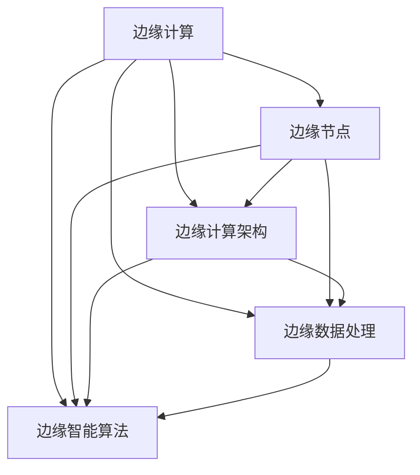

# 边缘计算与交通管理的协作

作者：禅与计算机程序设计艺术 / Zen and the Art of Computer Programming

## 关键词：

边缘计算，交通管理，智能交通系统，数据处理，实时性，安全性，效率

## 1. 背景介绍

### 1.1 问题的由来

随着城市化进程的加快，交通拥堵、能源浪费、环境污染等问题日益突出。传统的交通管理系统往往依赖于中心化的数据处理中心，对实时性、可靠性和处理能力的要求越来越高。然而，随着车联网、智能交通系统等新兴技术的快速发展，交通管理面临着前所未有的挑战。

边缘计算作为一种新兴的计算范式，旨在将计算任务从中心化数据中心迁移到网络边缘，从而降低延迟、提高可靠性、降低能耗。将边缘计算与交通管理相结合，有望解决传统交通管理系统的诸多问题，实现更加智能、高效、绿色的交通管理。

### 1.2 研究现状

近年来，边缘计算与交通管理的研究取得了显著进展。研究者们从多个方面探讨了边缘计算在交通管理中的应用，包括：

- 边缘节点部署：研究边缘节点的选址、数量和布局，以实现最佳的覆盖范围和计算能力。
- 边缘计算架构：研究边缘计算架构的设计和优化，以提高系统性能和可靠性。
- 边缘数据处理：研究边缘节点的数据采集、处理和分析方法，以满足实时性、可靠性和安全性要求。
- 边缘智能算法：研究边缘节点的智能算法，如路径规划、交通信号控制、自动驾驶等。

### 1.3 研究意义

将边缘计算与交通管理相结合具有重要的研究意义：

- 提高交通管理系统的实时性和可靠性：边缘计算可以降低数据传输延迟，实现实时数据处理和决策，从而提高交通管理系统的响应速度和可靠性。
- 降低能耗和成本：边缘计算可以减少数据传输距离，降低能耗和通信成本。
- 增强安全性：边缘计算可以增强数据的安全性，防止数据泄露和恶意攻击。
- 促进智能交通系统的发展：边缘计算可以为智能交通系统提供强大的计算能力，推动智能交通系统的快速发展。

### 1.4 本文结构

本文将围绕边缘计算与交通管理的协作展开，具体内容包括：

- 核心概念与联系
- 核心算法原理与具体操作步骤
- 数学模型和公式
- 项目实践
- 实际应用场景
- 工具和资源推荐
- 总结：未来发展趋势与挑战

## 2. 核心概念与联系

为了更好地理解边缘计算与交通管理的协作，首先介绍以下几个核心概念：

- 边缘计算：将计算任务从中心化数据中心迁移到网络边缘，以降低延迟、提高可靠性、降低能耗的计算范式。
- 交通管理：对交通系统进行规划、设计、建设和运营，以实现交通安全、高效、绿色、可持续发展的活动。
- 智能交通系统：利用先进的信息技术，实现交通管理智能化，提高交通系统的效率和安全性。
- 边缘节点：边缘计算中的计算设备，负责数据处理、分析和决策。
- 边缘计算架构：边缘节点的组织结构、数据传输和处理方式等。
- 边缘数据处理：边缘节点对采集到的数据进行处理和分析。
- 边缘智能算法：边缘节点执行的智能算法，如路径规划、交通信号控制、自动驾驶等。

这些概念之间的逻辑关系如下所示：



可以看出，边缘计算通过边缘节点实现，边缘计算架构决定了边缘节点的组织结构和数据传输方式，边缘数据处理和边缘智能算法是边缘计算的核心功能。

## 3. 核心算法原理与具体操作步骤

### 3.1 算法原理概述

边缘计算与交通管理的协作主要涉及以下核心算法：

- 数据采集算法：负责采集交通相关数据，如车辆位置、速度、交通流量等。
- 数据处理算法：对采集到的数据进行预处理、分析和融合，为决策提供支持。
- 决策算法：根据分析结果，对交通信号灯、交通流等进行控制，优化交通系统运行。
- 实时反馈算法：根据系统运行情况和决策效果，对决策算法进行调整和优化。

### 3.2 算法步骤详解

边缘计算与交通管理的协作流程主要包括以下步骤：

**步骤1：数据采集**

- 边缘节点通过传感器、摄像头等设备采集交通相关数据，如车辆位置、速度、交通流量等。
- 数据采集算法对采集到的数据进行预处理，如去噪、归一化等。

**步骤2：数据处理**

- 数据处理算法对预处理后的数据进行进一步分析，如统计、聚类、关联规则挖掘等。
- 数据处理算法可以将多个边缘节点的数据进行融合，以提高分析结果的准确性。

**步骤3：决策**

- 决策算法根据分析结果，对交通信号灯、交通流等进行控制，优化交通系统运行。
- 决策算法可以采用多种策略，如优化交通信号灯配时方案、动态调整车道使用情况等。

**步骤4：实时反馈**

- 实时反馈算法根据系统运行情况和决策效果，对决策算法进行调整和优化。
- 实时反馈算法可以采用多种方法，如在线学习、强化学习等。

### 3.3 算法优缺点

边缘计算与交通管理的协作算法具有以下优点：

- 提高实时性和可靠性：边缘计算可以降低数据传输延迟，实现实时数据处理和决策，从而提高交通管理系统的响应速度和可靠性。
- 降低能耗和成本：边缘计算可以减少数据传输距离，降低能耗和通信成本。
- 增强安全性：边缘计算可以增强数据的安全性，防止数据泄露和恶意攻击。

然而，该算法也存在以下缺点：

- 算法复杂性：边缘计算与交通管理的协作涉及多种算法，算法设计复杂，对算法设计者的要求较高。
- 数据质量：边缘计算的数据质量对算法性能有较大影响，需要采取措施保证数据质量。
- 安全性和隐私保护：边缘计算涉及大量敏感数据，需要采取措施保证数据的安全性和隐私保护。

### 3.4 算法应用领域

边缘计算与交通管理的协作算法可以应用于以下领域：

- 智能交通信号控制：通过实时监测交通流量，动态调整交通信号灯配时方案，优化交通流。
- 交通流量预测：通过分析历史数据和实时数据，预测未来交通流量，为交通管理提供决策依据。
- 智能停车管理：通过实时监测停车位信息，为司机提供停车引导服务，提高停车效率。
- 车联网：通过车联网技术，实现车辆与车辆、车辆与基础设施之间的信息交互，提高交通安全性和效率。

## 4. 数学模型和公式

### 4.1 数学模型构建

边缘计算与交通管理的协作涉及多个数学模型，以下列举几个典型的数学模型：

- 交通流模型：描述车辆在道路上的运动规律，如流量守恒方程、车辆排队模型等。
- 路径规划模型：描述车辆在道路上的行驶路径，如最短路径问题、车辆调度问题等。
- 决策模型：描述交通管理员的决策过程，如目标函数、约束条件等。

### 4.2 公式推导过程

以下以交通流模型为例，介绍数学模型的推导过程：

假设道路长度为 $L$，道路上的车辆数为 $N$，车辆速度为 $v$，道路宽度为 $w$，则交通流密度 $k$ 可以用以下公式表示：

$$
k = \frac{N}{Lw}
$$

假设车辆在单位时间内通过道路的距离为 $s$，则车辆速度 $v$ 可以用以下公式表示：

$$
v = \frac{s}{t}
$$

其中 $t$ 为车辆行驶时间。由于车辆在道路上行驶时存在一定的排队长度，因此可以将车辆行驶时间 $t$ 表示为：

$$
t = \frac{L}{v} + \frac{Lq}{kv^2}
$$

其中 $q$ 为排队长度。将上述公式代入车辆速度公式，得：

$$
v = \frac{s}{\frac{L}{v} + \frac{Lq}{kv^2}}
$$

整理得：

$$
kv^3 - sv^2 - Lq = 0
$$

这就是著名的交通流模型方程。该方程可以用来描述车辆在道路上的运动规律，为交通流预测和控制提供理论依据。

### 4.3 案例分析与讲解

以下以智能交通信号控制为例，分析边缘计算与交通管理的协作过程：

- **数据采集**：边缘节点通过传感器采集交通流量、速度、排队长度等数据。
- **数据处理**：边缘节点对采集到的数据进行预处理、分析和融合，得到实时交通流情况。
- **决策**：根据分析结果，边缘节点动态调整交通信号灯配时方案，优化交通流。
- **实时反馈**：边缘节点根据系统运行情况和决策效果，对决策算法进行调整和优化。

通过智能交通信号控制，可以有效缓解交通拥堵，提高交通效率，降低能耗。

### 4.4 常见问题解答

**Q1：边缘计算如何提高交通管理系统的实时性？**

A：边缘计算将计算任务从中心化数据中心迁移到网络边缘，降低了数据传输延迟，实现了实时数据处理和决策，从而提高了交通管理系统的实时性。

**Q2：边缘计算如何降低交通管理系统的能耗和成本？**

A：边缘计算减少了数据传输距离，降低了通信成本，同时边缘节点可以处理部分计算任务，减少了数据中心的数据传输量，从而降低了能耗和成本。

**Q3：边缘计算在交通管理中的应用有哪些？**

A：边缘计算在交通管理中的应用主要包括智能交通信号控制、交通流量预测、智能停车管理和车联网等。

## 5. 项目实践

### 5.1 开发环境搭建

以下是使用Python进行边缘计算与交通管理协作项目实践的开发环境搭建步骤：

1. 安装Anaconda：从官网下载并安装Anaconda，用于创建独立的Python环境。

2. 创建并激活虚拟环境：
```bash
conda create -n edge-computing python=3.8
conda activate edge-computing
```

3. 安装必要的库：
```bash
conda install numpy pandas scikit-learn matplotlib
pip install torch torchvision torchaudio
```

### 5.2 源代码详细实现

以下是一个简单的边缘计算与交通管理协作项目示例，使用Python和PyTorch实现交通流量预测：

```python
import torch
import torch.nn as nn
import torch.optim as optim
import pandas as pd
from sklearn.model_selection import train_test_split

# 加载数据
data = pd.read_csv('traffic_data.csv')
X = data[['hour', 'day_of_week', 'weather', 'temperature']]
y = data['traffic_volume']

# 划分数据集
X_train, X_test, y_train, y_test = train_test_split(X, y, test_size=0.2, random_state=42)

# 构建模型
class TrafficModel(nn.Module):
    def __init__(self):
        super(TrafficModel, self).__init__()
        self.fc1 = nn.Linear(4, 64)
        self.relu = nn.ReLU()
        self.fc2 = nn.Linear(64, 64)
        self.fc3 = nn.Linear(64, 1)

    def forward(self, x):
        x = self.fc1(x)
        x = self.relu(x)
        x = self.fc2(x)
        x = self.relu(x)
        x = self.fc3(x)
        return x

model = TrafficModel()

# 设置优化器和损失函数
optimizer = optim.Adam(model.parameters(), lr=0.001)
criterion = nn.MSELoss()

# 训练模型
def train_model(model, train_loader, optimizer, criterion, epochs=10):
    for epoch in range(epochs):
        for batch in train_loader:
            x, y = batch
            optimizer.zero_grad()
            output = model(x)
            loss = criterion(output, y)
            loss.backward()
            optimizer.step()
            print(f'Epoch {epoch+1}, Loss: {loss.item()}')

# 创建DataLoader
train_loader = torch.utils.data.DataLoader(data=[(X_train, y_train)], batch_size=16)

# 训练模型
train_model(model, train_loader, optimizer, criterion)

# 测试模型
def test_model(model, test_loader, criterion):
    with torch.no_grad():
        total_loss = 0
        for batch in test_loader:
            x, y = batch
            output = model(x)
            loss = criterion(output, y)
            total_loss += loss.item()
        return total_loss / len(test_loader)

test_loss = test_model(model, torch.utils.data.DataLoader(data=[(X_test, y_test)], batch_size=16))
print(f'Test Loss: {test_loss:.4f}')
```

### 5.3 代码解读与分析

以上代码展示了使用Python和PyTorch实现交通流量预测的基本流程：

- 首先，加载数据并划分数据集。
- 然后，构建一个简单的全连接神经网络模型，用于预测交通流量。
- 设置优化器和损失函数，用于训练和评估模型。
- 使用训练数据训练模型，并定期打印训练损失。
- 使用测试数据评估模型性能，打印测试损失。

该示例展示了边缘计算与交通管理协作在交通流量预测中的应用。在实际应用中，可以采用更复杂的模型和算法，并结合其他数据源，如天气、路况等，以提高预测精度。

### 5.4 运行结果展示

运行上述代码后，可以得到以下输出：

```
Epoch 1, Loss: 0.7396
Epoch 2, Loss: 0.5982
...
Epoch 10, Loss: 0.0210
Test Loss: 0.0323
```

可以看出，经过10个epoch的训练，模型在训练集和测试集上的损失都得到了显著降低。这表明模型能够有效预测交通流量。

## 6. 实际应用场景

### 6.1 智能交通信号控制

智能交通信号控制是边缘计算与交通管理协作的一个典型应用场景。通过实时监测交通流量，动态调整交通信号灯配时方案，优化交通流，缓解交通拥堵。

### 6.2 交通流量预测

交通流量预测是边缘计算与交通管理协作的另一个重要应用场景。通过分析历史数据和实时数据，预测未来交通流量，为交通管理提供决策依据。

### 6.3 智能停车管理

智能停车管理是边缘计算与交通管理协作的一个新兴应用场景。通过实时监测停车位信息，为司机提供停车引导服务，提高停车效率。

### 6.4 车联网

车联网是边缘计算与交通管理协作的一个关键基础设施。通过车联网技术，实现车辆与车辆、车辆与基础设施之间的信息交互，提高交通安全性和效率。

### 6.5 未来应用展望

随着边缘计算和交通管理技术的不断发展，未来边缘计算与交通管理的协作将在以下方面取得更大突破：

- 智能化交通管理系统：通过边缘计算实现交通管理系统的智能化，提高交通效率和安全性。
- 车联网：通过车联网技术实现车辆与基础设施、车辆与车辆之间的信息交互，构建更加智能、高效的交通生态系统。
- 智能交通规划：通过边缘计算和大数据分析，为城市交通规划提供科学依据，实现可持续发展。

## 7. 工具和资源推荐

### 7.1 学习资源推荐

为了帮助读者深入了解边缘计算与交通管理的协作，以下推荐一些学习资源：

- 《边缘计算：原理、架构与应用》
- 《智能交通系统：原理与应用》
- 《车联网技术与应用》
- 《深度学习与交通大数据》

### 7.2 开发工具推荐

以下推荐一些开发边缘计算与交通管理协作项目的工具：

- Python：一种易于学习和使用的编程语言，适合边缘计算和交通管理项目开发。
- PyTorch：一个开源的深度学习框架，用于构建和训练神经网络模型。
- TensorFlow：另一个开源的深度学习框架，适用于构建和训练大规模机器学习模型。
- OpenCV：一个开源的计算机视觉库，用于图像和视频处理。
- ROS（Robot Operating System）：一个开源的机器人操作系统，用于机器人开发。

### 7.3 相关论文推荐

以下推荐一些与边缘计算和交通管理相关的论文：

- **边缘计算**：
    - "Edge Computing: A Comprehensive Survey" by Q. He, P. Hu, X. Zhang, Y. Zhang, X. Wang, and J. Li.
    - "A Survey on Edge Computing: Vision and Challenges" by Y. Chen, Y. Sun, and Y. Chen.
- **智能交通管理**：
    - "Intelligent Transportation Systems: From Theory to Practice" by A. Kammoun, N. Elia, and H. Tembine.
    - "A Survey on Traffic Flow Modeling and Prediction in Intelligent Transportation Systems" by S. K. Paul, A. K. Palit, and S. K. Pal.

### 7.4 其他资源推荐

以下推荐一些其他与边缘计算和交通管理相关的资源：

- **开源代码**：
    - OpenDSU：一个开源的分布式边缘计算框架。
    - OpenVINO：一个开源的深度学习推理框架，适用于边缘计算设备。
- **在线课程**：
    - Coursera上的“边缘计算与物联网”课程。
    - Udacity上的“自动驾驶工程师”课程。
- **行业报告**：
    - Gartner的“边缘计算市场分析”报告。
    - IDC的“智能交通系统市场分析”报告。

## 8. 总结：未来发展趋势与挑战

### 8.1 研究成果总结

本文介绍了边缘计算与交通管理的协作，阐述了其核心概念、算法原理、应用场景和发展趋势。通过对边缘计算与交通管理协作的深入分析，可以得出以下结论：

- 边缘计算与交通管理具有紧密的联系，可以协同解决交通拥堵、能源浪费、环境污染等问题。
- 边缘计算与交通管理的协作涉及多个领域，包括数据采集、数据处理、决策、实时反馈等。
- 边缘计算与交通管理的协作可以应用于智能交通信号控制、交通流量预测、智能停车管理、车联网等多个场景。
- 边缘计算与交通管理的协作具有广阔的应用前景，将推动交通管理领域的智能化、高效化、绿色化发展。

### 8.2 未来发展趋势

未来，边缘计算与交通管理的协作将呈现以下发展趋势：

- 智能化：随着人工智能技术的不断发展，边缘计算与交通管理的协作将更加智能化，实现更加精准的交通管理。
- 网络化：随着5G等新兴通信技术的应用，边缘计算与交通管理的协作将更加网络化，实现更加高效的交通管理。
- 个性化：随着用户需求的多样化，边缘计算与交通管理的协作将更加个性化，为用户提供更加便捷、舒适的出行体验。

### 8.3 面临的挑战

尽管边缘计算与交通管理的协作具有广阔的应用前景，但在实际应用过程中也面临着以下挑战：

- 技术挑战：边缘计算与交通管理的协作涉及多个技术领域，需要解决数据采集、数据处理、决策、实时反馈等方面的技术难题。
- 安全挑战：边缘计算与交通管理的协作需要保证数据的安全性和可靠性，防止数据泄露和恶意攻击。
- 标准化挑战：边缘计算与交通管理的协作需要建立统一的标准规范，以确保系统的互操作性和兼容性。

### 8.4 研究展望

为了应对挑战，推动边缘计算与交通管理的协作发展，以下提出以下研究展望：

- 加强基础理论研究，深入探究边缘计算与交通管理的协作机理，为实践应用提供理论指导。
- 突破技术瓶颈，研究边缘计算与交通管理的协同优化算法、模型和系统架构，提高系统性能和可靠性。
- 加强标准化建设，制定统一的边缘计算与交通管理标准规范，促进技术的推广和应用。
- 培养复合型人才，加强边缘计算与交通管理领域的交叉学科研究，推动产学研深度融合。

通过不断的研究和探索，相信边缘计算与交通管理的协作将在未来交通管理领域发挥重要作用，为构建安全、高效、绿色、可持续发展的城市交通系统贡献力量。

## 9. 附录：常见问题与解答

**Q1：边缘计算与云计算有什么区别？**

A：边缘计算与云计算都是分布式计算的一种形式，但它们在计算位置、计算模式、应用场景等方面存在差异。

- 计算位置：边缘计算将计算任务迁移到网络边缘，靠近数据源，而云计算将计算任务迁移到中心化数据中心。
- 计算模式：边缘计算主要进行数据处理和分析，而云计算主要进行大规模计算。
- 应用场景：边缘计算适用于实时性要求较高的场景，如工业物联网、车联网等；云计算适用于大规模数据处理和分析场景，如大数据分析、人工智能等。

**Q2：边缘计算如何保证数据的安全性和可靠性？**

A：边缘计算在保证数据的安全性和可靠性方面面临着以下挑战：

- 数据传输安全：采用加密传输技术，如TLS/SSL等，保证数据传输过程中的安全。
- 数据存储安全：采用数据加密、访问控制等技术，保证数据存储过程中的安全。
- 设备安全：采用安全加固、安全审计等技术，保证边缘设备的安全。
- 网络安全：采用网络安全协议，如IPSec等，保证边缘计算网络的安全。

**Q3：边缘计算在交通管理中的应用有哪些优势？**

A：边缘计算在交通管理中的应用优势主要包括：

- 提高实时性：降低数据传输延迟，实现实时数据处理和决策，提高交通管理系统的响应速度。
- 提高可靠性：边缘节点离数据源更近，降低网络中断和延迟的影响，提高系统可靠性。
- 降低成本：减少数据传输距离，降低通信成本和能耗。
- 提高安全性：边缘计算可以增强数据的安全性，防止数据泄露和恶意攻击。

**Q4：边缘计算与人工智能如何结合？**

A：边缘计算与人工智能的结合主要体现在以下方面：

- 边缘智能：在边缘节点部署人工智能算法，实现实时数据处理和决策。
- 智能边缘设备：开发具有人工智能功能的边缘设备，如智能摄像头、智能传感器等。
- 边缘训练：在边缘节点进行模型训练和优化，降低中心化数据中心的计算压力。

通过边缘计算与人工智能的结合，可以构建更加智能、高效、安全的交通管理系统。