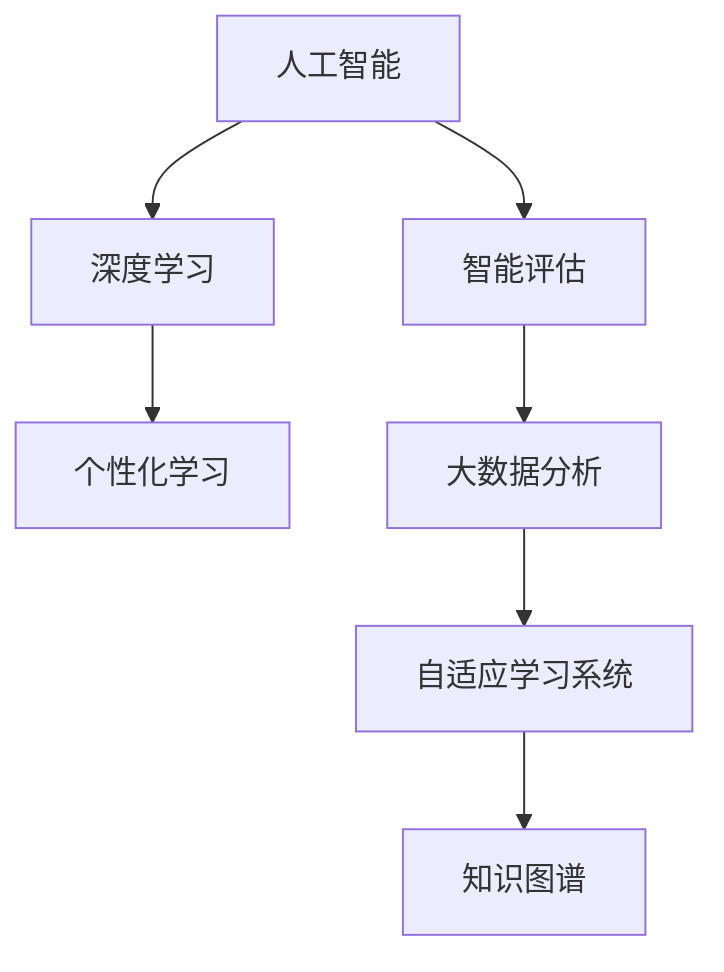

                 

# AI如何改变教育评估和个性化学习

> 关键词：人工智能,教育评估,个性化学习,大数据分析,学习模型,自适应学习系统

## 1. 背景介绍

### 1.1 问题由来
在传统教育体系中，教育评估往往依赖于教师的主观判断和标准化考试。这种评估方式存在诸多局限，如主观性大、难以全面反映学生学习状态、难以提供个性化教学支持等。随着人工智能技术的发展，特别是大数据和机器学习技术的应用，教育评估和个性化学习正在经历一场革命性的变革。

当前，教育领域正逐渐从“以教师为中心”转向“以学生为中心”，个性化学习、智能评估等需求日益强烈。而人工智能的深度学习、自然语言处理等技术，为解决这些需求提供了强大的技术支持。通过AI，教师能够更加全面、客观、高效地评估学生学习状态，为每个学生提供个性化的学习路径和资源，实现因材施教。

### 1.2 问题核心关键点
- **个性化学习**：根据每个学生的学习特点和需求，定制个性化的学习计划和资源。
- **智能评估**：基于学生的学习行为和成果，自动生成评估报告，及时反馈学习效果。
- **大数据分析**：通过收集和分析学生的学习数据，洞察学习规律，优化教学策略。
- **自适应学习系统**：根据学生的学习进度和能力，动态调整学习内容和难度，实现自适应学习。
- **知识图谱**：利用知识图谱技术，帮助学生构建知识体系，提升学习效果。

## 2. 核心概念与联系

### 2.1 核心概念概述

为更好地理解AI如何改变教育评估和个性化学习，本节将介绍几个密切相关的核心概念：

- **人工智能(AI)**：利用计算机算法，模拟人类的认知和学习过程，实现智能决策和任务执行。在教育领域，AI可以通过深度学习模型、自然语言处理技术等，进行个性化学习、智能评估等应用。

- **个性化学习**：根据每个学生的学习特点和需求，定制个性化的学习计划和资源，实现因材施教。个性化学习强调学习目标和内容的多样化，适应不同学习风格和能力的学生。

- **智能评估**：利用AI技术，自动分析和评估学生的学习行为和成果，生成客观、全面的评估报告。智能评估可以及时反馈学习效果，帮助教师和学生调整学习策略。

- **大数据分析**：通过收集和分析学生的学习数据，洞察学习规律，优化教学策略。大数据分析可以帮助教师了解学生的学习状态，制定更有效的教学方案。

- **自适应学习系统**：根据学生的学习进度和能力，动态调整学习内容和难度，实现自适应学习。自适应学习系统能够根据学生的实际情况，提供最适合的学习资源和路径。

- **知识图谱**：一种基于图的数据模型，用于描述和组织知识，帮助学生构建知识体系，提升学习效果。知识图谱可以将分散的知识进行结构化，便于学生理解和掌握。

这些核心概念之间的逻辑关系可以通过以下Mermaid流程图来展示：



这个流程图展示了这个教育评估和个性化学习框架的核心概念及其之间的关系：

1. 人工智能提供技术支持。
2. 深度学习用于个性化学习，智能评估等应用。
3. 大数据分析洞察学习规律，优化教学策略。
4. 自适应学习系统动态调整学习路径。
5. 知识图谱帮助学生构建知识体系。

这些概念共同构成了AI在教育评估和个性化学习中的应用框架，使其能够在各个环节发挥作用，提升教育效果。

## 3. 核心算法原理 & 具体操作步骤
### 3.1 算法原理概述

AI在教育评估和个性化学习中的应用，主要依赖于深度学习模型和自然语言处理技术。其中，深度学习模型通过大量标注数据进行训练，学习到学生行为与学习成果之间的复杂映射关系，从而实现智能评估和个性化学习。具体来说，深度学习模型可以分为以下几个关键步骤：

- **数据准备**：收集学生的学习数据，包括课程成绩、作业提交、课堂表现等，并标注为合适的格式。
- **模型训练**：使用深度学习模型对数据进行训练，学习到学生行为与学习成果之间的复杂关系。
- **评估预测**：将新的学生数据输入模型，进行评估和预测，生成个性化的学习计划和资源。

### 3.2 算法步骤详解

以下是基于深度学习的个性化学习和智能评估的详细步骤：

**Step 1: 数据准备**
- 收集学生的学习数据，包括课程成绩、作业提交、课堂表现等。
- 数据清洗和预处理，包括去除噪声、填充缺失值等。
- 将数据划分为训练集、验证集和测试集。

**Step 2: 模型训练**
- 选择适当的深度学习模型，如RNN、CNN、Transformer等。
- 将数据输入模型进行训练，调整模型参数，使其最小化预测误差。
- 使用验证集对模型进行调优，避免过拟合。

**Step 3: 评估预测**
- 将新的学生数据输入模型，进行评估和预测。
- 根据预测结果，生成个性化的学习计划和资源。
- 定期对模型进行更新和调优，确保其性能稳定。

### 3.3 算法优缺点

基于深度学习的教育评估和个性化学习有以下优点：
- 数据驱动：通过大量数据训练模型，可以更全面地反映学生的学习状态。
- 实时性：可以实时生成评估报告，及时反馈学习效果。
- 客观性：使用模型进行评估，避免教师主观判断的偏差。
- 自适应性：根据学生的学习进度和能力，动态调整学习路径。

同时，该方法也存在一定的局限性：
- 数据依赖：模型的效果高度依赖于标注数据的质量和数量，获取高质量数据成本较高。
- 模型复杂：深度学习模型通常参数较多，训练和推理需要较强的计算资源。
- 可解释性不足：深度学习模型通常是"黑盒"，难以解释其内部决策过程。
- 模型泛化能力有限：在特定领域或小规模数据集上，模型可能泛化能力不足。

尽管存在这些局限性，但就目前而言，深度学习在教育评估和个性化学习中的应用已经取得了显著的效果。未来相关研究的方向在于如何进一步降低对标注数据的依赖，提高模型的泛化能力和可解释性。

### 3.4 算法应用领域

基于深度学习的教育评估和个性化学习技术，在教育领域已经得到了广泛的应用，涵盖以下领域：

- **自适应学习系统**：通过分析学生的学习数据，动态调整课程内容和难度，实现个性化学习。例如，Knewton和Smart Sparrow等平台，已经广泛应用于K-12和高等教育。

- **智能评估系统**：利用深度学习模型自动评估学生的学习成果，生成客观、全面的评估报告。例如，Turnitin和Edmentum等平台，可以自动检查作业、论文等，提供详细的反馈和建议。

- **个性化学习平台**：根据学生的学习数据，生成个性化的学习资源和计划。例如，Coursera和Udacity等平台，提供个性化的课程推荐和学习路径规划。

- **学习分析系统**：分析学生的学习行为数据，洞察学习规律，优化教学策略。例如，Blackboard和Canvas等平台，提供详细的学习分析报告，帮助教师改进教学方法。

- **虚拟助教**：通过自然语言处理技术，自动回答学生的问题，提供学习支持。例如，Woebot和Rivvy等平台，已经广泛应用于学生辅导和心理支持。

此外，基于深度学习的教育评估和个性化学习技术，还在在线教育、远程教育、智能课堂等领域得到了广泛应用，为教育领域的智能化转型提供了新的技术路径。

## 4. 数学模型和公式 & 详细讲解 & 举例说明
### 4.1 数学模型构建

本节将使用数学语言对基于深度学习的个性化学习和智能评估过程进行更加严格的刻画。

记学生学习行为数据为 $D=\{(x_i, y_i)\}_{i=1}^N, x_i \in \mathbb{R}^d, y_i \in \mathbb{R}$，其中 $x_i$ 为输入特征向量，$y_i$ 为学习成果。假设深度学习模型为 $M_\theta$，其中 $\theta$ 为模型参数。

定义模型的预测函数为 $f(x) = M_\theta(x)$，目标是最小化预测误差，即：

$$
\min_{\theta} \frac{1}{N} \sum_{i=1}^N (y_i - f(x_i))^2
$$

常见的优化算法包括梯度下降、Adam、Adagrad等，可以近似求解上述最优化问题。

### 4.2 公式推导过程

以下是基于梯度下降算法的深度学习模型训练和评估的详细步骤：

1. **模型初始化**：随机初始化模型参数 $\theta$。
2. **前向传播**：将输入数据 $x_i$ 输入模型，计算预测结果 $f(x_i)$。
3. **计算损失**：计算预测结果与真实标签 $y_i$ 之间的误差，即损失函数 $L = \frac{1}{N} \sum_{i=1}^N (y_i - f(x_i))^2$。
4. **反向传播**：利用链式法则计算损失函数对模型参数 $\theta$ 的梯度 $\nabla_{\theta}L$。
5. **参数更新**：根据梯度下降算法更新模型参数 $\theta$，即 $\theta \leftarrow \theta - \eta \nabla_{\theta}L$，其中 $\eta$ 为学习率。
6. **重复迭代**：重复以上步骤，直到模型收敛或达到预设迭代轮数。

在得到模型参数 $\theta$ 后，即可使用该模型对新的学生数据进行评估和预测，生成个性化的学习计划和资源。

### 4.3 案例分析与讲解

以一个简单的深度学习模型为例，分析其评估和预测过程。

**案例背景**：某大学课程成绩预测问题，目标是预测学生的期末考试成绩。

**数据准备**：
- 收集学生的学习数据，包括平时成绩、作业成绩、课堂表现等，标注为向量形式 $x_i = (x_{i1}, x_{i2}, \cdots, x_{id})$，其中 $x_{ij}$ 为学生第 $j$ 项成绩。
- 标注学生的最终成绩 $y_i$，作为监督信号。

**模型训练**：
- 使用RNN模型对数据进行训练，设置适当的隐藏层和激活函数。
- 使用梯度下降算法对模型进行训练，调整模型参数，最小化预测误差。

**评估预测**：
- 将新的学生数据 $x_i$ 输入模型，计算预测结果 $f(x_i)$。
- 根据预测结果和真实成绩 $y_i$，计算评估指标如均方误差、MAE等。
- 生成个性化的学习计划和资源，如针对低分学生的补习资源、针对高分学生的进阶资源等。

## 5. 项目实践：代码实例和详细解释说明
### 5.1 开发环境搭建

在进行个性化学习和智能评估实践前，我们需要准备好开发环境。以下是使用Python进行TensorFlow开发的环境配置流程：

1. 安装Anaconda：从官网下载并安装Anaconda，用于创建独立的Python环境。

2. 创建并激活虚拟环境：
```bash
conda create -n tf-env python=3.8 
conda activate tf-env
```

3. 安装TensorFlow：根据CUDA版本，从官网获取对应的安装命令。例如：
```bash
conda install tensorflow -c pytorch -c conda-forge
```

4. 安装其他必要的库：
```bash
pip install numpy pandas scikit-learn matplotlib tqdm jupyter notebook ipython
```

完成上述步骤后，即可在`tf-env`环境中开始开发实践。

### 5.2 源代码详细实现

下面以一个简单的课程成绩预测模型为例，给出使用TensorFlow进行深度学习模型的PyTorch代码实现。

```python
import tensorflow as tf
from tensorflow import keras
import numpy as np

# 定义模型
model = keras.Sequential([
    keras.layers.Dense(64, activation='relu', input_shape=(5,)),
    keras.layers.Dense(1)
])

# 编译模型
model.compile(optimizer='adam', loss='mse')

# 准备数据
X_train = np.random.rand(100, 5)
y_train = np.random.rand(100, 1)
X_test = np.random.rand(20, 5)
y_test = np.random.rand(20, 1)

# 训练模型
model.fit(X_train, y_train, epochs=10, batch_size=32, validation_data=(X_test, y_test))

# 评估模型
y_pred = model.predict(X_test)
mse = np.mean((y_test - y_pred)**2)
print('Mean Squared Error:', mse)
```

### 5.3 代码解读与分析

让我们再详细解读一下关键代码的实现细节：

**模型定义**：
- `keras.Sequential`：定义一个序列模型，按顺序添加各层。
- `Dense`层：定义全连接层，输入维度为5，输出维度为64和1。

**模型编译**：
- `optimizer='adam'`：设置优化器为Adam。
- `loss='mse'`：设置损失函数为均方误差。

**数据准备**：
- `np.random.rand`：生成随机数据，模拟学生成绩数据。

**模型训练**：
- `model.fit`：使用训练集数据进行模型训练，设置10个epoch和32的batch size。
- `validation_data`：设置验证集数据，用于模型评估。

**模型评估**：
- `model.predict`：使用测试集数据进行模型预测。
- `np.mean`：计算预测结果与真实成绩之间的均方误差。

可以看到，通过TensorFlow，我们可以非常方便地实现深度学习模型的训练和评估，并生成个性化的学习资源和计划。

## 6. 实际应用场景
### 6.1 智能评估系统

基于深度学习的智能评估系统，可以为教师提供全面、客观、实时的评估报告，帮助教师及时了解学生的学习状态，优化教学策略。智能评估系统可以应用于以下场景：

- **作业和论文评估**：利用自然语言处理技术，自动检查作业和论文是否抄袭、语法错误等。例如，Turnitin平台可以对学生的作业和论文进行自动检查和评分。
- **考试自动批改**：利用深度学习模型，自动批改选择题、填空题等客观题型。例如，Edmentum平台可以自动批改数学和科学考试。
- **学习行为分析**：利用大数据分析技术，分析学生的学习行为数据，生成学习行为报告。例如，Blackboard平台可以生成详细的学习分析报告，帮助教师了解学生的学习进度和效果。

### 6.2 个性化学习平台

个性化学习平台可以根据学生的学习数据，生成个性化的学习资源和计划，帮助学生高效学习。个性化学习平台可以应用于以下场景：

- **课程推荐**：根据学生的学习历史和兴趣，推荐合适的课程和资源。例如，Coursera平台可以推荐适合学生水平的课程。
- **学习路径规划**：根据学生的学习进度和能力，动态调整学习内容和难度。例如，Smart Sparrow平台可以自动调整课程难度和顺序。
- **学习进度跟踪**：利用大数据分析技术，跟踪学生的学习进度和效果，提供学习进度报告。例如，Woebot平台可以实时跟踪学生的学习进度，提供个性化的学习建议。

### 6.3 智能助教系统

智能助教系统可以自动回答学生的问题，提供学习支持，帮助教师减轻教学负担。智能助教系统可以应用于以下场景：

- **自然语言交互**：利用自然语言处理技术，自动回答学生的问题。例如，Woebot平台可以回答学生关于数学和科学的问题。
- **学习资源推荐**：根据学生的问题，推荐相关的学习资源和视频。例如，Rivvy平台可以推荐与问题相关的视频和教材。
- **学习进度跟踪**：利用大数据分析技术，跟踪学生的学习进度和效果，提供学习进度报告。例如，Knewton平台可以实时跟踪学生的学习进度，提供个性化的学习建议。

## 7. 工具和资源推荐
### 7.1 学习资源推荐

为了帮助开发者系统掌握深度学习在教育评估和个性化学习中的应用，这里推荐一些优质的学习资源：

1. 《深度学习》课程：斯坦福大学开设的深度学习课程，有Lecture视频和配套作业，带你入门深度学习的基本概念和经典模型。

2. Coursera和Udacity平台：提供大量深度学习课程和项目实践，涵盖从基础到高级的深度学习知识。

3. TensorFlow官方文档：TensorFlow的官方文档，提供了完整的深度学习框架和使用指南，是深度学习开发的重要参考资料。

4. Keras官方文档：Keras的官方文档，提供了简单易用的API接口，适合初学者上手深度学习开发。

5. PyTorch官方文档：PyTorch的官方文档，提供了灵活的动态计算图和丰富的模型库，是深度学习开发的重要工具。

通过对这些资源的学习实践，相信你一定能够快速掌握深度学习在教育评估和个性化学习中的应用，并用于解决实际的NLP问题。

### 7.2 开发工具推荐

高效的开发离不开优秀的工具支持。以下是几款用于深度学习教育评估和个性化学习开发的常用工具：

1. TensorFlow：由Google主导开发的开源深度学习框架，生产部署方便，适合大规模工程应用。

2. Keras：Keras的API接口简单易用，适合初学者上手深度学习开发，可以在TensorFlow和PyTorch上运行。

3. PyTorch：由Facebook主导开发的开源深度学习框架，灵活的动态计算图和丰富的模型库，适合深度学习研究。

4. Weights & Biases：模型训练的实验跟踪工具，可以记录和可视化模型训练过程中的各项指标，方便对比和调优。

5. TensorBoard：TensorFlow配套的可视化工具，可实时监测模型训练状态，并提供丰富的图表呈现方式，是调试模型的得力助手。

6. Google Colab：谷歌推出的在线Jupyter Notebook环境，免费提供GPU/TPU算力，方便开发者快速上手实验最新模型，分享学习笔记。

合理利用这些工具，可以显著提升深度学习教育评估和个性化学习的开发效率，加快创新迭代的步伐。

### 7.3 相关论文推荐

深度学习在教育评估和个性化学习中的应用源于学界的持续研究。以下是几篇奠基性的相关论文，推荐阅读：

1. "A Survey of Deep Learning Techniques for Adaptive Learning"：综述了深度学习在自适应学习中的应用，包括推荐系统、自适应学习系统等。

2. "Reinforcement Learning for Personalized Education"：介绍了强化学习在个性化学习中的应用，通过奖励机制优化学习路径。

3. "Smart Sparrow: A Technology-Based Learning Analytics Platform"：介绍了Smart Sparrow平台的实现和应用，展示了个性化学习系统的效果。

4. "Intelligent Tutoring Systems in Education"：综述了智能辅导系统的研究现状和应用，探讨了AI在教育中的各种应用场景。

这些论文代表了大规模学习模型的发展脉络。通过学习这些前沿成果，可以帮助研究者把握学科前进方向，激发更多的创新灵感。

## 8. 总结：未来发展趋势与挑战

### 8.1 总结

本文对基于深度学习的教育评估和个性化学习进行了全面系统的介绍。首先阐述了深度学习在教育评估和个性化学习中的应用，明确了其提升教育效果的独特价值。其次，从原理到实践，详细讲解了深度学习的数学原理和关键步骤，给出了个性化学习和智能评估任务开发的完整代码实例。同时，本文还广泛探讨了深度学习技术在智能评估、个性化学习等各个环节的应用前景，展示了深度学习范式的巨大潜力。

通过本文的系统梳理，可以看到，基于深度学习的教育评估和个性化学习正在成为教育领域的创新引擎，极大地提升了教育效果和效率。未来，伴随深度学习技术的不断演进，教育评估和个性化学习技术必将进一步提升，为教育事业的发展注入新的活力。

### 8.2 未来发展趋势

展望未来，基于深度学习的教育评估和个性化学习技术将呈现以下几个发展趋势：

1. **自适应学习系统普及化**：自适应学习系统将在更多教育场景中得到应用，为每个学生提供定制化的学习路径和资源，实现因材施教。

2. **智能评估系统完善化**：智能评估系统将不断完善，涵盖更多类型的学习评估，如主观题、项目作品等。同时，将引入更多人工智能技术，如自然语言理解、图像识别等，提高评估的准确性和客观性。

3. **个性化学习平台多元化**：个性化学习平台将更加多元，涵盖从基础教育到高等教育、从K-12到成人教育的各个层次。同时，将引入更多学习理论和技术，如认知科学、情感计算等，提升学习效果。

4. **智能助教系统智能化**：智能助教系统将不断智能化，具备更强的自然语言理解和生成能力，提供更高效的学习支持。同时，将引入更多人工智能技术，如知识图谱、语义搜索等，提高学习资源的精准匹配能力。

5. **大数据分析深入化**：大数据分析技术将不断深入，通过分析更多的学习数据，洞察更复杂的学习规律，优化教学策略。同时，将引入更多数据科学和技术，如机器学习、深度学习等，提高分析的准确性和实用性。

6. **人机协同教育化**：教育将更加注重人机协同，将AI技术与人类教师、学生等进行有机结合，共同提升教育效果。同时，将引入更多教育理论和技术，如教育心理学、学习科学等，提高教育的科学性和有效性。

以上趋势凸显了深度学习在教育评估和个性化学习中的广阔前景。这些方向的探索发展，必将进一步提升教育技术的应用效果，为人类认知智能的进化带来深远影响。

### 8.3 面临的挑战

尽管基于深度学习的教育评估和个性化学习技术已经取得了显著的成果，但在迈向更加智能化、普适化应用的过程中，仍面临着诸多挑战：

1. **数据质量瓶颈**：深度学习模型的效果高度依赖于标注数据的质量和数量，获取高质量数据成本较高。如何进一步降低对标注数据的依赖，将是一大难题。

2. **模型复杂性**：深度学习模型通常参数较多，训练和推理需要较强的计算资源。如何在保持模型效果的同时，提高模型的可解释性和计算效率，将是重要的优化方向。

3. **模型泛化能力**：深度学习模型在不同领域和场景上的泛化能力有限，需要进一步探索模型的迁移学习和跨领域适应能力。

4. **学习动机分析**：深度学习模型难以分析学生的学习动机和情感，如何结合心理学、教育学等学科，更好地理解学生的学习行为，将是重要的研究方向。

5. **伦理和隐私问题**：深度学习模型涉及大量的学生数据，如何保障数据隐私和伦理安全，将是一大挑战。

6. **教师培训**：深度学习模型的应用需要教师具备一定的技术能力，如何通过培训和支持，提升教师的深度学习素养，将是重要的实施路径。

正视这些挑战，积极应对并寻求突破，将是大规模学习模型在教育评估和个性化学习中走向成熟的必由之路。相信随着学界和产业界的共同努力，这些挑战终将一一被克服，深度学习技术必将在教育领域发挥更大的作用。

### 8.4 研究展望

面对深度学习在教育评估和个性化学习中的挑战，未来的研究需要在以下几个方面寻求新的突破：

1. **无监督和半监督学习**：摆脱对大规模标注数据的依赖，利用无监督和半监督学习方法，最大限度利用非结构化数据，实现更加灵活高效的评估和预测。

2. **参数高效和计算高效**：开发更加参数高效和计算高效的深度学习模型，在固定大部分预训练参数的同时，只更新极少量的任务相关参数，提升模型效率。

3. **知识图谱与深度学习结合**：将知识图谱与深度学习模型结合，帮助学生构建知识体系，提升学习效果。同时，将知识图谱引入深度学习模型的训练过程，提升模型的知识表示能力。

4. **多模态学习**：结合视觉、语音、文本等多种模态数据，进行深度学习模型的训练和评估，提升模型的泛化能力和学习效果。

5. **强化学习与深度学习结合**：将强化学习与深度学习结合，通过奖励机制优化学习路径和资源推荐，提升个性化学习的效果。

6. **伦理和隐私保护**：结合法律、伦理等学科，研究如何保护学生数据隐私，保障深度学习模型的伦理和隐私安全。

这些研究方向将引领深度学习技术在教育评估和个性化学习中的应用走向成熟，为构建安全、可靠、高效的智能教育系统铺平道路。面向未来，深度学习技术还需要与其他人工智能技术进行更深入的融合，如知识表示、因果推理、强化学习等，多路径协同发力，共同推动教育技术的进步。

## 9. 附录：常见问题与解答

**Q1：深度学习在教育评估和个性化学习中是否需要大量的标注数据？**

A: 是的，深度学习模型的训练通常需要大量的标注数据，这些数据可以用于训练模型的损失函数，使得模型能够更好地拟合真实的学习效果。然而，对于实际应用中的新数据集，标注数据的需求量会大大减少，因为模型已经通过预训练学习到了通用的语言表示。

**Q2：深度学习在教育评估和个性化学习中是否需要强大的计算资源？**

A: 是的，深度学习模型的训练和推理通常需要强大的计算资源，包括GPU、TPU等高性能设备。对于大规模数据集，计算资源的需求更为显著。然而，随着硬件技术的不断进步，计算资源的成本逐渐降低，普通PC也可以满足一些深度学习任务的需求。

**Q3：深度学习在教育评估和个性化学习中是否能够提供个性化的学习路径？**

A: 是的，深度学习模型可以根据学生的学习数据，生成个性化的学习路径和资源。通过分析学生的学习历史和当前表现，模型可以动态调整学习内容和难度，帮助学生高效学习。然而，模型的效果取决于数据的质量和量，以及模型的设计和调参。

**Q4：深度学习在教育评估和个性化学习中是否需要考虑学生的学习动机和情感？**

A: 是的，深度学习模型需要考虑学生的学习动机和情感，这些因素可以影响学生的学习效果和心理状态。通过结合心理学、教育学等学科，深度学习模型可以更好地理解学生的学习行为，提供更具针对性的学习支持。

**Q5：深度学习在教育评估和个性化学习中是否会面临伦理和隐私问题？**

A: 是的，深度学习模型涉及大量的学生数据，如何保障数据隐私和伦理安全是一大挑战。需要在数据收集、存储、使用等各个环节，采取严格的隐私保护措施，同时结合伦理和法律规范，确保模型的应用符合伦理要求。

这些常见问题的解答，展示了深度学习在教育评估和个性化学习中的实际应用场景和潜在挑战。通过不断探索和解决这些问题，深度学习技术必将在教育领域发挥更大的作用。

