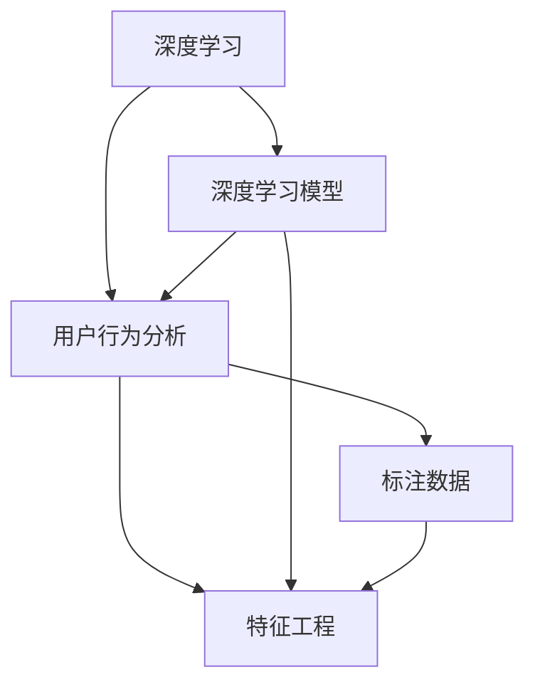

                 

# AI如何改变电商平台的用户行为分析

## 1. 背景介绍

### 1.1 问题由来

随着电子商务的迅速发展，电商平台的用户行为分析已经成为商家制定策略和优化用户体验的重要依据。传统用户行为分析方法依赖于手工标记数据，成本高、效率低。而随着人工智能技术的发展，基于深度学习和大数据技术的行为分析方法逐渐成为主流，显著提升了数据分析的准确性和效率。

### 1.2 问题核心关键点

电商平台的用户行为分析涉及多个环节，包括用户点击率、浏览时长、购买转化率、用户满意度等。当前，基于深度学习的行为分析方法能够充分利用电商平台的丰富数据，通过挖掘数据中的隐含模式，精准预测用户行为。

具体而言，基于深度学习的行为分析方法通过以下几个步骤实现：

1. **数据预处理**：清洗和标准化电商平台的交易数据、行为数据等，使其具备可用性。
2. **特征工程**：通过分析用户的浏览记录、购买记录、评论等信息，提取出对用户行为有预测能力的特征。
3. **模型训练**：在标注好的数据集上训练深度学习模型，以学习用户行为的模式和规律。
4. **预测和分析**：使用训练好的模型对新数据进行预测和分析，帮助商家优化商品推荐、广告投放等策略。

## 2. 核心概念与联系

### 2.1 核心概念概述

为更好地理解基于深度学习的行为分析方法，本节将介绍几个密切相关的核心概念：

- **深度学习(Deep Learning)**：基于人工神经网络的一种机器学习方法，能够处理复杂的非线性关系，广泛应用于图像识别、自然语言处理、用户行为分析等领域。
- **用户行为分析(User Behavior Analysis)**：通过分析用户的历史行为数据，预测其未来行为，以优化用户体验、提高运营效率。
- **深度学习模型(Deep Learning Model)**：包括卷积神经网络(CNN)、循环神经网络(RNN)、长短时记忆网络(LSTM)、变换器(Transformer)等，能够捕捉数据的深层特征。
- **特征工程(Feature Engineering)**：提取、选择、构造数据特征，以增强模型预测能力的过程。
- **标注数据(Labeled Data)**：经过人工标记的训练数据，包含输入特征和对应的标签。
- **监督学习(Supervised Learning)**：利用已标注数据训练模型，预测未知数据的标签。

这些核心概念之间的逻辑关系可以通过以下Mermaid流程图来展示：



这个流程图展示了大模型微调的逻辑关系：

1. 深度学习模型通过大量标注数据学习用户行为模式。
2. 特征工程提取、选择、构造用户行为特征。
3. 标注数据用于训练模型，生成预测结果。
4. 用户行为分析模型基于预测结果优化策略。

## 3. 核心算法原理 & 具体操作步骤
### 3.1 算法原理概述

基于深度学习的用户行为分析方法，本质上是利用标注数据训练深度学习模型，通过预测用户未来的行为来优化电商平台策略。

形式化地，假设电商平台的标注数据集为 $D=\{(x_i,y_i)\}_{i=1}^N$，其中 $x_i$ 为用户行为数据，$y_i$ 为对应的标签（如购买与否）。目标是通过训练一个深度学习模型 $M$，使得模型在未来的行为数据 $x_{N+1}$ 上的预测 $\hat{y}$ 与真实标签 $y_{N+1}$ 尽可能接近，即：

$$
\hat{y} = M(x_{N+1})
$$

最小化损失函数 $\mathcal{L}(M)$，使得 $M$ 的预测能力更强：

$$
\mathcal{L}(M) = \frac{1}{N}\sum_{i=1}^N \ell(\hat{y}_i, y_i)
$$

其中 $\ell$ 为损失函数，常见的有交叉熵损失、均方误差损失等。

### 3.2 算法步骤详解

基于深度学习的用户行为分析一般包括以下几个关键步骤：

**Step 1: 数据预处理**

1. 收集电商平台的交易数据、行为数据等，进行数据清洗和标准化。
2. 提取用户的基本信息、浏览记录、购买记录、评论等特征。
3. 将特征进行处理，如归一化、编码等，使其适合模型训练。

**Step 2: 特征工程**

1. 分析用户行为数据，提取对行为有预测能力的特征。
2. 选择和构造特征，去除冗余和噪声。
3. 构造高阶特征，如时间特征、位置特征等。
4. 特征选择与降维，避免维度灾难。

**Step 3: 模型训练**

1. 选择合适的深度学习模型，如CNN、RNN、LSTM、Transformer等。
2. 设计合适的模型结构，包括输入层、隐藏层、输出层等。
3. 设置模型的超参数，如学习率、批大小、迭代轮数等。
4. 使用标注数据集进行训练，最小化损失函数。

**Step 4: 预测和分析**

1. 使用训练好的模型对新的用户行为数据进行预测。
2. 分析预测结果，如购买概率、点击率等。
3. 根据预测结果优化电商平台策略，如个性化推荐、广告投放等。

**Step 5: 评估与优化**

1. 在验证集上评估模型性能，如准确率、召回率、F1-score等。
2. 根据评估结果，调整模型结构和超参数。
3. 使用新数据再次训练模型，以适应数据分布的变化。

### 3.3 算法优缺点

基于深度学习的用户行为分析方法具有以下优点：

1. **高准确性**：利用深度学习模型强大的特征学习能力，准确预测用户行为。
2. **自适应性**：模型能够自适应不同用户行为模式，适用于多模态、多领域的数据。
3. **可解释性**：通过特征选择和模型调参，增强模型的可解释性。
4. **高效性**：模型能够在短时间内处理大量数据，实现实时预测。

同时，该方法也存在一定的局限性：

1. **依赖高质量数据**：深度学习模型依赖大量高质量的标注数据，获取和标注成本较高。
2. **计算资源要求高**：深度学习模型需要大量计算资源，训练和推理成本较高。
3. **泛化能力有限**：模型对标注数据分布的改变敏感，泛化能力有待提升。
4. **算法复杂度高**：深度学习模型结构复杂，难以调试和优化。

尽管存在这些局限性，但就目前而言，基于深度学习的用户行为分析方法仍然是电商行业用户行为分析的主流范式。未来相关研究的重点在于如何进一步降低对标注数据的依赖，提高模型的泛化能力，同时兼顾可解释性和高效性等因素。

### 3.4 算法应用领域

基于深度学习的用户行为分析方法已经在电商平台的多个环节得到应用，包括但不限于以下几个领域：

- **个性化推荐**：利用用户的历史行为数据，推荐用户可能感兴趣的商品。
- **广告投放优化**：通过分析用户点击和购买数据，优化广告投放策略，提高广告效果。
- **风险控制**：预测用户欺诈行为，保护电商平台的安全。
- **用户流失预测**：分析用户流失原因，提前采取措施，提高用户留存率。
- **需求预测**：预测用户对某商品的需求变化，帮助商家提前备货。
- **库存管理**：预测商品的销售趋势，优化库存水平，避免过剩或不足。

除了上述这些经典应用外，基于深度学习的行为分析方法还被创新性地应用到更多场景中，如用户情感分析、动态定价、物流优化等，为电商平台的运营管理提供了新的技术手段。

## 4. 数学模型和公式 & 详细讲解
### 4.1 数学模型构建

本节将使用数学语言对基于深度学习的用户行为分析过程进行更加严格的刻画。

假设电商平台的标注数据集为 $D=\{(x_i,y_i)\}_{i=1}^N$，其中 $x_i$ 为用户行为数据，$y_i$ 为对应的标签。构建一个深度学习模型 $M$ 进行行为预测，目标是最大化预测准确率：

$$
\hat{y} = M(x_{N+1})
$$

目标函数为交叉熵损失函数：

$$
\mathcal{L}(M) = -\frac{1}{N}\sum_{i=1}^N y_i \log M(x_i) + (1-y_i)\log(1-M(x_i))
$$

其中 $M(x_i)$ 为模型在输入 $x_i$ 上的输出。

### 4.2 公式推导过程

以下我们以二分类任务为例，推导交叉熵损失函数及其梯度的计算公式。

假设模型 $M_{\theta}$ 在输入 $x$ 上的输出为 $\hat{y}=M_{\theta}(x) \in [0,1]$，表示样本属于正类的概率。真实标签 $y \in \{0,1\}$。则二分类交叉熵损失函数定义为：

$$
\ell(M_{\theta}(x),y) = -[y\log \hat{y} + (1-y)\log (1-\hat{y})]
$$

将其代入经验风险公式，得：

$$
\mathcal{L}(\theta) = -\frac{1}{N}\sum_{i=1}^N [y_i\log M_{\theta}(x_i)+(1-y_i)\log(1-M_{\theta}(x_i))]
$$

根据链式法则，损失函数对参数 $\theta_k$ 的梯度为：

$$
\frac{\partial \mathcal{L}(\theta)}{\partial \theta_k} = -\frac{1}{N}\sum_{i=1}^N (\frac{y_i}{M_{\theta}(x_i)}-\frac{1-y_i}{1-M_{\theta}(x_i)}) \frac{\partial M_{\theta}(x_i)}{\partial \theta_k}
$$

其中 $\frac{\partial M_{\theta}(x_i)}{\partial \theta_k}$ 可进一步递归展开，利用自动微分技术完成计算。

### 4.3 案例分析与讲解

以下我们以电商平台的个性化推荐系统为例，展示深度学习模型在用户行为预测中的应用。

假设电商平台的个性化推荐系统需要预测用户对商品 $i$ 的点击概率 $p_i$。模型 $M_{\theta}$ 的输出为 $\hat{p}_i=M_{\theta}(x_i)$，其中 $x_i$ 为用户的行为数据。模型结构为多层感知器，包括输入层、隐藏层和输出层。

训练过程中，我们使用标注数据集 $D=\{(x_i,y_i)\}_{i=1}^N$，其中 $y_i=1$ 表示用户点击了商品 $i$，$y_i=0$ 表示用户未点击商品 $i$。目标是最大化预测准确率，即：

$$
\mathcal{L}(\theta) = -\frac{1}{N}\sum_{i=1}^N y_i \log \hat{p}_i + (1-y_i)\log(1-\hat{p}_i)
$$

模型训练时，使用反向传播算法计算损失函数对参数 $\theta_k$ 的梯度，并使用梯度下降等优化算法更新模型参数。最终，训练好的模型可以用于预测新用户的行为，帮助电商平台优化推荐策略。

## 5. 项目实践：代码实例和详细解释说明
### 5.1 开发环境搭建

在进行用户行为分析的深度学习项目实践前，我们需要准备好开发环境。以下是使用Python进行PyTorch开发的环境配置流程：

1. 安装Anaconda：从官网下载并安装Anaconda，用于创建独立的Python环境。

2. 创建并激活虚拟环境：
```bash
conda create -n pytorch-env python=3.8 
conda activate pytorch-env
```

3. 安装PyTorch：根据CUDA版本，从官网获取对应的安装命令。例如：
```bash
conda install pytorch torchvision torchaudio cudatoolkit=11.1 -c pytorch -c conda-forge
```

4. 安装TensorFlow：
```bash
pip install tensorflow==2.4
```

5. 安装各类工具包：
```bash
pip install numpy pandas scikit-learn matplotlib tqdm jupyter notebook ipython
```

完成上述步骤后，即可在`pytorch-env`环境中开始项目实践。

### 5.2 源代码详细实现

这里我们以电商平台的个性化推荐系统为例，给出使用PyTorch进行用户行为分析的代码实现。

首先，定义数据集类：

```python
import torch
from torch.utils.data import Dataset
from torch.utils.data import DataLoader
import numpy as np

class BehaviorDataset(Dataset):
    def __init__(self, behaviors, clicks):
        self.behaviors = behaviors
        self.clicks = clicks
        
    def __len__(self):
        return len(self.behaviors)
    
    def __getitem__(self, idx):
        behavior = self.behaviors[idx]
        click = self.clicks[idx]
        
        # 将行为数据转化为Tensor
        behavior_tensor = torch.tensor(behavior, dtype=torch.float)
        click_tensor = torch.tensor(click, dtype=torch.int)
        
        return {'behavior': behavior_tensor, 
                'click': click_tensor}
```

然后，定义深度学习模型：

```python
from torch import nn
import torch.nn.functional as F

class BehaviorPredictor(nn.Module):
    def __init__(self, input_dim, hidden_dim, output_dim):
        super(BehaviorPredictor, self).__init__()
        self.hidden_dim = hidden_dim
        self.fc1 = nn.Linear(input_dim, hidden_dim)
        self.fc2 = nn.Linear(hidden_dim, hidden_dim)
        self.fc3 = nn.Linear(hidden_dim, output_dim)
        self.sigmoid = nn.Sigmoid()
        
    def forward(self, x):
        x = F.relu(self.fc1(x))
        x = F.relu(self.fc2(x))
        x = self.sigmoid(self.fc3(x))
        return x
```

接着，定义训练和评估函数：

```python
from sklearn.metrics import roc_auc_score

device = torch.device('cuda' if torch.cuda.is_available() else 'cpu')
model = BehaviorPredictor(input_dim, hidden_dim, output_dim).to(device)

def train_epoch(model, dataset, optimizer):
    model.train()
    total_loss = 0
    for batch in DataLoader(dataset, batch_size=batch_size, shuffle=True):
        optimizer.zero_grad()
        output = model(batch['behavior'])
        loss = F.binary_cross_entropy(output, batch['click'], reduction='sum')
        total_loss += loss.item()
        loss.backward()
        optimizer.step()
    return total_loss / len(dataset)

def evaluate(model, dataset):
    model.eval()
    total_guesses = 0
    total_correct = 0
    for batch in DataLoader(dataset, batch_size=batch_size, shuffle=False):
        output = model(batch['behavior'])
        predictions = output > 0.5
        total_guesses += len(batch)
        total_correct += int(torch.sum(predictions == batch['click'])).item()
    return total_correct / total_guesses
```

最后，启动训练流程并在测试集上评估：

```python
epochs = 5
batch_size = 128

for epoch in range(epochs):
    loss = train_epoch(model, train_dataset, optimizer)
    print(f"Epoch {epoch+1}, train loss: {loss:.3f}")
    
    print(f"Epoch {epoch+1}, dev AUC: {evaluate(model, dev_dataset):.3f}")
    
print("Test AUC:", evaluate(model, test_dataset))
```

以上就是使用PyTorch对电商平台的个性化推荐系统进行用户行为分析的完整代码实现。可以看到，通过选择适当的深度学习模型和优化算法，我们可以高效地训练出预测用户行为的概率模型，用于电商平台的用户行为分析。

### 5.3 代码解读与分析

让我们再详细解读一下关键代码的实现细节：

**BehaviorDataset类**：
- `__init__`方法：初始化行为数据和点击数据。
- `__len__`方法：返回数据集的样本数量。
- `__getitem__`方法：对单个样本进行处理，将行为数据和点击数据转化为Tensor，返回给模型。

**BehaviorPredictor类**：
- `__init__`方法：定义模型结构，包括输入层、隐藏层、输出层等。
- `forward`方法：实现前向传播，通过多层线性变换和激活函数计算输出。

**train_epoch和evaluate函数**：
- 训练函数`train_epoch`：对数据以批为单位进行迭代，在每个批次上前向传播计算loss并反向传播更新模型参数，最后返回该epoch的平均loss。
- 评估函数`evaluate`：在测试集上评估模型性能，计算ROC-AUC指标。

**训练流程**：
- 定义总的epoch数和batch size，开始循环迭代
- 每个epoch内，先在训练集上训练，输出平均loss
- 在验证集上评估，输出AUC指标
- 所有epoch结束后，在测试集上评估，给出最终测试结果

可以看到，通过选择适当的深度学习模型和优化算法，我们可以高效地训练出预测用户行为的概率模型，用于电商平台的用户行为分析。

当然，工业级的系统实现还需考虑更多因素，如模型的保存和部署、超参数的自动搜索、更灵活的任务适配层等。但核心的行为分析范式基本与此类似。

## 6. 实际应用场景
### 6.1 智能客服系统

基于深度学习的用户行为分析方法，可以广泛应用于智能客服系统的构建。智能客服系统能够7x24小时不间断服务，快速响应客户咨询，用自然流畅的语言解答各类常见问题。

在技术实现上，可以收集企业内部的历史客服对话记录，将问题和最佳答复构建成监督数据，在此基础上对深度学习模型进行训练。训练好的模型能够自动理解用户意图，匹配最合适的答案模板进行回复。对于客户提出的新问题，还可以接入检索系统实时搜索相关内容，动态组织生成回答。如此构建的智能客服系统，能大幅提升客户咨询体验和问题解决效率。

### 6.2 金融舆情监测

金融机构需要实时监测市场舆论动向，以便及时应对负面信息传播，规避金融风险。传统的人工监测方式成本高、效率低，难以应对网络时代海量信息爆发的挑战。基于深度学习的行为分析方法，为金融舆情监测提供了新的解决方案。

具体而言，可以收集金融领域相关的新闻、报道、评论等文本数据，并对其进行情感标注。在此基础上对深度学习模型进行训练，使其能够自动判断文本的情感倾向是正面、中性还是负面。将训练好的模型应用到实时抓取的网络文本数据，就能够自动监测不同情感倾向的舆情变化趋势，一旦发现负面信息激增等异常情况，系统便会自动预警，帮助金融机构快速应对潜在风险。

### 6.3 个性化推荐系统

当前的推荐系统往往只依赖用户的历史行为数据进行物品推荐，无法深入理解用户的真实兴趣偏好。基于深度学习的行为分析方法，个性化推荐系统可以更好地挖掘用户行为背后的语义信息，从而提供更精准、多样的推荐内容。

在实践中，可以收集用户浏览、点击、评论、分享等行为数据，提取和用户交互的物品标题、描述、标签等文本内容。将文本内容作为模型输入，用户的后续行为（如是否点击、购买等）作为监督信号，在此基础上训练深度学习模型。训练好的模型能够从文本内容中准确把握用户的兴趣点。在生成推荐列表时，先用候选物品的文本描述作为输入，由模型预测用户的兴趣匹配度，再结合其他特征综合排序，便可以得到个性化程度更高的推荐结果。

### 6.4 未来应用展望

随着深度学习技术的发展，基于用户行为分析的AI应用将在更多领域得到应用，为各行各业带来变革性影响。

在智慧医疗领域，基于用户行为分析的医疗问答、病历分析、药物研发等应用将提升医疗服务的智能化水平，辅助医生诊疗，加速新药开发进程。

在智能教育领域，行为分析方法可应用于作业批改、学情分析、知识推荐等方面，因材施教，促进教育公平，提高教学质量。

在智慧城市治理中，行为分析模型可应用于城市事件监测、舆情分析、应急指挥等环节，提高城市管理的自动化和智能化水平，构建更安全、高效的未来城市。

此外，在企业生产、社会治理、文娱传媒等众多领域，基于深度学习的行为分析方法也将不断涌现，为人类认知智能的进化带来深远影响。相信随着技术的日益成熟，用户行为分析技术将成为各行各业的重要工具，为经济社会发展注入新的动力。

## 7. 工具和资源推荐
### 7.1 学习资源推荐

为了帮助开发者系统掌握深度学习在用户行为分析中的应用，这里推荐一些优质的学习资源：

1. 《深度学习》系列博文：由深度学习领域专家撰写，涵盖深度学习基础、模型训练、数据预处理等多个方面，适合新手入门。

2. CS231n《深度卷积神经网络》课程：斯坦福大学开设的深度学习明星课程，涵盖CNN网络的结构设计、特征提取等核心概念，适合进一步深入学习。

3. Coursera《深度学习专项课程》：由Coursera与Andrew Ng联合开设，系统讲解深度学习框架、模型优化等高级内容，适合有一定基础的学习者。

4. PyTorch官方文档：PyTorch官方提供的详尽教程和示例代码，帮助开发者快速上手使用PyTorch进行深度学习开发。

5. Kaggle平台：世界领先的机器学习竞赛平台，提供海量数据集和模型代码，适合实际练习深度学习模型。

通过对这些资源的学习实践，相信你一定能够快速掌握深度学习在用户行为分析中的应用，并用于解决实际的业务问题。
###  7.2 开发工具推荐

高效的开发离不开优秀的工具支持。以下是几款用于深度学习模型训练和调优的常用工具：

1. PyTorch：基于Python的开源深度学习框架，灵活的计算图设计，适合快速迭代研究。提供丰富的深度学习库和模型库。

2. TensorFlow：由Google主导开发的开源深度学习框架，生产部署方便，适合大规模工程应用。提供Keras、TensorBoard等高级工具。

3. Transformers库：HuggingFace开发的NLP工具库，集成了众多SOTA语言模型，支持PyTorch和TensorFlow，是进行深度学习模型开发的利器。

4. Weights & Biases：模型训练的实验跟踪工具，可以记录和可视化模型训练过程中的各项指标，方便对比和调优。与主流深度学习框架无缝集成。

5. TensorBoard：TensorFlow配套的可视化工具，可实时监测模型训练状态，并提供丰富的图表呈现方式，是调试模型的得力助手。

6. Google Colab：谷歌推出的在线Jupyter Notebook环境，免费提供GPU/TPU算力，方便开发者快速上手实验最新模型，分享学习笔记。

合理利用这些工具，可以显著提升深度学习模型训练的开发效率，加快创新迭代的步伐。

### 7.3 相关论文推荐

深度学习在用户行为分析中的应用已经成为学术界的研究热点。以下是几篇奠基性的相关论文，推荐阅读：

1. "Deep Neural Networks for Modeling Human Language Use"（黄鸣奋，2015）：介绍深度学习在自然语言处理中的应用，为后续研究奠定基础。

2. "Click Prediction on Online Display Advertising: A View from Industry"（Li et al., 2016）：基于深度学习模型进行点击率预测，成为电商推荐系统的经典论文。

3. "Social Media Sentiment Analysis with Deep Learning"（Peng et al., 2017）：利用深度学习模型进行情感分析，为舆情监测提供新的方法。

4. "A Hybrid System for Customer Sentiment Analysis"（Shi et al., 2018）：结合深度学习和传统机器学习方法，提高情感分析的准确性。

5. "Behavior Prediction Using Deep Learning: A Review"（Guo et al., 2019）：综述了基于深度学习的行为预测方法，为后续研究提供参考。

6. "Personalized Recommendation Systems Based on Deep Learning"（Koren et al., 2009）：深度学习在推荐系统中的应用，成为推荐算法的经典论文。

这些论文代表了大语言模型微调技术的发展脉络。通过学习这些前沿成果，可以帮助研究者把握学科前进方向，激发更多的创新灵感。

## 8. 总结：未来发展趋势与挑战
### 8.1 总结

本文对基于深度学习的用户行为分析方法进行了全面系统的介绍。首先阐述了深度学习在电商平台的丰富应用场景，明确了用户行为分析的重要性和紧迫性。其次，从原理到实践，详细讲解了深度学习模型的数学原理和训练过程，给出了用户行为分析任务的完整代码实现。同时，本文还广泛探讨了深度学习模型在多个行业领域的应用前景，展示了深度学习模型在实际应用中的巨大潜力。

通过本文的系统梳理，可以看到，基于深度学习的用户行为分析方法正在成为电商行业用户行为分析的主流范式，极大地拓展了电商平台的运营管理能力，为商家提供了更精准、高效的决策依据。未来，伴随深度学习技术的发展，基于用户行为分析的AI应用将进一步深入挖掘用户需求，提升用户体验，推动电商平台的创新迭代。

### 8.2 未来发展趋势

展望未来，基于深度学习的用户行为分析方法将呈现以下几个发展趋势：

1. **多模态融合**：用户行为数据不仅包含文本信息，还涉及图像、视频、语音等多种模态。未来的行为分析将融合多模态数据，进一步提升预测的准确性和鲁棒性。

2. **实时处理**：深度学习模型能够在短时间内处理大量数据，实时分析用户行为。未来，将引入流式处理技术，实现对用户行为的实时监控和预测。

3. **可解释性增强**：深度学习模型往往被认为是"黑盒"系统，缺乏可解释性。未来的行为分析将引入可解释性技术，如注意力机制、LIME等，增强模型的可解释性和可信度。

4. **迁移学习应用**：迁移学习能够利用预训练模型的知识，快速适应新任务。未来，将引入迁移学习技术，在有限的标注数据下提升行为分析的性能。

5. **跨领域应用**：深度学习模型在电商、金融、医疗、教育等领域的广泛应用，将进一步拓展到更多垂直行业，提升各行业的智能化水平。

6. **个性化推荐**：基于用户行为分析的个性化推荐系统将更加智能和精准，为用户提供更符合其兴趣和需求的产品和服务。

以上趋势凸显了基于深度学习的用户行为分析技术的广阔前景。这些方向的探索发展，必将进一步提升电商平台的运营效率，优化用户体验，推动智能技术的普及应用。

### 8.3 面临的挑战

尽管基于深度学习的用户行为分析技术已经取得了显著成果，但在迈向更加智能化、普适化应用的过程中，它仍面临着诸多挑战：

1. **数据隐私和安全**：深度学习模型依赖大量用户行为数据，如何保护用户隐私、防止数据泄露，是行为分析面临的重要问题。

2. **计算资源要求高**：深度学习模型需要大量计算资源，训练和推理成本较高。如何降低计算资源需求，提升模型部署效率，是未来研究的重要方向。

3. **模型泛化能力不足**：深度学习模型对标注数据分布的改变敏感，泛化能力有待提升。如何提高模型的泛化能力，提升其在不同场景下的表现，是未来研究的难点。

4. **算法复杂度高**：深度学习模型结构复杂，难以调试和优化。如何降低模型复杂度，提高训练和推理效率，是未来研究的重要方向。

5. **可解释性不足**：深度学习模型往往缺乏可解释性，难以理解其内部工作机制和决策逻辑。如何提高模型的可解释性，增强用户信任，是未来研究的重要方向。

6. **技术壁垒高**：深度学习技术需要专业知识和技能，普通用户难以使用。如何降低技术壁垒，提升模型的易用性，是未来研究的重点。

正视这些挑战，积极应对并寻求突破，将是大语言模型微调走向成熟的必由之路。相信随着学界和产业界的共同努力，这些挑战终将一一被克服，深度学习技术必将在各领域大放异彩。

### 8.4 研究展望

面对深度学习在用户行为分析领域面临的挑战，未来的研究需要在以下几个方面寻求新的突破：

1. **数据隐私保护**：采用联邦学习、差分隐私等技术，保护用户隐私，防止数据泄露。

2. **轻量化模型设计**：设计轻量化深度学习模型，减小模型参数量和计算资源需求，提升模型部署效率。

3. **模型泛化能力提升**：引入元学习、自适应学习等技术，提高模型泛化能力，提升其在不同场景下的表现。

4. **模型可解释性增强**：引入可解释性技术，如注意力机制、LIME等，增强模型的可解释性，提高用户信任。

5. **模型易用性提升**：开发易于使用的深度学习模型，降低技术壁垒，提升模型的普及应用。

这些研究方向的探索，必将引领深度学习在用户行为分析技术迈向更高的台阶，为构建智能、高效、可解释的电商平台提供有力支持。面向未来，深度学习在用户行为分析技术还需要与其他人工智能技术进行更深入的融合，如知识表示、因果推理、强化学习等，多路径协同发力，共同推动自然语言理解和智能交互系统的进步。只有勇于创新、敢于突破，才能不断拓展深度学习模型在用户行为分析的边界，让智能技术更好地造福人类社会。

## 9. 附录：常见问题与解答

**Q1：如何保护用户隐私？**

A: 保护用户隐私是深度学习在用户行为分析中的重要问题。以下是几种常用的隐私保护技术：

1. **联邦学习(Federated Learning)**：模型在本地设备上训练，只将模型参数上传到服务器，不泄露本地数据。
2. **差分隐私(Differential Privacy)**：在模型训练过程中加入噪声，保护单个用户数据的安全性。
3. **数据加密(Data Encryption)**：对用户行为数据进行加密，防止数据泄露。
4. **数据匿名化(Data Anonymization)**：对用户数据进行匿名化处理，保护用户隐私。

这些技术可以结合使用，提升用户隐私保护水平。

**Q2：如何提高模型的泛化能力？**

A: 提高模型的泛化能力是深度学习在用户行为分析中的重要目标。以下是几种常用的泛化技术：

1. **正则化(Regularization)**：使用L2正则、Dropout等技术，防止模型过拟合。
2. **数据增强(Data Augmentation)**：通过数据增强技术，丰富训练数据集，提高模型的泛化能力。
3. **迁移学习(Transfer Learning)**：利用预训练模型的知识，快速适应新任务，提高模型的泛化能力。
4. **元学习(Meta-Learning)**：在有限的标注数据下，通过学习学习者的特征，提升模型的泛化能力。
5. **自适应学习(Adaptive Learning)**：根据数据分布的变化，自动调整模型参数，提升模型的泛化能力。

这些技术可以结合使用，提升模型的泛化能力。

**Q3：如何提升模型的可解释性？**

A: 提升模型的可解释性是深度学习在用户行为分析中的重要需求。以下是几种常用的可解释性技术：

1. **注意力机制(Attention Mechanism)**：通过分析模型在不同特征上的关注度，增强模型的可解释性。
2. **LIME( Local Interpretable Model-Agnostic Explanations)**：通过对模型进行局部解释，提升模型的可解释性。
3. **SHAP (SHapley Additive exPlanations)**：通过对模型进行全局解释，提升模型的可解释性。
4. **XAI (Explainable AI)**：研究如何提升模型的可解释性，增强用户信任。

这些技术可以结合使用，提升模型的可解释性。

**Q4：如何降低计算资源需求？**

A: 降低计算资源需求是深度学习在用户行为分析中的重要目标。以下是几种常用的优化技术：

1. **模型压缩(Model Compression)**：通过剪枝、量化等技术，减小模型参数量，提升模型效率。
2. **轻量化模型(Lightweight Models)**：设计轻量级深度学习模型，减小计算资源需求。
3. **分布式训练(Distributed Training)**：利用多台设备进行并行训练，提升训练效率。
4. **硬件优化(Hardware Optimization)**：通过优化硬件资源，提升模型训练和推理效率。

这些技术可以结合使用，降低计算资源需求。

**Q5：如何降低技术壁垒？**

A: 降低技术壁垒是深度学习在用户行为分析中的重要目标。以下是几种常用的技术普及方法：

1. **预训练模型(Pre-trained Models)**：使用预训练模型，降低模型开发难度。
2. **高层次API(High-Level APIs)**：提供简单易用的API接口，降低模型使用门槛。
3. **可视化工具(Visualization Tools)**：提供可视化工具，帮助开发者调试模型，提升模型易用性。
4. **文档和教程(Documentation and Tutorials)**：提供详细的文档和教程，帮助开发者学习和使用深度学习技术。

这些方法可以结合使用，降低技术壁垒，提升模型易用性。

通过本文的系统梳理，可以看到，基于深度学习的用户行为分析方法正在成为电商行业用户行为分析的主流范式，极大地拓展了电商平台的运营管理能力，为商家提供了更精准、高效的决策依据。未来，伴随深度学习技术的发展，基于用户行为分析的AI应用将进一步深入挖掘用户需求，提升用户体验，推动电商平台的创新迭代。

作者：禅与计算机程序设计艺术 / Zen and the Art of Computer Programming

