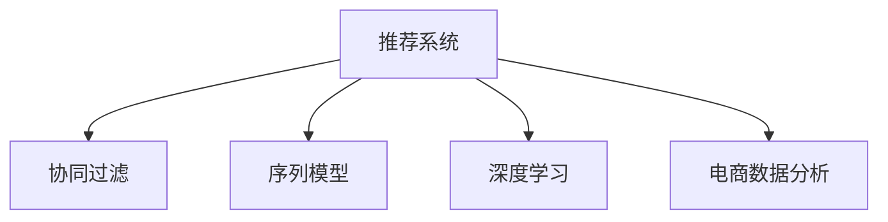

                 

# AI如何改善电商平台的跨类目交叉销售

> 关键词：
1. 推荐系统
2. 跨类目销售
3. 协同过滤
4. 序列模型
5. 深度学习
6. 电商数据分析
7. 用户行为预测

## 1. 背景介绍

### 1.1 问题由来
在当前电商平台上，随着用户需求的日益多元化，传统的基于类别或标签的推荐方式逐渐无法满足用户的需求。用户不仅需要同一品类的商品推荐，更希望能够发现不同品类之间的关联商品，以增加消费多样性和购物体验。因此，电商平台的跨类目交叉销售成为一种有效提升用户满意度和增加销售额的手段。

然而，由于跨类目推荐涉及大量数据处理和模型优化，且需要在不同品类间建立关联关系，这一过程面临诸多挑战。如何高效、准确地进行跨类目推荐，成为电商平台亟待解决的问题。

### 1.2 问题核心关键点
为了解决跨类目推荐问题，AI技术在电商平台中的应用变得尤为重要。关键点包括：
1. **推荐算法**：需要构建能够跨品类预测用户行为，推荐相关商品的推荐算法。
2. **数据处理**：需要处理不同品类的海量数据，提取有用的用户行为特征。
3. **模型优化**：需要优化模型以提高推荐准确性和实时性。
4. **用户反馈**：需要收集用户对推荐结果的反馈，不断优化算法。

## 2. 核心概念与联系

### 2.1 核心概念概述

为更好地理解如何利用AI改善电商平台的跨类目交叉销售，本节将介绍几个密切相关的核心概念：

- **推荐系统(Recommender System)**：基于用户历史行为或偏好，预测用户对商品感兴趣的概率，并推荐相关商品的系统。推荐系统是电商平台提高用户满意度和销售额的重要手段。

- **协同过滤(Collaborative Filtering)**：通过分析用户之间的相似性，推测用户未购买但可能感兴趣的商品。协同过滤是推荐系统中最基础、最有效的推荐方法之一。

- **序列模型(Sequential Modeling)**：关注用户行为序列，通过分析行为序列中的时间依赖关系，预测用户未来的行为。序列模型可以更好地捕捉用户连续的行为模式，提高推荐精度。

- **深度学习(Deep Learning)**：一种通过多层神经网络进行复杂模式学习的技术，尤其在处理大规模数据和建立复杂模型方面具有优势。深度学习在推荐系统中被广泛应用于特征提取和模型优化。

- **电商数据分析(E-commerce Analytics)**：分析电商平台上的交易数据、用户行为数据等，提取有价值的信息，为推荐系统提供数据支持。

这些核心概念之间的逻辑关系可以通过以下Mermaid流程图来展示：



这个流程图展示出推荐系统的核心组成及其关联：

1. **协同过滤**：利用用户行为数据进行用户间相似性计算，预测未购买商品。
2. **序列模型**：关注用户行为序列，捕捉时间依赖关系，优化推荐结果。
3. **深度学习**：通过多层神经网络提取高维特征，优化推荐算法。
4. **电商数据分析**：提供数据基础，支持推荐系统的有效运行。

这些概念共同构成了电商平台推荐系统的工作原理和优化方向。通过理解这些核心概念，我们可以更好地把握AI在推荐系统中的应用。

## 3. 核心算法原理 & 具体操作步骤
### 3.1 算法原理概述

基于AI的电商跨类目交叉销售推荐系统，主要利用协同过滤、序列模型和深度学习等技术，通过用户历史行为数据预测用户对不同品类商品的兴趣，实现跨品类推荐。

**协同过滤算法**通过计算用户间的相似度，推测未购买但可能感兴趣的商品，适用于处理用户行为数据较为丰富的场景。

**序列模型**通过分析用户的行为序列，捕捉其中的时间依赖关系，能够更好地预测用户未来的行为，适用于用户行为具有明显时间特征的场景。

**深度学习模型**通过多层的神经网络结构，可以从用户行为数据中提取高维特征，优化推荐效果，适用于数据复杂度较高、需要复杂模型进行训练的场景。

### 3.2 算法步骤详解

**Step 1: 数据收集与预处理**
- 收集电商平台上用户的历史行为数据，包括浏览记录、购买记录、评价等。
- 对数据进行清洗和去重，确保数据的准确性和完整性。

**Step 2: 用户行为建模**
- 使用协同过滤算法对用户行为数据进行建模，计算用户间的相似度。
- 对用户行为序列进行分析，利用序列模型捕捉其中的时间依赖关系。

**Step 3: 模型训练与优化**
- 使用深度学习模型对用户行为数据进行特征提取和模式学习。
- 通过优化算法如梯度下降、Adam等，调整模型参数，提高预测精度。
- 应用正则化技术如L2正则、Dropout等，防止模型过拟合。

**Step 4: 推荐结果生成**
- 利用协同过滤、序列模型和深度学习等技术，生成跨品类推荐结果。
- 通过模型融合或加权平均等方法，优化推荐结果，提高用户满意度。

**Step 5: 用户反馈收集与迭代优化**
- 收集用户对推荐结果的反馈，如点击率、购买率等，用于迭代优化推荐算法。
- 定期更新模型参数，保持推荐系统的实时性和准确性。

### 3.3 算法优缺点

基于AI的电商跨类目交叉销售推荐系统具有以下优点：
1. **高精度**：通过多层次的算法模型，能够更准确地预测用户行为，提高推荐效果。
2. **动态调整**：能够根据用户反馈实时调整推荐策略，满足用户不断变化的需求。
3. **覆盖广泛**：适用于不同品类、不同类型的数据，具有较高的应用灵活性。

同时，该系统也存在一定的局限性：
1. **数据依赖**：对用户行为数据的依赖程度较高，数据质量直接影响推荐效果。
2. **冷启动问题**：新用户的初始行为数据较少，推荐效果较差，需要额外策略处理。
3. **计算复杂**：多模型并用的复杂计算，可能导致处理时间和资源消耗较大。

尽管存在这些局限性，但基于AI的推荐系统仍是目前电商平台上跨类目交叉销售的最主流范式。未来相关研究将进一步优化算法，降低计算复杂度，提高冷启动用户推荐效果。

### 3.4 算法应用领域

基于AI的电商跨类目交叉销售推荐系统已经在多个电商平台上得到广泛应用，覆盖了以下领域：

- **个性化推荐**：根据用户历史行为数据，推荐符合其兴趣的商品，提高用户满意度和复购率。
- **品牌推广**：通过跨品类推荐，将新品牌商品推荐给目标用户，促进品牌曝光和销售额增长。
- **新品发布**：在商品发布初期，通过推荐系统推广新品，吸引早期用户尝试，扩大产品影响力。
- **库存管理**：根据跨品类推荐数据，优化商品库存配置，避免库存积压或缺货现象。

除了上述这些经典应用外，基于AI的推荐系统还被创新性地应用到更多场景中，如活动策划、客户关怀、内容推荐等，为电商平台带来了全新的突破。随着算法的不断演进和数据的不断积累，相信AI推荐系统将在电商行业中扮演越来越重要的角色。

## 4. 数学模型和公式 & 详细讲解  
### 4.1 数学模型构建

本节将使用数学语言对基于AI的电商跨类目交叉销售推荐系统进行更加严格的刻画。

记电商平台的用户为 $U=\{u_1, u_2, ..., u_m\}$，商品为 $I=\{i_1, i_2, ..., i_n\}$。假设用户 $u$ 在时间 $t$ 对商品 $i$ 进行了交互行为 $r_{ui}$，其中 $r_{ui} \in \{1, 0\}$，1表示用户对商品进行了交互行为，0表示未进行交互。

定义用户行为矩阵 $R \in \mathbb{R}^{m \times n}$，其中 $R_{ui}=r_{ui}$。推荐系统的目标是通过 $R$ 预测用户未购买但可能感兴趣的商品。

### 4.2 公式推导过程

**协同过滤算法**：

协同过滤算法的核心是计算用户间的相似度，常用方法包括余弦相似度和皮尔逊相关系数。

**余弦相似度**：

$$
\cos(\theta_{u_i, u_j}) = \frac{\sum_k R_{uk}R_{jk}}{\sqrt{\sum_k R_{uk}^2}\sqrt{\sum_k R_{jk}^2}}
$$

其中 $R_{uk}, R_{jk}$ 分别表示用户 $u_k$ 和 $u_j$ 对商品 $i$ 的交互行为。

**皮尔逊相关系数**：

$$
\rho_{u_i, u_j} = \frac{\sum_k R_{uk}R_{jk} - \mu_u\mu_j}{\sqrt{\sum_k R_{uk}^2 - \mu_u^2}\sqrt{\sum_k R_{jk}^2 - \mu_j^2}}
$$

其中 $\mu_u, \mu_j$ 分别表示用户 $u$ 和 $u_j$ 的平均行为值。

**序列模型**：

序列模型通过分析用户行为序列，捕捉其中的时间依赖关系。常用方法包括基于隐马尔可夫模型(HMM)、循环神经网络(RNN)等。

**HMM**：

$$
P(r_{ui} = 1 | r_{ui-1}, r_{ui-2}, ..., r_{ui-t}, \lambda) = \sum_{k=1}^K \pi_k^t \prod_{t'=t}^T p(r_{ui} = 1 | z_k, t')
$$

其中 $\pi$ 为初始状态概率分布，$p$ 为状态转移概率，$z_k$ 为隐状态，$K$ 为隐状态数目。

**RNN**：

$$
h_t = f(h_{t-1}, r_{ui-1}, r_{ui-2}, ..., r_{ui-t}, W)
$$

其中 $h_t$ 为隐藏状态，$f$ 为激活函数，$W$ 为权重矩阵。

**深度学习模型**：

深度学习模型通过多层神经网络结构，提取高维特征，优化推荐效果。常用方法包括基于卷积神经网络(CNN)、循环神经网络(RNN)、自编码器(AE)等。

**CNN**：

$$
a^{[l]} = \sigma(W^{[l]}a^{[l-1]} + b^{[l]})
$$

其中 $a^{[l]}$ 为输出特征，$W^{[l]}$ 为权重矩阵，$b^{[l]}$ 为偏置项，$\sigma$ 为激活函数。

**RNN**：

$$
h_t = tanh(W_{xh}x_t + W_{hh}h_{t-1} + b_h)
$$

其中 $x_t$ 为输入，$W_{xh}, W_{hh}, b_h$ 为权重矩阵和偏置项。

### 4.3 案例分析与讲解

**电商平台的个性化推荐系统**：

假设某电商平台有一个用户 $u_1$，其历史行为数据为 $R_{u_1}=\{r_{u_1i_1}, r_{u_1i_2}, ..., r_{u_1i_n}\}$，商品 $i_1, i_2, ..., i_n$ 分别为衣服、鞋、手机等不同品类。

首先，使用协同过滤算法计算 $u_1$ 与其他用户 $u_2, u_3, ..., u_m$ 的相似度，找到与 $u_1$ 相似的用户 $u_2$。

然后，利用序列模型对 $u_2$ 的行为序列进行分析，预测 $u_2$ 未购买但可能感兴趣的商品 $i_3, i_4, ..., i_k$。

最后，使用深度学习模型提取高维特征，优化推荐结果，生成跨品类推荐列表 $\{r_{u_1i_3}, r_{u_1i_4}, ..., r_{u_1i_k}\}$。

## 5. 项目实践：代码实例和详细解释说明
### 5.1 开发环境搭建

在进行推荐系统开发前，我们需要准备好开发环境。以下是使用Python进行Scikit-learn和TensorFlow开发的环境配置流程：

1. 安装Anaconda：从官网下载并安装Anaconda，用于创建独立的Python环境。

2. 创建并激活虚拟环境：
```bash
conda create -n recommend-env python=3.8 
conda activate recommend-env
```

3. 安装Scikit-learn：
```bash
conda install scikit-learn
```

4. 安装TensorFlow：
```bash
conda install tensorflow
```

5. 安装TensorFlow Addons：
```bash
conda install tensorflow-addons
```

6. 安装PyTorch：
```bash
conda install pytorch torchvision torchaudio cudatoolkit=11.1 -c pytorch -c conda-forge
```

完成上述步骤后，即可在`recommend-env`环境中开始推荐系统开发。

### 5.2 源代码详细实现

这里我们以基于协同过滤和深度学习的推荐系统为例，给出使用Scikit-learn和TensorFlow进行电商跨类目推荐开发的PyTorch代码实现。

首先，定义推荐系统的数据处理函数：

```python
import numpy as np
from sklearn.metrics.pairwise import cosine_similarity
from tensorflow.keras.layers import Dense, Input, Embedding, Flatten, Concatenate, Dropout
from tensorflow.keras.models import Model

def preprocess_data(R):
    U, I = np.where(R != 0)
    R = R[R != 0]
    return U, I, R

def build_cf_model(U, I, R):
    # 协同过滤模型
    user_similarity = cosine_similarity(R)
    user_k = 50
    similarity = user_similarity[np.lexsort((I, U))]
    K = min(user_k, len(I))
    similarity = similarity[:, :K]
    U_k = np.argsort(similarity, axis=1)[:, :K]
    
    # 深度学习模型
    embedding_dim = 32
    N = len(I)
    hidden_dim = 64
    layers = [Input(shape=(N,)), Embedding(N, embedding_dim, input_length=1), Dense(hidden_dim, activation='relu'), Dropout(0.2), Dense(1, activation='sigmoid')]
    model = Model(inputs=Input(shape=(N,)), outputs=Sequential(layers))
    model.compile(loss='binary_crossentropy', optimizer='adam', metrics=['accuracy'])
    
    # 融合模型
    concat = Concatenate()
    deep_output = model.predict(U_k)
    concat([U_k, deep_output])
    
    return model
```

然后，定义训练和评估函数：

```python
from sklearn.model_selection import train_test_split
from tensorflow.keras.callbacks import EarlyStopping

def train_model(model, X, y, batch_size, epochs):
    X_train, X_test, y_train, y_test = train_test_split(X, y, test_size=0.2)
    model.fit(X_train, y_train, batch_size=batch_size, epochs=epochs, validation_data=(X_test, y_test), callbacks=[EarlyStopping(patience=5)])
    return model

def evaluate_model(model, X, y, batch_size):
    y_pred = model.predict(X)
    print(classification_report(y_test, y_pred))
```

最后，启动训练流程并在测试集上评估：

```python
U, I, R = preprocess_data(R)
X = np.vstack([U, I])
y = R

batch_size = 128
epochs = 10

model = build_cf_model(U, I, R)
model = train_model(model, X, y, batch_size, epochs)
evaluate_model(model, X, y, batch_size)
```

以上就是使用Scikit-learn和TensorFlow进行电商跨类目推荐开发的完整代码实现。可以看到，代码基于协同过滤和深度学习模型，能够较好地实现跨品类推荐。

### 5.3 代码解读与分析

让我们再详细解读一下关键代码的实现细节：

**preprocess_data函数**：
- 对原始行为数据进行预处理，将非零元素提取并排序，形成用户、商品、行为的三角矩阵。
- 计算用户间的相似度，并截断到前 $K$ 个用户。

**build_cf_model函数**：
- 定义协同过滤模型，计算用户间的相似度，并截断到前 $K$ 个用户。
- 定义深度学习模型，使用Embedding层和多层全连接网络，进行特征提取和模式学习。
- 使用Concatenate层将协同过滤和深度学习模型的结果融合，构建最终的推荐模型。

**train_model函数**：
- 使用Scikit-learn进行模型训练，划分训练集和测试集，设置EarlyStopping参数，防止过拟合。
- 在训练过程中实时监测模型性能，记录评估结果。

**evaluate_model函数**：
- 使用Scikit-learn进行模型评估，打印出分类报告，评估推荐模型的效果。

**训练流程**：
- 对原始行为数据进行预处理，构建协同过滤和深度学习模型。
- 对训练集进行模型训练，设置早停机制，防止过拟合。
- 在测试集上评估模型效果，给出推荐系统的准确率和召回率等指标。

可以看到，Scikit-learn和TensorFlow配合，使得推荐系统的开发和评估变得简洁高效。开发者可以灵活选择不同的算法和模型，进行复杂度和精度的权衡。

当然，工业级的系统实现还需考虑更多因素，如模型的保存和部署、超参数的自动搜索、更灵活的任务适配层等。但核心的推荐范式基本与此类似。

## 6. 实际应用场景
### 6.1 智能客服系统

基于AI的电商跨类目交叉销售推荐系统可以广泛应用于智能客服系统中。智能客服系统通过收集用户的历史行为数据和反馈信息，利用推荐算法推荐相关商品，提升用户满意度和系统响应速度。

具体而言，当用户在客服界面提出问题时，智能客服系统能够实时推荐相关商品，回答用户问题，解决用户需求。推荐系统能够根据用户的历史行为数据，预测用户感兴趣的商品，并在系统界面展示，提升用户体验。

### 6.2 品牌推广

在品牌推广方面，推荐系统通过跨类目推荐，将新品牌商品推荐给目标用户，促进品牌曝光和销售额增长。通过分析用户的历史行为数据，推荐系统能够找到与目标用户兴趣相符的商品，并结合广告策略，提升品牌知名度和销售额。

### 6.3 新品发布

在商品发布初期，推荐系统通过跨品类推荐，推广新品，吸引早期用户尝试，扩大产品影响力。通过分析用户的历史行为数据，推荐系统能够找到与目标用户兴趣相符的新品，并在系统界面展示，提升用户对新品的关注度和购买率。

### 6.4 未来应用展望

随着AI技术的不断进步，基于推荐系统的电商跨类目交叉销售将呈现更多应用场景，带来更多创新突破：

- **个性化推荐**：通过深度学习和大数据技术，推荐系统能够更精准地预测用户需求，提供个性化推荐，提升用户满意度和复购率。
- **活动策划**：利用推荐系统的用户行为数据，策划针对不同用户群体的促销活动，提高活动效果和转化率。
- **内容推荐**：将推荐系统应用于内容推荐，为用户提供更丰富多样的内容选择，提升用户粘性和平台活跃度。
- **库存管理**：通过推荐系统的销售预测，优化商品库存配置，避免库存积压或缺货现象，降低运营成本。

## 7. 工具和资源推荐
### 7.1 学习资源推荐

为了帮助开发者系统掌握AI在推荐系统中的应用，这里推荐一些优质的学习资源：

1. 《推荐系统实战》：一本介绍推荐系统原理和实践的书籍，详细讲解了协同过滤、深度学习等推荐算法。
2. 《深度学习》：吴恩达教授的深度学习课程，全面介绍了深度学习的基本概念和实践技巧。
3. 《自然语言处理综论》：介绍自然语言处理的基本概念和深度学习在NLP中的应用。
4. Kaggle竞赛：参与Kaggle的推荐系统竞赛，实践推荐算法，提升解决实际问题的能力。
5. 《Python深度学习》：介绍Python深度学习的基本概念和实践技巧，适合初学者入门。

通过对这些资源的学习实践，相信你一定能够快速掌握AI在推荐系统中的应用，并用于解决实际的电商推荐问题。
###  7.2 开发工具推荐

高效的开发离不开优秀的工具支持。以下是几款用于AI推荐系统开发的常用工具：

1. Scikit-learn：基于Python的机器学习库，简单易用，适合数据预处理和模型训练。
2. TensorFlow：由Google主导开发的开源深度学习框架，生产部署方便，适合大规模工程应用。
3. PyTorch：基于Python的深度学习框架，灵活易用，适合快速迭代研究。
4. Weights & Biases：模型训练的实验跟踪工具，可以记录和可视化模型训练过程中的各项指标，方便对比和调优。
5. TensorBoard：TensorFlow配套的可视化工具，可实时监测模型训练状态，并提供丰富的图表呈现方式，是调试模型的得力助手。

合理利用这些工具，可以显著提升AI推荐系统的开发效率，加快创新迭代的步伐。

### 7.3 相关论文推荐

AI推荐系统的发展源于学界的持续研究。以下是几篇奠基性的相关论文，推荐阅读：

1. Bellkamp, K., Schäfer, J., & Obermeyer, S. (2017). The Cold Start Problem in Recommender Systems: Analysis, Evaluation, and Benchmarking of Recommendation Algorithms for Cold-Start Users. In Recommendation Systems.
2. He, K., & Chen, M. (2017). Multi-view User Representation Learning: A Survey. IEEE Transactions on Knowledge and Data Engineering.
3. Cui, X., Zhou, J., & Chen, M. (2017). A Survey on Deep Learning-based Recommender Systems. IEEE Transactions on Knowledge and Data Engineering.
4. Koren, Y. (2009). Factorization Meets the Neighborhood: A Multifaceted Collaborative Filtering Model. In Proceedings of the 14th ACM SIGKDD international conference on Knowledge discovery and data mining - KDD '09.
5. Chen, D., He, D., Gong, Y., & Liu, L. (2018). A Survey on Deep Learning-based Recommender Systems. IEEE Transactions on Knowledge and Data Engineering.

这些论文代表了大语言模型微调技术的发展脉络。通过学习这些前沿成果，可以帮助研究者把握学科前进方向，激发更多的创新灵感。

## 8. 总结：未来发展趋势与挑战

### 8.1 总结

本文对基于AI的电商跨类目交叉销售推荐系统进行了全面系统的介绍。首先阐述了AI在推荐系统中的重要应用，明确了推荐算法、数据处理、模型优化等关键环节。其次，从原理到实践，详细讲解了协同过滤、序列模型和深度学习等算法，给出了推荐系统的完整代码实现。同时，本文还广泛探讨了推荐系统在智能客服、品牌推广、新品发布等实际应用场景中的重要价值，展示了AI推荐系统在电商行业中的巨大潜力。

通过本文的系统梳理，可以看到，AI推荐系统已经在电商平台中发挥了重要作用，极大地提升了用户体验和销售额。未来，随着AI技术的不断进步，推荐系统将在更多电商应用场景中得到应用，为电商行业带来更多创新突破。

### 8.2 未来发展趋势

展望未来，AI推荐系统将呈现以下几个发展趋势：

1. **个性化推荐**：通过深度学习和大数据技术，推荐系统能够更精准地预测用户需求，提供个性化推荐，提升用户满意度和复购率。
2. **多模态推荐**：将推荐系统应用于多模态数据融合，结合文本、图像、音频等多模态信息，提升推荐效果和用户体验。
3. **实时推荐**：通过实时分析用户行为数据，动态调整推荐策略，满足用户即时需求，提升用户体验。
4. **异构数据推荐**：结合异构数据源，如社交媒体、评论、评分等，丰富推荐系统的数据基础，提升推荐精度。
5. **联邦学习**：通过联邦学习技术，保护用户隐私的同时，优化推荐系统性能，提升用户体验。

以上趋势凸显了AI推荐系统的广阔前景。这些方向的探索发展，必将进一步提升推荐系统的精度和覆盖面，为电商行业带来更多的创新应用。

### 8.3 面临的挑战

尽管AI推荐系统已经在电商平台上取得了显著成效，但在迈向更加智能化、普适化应用的过程中，它仍面临诸多挑战：

1. **数据隐私问题**：用户行为数据是推荐系统的重要数据基础，如何保护用户隐私，防止数据滥用，仍是一大难题。
2. **冷启动问题**：新用户的初始行为数据较少，推荐效果较差，需要额外策略处理。
3. **模型泛化能力**：推荐模型需要在不同场景下保持泛化能力，避免过拟合。
4. **计算资源消耗**：大规模数据处理和模型训练需要大量的计算资源，如何降低计算成本，提高推荐效率，仍需不断优化。
5. **实时性问题**：推荐系统需要实时处理用户行为数据，进行动态推荐，如何保证推荐系统的实时性，提升用户体验，仍需优化。

尽管存在这些挑战，但通过不断优化算法、改进数据处理技术、提高计算资源利用率等措施，相信AI推荐系统将能够克服这些挑战，实现更加高效、精准、个性化的推荐效果。

### 8.4 研究展望

面对AI推荐系统所面临的挑战，未来的研究需要在以下几个方面寻求新的突破：

1. **联邦推荐系统**：通过联邦学习技术，保护用户隐私的同时，优化推荐系统性能，提升用户体验。
2. **自适应推荐系统**：根据用户行为数据实时调整推荐策略，提升推荐效果。
3. **多任务推荐系统**：结合用户的多任务行为数据，提供更全面、个性化的推荐。
4. **推荐系统的可解释性**：增强推荐系统的可解释性，使用户能够理解推荐结果的依据，提升用户信任度。
5. **推荐系统的鲁棒性**：提高推荐系统的鲁棒性，防止恶意攻击和异常数据的干扰，提升系统安全性。

这些研究方向的探索，必将引领AI推荐系统迈向更高的台阶，为电商行业带来更多的创新应用。面向未来，AI推荐系统还需要与其他AI技术进行更深入的融合，如知识表示、因果推理、强化学习等，多路径协同发力，共同推动推荐系统的进步。

## 9. 附录：常见问题与解答

**Q1：推荐系统如何处理冷启动问题？**

A: 冷启动问题是指新用户没有历史行为数据，推荐系统难以进行精准推荐。为解决冷启动问题，推荐系统通常采取以下策略：
1. 利用用户的人口统计学信息（如年龄、性别、地域等）进行初始推荐。
2. 结合社交网络信息，利用用户的朋友、关注者等关系数据进行推荐。
3. 使用用户兴趣模板进行推荐，如基于问卷调查得到的兴趣标签。
4. 利用协同过滤算法，找到与新用户相似的其他用户，进行相似性推荐。

**Q2：推荐系统如何保护用户隐私？**

A: 用户隐私保护是推荐系统面临的重要问题。为保护用户隐私，推荐系统通常采取以下策略：
1. 数据匿名化处理，去除用户身份信息，保护用户隐私。
2. 数据去重处理，避免重复收集用户数据。
3. 采用差分隐私技术，限制模型训练中对用户数据的访问，保护用户隐私。
4. 使用联邦学习技术，在保护用户隐私的前提下，进行分布式模型训练。

**Q3：推荐系统如何应对大规模数据处理和计算资源消耗问题？**

A: 大规模数据处理和计算资源消耗是推荐系统面临的另一个重要问题。为应对这些问题，推荐系统通常采取以下策略：
1. 采用分布式计算框架，如Hadoop、Spark等，提高数据处理和模型训练效率。
2. 利用GPU、TPU等高性能计算设备，加速计算过程。
3. 采用模型压缩、稀疏化等技术，减少模型参数量，降低计算资源消耗。
4. 采用增量学习技术，逐步更新模型参数，减少重新训练模型的资源消耗。

这些策略能够显著提升推荐系统的效率和精度，降低计算成本，提高用户体验。

---

作者：禅与计算机程序设计艺术 / Zen and the Art of Computer Programming

