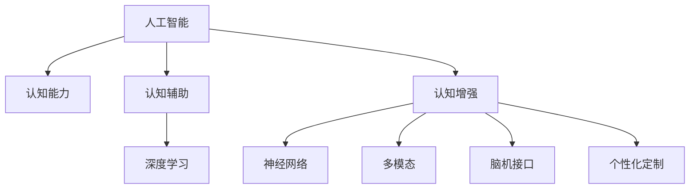

                 

# AI对人类认知能力的补充和增强

> 关键词：人工智能,认知能力,认知辅助,人机协作,深度学习,神经网络,多模态,脑机接口,个性化定制

## 1. 背景介绍

### 1.1 问题由来

随着科技的飞速发展，人工智能(AI)已经成为推动社会进步的重要力量。在各个领域，AI正逐步取代传统工作，使得人类有更多时间和精力从事创造性工作，提升个人生活质量。然而，由于人类认知能力的局限性，在复杂任务和繁重工作中，人类的认知负担往往较大，容易出现疲劳、失误等问题。为了更好地发挥人类的潜力，AI不仅需要接管繁琐的任务，更需能够补充和增强人类的认知能力。

### 1.2 问题核心关键点

当前，AI在认知辅助和增强方面的应用已经取得了诸多成果。比如，基于深度学习的图像识别和语音识别技术，可以帮助人类识别和理解复杂信息，减轻认知负担。基于自然语言处理的问答系统和文本摘要系统，可以辅助人类处理文本信息，提升信息处理效率。然而，在认知辅助和增强过程中，AI也面临着诸多挑战：如何在不同的任务和场景中提供个性化的辅助；如何确保辅助系统的可靠性和安全性；如何维护人类的隐私和权益等。

### 1.3 问题研究意义

研究AI对人类认知能力的补充和增强，对于提升人类的认知水平和工作效率，减轻认知负荷，具有重要意义：

1. 提高工作和学习效率：AI可以辅助人类处理信息，加速决策过程，提高生产力和学习效率。
2. 增强人类创造力和创新能力：AI可以通过提供数据支持和洞察，激发人类的创造力，推动更多创新的产生。
3. 提升健康和生活质量：AI可以帮助人类进行健康监测和预警，提升生活质量。
4. 扩展认知范围和深度：AI可以通过模拟人类的认知过程，扩展人类的认知范围和深度，帮助人类克服认知局限。

本文聚焦于AI在认知辅助和增强方面的关键技术，从理论到实践，系统地探讨其在各领域的应用。

## 2. 核心概念与联系

### 2.1 核心概念概述

为了更好地理解AI在认知辅助和增强方面的应用，我们首先介绍几个核心概念：

- **人工智能(AI)**：通过计算机科学和数学，使机器能够执行通常需要人类智能的任务，如识别、推理、决策等。
- **认知能力**：人类进行思维、推理、决策、感知等心理活动的能力。
- **认知辅助**：使用AI技术帮助人类处理信息和执行任务，减轻认知负担。
- **认知增强**：使用AI技术扩展人类的认知能力，帮助人类克服认知局限。
- **深度学习**：一种基于神经网络的机器学习方法，能够自动提取特征，解决复杂模式识别任务。
- **神经网络**：由大量人工神经元构成的计算模型，模拟人类大脑的工作方式。
- **多模态**：结合视觉、听觉、触觉等多种感官信息，提供更丰富的信息表示。
- **脑机接口(BMI)**：通过脑信号解码和神经反馈，实现人机交互的一种技术。
- **个性化定制**：根据用户的特点和需求，定制化开发认知辅助和增强系统。

这些核心概念之间的逻辑关系可以通过以下Mermaid流程图来展示：



这个流程图展示了大语言模型的核心概念及其之间的关系：

1. AI通过深度学习和神经网络，模拟人类认知过程，提升认知能力。
2. 认知辅助和增强是AI对人类认知的直接补充和增强。
3. 多模态、脑机接口和个性化定制是认知辅助和增强的具体实现方式。

这些概念共同构成了AI在认知辅助和增强方面的理论框架，帮助我们理解AI在各领域的实际应用。

## 3. 核心算法原理 & 具体操作步骤
### 3.1 算法原理概述

AI在认知辅助和增强方面的应用，主要基于深度学习和神经网络技术。深度学习模型通过大量数据进行训练，能够自动提取特征，解决复杂的模式识别和预测任务。而神经网络模型通过多层次的抽象和表示，能够模拟人类大脑的工作方式，提供更丰富的信息处理能力。

AI在认知辅助和增强中的主要算法包括：

- 卷积神经网络（CNN）：用于图像和视频处理，能够识别视觉特征，提供图像分类、目标检测等任务。
- 循环神经网络（RNN）及其变体（如LSTM、GRU）：用于处理序列数据，能够捕捉时间依赖关系，用于自然语言处理、语音识别等任务。
- 注意力机制（Attention Mechanism）：用于处理多模态数据，能够将不同信息源的特征进行加权组合，提高信息处理效率。
- 变分自编码器（VAE）：用于生成模型，能够生成高质量的图像、音频等数据，辅助人类进行创造性工作。

这些算法共同构成了AI在认知辅助和增强方面的核心技术。

### 3.2 算法步骤详解

AI在认知辅助和增强方面的应用，主要分为数据准备、模型训练和应用部署三个步骤：

1. **数据准备**：收集和预处理需要处理的数据，包括图像、文本、语音等。数据质量直接影响模型的训练效果，因此需要进行仔细的清洗和标注。
2. **模型训练**：选择适当的深度学习模型和算法，利用大量的数据进行训练，不断调整模型参数，提高模型性能。训练过程中需要关注过拟合、欠拟合等问题，确保模型泛化性能。
3. **应用部署**：将训练好的模型部署到实际应用场景中，提供认知辅助和增强服务。需要注意模型在不同设备上的运行效率，进行性能优化和调试。

### 3.3 算法优缺点

AI在认知辅助和增强方面的应用，具有以下优点：

1. **高效处理复杂任务**：深度学习和神经网络技术能够高效处理复杂模式识别和决策任务，提升信息处理效率。
2. **扩展人类认知范围**：AI可以模拟人类的认知过程，扩展人类的认知范围和深度，解决认知局限问题。
3. **个性化定制**：AI可以根据用户的特点和需求，进行个性化定制，提供更加精准的认知辅助和增强服务。

同时，AI在认知辅助和增强方面也存在一些缺点：

1. **数据依赖性高**：深度学习和神经网络模型需要大量数据进行训练，数据质量和数量直接影响模型的性能。
2. **模型复杂度高**：深度学习模型和神经网络模型结构复杂，训练和部署过程较为繁琐，需要较高的时间和资源投入。
3. **安全性问题**：AI系统可能存在安全隐患，如隐私泄露、误判等问题，需要加强安全防护措施。

### 3.4 算法应用领域

AI在认知辅助和增强方面的应用，覆盖了多个领域：

- **医疗领域**：AI可以通过图像识别、自然语言处理等技术，辅助医生进行诊断和治疗，提高医疗效率。
- **教育领域**：AI可以通过个性化推荐系统、智能答疑系统等，辅助教师和学生进行学习和教学，提升教育质量。
- **金融领域**：AI可以通过风险预警、投资分析等技术，辅助投资者进行决策，提高投资效益。
- **交通领域**：AI可以通过图像识别、语音识别等技术，辅助交通管理和驾驶，提高交通效率和安全。
- **娱乐领域**：AI可以通过生成内容、推荐系统等技术，提升用户体验，提供更多娱乐内容。

这些领域的应用展示了AI在认知辅助和增强方面的广泛前景，未来还有更多的应用场景待开发。

## 4. 数学模型和公式 & 详细讲解  
### 4.1 数学模型构建

为了更好地理解AI在认知辅助和增强方面的应用，我们引入数学模型进行详细讲解。

假设有一个二分类任务，输入为特征向量 $x$，输出为标签 $y \in \{0, 1\}$。我们的目标是构建一个深度学习模型 $f(x; \theta)$，使得 $f(x; \theta) = y$ 的概率最大化。

模型 $f(x; \theta)$ 可以是一个全连接神经网络，包含多个隐藏层。假设第一层有 $n_1$ 个神经元，第二层有 $n_2$ 个神经元，以此类推。模型的参数为 $\theta = \{\mathbf{W}^{[l]}, \mathbf{b}^{[l]}\}_{l=1}^{L}$，其中 $\mathbf{W}^{[l]}$ 和 $\mathbf{b}^{[l]}$ 分别为第 $l$ 层的权重和偏置。

模型的前向传播过程为：

$$
h^{[l]} = \sigma(\mathbf{W}^{[l]} h^{[l-1]} + \mathbf{b}^{[l]})
$$

其中 $\sigma$ 为激活函数，如ReLU、Sigmoid等。

模型的损失函数为交叉熵损失：

$$
\ell(y, f(x; \theta)) = -y \log f(x; \theta) - (1 - y) \log (1 - f(x; \theta))
$$

模型的训练目标为最小化损失函数：

$$
\theta^* = \mathop{\arg\min}_{\theta} \mathcal{L}(\theta) = \mathop{\arg\min}_{\theta} \frac{1}{N} \sum_{i=1}^N \ell(y_i, f(x_i; \theta))
$$

其中 $N$ 为样本数量。

### 4.2 公式推导过程

在二分类任务中，我们定义模型输出 $f(x; \theta)$ 为预测概率。假设模型 $f(x; \theta)$ 为二元逻辑回归模型，即：

$$
f(x; \theta) = \sigma(\mathbf{W} \mathbf{x} + b)
$$

其中 $\mathbf{W}$ 和 $b$ 为模型参数。

将模型输出与真实标签代入损失函数中，得到交叉熵损失函数：

$$
\ell(y, f(x; \theta)) = -y \log f(x; \theta) - (1 - y) \log (1 - f(x; \theta))
$$

将损失函数展开，并求导，得到：

$$
\frac{\partial \ell(y, f(x; \theta))}{\partial \theta} = -\frac{y f(x; \theta) - (1 - y)}{f(x; \theta) (1 - f(x; \theta))} \frac{\partial f(x; \theta)}{\partial \theta}
$$

利用链式法则，得到：

$$
\frac{\partial f(x; \theta)}{\partial \theta} = \frac{\partial}{\partial \theta} (\mathbf{W} \mathbf{x} + b) = \mathbf{W}
$$

因此，梯度更新公式为：

$$
\theta \leftarrow \theta - \eta \frac{\partial \ell(y, f(x; \theta))}{\partial \theta}
$$

其中 $\eta$ 为学习率。

### 4.3 案例分析与讲解

以医疗图像识别为例，分析深度学习在认知辅助和增强中的应用。

假设有一个乳腺癌图像识别任务，模型输入为图像特征向量 $x$，输出为二元标签 $y$。我们的目标是构建一个卷积神经网络（CNN）模型 $f(x; \theta)$，使得 $f(x; \theta) = y$ 的概率最大化。

模型 $f(x; \theta)$ 可以是一个包含多个卷积层和池化层的CNN模型，如ResNet、VGG等。模型的参数为 $\theta = \{\mathbf{W}^{[l]}, \mathbf{b}^{[l]}\}_{l=1}^{L}$，其中 $\mathbf{W}^{[l]}$ 和 $\mathbf{b}^{[l]}$ 分别为第 $l$ 层的权重和偏置。

模型的前向传播过程为：

$$
h^{[l]} = \sigma(\mathbf{W}^{[l]} h^{[l-1]} + \mathbf{b}^{[l]})
$$

其中 $\sigma$ 为激活函数，如ReLU、Sigmoid等。

模型的损失函数为交叉熵损失：

$$
\ell(y, f(x; \theta)) = -y \log f(x; \theta) - (1 - y) \log (1 - f(x; \theta))
$$

模型的训练目标为最小化损失函数：

$$
\theta^* = \mathop{\arg\min}_{\theta} \mathcal{L}(\theta) = \mathop{\arg\min}_{\theta} \frac{1}{N} \sum_{i=1}^N \ell(y_i, f(x_i; \theta))
$$

其中 $N$ 为样本数量。

在实际应用中，数据准备、模型训练和应用部署是深度学习在医疗图像识别任务中的关键步骤。通过深度学习模型，医生可以高效地进行癌症筛查、病理诊断等工作，极大地提升了医疗效率和诊断准确性。

## 5. 项目实践：代码实例和详细解释说明
### 5.1 开发环境搭建

在进行认知辅助和增强的应用实践前，我们需要准备好开发环境。以下是使用Python进行TensorFlow开发的环境配置流程：

1. 安装Anaconda：从官网下载并安装Anaconda，用于创建独立的Python环境。

2. 创建并激活虚拟环境：
```bash
conda create -n tf-env python=3.8 
conda activate tf-env
```

3. 安装TensorFlow：根据CUDA版本，从官网获取对应的安装命令。例如：
```bash
conda install tensorflow-gpu=cuda11.1=11.1-py3.8-cudnn8_0=8.4.0_20210221 -c tf -c conda-forge
```

4. 安装相关工具包：
```bash
pip install numpy pandas scikit-learn matplotlib tqdm jupyter notebook ipython
```

完成上述步骤后，即可在`tf-env`环境中开始应用实践。

### 5.2 源代码详细实现

下面我们以医疗图像识别为例，给出使用TensorFlow实现卷积神经网络（CNN）模型的PyTorch代码实现。

首先，定义CNN模型：

```python
import tensorflow as tf
from tensorflow.keras import layers

def build_cnn_model(input_shape, num_classes):
    model = tf.keras.Sequential([
        layers.Conv2D(32, 3, activation='relu', input_shape=input_shape),
        layers.MaxPooling2D(pool_size=(2, 2)),
        layers.Conv2D(64, 3, activation='relu'),
        layers.MaxPooling2D(pool_size=(2, 2)),
        layers.Flatten(),
        layers.Dense(128, activation='relu'),
        layers.Dense(num_classes, activation='sigmoid')
    ])
    return model
```

然后，准备数据集：

```python
import tensorflow as tf
from tensorflow.keras.preprocessing.image import ImageDataGenerator

train_data_dir = 'train_dir/'
val_data_dir = 'val_dir/'

train_datagen = ImageDataGenerator(rescale=1./255)
val_datagen = ImageDataGenerator(rescale=1./255)

train_generator = train_datagen.flow_from_directory(
    train_data_dir,
    target_size=(224, 224),
    batch_size=32,
    class_mode='binary')

val_generator = val_datagen.flow_from_directory(
    val_data_dir,
    target_size=(224, 224),
    batch_size=32,
    class_mode='binary')
```

接着，训练模型：

```python
model = build_cnn_model(input_shape=(224, 224, 3), num_classes=2)

model.compile(optimizer='adam',
              loss='binary_crossentropy',
              metrics=['accuracy'])

history = model.fit(train_generator,
                    epochs=10,
                    validation_data=val_generator)
```

最后，评估模型：

```python
test_data_dir = 'test_dir/'

test_datagen = ImageDataGenerator(rescale=1./255)

test_generator = test_datagen.flow_from_directory(
    test_data_dir,
    target_size=(224, 224),
    batch_size=32,
    class_mode='binary')

test_loss, test_acc = model.evaluate(test_generator)

print('Test accuracy:', test_acc)
```

以上就是使用TensorFlow实现医疗图像识别任务的完整代码实现。可以看到，通过TensorFlow库，我们可以方便地搭建、训练和评估深度学习模型。

### 5.3 代码解读与分析

让我们再详细解读一下关键代码的实现细节：

**build_cnn_model函数**：
- 定义了一个包含卷积层、池化层和全连接层的CNN模型，其中卷积层使用3x3的卷积核，激活函数为ReLU。
- 池化层使用2x2的池化窗口，下采样率为2。
- 全连接层包含128个神经元，激活函数为ReLU。
- 输出层有2个神经元，激活函数为Sigmoid，用于二分类任务。

**ImageDataGenerator类**：
- 用于数据增强和归一化处理，提升模型泛化能力。

**fit函数**：
- 用于模型训练，传入训练数据生成器，指定训练轮数。

**evaluate函数**：
- 用于模型评估，传入测试数据生成器，输出模型在测试集上的准确率。

可以看到，TensorFlow提供了丰富的API和工具，大大简化了深度学习模型的开发和部署。开发者可以将更多精力放在模型设计和优化上，而不必过多关注底层实现细节。

当然，工业级的系统实现还需考虑更多因素，如模型保存和部署、超参数搜索、性能优化等。但核心的应用流程基本与此类似。

## 6. 实际应用场景
### 6.1 智能客服系统

基于深度学习的认知辅助系统，可以广泛应用于智能客服系统的构建。传统客服往往需要配备大量人力，高峰期响应缓慢，且一致性和专业性难以保证。而使用认知辅助系统，可以7x24小时不间断服务，快速响应客户咨询，用自然流畅的语言解答各类常见问题。

在技术实现上，可以收集企业内部的历史客服对话记录，将问题和最佳答复构建成监督数据，在此基础上对预训练深度学习模型进行微调。微调后的认知辅助系统能够自动理解用户意图，匹配最合适的答案模板进行回复。对于客户提出的新问题，还可以接入检索系统实时搜索相关内容，动态组织生成回答。如此构建的智能客服系统，能大幅提升客户咨询体验和问题解决效率。

### 6.2 金融舆情监测

金融机构需要实时监测市场舆论动向，以便及时应对负面信息传播，规避金融风险。传统的人工监测方式成本高、效率低，难以应对网络时代海量信息爆发的挑战。基于深度学习的认知辅助系统，可以为金融舆情监测提供新的解决方案。

具体而言，可以收集金融领域相关的新闻、报道、评论等文本数据，并对其进行主题标注和情感标注。在此基础上对预训练深度学习模型进行微调，使其能够自动判断文本属于何种主题，情感倾向是正面、中性还是负面。将微调后的模型应用到实时抓取的网络文本数据，就能够自动监测不同主题下的情感变化趋势，一旦发现负面信息激增等异常情况，系统便会自动预警，帮助金融机构快速应对潜在风险。

### 6.3 个性化推荐系统

当前的推荐系统往往只依赖用户的历史行为数据进行物品推荐，无法深入理解用户的真实兴趣偏好。基于深度学习的认知增强系统，可以更好地挖掘用户行为背后的语义信息，从而提供更精准、多样的推荐内容。

在实践中，可以收集用户浏览、点击、评论、分享等行为数据，提取和用户交互的物品标题、描述、标签等文本内容。将文本内容作为模型输入，用户的后续行为（如是否点击、购买等）作为监督信号，在此基础上微调预训练深度学习模型。微调后的模型能够从文本内容中准确把握用户的兴趣点。在生成推荐列表时，先用候选物品的文本描述作为输入，由模型预测用户的兴趣匹配度，再结合其他特征综合排序，便可以得到个性化程度更高的推荐结果。

### 6.4 未来应用展望

随着深度学习技术的发展，认知辅助和增强系统在各个领域的应用前景广阔。未来，深度学习技术有望在更多领域得到应用，为传统行业数字化转型升级提供新的技术路径。

在智慧医疗领域，基于深度学习的认知辅助系统，可以帮助医生进行疾病诊断、治疗方案推荐等工作，提高医疗效率和诊断准确性。

在智能教育领域，基于深度学习的认知增强系统，可以为学生提供个性化学习方案，提升学习效果。

在智慧城市治理中，基于深度学习的认知辅助系统，可以提高城市管理的自动化和智能化水平，构建更安全、高效的未来城市。

此外，在企业生产、社会治理、文娱传媒等众多领域，基于深度学习的认知辅助和增强系统也将不断涌现，为经济社会发展注入新的动力。相信随着技术的日益成熟，深度学习技术将成为认知辅助和增强的主要手段，推动人工智能技术在各个领域的应用。

## 7. 工具和资源推荐
### 7.1 学习资源推荐

为了帮助开发者系统掌握深度学习在认知辅助和增强方面的理论基础和实践技巧，这里推荐一些优质的学习资源：

1. 《深度学习》系列书籍：斯坦福大学深度学习课程的讲义和习题，全面介绍了深度学习的理论基础和实践应用。
2. 《TensorFlow实战Google深度学习框架》：Google官方文档，提供了大量TensorFlow应用的实例，适合初学者上手。
3. 《深度学习入门：基于Python的理论与实现》：基于PyTorch实现深度学习算法的入门书籍，适合新手学习。
4. Kaggle平台：提供大量开源深度学习竞赛和数据集，适合实践深度学习模型。
5. Udacity《深度学习专项课程》：由Google DeepMind的工程师授课，系统讲解深度学习理论和实践应用。

通过对这些资源的学习实践，相信你一定能够快速掌握深度学习在认知辅助和增强方面的精髓，并用于解决实际的认知问题。
###  7.2 开发工具推荐

高效的开发离不开优秀的工具支持。以下是几款用于深度学习在认知辅助和增强方面的认知辅助和增强系统的开发工具：

1. TensorFlow：Google开源的深度学习框架，支持GPU加速，提供丰富的API和工具，适合大规模模型训练和部署。
2. PyTorch：Facebook开源的深度学习框架，支持动态计算图，易于实现复杂模型结构，适合学术研究和快速迭代。
3. Keras：基于TensorFlow和Theano的高层次深度学习库，提供简单易用的API，适合快速开发原型。
4. Jupyter Notebook：Python交互式编程环境，支持代码编辑、数据可视化、结果展示，适合快速迭代开发。
5. GitHub：代码托管平台，提供丰富的开源深度学习项目和社区支持，适合学习和分享。

合理利用这些工具，可以显著提升深度学习模型的开发效率，加快创新迭代的步伐。

### 7.3 相关论文推荐

深度学习在认知辅助和增强方面的发展源于学界的持续研究。以下是几篇奠基性的相关论文，推荐阅读：

1. ImageNet Classification with Deep Convolutional Neural Networks：AlexNet的论文，提出了卷积神经网络在图像分类任务中的应用，开启了深度学习在计算机视觉领域的应用。
2. AlexNet, OverFeaturization, and the Deep ImageNet Challenge：对AlexNet进行改进的论文，提出了数据增强等优化策略，提升了深度学习模型的泛化性能。
3. Why Should I Trust You?: Explainable AI：讨论了深度学习模型的可解释性问题，提出了多种可解释性方法和指标，如LIME、SHAP等。
4. Deep Learning for Healthcare：讨论了深度学习在医疗领域的应用，如疾病诊断、治疗方案推荐等。
5. Recommendation Systems with Deep Learning：讨论了深度学习在推荐系统中的应用，如协同过滤、内容推荐等。

这些论文代表了大语言模型微调技术的发展脉络。通过学习这些前沿成果，可以帮助研究者把握学科前进方向，激发更多的创新灵感。

## 8. 总结：未来发展趋势与挑战
### 8.1 总结

本文对深度学习在认知辅助和增强方面的应用进行了全面系统的介绍。首先阐述了深度学习在认知辅助和增强方面的应用背景和意义，明确了深度学习在各领域的应用前景。其次，从原理到实践，详细讲解了深度学习在认知辅助和增强方面的数学模型和算法流程，给出了深度学习在医疗图像识别等实际应用中的代码实现。同时，本文还广泛探讨了深度学习在智能客服、金融舆情、个性化推荐等多个领域的应用前景，展示了深度学习在认知辅助和增强方面的广阔前景。

通过本文的系统梳理，可以看到，深度学习在认知辅助和增强方面的应用已经取得了显著成效。未来，随着深度学习技术的不断发展，深度学习技术必将在更广阔的应用领域得到深入应用，为人类认知智能的进化带来深远影响。

### 8.2 未来发展趋势

展望未来，深度学习在认知辅助和增强方面的应用将呈现以下几个发展趋势：

1. **多模态融合**：深度学习在认知辅助和增强方面，将越来越多地结合视觉、听觉、触觉等多种感官信息，提供更丰富的信息表示。
2. **个性化定制**：深度学习模型将更加注重个性化定制，根据用户的特点和需求，提供更加精准的认知辅助和增强服务。
3. **高效优化**：深度学习模型的训练和优化过程将更加高效，如使用Transformer架构的模型，能够在保持高精度的同时，减少计算资源消耗。
4. **深度强化学习**：深度学习与强化学习相结合，能够提供更加智能、自主的认知辅助和增强系统，如自动驾驶、智能机器人等。
5. **可解释性和可信度**：深度学习模型的可解释性和可信度将成为关键问题，需要在模型设计和训练过程中加以考虑。

以上趋势凸显了深度学习在认知辅助和增强方面的广阔前景。这些方向的探索发展，必将进一步提升深度学习模型的性能和应用范围，为构建人机协同的智能系统铺平道路。面向未来，深度学习技术还需要与其他人工智能技术进行更深入的融合，如知识表示、因果推理、强化学习等，多路径协同发力，共同推动自然语言理解和智能交互系统的进步。只有勇于创新、敢于突破，才能不断拓展深度学习模型的边界，让智能技术更好地造福人类社会。

### 8.3 面临的挑战

尽管深度学习在认知辅助和增强方面的应用已经取得了诸多成果，但在迈向更加智能化、普适化应用的过程中，它仍面临着诸多挑战：

1. **数据依赖性高**：深度学习模型需要大量数据进行训练，数据质量和数量直接影响模型的性能。如何在有限的标注数据下，提升模型泛化能力，是一个重要问题。
2. **模型复杂度高**：深度学习模型结构复杂，训练和部署过程较为繁琐，需要较高的时间和资源投入。如何在保持高精度的同时，提升模型训练和部署效率，是一个重要问题。
3. **安全性问题**：深度学习系统可能存在安全隐患，如隐私泄露、误判等问题，需要加强安全防护措施。如何在保证安全性的前提下，提升认知辅助和增强系统的应用效果，是一个重要问题。
4. **可解释性问题**：深度学习模型的可解释性较差，难以解释其内部工作机制和决策逻辑。如何在保证安全性的前提下，提升认知辅助和增强系统的可解释性和可审计性，是一个重要问题。
5. **人机交互问题**：深度学习系统需要与人类进行良好的人机交互，提升用户体验。如何在保持高效性的前提下，提升人机交互的友好性和自然性，是一个重要问题。

这些挑战凸显了深度学习在认知辅助和增强方面的复杂性和多面性。解决这些问题，需要研究者、开发者和用户的共同努力。只有在技术、应用和伦理道德等多方面进行全面优化，才能真正实现深度学习技术在认知辅助和增强方面的广泛应用。

### 8.4 研究展望

面对深度学习在认知辅助和增强方面所面临的挑战，未来的研究需要在以下几个方面寻求新的突破：

1. **无监督和半监督学习**：探索无监督和半监督学习技术，摆脱对大量标注数据的依赖，利用自监督学习、主动学习等方法，提升深度学习模型的泛化能力。
2. **高效模型设计**：开发更加高效、简洁的深度学习模型架构，如Transformer、CapsNet等，在保持高精度的同时，提升模型训练和部署效率。
3. **安全性和隐私保护**：加强深度学习系统的安全性研究，提升系统的鲁棒性和可信度。同时，采用数据脱敏、差分隐私等技术，保护用户的隐私和权益。
4. **可解释性研究**：引入可解释性方法，如LIME、SHAP等，提升深度学习模型的可解释性和可审计性，增强用户对系统的信任和理解。
5. **多模态信息融合**：探索多模态信息融合技术，结合视觉、听觉、触觉等多种感官信息，提供更丰富的信息表示，提升深度学习系统的认知能力。

这些研究方向将推动深度学习在认知辅助和增强方面的进一步发展，为构建更加智能、普适、可信的认知辅助和增强系统奠定基础。

## 9. 附录：常见问题与解答

**Q1：深度学习在认知辅助和增强方面有哪些应用场景？**

A: 深度学习在认知辅助和增强方面的应用场景广泛，包括医疗、教育、金融、交通、娱乐等诸多领域。以下是一些典型应用场景：

- **医疗领域**：深度学习可以帮助医生进行疾病诊断、治疗方案推荐等工作，提高医疗效率和诊断准确性。
- **教育领域**：深度学习可以为学生提供个性化学习方案，提升学习效果。
- **金融领域**：深度学习可以进行风险预警、投资分析等，提高投资效益。
- **交通领域**：深度学习可以进行图像识别、语音识别等，提高交通管理效率和安全性。
- **娱乐领域**：深度学习可以进行内容生成、推荐系统等，提升用户体验。

**Q2：深度学习在认知辅助和增强方面的主要算法有哪些？**

A: 深度学习在认知辅助和增强方面的主要算法包括：

- **卷积神经网络（CNN）**：用于图像和视频处理，能够识别视觉特征，提供图像分类、目标检测等任务。
- **循环神经网络（RNN）及其变体（如LSTM、GRU）**：用于处理序列数据，能够捕捉时间依赖关系，用于自然语言处理、语音识别等任务。
- **注意力机制（Attention Mechanism）**：用于处理多模态数据，能够将不同信息源的特征进行加权组合，提高信息处理效率。
- **变分自编码器（VAE）**：用于生成模型，能够生成高质量的图像、音频等数据，辅助人类进行创造性工作。

**Q3：深度学习在认知辅助和增强方面需要注意哪些问题？**

A: 深度学习在认知辅助和增强方面需要注意以下几个问题：

1. **数据依赖性高**：深度学习模型需要大量数据进行训练，数据质量和数量直接影响模型的性能。
2. **模型复杂度高**：深度学习模型结构复杂，训练和部署过程较为繁琐，需要较高的时间和资源投入。
3. **安全性问题**：深度学习系统可能存在安全隐患，如隐私泄露、误判等问题，需要加强安全防护措施。
4. **可解释性问题**：深度学习模型的可解释性较差，难以解释其内部工作机制和决策逻辑。
5. **人机交互问题**：深度学习系统需要与人类进行良好的人机交互，提升用户体验。

**Q4：深度学习在认知辅助和增强方面如何实现个性化定制？**

A: 深度学习在认知辅助和增强方面可以通过以下方式实现个性化定制：

1. **数据个性化**：根据用户的特点和需求，收集和预处理特定的数据，用于深度学习模型的训练。
2. **模型参数微调**：对深度学习模型的参数进行微调，根据用户的行为和反馈，不断优化模型的性能。
3. **交互式学习**：通过交互式界面，让用户参与到模型的训练和优化过程中，提供实时反馈和建议。
4. **多任务学习**：将深度学习模型应用于多个任务，提升模型的泛化能力，提供更加个性化的服务。

**Q5：深度学习在认知辅助和增强方面的应用前景如何？**

A: 深度学习在认知辅助和增强方面的应用前景广阔，随着技术的不断发展，未来将在更多领域得到应用：

1. **医疗领域**：深度学习可以帮助医生进行疾病诊断、治疗方案推荐等工作，提高医疗效率和诊断准确性。
2. **教育领域**：深度学习可以为学生提供个性化学习方案，提升学习效果。
3. **金融领域**：深度学习可以进行风险预警、投资分析等，提高投资效益。
4. **交通领域**：深度学习可以进行图像识别、语音识别等，提高交通管理效率和安全性。
5. **娱乐领域**：深度学习可以进行内容生成、推荐系统等，提升用户体验。

未来，深度学习技术必将在更广阔的应用领域得到深入应用，为人类认知智能的进化带来深远影响。

---

作者：禅与计算机程序设计艺术 / Zen and the Art of Computer Programming

