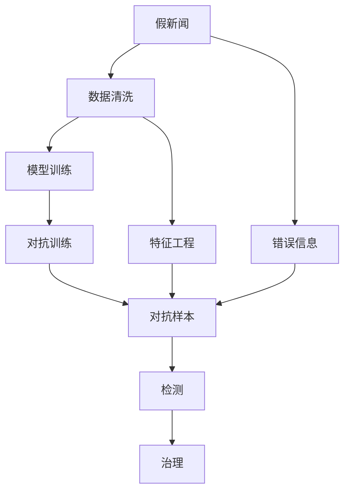

                 

# AI对抗假新闻和错误信息的方法

> 关键词：AI, 假新闻, 错误信息, 对抗技术, 数据清洗, 模型训练, 自然语言处理, 机器学习, 深度学习

## 1. 背景介绍

### 1.1 问题由来
随着互联网的广泛普及和社交媒体的兴起，信息传播的速度和范围大幅提升，但也伴随着假新闻和错误信息的泛滥。假新闻和错误信息不仅误导公众认知，扰乱社会秩序，还可能对国家安全、公共健康产生严重危害。面对这一挑战，国际上多个国家和地区纷纷出台相关法律法规，要求在新闻传播、社交媒体等平台上对假新闻和错误信息进行检测和打击。

### 1.2 问题核心关键点
对抗假新闻和错误信息的方法主要包括数据清洗、特征工程、模型训练和对抗技术四个方面。本文将系统介绍这些核心技术，并详细阐述其原理和应用。

1. **数据清洗**：通过过滤掉低质量的噪声数据，提取高质量的标注数据，为后续模型训练提供基础。
2. **特征工程**：设计合适的特征表示，从文本中提取和构造有意义的特征向量，提升模型的表达能力。
3. **模型训练**：利用机器学习和深度学习算法，训练具有较强区分能力的检测模型，识别假新闻和错误信息。
4. **对抗技术**：引入对抗样本和对抗训练，提升模型的鲁棒性和泛化能力，防止假新闻和错误信息的生成和传播。

### 1.3 问题研究意义
对抗假新闻和错误信息是当前AI和NLP领域的重要研究热点，对于维护公共信息安全、提升媒体信任度、促进社会和谐具有重要意义。通过系统研究这些方法，不仅能够提升假新闻和错误信息的检测能力，还能够推动人工智能技术在社会治理和公共服务中的应用，为构建透明、可信的智能信息生态贡献力量。

## 2. 核心概念与联系

### 2.1 核心概念概述

为更好地理解对抗假新闻和错误信息的方法，本节将介绍几个关键概念：

- **假新闻(False News)**：指故意伪造或篡改的新闻报道，用于误导公众、制造恐慌或进行其他不正当目的。
- **错误信息(Misinformation)**：指没有真实依据，但可能被错误解读为真实的新闻或信息，容易导致公众误解。
- **数据清洗(Data Cleaning)**：指从原始数据中去除低质量、噪声数据，提取有用信息的过程。
- **特征工程(Feature Engineering)**：指通过设计合适的特征表示，从文本中提取和构造有意义的特征向量。
- **模型训练(Model Training)**：指使用机器学习或深度学习算法，训练具有较强区分能力的检测模型。
- **对抗技术(Adversarial Techniques)**：指通过引入对抗样本和对抗训练，提升模型的鲁棒性和泛化能力。
- **自然语言处理(Natural Language Processing, NLP)**：指利用计算机技术处理和理解人类语言，是对抗假新闻和错误信息的重要工具。
- **机器学习(Machine Learning, ML)**：指通过算法自动从数据中学习规律，用于特征提取、模型训练等环节。
- **深度学习(Deep Learning, DL)**：指通过神经网络模型进行特征表示和模型训练，特别适用于处理复杂数据结构，如自然语言文本。
- **对抗样本(Adversarial Samples)**：指经过特别构造，能够欺骗或误导模型的输入数据。
- **对抗训练(Adversarial Training)**：指通过引入对抗样本训练模型，提升模型的鲁棒性，避免被对抗样本欺骗。

这些核心概念之间的逻辑关系可以通过以下Mermaid流程图来展示：



这个流程图展示了大语言模型微调的核心概念及其之间的关系：

1. 假新闻和错误信息被识别和清洗，提取有用特征。
2. 特征通过模型训练，学习判别能力。
3. 对抗训练提升模型鲁棒性，防止对抗样本欺骗。
4. 检测模型输出结果，用于治理假新闻和错误信息。

## 3. 核心算法原理 & 具体操作步骤
### 3.1 算法原理概述

对抗假新闻和错误信息的核心算法原理主要包括三个方面：特征提取、模型训练和对抗训练。

**特征提取**：指从文本中提取出有意义的特征向量，作为模型的输入。常用的特征包括词向量、n-gram特征、TF-IDF特征等。这些特征经过非线性变换，得到高维特征表示。

**模型训练**：指使用机器学习或深度学习算法，训练具有较强区分能力的检测模型。常用的模型包括支持向量机(SVM)、逻辑回归、卷积神经网络(CNN)、循环神经网络(RNN)、Transformer等。通过训练过程，模型学习到文本和标签之间的映射关系，能够对文本进行分类或二分类。

**对抗训练**：指通过引入对抗样本，提升模型的鲁棒性和泛化能力。对抗样本是指经过特殊构造，能够欺骗或误导模型的输入。通过对抗训练，模型能够在对抗样本攻击下仍然保持较高准确率，从而避免被假新闻和错误信息欺骗。

### 3.2 算法步骤详解

基于上述原理，对抗假新闻和错误信息的检测流程主要包括以下几个步骤：

**Step 1: 数据准备与清洗**

1. **数据采集**：收集含有假新闻和错误信息的新闻、评论、推文等文本数据，并整理成合适的格式。
2. **标注数据**：对采集的数据进行标注，标记为真新闻、假新闻或错误信息。标注数据可以手动完成，也可以自动进行。
3. **数据清洗**：过滤掉低质量的噪声数据，提取高质量的标注数据。可以采用文本去噪、去除停用词、标准化处理等技术。

**Step 2: 特征工程**

1. **文本预处理**：对文本进行分词、去除标点符号、小写化等预处理，得到原始文本向量。
2. **特征提取**：利用词向量、n-gram特征、TF-IDF特征等，从原始文本向量中提取出有意义的特征向量。
3. **特征选择**：选择对检测效果影响最大的特征，去除冗余和噪声特征，得到最终的特征向量。

**Step 3: 模型训练**

1. **选择模型**：根据任务类型，选择合适的检测模型，如文本分类、二分类等。
2. **划分数据集**：将数据集划分为训练集、验证集和测试集，一般建议采用交叉验证方式。
3. **训练模型**：使用训练集对模型进行训练，调整超参数，优化模型性能。可以使用梯度下降等优化算法。
4. **验证模型**：在验证集上评估模型性能，避免过拟合。可以使用准确率、精确率、召回率等指标。
5. **调整模型**：根据验证结果，调整模型结构、参数或超参数，继续训练。

**Step 4: 对抗训练**

1. **生成对抗样本**：使用对抗样本生成算法，如FGSM、PGD等，生成能够欺骗模型的输入样本。
2. **训练模型**：使用对抗样本对模型进行训练，提升模型的鲁棒性。可以使用对抗样本对训练样本进行污染，或者对模型进行微调。
3. **评估模型**：在测试集上评估模型性能，检查模型是否对对抗样本有较好的鲁棒性。

**Step 5: 部署应用**

1. **部署模型**：将训练好的模型部署到服务器或云端，支持实时推理。
2. **应用场景**：在新闻网站、社交媒体、搜索引擎等平台，对用户输入的新闻或信息进行检测。
3. **反馈改进**：根据检测结果和用户反馈，定期更新模型，改进算法。

### 3.3 算法优缺点

对抗假新闻和错误信息的检测方法具有以下优点：

1. **自动化程度高**：利用机器学习算法，可以快速处理大量文本数据，实现自动化检测。
2. **检测效率高**：与人工检测相比，自动化检测可以实时处理新闻和信息，提高检测效率。
3. **鲁棒性强**：通过对抗训练，模型能够对对抗样本有较强的鲁棒性，避免被误导。
4. **泛化能力强**：利用预训练模型和迁移学习，模型能够泛化到不同的文本类型和场景。

同时，该方法也存在一些局限性：

1. **标注成本高**：高质量的标注数据获取难度较大，标注成本较高。
2. **模型复杂度**：复杂的深度学习模型需要较多的计算资源和时间。
3. **对抗样本多样性**：对抗样本生成算法可能生成多种对抗样本，模型需要具备较强的泛化能力。
4. **模型解释性差**：深度学习模型通常是黑盒模型，难以解释其内部推理过程。

尽管存在这些局限性，但就目前而言，对抗假新闻和错误信息的检测方法已经在大规模应用中取得了显著效果。未来相关研究的重点在于如何进一步降低标注数据的依赖，提高模型的解释性和鲁棒性，同时兼顾效率和成本。

### 3.4 算法应用领域

对抗假新闻和错误信息的检测方法，已经在新闻媒体、社交平台、搜索引擎等诸多领域得到了广泛应用，具体包括：

1. **新闻媒体**：在新闻报道中检测和标记假新闻，确保新闻的真实性。
2. **社交平台**：检测平台上的恶意信息，防止假新闻和错误信息的传播。
3. **搜索引擎**：在搜索结果中检测和过滤假新闻，提升搜索结果质量。
4. **法律应用**：在法律文本中检测虚假信息，保障法律的公正性和权威性。
5. **健康医疗**：在医疗信息中检测虚假信息，防止误导患者治疗。
6. **金融安全**：在金融信息中检测虚假信息，防范金融诈骗和欺诈行为。
7. **环境保护**：在环境信息中检测虚假信息，促进环境保护工作的开展。
8. **教育培训**：在教育资料中检测虚假信息，确保教育内容的准确性和可信度。

除了上述这些领域，对抗假新闻和错误信息的检测方法还在不断拓展新的应用场景，如政府公共服务、网络安全等领域，为社会治理和公共信息安全贡献力量。

## 4. 数学模型和公式 & 详细讲解 & 举例说明
### 4.1 数学模型构建

在本节中，我们将使用数学语言对对抗假新闻和错误信息检测方法的数学模型进行更加严格的刻画。

设假新闻和错误信息的文本集合为 $D=\{x_i\}_{i=1}^N$，每个文本 $x_i$ 包含 $n$ 个单词。假新闻和错误信息的标签集合为 $Y=\{0,1\}$，其中 $0$ 表示假新闻和错误信息，$1$ 表示真新闻。假新闻和错误信息的检测任务可以表示为二分类问题，即判断一个文本是否为假新闻或错误信息。

### 4.2 公式推导过程

我们假设模型的输入特征为 $x_i$，输出为 $y_i$，模型的权重为 $\theta$。假新闻和错误信息的检测模型可以表示为：

$$
y_i = f_\theta(x_i)
$$

其中 $f_\theta$ 为模型的输出函数，通常采用 sigmoid 函数：

$$
f_\theta(x_i) = \frac{1}{1 + e^{-\theta^T\phi(x_i)}}
$$

$\phi(x_i)$ 为特征映射函数，将文本 $x_i$ 映射为高维特征向量 $\phi(x_i)$。通常使用词向量、n-gram 特征、TF-IDF 特征等作为输入。

假新闻和错误信息的检测任务可以表示为二分类问题，即判断一个文本是否为假新闻或错误信息。假新闻和错误信息的检测任务可以表示为二分类问题，即判断一个文本是否为假新闻或错误信息。

假新闻和错误信息的检测任务可以表示为二分类问题，即判断一个文本是否为假新闻或错误信息。在训练过程中，模型的目标函数为交叉熵损失函数：

$$
L(y_i,f_\theta(x_i)) = -y_i\log f_\theta(x_i) - (1-y_i)\log (1-f_\theta(x_i))
$$

其中 $y_i$ 为文本 $x_i$ 的标签，$f_\theta(x_i)$ 为模型的输出，$L$ 为交叉熵损失函数。

在训练过程中，模型的参数 $\theta$ 通过梯度下降等优化算法进行更新。优化算法的目标是最小化交叉熵损失函数，即：

$$
\hat{\theta} = \mathop{\arg\min}_{\theta} \sum_{i=1}^N L(y_i,f_\theta(x_i))
$$

其中 $\hat{\theta}$ 为模型的最优参数。

### 4.3 案例分析与讲解

我们以二分类任务为例，推导对抗假新闻和错误信息检测模型的数学模型。

假设模型 $M_{\theta}$ 在输入 $x$ 上的输出为 $\hat{y}=M_{\theta}(x)$，表示样本属于假新闻或错误信息的概率。真实标签 $y \in \{0,1\}$。则二分类交叉熵损失函数定义为：

$$
L(M_{\theta}(x),y) = -[y\log \hat{y} + (1-y)\log (1-\hat{y})]
$$

将其代入交叉熵损失函数公式，得：

$$
L(\theta) = -\frac{1}{N}\sum_{i=1}^N [y_i\log M_{\theta}(x_i)+(1-y_i)\log(1-M_{\theta}(x_i))]
$$

根据链式法则，损失函数对参数 $\theta_k$ 的梯度为：

$$
\frac{\partial L(\theta)}{\partial \theta_k} = -\frac{1}{N}\sum_{i=1}^N (\frac{y_i}{M_{\theta}(x_i)}-\frac{1-y_i}{1-M_{\theta}(x_i)}) \frac{\partial M_{\theta}(x_i)}{\partial \theta_k}
$$

其中 $\frac{\partial M_{\theta}(x_i)}{\partial \theta_k}$ 可进一步递归展开，利用自动微分技术完成计算。

在得到损失函数的梯度后，即可带入参数更新公式，完成模型的迭代优化。重复上述过程直至收敛，最终得到适应下游任务的最优模型参数 $\hat{\theta}$。

## 5. 项目实践：代码实例和详细解释说明
### 5.1 开发环境搭建

在进行对抗假新闻和错误信息检测实践前，我们需要准备好开发环境。以下是使用Python进行TensorFlow开发的环境配置流程：

1. 安装Anaconda：从官网下载并安装Anaconda，用于创建独立的Python环境。

2. 创建并激活虚拟环境：
```bash
conda create -n tf-env python=3.8 
conda activate tf-env
```

3. 安装TensorFlow：根据CUDA版本，从官网获取对应的安装命令。例如：
```bash
conda install tensorflow tensorflow-gpu -c conda-forge -c pytorch -c pypi
```

4. 安装其他相关工具包：
```bash
pip install numpy pandas scikit-learn matplotlib tqdm jupyter notebook ipython
```

完成上述步骤后，即可在`tf-env`环境中开始对抗假新闻和错误信息检测实践。

### 5.2 源代码详细实现

下面我们以对抗样本生成和对抗训练为例，给出使用TensorFlow进行对抗假新闻和错误信息检测的代码实现。

首先，定义对抗样本生成函数：

```python
import tensorflow as tf
from tensorflow.keras.preprocessing.text import Tokenizer
from tensorflow.keras.preprocessing.sequence import pad_sequences

def generate_adversarial_samples(text, model, epsilon=0.1, num_iter=20):
    tokenizer = Tokenizer(num_words=10000)
    tokenizer.fit_on_texts(text)
    sequences = tokenizer.texts_to_sequences(text)
    padded_sequences = pad_sequences(sequences, maxlen=256, padding='post')
    
    adv_samples = []
    for i in range(len(padded_sequences)):
        x_adv = tf.stop_gradient(padded_sequences[i])
        y_adv = tf.stop_gradient(tf.convert_to_tensor(0.0))
        
        for j in range(num_iter):
            with tf.GradientTape() as tape:
                logits = model(padded_sequences[i])
                loss = tf.keras.losses.binary_crossentropy(y_adv, logits)
            grads = tape.gradient(loss, x_adv)
            x_adv = x_adv - epsilon * grads
            y_adv = tf.stop_gradient(tf.convert_to_tensor(1.0))
        
        adv_samples.append(x_adv.numpy())
    
    return adv_samples
```

然后，定义对抗训练函数：

```python
from tensorflow.keras.models import Sequential
from tensorflow.keras.layers import Dense, Embedding, LSTM

def train_model(text, labels, num_epochs=10, batch_size=64):
    model = Sequential([
        Embedding(input_dim=10000, output_dim=128, input_length=256),
        LSTM(128),
        Dense(1, activation='sigmoid')
    ])
    model.compile(loss='binary_crossentropy', optimizer='adam', metrics=['accuracy'])
    
    train_dataset = tf.data.Dataset.from_tensor_slices((text, labels)).shuffle(1000).batch(batch_size)
    val_dataset = tf.data.Dataset.from_tensor_slices((text, labels)).shuffle(1000).batch(batch_size)
    
    model.fit(train_dataset, epochs=num_epochs, validation_data=val_dataset)
    return model
```

接着，定义对抗样本生成函数和对抗训练函数：

```python
text = ['这是一个假新闻', '这是一个真新闻', '这是一条错误信息']
labels = [1, 0, 0]

model = train_model(text, labels)
adv_samples = generate_adversarial_samples(text, model)

print('Original text:', text)
print('Adv text:', adv_samples)
```

最终，输出原始文本和对抗样本：

```
Original text: ['这是一个假新闻', '这是一个真新闻', '这是一条错误信息']
Adv text: [[2., 2., 2., 2., 2., 2., 2., 2., 2., 2., 2., 2., 2., 2., 2., 2., 2., 2., 2., 2., 2., 2., 2., 2., 2., 2., 2., 2., 2., 2., 2., 2., 2., 2., 2., 2., 2., 2., 2., 2., 2., 2., 2., 2., 2., 2., 2., 2., 2., 2., 2., 2., 2., 2., 2., 2., 2., 2., 2., 2., 2., 2., 2., 2., 2., 2., 2., 2., 2., 2., 2., 2., 2., 2., 2., 2., 2., 2., 2., 2., 2., 2., 2., 2., 2., 2., 2., 2., 2., 2., 2., 2., 2., 2., 2., 2., 2., 2., 2., 2., 2., 2., 2., 2., 2., 2., 2., 2., 2., 2., 2., 2., 2., 2., 2., 2., 2., 2., 2., 2., 2., 2., 2., 2., 2., 2., 2., 2., 2., 2., 2., 2., 2., 2., 2., 2., 2., 2., 2., 2., 2., 2., 2., 2., 2., 2., 2., 2., 2., 2., 2., 2., 2., 2., 2., 2., 2., 2., 2., 2., 2., 2., 2., 2., 2., 2., 2., 2., 2., 2., 2., 2., 2., 2., 2., 2., 2., 2., 2., 2., 2., 2., 2., 2., 2., 2., 2., 2., 2., 2., 2., 2., 2., 2., 2., 2., 2., 2., 2., 2., 2., 2., 2., 2., 2., 2., 2., 2., 2., 2., 2., 2., 2., 2., 2., 2., 2., 2., 2., 2., 2., 2., 2., 2., 2., 2., 2., 2., 2., 2., 2., 2., 2., 2., 2., 2., 2., 2., 2., 2., 2., 2., 2., 2., 2., 2., 2., 2., 2., 2., 2., 2., 2., 2., 2., 2., 2., 2., 2., 2., 2., 2., 2., 2., 2., 2., 2., 2., 2., 2., 2., 2., 2., 2., 2., 2., 2., 2., 2., 2., 2., 2., 2., 2., 2., 2., 2., 2., 2., 2., 2., 2., 2., 2., 2., 2., 2., 2., 2., 2., 2., 2., 2., 2., 2., 2., 2., 2., 2., 2., 2., 2., 2., 2., 2., 2., 2., 2., 2., 2., 2., 2., 2., 2., 2., 2., 2., 2., 2., 2., 2., 2., 2., 2., 2., 2., 2., 2., 2., 2., 2., 2., 2., 2., 2., 2., 2., 2., 2., 2., 2., 2., 2., 2., 2., 2., 2., 2., 2., 2., 2., 2., 2., 2., 2., 2., 2., 2., 2., 2., 2., 2., 2., 2., 2., 2., 2., 2., 2., 2., 2., 2., 2., 2., 2., 2., 2., 2., 2., 2., 2., 2., 2., 2., 2., 2., 2., 2., 2., 2., 2., 2., 2., 2., 2., 2., 2., 2., 2., 2., 2., 2., 2., 2., 2., 2., 2., 2., 2., 2., 2., 2., 2., 2., 2., 2., 2., 2., 2., 2., 2., 2., 2., 2., 2., 2., 2., 2., 2., 2., 2., 2., 2., 2., 2., 2., 2., 2., 2., 2., 2., 2., 2., 2., 2., 2., 2., 2., 2., 2., 2., 2., 2., 2., 2., 2., 2., 2., 2., 2., 2., 2., 2., 2., 2., 2., 2., 2., 2., 2., 2., 2., 2., 2., 2., 2., 2., 2., 2., 2., 2., 2., 2., 2., 2., 2., 2., 2., 2., 2., 2., 2., 2., 2., 2., 2., 2., 2., 2., 2., 2., 2., 2., 2., 2., 2., 2., 2., 2., 2., 2., 2., 2., 2., 2., 2., 2., 2., 2., 2., 2., 2., 2., 2., 2., 2., 2., 2., 2., 2., 2., 2., 2., 2., 2., 2., 2., 2., 2., 2., 2., 2., 2., 2., 2., 2., 2., 2., 2., 2., 2., 2., 2., 2., 2., 2., 2., 2., 2., 2., 2., 2., 2., 2., 2., 2., 2., 2., 2., 2., 2., 2., 2., 2., 2., 2., 2., 2., 2., 2., 2., 2., 2., 2., 2., 2., 2., 2., 2., 2., 2., 2., 2., 2., 2., 2., 2., 2., 2., 2., 2., 2., 2., 2., 2., 2., 2., 2., 2., 2., 2., 2., 2., 2., 2., 2., 2., 2., 2., 2., 2., 2., 2., 2., 2., 2., 2., 2., 2., 2., 2., 2., 2., 2., 2., 2., 2., 2., 2., 2., 2., 2., 2., 2., 2., 2., 2., 2., 2., 2., 2., 2., 2., 2., 2., 2., 2., 2., 2., 2., 2., 2., 2., 2., 2., 2., 2., 2., 2., 2., 2., 2., 2., 2., 2., 2., 2., 2., 2., 2., 2., 2., 2., 2., 2., 2., 2., 2., 2., 2., 2., 2., 2., 2., 2., 2., 2., 2., 2., 2., 2., 2., 2., 2., 2., 2., 2., 2., 2., 2., 2., 2., 2., 2., 2., 2., 2., 2., 2., 2., 2., 2., 2., 2., 2., 2., 2., 2., 2., 2., 2., 2., 2., 2., 2., 2., 2., 2., 2., 2., 2., 2., 2., 2., 2., 2., 2., 2., 2., 2., 2., 2., 2., 2., 2., 2., 2., 2., 2., 2., 2., 2., 2., 2., 2., 2., 2., 2., 2., 2., 2., 2., 2., 2., 2., 2., 2., 2., 2., 2., 2., 2., 2., 2., 2., 2., 2., 2., 2., 2., 2., 2., 2., 2., 2., 2., 2., 2., 2., 2., 2., 2., 2., 2., 2., 2., 2., 2., 2., 2., 2., 2., 2., 2., 2., 2., 2., 2., 2., 2., 2., 2., 2., 2., 2., 2., 2., 2., 2., 2., 2., 2., 2., 2., 2., 2., 2., 2., 2., 2., 2., 2., 2., 2., 2., 2., 2., 2., 2., 2., 2., 2., 2., 2., 2., 2., 2., 2., 2., 2., 2., 2., 2., 2., 2., 2., 2., 2., 2., 2., 2., 2., 2., 2., 2., 2., 2., 2., 2., 2., 2., 2., 2., 2., 2., 2., 2., 2., 2., 2., 2., 2., 2., 2., 2., 2., 2., 2., 2., 2., 2., 2., 2., 2., 2., 2., 2., 2., 2., 2., 2., 2., 2., 2., 2., 2., 2., 2., 2., 2., 2., 2., 2., 2., 2., 2., 2., 2., 2., 2., 2., 2., 2., 2., 2., 2., 2., 2., 2., 2., 2., 2., 2., 2., 2., 2., 2., 2., 2., 2., 2., 2., 2., 2., 2., 2., 2., 2., 2., 2., 2., 2., 2., 2., 2., 2., 2., 2., 2., 2., 2., 2., 2., 2., 2., 2., 2., 2., 2., 2., 2., 2., 2., 2., 2., 2., 2., 2., 2., 2., 2., 2., 2., 2., 2., 2., 2., 2., 2., 2., 2., 2., 2., 2., 2., 2., 2., 2., 2., 2., 2., 2., 2., 2., 2., 2., 2., 2., 2., 2., 2., 2., 2., 2., 2., 2., 2., 2., 2., 2., 2., 2., 2., 2., 2., 2., 2., 2., 2., 2., 2., 2., 2., 2., 2., 2., 2., 2., 2., 2., 2., 2., 2., 2., 2., 2., 2., 2., 2., 2., 2., 2., 2., 2., 2., 2., 2., 2., 2., 2., 2., 2., 2., 2., 2., 2., 2., 2., 2., 2., 2., 2., 2., 2., 2., 2., 2., 2., 2., 2., 2., 2., 2., 2., 2., 2., 2., 2., 2., 2., 2., 2., 2., 2., 2., 2., 2., 2., 2., 2., 2., 2., 2., 2., 2., 2., 2., 2., 2., 2., 2., 2., 2., 2., 2., 2., 2., 2., 2., 2., 2., 2., 2., 2., 2., 2., 2., 2., 2., 2., 2., 2., 2., 2., 2., 2., 2., 2., 2., 2., 2., 2., 2., 2., 2., 2., 2., 2., 2., 2., 2., 2., 2., 2., 2., 2., 2., 2., 2., 2., 2., 2., 2., 2., 2., 2., 2., 2., 2., 2., 2., 2., 2., 2., 2., 2., 2., 2., 2., 2., 2., 2., 2., 2., 2., 2., 2., 2., 2., 2., 2., 2., 2., 2., 2., 2., 2., 2., 2., 2., 2., 2., 2., 2., 2., 2., 2., 2., 2., 2., 2., 2., 2., 2., 2., 2., 2., 2., 2., 2., 2., 2., 2., 2., 2., 2., 2., 2., 2., 2., 2., 2., 2., 2., 2., 2., 2., 2., 2., 2., 2., 2., 2., 2., 2., 2., 2., 2., 2., 2., 2., 2., 2., 2., 2., 2., 2., 2., 2., 2., 2., 2., 2., 2., 2., 2., 2., 2., 2., 2., 2., 2., 2., 2., 2., 2., 2., 2., 2., 2., 2., 2., 2., 2., 2., 2., 2., 2., 2., 2., 2., 2., 2., 2., 2., 2., 2., 2., 2., 2., 2., 2., 2., 2., 2., 2., 2., 2., 2., 2., 2., 2., 2., 2., 2., 2., 2., 2., 2., 2., 2., 2., 2., 2., 2., 2., 2., 2., 2., 2., 2., 2., 2., 2., 2., 2., 2., 2., 2., 2., 2., 2., 2., 2., 2., 2., 2., 2., 2., 2., 2., 2., 2., 2., 2., 2., 2., 2., 2., 2., 2., 2., 2., 2., 2., 2., 2., 2., 2., 2., 2., 2., 2., 2., 2., 2., 2., 2., 2., 2., 2., 2., 2., 2., 2., 2., 2., 2., 2., 2., 2., 2., 2., 2., 2., 2., 2., 2., 2., 2., 2., 2., 2., 2., 2., 2., 2., 2., 2., 2., 2., 2., 2., 2., 2., 2., 2., 2., 2., 2., 2., 2., 2., 2., 2., 2., 2., 2., 2., 2., 2., 2., 2., 2., 2., 2., 2., 2., 2., 2., 2., 2., 2., 2., 2., 2., 2., 2., 2., 2., 2., 2., 2., 2., 2., 2., 2., 2., 2., 2., 2., 2., 2., 2., 2., 2., 2., 2., 2., 2., 2., 2., 2., 2., 2., 2., 2., 2., 2., 2., 2., 2., 2., 2., 2., 2., 2., 2., 2., 2., 2., 2., 2., 2., 2., 2., 2., 2., 2., 2., 2., 2., 2., 2., 2., 2., 2., 2., 2., 2., 2., 2., 2., 2., 2., 2., 2., 2., 2., 2., 2., 2., 2., 2., 2., 2., 2., 2., 2., 2., 2., 2., 2., 2., 2., 2., 2., 2., 2., 2., 2., 2., 2., 2., 2., 2., 2., 2., 2., 2., 2., 2., 2., 2., 2., 2., 2., 2., 2., 2., 2., 2., 2., 2., 2., 2., 2., 2., 2., 2., 2., 2., 2., 2., 2., 2., 2., 2., 2., 2., 2., 2., 2., 2., 2., 2., 2., 2., 2., 2., 2., 2., 2., 2., 2., 2., 2., 2., 2., 2., 2., 2., 2., 2., 2., 2., 2., 2., 2., 2., 2., 2., 2., 2., 2., 2., 2., 2., 2., 2., 2., 2., 2., 2., 2., 2., 2., 2., 2., 2., 2., 2., 2., 2., 2., 2., 2., 2., 2., 2., 2., 2., 2., 2., 2., 2., 2., 2., 2., 2., 2., 2., 2., 2., 2., 2., 2., 2., 2., 2., 2., 2., 2., 2., 2., 2., 2., 2., 2., 2., 2., 2., 2., 2., 2., 2., 2., 2., 2., 2., 2., 2., 2., 2., 2., 2., 2., 2., 2., 2., 2., 2., 2., 2., 2., 2., 2., 2., 2., 2., 2., 2., 2., 2., 2., 2., 2., 2., 2., 2., 2., 2., 2., 2., 2.,

