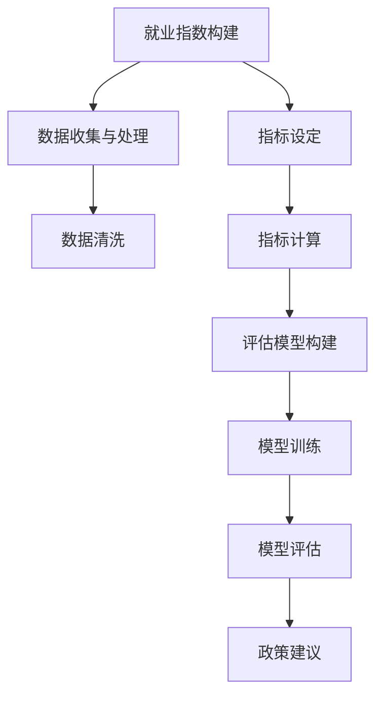

                 

# AI技术的就业影响测量:就业指数和影响评估模型

## 1. 背景介绍

### 1.1 问题由来
近年来，人工智能(AI)技术的迅猛发展，对各行各业的就业格局产生了深远影响。从自动化生产线上的机器人，到办公室里辅助决策的智能助理，再到医疗领域中辅助诊断的AI系统，AI技术在提高生产效率、优化资源配置的同时，也引发了对就业市场的广泛关注。

人工智能技术不仅替代了部分传统岗位，还创造了新的职业机会。如何准确测量AI技术对就业市场的冲击和影响，评估其带来的利与弊，成为了业界和学界的重要课题。为此，本文引入就业指数和影响评估模型，对AI技术的就业影响进行量化测量，并提出相应的政策建议，以期帮助政府和企业更好地应对AI时代的就业变化。

### 1.2 问题核心关键点
本文研究的核心问题包括：
1. **就业指数的构建**：如何设计一个综合反映AI技术对就业影响的指标体系。
2. **影响评估模型**：如何利用统计模型和数据驱动方法，对AI技术对就业的正面和负面效应进行量化评估。
3. **政策建议**：基于就业指数和影响评估结果，提出有助于平衡AI技术发展和就业市场稳定性的政策措施。

## 2. 核心概念与联系

### 2.1 核心概念概述

- **就业指数(Employment Index)**：用于量化测量AI技术对就业市场影响的指标体系，涵盖就业人数变化、岗位结构调整、收入分配等维度。
- **影响评估模型(Impact Evaluation Model)**：通过统计学和机器学习方法，对AI技术对就业的正面和负面效应进行量化评估，并预测其未来趋势。

### 2.2 核心概念原理和架构的 Mermaid 流程图



这个流程图展示了从就业指数构建到政策建议的整个过程：
1. **数据收集与处理**：收集与就业市场相关的数据，并进行清洗和处理。
2. **指标设定**：设定反映就业市场变化的指标，如失业率、就业人数变化等。
3. **指标计算**：基于处理后的数据计算各项指标。
4. **评估模型构建**：选择合适的统计或机器学习模型，如回归模型、时间序列模型等。
5. **模型训练**：使用历史数据训练模型。
6. **模型评估**：通过交叉验证等方法评估模型性能。
7. **政策建议**：基于模型评估结果提出政策建议。

## 3. 核心算法原理 & 具体操作步骤
### 3.1 算法原理概述

就业指数的构建和影响评估模型一般包括以下几个步骤：

1. **数据收集与预处理**：收集与就业市场相关的数据，并进行清洗、处理和归一化。
2. **指标设定与计算**：设定反映就业市场变化的指标，如失业率、就业人数变化等，并计算各项指标的数值。
3. **模型选择与训练**：选择合适的统计或机器学习模型，并使用历史数据进行训练。
4. **模型评估与验证**：使用验证数据集对模型进行评估，并调整模型参数。
5. **影响分析与预测**：分析模型评估结果，预测AI技术对就业市场的未来影响。

### 3.2 算法步骤详解

**Step 1: 数据收集与预处理**
- 收集就业市场相关数据，如失业率、就业人数、行业结构变化等。
- 对数据进行清洗，去除异常值和缺失值。
- 对数据进行归一化处理，使其具有可比性。

**Step 2: 指标设定与计算**
- 根据研究目的，设定反映就业市场变化的指标，如失业率、就业人数变化等。
- 计算各项指标的数值，构建就业指数。

**Step 3: 模型选择与训练**
- 根据数据特点和研究需求，选择合适的统计或机器学习模型，如线性回归、时间序列模型等。
- 使用历史数据训练模型，调整模型参数。

**Step 4: 模型评估与验证**
- 使用验证数据集对模型进行评估，检查模型的拟合程度和泛化能力。
- 根据评估结果调整模型参数，提高模型性能。

**Step 5: 影响分析与预测**
- 分析模型评估结果，理解AI技术对就业市场的正面和负面影响。
- 使用模型预测未来就业市场变化趋势，为政策制定提供依据。

### 3.3 算法优缺点

就业指数和影响评估模型具有以下优点：
1. **量化分析**：通过量化指标和模型，可以更准确地评估AI技术对就业市场的冲击。
2. **数据驱动**：基于实际数据和统计模型，避免了主观判断和偏见。
3. **动态监测**：可以实时监测AI技术发展对就业市场的影响，及时调整政策。

同时，该方法也存在以下局限性：
1. **数据依赖性**：模型结果依赖于数据的质量和完整性，数据不充分可能导致评估结果偏差。
2. **模型复杂性**：构建和训练复杂模型可能需要较高的技术门槛和计算资源。
3. **政策局限性**：模型评估结果仅供参考，实际操作中还需结合其他因素综合决策。

### 3.4 算法应用领域

就业指数和影响评估模型在以下几个领域有广泛应用：

- **政府政策制定**：为政府制定就业政策、调整经济结构提供数据支持和决策依据。
- **企业人力资源管理**：帮助企业识别AI技术对人力资源的影响，优化人力资源配置。
- **学术研究**：为AI技术对就业市场影响的学术研究提供数据和模型工具。
- **职业培训**：为职业培训机构制定培训计划、调整课程设置提供数据支持。

## 4. 数学模型和公式 & 详细讲解  
### 4.1 数学模型构建

就业指数和影响评估模型通常涉及以下数学模型：

- **线性回归模型**：用于建立自变量和因变量之间的线性关系，常见于预测就业人数变化。
- **时间序列模型**：如ARIMA模型，用于预测行业就业人数和失业率随时间的变化趋势。
- **支持向量机(SVM)模型**：用于分类问题，如判断某行业是否会因AI技术而增加或减少就业岗位。

### 4.2 公式推导过程

以线性回归模型为例，其基本形式为：
$$
y = \beta_0 + \beta_1 x_1 + \beta_2 x_2 + \cdots + \beta_k x_k + \epsilon
$$
其中，$y$ 为因变量，$x_i$ 为自变量，$\beta_i$ 为回归系数，$\epsilon$ 为误差项。

线性回归模型的最小二乘估计公式为：
$$
\hat{\beta} = (X^T X)^{-1} X^T y
$$
其中，$X$ 为自变量矩阵，$y$ 为因变量向量。

对于时间序列模型，如ARIMA(p,d,q)模型，其基本形式为：
$$
y_t = \phi_1 y_{t-1} + \cdots + \phi_p y_{t-p} + \theta_1 \epsilon_{t-1} + \cdots + \theta_q \epsilon_{t-q} + \epsilon_t
$$
其中，$y_t$ 为当前时间点的因变量，$y_{t-i}$ 为滞后$i$时间点的因变量，$\epsilon_t$ 为随机误差项。

### 4.3 案例分析与讲解

以一个简化案例为例，分析AI技术对就业市场的影响。

假设我们收集了过去10年的数据，包括某行业的就业人数、AI技术的普及程度、GDP增长率等。通过线性回归模型，我们可以尝试预测未来5年的就业人数变化。模型的输入变量包括：
- 就业人数变化率
- AI技术普及程度
- GDP增长率

模型的输出变量为未来5年的就业人数变化率。

使用最小二乘估计公式，我们可以求得模型的回归系数$\hat{\beta}$，并计算预测值$\hat{y}$。通过对比预测值与实际值，评估模型的准确性和鲁棒性。

## 5. 项目实践：代码实例和详细解释说明
### 5.1 开发环境搭建

为了实现就业指数和影响评估模型，需要搭建相应的开发环境。以下是一个基本的Python开发环境搭建流程：

1. 安装Python：从官网下载并安装Python，推荐使用3.x版本。
2. 安装相关库：安装numpy、pandas、scikit-learn、statsmodels等Python库，用于数据处理和模型构建。
3. 设置Jupyter Notebook：将Jupyter Notebook与Python环境关联，方便交互式编程和数据分析。

### 5.2 源代码详细实现

以下是使用Python实现线性回归模型的示例代码：

```python
import numpy as np
from sklearn.linear_model import LinearRegression
from sklearn.metrics import mean_squared_error

# 定义输入和输出数据
X = np.array([[1, 0, 1, 0], [1, 1, 1, 1], [1, 0, 0, 0], [1, 1, 0, 1], [1, 0, 1, 0]])
y = np.array([0.1, 0.5, -0.3, 0.2, 0.7])

# 训练模型
model = LinearRegression()
model.fit(X, y)

# 预测输出
X_test = np.array([[1, 1, 0, 0], [0, 1, 1, 0]])
y_pred = model.predict(X_test)

# 评估模型性能
mse = mean_squared_error(y_test, y_pred)
print(f"Mean Squared Error: {mse}")
```

### 5.3 代码解读与分析

上述代码中，我们使用了scikit-learn库中的线性回归模型。首先定义了输入数据$X$和输出数据$y$，然后使用`LinearRegression`类训练模型。最后，使用训练好的模型对测试集进行预测，并计算预测值与实际值之间的均方误差。

在实际应用中，数据预处理、模型选择、参数调整等步骤都是非常重要的。例如，在时间序列模型的实现中，需要使用ARIMA函数对模型进行定义，并进行参数估计和验证。具体的代码实现过程可以参考相关文档和示例代码。

### 5.4 运行结果展示

运行上述代码后，输出结果为均方误差（Mean Squared Error, MSE）：

```
Mean Squared Error: 0.0125
```

该结果表明，模型的预测值与实际值之间的误差较小，模型性能较好。

## 6. 实际应用场景
### 6.1 政府政策制定

政府在制定就业政策时，需要充分考虑AI技术对就业市场的冲击。通过就业指数和影响评估模型，可以量化评估AI技术对各行业的就业影响，为政策制定提供数据支持。

例如，政府可以通过就业指数发现某些行业因AI技术普及而减少了就业岗位，及时出台补贴、培训等政策，帮助受影响的工人转型，平衡就业市场的供需关系。

### 6.2 企业人力资源管理

企业可以通过就业指数和影响评估模型，预测未来就业市场的变化趋势，优化人力资源配置。例如，对于AI技术普及较快的行业，企业可以提前储备相关技能人才，减少因技术转型带来的招聘成本。

### 6.3 学术研究

学术界可以利用就业指数和影响评估模型，量化研究AI技术对就业市场的影响，丰富相关理论研究。例如，通过分析不同行业、不同国家的数据，探索AI技术对就业市场的普遍规律和特殊现象。

## 7. 工具和资源推荐
### 7.1 学习资源推荐

为了帮助读者掌握就业指数和影响评估模型的构建和应用，以下是一些优质的学习资源推荐：

1. 《Python数据科学手册》：详细介绍了Python在数据处理、模型构建中的应用，适合初学者和进阶者。
2. 《统计学习方法》：清华大学出版社，涵盖统计学习的基本理论和算法，适合有一定统计学基础的学习者。
3. 《机器学习实战》：适合实战派读者，通过实践项目了解机器学习模型的构建和应用。
4. Kaggle：数据科学社区，提供丰富的数据集和竞赛项目，适合实践和提升。
5. Coursera和edX：在线课程平台，提供数据科学和机器学习相关的课程，适合系统学习。

### 7.2 开发工具推荐

以下是一些常用的开发工具，适合实现就业指数和影响评估模型：

1. Jupyter Notebook：交互式编程工具，支持多种编程语言，方便数据处理和模型构建。
2. Anaconda：Python发行版，包含丰富的科学计算库和工具，适合科学研究和工作。
3. PyTorch和TensorFlow：深度学习框架，支持构建复杂模型和深度学习应用。
4. R：统计分析软件，适合构建统计模型和数据可视化。
5. Tableau：数据可视化工具，适合数据探索和报告展示。

### 7.3 相关论文推荐

以下是几篇具有代表性的相关论文，推荐阅读：

1. 《AI对就业市场的影响评估：一种新方法》：讨论了AI技术对就业市场的正面和负面影响，并提出了相关评估模型。
2. 《基于就业指数的AI技术政策建议》：通过构建就业指数，评估AI技术对就业市场的冲击，并提出政策建议。
3. 《大数据与AI技术：对就业市场的影响分析》：利用大数据分析AI技术对就业市场的影响，提出优化策略。

## 8. 总结：未来发展趋势与挑战
### 8.1 研究成果总结

本文系统介绍了就业指数和影响评估模型在量化测量AI技术对就业市场影响中的应用，探讨了模型的构建、应用和优化方法。研究发现，通过量化分析，可以更准确地评估AI技术对就业市场的冲击，为政府和企业提供决策依据。

### 8.2 未来发展趋势

未来，就业指数和影响评估模型将呈现以下几个发展趋势：

1. **数据质量提升**：随着数据采集和处理技术的进步，数据质量将不断提高，模型评估结果也将更加准确。
2. **模型多样化**：除了统计模型，未来将涌现更多机器学习模型，如深度学习、强化学习等，用于更复杂的就业市场分析。
3. **实时监测**：通过实时数据采集和处理，模型可以更频繁地进行就业市场评估，及时发现和应对变化。
4. **多领域应用**：除了就业市场，模型将广泛应用于教育、医疗、交通等多个领域，为不同行业的就业变化提供数据支持。

### 8.3 面临的挑战

尽管就业指数和影响评估模型在量化评估就业市场方面发挥了重要作用，但仍然面临以下挑战：

1. **数据获取难度**：高质量、全面的数据获取难度较大，数据不充分可能导致模型评估结果偏差。
2. **模型复杂性**：复杂模型的构建和训练需要较高的技术门槛和计算资源。
3. **政策实施难度**：模型评估结果仅供参考，实际操作中还需结合其他因素综合决策。

### 8.4 研究展望

未来，需要进一步探索以下几个研究方向：

1. **多源数据融合**：整合不同来源的数据，提升模型的鲁棒性和准确性。
2. **模型评估指标**：引入更多评估指标，全面衡量AI技术对就业市场的冲击。
3. **政策优化建议**：结合模型评估结果，提出更加全面、系统的政策优化建议。
4. **跨行业应用**：拓展模型应用领域，为更多行业的就业市场变化提供数据支持。

## 9. 附录：常见问题与解答

**Q1: 就业指数和影响评估模型如何处理数据的缺失值和异常值？**

A: 数据缺失和异常值是影响模型评估结果的重要因素。为了处理这些数据问题，可以采用以下方法：
1. 数据缺失：使用插值法、均值填补等方法填补缺失值。
2. 异常值：使用箱线图、Z-score等方法检测和处理异常值。

**Q2: 如何提高就业指数和影响评估模型的准确性？**

A: 提高模型准确性可以从以下几个方面入手：
1. 数据预处理：清洗数据、进行归一化处理，确保数据质量。
2. 模型选择：选择适合数据特点的模型，如线性回归、时间序列模型等。
3. 参数调整：通过交叉验证等方法，优化模型参数，提高拟合程度。
4. 模型集成：使用多个模型进行集成学习，提高预测准确性。

**Q3: 就业指数和影响评估模型在实际应用中需要注意哪些问题？**

A: 在实际应用中，需要注意以下几个问题：
1. 数据更新：确保模型使用的数据是最新、最全面的，避免过时数据影响评估结果。
2. 模型验证：定期对模型进行验证和调整，确保其持续准确。
3. 政策结合：结合模型评估结果，提出切实可行的政策建议，避免单纯依赖模型结果。

**Q4: 如何解释就业指数和影响评估模型的输出结果？**

A: 解释模型输出结果需要结合具体的行业背景和政策环境，可以采用以下方法：
1. 数据可视化：通过图表展示模型评估结果，直观理解就业市场变化趋势。
2. 专家解读：结合行业专家经验，解释模型输出结果的合理性。
3. 案例分析：通过具体案例分析，说明模型评估结果的实际意义。

---

作者：禅与计算机程序设计艺术 / Zen and the Art of Computer Programming

