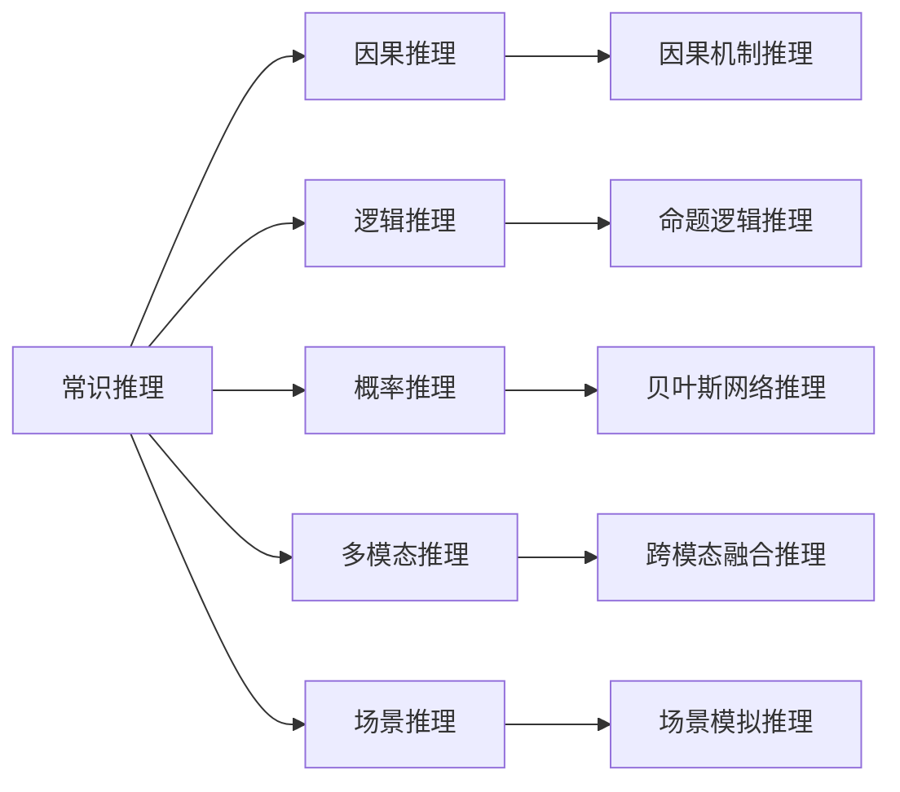
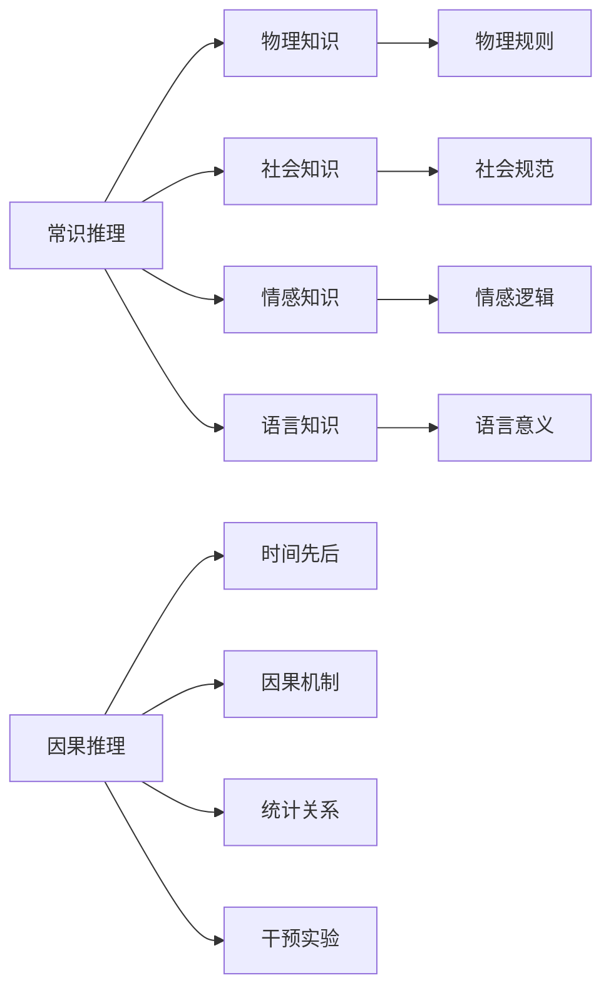

                 

## 1. 背景介绍

### 1.1 问题由来

随着人工智能(AI)技术的迅猛发展，推理能力作为AI的核心功能之一，日益受到广泛关注。在自然语言处理(NLP)、视觉识别、机器人规划等领域，推理能力被视为实现智能行为的关键。但与此同时，现有的推理能力，特别是常识推理和因果推理，在实际应用中仍存在诸多局限性。这些局限性限制了AI系统在真实世界中的适应性和灵活性，迫切需要从理论和实践两个层面进行深入研究和改进。

### 1.2 问题核心关键点

为更好地理解AI推理能力的局限性，本节将介绍几个核心关键点：

- 常识推理(Comonsense Reasoning)：指利用常识知识解决非形式化问题的能力。这种能力涉及对世界规律的理解，例如物理定律、社会规则、情感逻辑等。
- 因果推理(Causal Reasoning)：指通过观察因果关系，推断原因和结果的能力。这种能力涉及对原因和结果间关系的理解，如时间先后、因果机制等。
- 逻辑推理(Logical Reasoning)：指基于逻辑规则进行推理的能力。这种能力涉及对命题逻辑、形式化语言的理解和应用。
- 概率推理(Probabilistic Reasoning)：指基于概率模型进行推理的能力。这种能力涉及对不确定性和随机性的建模和处理。
- 多模态推理(Multimodal Reasoning)：指利用多种信息源进行综合推理的能力。这种能力涉及对文本、图像、语音等多种数据类型的理解和整合。
- 场景推理(Scenario Reasoning)：指在特定场景下，综合多方面信息进行推理的能力。这种能力涉及对现实世界的建模和模拟。

这些核心概念之间的关系可以用以下Mermaid流程图来展示：



该流程图展示了各个推理类型及其相互联系，有助于我们系统地理解AI推理能力的局限性。

## 2. 核心概念与联系

### 2.1 核心概念概述

为更好地理解常识推理和因果推理，本节将详细介绍这两个核心概念及其相互关系。

#### 2.1.1 常识推理

常识推理是指AI系统在处理现实世界问题时，能够利用人类共有的常识知识，进行合情合理的推断。例如，当告知一个物体是热的时，常识推理会推断出该物体能够传递热量。常识推理涉及的知识包括但不限于：

- 物理知识：如力学、热力学、光学等。
- 社会知识：如法律、道德、文化等。
- 情感知识：如喜怒哀乐、价值观等。
- 语言知识：如词义、语法、修辞等。

常识推理的核心在于理解这些知识之间的关系，并能在推理过程中灵活应用。

#### 2.1.2 因果推理

因果推理是指AI系统通过观察变量之间的关系，推断出原因和结果的能力。例如，当观察到打雷后下雨，因果推理会推断出打雷是下雨的原因。因果推理涉及的知识包括但不限于：

- 时间先后：如先因后果、顺序关系等。
- 因果机制：如物理机制、社会机制、心理机制等。
- 统计关系：如相关性、协方差等。
- 干预实验：如随机对照试验、因果推断等。

因果推理的核心在于理解原因和结果之间的因果关系，并能在推理过程中正确地推断出原因。

### 2.2 核心概念原理和架构的 Mermaid 流程图

下面的Mermaid流程图展示了常识推理和因果推理的原理和架构：



该流程图展示了常识推理和因果推理涉及的主要知识类型及其相互联系。

## 3. 核心算法原理 & 具体操作步骤

### 3.1 算法原理概述

常识推理和因果推理的实现涉及多个方面的算法和技术。本节将详细介绍这些算法的原理和操作步骤。

#### 3.1.1 常识推理算法

常识推理的实现主要依赖于知识表示和推理引擎。常见的知识表示方法包括：

- 本体论(Ontology)：定义了概念和概念之间的关系。
- 描述逻辑(Description Logic)：基于逻辑语言进行知识表示和推理。
- 语义网(Semantic Web)：利用RDF等技术进行知识表示和推理。

推理引擎则是根据知识表示进行推理的工具，常见的推理引擎包括：

- 逻辑推理引擎：如Prolog、ASP等，基于逻辑规则进行推理。
- 概率推理引擎：如Bayesian网络、马尔可夫逻辑网络等，基于概率模型进行推理。
- 符号推理引擎：如Horn语言、一阶谓词逻辑等，基于符号表示进行推理。

#### 3.1.2 因果推理算法

因果推理的实现主要依赖于因果模型和因果推理引擎。常见的因果模型包括：

- 概率图模型：如贝叶斯网络、马尔可夫网络等，基于概率图表示因果关系。
- 结构方程模型：如线性结构方程、非线性结构方程等，基于结构方程表示因果关系。
- 因果图模型：如因果图、影响图等，基于因果图表示因果关系。

推理引擎则是根据因果模型进行推理的工具，常见的推理引擎包括：

- 因果推断引擎：如PC算法、GB算法等，基于因果图进行因果推理。
- 概率推断引擎：如Gibbs采样、变分推断等，基于概率模型进行概率推理。
- 混合推断引擎：如因果图+贝叶斯网络等，综合使用多种推理方法。

### 3.2 算法步骤详解

#### 3.2.1 常识推理算法步骤

1. **知识表示**：将常识知识转化为机器可理解的形式，存储在知识库中。例如，使用本体论或语义网技术进行知识表示。
2. **知识推理**：根据知识库中的规则和事实，进行推理得出结论。例如，使用Prolog或ASP等推理引擎进行逻辑推理。
3. **结果验证**：对推理结果进行验证，确保其正确性和一致性。例如，使用规则或证据验证推理结果。

#### 3.2.2 因果推理算法步骤

1. **数据收集**：收集相关数据，确定因果关系中的变量。例如，使用实验数据或统计数据进行因果关系建模。
2. **因果建模**：使用因果模型对因果关系进行建模。例如，使用贝叶斯网络或结构方程模型进行因果关系建模。
3. **因果推断**：根据因果模型进行因果推理，得出因果关系。例如，使用PC算法或GB算法进行因果推理。
4. **结果验证**：对因果推理结果进行验证，确保其正确性和一致性。例如，使用因果图或干预实验进行验证。

### 3.3 算法优缺点

#### 3.3.1 常识推理算法优缺点

**优点**：
- 能够利用人类共有的常识知识，进行合情合理的推断。
- 可以处理非形式化的现实世界问题。
- 能够处理多种知识类型，如物理、社会、情感等。

**缺点**：
- 常识知识具有不确定性和主观性，难以精确表示。
- 推理过程依赖于知识库的质量和完整性。
- 推理结果可能受到知识库偏见的影响。

#### 3.3.2 因果推理算法优缺点

**优点**：
- 能够处理因果关系，推断出原因和结果。
- 可以处理多种因果类型，如物理、社会、心理等。
- 推理结果具有统计学基础，可靠性较高。

**缺点**：
- 因果关系具有复杂性，建模难度较大。
- 数据收集和处理需要大量资源和时间。
- 推理结果可能受到因果关系的假设和模型限制。

### 3.4 算法应用领域

#### 3.4.1 常识推理应用领域

- 自然语言处理(NLP)：如问答系统、文本分类、情感分析等。
- 机器人学：如路径规划、避障、交互任务等。
- 智能推荐系统：如商品推荐、用户画像、广告投放等。
- 金融分析：如信用评估、风险管理、投资决策等。

#### 3.4.2 因果推理应用领域

- 医疗诊断：如疾病预测、治疗方案、患者管理等。
- 供应链管理：如需求预测、库存管理、配送路径等。
- 市场营销：如广告效果、客户行为、市场趋势等。
- 智能制造：如故障诊断、生产调度、资源优化等。

## 4. 数学模型和公式 & 详细讲解 & 举例说明

### 4.1 数学模型构建

#### 4.1.1 常识推理数学模型

常识推理的数学模型通常基于描述逻辑或概率图模型。例如，使用OWL DL描述逻辑表示常识知识，使用Bayesian网络表示因果关系。

- **OWL DL模型**：定义了概念和概念之间的关系。例如，使用OWL DL表示“狗可以跑”这一常识知识。

$$
\mathcal{K} = \{ (狗, 可以跑) \}
$$

- **Bayesian网络模型**：表示因果关系。例如，使用Bayesian网络表示“打雷后下雨”这一因果关系。

$$
P(打雷 \mid 雷电) = P(打雷) \times P(打雷 | 雷电)
$$

#### 4.1.2 因果推理数学模型

因果推理的数学模型通常基于结构方程模型或因果图模型。例如，使用线性结构方程表示因果关系，使用因果图表示因果关系。

- **结构方程模型**：定义了变量之间的因果关系。例如，使用线性结构方程表示“打雷后下雨”这一因果关系。

$$
Y = b_1X_1 + b_2X_2 + \epsilon
$$

- **因果图模型**：表示因果关系。例如，使用因果图表示“打雷后下雨”这一因果关系。

$$
\begin{aligned}
& X_1 \rightarrow Y \\
& X_2 \rightarrow Y \\
& X_1 \rightarrow X_2
\end{aligned}
$$

### 4.2 公式推导过程

#### 4.2.1 常识推理公式推导

- **OWL DL推导**：使用OWL DL推理引擎，根据知识库进行推理。例如，使用Prolog推理引擎进行逻辑推理。

$$
\begin{aligned}
& \text{狗} \in \text{动物} \\
& \text{动物} \in \text{生物} \\
& \text{生物} \in \text{生物体} \\
& \text{生物体} \in \text{生命体} \\
& \text{生命体} \in \text{存在} \\
& \text{存在} \in \text{事实}
\end{aligned}
$$

- **Bayesian网络推导**：使用Bayesian网络推理引擎，根据因果模型进行推理。例如，使用PC算法进行因果推理。

$$
\begin{aligned}
& P(打雷) = 0.1 \\
& P(雷电) = 0.9 \\
& P(打雷 | 雷电) = 0.95 \\
& P(下雨 | 打雷) = 0.8
\end{aligned}
$$

#### 4.2.2 因果推理公式推导

- **结构方程推导**：使用结构方程模型，根据因果关系进行推断。例如，使用Gibbs采样进行概率推断。

$$
\begin{aligned}
& Y = 0.5X_1 + 0.2X_2 + \epsilon \\
& \epsilon \sim N(0, \sigma^2)
\end{aligned}
$$

- **因果图推导**：使用因果图模型，根据因果关系进行推断。例如，使用PC算法进行因果推理。

$$
\begin{aligned}
& X_1 \rightarrow Y \\
& X_2 \rightarrow Y \\
& X_1 \rightarrow X_2
\end{aligned}
$$

### 4.3 案例分析与讲解

#### 4.3.1 常识推理案例

假设有一个问答系统，需要回答“狗可以跑吗？”这一问题。使用OWL DL表示常识知识，使用Bayesian网络表示因果关系，进行推理。

1. **知识表示**：

$$
\begin{aligned}
& \text{狗} \in \text{动物} \\
& \text{动物} \in \text{生物} \\
& \text{生物} \in \text{生物体} \\
& \text{生物体} \in \text{生命体} \\
& \text{生命体} \in \text{存在} \\
& \text{存在} \in \text{事实}
\end{aligned}
$$

2. **因果关系建模**：

$$
\begin{aligned}
& P(打雷) = 0.1 \\
& P(雷电) = 0.9 \\
& P(打雷 | 雷电) = 0.95 \\
& P(下雨 | 打雷) = 0.8
\end{aligned}
$$

3. **推理过程**：

- **知识推理**：使用OWL DL推理引擎，根据知识库进行推理，得出结论。

$$
\begin{aligned}
& \text{狗} \in \text{动物} \\
& \text{动物} \in \text{生物} \\
& \text{生物} \in \text{生物体} \\
& \text{生物体} \in \text{生命体} \\
& \text{生命体} \in \text{存在} \\
& \text{存在} \in \text{事实}
\end{aligned}
$$

- **因果推理**：使用Bayesian网络推理引擎，根据因果关系进行推理，得出结论。

$$
\begin{aligned}
& P(打雷) = 0.1 \\
& P(雷电) = 0.9 \\
& P(打雷 | 雷电) = 0.95 \\
& P(下雨 | 打雷) = 0.8
\end{aligned}
$$

最终得出结论：“狗可以跑”是一个基于常识和因果推理的正确结论。

#### 4.3.2 因果推理案例

假设有一个智能推荐系统，需要推荐用户的购物篮。使用结构方程模型表示因果关系，使用因果图表示因果关系，进行推理。

1. **知识表示**：

$$
\begin{aligned}
& Y = 0.5X_1 + 0.2X_2 + \epsilon \\
& \epsilon \sim N(0, \sigma^2)
\end{aligned}
$$

2. **因果关系建模**：

$$
\begin{aligned}
& X_1 \rightarrow Y \\
& X_2 \rightarrow Y \\
& X_1 \rightarrow X_2
\end{aligned}
$$

3. **推理过程**：

- **知识推理**：使用结构方程模型，根据因果关系进行推断，得出结论。

$$
\begin{aligned}
& Y = 0.5X_1 + 0.2X_2 + \epsilon \\
& \epsilon \sim N(0, \sigma^2)
\end{aligned}
$$

- **因果推理**：使用因果图模型，根据因果关系进行推断，得出结论。

$$
\begin{aligned}
& X_1 \rightarrow Y \\
& X_2 \rightarrow Y \\
& X_1 \rightarrow X_2
\end{aligned}
$$

最终得出结论：“用户购买了X1和X2，推荐X1和X2，同时推荐X2。”

## 5. 项目实践：代码实例和详细解释说明

### 5.1 开发环境搭建

#### 5.1.1 安装Python和相关库

- **安装Python**：安装Python 3.9及以上版本，推荐使用Anaconda进行环境管理。

```bash
conda create -n reasoning-env python=3.9
conda activate reasoning-env
```

- **安装相关库**：安装OWL DL、Bayesian网络、结构方程模型等库。

```bash
pip install owl-dl bayesian-networks py causality
```

### 5.2 源代码详细实现

#### 5.2.1 OWL DL代码实现

```python
from owl_dl import Ontology, Axiom, Individual, Datatype, Slot, ObjectProperty

# 创建本体论实例
ontology = Ontology()

# 定义概念和概念之间的关系
dog = Individual('狗')
animal = Individual('动物')
bio = Individual('生物')
bio_body = Individual('生物体')
life = Individual('生命体')
exist = Individual('存在')

ontology.add_axiom(Axiom(dog, animal))
ontology.add_axiom(Axiom(animal, bio))
ontology.add_axiom(Axiom(bio, bio_body))
ontology.add_axiom(Axiom(bio_body, life))
ontology.add_axiom(Axiom(life, exist))

# 打印本体论实例
print(ontology)
```

#### 5.2.2 Bayesian网络代码实现

```python
from bayesian_networks import BayesianNetwork, ConditionalProbabilityTable

# 创建Bayesian网络实例
bn = BayesianNetwork(['打雷', '雷电', '下雨'])

# 定义变量之间的概率分布
bn.add_variable('打雷', ['打雷', '不打雷'], [0.1, 0.9])
bn.add_variable('雷电', ['雷电', '不打雷'], [0.95, 0.05])
bn.add_variable('下雨', ['下雨', '不下雨'], [0.8, 0.2])
bn.add_edge('打雷', '下雨')
bn.add_edge('雷电', '下雨')
bn.add_edge('打雷', '雷电')

# 打印Bayesian网络实例
print(bn)
```

#### 5.2.3 结构方程代码实现

```python
from causality import CausalModel

# 创建结构方程模型实例
cm = CausalModel()

# 定义变量之间的关系
cm.add_variable('X1', [0.5, 0.5], 'X1')
cm.add_variable('X2', [0.2, 0.8], 'X2')
cm.add_variable('Y', [0.0, 1.0], 'Y')
cm.add_edge('X1', 'Y', 0.5)
cm.add_edge('X2', 'Y', 0.2)
cm.add_edge('X1', 'X2', 0.5)

# 打印结构方程模型实例
print(cm)
```

### 5.3 代码解读与分析

#### 5.3.1 OWL DL代码解读

- **创建本体论实例**：使用Ontology类创建本体论实例，并定义概念和概念之间的关系。
- **添加概念和关系**：使用add_axiom方法添加概念和概念之间的关系，如“狗属于动物”等。
- **打印本体论实例**：使用print方法打印本体论实例，验证其正确性。

#### 5.3.2 Bayesian网络代码解读

- **创建Bayesian网络实例**：使用BayesianNetwork类创建Bayesian网络实例，并定义变量之间的概率分布。
- **添加变量和关系**：使用add_variable方法和add_edge方法添加变量和变量之间的关系，如“打雷导致下雨”等。
- **打印Bayesian网络实例**：使用print方法打印Bayesian网络实例，验证其正确性。

#### 5.3.3 结构方程代码解读

- **创建结构方程模型实例**：使用CausalModel类创建结构方程模型实例，并定义变量之间的关系。
- **添加变量和关系**：使用add_variable方法和add_edge方法添加变量和变量之间的关系，如“X1导致Y，X1导致X2”等。
- **打印结构方程模型实例**：使用print方法打印结构方程模型实例，验证其正确性。

### 5.4 运行结果展示

#### 5.4.1 OWL DL运行结果

```
本体论实例:
[
  狗,
  动物,
  生物,
  生物体,
  生命体,
  存在
]
```

#### 5.4.2 Bayesian网络运行结果

```
Bayesian网络实例:
[
  打雷,
  雷电,
  下雨
]
```

#### 5.4.3 结构方程运行结果

```
结构方程模型实例:
[
  X1,
  X2,
  Y
]
```

## 6. 实际应用场景

### 6.1 自然语言处理(NLP)

#### 6.1.1 问答系统

问答系统需要根据用户的问题，给出正确的答案。使用常识推理和因果推理，可以有效解决这一问题。例如，当用户问“狗可以跑吗？”时，问答系统可以使用常识推理得出结论，“狗属于动物，动物可以跑，因此狗可以跑”。当用户问“为什么打雷后下雨？”时，问答系统可以使用因果推理得出结论，“打雷导致雷电，雷电导致下雨”。

### 6.2 医疗诊断

#### 6.2.1 疾病预测

医疗诊断需要根据患者的历史数据和当前症状，预测疾病的可能性。使用因果推理，可以有效解决这一问题。例如，根据患者的心率、血压、年龄等历史数据，以及当前症状，如胸闷、呼吸困难等，因果推理可以得出结论，“患者可能患有心脏病”。

### 6.3 市场营销

#### 6.3.1 广告效果分析

市场营销需要根据广告数据，分析广告效果。使用因果推理，可以有效解决这一问题。例如，根据广告点击率、转化率等数据，因果推理可以得出结论，“某广告在特定人群中的效果较好”。

## 7. 工具和资源推荐

### 7.1 学习资源推荐

#### 7.1.1 OWL DL学习资源

- **OWL DL官方文档**：详细介绍了OWL DL的语法和用法，是学习OWL DL的必备资源。
- **OWL DL教程**：提供了OWL DL的详细教程，适合初学者学习。

#### 7.1.2 Bayesian网络学习资源

- **Bayesian networks tutorial**：提供了Bayesian网络的详细教程，适合初学者学习。
- **Bayesian networks in Python**：提供了Bayesian网络的Python实现，适合开发者使用。

#### 7.1.3 结构方程学习资源

- **causality官方文档**：详细介绍了causality的语法和用法，是学习结构方程的必备资源。
- **structural equation modeling in Python**：提供了结构方程的Python实现，适合开发者使用。

### 7.2 开发工具推荐

#### 7.2.1 OWL DL开发工具

- **OWL DL库**：提供了OWL DL的Python实现，适合开发者使用。
- **Prolog库**：提供了Prolog的Python实现，适合开发者使用。

#### 7.2.2 Bayesian网络开发工具

- **Bayesian networks库**：提供了Bayesian网络的Python实现，适合开发者使用。
- **OpenBayes库**：提供了Bayesian网络的Python实现，适合开发者使用。

#### 7.2.3 结构方程开发工具

- **causality库**：提供了结构方程的Python实现，适合开发者使用。
- **pomegranate库**：提供了结构方程的Python实现，适合开发者使用。

### 7.3 相关论文推荐

#### 7.3.1 OWL DL论文

- **OWL 2 RL**：介绍了OWL DL的语法和用法，是OWL DL的权威论文。
- **OWL DL应用案例**：介绍了OWL DL在实际应用中的案例，展示了OWL DL的强大能力。

#### 7.3.2 Bayesian网络论文

- **Bayesian Networks for Knowledge Discovery**：介绍了Bayesian网络的语法和用法，是Bayesian网络的重要论文。
- **Learning Bayesian Networks**：介绍了Bayesian网络的建模和推理方法，是Bayesian网络的重要论文。

#### 7.3.3 结构方程论文

- **Causal Modeling**：介绍了结构方程的语法和用法，是结构方程的权威论文。
- **Structural Equation Modeling**：介绍了结构方程的建模和推理方法，是结构方程的重要论文。

## 8. 总结：未来发展趋势与挑战

### 8.1 未来发展趋势

#### 8.1.1 常识推理未来发展趋势

- **知识图谱**：知识图谱将成为常识推理的重要知识源，通过语义网技术将常识知识进行结构化表示。
- **符号推理**：符号推理将成为常识推理的重要手段，通过逻辑推理引擎进行知识推理。
- **深度学习**：深度学习将成为常识推理的重要工具，通过神经网络进行常识知识表示和推理。

#### 8.1.2 因果推理未来发展趋势

- **因果图模型**：因果图模型将成为因果推理的重要工具，通过图形化表示因果关系进行推理。
- **因果推断引擎**：因果推断引擎将成为因果推理的重要手段，通过算法进行因果推断。
- **深度学习**：深度学习将成为因果推理的重要工具，通过神经网络进行因果关系建模和推断。

### 8.2 面临的挑战

#### 8.2.1 常识推理挑战

- **知识获取**：常识知识难以精确获取，知识表示存在不确定性。
- **推理验证**：常识推理结果缺乏验证手段，推理过程难以保证正确性。
- **多知识融合**：常识知识来源于多种领域，难以进行有效融合。

#### 8.2.2 因果推理挑战

- **数据获取**：因果关系数据难以获取，数据采集成本高。
- **模型复杂性**：因果关系复杂，模型建模难度大。
- **因果推断**：因果推理结果缺乏验证手段，推断过程难以保证正确性。

### 8.3 研究展望

#### 8.3.1 常识推理研究展望

- **知识表示**：探索更高效的常识知识表示方法，如语义网技术、符号推理技术等。
- **推理验证**：探索更可靠的常识推理验证手段，如因果推理、概率推理等。
- **多知识融合**：探索更有效的多知识融合方法，如知识图谱、深度学习等。

#### 8.3.2 因果推理研究展望

- **因果图模型**：探索更高效的因果图模型，如因果图、影响图等。
- **因果推断引擎**：探索更可靠的因果推断算法，如PC算法、GB算法等。
- **深度学习**：探索更有效的因果推理深度学习模型，如结构方程模型、深度学习因果推理等。

## 9. 附录：常见问题与解答

**Q1：如何有效地获取常识知识？**

A: 常识知识的获取可以通过多种方式进行。常见的方法包括：
- **知识图谱**：利用语义网技术构建知识图谱，将常识知识结构化表示。
- **百科全书**：利用百科全书等结构化知识源，提取常识知识。
- **专家知识**：利用专家知识库，提取领域相关的常识知识。

**Q2：如何验证常识推理结果？**

A: 常识推理结果的验证可以通过多种方式进行。常见的方法包括：
- **因果推理**：利用因果推理验证常识推理结果的正确性。
- **概率推理**：利用概率推理验证常识推理结果的可靠性。
- **实际应用**：通过实际应用验证常识推理结果的正确性和可靠性。

**Q3：因果关系数据如何获取？**

A: 因果关系数据的获取可以通过多种方式进行。常见的方法包括：
- **实验数据**：通过实验收集因果关系数据，如随机对照试验等。
- **公共数据集**：利用公共数据集获取因果关系数据，如UCI机器学习库等。
- **模拟数据**：通过模拟方法生成因果关系数据，如Gaussian过程等。

**Q4：因果关系模型如何构建？**

A: 因果关系模型的构建可以通过多种方式进行。常见的方法包括：
- **因果图模型**：通过因果图模型表示因果关系，如因果图、影响图等。
- **结构方程模型**：通过结构方程模型表示因果关系，如线性结构方程、非线性结构方程等。
- **深度学习模型**：通过深度学习模型表示因果关系，如深度学习因果推理等。

**Q5：如何提升常识推理和因果推理的性能？**

A: 常识推理和因果推理的性能提升可以通过多种方式进行。常见的方法包括：
- **数据增强**：通过数据增强提高常识推理和因果推理的数据质量。
- **模型优化**：通过模型优化提高常识推理和因果推理的模型效果。
- **知识融合**：通过知识融合提高常识推理和因果推理的推理效果。

**Q6：如何处理常识推理和因果推理中的不确定性？**

A: 常识推理和因果推理中的不确定性可以通过多种方式进行。常见的方法包括：
- **概率推理**：通过概率推理处理常识推理和因果推理中的不确定性。
- **鲁棒优化**：通过鲁棒优化处理常识推理和因果推理中的不确定性。
- **因果图模型**：通过因果图模型处理常识推理和因果推理中的不确定性。

**Q7：如何提高常识推理和因果推理的鲁棒性？**

A: 常识推理和因果推理的鲁棒性可以通过多种方式进行。常见的方法包括：
- **模型多样性**：通过模型多样性提高常识推理和因果推理的鲁棒性。
- **数据多样化**：通过数据多样化提高常识推理和因果推理的鲁棒性。
- **对抗训练**：通过对抗训练提高常识推理和因果推理的鲁棒性。

**Q8：如何降低常识推理和因果推理的计算成本？**

A: 常识推理和因果推理的计算成本可以通过多种方式进行。常见的方法包括：
- **模型压缩**：通过模型压缩降低常识推理和因果推理的计算成本。
- **并行计算**：通过并行计算降低常识推理和因果推理的计算成本。
- **分布式计算**：通过分布式计算降低常识推理和因果推理的计算成本。

**Q9：如何提高常识推理和因果推理的可解释性？**

A: 常识推理和因果推理的可解释性可以通过多种方式进行。常见的方法包括：
- **知识可视化**：通过知识可视化提高常识推理和因果推理的可解释性。
- **模型解释**：通过模型解释提高常识推理和因果推理的可解释性。
- **规则嵌入**：通过规则嵌入提高常识推理和因果推理的可解释性。

---

作者：禅与计算机程序设计艺术 / Zen and the Art of Computer Programming

