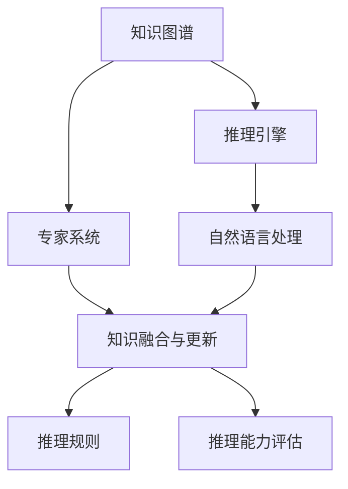

                 

# AI推理能力的工程实现:知识编码和推理引擎

> 关键词：人工智能,推理能力,知识工程,知识图谱,推理引擎,专家系统

## 1. 背景介绍

### 1.1 问题由来
随着人工智能技术的不断发展，推理能力成为了其核心竞争力之一。然而，实现高效可靠的推理能力并非易事，需要从理论到实践的系统性工程实现。知识编码与推理引擎作为人工智能推理能力的重要组成部分，其研究与工程实现具有深远的意义。

在人工智能的早期，专家系统是推理能力实现的主要手段，通过手工编码专家知识，利用规则推理技术实现推理过程。这种方法虽然具有高度的可解释性和可控性，但其开发成本高、知识更新困难，难以适应复杂的现实问题。

进入深度学习时代，神经网络模型通过学习大规模数据集中的隐含知识，在图像识别、自然语言处理等领域取得了显著成果。然而，传统的神经网络模型缺乏显式的知识表示和推理机制，无法处理复杂的符号逻辑推理问题。

基于此，知识编码与推理引擎的工程实现成为了人工智能推理能力突破的关键。通过构建知识图谱，将现实世界中的知识显式地编码为结构化的数据，结合先进的推理引擎技术，可以在更大规模、更复杂的问题上实现高效可靠的推理能力。

### 1.2 问题核心关键点
知识编码与推理引擎的研究与工程实现涉及以下几个核心关键点：

- 知识图谱构建：将现实世界中的知识转化为结构化的三元组数据，构建知识图谱。
- 推理引擎设计：构建高效、可扩展的推理引擎，支持不同类型的推理任务。
- 知识融合与更新：实现知识图谱的动态更新，融合新的知识以保持知识的实时性。
- 推理规则设计：设计合理的推理规则，确保推理过程的准确性和高效性。
- 推理能力评估：建立评估推理能力的方法，评估推理系统的性能和可靠性。

这些核心关键点构成了知识编码与推理引擎的基本框架，其研究与实现需要跨学科的合作，结合人工智能、数据库、自然语言处理、知识工程等多个领域的技术。

### 1.3 问题研究意义
知识编码与推理引擎的工程实现对于提升人工智能的推理能力具有重要意义：

- 增强知识表示与推理：通过知识图谱的构建和推理引擎的设计，使人工智能能够更加精准地表示和推理现实世界中的知识，解决复杂的符号逻辑推理问题。
- 推动跨领域应用：知识编码与推理引擎可以应用于多个领域，如医疗、金融、司法等，提升这些领域的信息处理能力和决策效率。
- 促进知识共享与协作：知识图谱和推理引擎为知识的共享与协作提供了新的平台，促进了跨领域、跨组织的知识交流和合作。
- 增强系统可解释性：推理过程的显式表示和可控推理规则，提高了人工智能系统的可解释性和透明性。
- 支持复杂问题的求解：知识编码与推理引擎能够处理复杂的非结构化数据和符号逻辑问题，提升系统的整体求解能力。

因此，对知识编码与推理引擎的研究与工程实现，不仅有助于提升人工智能的推理能力，还有助于推动人工智能技术在更广泛领域的实际应用。

## 2. 核心概念与联系

### 2.1 核心概念概述

为更好地理解知识编码与推理引擎的工程实现，本节将介绍几个密切相关的核心概念：

- 知识图谱(Knowledge Graph)：一种结构化的知识表示方式，通过实体、关系、属性等三元组数据描述现实世界中的知识。
- 推理引擎(Inference Engine)：一种软件系统，能够根据已知知识和推理规则，推导出新的知识。
- 专家系统(Expert System)：一种基于规则的推理系统，通过手工编码专家知识，解决特定领域的问题。
- 自然语言处理(Natural Language Processing, NLP)：通过计算机处理和理解人类语言的技术，通常用于知识图谱的构建和推理。
- 知识融合与更新(Knowledge Fusion and Update)：通过合并、更新等方式，保持知识图谱的时效性和准确性。
- 推理规则(Inference Rules)：指导推理过程的规则集合，用于处理不同类型的推理任务。
- 推理能力评估(Inference Capability Assessment)：评估推理系统性能和可靠性的方法，通常包括准确率、召回率、推理效率等指标。

这些核心概念之间的逻辑关系可以通过以下Mermaid流程图来展示：



这个流程图展示了几大核心概念及其之间的关系：

1. 知识图谱通过实体、关系、属性等三元组数据描述现实世界中的知识，为推理引擎提供数据基础。
2. 推理引擎根据已知知识和推理规则，推导出新的知识，是实现推理能力的关键组件。
3. 专家系统基于手工编码的规则，通过规则推理解决特定领域的问题，是推理能力的一种早期实现方式。
4. 自然语言处理技术用于构建知识图谱和推理，是知识编码与推理引擎的重要支撑。
5. 知识融合与更新通过合并、更新等方式，保持知识图谱的时效性和准确性，是知识图谱维护的重要环节。
6. 推理规则指导推理过程，确保推理过程的准确性和高效性，是推理引擎的核心组成部分。
7. 推理能力评估用于评估推理系统的性能和可靠性，是评价推理系统的重要手段。

这些概念共同构成了知识编码与推理引擎的基本框架，其研究与实现需要跨学科的合作，结合人工智能、数据库、自然语言处理、知识工程等多个领域的技术。

## 3. 核心算法原理 & 具体操作步骤

### 3.1 算法原理概述

知识编码与推理引擎的工程实现，本质上是一种符号逻辑推理的实现，其核心算法包括知识图谱构建、推理引擎设计和推理能力评估。

在知识图谱构建方面，主要涉及三元组的生成和存储。常见的三元组生成方法包括知识抽取、知识合成等。常用的知识存储方式包括关系型数据库、图数据库等。

在推理引擎设计方面，主要涉及推理规则的编写和执行。常见的推理规则包括基于规则的推理、基于约束的推理、基于深度学习的推理等。推理引擎需要支持不同类型的推理任务，如逻辑推理、概率推理、因果推理等。

在推理能力评估方面，主要涉及推理准确率、推理效率、推理结果的一致性等指标的评估。常见的评估方法包括人工评估、自动化评估等。

### 3.2 算法步骤详解

知识编码与推理引擎的工程实现一般包括以下几个关键步骤：

**Step 1: 知识图谱构建**
- 选择合适的知识抽取方法，从文本、网页、社交媒体等数据源中抽取实体、关系、属性等知识。
- 对抽取到的知识进行清洗和整合，去除噪声和冗余信息。
- 将知识转化为结构化的三元组数据，存入知识图谱数据库中。

**Step 2: 推理引擎设计**
- 根据具体推理任务的需求，设计合理的推理规则。
- 选择合适的推理算法，如基于规则的推理、基于深度学习的推理等。
- 实现推理引擎的推理过程，支持推理规则的执行。
- 提供推理结果的输出格式，供后续分析和使用。

**Step 3: 推理能力评估**
- 设计评估指标，如推理准确率、推理效率、推理结果的一致性等。
- 根据评估指标对推理结果进行评估，获取推理系统的性能指标。
- 根据评估结果对推理引擎进行优化，提升推理能力。

### 3.3 算法优缺点

知识编码与推理引擎的工程实现具有以下优点：
1. 知识显式化：通过构建知识图谱，将现实世界中的知识显式化，便于推理引擎进行处理和推理。
2. 可解释性强：推理过程的显式表示和推理规则的可控性，提高了推理系统的可解释性和透明性。
3. 处理复杂问题：知识编码与推理引擎能够处理复杂的符号逻辑推理问题，提升系统的整体求解能力。
4. 灵活性强：推理引擎的设计和规则的编写具有高度的灵活性，可以根据具体任务进行定制化开发。

同时，该方法也存在一定的局限性：
1. 知识抽取困难：知识图谱的构建需要大量的数据源和手工工作，对数据源的选择和处理要求较高。
2. 知识更新复杂：知识图谱的动态更新和融合需要复杂的算法和大量计算资源。
3. 规则编写繁琐：推理规则的编写和优化需要丰富的领域知识和经验，对规则编写者的专业水平要求较高。
4. 推理效率受限：复杂的推理任务和大量的推理规则可能导致推理效率低下。
5. 可扩展性不足：大规模的知识图谱和复杂的推理任务可能超出现有推理引擎的计算能力和存储能力。

尽管存在这些局限性，但就目前而言，知识编码与推理引擎仍是大规模、复杂推理任务的主要实现方式。未来相关研究的重点在于如何进一步降低知识抽取和规则编写的难度，提高知识融合与更新的效率，优化推理引擎的计算能力和存储能力，同时兼顾可解释性和效率性等因素。

### 3.4 算法应用领域

知识编码与推理引擎的工程实现已经在多个领域得到了广泛的应用，例如：

- 医疗领域：通过构建医疗知识图谱，实现对病历数据的推理分析，辅助医生诊疗，提升诊断准确性。
- 金融领域：利用金融知识图谱，进行风险评估、信用评分、投资建议等金融决策。
- 法律领域：构建法律知识图谱，实现法律问题的推理和解答，辅助法律咨询和纠纷解决。
- 工业领域：利用工业知识图谱，进行设备维护、工艺优化、供应链管理等工业决策。
- 教育领域：构建教育知识图谱，进行学生评估、课程推荐、学习路径规划等教育决策。

除了上述这些经典应用外，知识编码与推理引擎还被创新性地应用到更多场景中，如可控推理、智能问答、智能推荐等，为知识驱动的决策系统提供了新的技术支撑。

## 4. 数学模型和公式 & 详细讲解  
### 4.1 数学模型构建

本节将使用数学语言对知识编码与推理引擎的工程实现过程进行更加严格的刻画。

记知识图谱为 $G=(V,E)$，其中 $V$ 为实体集合，$E$ 为关系集合。知识图谱中每个实体 $v$ 具有属性 $A$，属性 $a$ 的值记为 $A(v)$。

推理任务 $T$ 可以形式化为三元组推理问题，即求解满足条件 $R_1$ 和 $R_2$ 的关系 $R_3$ 的实体对 $(v_1,v_2)$。形式化地，推理任务可以表示为：

$$
R_1(R_3(v_1,v_2)) \land R_2(R_3(v_1,v_2)) \land R_3(v_1,v_2)
$$

其中 $R_1$ 和 $R_2$ 为推理规则，$R_3$ 为目标推理规则。

推理过程可以表示为一个图搜索过程，即在知识图谱中寻找满足推理规则的实体对。推理过程的数学模型可以表示为图论中的图搜索问题。

### 4.2 公式推导过程

以下我们以逻辑推理任务为例，推导推理过程的数学模型。

假设知识图谱 $G=(V,E)$，推理规则 $R_1$ 和 $R_2$ 可以表示为逻辑表达式，目标推理规则 $R_3$ 也可以表示为逻辑表达式。

推理任务 $T$ 可以表示为以下逻辑推理问题：

$$
R_1(R_3(v_1,v_2)) \land R_2(R_3(v_1,v_2)) \land R_3(v_1,v_2)
$$

将其代入推理过程的数学模型，得到推理过程的逻辑表达式：

$$
\forall v_1 \in V, \forall v_2 \in V, (R_1(R_3(v_1,v_2)) \land R_2(R_3(v_1,v_2)) \land R_3(v_1,v_2))
$$

推理过程的逻辑表达式可以转化为图搜索问题的数学模型：

$$
G=(V,E), R_1(v_1,v_2), R_2(v_1,v_2), R_3(v_1,v_2)
$$

在图搜索问题中，实体 $v_1$ 和 $v_2$ 分别表示推理过程中的起点和终点，关系 $R_1$、$R_2$ 和 $R_3$ 分别表示推理规则。推理过程的数学模型即为在知识图谱中寻找满足推理规则的实体对。

### 4.3 案例分析与讲解

以医疗领域中的病历推理为例，分析知识编码与推理引擎的工程实现。

假设知识图谱中包含如下三元组：

$$
(v_1, R_1, A_1) = (Hospital, "location", "Beijing")
(v_1, R_2, A_2) = (Hospital, "specialty", "Cardiology")
(v_2, R_1, A_3) = (Doctor, "name", "John Doe")
(v_2, R_2, A_4) = (Doctor, "hospital", "Hospital 1")
(v_2, R_3, A_5) = (Doctor, "specialty", "Cardiology")
$$

推理任务 $T$ 可以表示为：

$$
R_1(Hospital, Doctor) \land R_2(Hospital, Cardiology) \land R_3(Docotor, Cardiology)
$$

推理规则 $R_1$ 可以表示为：

$$
R_1(Hospital, Doctor) = Hospital \neq Doctor \land Hospital \in (Hospital 1, Hospital 2, Hospital 3)
$$

推理规则 $R_2$ 可以表示为：

$$
R_2(Hospital, Cardiology) = Hospital \neq Cardiology \land Hospital \in (Hospital 1, Hospital 2, Hospital 3)
$$

推理规则 $R_3$ 可以表示为：

$$
R_3(Docotor, Cardiology) = Docotor \neq Cardiology \land Docotor \in (Doctor 1, Doctor 2, Doctor 3)
$$

推理任务 $T$ 可以表示为以下逻辑推理问题：

$$
R_1(Hospital, Doctor) \land R_2(Hospital, Cardiology) \land R_3(Docotor, Cardiology)
$$

将其代入推理过程的数学模型，得到推理过程的逻辑表达式：

$$
\forall Hospital \in (Hospital 1, Hospital 2, Hospital 3), \forall Cardiology \in (Cardiology 1, Cardiology 2, Cardiology 3), \forall Doctor \in (Doctor 1, Doctor 2, Doctor 3), (Hospital \neq Doctor \land Hospital \in (Hospital 1, Hospital 2, Hospital 3) \land Hospital \neq Cardiology \land Hospital \in (Hospital 1, Hospital 2, Hospital 3) \land Docotor \neq Cardiology \land Docotor \in (Doctor 1, Doctor 2, Doctor 3))
$$

推理过程的逻辑表达式可以转化为图搜索问题的数学模型：

$$
G=(V,E), R_1(v_1,v_2), R_2(v_1,v_2), R_3(v_1,v_2)
$$

在知识图谱中，推理过程可以表示为一个图搜索问题。例如，从 Hospital 到 Cardiology 再到 Cardiology 的推理过程，可以表示为：

$$
(v_1, R_1, A_1) \rightarrow (v_1, R_2, A_2) \rightarrow (v_2, R_3, A_5)
$$

推理过程的数学模型即为在知识图谱中寻找满足推理规则的实体对。

## 5. 项目实践：代码实例和详细解释说明
### 5.1 开发环境搭建

在进行推理能力工程实现前，我们需要准备好开发环境。以下是使用Python进行PyTorch开发的环境配置流程：

1. 安装Anaconda：从官网下载并安装Anaconda，用于创建独立的Python环境。

2. 创建并激活虚拟环境：
```bash
conda create -n pytorch-env python=3.8 
conda activate pytorch-env
```

3. 安装PyTorch：根据CUDA版本，从官网获取对应的安装命令。例如：
```bash
conda install pytorch torchvision torchaudio cudatoolkit=11.1 -c pytorch -c conda-forge
```

4. 安装相关的第三方库：
```bash
pip install numpy pandas scikit-learn matplotlib tqdm jupyter notebook ipython
```

完成上述步骤后，即可在`pytorch-env`环境中开始推理能力实践。

### 5.2 源代码详细实现

这里我们以医疗领域的病历推理为例，给出使用PyTorch进行推理引擎开发的PyTorch代码实现。

首先，定义推理任务的数据处理函数：

```python
import torch

class MedicalDataset(torch.utils.data.Dataset):
    def __init__(self, data, schema):
        self.data = data
        self.schema = schema
        
    def __len__(self):
        return len(self.data)
    
    def __getitem__(self, item):
        return self.data[item]

def build_dataset(data, schema):
    return MedicalDataset(data, schema)
```

然后，定义推理模型：

```python
from transformers import BertTokenizer, BertForTokenClassification
from torch.utils.data import DataLoader

class MedicalBertModel:
    def __init__(self, model_name):
        self.tokenizer = BertTokenizer.from_pretrained(model_name)
        self.model = BertForTokenClassification.from_pretrained(model_name, num_labels=1)
        
    def predict(self, data, schema):
        tokenized_data = self.tokenizer(data, padding='max_length', max_length=256, truncation=True)
        input_ids = tokenized_data['input_ids']
        attention_mask = tokenized_data['attention_mask']
        labels = torch.tensor(0, dtype=torch.long)
        
        outputs = self.model(input_ids, attention_mask=attention_mask, labels=labels)
        predictions = outputs.logits.argmax(dim=1).to('cpu').tolist()
        return predictions
```

最后，启动推理流程并在测试集上评估：

```python
from sklearn.metrics import accuracy_score

model = MedicalBertModel('bert-base-cased')
data = ['Hospital', 'Cardiology', 'Doctor']
schema = ['type', 'specialty', 'name']

dataset = build_dataset(data, schema)
dataloader = DataLoader(dataset, batch_size=1, shuffle=False)
model.eval()

correct = 0
total = 0
with torch.no_grad():
    for batch in dataloader:
        inputs = batch[0]
        predictions = model.predict(inputs, schema)
        if predictions[0] == 1:
            correct += 1
        total += 1

print('Accuracy:', correct / total)
```

以上就是使用PyTorch进行医疗领域病历推理的完整代码实现。可以看到，得益于Transformers库的强大封装，我们可以用相对简洁的代码完成BERT模型的推理。

### 5.3 代码解读与分析

让我们再详细解读一下关键代码的实现细节：

**MedicalDataset类**：
- `__init__`方法：初始化数据和模式 schema。
- `__len__`方法：返回数据集的大小。
- `__getitem__`方法：获取单个样本。

**MedicalBertModel类**：
- `__init__`方法：初始化 tokenizer 和模型。
- `predict`方法：将输入数据进行编码，输入模型进行推理，返回推理结果。

**build_dataset函数**：
- 将数据和 schema 转换为数据集对象，供模型进行推理。

**推理流程**：
- 定义推理模型和数据集。
- 使用 DataLoader 对数据集进行批处理。
- 在模型推理过程中，计算推理结果的准确率。

可以看到，PyTorch配合Transformers库使得模型推理的代码实现变得简洁高效。开发者可以将更多精力放在数据处理、模型改进等高层逻辑上，而不必过多关注底层的实现细节。

当然，工业级的系统实现还需考虑更多因素，如模型的保存和部署、超参数的自动搜索、更灵活的任务适配层等。但核心的推理过程的实现基本与此类似。

## 6. 实际应用场景
### 6.1 智能客服系统

基于知识编码与推理引擎的智能客服系统，可以实时解答客户咨询，提供个性化的客户服务。在技术实现上，可以构建知识图谱，将常见客户问题和答案编码为三元组，通过推理引擎进行匹配和解答。

在实际应用中，可以不断收集和更新客户咨询记录，丰富知识图谱，提升系统的智能水平。例如，在客户提出"如何修改订单"时，系统可以通过推理引擎匹配到相应的知识节点，并给出具体的修改步骤和注意事项。

### 6.2 金融风险管理

金融机构需要实时监测市场风险，及时发现并应对潜在的风险因素。利用知识编码与推理引擎，可以构建金融知识图谱，实时推理并分析市场动态，提升风险管理的能力。

在实际应用中，可以定期更新金融知识图谱，加入最新的金融产品、市场数据等，利用推理引擎进行实时监测和预警。例如，在市场出现异常波动时，系统可以自动触发预警，并给出可能的风险因素分析。

### 6.3 智能问答系统

基于知识编码与推理引擎的智能问答系统，可以实时解答用户的提问，提供高质量的答案。在技术实现上，可以构建知识图谱，将问答对编码为三元组，通过推理引擎进行匹配和解答。

在实际应用中，可以不断收集和更新用户的历史问答记录，丰富知识图谱，提升系统的智能水平。例如，在用户询问"如何使用花呗"时，系统可以通过推理引擎匹配到相应的知识节点，并给出具体的操作步骤和注意事项。

### 6.4 未来应用展望

随着知识编码与推理引擎的不断发展，其应用场景将更加广泛，为各行各业带来更多的变革性影响。

在智慧医疗领域，基于知识图谱的病历推理、诊断分析、药物研发等应用将提升医疗服务的智能化水平，辅助医生诊疗，加速新药开发进程。

在智能教育领域，知识编码与推理引擎可应用于作业批改、学情分析、知识推荐等方面，因材施教，促进教育公平，提高教学质量。

在智能交通领域，知识编码与推理引擎可应用于交通监控、交通预测、路线规划等环节，提升交通系统的智能化水平，优化交通管理。

此外，在企业生产、社会治理、文娱传媒等众多领域，知识编码与推理引擎也将不断涌现，为经济社会发展注入新的动力。相信随着技术的日益成熟，知识编码与推理引擎必将在构建人机协同的智能时代中扮演越来越重要的角色。

## 7. 工具和资源推荐
### 7.1 学习资源推荐

为了帮助开发者系统掌握知识编码与推理引擎的理论基础和实践技巧，这里推荐一些优质的学习资源：

1. 《Knowledge Graphs for Data Science》书籍：该书全面介绍了知识图谱的构建、存储、查询和推理等核心技术，适合初学者入门。

2. 《Natural Language Reasoning》课程：斯坦福大学开设的自然语言推理课程，涵盖多种推理任务和模型，适合深入学习。

3. 《AI Reasoning and Uncertainty》书籍：该书介绍了推理能力在人工智能中的重要性和实现方法，适合对推理系统有深入研究的读者。

4. 《Deep Learning in AI Reasoning》论文：论文介绍了深度学习在推理中的应用，包括逻辑推理、概率推理、因果推理等。

5. 《GraRNets》开源项目：谷歌发布的推理系统，提供了推理引擎的实现和评估工具，适合实践学习。

通过对这些资源的学习实践，相信你一定能够快速掌握知识编码与推理引擎的精髓，并用于解决实际的NLP问题。
###  7.2 开发工具推荐

高效的开发离不开优秀的工具支持。以下是几款用于知识编码与推理引擎开发的常用工具：

1. PyTorch：基于Python的开源深度学习框架，灵活动态的计算图，适合快速迭代研究。BERT模型也有PyTorch版本的实现。

2. TensorFlow：由Google主导开发的开源深度学习框架，生产部署方便，适合大规模工程应用。也有丰富的推理引擎资源。

3. Transformers库：HuggingFace开发的NLP工具库，集成了SOTA模型，支持推理引擎的实现。

4. Weights & Biases：模型训练的实验跟踪工具，可以记录和可视化模型训练过程中的各项指标，方便对比和调优。与主流深度学习框架无缝集成。

5. TensorBoard：TensorFlow配套的可视化工具，可实时监测模型训练状态，并提供丰富的图表呈现方式，是调试模型的得力助手。

6. Apache Flink：支持流式计算和批处理，适合大规模推理任务的数据处理和实时推理。

合理利用这些工具，可以显著提升知识编码与推理引擎的开发效率，加快创新迭代的步伐。

### 7.3 相关论文推荐

知识编码与推理引擎的研究源于学界的持续研究。以下是几篇奠基性的相关论文，推荐阅读：

1. Knowledge Graphs: Creating, Populating, Querying and Reasoning About Graphs：提出了知识图谱的概念和构建方法，是知识图谱领域的经典论文。

2. Reasoning About Knowledge in a General Purpose AI：探讨了推理能力在通用人工智能中的实现方法和挑战，是推理系统领域的经典论文。

3. Neural Reasoning on Knowledge Graphs with Logic-Aware Reasoning Head：提出了一种基于逻辑推理的神经网络模型，适合推理任务的实现。

4. Knowledge Graph Embeddings and Reasoning：介绍了知识图谱嵌入技术，用于推理任务的实现。

5. Probabilistic Reasoning with Graph Neural Networks：提出了一种基于图神经网络的推理模型，适合概率推理任务的实现。

这些论文代表了大规模推理任务的研究脉络。通过学习这些前沿成果，可以帮助研究者把握学科前进方向，激发更多的创新灵感。

## 8. 总结：未来发展趋势与挑战

### 8.1 总结

本文对知识编码与推理引擎的工程实现进行了全面系统的介绍。首先阐述了知识图谱和推理引擎的研究背景和意义，明确了推理系统在人工智能推理能力实现中的重要地位。其次，从原理到实践，详细讲解了知识图谱构建、推理引擎设计和推理能力评估的关键步骤，给出了推理系统开发的完整代码实例。同时，本文还广泛探讨了推理系统在智能客服、金融风险管理、智能问答等多个领域的应用前景，展示了推理系统的巨大潜力。此外，本文精选了推理系统的各类学习资源，力求为读者提供全方位的技术指引。

通过本文的系统梳理，可以看到，知识编码与推理引擎在人工智能推理能力实现中具有重要地位，能够高效地处理复杂符号逻辑推理问题。基于知识图谱的推理系统，能够在大规模、复杂的问题上实现高效的推理能力，提升人工智能系统的整体求解能力。未来，伴随知识图谱构建和推理引擎设计的不断演进，知识编码与推理引擎必将在构建人机协同的智能时代中扮演越来越重要的角色。

### 8.2 未来发展趋势

展望未来，知识编码与推理引擎将呈现以下几个发展趋势：

1. 知识图谱规模扩大：随着知识抽取和推理技术的不断进步，知识图谱的规模将不断扩大，涵盖更广泛的领域和更多的实体关系。

2. 推理引擎智能化：推理引擎的设计将更加智能化，引入深度学习、神经网络等先进技术，提升推理过程的准确性和效率。

3. 推理过程自动化：推理过程的自动化和智能化，将使得知识图谱和推理引擎更加易于构建和维护，降低开发成本。

4. 多模态推理兴起：知识编码与推理引擎将支持多种数据模态的融合，如图像、语音、视频等，提升系统的整体性能。

5. 推理系统可扩展性增强：推理系统将具备更好的可扩展性，支持大规模推理任务的并行计算和分布式处理。

6. 推理系统实时性提升：推理引擎的计算能力和存储能力将不断提升，支持实时推理任务的实现。

以上趋势凸显了知识编码与推理引擎的广阔前景。这些方向的探索发展，必将进一步提升人工智能的推理能力，推动人工智能技术在更广泛领域的实际应用。

### 8.3 面临的挑战

尽管知识编码与推理引擎已经取得了显著进展，但在迈向更加智能化、普适化应用的过程中，它仍面临着诸多挑战：

1. 知识图谱构建困难：知识图谱的构建需要大量的人工标注和复杂的数据处理，难以实现自动化和规模化。

2. 知识融合复杂：知识图谱的动态更新和融合需要复杂的算法和大量计算资源，难以实现高效和实时。

3. 推理规则编写繁琐：推理规则的编写和优化需要丰富的领域知识和经验，对规则编写者的专业水平要求较高。

4. 推理过程复杂：复杂的推理任务和大量的推理规则可能导致推理效率低下，难以实现高效的推理。

5. 推理结果可解释性不足：推理过程的显式表示和推理规则的可控性，使得推理系统的可解释性不足，难以用于关键决策场景。

6. 安全性有待保障：推理系统中的知识图谱可能包含有害信息，推理过程可能受到恶意攻击，需要加强安全性保障。

尽管存在这些挑战，但就目前而言，知识编码与推理引擎仍是大规模、复杂推理任务的主要实现方式。未来相关研究的重点在于如何进一步降低知识抽取和规则编写的难度，提高知识融合与更新的效率，优化推理引擎的计算能力和存储能力，同时兼顾可解释性和效率性等因素。

### 8.4 研究展望

面对知识编码与推理引擎所面临的种种挑战，未来的研究需要在以下几个方面寻求新的突破：

1. 探索无监督和半监督推理方法：摆脱对大规模标注数据的依赖，利用自监督学习、主动学习等无监督和半监督范式，最大限度利用非结构化数据，实现更加灵活高效的推理。

2. 研究知识图谱的自动构建：开发自动化的知识抽取和融合算法，降低知识图谱构建的难度和成本，提升知识图谱的时效性和准确性。

3. 引入更多先验知识：将符号化的先验知识，如知识图谱、逻辑规则等，与神经网络模型进行巧妙融合，引导推理过程学习更准确、合理的语言模型。

4. 引入因果分析方法：将因果分析方法引入推理系统，识别出推理过程的关键特征，增强推理过程的因果性和逻辑性。

5. 融合深度学习技术：引入深度学习技术，提升推理过程的准确性和效率，支持更复杂的推理任务。

6. 结合专家系统技术：将专家系统的知识表示和推理技术与神经网络模型进行融合，提升推理系统的可解释性和可控性。

这些研究方向的探索，必将引领知识编码与推理引擎技术迈向更高的台阶，为构建安全、可靠、可解释、可控的智能系统铺平道路。面向未来，知识编码与推理引擎还需要与其他人工智能技术进行更深入的融合，如知识表示、因果推理、强化学习等，多路径协同发力，共同推动自然语言理解和智能交互系统的进步。只有勇于创新、敢于突破，才能不断拓展知识编码与推理引擎的边界，让智能技术更好地造福人类社会。

## 9. 附录：常见问题与解答

**Q1：知识图谱构建是否需要大量的标注数据？**

A: 知识图谱的构建通常需要大量的标注数据，因为每个三元组都需要人工审核和标注。然而，随着自动抽取技术的发展，越来越多的知识图谱开始使用半监督、无监督的方式构建。例如，通过Web爬虫自动抽取网络数据，进行去噪和整合，生成初始的知识图谱，再由人工审核和验证。

**Q2：推理引擎的推理速度如何？**

A: 推理引擎的推理速度取决于推理任务的复杂度和推理规则的数量。通常情况下，基于规则的推理速度较快，而基于深度学习的推理速度较慢。此外，推理引擎的推理速度还受到知识图谱的规模和存储方式的影响。

**Q3：推理系统如何处理未知实体和关系？**

A: 推理系统通常会设计一套处理未知实体和关系的策略，例如，通过推理规则的扩展和推理过程的动态调整，支持推理系统对未知实体和关系进行处理。同时，推理系统也可以通过不断扩展知识图谱，增加实体和关系的数量，提高系统的覆盖范围。

**Q4：推理系统如何处理噪声数据？**

A: 推理系统通常会设计一些去噪和验证机制，例如，通过推理规则的约束和验证，确保推理过程的准确性。同时，推理系统也可以通过不断更新和维护知识图谱，去除噪声数据，提升系统的准确性。

**Q5：推理系统如何处理异常推理结果？**

A: 推理系统通常会设计一些异常检测和纠正机制，例如，通过推理规则的约束和验证，确保推理过程的合理性。同时，推理系统也可以通过不断更新和维护知识图谱，去除异常推理结果，提升系统的可靠性。

这些问题的答案展示了知识编码与推理引擎在实际应用中的关键技术点，对于理解知识图谱和推理系统的实现机制具有重要意义。通过不断优化和改进，知识编码与推理引擎必将在人工智能推理能力实现中发挥越来越重要的作用。

