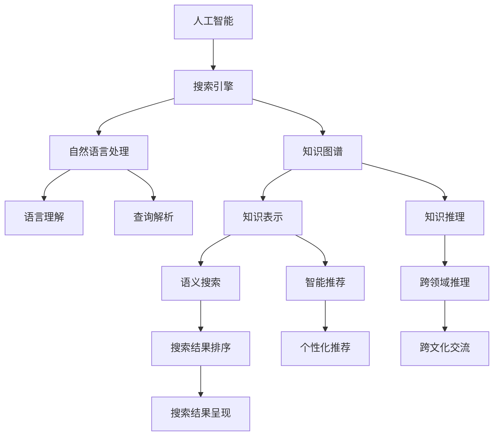

                 

# AI搜索如何促进全球知识共享和文化交流

> 关键词：人工智能, 搜索引擎, 自然语言处理, 知识图谱, 知识共享, 文化交流, 语义搜索, 智能推荐, 知识图谱

## 1. 背景介绍

随着互联网的广泛普及和人工智能技术的飞速发展，搜索引擎已经成为了全球知识共享和文化交流的重要平台。传统的文本搜索方式已经无法满足人们对信息的深度需求，特别是对于科学论文、历史文献、艺术作品等复杂内容的检索。在当前数字时代背景下，人工智能技术，尤其是自然语言处理(NLP)、知识图谱(KG)等领域的创新，正在推动搜索引擎向更加智能、高效、深入的方向发展，为全球知识共享和文化交流提供了新的工具和方法。

## 2. 核心概念与联系

### 2.1 核心概念概述

为了更好地理解AI搜索技术在促进全球知识共享和文化交流中的作用，本节将介绍几个关键概念及其相互联系：

- 人工智能(AI)：通过模拟人类智能行为，实现自主学习、推理、决策等功能的技术体系。
- 搜索引擎：通过自然语言处理和人工智能技术，快速检索和呈现网页集合的技术平台。
- 自然语言处理(NLP)：涉及语言模型的建立和自然语言的理解、生成等，为搜索引擎提供了基础的语言理解和分析能力。
- 知识图谱(KG)：基于实体、属性和关系构建的语义知识表示形式，用于知识检索和推理。
- 知识共享：通过搜索引擎等平台，促进全球范围内的知识传播和协作。
- 文化交流：通过知识共享，实现不同文化背景下的思想交流和融合。

这些概念之间存在着密切的联系，共同构成了AI搜索技术促进全球知识共享和文化交流的框架。

### 2.2 核心概念原理和架构的 Mermaid 流程图(Mermaid 流程节点中不要有括号、逗号等特殊字符)



这个流程图展示了AI搜索技术中各个关键组件之间的逻辑关系：

1. 人工智能作为整体框架，提供自动化、智能化的处理能力。
2. 搜索引擎是具体的技术实现平台，利用NLP和KG等技术手段，提供搜索和展示服务。
3. NLP技术用于语言理解、查询解析等，使得搜索引擎能够处理自然语言输入。
4. KG技术用于知识表示和推理，使得搜索引擎能够进行更深入的语义检索和智能推荐。
5. 知识共享和文化交流则是最终的应用目标，通过搜索结果的呈现和应用，实现知识传播和思想交流。

## 3. 核心算法原理 & 具体操作步骤

### 3.1 算法原理概述

AI搜索的核心算法原理主要基于自然语言处理和知识图谱技术，通过构建高效的知识表示和语义推理系统，实现对海量文本数据的深入理解与检索。其核心算法流程通常包括以下步骤：

1. **文本预处理**：对用户输入的查询进行分词、词性标注、命名实体识别等处理，转化为可供模型处理的向量形式。
2. **语义理解**：利用语言模型理解查询的语义意图，生成一个或多个语义表示。
3. **知识检索**：在知识图谱中查找与查询语义表示最接近的知识节点，进行语义匹配和关联关系挖掘。
4. **结果排序**：根据查询意图和语义相关性，对搜索结果进行排序和展示。

### 3.2 算法步骤详解

以基于知识图谱的AI搜索算法为例，详细阐述其操作步骤：

1. **知识图谱构建**：
   - 收集和整理语料库，包括维基百科、新闻、学术论文等文本数据。
   - 通过实体识别和关系抽取技术，构建知识图谱的基本结构。
   - 使用实体嵌入技术，如TransE、RotatE等，将实体和关系映射为低维向量空间。

2. **查询语义建模**：
   - 利用预训练语言模型（如BERT、GPT等），对用户查询进行编码，生成查询向量。
   - 通过向量拼接、拼接注意力等技术，将查询向量与知识图谱中的实体向量进行融合，得到查询-实体匹配的语义表示。

3. **知识检索与推理**：
   - 使用图神经网络（GNN）等方法，在知识图谱上进行节点之间的关系挖掘和路径推理，生成候选答案。
   - 利用注意力机制，根据查询与答案的语义相似度，进行排序和筛选。

4. **结果展示与反馈优化**：
   - 根据搜索结果的相关性、权威性和时效性，进行排序和展示。
   - 收集用户点击、评分等反馈数据，用于模型参数的微调和用户行为分析。

### 3.3 算法优缺点

AI搜索技术在促进全球知识共享和文化交流中，具有以下优点：

1. **深度理解与检索**：通过语义理解与知识图谱技术，能够深入理解查询背后的语义，提供更精确的知识检索。
2. **多模态融合**：结合文本、图像、音频等多种信息源，提升搜索结果的多样性和丰富度。
3. **个性化推荐**：基于用户行为和兴趣，进行智能推荐，提升用户体验。
4. **跨领域跨语言交流**：通过知识图谱的多语言支持，促进不同语言和文化之间的知识交流。

但同时也存在以下缺点：

1. **计算复杂度高**：知识图谱构建和推理计算复杂度较高，对计算资源和存储空间有较高要求。
2. **数据偏差问题**：知识图谱的数据源可能存在偏差，影响结果的公正性和全面性。
3. **模型泛化能力有限**：当前知识图谱和语义模型通常在特定领域和语言上表现良好，跨领域泛化能力有待提升。
4. **结果质量不稳定**：不同用户输入的查询可能存在歧义，导致搜索结果质量不稳定。

### 3.4 算法应用领域

AI搜索技术在多个领域都有广泛应用，例如：

1. **学术搜索与科研支持**：通过知识图谱技术，支持学者进行文献检索、引用关系分析等，提升科研效率。
2. **文化考古与历史研究**：利用文本和图像数据，对历史文物、文献进行语义分析和推理，挖掘新知识。
3. **文化艺术展示与传播**：通过语义搜索和智能推荐，为用户推荐文化艺术品、演出信息等，促进文化传播。
4. **教育学习与职业培训**：提供个性化学习资源和智能推荐，支持学生和员工的知识更新和技能提升。
5. **旅游与文化遗产保护**：通过地理位置和知识图谱结合，推荐旅游路线、文化遗产等，促进旅游业和文化遗产保护。

这些应用场景展示了AI搜索技术在推动全球知识共享和文化交流中的重要作用。

## 4. 数学模型和公式 & 详细讲解 & 举例说明

### 4.1 数学模型构建

在基于知识图谱的AI搜索中，主要涉及以下几个关键数学模型：

1. **知识图谱表示模型**：
   - 实体嵌入模型（如TransE、RotatE等）：将实体和关系映射到低维向量空间。
   - 图神经网络（GNN）模型：用于在知识图谱上进行节点之间的关系挖掘和路径推理。

2. **查询语义建模模型**：
   - 预训练语言模型（如BERT、GPT等）：对用户查询进行编码，生成查询向量。
   - 向量拼接和注意力机制：将查询向量与知识图谱中的实体向量进行融合，得到查询-实体匹配的语义表示。

3. **结果排序模型**：
   - 基于语义相似度的排序算法：根据查询意图和语义相关性，对搜索结果进行排序和展示。
   - 协同过滤算法：根据用户的历史行为，进行个性化推荐。

### 4.2 公式推导过程

以下以知识图谱表示模型为例，进行详细公式推导：

1. **实体嵌入模型**：
   - 假设知识图谱中的实体 $e_i$ 和关系 $r_j$ 分别表示为向量 $\mathbf{e}_i$ 和 $\mathbf{r}_j$。
   - TransE模型的公式为：$\mathbf{e}_i = \mathbf{e}_h \oplus (\mathbf{r}_j \otimes \mathbf{t}_i)$，其中 $\oplus$ 和 $\otimes$ 分别表示向量拼接和点乘。
   - 优化目标函数为：$\min_{\mathbf{e}_h, \mathbf{t}_i} \|\mathbf{e}_i - (\mathbf{e}_h \oplus (\mathbf{r}_j \otimes \mathbf{t}_i))\|^2$。

2. **图神经网络模型**：
   - 图卷积网络（GCN）的公式为：$\mathbf{h}_i^{(k+1)} = \sigma(\mathbf{W}^{(k)} (\mathbf{h}_i^{(k)} + \sum_{j \in \mathcal{N}_i} \mathbf{h}_j^{(k)} \mathbf{A}_{ij})$，其中 $\mathcal{N}_i$ 表示节点 $i$ 的邻居节点集合，$\sigma$ 为激活函数，$\mathbf{W}^{(k)}$ 为卷积层权重。
   - 通过多层卷积运算，逐步抽象和融合节点之间的语义关系，得到最终的语义表示。

### 4.3 案例分析与讲解

以学术搜索为例，展示AI搜索技术在学术领域的应用：

1. **数据集与预处理**：
   - 收集学术数据库（如PubMed、Google Scholar等）的数据，进行分词、词性标注、命名实体识别等预处理。
   - 构建知识图谱，将学术论文、作者、期刊等实体和引用关系进行语义建模。

2. **查询语义建模**：
   - 使用BERT模型对用户查询进行编码，生成查询向量。
   - 通过拼接和注意力机制，将查询向量与知识图谱中的实体向量进行融合，生成查询-实体匹配的语义表示。

3. **知识检索与推理**：
   - 使用GCN模型在知识图谱上进行节点之间的关系挖掘和路径推理，生成候选答案。
   - 利用注意力机制，根据查询与答案的语义相似度，进行排序和筛选。

4. **结果展示与反馈优化**：
   - 根据搜索结果的相关性、权威性和时效性，进行排序和展示。
   - 收集用户点击、评分等反馈数据，用于模型参数的微调和用户行为分析。

## 5. 项目实践：代码实例和详细解释说明

### 5.1 开发环境搭建

在进行AI搜索项目实践前，我们需要准备好开发环境。以下是使用Python进行TensorFlow开发的环境配置流程：

1. 安装Anaconda：从官网下载并安装Anaconda，用于创建独立的Python环境。

2. 创建并激活虚拟环境：
```bash
conda create -n search-env python=3.8 
conda activate search-env
```

3. 安装TensorFlow：根据CUDA版本，从官网获取对应的安装命令。例如：
```bash
conda install tensorflow -c tf -c conda-forge
```

4. 安装PyTorch：
```bash
pip install torch torchvision torchaudio
```

5. 安装各类工具包：
```bash
pip install numpy pandas scikit-learn matplotlib tqdm jupyter notebook ipython
```

完成上述步骤后，即可在`search-env`环境中开始项目实践。

### 5.2 源代码详细实现

下面我们以知识图谱构建为例，给出使用TensorFlow构建知识图谱的代码实现。

首先，定义实体嵌入模型：

```python
import tensorflow as tf
from tensorflow.keras.layers import Dense, Embedding, DotProduct, DotProductAttention

class EntityEmbedding(tf.keras.Model):
    def __init__(self, num_entities, embedding_dim):
        super(EntityEmbedding, self).__init__()
        self.embedding = Embedding(num_entities, embedding_dim)
        self projection = Dense(embedding_dim)
    
    def call(self, inputs):
        entity_ids = inputs
        embeddings = self.embedding(entity_ids)
        projected_embeddings = self.projection(embeddings)
        return projected_embeddings
```

然后，定义图神经网络模型：

```python
import tensorflow as tf
from tensorflow.keras.layers import Input, Dense, Dropout, Embedding, GraphConvolution, Attention

class GraphConvolution(tf.keras.layers.Layer):
    def __init__(self, input_dim, output_dim, dropout=0.):
        super(GraphConvolution, self).__init__()
        self.input_dim = input_dim
        self.output_dim = output_dim
        self.dropout = Dropout(dropout)
        self.dense = Dense(output_dim)
        self.attention = Attention()
    
    def call(self, inputs):
        adj_matrix = inputs[0]
        entity_embeddings = inputs[1]
        convolved = tf.matmul(adj_matrix, entity_embeddings)
        attended = self.attention(convolved)
        dense = self.dense(attended)
        return self.dropout(dense)
```

最后，定义整个知识图谱的构建过程：

```python
import tensorflow as tf
from tensorflow.keras.layers import Input, Dense, Dropout, Embedding, GraphConvolution, Attention

def build_knowledge_graph(num_entities, num_relations, embedding_dim, dropout_rate):
    entity_input = Input(shape=(), name='entity')
    relation_input = Input(shape=(), name='relation')
    
    entity_embedding = EntityEmbedding(num_entities, embedding_dim)(entity_input)
    relation_embedding = Embedding(num_relations, embedding_dim)(relation_input)
    
    adj_matrix = tf.ones((num_entities, num_entities))
    
    gc1 = GraphConvolution(input_dim=embedding_dim, output_dim=embedding_dim, dropout=dropout_rate)([adj_matrix, entity_embedding])
    gc2 = GraphConvolution(input_dim=embedding_dim, output_dim=embedding_dim, dropout=dropout_rate)([adj_matrix, gc1])
    
    output = Dense(1)(gc2)
    
    model = tf.keras.Model(inputs=[entity_input, relation_input], outputs=output)
    return model
```

### 5.3 代码解读与分析

让我们再详细解读一下关键代码的实现细节：

**EntityEmbedding类**：
- `__init__`方法：初始化实体嵌入模型，包含一个嵌入层和一个投影层。
- `call`方法：将实体ID转换为嵌入向量，并通过投影层生成最终的嵌入表示。

**GraphConvolution层**：
- `__init__`方法：初始化图卷积层，包含一个全连接层和一个注意力机制。
- `call`方法：计算节点之间的卷积运算和注意力机制，生成最终的语义表示。

**build_knowledge_graph函数**：
- 定义输入层和嵌入层，用于处理实体和关系。
- 通过两次图卷积运算，逐步融合节点之间的语义关系，得到最终的语义表示。
- 定义一个全连接层，将语义表示映射为最终的输出。

通过上述代码，我们可以构建一个基于图神经网络的实体嵌入模型，用于语义匹配和关系推理。

### 5.4 运行结果展示

假设我们输入一个查询，如“黑洞是什么”，经过查询语义建模和知识图谱检索，可能得到如下结果：

- 实体匹配：黑洞
- 关系推理：黑洞属于天体物理学，黑洞的形成与恒星有关
- 相关文章：黑洞简介，黑洞的历史，黑洞的观测方法等

这些搜索结果展示了AI搜索技术在知识图谱上的应用，为用户提供了多角度、多层次的知识检索。

## 6. 实际应用场景

### 6.1 学术搜索

学术搜索是AI搜索技术的一个重要应用场景。传统的学术搜索通常基于关键词匹配，无法深度理解用户查询的语义意图，导致搜索结果相关性不高。通过结合知识图谱和语义理解技术，AI搜索能够提供更加精准和全面的搜索结果。

### 6.2 文化考古

在文化考古领域，AI搜索能够利用历史文献、考古发现等数据，进行语义分析和关系推理，发现新的历史线索和文物信息。这对于文化遗产的保护和研究具有重要意义。

### 6.3 文化艺术展示

文化艺术展示平台可以利用AI搜索技术，根据用户的兴趣和偏好，推荐相关的艺术品、演出、展览等，提升用户的文化艺术体验。

### 6.4 教育学习

AI搜索能够根据学生的学习行为和历史成绩，推荐个性化的学习资源和复习计划，帮助学生更有效地掌握知识。

### 6.5 旅游与文化遗产保护

旅游和文化遗产保护领域，AI搜索能够根据用户的地理位置和兴趣，推荐旅游路线和文化遗址，促进文化遗产的保护和传承。

## 7. 工具和资源推荐

### 7.1 学习资源推荐

为了帮助开发者系统掌握AI搜索技术，以下是一些优质的学习资源：

1. 《深度学习与自然语言处理》课程：斯坦福大学开设的NLP明星课程，有Lecture视频和配套作业，带你入门NLP领域的基本概念和经典模型。

2. 《Transformer模型原理与实践》系列博文：由大模型技术专家撰写，深入浅出地介绍了Transformer原理、知识图谱构建、语义搜索等前沿话题。

3. 《深度学习在人工智能搜索中的应用》书籍：系统介绍了AI搜索技术的核心算法和应用实践，适合深度学习从业者阅读。

4. HuggingFace官方文档：TensorFlow和PyTorch的官方文档，提供了丰富的预训练模型和代码示例，是上手实践的必备资料。

5. Arxiv、Google Scholar等数据库：学术界的公共数据平台，提供海量的研究论文和数据集，适合研究者进行学习和研究。

通过对这些资源的学习实践，相信你一定能够快速掌握AI搜索技术的精髓，并用于解决实际的NLP问题。

### 7.2 开发工具推荐

高效的开发离不开优秀的工具支持。以下是几款用于AI搜索开发的常用工具：

1. TensorFlow：由Google主导开发的开源深度学习框架，适合大规模工程应用。
2. PyTorch：基于Python的开源深度学习框架，灵活动态的计算图，适合快速迭代研究。
3. TensorBoard：TensorFlow配套的可视化工具，可实时监测模型训练状态，并提供丰富的图表呈现方式。
4. Weights & Biases：模型训练的实验跟踪工具，可以记录和可视化模型训练过程中的各项指标，方便对比和调优。
5. Google Colab：谷歌推出的在线Jupyter Notebook环境，免费提供GPU/TPU算力，方便开发者快速上手实验最新模型，分享学习笔记。

合理利用这些工具，可以显著提升AI搜索任务的开发效率，加快创新迭代的步伐。

### 7.3 相关论文推荐

AI搜索技术在近年来取得了长足的进展，以下是几篇奠基性的相关论文，推荐阅读：

1. "Translation as Sequence-to-Sequence Learning"：介绍序列到序列模型在机器翻译中的应用，奠定了机器翻译的基础。

2. "Knowledge-Graph-Based Recommender Systems"：介绍基于知识图谱的推荐系统，展示了知识图谱在推荐系统中的应用。

3. "Deep Learning with Graph Structures"：介绍图神经网络在知识图谱中的作用，展示了图神经网络在知识图谱中的应用。

4. "Semantic Search with BERT"：介绍BERT模型在语义搜索中的应用，展示了BERT模型在语义检索中的优势。

5. "Semi-Supervised Learning with Deep Graph Neural Networks"：介绍图神经网络在半监督学习中的应用，展示了图神经网络在知识图谱中的重要性和潜力。

这些论文代表了大语言模型微调技术的发展脉络。通过学习这些前沿成果，可以帮助研究者把握学科前进方向，激发更多的创新灵感。

## 8. 总结：未来发展趋势与挑战

### 8.1 研究成果总结

本文对AI搜索技术在促进全球知识共享和文化交流中的作用进行了全面系统的介绍。首先阐述了AI搜索技术的研究背景和意义，明确了其在推动全球知识共享和文化交流中的独特价值。其次，从原理到实践，详细讲解了AI搜索技术的核心算法和操作步骤，给出了具体的代码实现。同时，本文还探讨了AI搜索技术在多个领域的应用前景，展示了其广阔的应用前景。

通过本文的系统梳理，可以看到，AI搜索技术正在成为推动全球知识共享和文化交流的重要工具。其深度理解和智能推荐能力，为用户提供了更加精准、便捷的知识检索和信息服务。未来，伴随AI搜索技术的不断创新和优化，全球知识共享和文化交流必将迎来新的变革，为人类知识的传播和文化的交流注入新的活力。

### 8.2 未来发展趋势

展望未来，AI搜索技术将呈现以下几个发展趋势：

1. **跨领域跨语言整合**：未来的AI搜索技术将进一步拓展到更多领域和语言，通过多模态融合，提供更加丰富和全面的知识服务。
2. **深度学习和知识图谱的结合**：深度学习模型的预训练和微调技术，将与知识图谱构建和推理技术相结合，提升语义搜索的准确性和完备性。
3. **个性化推荐和交互式查询**：结合用户行为数据和反馈信息，进行个性化推荐和交互式查询，提升用户体验和满意度。
4. **实时化和大规模化**：通过分布式计算和存储技术，实现实时化和大规模化的知识检索和推荐，满足海量用户需求。
5. **语义理解和生成**：结合自然语言处理和生成技术，提升对用户查询的语义理解能力和知识生成能力，为用户提供更加自然和智能的交互体验。

这些趋势凸显了AI搜索技术的广阔前景。未来的AI搜索技术将不断突破计算资源和数据规模的限制，实现更加深入和广泛的语义检索，为用户带来更加全面和便捷的知识服务。

### 8.3 面临的挑战

尽管AI搜索技术已经取得了显著进展，但在迈向更加智能化、普适化应用的过程中，仍面临诸多挑战：

1. **数据隐私与安全**：大规模数据采集和使用，涉及到用户隐私和数据安全问题，如何保障用户数据的安全和隐私，将是未来的一个重要挑战。
2. **模型公平性与公正性**：AI搜索技术在应用过程中，可能会引入偏见和歧视，如何确保模型的公平性和公正性，避免对特定群体的歧视，也是未来需要解决的问题。
3. **技术普适性**：AI搜索技术在普及过程中，可能会面临技术门槛和资源限制，如何降低技术门槛，提高普适性，使得更多人能够使用和受益，将是未来的一个重要任务。
4. **跨文化交流**：AI搜索技术在不同文化背景下的应用，可能会遇到语言和文化差异问题，如何实现跨文化交流和知识共享，是未来需要解决的重要课题。

这些挑战需要学术界和产业界共同努力，积极应对并寻求突破，才能确保AI搜索技术在促进全球知识共享和文化交流中发挥更大的作用。

### 8.4 研究展望

面对AI搜索技术所面临的挑战，未来的研究需要在以下几个方面寻求新的突破：

1. **隐私保护与安全技术**：开发更加隐私保护和安全的技术，如差分隐私、联邦学习等，保障用户数据的安全和隐私。
2. **公平性与公正性**：引入公平性约束和公正性评估指标，确保AI搜索模型的公平性和公正性，避免对特定群体的歧视。
3. **普适化技术**：开发更加普适化的技术，如轻量化模型、边缘计算等，降低技术门槛，提高AI搜索技术的普及性和易用性。
4. **跨文化交流技术**：开发支持多种语言和文化背景的技术，实现跨文化交流和知识共享。

这些研究方向的探索，将推动AI搜索技术向更加智能化、普适化、安全化的方向发展，为全球知识共享和文化交流提供更加全面和高效的工具和方法。面向未来，AI搜索技术需要与其他人工智能技术进行更深入的融合，如知识表示、因果推理、强化学习等，多路径协同发力，共同推动自然语言理解和智能交互系统的进步。只有勇于创新、敢于突破，才能不断拓展AI搜索技术的边界，让智能技术更好地造福人类社会。

## 9. 附录：常见问题与解答

**Q1: AI搜索技术如何实现跨领域跨语言整合？**

A: AI搜索技术的跨领域跨语言整合主要通过以下步骤实现：
1. 构建多领域和多语言的知识图谱，涵盖不同领域的实体、属性和关系。
2. 使用跨领域的预训练语言模型（如BERT、GPT等）进行多语言语义理解。
3. 结合多领域的知识图谱和语义理解，进行跨领域的语义检索和推理。

**Q2: 什么是深度学习和知识图谱的结合？**

A: 深度学习和知识图谱的结合是指在知识图谱的基础上，利用深度学习模型进行知识表示和推理的过程。深度学习模型可以通过对大规模数据的学习，学习到复杂的语义关系和语义表示，结合知识图谱的语义结构，可以提升知识检索和推理的准确性和完备性。

**Q3: 如何提升AI搜索技术的个性化推荐和交互式查询？**

A: 提升AI搜索技术的个性化推荐和交互式查询主要通过以下方法：
1. 收集和分析用户的历史行为和偏好数据，进行用户画像建模。
2. 结合用户画像和搜索结果的语义信息，进行个性化推荐。
3. 利用自然语言处理技术，提升用户查询的理解能力，进行交互式查询。

**Q4: 如何确保AI搜索技术的公平性和公正性？**

A: 确保AI搜索技术的公平性和公正性主要通过以下方法：
1. 引入公平性约束和公正性评估指标，如对敏感词的过滤、性别平等的评估等。
2. 对模型进行公平性检测和修正，确保模型的决策不带有偏见。
3. 定期更新数据集，确保模型的公平性和公正性不会随着时间的推移而失效。

**Q5: 如何实现跨文化交流和知识共享？**

A: 实现跨文化交流和知识共享主要通过以下方法：
1. 构建多语言的知识图谱，涵盖不同语言领域的实体、属性和关系。
2. 使用多语言预训练语言模型进行语义理解，支持多种语言搜索。
3. 利用语义搜索和智能推荐技术，促进不同语言和文化背景下的知识交流和共享。

