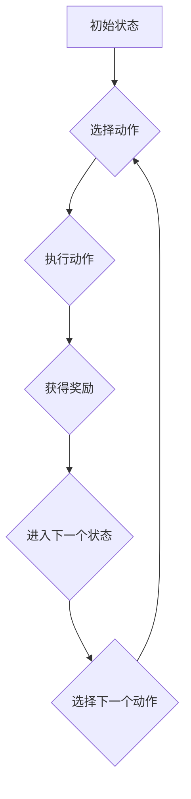

> SARSA, 强化学习, 价值函数, 策略迭代, 贪婪策略, 状态-动作对, 奖励信号

## 1. 背景介绍

强化学习 (Reinforcement Learning, RL) 作为机器学习的一个重要分支，旨在训练智能体在与环境交互的过程中学习最优策略，以最大化累积奖励。SARSA (State-Action-Reward-State-Action) 算法作为一种经典的策略迭代算法，在强化学习领域有着广泛的应用。

SARSA 算法的核心思想是通过不断地与环境交互，更新状态-动作对的价值函数，从而逐步逼近最优策略。它与 Q-learning 算法类似，但不同之处在于 SARSA 算法在更新价值函数时，使用的是当前策略下的下一个动作，而 Q-learning 算法则使用的是贪婪策略下的下一个动作。

## 2. 核心概念与联系

**2.1 核心概念**

* **状态 (State):** 智能体所处的环境状况。
* **动作 (Action):** 智能体在特定状态下可以采取的行动。
* **奖励 (Reward):** 智能体在执行某个动作后获得的反馈信号。
* **价值函数 (Value Function):**  评估状态-动作对的期望回报。
* **策略 (Policy):**  智能体在不同状态下选择动作的规则。

**2.2  SARSA 算法流程**



**2.3  SARSA 算法与其他算法的关系**

SARSA 算法属于策略迭代算法，与其他策略迭代算法如 Q-learning 算法、DPP 算法等有着密切的联系。

## 3. 核心算法原理 & 具体操作步骤

**3.1  算法原理概述**

SARSA 算法的核心思想是通过不断地与环境交互，更新状态-动作对的价值函数，从而逐步逼近最优策略。它通过以下公式更新价值函数：

$$
Q(s,a) \leftarrow Q(s,a) + \alpha [r + \gamma Q(s',a') - Q(s,a)]
$$

其中：

* $Q(s,a)$ 表示状态 $s$ 下执行动作 $a$ 的价值函数。
* $\alpha$ 表示学习率，控制着价值函数更新的步长。
* $r$ 表示执行动作 $a$ 后获得的奖励。
* $\gamma$ 表示折扣因子，控制着未来奖励的权重。
* $s'$ 表示执行动作 $a$ 后进入的下一个状态。
* $a'$ 表示在下一个状态 $s'$ 下根据当前策略选择的动作。

**3.2  算法步骤详解**

1. 初始化价值函数 $Q(s,a)$，通常设置为 0。
2. 选择初始状态 $s_0$。
3. 根据当前策略选择动作 $a_0$。
4. 执行动作 $a_0$，获得奖励 $r_1$ 和下一个状态 $s_1$。
5. 根据当前策略选择下一个动作 $a_1$。
6. 更新价值函数：

$$
Q(s_0,a_0) \leftarrow Q(s_0,a_0) + \alpha [r_1 + \gamma Q(s_1,a_1) - Q(s_0,a_0)]
$$

7. 将 $s_1$ 和 $a_1$ 作为新的状态和动作，重复步骤 4-6，直到达到终止条件。

**3.3  算法优缺点**

**优点:**

* 能够在线学习，不需要事先知道环境模型。
* 能够学习出稳定的策略。

**缺点:**

* 可能会陷入局部最优解。
* 学习速度可能较慢。

**3.4  算法应用领域**

SARSA 算法在许多领域都有应用，例如：

* **机器人控制:** 训练机器人执行复杂的任务。
* **游戏 AI:** 训练游戏中的 AI 玩家。
* **推荐系统:** 建议用户感兴趣的内容。
* **金融交易:** 优化投资策略。

## 4. 数学模型和公式 & 详细讲解 & 举例说明

**4.1  数学模型构建**

SARSA 算法的数学模型可以描述为一个马尔可夫决策过程 (MDP)，其中包含以下元素：

* 状态空间 $S$：所有可能的智能体状态。
* 动作空间 $A$：每个状态下智能体可以采取的所有动作。
* 转移概率 $P(s',r|s,a)$：从状态 $s$ 执行动作 $a$ 后，进入状态 $s'$ 并获得奖励 $r$ 的概率。
* 奖励函数 $R(s,a)$：在状态 $s$ 执行动作 $a$ 后获得的奖励。
* 价值函数 $V(s)$：状态 $s$ 的价值，即从该状态开始执行最优策略的期望累积奖励。

**4.2  公式推导过程**

SARSA 算法的价值函数更新公式可以推导如下：

$$
Q(s,a) \leftarrow Q(s,a) + \alpha [r + \gamma Q(s',a') - Q(s,a)]
$$

其中：

* $Q(s,a)$ 表示状态 $s$ 下执行动作 $a$ 的价值函数。
* $\alpha$ 表示学习率，控制着价值函数更新的步长。
* $r$ 表示执行动作 $a$ 后获得的奖励。
* $\gamma$ 表示折扣因子，控制着未来奖励的权重。
* $s'$ 表示执行动作 $a$ 后进入的下一个状态。
* $a'$ 表示在下一个状态 $s'$ 下根据当前策略选择的动作。

**4.3  案例分析与讲解**

假设有一个简单的环境，智能体可以处于两个状态：状态 0 和状态 1。智能体可以执行两个动作：动作 0 和动作 1。

* 从状态 0 执行动作 0，获得奖励 1，进入状态 1。
* 从状态 0 执行动作 1，获得奖励 -1，进入状态 0。
* 从状态 1 执行动作 0，获得奖励 0，进入状态 0。
* 从状态 1 执行动作 1，获得奖励 0，进入状态 1。

如果使用 SARSA 算法学习，智能体会逐渐学习到最优策略，即在状态 0 时执行动作 0，在状态 1 时执行动作 0。

## 5. 项目实践：代码实例和详细解释说明

**5.1  开发环境搭建**

* Python 3.x
* NumPy
* Matplotlib

**5.2  源代码详细实现**

```python
import numpy as np

class SARSA:
    def __init__(self, env, alpha=0.1, gamma=0.9, epsilon=0.1):
        self.env = env
        self.alpha = alpha
        self.gamma = gamma
        self.epsilon = epsilon
        self.q_table = np.zeros((env.n_states, env.n_actions))

    def choose_action(self, state):
        if np.random.uniform(0, 1) < self.epsilon:
            return self.env.action_space.sample()
        else:
            return np.argmax(self.q_table[state, :])

    def update_q_table(self, state, action, reward, next_state, next_action):
        self.q_table[state, action] += self.alpha * (reward + self.gamma * self.q_table[next_state, next_action] - self.q_table[state, action])

    def learn(self, num_episodes):
        for episode in range(num_episodes):
            state = self.env.reset()
            action = self.choose_action(state)
            done = False

            while not done:
                next_state, reward, done, _ = self.env.step(action)
                next_action = self.choose_action(next_state)
                self.update_q_table(state, action, reward, next_state, next_action)
                state = next_state
                action = next_action

```

**5.3  代码解读与分析**

* `__init__` 方法初始化 SARSA 算法的属性，包括环境、学习率、折扣因子和探索率。
* `choose_action` 方法根据当前状态和策略选择动作。
* `update_q_table` 方法更新价值函数。
* `learn` 方法训练 SARSA 算法，通过与环境交互更新价值函数。

**5.4  运行结果展示**

运行代码后，可以观察到智能体的行为逐渐趋于最优策略。

## 6. 实际应用场景

SARSA 算法在许多实际应用场景中都有着广泛的应用，例如：

* **机器人控制:** 训练机器人执行复杂的任务，例如导航、抓取、组装等。
* **游戏 AI:** 训练游戏中的 AI 玩家，使其能够与人类玩家进行对抗。
* **推荐系统:** 建议用户感兴趣的内容，例如电影、音乐、商品等。
* **金融交易:** 优化投资策略，例如股票交易、期货交易等。

**6.4  未来应用展望**

随着强化学习技术的不断发展，SARSA 算法的应用场景将会更加广泛。例如，它可以应用于自动驾驶、医疗诊断、自然语言处理等领域。

## 7. 工具和资源推荐

**7.1  学习资源推荐**

* **书籍:**
    * Reinforcement Learning: An Introduction by Richard S. Sutton and Andrew G. Barto
    * Deep Reinforcement Learning Hands-On by Maxim Lapan
* **在线课程:**
    * Coursera: Reinforcement Learning Specialization by David Silver
    * Udacity: Intro to Artificial Intelligence

**7.2  开发工具推荐**

* **OpenAI Gym:** 一个用于强化学习研究和开发的开源库。
* **TensorFlow:** 一个用于深度学习的开源库。
* **PyTorch:** 另一个用于深度学习的开源库。

**7.3  相关论文推荐**

* SARSA Learning in the Grid World by Richard S. Sutton and Andrew G. Barto
* Deep Reinforcement Learning with Double Q-learning by Hasselt et al.

## 8. 总结：未来发展趋势与挑战

**8.1  研究成果总结**

SARSA 算法作为一种经典的强化学习算法，在过去几十年中取得了显著的成果。它能够有效地学习出稳定的策略，并在许多实际应用场景中取得成功。

**8.2  未来发展趋势**

未来，SARSA 算法的研究方向将集中在以下几个方面：

* **提高学习效率:** 探索新的算法和方法，提高 SARSA 算法的学习效率。
* **解决稀疏奖励问题:** 针对许多实际应用场景中奖励稀疏的问题，开发新的算法和方法。
* **应用于复杂环境:** 将 SARSA 算法应用于更加复杂的环境，例如自动驾驶、医疗诊断等领域。

**8.3  面临的挑战**

SARSA 算法也面临着一些挑战，例如：

* **局部最优解:** SARSA 算法可能会陷入局部最优解，无法找到最优策略。
* **样本效率:** SARSA 算法需要大量的样本数据才能学习到有效的策略。
* **可解释性:** SARSA 算法的决策过程难以解释，这对于一些安全关键的应用场景来说是一个问题。

**8.4  研究展望**

未来，我们将继续研究 SARSA 算法，探索新的算法和方法，提高其性能和应用范围。


## 9. 附录：常见问题与解答

**9.1  Q: SARSA 和 Q-learning 的区别是什么？**

**A:** SARSA 和 Q-learning 都是基于价值函数的强化学习算法，但它们在更新价值函数时有所不同。SARSA 使用的是当前策略下的下一个动作，而 Q-learning 使用的是贪