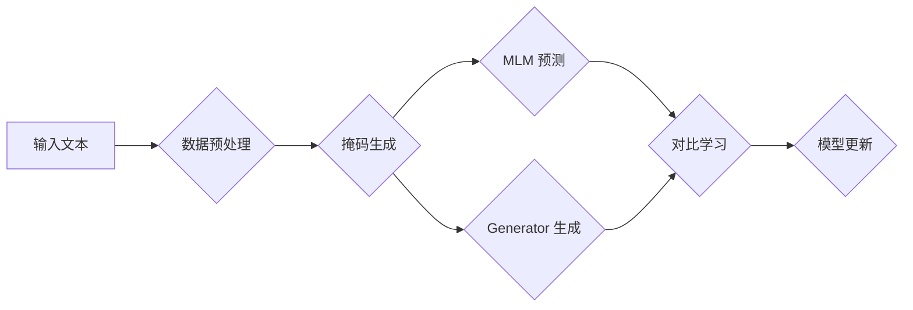

> Transformer,ELECTRA,大模型,自然语言处理,预训练,微调,文本生成,文本分类

## 1. 背景介绍

近年来，深度学习在自然语言处理 (NLP) 领域取得了显著进展，其中 Transformer 架构的出现可谓是里程碑式的事件。其强大的序列建模能力和并行计算效率，使得 Transformer 模型在各种 NLP 任务中取得了优异的性能，例如机器翻译、文本摘要、问答系统等。

然而，训练大型 Transformer 模型需要海量数据和强大的计算资源，这对于许多研究机构和开发者来说是一个巨大的挑战。为了解决这个问题，预训练模型应运而生。预训练模型是指在大量通用文本数据上进行预训练，学习到语言的通用表示能力，然后在特定任务上进行微调的模型。

ELECTRA (Efficiently Learning an Encoder by Reconstruction) 是 Google AI 团队提出的一个新的预训练 Transformer 模型，它在训练过程中采用了“生成式对抗”的思想，通过对比学习的方式提高模型的性能，同时降低了训练成本。

## 2. 核心概念与联系

ELECTRA 的核心思想是利用一个“掩码语言模型”（Masked Language Model，MLM）和一个“生成式语言模型”（Generator）进行对比学习。

* **掩码语言模型 (MLM):** MLM 是一种常见的预训练方法，它会在输入文本中随机掩盖一部分词语，然后让模型预测这些被掩盖的词语。

* **生成式语言模型 (Generator):** Generator 的目标是生成与输入文本相似的文本序列。

ELECTRA 的训练过程可以概括为以下步骤：

1. **数据预处理:** 将文本数据进行分词、标记等预处理操作。
2. **掩码生成:** 在输入文本中随机选择一部分词语进行掩码。
3. **MLM 预测:** 让 MLM 模型预测被掩码的词语。
4. **Generator 生成:** 让 Generator 模型生成与输入文本相似的文本序列。
5. **对比学习:** 将 MLM 模型的预测结果与 Generator 生成的文本序列进行对比，并计算损失函数。
6. **模型更新:** 根据损失函数的梯度更新模型参数。

**Mermaid 流程图:**



## 3. 核心算法原理 & 具体操作步骤

### 3.1  算法原理概述

ELECTRA 的核心算法原理是基于对比学习的。它通过训练一个 Generator 模型来生成与输入文本相似的文本序列，然后让一个 MLM 模型预测被掩码的词语。通过比较 MLM 模型的预测结果与 Generator 生成的文本序列，可以学习到更有效的文本表示。

### 3.2  算法步骤详解

1. **数据预处理:** 将文本数据进行分词、标记等预处理操作。
2. **掩码生成:** 在输入文本中随机选择一部分词语进行掩码。
3. **MLM 预测:** 让 MLM 模型预测被掩码的词语。
4. **Generator 生成:** 让 Generator 模型生成与输入文本相似的文本序列。
5. **对比学习:** 将 MLM 模型的预测结果与 Generator 生成的文本序列进行对比，并计算损失函数。
6. **模型更新:** 根据损失函数的梯度更新模型参数。

### 3.3  算法优缺点

**优点:**

* **训练效率高:** 相比于传统的 MLM 方法，ELECTRA 的训练效率更高，因为它只训练 Generator 模型，而 MLM 模型只用于预测被掩码的词语。
* **性能优异:** ELECTRA 在各种 NLP 任务中都取得了优异的性能。
* **参数量更少:** 相比于一些大型 Transformer 模型，ELECTRA 的参数量更少，更容易部署。

**缺点:**

* **训练数据依赖性:** 仍然需要大量的训练数据才能达到最佳性能。
* **模型复杂度:** 尽管参数量较少，但模型的结构仍然比较复杂。

### 3.4  算法应用领域

ELECTRA 的应用领域非常广泛，包括：

* **文本分类:** 识别文本的类别，例如情感分析、主题分类等。
* **文本生成:** 生成新的文本内容，例如机器翻译、文本摘要、对话系统等。
* **问答系统:** 回答用户提出的问题。
* **信息检索:** 从海量文本数据中检索相关信息。

## 4. 数学模型和公式 & 详细讲解 & 举例说明

### 4.1  数学模型构建

ELECTRA 的数学模型构建主要基于 Transformer 架构，并结合了对比学习的思想。

* **Transformer 架构:** Transformer 架构由编码器和解码器组成，编码器用于将输入文本序列编码成隐藏表示，解码器用于根据编码后的表示生成输出文本序列。

* **对比学习:** 在训练过程中，ELECTRA 使用一个 Generator 模型来生成与输入文本相似的文本序列，然后让一个 MLM 模型预测被掩码的词语。通过比较 MLM 模型的预测结果与 Generator 生成的文本序列，可以学习到更有效的文本表示。

### 4.2  公式推导过程

ELECTRA 的损失函数主要由两部分组成：

* **MLM 损失:** 计算 MLM 模型预测被掩码的词语与真实词语之间的差异。
* **Generator 损失:** 计算 Generator 生成的文本序列与输入文本之间的差异。

**MLM 损失:**

$$
L_{MLM} = -\sum_{i \in \text{masked}} \log p(w_i | context_i)
$$

其中，$w_i$ 是被掩码的词语，$context_i$ 是 $w_i$ 的上下文词语，$p(w_i | context_i)$ 是 MLM 模型预测 $w_i$ 的概率。

**Generator 损失:**

$$
L_{Generator} = -\sum_{i \in \text{input}} \log p(w_i | context_i)
$$

其中，$w_i$ 是输入文本中的词语，$context_i$ 是 $w_i$ 的上下文词语，$p(w_i | context_i)$ 是 Generator 模型预测 $w_i$ 的概率。

**总损失函数:**

$$
L = L_{MLM} + \lambda L_{Generator}
$$

其中，$\lambda$ 是一个超参数，用于平衡 MLM 损失和 Generator 损失。

### 4.3  案例分析与讲解

假设我们有一个输入文本序列：“The cat sat on the mat”。ELECTRA 会随机选择其中一部分词语进行掩码，例如：“The _ sat on the mat”。然后，MLM 模型会预测被掩码的词语，例如“cat”。Generator 模型会生成与输入文本相似的文本序列，例如：“The dog sat on the mat”。通过比较 MLM 模型的预测结果和 Generator 生成的文本序列，ELECTRA 可以学习到更有效的文本表示。

## 5. 项目实践：代码实例和详细解释说明

### 5.1  开发环境搭建

* **操作系统:** Linux/macOS
* **Python 版本:** 3.6+
* **深度学习框架:** TensorFlow/PyTorch
* **其他依赖:** numpy, pandas, matplotlib等

### 5.2  源代码详细实现

由于篇幅限制，这里只提供部分代码示例，完整的代码可以参考 ELECTRA 的官方代码库。

```python
# MLM 模型
class MLM(nn.Module):
    def __init__(self, vocab_size, embedding_dim, hidden_dim, num_layers):
        super(MLM, self).__init__()
        # ...

    def forward(self, input_ids):
        # ...

# Generator 模型
class Generator(nn.Module):
    def __init__(self, vocab_size, embedding_dim, hidden_dim, num_layers):
        super(Generator, self).__init__()
        # ...

    def forward(self, input_ids):
        # ...

# 训练循环
for epoch in range(num_epochs):
    for batch in dataloader:
        # ...
        # 计算 MLM 损失和 Generator 损失
        # ...
        # 更新模型参数
        # ...
```

### 5.3  代码解读与分析

* **MLM 模型:** MLM 模型负责预测被掩码的词语。它通常是一个 Transformer 模型，其编码器部分用于编码输入文本序列，解码器部分用于预测被掩码的词语。
* **Generator 模型:** Generator 模型负责生成与输入文本相似的文本序列。它也是一个 Transformer 模型，其编码器部分用于编码输入文本序列，解码器部分用于生成文本序列。
* **训练循环:** 训练循环中，会迭代地读取数据，计算 MLM 损失和 Generator 损失，然后更新模型参数。

### 5.4  运行结果展示

ELECTRA 的训练结果通常会以准确率、困惑度等指标进行评估。

## 6. 实际应用场景

ELECTRA 在各种实际应用场景中都取得了优异的性能，例如：

* **文本分类:** ELECTRA 可以用于识别文本的类别，例如情感分析、主题分类等。
* **文本生成:** ELECTRA 可以用于生成新的文本内容，例如机器翻译、文本摘要、对话系统等。
* **问答系统:** ELECTRA 可以用于回答用户提出的问题。
* **信息检索:** ELECTRA 可以用于从海量文本数据中检索相关信息。

### 6.4  未来应用展望

随着预训练模型的发展，ELECTRA 的应用场景将会更加广泛。例如，它可以用于：

* **个性化推荐:** 根据用户的阅读历史和偏好，推荐相关的文章、书籍等。
* **自动写作:** 自动生成新闻报道、产品描述、广告文案等。
* **代码生成:** 自动生成代码片段，提高开发效率。

## 7. 工具和资源推荐

### 7.1  学习资源推荐

* **ELECTRA 官方论文:** https://arxiv.org/abs/2003.10555
* **ELECTRA 官方代码库:** https://github.com/google-research/electra
* **Transformer 架构论文:** https://arxiv.org/abs/1706.03762

### 7.2  开发工具推荐

* **TensorFlow:** https://www.tensorflow.org/
* **PyTorch:** https://pytorch.org/

### 7.3  相关论文推荐

* **BERT:** https://arxiv.org/abs/1810.04805
* **GPT-3:** https://openai.com/blog/gpt-3/

## 8. 总结：未来发展趋势与挑战

### 8.1  研究成果总结

ELECTRA 的提出为预训练 Transformer 模型的发展带来了新的思路，它通过对比学习的方式提高了模型的性能，同时降低了训练成本。

### 8.2  未来发展趋势

未来，预训练 Transformer 模型的发展趋势将更加注重：

* **模型规模:** 随着计算资源的不断发展，预训练 Transformer 模型的规模将会越来越大。
* **数据质量:** 预训练模型的性能很大程度上取决于训练数据的质量，因此未来将更加注重数据标注和数据增强技术。
* **应用场景:** 预训练 Transformer 模型的应用场景将会更加广泛，例如自动写作、代码生成等。

### 8.3  面临的挑战

预训练 Transformer 模型的发展也面临着一些挑战：

* **训练成本:** 训练大型 Transformer 模型需要大量的计算资源，这对于许多研究机构和开发者来说是一个巨大的挑战。
* **模型解释性:** Transformer 模型的内部机制比较复杂，难以解释模型的决策过程。
* **数据偏见:** 预训练模型可能会受到训练数据中的偏见影响，导致模型输出存在偏差。

### 8.4  研究展望

未来，研究者将继续探索新的预训练 Transformer 模型架构、训练方法和应用场景，以解决上述挑战，推动预训练 Transformer 模型的发展。

## 9. 附录：常见问题与解答

* **Q: ELECTRA 与 BERT 的区别是什么？**

* **A