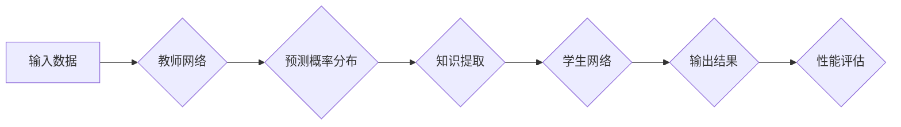

> Transformer, 大模型, 学生网络, 知识蒸馏, 迁移学习, 训练策略

## 1. 背景介绍

近年来，Transformer模型在自然语言处理领域取得了突破性的进展，例如BERT、GPT-3等模型展现出强大的语言理解和生成能力。然而，这些大模型通常具有庞大的参数量和高昂的训练成本，难以在资源有限的设备上部署和使用。为了解决这个问题，知识蒸馏技术应运而生。

知识蒸馏是一种模型压缩技术，通过训练一个较小的“学生网络”来模仿一个更大的“教师网络”的知识，从而实现模型压缩和性能提升。学生网络的参数量远小于教师网络，训练成本也更低，同时在某些任务上甚至能达到或超过教师网络的性能。

## 2. 核心概念与联系

**2.1 知识蒸馏原理**

知识蒸馏的核心思想是将教师网络的知识，例如预测概率分布或中间层特征，传递给学生网络。通过最小化教师网络和学生网络的输出之间的差异，学生网络可以学习到教师网络的知识，从而提高自身的性能。

**2.2 Transformer模型架构**

Transformer模型是一种基于注意力机制的序列模型，其架构主要包含以下部分：

* **编码器:** 将输入序列转换为固定长度的向量表示。
* **解码器:** 根据编码器的输出生成目标序列。
* **注意力机制:** 用于捕捉序列中不同元素之间的关系。

**2.3 学生网络训练流程**

1. **教师网络训练:** 首先训练一个大型的Transformer模型作为教师网络。
2. **知识提取:** 使用教师网络对输入数据进行预测，并获取其预测概率分布或中间层特征。
3. **学生网络训练:** 使用教师网络的知识作为指导，训练一个较小的Transformer模型作为学生网络。
4. **性能评估:** 对学生网络在目标任务上的性能进行评估，并根据需要调整训练策略。

**2.4 Mermaid 流程图**



## 3. 核心算法原理 & 具体操作步骤

### 3.1  算法原理概述

知识蒸馏算法的核心是通过最小化教师网络和学生网络的输出之间的差异来训练学生网络。常用的损失函数包括交叉熵损失和KL散度损失。

* **交叉熵损失:** 衡量两个概率分布之间的差异。
* **KL散度损失:** 衡量两个概率分布之间的相对熵。

### 3.2  算法步骤详解

1. **数据准备:** 准备用于训练教师网络和学生网络的数据集。
2. **教师网络训练:** 使用教师网络对数据集进行训练，并获得其预测概率分布或中间层特征。
3. **学生网络初始化:** 使用预训练的模型或随机初始化学生网络的权重。
4. **知识蒸馏训练:** 使用教师网络的知识作为指导，训练学生网络。
5. **模型评估:** 对学生网络在目标任务上的性能进行评估，并根据需要调整训练策略。

### 3.3  算法优缺点

**优点:**

* 模型压缩: 学生网络的参数量远小于教师网络，可以节省存储空间和计算资源。
* 性能提升: 在某些任务上，学生网络的性能甚至可以超过教师网络。
* 迁移学习: 学生网络可以利用教师网络的知识，在新的任务上进行迁移学习。

**缺点:**

* 训练复杂度: 知识蒸馏的训练过程比传统的模型训练更加复杂。
* 性能依赖性: 学生网络的性能依赖于教师网络的质量。

### 3.4  算法应用领域

知识蒸馏技术广泛应用于自然语言处理、计算机视觉、语音识别等领域，例如：

* **文本分类:** 使用知识蒸馏技术训练小型文本分类模型，提高模型的效率和准确性。
* **图像识别:** 使用知识蒸馏技术训练小型图像识别模型，降低模型的计算成本。
* **语音识别:** 使用知识蒸馏技术训练小型语音识别模型，提高模型的实时性。

## 4. 数学模型和公式 & 详细讲解 & 举例说明

### 4.1  数学模型构建

知识蒸馏的目标是训练一个学生网络，使其输出与教师网络输出尽可能接近。

假设教师网络的输出为 $p_t$, 学生网络的输出为 $p_s$, 则常用的损失函数包括：

* **交叉熵损失:**

$$
L_{CE} = - \sum_{i=1}^{N} p_t(i) \log p_s(i)
$$

* **KL散度损失:**

$$
L_{KL} = \sum_{i=1}^{N} p_t(i) \log \frac{p_t(i)}{p_s(i)}
$$

其中，$N$ 是样本的数量。

### 4.2  公式推导过程

交叉熵损失衡量两个概率分布之间的差异，KL散度损失衡量两个概率分布之间的相对熵。

### 4.3  案例分析与讲解

假设我们训练一个文本分类模型，教师网络是一个大型的BERT模型，学生网络是一个小型的神经网络。

使用交叉熵损失训练学生网络，可以使学生网络的预测概率分布与教师网络的预测概率分布尽可能接近。

使用KL散度损失训练学生网络，可以使学生网络的预测概率分布更接近教师网络的预测概率分布，从而提高学生网络的鲁棒性和泛化能力。

## 5. 项目实践：代码实例和详细解释说明

### 5.1  开发环境搭建

* Python 3.7+
* PyTorch 1.7+
* Transformers 4.0+

### 5.2  源代码详细实现

```python
import torch
import torch.nn as nn
from transformers import BertModel, BertConfig

class StudentModel(nn.Module):
    def __init__(self, config):
        super(StudentModel, self).__init__()
        self.bert = BertModel.from_pretrained(config.bert_model_name)
        self.classifier = nn.Linear(config.hidden_size, config.num_classes)

    def forward(self, input_ids, attention_mask):
        outputs = self.bert(input_ids=input_ids, attention_mask=attention_mask)
        pooled_output = outputs.pooler_output
        logits = self.classifier(pooled_output)
        return logits

# 配置参数
config = BertConfig.from_pretrained("bert-base-uncased")
config.num_classes = 2  # 调整类别数量

# 实例化学生网络
student_model = StudentModel(config)

# 定义优化器和损失函数
optimizer = torch.optim.AdamW(student_model.parameters(), lr=2e-5)
loss_fn = nn.CrossEntropyLoss()

# 训练循环
for epoch in range(3):
    for batch in train_dataloader:
        input_ids, attention_mask, labels = batch
        optimizer.zero_grad()
        logits = student_model(input_ids, attention_mask)
        loss = loss_fn(logits, labels)
        loss.backward()
        optimizer.step()

```

### 5.3  代码解读与分析

* **模型定义:** 代码定义了一个名为`StudentModel`的学生网络，它继承自`nn.Module`类。
* **模型架构:** 学生网络使用预训练的BERT模型作为编码器，并添加了一个全连接层作为分类器。
* **训练循环:** 代码实现了训练循环，包括数据加载、模型前向传播、损失计算、反向传播和参数更新。

### 5.4  运行结果展示

训练完成后，可以评估学生网络在测试集上的性能，例如准确率、F1-score等。

## 6. 实际应用场景

知识蒸馏技术在实际应用场景中具有广泛的应用前景，例如：

* **移动设备:** 在资源有限的移动设备上部署小型模型，提高模型的效率和实时性。
* **嵌入式系统:** 在嵌入式系统中部署小型模型，降低模型的功耗和内存占用。
* **边缘计算:** 在边缘计算节点上部署小型模型，提高模型的响应速度和数据隐私保护能力。

### 6.4  未来应用展望

未来，知识蒸馏技术将继续发展，并应用于更多领域，例如：

* **多模态学习:** 将知识蒸馏应用于多模态学习，例如文本-图像、文本-音频等。
* **自监督学习:** 使用知识蒸馏技术增强自监督学习的性能。
* **联邦学习:** 将知识蒸馏应用于联邦学习，提高模型的隐私保护能力。

## 7. 工具和资源推荐

### 7.1  学习资源推荐

* **论文:**
    * Hinton, G., Vinyals, O., & Dean, J. (2015). Distilling the knowledge in a neural network. arXiv preprint arXiv:1503.02531.
    * Buciluă, C., Caruana, R., & Niculescu-Mizil, A. (2006). Learning to generalize temperature-scaled cross-entropy. In Proceedings of the 23rd international conference on Machine learning (pp. 109-116).
* **博客:**
    * https://towardsdatascience.com/knowledge-distillation-a-powerful-technique-for-model-compression-a3999699967c
    * https://blog.openai.com/better-language-models/

### 7.2  开发工具推荐

* **PyTorch:** https://pytorch.org/
* **Transformers:** https://huggingface.co/transformers/

### 7.3  相关论文推荐

* **BERT:** Devlin, J., Chang, M. W., Lee, K., & Toutanova, K. (2018). BERT: Pre-training of deep bidirectional transformers for language understanding. arXiv preprint arXiv:1810.04805.
* **GPT-3:** Brown, T. B., Mann, B., Ryder, N., Subbiah, M., Kaplan, J., Dhariwal, P., ... & Amodei, D. (2020). Language models are few-shot learners. arXiv preprint arXiv:2005.14165.

## 8. 总结：未来发展趋势与挑战

### 8.1  研究成果总结

知识蒸馏技术取得了显著的成果，成功地压缩了大型模型，提高了模型的效率和性能。

### 8.2  未来发展趋势

未来，知识蒸馏技术将朝着以下方向发展：

* **更有效的蒸馏方法:** 研究更有效的知识蒸馏方法，例如注意力机制、动态蒸馏等。
* **跨模态知识蒸馏:** 将知识蒸馏应用于跨模态学习，例如文本-图像、文本-音频等。
* **联邦学习中的知识蒸馏:** 将知识蒸馏应用于联邦学习，提高模型的隐私保护能力。

### 8.3  面临的挑战

知识蒸馏技术还面临一些挑战，例如：

* **教师网络的选择:** 选择合适的教师网络对于知识蒸馏效果至关重要。
* **蒸馏策略的优化:** 优化蒸馏策略，例如温度参数、蒸馏损失函数等，可以提高知识蒸馏的效果。
* **模型泛化能力:** 知识蒸馏的模型在新的任务上可能存在泛化能力不足的问题。

### 8.4  研究展望

未来，我们将继续研究知识蒸馏技术，探索更有效的蒸馏方法，并将其应用于更多领域，推动人工智能技术的进步。

## 9. 附录：常见问题与解答

**Q1: 什么是知识蒸馏？**

A1: 知识蒸馏是一种模型压缩技术，通过训练一个较小的“学生网络”来模仿一个更大的“教师网络”的知识，从而实现模型压缩和性能提升。

**Q2: 知识蒸馏的优势是什么？**

A2