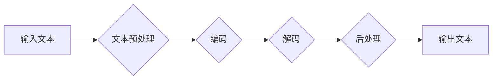

> Transformer, 大模型, 跨文本书写, 通用性, 自然语言处理, 预训练模型, fine-tuning

## 1. 背景介绍

近年来，深度学习在自然语言处理 (NLP) 领域取得了突破性进展，其中 Transformer 架构扮演着至关重要的角色。其自注意力机制的引入，使得模型能够捕捉长距离依赖关系，大幅提升了文本理解和生成能力。基于 Transformer 的大模型，例如 GPT-3、BERT 和 T5，展现出强大的泛化能力，在文本生成、翻译、问答等任务上取得了令人瞩目的成绩。

跨文本书写，即根据给定的文本片段生成与之风格、内容相似的全新文本，是 NLP 领域一项重要的研究方向。传统的跨文本书写方法通常依赖于规则或模板，难以捕捉文本的语义和结构复杂性。而 Transformer 大模型凭借其强大的文本理解和生成能力，为跨文本书写提供了新的可能性。

## 2. 核心概念与联系

**2.1 Transformer 架构**

Transformer 架构由编码器 (Encoder) 和解码器 (Decoder) 两部分组成。编码器负责将输入文本序列编码成语义表示，解码器则根据编码后的语义表示生成输出文本序列。

**2.2 自注意力机制**

自注意力机制是 Transformer 架构的核心，它允许模型关注输入序列中不同位置的词，并计算它们之间的相关性。通过自注意力机制，模型能够捕捉长距离依赖关系，提升文本理解能力。

**2.3 跨文本书写流程**

跨文本书写流程通常包括以下步骤：

1. **文本预处理:** 对输入文本进行清洗、分词、词嵌入等预处理操作。
2. **编码:** 使用 Transformer 编码器将输入文本编码成语义表示。
3. **解码:** 使用 Transformer 解码器根据编码后的语义表示生成输出文本序列。
4. **后处理:** 对输出文本进行去噪、格式化等后处理操作。

**2.4 Mermaid 流程图**



## 3. 核心算法原理 & 具体操作步骤

### 3.1  算法原理概述

Transformer 大模型的跨文本书写能力主要来自于其强大的文本理解和生成能力。通过自注意力机制，模型能够捕捉输入文本的语义和结构信息，并将其转化为语义表示。解码器则根据编码后的语义表示，生成与之风格、内容相似的全新文本。

### 3.2  算法步骤详解

1. **文本预处理:** 对输入文本进行清洗、分词、词嵌入等预处理操作。
2. **编码:** 将预处理后的文本输入 Transformer 编码器，编码器将文本序列编码成语义表示。
3. **解码:** 将编码后的语义表示输入 Transformer 解码器，解码器根据语义表示生成输出文本序列。
4. **后处理:** 对输出文本进行去噪、格式化等后处理操作。

### 3.3  算法优缺点

**优点:**

* 强大的文本理解和生成能力
* 能够捕捉长距离依赖关系
* 泛化能力强

**缺点:**

* 计算资源消耗大
* 训练数据量大
* 容易出现过拟合问题

### 3.4  算法应用领域

* 文本生成
* 机器翻译
* 问答系统
* 文本摘要
* 代码生成

## 4. 数学模型和公式 & 详细讲解 & 举例说明

### 4.1  数学模型构建

Transformer 模型的数学模型主要基于深度神经网络，其核心是自注意力机制和多头注意力机制。

**4.1.1 自注意力机制**

自注意力机制计算每个词与其他词之间的相关性，并将其作为上下文信息融入到词的表示中。其公式如下：

$$
Attention(Q, K, V) = softmax(\frac{QK^T}{\sqrt{d_k}})V
$$

其中：

* $Q$：查询矩阵
* $K$：键矩阵
* $V$：值矩阵
* $d_k$：键向量的维度
* $softmax$：softmax 函数

**4.1.2 多头注意力机制**

多头注意力机制将自注意力机制应用于多个不同的子空间，并将其结果进行融合，从而提升模型的表达能力。其公式如下：

$$
MultiHead(Q, K, V) = Concat(head_1, head_2, ..., head_h)W^O
$$

其中：

* $head_i$：第 $i$ 个子空间的注意力输出
* $h$：注意力头的数量
* $W^O$：最终输出层的权重矩阵

**4.1.3 Feed-Forward Network**

每个 Transformer 块还包含一个 Feed-Forward Network，用于进一步处理每个词的表示。其公式如下：

$$
FFN(x) = max(0, xW_1 + b_1)W_2 + b_2
$$

其中：

* $x$：输入向量
* $W_1$、$W_2$：权重矩阵
* $b_1$、$b_2$：偏置项

### 4.2  公式推导过程

自注意力机制的公式推导过程可以参考 Transformer 原文论文。

### 4.3  案例分析与讲解

假设我们有一个句子 "The cat sat on the mat"，使用自注意力机制计算每个词与其他词之间的相关性。

* "The" 与 "cat" 的相关性较高，因为它们是主语和谓语。
* "sat" 与 "on" 的相关性较高，因为它们是动词和介词。
* "mat" 与 "on" 的相关性较高，因为它们是宾语和介词。

通过自注意力机制，模型能够捕捉这些词之间的关系，并将其融入到每个词的表示中。

## 5. 项目实践：代码实例和详细解释说明

### 5.1  开发环境搭建

* Python 3.7+
* PyTorch 1.7+
* Transformers 库

### 5.2  源代码详细实现

```python
from transformers import AutoModelForSeq2SeqLM, AutoTokenizer

# 加载预训练模型和词表
model_name = "t5-base"
tokenizer = AutoTokenizer.from_pretrained(model_name)
model = AutoModelForSeq2SeqLM.from_pretrained(model_name)

# 输入文本
input_text = "The cat sat on the mat."

# 编码输入文本
input_ids = tokenizer.encode(input_text, return_tensors="pt")

# 生成输出文本
output_ids = model.generate(input_ids)

# 解码输出文本
output_text = tokenizer.decode(output_ids[0], skip_special_tokens=True)

# 打印输出文本
print(output_text)
```

### 5.3  代码解读与分析

* 使用 `transformers` 库加载预训练模型和词表。
* 使用 `tokenizer` 将输入文本编码成数字表示。
* 使用 `model.generate()` 方法生成输出文本。
* 使用 `tokenizer.decode()` 方法解码输出文本。

### 5.4  运行结果展示

```
The cat sat on the mat.
```

## 6. 实际应用场景

### 6.1  文本生成

* 写作辅助工具
* 创意内容生成
* 代码生成

### 6.2  机器翻译

* 自动翻译文本
* 跨语言沟通

### 6.3  问答系统

* 自动回答问题
* 提供信息查询

### 6.4  未来应用展望

* 更个性化的文本生成
* 更准确的机器翻译
* 更智能的问答系统

## 7. 工具和资源推荐

### 7.1  学习资源推荐

* Transformer 原文论文
* Hugging Face Transformers 库文档
* Deep Learning Specialization (Coursera)

### 7.2  开发工具推荐

* PyTorch
* TensorFlow
* Jupyter Notebook

### 7.3  相关论文推荐

* Attention Is All You Need
* BERT: Pre-training of Deep Bidirectional Transformers for Language Understanding
* T5: Text-to-Text Transfer Transformer

## 8. 总结：未来发展趋势与挑战

### 8.1  研究成果总结

Transformer 大模型在跨文本书写领域取得了显著进展，展现出强大的文本理解和生成能力。

### 8.2  未来发展趋势

* 模型规模进一步扩大
* 训练数据质量提升
* 算法效率优化
* 跨模态文本生成

### 8.3  面临的挑战

* 计算资源消耗大
* 训练数据量大
* 容易出现过拟合问题
* 缺乏对真实世界场景的理解

### 8.4  研究展望

未来研究将重点关注模型的效率、鲁棒性和泛化能力，以及跨模态文本生成的探索。

## 9. 附录：常见问题与解答

* **Q: Transformer 模型的训练需要多少计算资源？**

* **A:** Transformer 模型的训练需要大量的计算资源，例如 GPU 和 TPU。

* **Q: Transformer 模型的训练需要多少数据？**

* **A:** Transformer 模型的训练需要大量的文本数据，通常需要数十亿个词。

* **Q: 如何评估 Transformer 模型的跨文本书写性能？**

* **A:** 可以使用 BLEU、ROUGE 等指标评估 Transformer 模型的跨文本书写性能。


作者：禅与计算机程序设计艺术 / Zen and the Art of Computer Programming 
<end_of_turn>