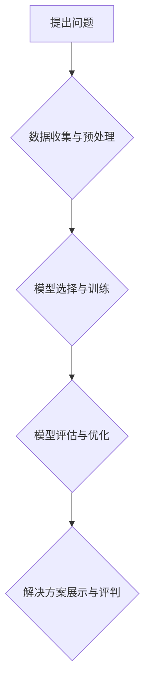

> AI hackathon, 创新, 创造力, 机器学习, 深度学习, 自然语言处理, 计算机视觉, 项目实践, 团队合作

## 1. 背景介绍

在当今科技飞速发展的时代，人工智能（AI）已成为引领未来发展的重要力量。AI hackathon作为一种独特的创新平台，为开发者、研究者和爱好者提供了一个展示才华、探索新技术和推动AI应用发展的绝佳机会。

AI hackathon通常是一个时间有限的竞赛活动，参赛者需要在短时间内利用AI技术解决特定问题或开发创新应用。这些活动不仅激发了参与者的创造力和创新精神，也促进了AI技术的快速发展和应用推广。

## 2. 核心概念与联系

**2.1 AI Hackathon 的核心概念**

AI hackathon的核心概念是将人工智能技术与快速迭代、团队合作和创新精神相结合，以解决实际问题或开发新应用。

**2.2 AI Hackathon 与创新和创造力的联系**

AI hackathon为创新和创造力提供了独特的平台：

* **激发灵感:** 参与者可以接触到最新的AI技术和应用案例，激发新的想法和灵感。
* **促进团队合作:** 团队合作是AI hackathon的必要条件，参与者需要协同工作，共同解决问题，这有助于培养团队合作精神和创新能力。
* **快速迭代:** AI hackathon的时间限制促使参与者快速迭代，不断改进和优化他们的解决方案，这有助于提高创新效率。
* **开放环境:** AI hackathon通常是一个开放的环境，参与者可以自由交流、分享经验和学习新知识，这有助于促进创新和创造力的发展。

**2.3 AI Hackathon 的流程图**



## 3. 核心算法原理 & 具体操作步骤

**3.1 算法原理概述**

在AI hackathon中，常用的算法包括机器学习、深度学习、自然语言处理和计算机视觉等。

* **机器学习:** 机器学习算法通过学习数据中的模式来预测未来结果。常见的机器学习算法包括线性回归、逻辑回归、决策树、支持向量机和随机森林等。
* **深度学习:** 深度学习是机器学习的一个子集，它使用多层神经网络来学习数据中的复杂模式。深度学习算法在图像识别、语音识别和自然语言处理等领域取得了突破性的进展。
* **自然语言处理:** 自然语言处理是指让计算机理解和处理人类语言的技术。常见的自然语言处理任务包括文本分类、情感分析、机器翻译和问答系统等。
* **计算机视觉:** 计算机视觉是指让计算机“看”和理解图像的技术。常见的计算机视觉任务包括图像识别、物体检测、图像分割和图像生成等。

**3.2 算法步骤详解**

以下以机器学习算法为例，详细说明其步骤：

1. **数据收集:** 收集与目标问题相关的训练数据。
2. **数据预处理:** 对收集到的数据进行清洗、转换和特征工程，使其适合模型训练。
3. **模型选择:** 根据问题的特点和数据的类型选择合适的机器学习算法。
4. **模型训练:** 使用训练数据训练选择的模型，调整模型参数以获得最佳性能。
5. **模型评估:** 使用测试数据评估模型的性能，并根据评估结果进行模型优化。
6. **模型部署:** 将训练好的模型部署到实际应用环境中。

**3.3 算法优缺点**

不同的算法具有不同的优缺点，需要根据具体问题选择合适的算法。

* **优点:** 能够从数据中学习模式，并进行预测或分类。
* **缺点:** 需要大量的训练数据，训练时间较长，对数据质量要求较高。

**3.4 算法应用领域**

机器学习算法广泛应用于各个领域，例如：

* **医疗保健:** 疾病诊断、药物研发、患者风险评估。
* **金融:** 欺诈检测、信用评分、投资预测。
* **电商:** 商品推荐、用户画像、个性化营销。
* **交通:** 自驾车、交通流量预测、道路安全监控。

## 4. 数学模型和公式 & 详细讲解 & 举例说明

**4.1 数学模型构建**

机器学习算法通常基于数学模型，这些模型通过参数来描述数据之间的关系。例如，线性回归模型假设数据之间存在线性关系，可以用以下公式表示：

$$y = mx + c$$

其中，y是预测值，x是输入特征，m是斜率，c是截距。

**4.2 公式推导过程**

机器学习算法的训练过程本质上是参数优化过程。常用的优化算法包括梯度下降法、随机梯度下降法和Adam算法等。这些算法通过迭代更新参数，使得模型的预测结果与实际值之间的误差最小化。

**4.3 案例分析与讲解**

以线性回归为例，假设我们想要预测房屋价格，输入特征包括房屋面积和房间数量。我们可以使用线性回归模型构建一个数学模型，并通过训练数据进行参数优化，最终得到一个能够预测房屋价格的模型。

## 5. 项目实践：代码实例和详细解释说明

**5.1 开发环境搭建**

AI hackathon通常使用Python作为编程语言，并结合一些常用的机器学习库，例如Scikit-learn、TensorFlow和PyTorch等。

**5.2 源代码详细实现**

以下是一个简单的线性回归模型的Python代码实现：

```python
from sklearn.linear_model import LinearRegression
from sklearn.model_selection import train_test_split
from sklearn.metrics import mean_squared_error

# 准备数据
X = [[100, 2], [150, 3], [200, 4], [250, 5]]  # 房屋面积和房间数量
y = [200000, 300000, 400000, 500000]  # 房屋价格

# 将数据分成训练集和测试集
X_train, X_test, y_train, y_test = train_test_split(X, y, test_size=0.2)

# 创建线性回归模型
model = LinearRegression()

# 训练模型
model.fit(X_train, y_train)

# 预测测试集数据
y_pred = model.predict(X_test)

# 计算模型性能
mse = mean_squared_error(y_test, y_pred)
print(f"Mean Squared Error: {mse}")
```

**5.3 代码解读与分析**

这段代码首先准备了房屋面积和房间数量以及房屋价格的数据。然后，将数据分成训练集和测试集，用于训练和评估模型。

接下来，创建了一个线性回归模型，并使用训练数据进行训练。训练完成后，可以使用模型预测测试集数据的房屋价格。最后，计算模型的性能指标，例如均方误差（MSE）。

**5.4 运行结果展示**

运行这段代码后，会输出模型的均方误差值。这个值越小，表示模型的预测性能越好。

## 6. 实际应用场景

AI hackathon的成果可以应用于各个领域，例如：

* **医疗保健:** 开发疾病诊断系统、药物研发平台、患者风险评估工具等。
* **金融:** 建立欺诈检测系统、信用评分模型、投资预测平台等。
* **电商:** 推送个性化商品推荐、分析用户行为、优化营销策略等。
* **交通:** 开发智能交通系统、自动驾驶技术、道路安全监控系统等。

**6.4 未来应用展望**

随着AI技术的不断发展，AI hackathon将发挥越来越重要的作用，推动AI技术的创新和应用。未来，AI hackathon可能会更加注重以下方面：

* **跨领域合作:** 鼓励来自不同领域的开发者和研究者合作，解决更复杂的问题。
* **伦理和社会影响:** 关注AI技术的伦理和社会影响，促进负责任的AI开发和应用。
* **可解释性:** 开发更可解释的AI模型，帮助人们理解AI的决策过程。

## 7. 工具和资源推荐

**7.1 学习资源推荐**

* **在线课程:** Coursera、edX、Udacity等平台提供丰富的AI课程。
* **书籍:** 《深度学习》、《机器学习实战》等书籍是学习AI技术的经典教材。
* **博客和论坛:** Kaggle、Medium、Stack Overflow等平台提供大量的AI技术博客和论坛讨论。

**7.2 开发工具推荐**

* **Python:** 作为AI开发的主要编程语言，Python拥有丰富的机器学习库和工具。
* **Scikit-learn:** Python机器学习库，提供各种经典机器学习算法。
* **TensorFlow:** Google开发的深度学习框架，支持GPU加速。
* **PyTorch:** Facebook开发的深度学习框架，灵活易用。

**7.3 相关论文推荐**

* **《ImageNet Classification with Deep Convolutional Neural Networks》:** 
介绍了AlexNet模型，标志着深度学习在图像识别领域的突破。
* **《Attention Is All You Need》:** 
提出了Transformer模型， revolutionized natural language processing.

## 8. 总结：未来发展趋势与挑战

**8.1 研究成果总结**

AI hackathon推动了AI技术的快速发展，涌现出许多创新应用。

**8.2 未来发展趋势**

未来，AI hackathon将更加注重跨领域合作、伦理和社会影响、可解释性等方面。

**8.3 面临的挑战**

AI hackathon面临着数据获取、算法复杂度、伦理道德等挑战。

**8.4 研究展望**

未来，需要加强AI人才培养、促进AI技术与产业融合，推动AI技术向更广泛领域应用。

## 9. 附录：常见问题与解答

**9.1 如何选择合适的AI算法？**

选择合适的AI算法需要根据具体问题和数据的特点进行分析。

**9.2 如何评估AI模型的性能？**

常用的AI模型性能评估指标包括准确率、召回率、F1-score、AUC等。

**9.3 如何解决AI模型的过拟合问题？**

常用的解决AI模型过拟合问题的技术包括正则化、交叉验证、数据增强等。


作者：禅与计算机程序设计艺术 / Zen and the Art of Computer Programming 
<end_of_turn>