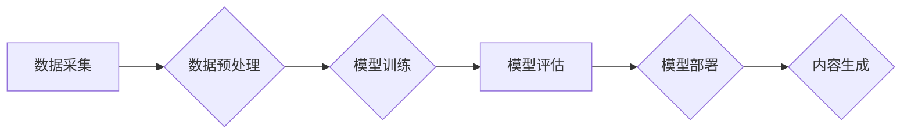

> AIGC, 文本生成, 图像生成, 算法原理, 实践应用, 未来趋势

## 1. 背景介绍

人工智能（AI）技术近年来发展迅速，特别是生成式人工智能（AIGC）的兴起，正在深刻地改变着我们生活和工作的方式。AIGC是指能够生成新内容的AI模型，例如文本、图像、音频、视频等。与传统的AI模型相比，AIGC更加注重创造性和想象力，能够自主地生成具有原创性的内容。

AIGC技术的应用场景广泛，涵盖了各个领域，例如：

* **内容创作:** 自动生成新闻报道、广告文案、小说、诗歌等。
* **艺术创作:** 生成绘画、音乐、视频等艺术作品。
* **教育培训:** 提供个性化的学习内容和互动体验。
* **软件开发:** 自动生成代码、测试用例等。
* **科学研究:** 辅助科学家进行数据分析、模型构建等。

AIGC技术的出现，为人类创造了无限的可能性，但也带来了新的挑战和机遇。

## 2. 核心概念与联系

AIGC的核心概念包括：

* **深度学习:** AIGC模型通常基于深度学习算法，例如Transformer、GAN等。
* **自然语言处理 (NLP):** 用于理解和生成人类语言的算法。
* **计算机视觉 (CV):** 用于理解和生成图像的算法。
* **数据驱动:** AIGC模型需要大量的训练数据才能有效工作。

**Mermaid 流程图:**



## 3. 核心算法原理 & 具体操作步骤

### 3.1  算法原理概述

AIGC模型通常采用生成式对抗网络 (GAN) 或 Transformer 等深度学习算法。

* **GAN:** 由两个网络组成：生成器和鉴别器。生成器试图生成逼真的数据，而鉴别器试图区分真实数据和生成数据。两者相互竞争，最终生成器能够生成与真实数据相似的样本。
* **Transformer:** 是一种基于注意力机制的深度学习模型，能够有效地处理序列数据，例如文本。

### 3.2  算法步骤详解

**GAN 算法步骤:**

1. 初始化生成器和鉴别器网络。
2. 生成器生成样本数据。
3. 鉴别器对真实数据和生成数据进行分类。
4. 根据鉴别器的反馈，更新生成器和鉴别器的参数。
5. 重复步骤 2-4，直到生成器能够生成逼真的样本数据。

**Transformer 算法步骤:**

1. 将输入序列转换为词嵌入向量。
2. 利用多头注意力机制，计算每个词与其他词之间的关系。
3. 通过前馈神经网络，对每个词进行编码。
4. 将编码后的词向量拼接起来，得到最终的输出序列。

### 3.3  算法优缺点

**GAN 算法:**

* **优点:** 可以生成逼真的样本数据。
* **缺点:** 训练过程比较复杂，容易出现模式崩溃问题。

**Transformer 算法:**

* **优点:** 能够有效地处理长序列数据，并具有强大的表达能力。
* **缺点:** 计算量较大，训练成本较高。

### 3.4  算法应用领域

* **GAN:** 图像生成、视频生成、语音合成、数据增强等。
* **Transformer:** 机器翻译、文本摘要、问答系统、对话系统等。

## 4. 数学模型和公式 & 详细讲解 & 举例说明

### 4.1  数学模型构建

**GAN 模型:**

* **生成器:** G(z)
* **鉴别器:** D(x)

其中，z 是随机噪声向量，x 是真实数据样本。

**目标函数:**

* **生成器:** L_G = E_{x~p_data(x)}[log(1-D(G(z)))]
* **鉴别器:** L_D = E_{x~p_data(x)}[log(D(x))] + E_{z~p_z(z)}[log(1-D(G(z)))]

**解释:**

* 生成器试图最大化鉴别器对生成数据的判别错误率。
* 鉴别器试图最大化对真实数据的判别正确率，并最小化对生成数据的判别错误率。

**Transformer 模型:**

* **注意力机制:**

$$
Attention(Q, K, V) = \frac{exp(Q \cdot K^T / \sqrt{d_k})}{exp(Q \cdot K^T / \sqrt{d_k})} \cdot V
$$

其中，Q、K、V 分别是查询矩阵、键矩阵和值矩阵。

**解释:**

* 注意力机制能够学习到不同词之间的关系，并赋予不同的词不同的权重。

### 4.2  公式推导过程

**GAN 模型目标函数推导:**

* 生成器目标函数：

$$
L_G = E_{x~p_data(x)}[log(1-D(G(z)))]
$$

* 鉴别器目标函数：

$$
L_D = E_{x~p_data(x)}[log(D(x))] + E_{z~p_z(z)}[log(1-D(G(z)))]
$$

### 4.3  案例分析与讲解

**GAN 模型案例:**

* **图像生成:** 使用 GAN 生成逼真的图像，例如人脸、风景、物体等。

**Transformer 模型案例:**

* **机器翻译:** 使用 Transformer 模型进行机器翻译，例如将英文翻译成中文。

## 5. 项目实践：代码实例和详细解释说明

### 5.1  开发环境搭建

* Python 3.x
* TensorFlow 或 PyTorch
* CUDA 和 cuDNN (可选)

### 5.2  源代码详细实现

```python
# GAN 模型代码示例

import tensorflow as tf

# 生成器模型
def generator(z):
  # ...

# 鉴别器模型
def discriminator(x):
  # ...

# 训练循环
for epoch in range(num_epochs):
  for batch in dataset:
    # ...

```

### 5.3  代码解读与分析

* 生成器模型负责生成样本数据。
* 鉴别器模型负责区分真实数据和生成数据。
* 训练循环中，生成器和鉴别器模型交替训练，直到生成器能够生成逼真的样本数据。

### 5.4  运行结果展示

* 生成器生成的样本数据与真实数据相似。

## 6. 实际应用场景

### 6.1  内容创作

* 自动生成新闻报道、广告文案、小说、诗歌等。

### 6.2  艺术创作

* 生成绘画、音乐、视频等艺术作品。

### 6.3  教育培训

* 提供个性化的学习内容和互动体验。

### 6.4  未来应用展望

* 更逼真的内容生成。
* 更广泛的应用场景。
* 更智能的交互体验。

## 7. 工具和资源推荐

### 7.1  学习资源推荐

* **书籍:**
    * 《深度学习》
    * 《Generative Deep Learning》
* **在线课程:**
    * Coursera
    * edX

### 7.2  开发工具推荐

* **TensorFlow:** 开源深度学习框架。
* **PyTorch:** 开源深度学习框架。
* **Hugging Face:** 提供预训练模型和工具。

### 7.3  相关论文推荐

* **Generative Adversarial Networks**
* **Attention Is All You Need**

## 8. 总结：未来发展趋势与挑战

### 8.1  研究成果总结

AIGC技术取得了显著的进展，能够生成逼真的文本、图像、音频等内容。

### 8.2  未来发展趋势

* 更强大的模型和算法。
* 更广泛的应用场景。
* 更智能的交互体验。

### 8.3  面临的挑战

* 数据安全和隐私问题。
* 内容质量和可控性问题。
* 伦理和社会影响问题。

### 8.4  研究展望

* 研究更安全、更可靠的AIGC模型。
* 开发更有效的AIGC应用场景。
* 探讨AIGC技术对社会的影响。

## 9. 附录：常见问题与解答

* **Q: AIGC技术会取代人类吗？**
* **A:** AIGC技术可以帮助人类提高效率和创造力，但不会取代人类。

* **Q: 如何使用AIGC技术？**
* **A:** 可以使用现有的AIGC平台或工具，也可以自己开发AIGC模型。

* **Q: AIGC技术的伦理问题有哪些？**
* **A:** AIGC技术可能导致内容造假、信息误导等问题，需要谨慎使用。


作者：禅与计算机程序设计艺术 / Zen and the Art of Computer Programming 
<end_of_turn>