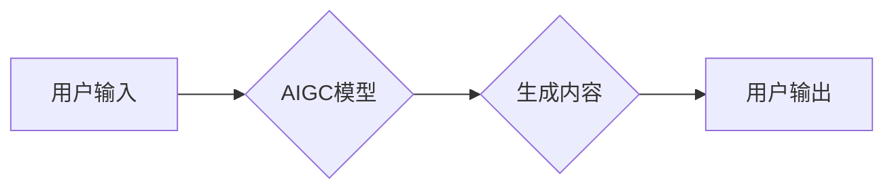

> AIGC, 营销, 影视创作, 游戏, 人工智能, 生成式模型, 自然语言处理, 图像生成, 算法

## 1. 背景介绍

近年来，人工智能（AI）技术取得了飞速发展，特别是生成式人工智能（AIGC）的兴起，为各行各业带来了革命性的变革。AIGC是指利用人工智能技术，从数据中学习并生成新的内容，例如文本、图像、音频、视频等。

AIGC在营销、影视创作和游戏等领域展现出巨大的应用潜力。它可以帮助企业更高效地进行营销推广，提升影视作品的制作效率，丰富游戏体验，并为用户提供更个性化的服务。

## 2. 核心概念与联系

**2.1 核心概念**

* **AIGC (生成式人工智能)**：利用机器学习算法，从现有数据中学习模式，并生成新的、类似于训练数据的内容。
* **自然语言处理 (NLP)**：让计算机理解和处理人类语言，包括文本分析、机器翻译、文本生成等。
* **计算机视觉 (CV)**：让计算机“看”图像和视频，包括图像识别、物体检测、图像生成等。

**2.2 联系**

AIGC的应用通常结合了NLP和CV等技术，例如：

* **文本生成**: 利用NLP技术，AIGC可以生成各种类型的文本，如广告文案、新闻报道、小说情节等。
* **图像生成**: 利用CV技术，AIGC可以生成逼真的图像，如产品图片、场景渲染、人物肖像等。
* **视频生成**: AIGC可以结合NLP和CV技术，生成视频内容，如广告片、动画短片、虚拟主播等。

**2.3 架构图**



## 3. 核心算法原理 & 具体操作步骤

**3.1 算法原理概述**

AIGC的核心算法主要包括：

* **深度学习**: 利用多层神经网络，从海量数据中学习复杂的模式。
* **Transformer**: 一种新型的深度学习架构，能够处理长序列数据，在自然语言处理领域取得了突破性进展。
* **生成对抗网络 (GAN)**: 由两个神经网络组成，一个生成器生成数据，另一个鉴别器判断数据真实性，通过对抗训练，生成器可以生成越来越逼真的数据。

**3.2 算法步骤详解**

以文本生成为例，AIGC的具体操作步骤如下：

1. **数据预处理**: 收集和清洗文本数据，进行分词、词性标注等处理。
2. **模型训练**: 利用深度学习算法，训练AIGC模型，使其能够理解文本的语法和语义。
3. **文本生成**: 根据用户输入的提示或上下文，AIGC模型生成新的文本内容。
4. **文本后处理**: 对生成的文本进行语法检查、格式调整等处理，使其更加流畅自然。

**3.3 算法优缺点**

**优点**:

* 可以生成高质量、多样化的内容。
* 能够自动化内容创作流程，提高效率。
* 可以根据用户需求定制化内容。

**缺点**:

* 需要大量的训练数据。
* 模型训练成本较高。
* 生成的内容可能存在偏差或错误。

**3.4 算法应用领域**

* **营销**: 生成广告文案、产品描述、社交媒体内容等。
* **影视创作**: 生成剧本、人物对话、场景描述等。
* **游戏**: 生成游戏剧情、人物设定、游戏地图等。
* **教育**: 生成学习材料、习题、个性化辅导等。

## 4. 数学模型和公式 & 详细讲解 & 举例说明

**4.1 数学模型构建**

AIGC模型通常基于深度学习架构，例如Transformer，其核心是多层神经网络，每个层包含多个神经元，通过权重和激活函数进行信息传递。

**4.2 公式推导过程**

深度学习模型的训练过程基于梯度下降算法，目标是最小化模型预测与真实值的误差。

损失函数：

$$L = \sum_{i=1}^{N} \mathcal{L}(y_i, \hat{y}_i)$$

其中：

* $L$ 为损失函数
* $N$ 为样本数量
* $\mathcal{L}$ 为单个样本的损失函数
* $y_i$ 为真实值
* $\hat{y}_i$ 为模型预测值

梯度下降算法：

$$\theta = \theta - \alpha \nabla L(\theta)$$

其中：

* $\theta$ 为模型参数
* $\alpha$ 为学习率
* $\nabla L(\theta)$ 为损失函数对参数的梯度

**4.3 案例分析与讲解**

以文本生成为例，可以使用Transformer模型进行训练。训练数据可以是大量的文本书籍、文章等。模型训练完成后，可以输入一个文本提示，例如“今天天气真好”，模型可以根据训练数据生成相应的文本内容，例如“阳光明媚，万里无云”。

## 5. 项目实践：代码实例和详细解释说明

**5.1 开发环境搭建**

* Python 3.7+
* TensorFlow/PyTorch
* CUDA/cuDNN

**5.2 源代码详细实现**

```python
# 使用预训练的Transformer模型进行文本生成
from transformers import pipeline

generator = pipeline("text-generation", model="gpt2")

text = generator("今天天气真好", max_length=50, num_return_sequences=3)

for output in text:
    print(output["generated_text"])
```

**5.3 代码解读与分析**

* 使用`transformers`库加载预训练的GPT-2模型。
* 使用`pipeline`函数创建文本生成器。
* 调用`generator`函数进行文本生成，输入提示文本，设置最大长度和生成数量。
* 打印生成的文本内容。

**5.4 运行结果展示**

```
今天天气真好，阳光明媚，万里无云。
今天天气真好，蓝天白云，心情愉悦。
今天天气真好，适合出去散步。
```

## 6. 实际应用场景

**6.1 营销**

* **广告文案生成**: AIGC可以根据目标受众和产品特点，自动生成吸引人的广告文案。
* **产品描述生成**: AIGC可以根据产品信息，自动生成详细的产品描述，提高产品销售转化率。
* **社交媒体内容生成**: AIGC可以根据品牌风格和用户喜好，自动生成社交媒体内容，提高品牌曝光度。

**6.2 影视创作**

* **剧本创作**: AIGC可以根据特定主题和类型，自动生成剧本大纲和人物设定。
* **人物对话生成**: AIGC可以根据人物性格和剧情发展，自动生成人物对话，提高剧本的流畅度。
* **场景描述生成**: AIGC可以根据剧本需求，自动生成场景描述，为影视制作提供参考。

**6.3 游戏**

* **游戏剧情生成**: AIGC可以根据游戏设定和玩家行为，自动生成游戏剧情，提高游戏的可玩性。
* **人物设定生成**: AIGC可以根据游戏类型和角色需求，自动生成人物设定，丰富游戏的角色塑造。
* **游戏地图生成**: AIGC可以根据游戏规则和地图类型，自动生成游戏地图，提高游戏的探索性。

**6.4 未来应用展望**

AIGC技术的发展将进一步推动营销、影视创作和游戏等领域的创新。未来，AIGC可能应用于：

* **个性化内容创作**: 根据用户的喜好和需求，生成个性化的内容，例如定制化广告、个性化游戏体验等。
* **跨媒体内容创作**: 将文本、图像、音频、视频等多种媒体内容融合在一起，创造更丰富的用户体验。
* **虚拟现实 (VR) 和增强现实 (AR) 应用**: 在虚拟现实和增强现实环境中，利用AIGC生成动态内容，创造更沉浸式的体验。

## 7. 工具和资源推荐

**7.1 学习资源推荐**

* **书籍**:
    * 《深度学习》
    * 《自然语言处理》
    * 《生成对抗网络》
* **在线课程**:
    * Coursera: 深度学习
    * Udacity: 自然语言处理
    * fast.ai: 深度学习

**7.2 开发工具推荐**

* **TensorFlow**: 开源深度学习框架
* **PyTorch**: 开源深度学习框架
* **Hugging Face**: 提供预训练模型和工具

**7.3 相关论文推荐**

* **Attention Is All You Need**: Transformer模型的论文
* **Generative Adversarial Networks**: GAN模型的论文
* **BERT: Pre-training of Deep Bidirectional Transformers for Language Understanding**: BERT模型的论文

## 8. 总结：未来发展趋势与挑战

**8.1 研究成果总结**

AIGC技术取得了显著进展，能够生成高质量、多样化的内容，并在营销、影视创作和游戏等领域展现出巨大的应用潜力。

**8.2 未来发展趋势**

* **模型规模和能力提升**: 未来AIGC模型将更加强大，能够处理更复杂的任务，生成更逼真的内容。
* **多模态生成**: AIGC将融合文本、图像、音频、视频等多种模态，创造更丰富的用户体验。
* **个性化定制**: AIGC将更加注重用户需求，生成更加个性化的内容。

**8.3 面临的挑战**

* **数据安全和隐私**: AIGC模型的训练需要大量数据，如何保证数据安全和隐私是一个重要挑战。
* **内容质量和可控性**: 生成的内容可能存在偏差或错误，如何保证内容质量和可控性是一个需要解决的问题。
* **伦理和社会影响**: AIGC技术可能带来一些伦理和社会问题，例如内容造假、就业替代等，需要进行深入探讨和引导。

**8.4 研究展望**

未来，AIGC技术将继续发展，为人类社会带来更多创新和变革。我们需要加强对AIGC技术的研究和应用，并积极应对其带来的挑战，确保其健康发展。

## 9. 附录：常见问题与解答

**9.1 如何选择合适的AIGC模型？**

选择合适的AIGC模型需要根据具体应用场景和需求进行考虑。例如，用于文本生成的模型可以选择GPT-2、BERT等，用于图像生成的模型可以选择GAN等。

**9.2 如何评估AIGC模型的性能？**

AIGC模型的性能可以根据不同的指标进行评估，例如文本生成质量、图像生成逼真度、运行效率等。

**9.3 如何解决AIGC生成的文本存在偏差或错误的问题？**

可以通过以下方法解决AIGC生成的文本存在偏差或错误的问题：

* 使用更优质的训练数据。
* 调整模型参数，例如学习率、正则化参数等。
* 使用文本后处理技术，例如语法检查、事实验证等。


作者：禅与计算机程序设计艺术 / Zen and the Art of Computer Programming 
<end_of_turn>