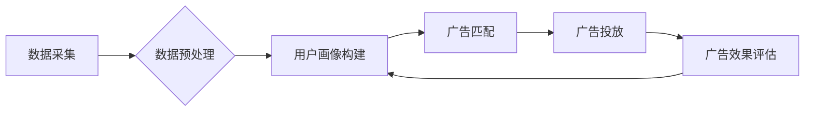

> AI代理，工作流，广告细分，机器学习，深度学习，自然语言处理，推荐系统

## 1. 背景介绍

在当今数据爆炸的时代，广告细分市场面临着巨大的挑战和机遇。传统广告投放方式往往缺乏精准度，难以有效触达目标用户，导致广告成本高昂，转化率低。而人工智能（AI）技术的快速发展为广告细分市场带来了新的希望。

AI代理工作流（AI Agent WorkFlow）是一种利用人工智能技术，自动完成广告投放流程的智能化系统。它可以根据用户的行为数据、兴趣偏好、购买历史等信息，智能地选择合适的广告，并进行精准投放，从而提高广告的点击率、转化率和投资回报率。

## 2. 核心概念与联系

### 2.1 AI代理

AI代理是一种能够自主学习、决策和执行任务的智能体。它可以模拟人类的行为，并根据预设的目标和规则，在复杂的环境中进行决策和行动。

### 2.2 工作流

工作流是一种描述业务流程的模型，它将一系列任务和活动按照一定的顺序和逻辑连接起来，形成一个完整的流程。

### 2.3 AI代理工作流

AI代理工作流将AI代理与工作流技术相结合，构建了一种智能化的广告投放系统。它可以自动完成以下任务：

* **数据采集和预处理:** 从各种数据源收集用户数据，并进行清洗、转换和预处理。
* **用户画像构建:** 利用机器学习算法，构建用户画像，分析用户的兴趣偏好、行为模式和购买习惯。
* **广告匹配:** 根据用户的画像信息，智能匹配合适的广告，并进行精准投放。
* **广告效果评估:** 监控广告的点击率、转化率等指标，并进行效果评估，优化广告投放策略。

**Mermaid 流程图**



## 3. 核心算法原理 & 具体操作步骤

### 3.1  算法原理概述

AI代理工作流的核心算法主要包括：

* **机器学习算法:** 用于构建用户画像，分析用户行为模式和兴趣偏好。常见的机器学习算法包括：
    * **分类算法:** 用于将用户分为不同的类别，例如兴趣爱好、年龄段、收入水平等。
    * **聚类算法:** 用于将用户按照相似度进行分组，例如兴趣相似的用户群体。
    * **推荐算法:** 用于根据用户的历史行为和兴趣偏好，推荐相关的广告。
* **深度学习算法:** 用于提取用户数据中的更深层次的特征，提高用户画像的准确性。常见的深度学习算法包括：
    * **卷积神经网络 (CNN):** 用于处理图像数据，例如用户浏览的网页、广告图片等。
    * **循环神经网络 (RNN):** 用于处理序列数据，例如用户的浏览历史、购买记录等。
* **自然语言处理 (NLP) 算法:** 用于分析用户的文本数据，例如搜索词、评论内容等，提取用户的意图和需求。

### 3.2  算法步骤详解

1. **数据收集:** 从各种数据源收集用户数据，例如用户行为数据、兴趣偏好数据、购买历史数据等。
2. **数据预处理:** 对收集到的数据进行清洗、转换和预处理，例如去除重复数据、格式化数据、处理缺失值等。
3. **用户画像构建:** 利用机器学习算法，构建用户画像，分析用户的兴趣偏好、行为模式和购买习惯。
4. **广告匹配:** 根据用户的画像信息，智能匹配合适的广告，并进行精准投放。
5. **广告效果评估:** 监控广告的点击率、转化率等指标，并进行效果评估，优化广告投放策略。

### 3.3  算法优缺点

**优点:**

* **精准投放:** 根据用户的画像信息，精准匹配合适的广告，提高广告的点击率和转化率。
* **自动化操作:** 自动完成广告投放流程，节省人工成本和时间。
* **数据驱动:** 基于数据分析，不断优化广告投放策略，提高广告效果。

**缺点:**

* **数据依赖:** AI代理工作流需要大量的数据支持，数据质量直接影响算法效果。
* **算法复杂:** 构建和训练AI代理模型需要复杂的算法和技术，需要专业的技术人员进行开发和维护。
* **隐私安全:** 用户数据需要进行安全保护，防止泄露和滥用。

### 3.4  算法应用领域

AI代理工作流在广告细分市场之外，还可应用于其他领域，例如：

* **电商推荐:** 根据用户的购买历史和浏览记录，推荐相关的商品。
* **金融理财:** 根据用户的风险偏好和投资目标，推荐合适的理财产品。
* **医疗诊断:** 根据用户的症状和病史，辅助医生进行诊断。

## 4. 数学模型和公式 & 详细讲解 & 举例说明

### 4.1  数学模型构建

AI代理工作流的数学模型主要包括：

* **用户画像模型:** 用于描述用户的特征和属性，例如年龄、性别、兴趣爱好、购买习惯等。
* **广告匹配模型:** 用于计算广告和用户的匹配度，例如广告内容与用户的兴趣偏好之间的相关性。
* **广告效果模型:** 用于预测广告的点击率、转化率等指标。

### 4.2  公式推导过程

**用户画像模型:**

假设用户 $u$ 的特征向量为 $x_u = (x_{u1}, x_{u2}, ..., x_{un})$, 其中 $n$ 为用户特征的维度。用户画像模型可以表示为：

$$
p(u) = \frac{exp(w^T x_u + b)}{Z}
$$

其中：

* $w$ 为权重向量，表示不同特征的重要性。
* $b$ 为偏置项。
* $Z$ 为归一化因子，确保概率分布的总和为 1。

**广告匹配模型:**

假设广告 $a$ 的特征向量为 $x_a = (x_{a1}, x_{a2}, ..., x_{am})$, 其中 $m$ 为广告特征的维度。广告匹配模型可以表示为：

$$
s(u, a) = w^T (x_u + x_a) + b
$$

其中：

* $w$ 为权重向量，表示广告和用户特征之间的相关性。
* $b$ 为偏置项。

**广告效果模型:**

假设广告 $a$ 的点击率为 $CTR_a$, 可以使用逻辑回归模型进行预测：

$$
CTR_a = \frac{1}{1 + exp(-(w^T x_a + b))}
$$

其中：

* $w$ 为权重向量，表示广告特征对点击率的影响。
* $b$ 为偏置项。

### 4.3  案例分析与讲解

假设我们有一个广告平台，需要根据用户的兴趣偏好，推荐相关的广告。

**用户画像:**

用户 $u$ 的特征向量为 $x_u = (25, \text{女性}, \text{兴趣爱好: 美食}, \text{购买历史: 服装})$。

**广告特征:**

广告 $a$ 的特征向量为 $x_a = (10, \text{女性}, \text{广告内容: 美食餐厅})$。

**广告匹配:**

使用广告匹配模型计算广告 $a$ 和用户 $u$ 的匹配度：

$$
s(u, a) = w^T (x_u + x_a) + b
$$

如果 $s(u, a)$ 的值较高，则表示广告 $a$ 和用户 $u$ 的匹配度较高，可以推荐给用户 $u$。

**广告效果:**

使用广告效果模型预测广告 $a$ 的点击率：

$$
CTR_a = \frac{1}{1 + exp(-(w^T x_a + b))}
$$

如果 $CTR_a$ 的值较高，则表示广告 $a$ 的效果较好，可以提高广告投放的优先级。

## 5. 项目实践：代码实例和详细解释说明

### 5.1  开发环境搭建

* **操作系统:** Ubuntu 20.04 LTS
* **编程语言:** Python 3.8
* **深度学习框架:** TensorFlow 2.0
* **数据处理库:** Pandas, NumPy
* **自然语言处理库:** NLTK, SpaCy

### 5.2  源代码详细实现

```python
# 用户画像模型
class UserPortraitModel(tf.keras.Model):
    def __init__(self, num_features, embedding_dim):
        super(UserPortraitModel, self).__init__()
        self.embedding = tf.keras.layers.Embedding(num_features, embedding_dim)
        self.dense = tf.keras.layers.Dense(1, activation='sigmoid')

    def call(self, inputs):
        embeddings = self.embedding(inputs)
        output = self.dense(embeddings)
        return output

# 广告匹配模型
class AdMatchingModel(tf.keras.Model):
    def __init__(self, user_dim, ad_dim):
        super(AdMatchingModel, self).__init__()
        self.dense = tf.keras.layers.Dense(1, activation='sigmoid')

    def call(self, inputs):
        user_features, ad_features = inputs
        combined_features = tf.concat([user_features, ad_features], axis=-1)
        output = self.dense(combined_features)
        return output

# 广告效果模型
class AdEffectModel(tf.keras.Model):
    def __init__(self, ad_dim):
        super(AdEffectModel, self).__init__()
        self.dense = tf.keras.layers.Dense(1, activation='sigmoid')

    def call(self, inputs):
        output = self.dense(inputs)
        return output

# 训练模型
# ...

# 推理模型
# ...
```

### 5.3  代码解读与分析

* **用户画像模型:** 使用嵌入层将用户特征转换为稠密的向量表示，然后使用全连接层进行分类。
* **广告匹配模型:** 将用户特征和广告特征进行拼接，然后使用全连接层进行匹配度预测。
* **广告效果模型:** 使用全连接层预测广告的点击率。

### 5.4  运行结果展示

* **用户画像:** 可以展示用户的兴趣偏好、行为模式和购买习惯。
* **广告匹配:** 可以展示广告和用户的匹配度。
* **广告效果:** 可以展示广告的点击率、转化率等指标。

## 6. 实际应用场景

AI代理工作流在广告细分市场中的应用场景非常广泛，例如：

* **精准广告投放:** 根据用户的画像信息，精准投放广告，提高广告的点击率和转化率。
* **个性化推荐:** 根据用户的兴趣偏好，推荐相关的广告，提高用户的体验和满意度。
* **自动化广告运营:** 自动完成广告投放流程，节省人工成本和时间。
* **广告效果优化:** 利用数据分析，不断优化广告投放策略，提高广告效果。

### 6.4  未来应用展望

随着人工智能技术的不断发展，AI代理工作流将在广告细分市场中发挥更加重要的作用。未来，AI代理工作流可能应用于以下领域：

* **跨平台广告投放:** 将广告投放到不同的平台，例如搜索引擎、社交媒体、移动应用等。
* **多模态广告投放:** 将广告投放到不同的媒体，例如文本、图片、视频等。
* **实时广告投放:** 根据用户的实时行为，动态调整广告投放策略。

## 7. 工具和资源推荐

### 7.1  学习资源推荐

* **书籍:**
    * 《深度学习》
    * 《机器学习