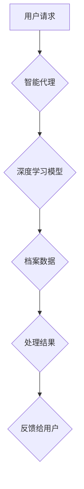

> 深度学习、档案管理、智能代理、自然语言处理、计算机视觉、数据挖掘、知识图谱

## 1. 背景介绍

随着信息时代的到来，数据爆炸式增长，档案管理面临着前所未有的挑战。传统档案管理模式依赖于人工操作，效率低下，易出错，难以满足现代社会对信息获取和利用的需求。人工智能（AI）技术，特别是深度学习算法，为档案管理带来了新的机遇。

深度学习算法能够自动学习数据中的复杂模式和关系，具有强大的数据分析和处理能力。将深度学习技术应用于档案管理，可以实现自动化、智能化、高效化的档案管理系统，提升档案管理效率，降低人力成本，提高档案利用率。

## 2. 核心概念与联系

**2.1 档案管理**

档案管理是指对档案的收集、整理、保存、利用和销毁等全过程的管理活动。其目标是确保档案的完整性、准确性和安全性，并为用户提供及时、便捷的档案服务。

**2.2 深度学习**

深度学习是一种机器学习的子领域，它利用多层神经网络来模拟人类大脑的学习过程。深度学习算法能够从海量数据中自动学习特征，并进行复杂的模式识别和预测。

**2.3 智能代理**

智能代理是一种能够自主执行任务的软件程序。它能够感知环境、做出决策并执行相应的行动。在档案管理领域，智能代理可以自动完成档案的分类、检索、整理等任务，解放人力资源。

**2.4 核心架构**



## 3. 核心算法原理 & 具体操作步骤

**3.1 算法原理概述**

在档案管理领域，深度学习算法可以应用于以下几个方面：

* **档案分类:** 利用深度学习算法对档案进行自动分类，例如根据主题、时间、类型等进行分类。
* **档案检索:** 利用深度学习算法对档案进行检索，例如根据关键词、语义等进行检索。
* **档案整理:** 利用深度学习算法对档案进行整理，例如自动提取关键信息、生成摘要等。

**3.2 算法步骤详解**

以档案分类为例，深度学习算法的具体操作步骤如下：

1. **数据收集和预处理:** 收集大量的档案数据，并进行预处理，例如文本清洗、格式转换等。
2. **特征提取:** 利用深度学习算法提取档案数据的特征，例如词向量、图像特征等。
3. **模型训练:** 利用训练数据训练深度学习模型，例如卷积神经网络（CNN）、循环神经网络（RNN）等。
4. **模型评估:** 利用测试数据评估模型的性能，例如准确率、召回率等。
5. **模型部署:** 将训练好的模型部署到生产环境中，用于对新档案进行分类。

**3.3 算法优缺点**

**优点:**

* 自动化程度高，可以解放人力资源。
* 准确率高，能够识别出复杂的模式和关系。
* 可扩展性强，可以处理海量数据。

**缺点:**

* 需要大量的训练数据。
* 模型训练时间长，计算资源消耗大。
* 对数据质量要求高，数据噪声会影响模型性能。

**3.4 算法应用领域**

深度学习算法在档案管理领域的应用场景广泛，例如：

* **政府档案管理:** 自动分类、检索和整理政府档案，提高档案利用率。
* **企业档案管理:** 自动分类、检索和管理企业档案，方便企业内部信息共享。
* **图书馆档案管理:** 自动分类、检索和管理图书馆藏书，提高图书馆服务效率。

## 4. 数学模型和公式 & 详细讲解 & 举例说明

**4.1 数学模型构建**

在档案分类任务中，我们可以使用多分类支持向量机（Multi-class SVM）作为深度学习模型。

**4.2 公式推导过程**

SVM的目标是找到一个超平面，将不同类别的档案数据分开。

$$
\min_{w,b} \frac{1}{2}||w||^2 + C \sum_{i=1}^{N} \xi_i
$$

$$
y_i (w^T x_i + b) \geq 1 - \xi_i
$$

其中：

* $w$ 是权重向量
* $b$ 是偏置项
* $x_i$ 是第 $i$ 个档案数据的特征向量
* $y_i$ 是第 $i$ 个档案数据的类别标签
* $C$ 是惩罚参数
* $\xi_i$ 是松弛变量

**4.3 案例分析与讲解**

假设我们有一个档案分类任务，需要将档案分为三个类别：新闻、科技、财经。我们可以使用多分类 SVM 模型进行训练。

训练数据包括大量的档案文本数据，以及对应的类别标签。模型训练完成后，我们可以使用训练好的模型对新的档案文本进行分类。

## 5. 项目实践：代码实例和详细解释说明

**5.1 开发环境搭建**

* Python 3.6+
* TensorFlow 2.0+
* Keras 2.0+
* NLTK 3.5+

**5.2 源代码详细实现**

```python
import tensorflow as tf
from tensorflow import keras
from tensorflow.keras import layers

# 定义模型结构
model = keras.Sequential(
    [
        layers.Embedding(input_dim=vocab_size, output_dim=embedding_dim),
        layers.LSTM(units=128),
        layers.Dense(units=num_classes, activation="softmax"),
    ]
)

# 编译模型
model.compile(
    optimizer="adam",
    loss="sparse_categorical_crossentropy",
    metrics=["accuracy"],
)

# 训练模型
model.fit(x_train, y_train, epochs=10, batch_size=32)

# 评估模型
loss, accuracy = model.evaluate(x_test, y_test)
print("Loss:", loss)
print("Accuracy:", accuracy)
```

**5.3 代码解读与分析**

* 首先，我们定义了一个深度学习模型，使用 Embedding 层将文本数据转换为词向量，使用 LSTM 层提取文本特征，最后使用 Dense 层进行分类。
* 然后，我们编译模型，使用 Adam 优化器，交叉熵损失函数，以及准确率作为评估指标。
* 最后，我们训练模型，并评估模型的性能。

**5.4 运行结果展示**

训练完成后，我们可以使用训练好的模型对新的档案文本进行分类。

## 6. 实际应用场景

**6.1 政府档案管理**

* 自动分类和检索政府档案，提高档案利用率。
* 自动提取政府档案中的关键信息，例如时间、地点、人物等。
* 自动生成政府档案的摘要和报告。

**6.2 企业档案管理**

* 自动分类和检索企业档案，方便企业内部信息共享。
* 自动提取企业档案中的关键信息，例如合同条款、财务数据等。
* 自动生成企业档案的报表和分析报告。

**6.3 图书馆档案管理**

* 自动分类和检索图书馆藏书，提高图书馆服务效率。
* 自动提取图书馆藏书中的关键信息，例如作者、出版社、出版年份等。
* 自动生成图书馆藏书的目录和检索结果。

**6.4 未来应用展望**

随着深度学习技术的不断发展，在档案管理领域的应用场景将会更加广泛。例如：

* 利用深度学习技术实现档案的智能化管理，例如自动识别档案的损坏程度，自动修复档案的损坏部分。
* 利用深度学习技术实现档案的跨语言检索，例如可以根据中文关键词检索英文档案。
* 利用深度学习技术实现档案的知识图谱构建，例如可以将档案中的知识点进行关联，构建档案知识图谱。

## 7. 工具和资源推荐

**7.1 学习资源推荐**

* 深度学习入门书籍：
    * 《深度学习》
    * 《动手学深度学习》
* 深度学习在线课程：
    * Coursera 深度学习课程
    * Udacity 深度学习课程

**7.2 开发工具推荐**

* TensorFlow
* PyTorch
* Keras

**7.3 相关论文推荐**

* 《利用深度学习技术进行档案分类》
* 《基于深度学习的档案检索系统》
* 《深度学习在档案管理中的应用研究》

## 8. 总结：未来发展趋势与挑战

**8.1 研究成果总结**

深度学习算法在档案管理领域取得了显著的成果，例如自动分类、检索和整理档案，提高了档案管理效率。

**8.2 未来发展趋势**

未来，深度学习算法在档案管理领域的应用将会更加广泛，例如实现档案的智能化管理、跨语言检索、知识图谱构建等。

**8.3 面临的挑战**

* 数据质量问题：深度学习算法对数据质量要求高，数据噪声会影响模型性能。
* 计算资源问题：深度学习模型训练需要大量的计算资源。
* 算法解释性问题：深度学习模型的决策过程难以解释，这可能会导致模型的不可信赖性。

**8.4 研究展望**

未来研究方向包括：

* 开发更鲁棒的深度学习算法，能够处理数据噪声和不完整的数据。
* 研究更有效的深度学习模型训练方法，降低计算资源消耗。
* 研究深度学习模型的解释性方法，提高模型的可信赖性。

## 9. 附录：常见问题与解答

**9.1 如何选择合适的深度学习算法？**

选择合适的深度学习算法取决于具体的档案管理任务。例如，对于文本分类任务，可以使用 RNN 或 Transformer 模型；对于图像分类任务，可以使用 CNN 模型。

**9.2 如何处理档案数据中的噪声？**

可以采用数据清洗、数据增强等方法来处理档案数据中的噪声。

**9.3 如何评估深度学习模型的性能？**

可以使用准确率、召回率、F1-score 等指标来评估深度学习模型的性能。


作者：禅与计算机程序设计艺术 / Zen and the Art of Computer Programming 
<end_of_turn>