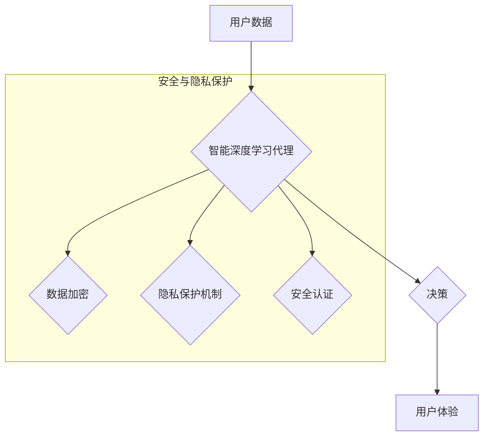

> 深度学习，智能代理，安全，隐私，联邦学习，对抗训练，差分隐私

## 1. 背景介绍

深度学习算法近年来取得了令人瞩目的成就，在图像识别、自然语言处理、语音识别等领域展现出强大的能力。智能深度学习代理作为深度学习技术的应用，能够自主学习和决策，在自动驾驶、医疗诊断、金融交易等领域具有广阔的应用前景。然而，智能深度学习代理的安全性和隐私保护问题也日益受到关注。

智能深度学习代理通常需要访问和处理大量敏感数据，例如用户个人信息、医疗记录、财务数据等。如果这些数据被恶意攻击者窃取或泄露，将可能导致严重的后果，例如身份盗窃、医疗欺诈、金融损失等。此外，智能深度学习代理的决策过程也可能受到攻击者操纵，导致代理做出错误或有害的决策。

因此，保障智能深度学习代理的安全性和隐私保护至关重要。

## 2. 核心概念与联系

**2.1 智能深度学习代理**

智能深度学习代理是指能够自主学习和决策的软件系统，其核心是深度学习算法。智能深度学习代理可以根据输入数据进行分析和推理，并做出相应的决策。例如，自动驾驶汽车的决策系统就是一个智能深度学习代理，它可以根据摄像头、雷达等传感器获取的数据，判断道路状况并做出转向、加速、刹车等决策。

**2.2 安全与隐私**

* **安全**是指保护智能深度学习代理免受恶意攻击，例如数据泄露、系统入侵、决策操纵等。
* **隐私**是指保护用户个人信息不被未经授权的访问、使用或披露。

**2.3 核心概念联系**

智能深度学习代理的安全性和隐私保护是相互关联的。

* **数据安全**是隐私保护的基础。如果用户数据被泄露，则用户的隐私就会受到侵犯。
* **决策安全**是指确保智能深度学习代理的决策过程不被恶意攻击者操纵。如果决策过程被操纵，则代理可能会做出错误或有害的决策，从而威胁用户的安全。

**2.4  Mermaid 流程图**



## 3. 核心算法原理 & 具体操作步骤

### 3.1  算法原理概述

智能深度学习代理的安全与隐私保护主要依赖于以下核心算法：

* **联邦学习:** 允许模型在分散的数据集上进行训练，而无需将数据集中到一个中心服务器。
* **对抗训练:** 通过训练模型对抗恶意攻击，提高模型的鲁棒性。
* **差分隐私:** 通过添加噪声来保护用户数据隐私，同时保证模型训练的有效性。

### 3.2  算法步骤详解

**3.2.1 联邦学习**

1. **数据分发:** 将原始数据集分散到多个参与者节点上。
2. **本地模型训练:** 每个参与者节点使用本地数据训练模型，并生成模型参数更新。
3. **参数聚合:** 所有参与者节点将模型参数更新发送到一个聚合服务器，服务器将这些更新聚合为全局模型参数。
4. **全局模型更新:** 聚合后的全局模型参数被广播回所有参与者节点，每个节点更新其本地模型。
5. **重复步骤2-4:** 重复上述步骤，直到模型收敛。

**3.2.2 对抗训练**

1. **生成对抗样本:** 使用对抗生成网络 (GAN) 生成对抗样本，这些样本旨在欺骗模型做出错误的预测。
2. **训练模型:** 使用对抗样本和原始数据训练模型，使模型能够识别和抵抗对抗样本。

**3.2.3 差分隐私**

1. **添加噪声:** 在训练过程中，对模型参数添加随机噪声，以保护用户数据隐私。
2. **隐私预算:** 设置隐私预算，控制噪声的强度，以平衡隐私保护和模型性能。

### 3.3  算法优缺点

| 算法 | 优点 | 缺点 |
|---|---|---|
| 联邦学习 | 保护数据隐私，无需集中数据 | 训练速度慢，模型性能可能较低 |
| 对抗训练 | 提高模型鲁棒性，抵抗恶意攻击 | 需要额外的训练时间和资源 |
| 差分隐私 | 保护用户数据隐私 | 可能降低模型性能 |

### 3.4  算法应用领域

* **医疗保健:** 保护患者隐私，同时训练模型进行疾病诊断和治疗方案推荐。
* **金融服务:** 检测欺诈交易，保护用户财务信息安全。
* **物联网:** 保护设备数据隐私，提高设备安全性和可靠性。

## 4. 数学模型和公式 & 详细讲解 & 举例说明

### 4.1  数学模型构建

**4.1.1 联邦学习模型**

联邦学习模型可以表示为一个分布式优化问题，目标是找到一个全局模型参数，使得所有参与者节点的损失函数最小化。

**4.1.2 对抗训练模型**

对抗训练模型可以表示为一个博弈模型，其中模型和攻击者相互对抗。模型的目标是预测正确的标签，而攻击者目标是生成对抗样本，欺骗模型做出错误的预测。

**4.1.3 差分隐私模型**

差分隐私模型可以表示为一个随机机制，该机制在训练过程中添加噪声，以保护用户数据隐私。

### 4.2  公式推导过程

**4.2.1 联邦学习参数更新公式**

$$
\theta_{t+1} = \frac{1}{N} \sum_{i=1}^{N} \theta_i^{t} + \frac{1}{N} \sum_{i=1}^{N} \Delta \theta_i^{t}
$$

其中：

* $\theta_{t+1}$ 是全局模型参数在第 $t+1$ 轮迭代后的值。
* $N$ 是参与者节点的数量。
* $\theta_i^{t}$ 是第 $i$ 个参与者节点在第 $t$ 轮迭代后的本地模型参数。
* $\Delta \theta_i^{t}$ 是第 $i$ 个参与者节点在第 $t$ 轮迭代后的模型参数更新。

**4.2.2 对抗训练损失函数**

$$
L = L_{CE} + \lambda L_{adv}
$$

其中：

* $L_{CE}$ 是交叉熵损失函数，用于衡量模型预测的准确性。
* $L_{adv}$ 是对抗损失函数，用于衡量模型对对抗样本的鲁棒性。
* $\lambda$ 是权重参数，用于平衡交叉熵损失和对抗损失。

**4.2.3 差分隐私机制**

$$
\epsilon = \log_e \left( \frac{1}{1 - \delta} \right)
$$

其中：

* $\epsilon$ 是隐私预算。
* $\delta$ 是隐私泄露的概率。

### 4.3  案例分析与讲解

**4.3.1 联邦学习案例**

Google 的 DeepMind 使用联邦学习训练了一个语音识别模型，该模型在多个设备上进行训练，而无需将语音数据集中到一个中心服务器。

**4.3.2 对抗训练案例**

OpenAI 的 GPT-3 模型使用对抗训练来提高其抵抗恶意攻击的能力，例如生成虚假新闻或进行网络攻击。

**4.3.3 差分隐私案例**

Apple 的 Differential Privacy 技术用于保护用户隐私，例如在 iOS 设备上收集匿名统计数据。

## 5. 项目实践：代码实例和详细解释说明

### 5.1  开发环境搭建

* Python 3.7+
* TensorFlow 2.0+
* PyTorch 1.0+
* Jupyter Notebook

### 5.2  源代码详细实现

```python
# 联邦学习示例代码
import tensorflow as tf

# 定义联邦学习模型
class FederatedLearningModel(tf.keras.Model):
    def __init__(self):
        super(FederatedLearningModel, self).__init__()
        # 定义模型结构
        self.dense1 = tf.keras.layers.Dense(128, activation='relu')
        self.dense2 = tf.keras.layers.Dense(10, activation='softmax')

    def call(self, x):
        x = self.dense1(x)
        x = self.dense2(x)
        return x

# 定义联邦学习训练函数
def federated_learning_train(model, data_clients, epochs):
    for epoch in range(epochs):
        # 每个参与者节点训练模型
        for client_data in data_clients:
            # ...
        # 参数聚合
        # ...
    return model

# 实例化模型和数据
model = FederatedLearningModel()
data_clients = [
    # ...
]

# 训练模型
model = federated_learning_train(model, data_clients, epochs=10)
```

### 5.3  代码解读与分析

* **联邦学习模型:** 定义了一个简单的联邦学习模型，包含两个全连接层。
* **联邦学习训练函数:** 定义了一个联邦学习训练函数，包含数据分发、本地模型训练、参数聚合等步骤。
* **实例化模型和数据:** 实例化模型和数据，并将其传递给训练函数。
* **训练模型:** 调用训练函数，训练联邦学习模型。

### 5.4  运行结果展示

训练完成后，可以评估模型的性能，例如准确率、召回率等。

## 6. 实际应用场景

### 6.1  医疗保健

* **疾病诊断:** 使用联邦学习训练模型，在多个医院的患者数据上进行疾病诊断，保护患者隐私。
* **个性化治疗:** 使用差分隐私保护患者医疗记录，训练个性化治疗方案推荐模型。

### 6.2  金融服务

* **欺诈检测:** 使用对抗训练训练模型，提高对欺诈交易的识别能力。
* **风险评估:** 使用联邦学习训练模型，在多个金融机构的数据上进行风险评估，保护客户数据隐私。

### 6.3  物联网

* **设备安全:** 使用对抗训练训练模型，提高设备对恶意攻击的抵抗能力。
* **数据隐私保护:** 使用差分隐私保护设备数据隐私，确保数据安全。

### 6.4  未来应用展望

随着人工智能技术的不断发展，智能深度学习代理的安全与隐私保护将变得越来越重要。未来，我们将看到更多基于联邦学习、对抗训练和差分隐私的创新应用，保障智能深度学习代理的安全性和隐私保护，推动人工智能技术的健康发展。

## 7. 工具和资源推荐

### 7.1  学习资源推荐

* **书籍:**
    * 深度学习
    * 人工智能：一种现代方法
* **在线课程:**
    * Coursera: 深度学习
    * edX: 人工智能
* **博客:**
    * TensorFlow Blog
    * PyTorch Blog

### 7.2  开发工具推荐

* **TensorFlow:** 开源深度学习框架
* **PyTorch:** 开源深度学习框架
* **Jupyter Notebook:** 用于深度学习开发的交互式笔记本

### 7.3  相关论文推荐

* **Federated Learning: Strategies for Improving Communication Efficiency**
* **Adversarial Training for Robust Machine Learning**
* **Differentially Private Machine Learning**

## 8. 总结：未来发展趋势与挑战

### 8.1  研究成果总结

近年来，在智能深度学习代理的安全与隐私保护方面取得了显著进展。联邦学习、对抗训练和差分隐私等技术为保障智能深度学习代理的安全性和隐私保护提供了有效手段。

### 8.2  未来发展趋势

* **更有效的联邦学习算法:** 提高联邦学习的效率和性能，降低通信成本和训练时间。
* **更鲁棒的对抗训练方法:** 开发更有效的对抗训练方法，提高模型