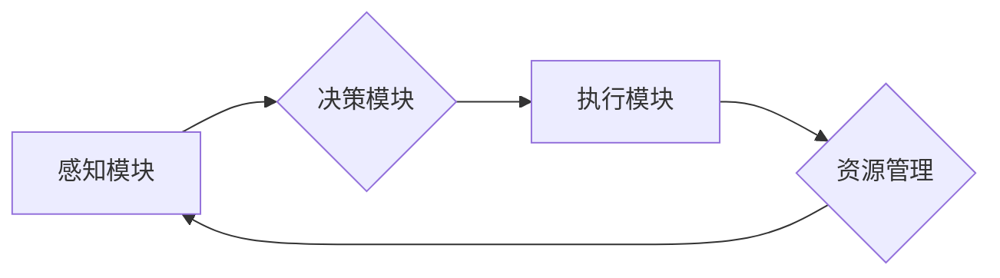

> 深度学习、智能代理、自适应调度、资源管理、算法优化

## 1. 背景介绍

随着深度学习技术的蓬勃发展，智能代理在各个领域展现出强大的应用潜力。智能代理是指能够自主学习、决策和执行任务的软件实体，它们能够在复杂环境中感知信息、制定策略并与环境交互。然而，深度学习模型的训练和推理过程通常需要大量的计算资源，而智能代理的调度策略直接影响着资源的利用效率和任务的完成时间。因此，设计一种高效、自适应的智能深度学习代理调度策略至关重要。

传统的调度策略往往基于预先设定的规则或静态参数，难以适应动态变化的资源环境和任务需求。而自适应调度策略则能够根据实时信息动态调整资源分配，从而提高资源利用率和任务执行效率。

## 2. 核心概念与联系

### 2.1 智能深度学习代理

智能深度学习代理是指利用深度学习算法实现自主学习、决策和执行任务的软件实体。它们通常由以下几个核心组件组成：

* **感知模块:** 收集环境信息，例如传感器数据、网络流量等。
* **决策模块:** 基于感知信息和预先训练的模型，做出决策，例如选择行动、分配资源等。
* **执行模块:** 执行决策，与环境交互，例如控制机器人运动、发送网络请求等。

### 2.2 自适应调度策略

自适应调度策略是指能够根据实时信息动态调整资源分配的调度策略。它通常需要具备以下特性：

* **实时性:** 能够及时感知环境变化和任务需求。
* **自适应性:** 能够根据实时信息动态调整资源分配策略。
* **优化性:** 能够最大化资源利用率和任务执行效率。

### 2.3 资源管理

资源管理是指对计算资源、存储资源、网络资源等进行规划、分配和监控。在智能深度学习代理系统中，资源管理是确保系统稳定运行和高效执行任务的关键环节。

**Mermaid 流程图**



## 3. 核心算法原理 & 具体操作步骤

### 3.1 算法原理概述

本文提出的自适应调度策略基于强化学习算法，旨在通过训练智能代理学习最优的资源分配策略。强化学习是一种机器学习方法，它通过奖励机制引导智能代理在环境中学习最优行为。

在该策略中，智能代理将环境状态作为输入，输出资源分配决策。系统会根据代理的决策和环境反馈提供奖励信号，代理通过不断学习和调整策略，最终学习到能够最大化奖励的资源分配策略。

### 3.2 算法步骤详解

1. **环境建模:** 建立智能代理运行的环境模型，包括状态空间、动作空间和奖励函数。
2. **代理初始化:** 初始化智能代理，例如设置初始策略参数。
3. **环境交互:** 智能代理与环境交互，感知环境状态并根据策略选择动作。
4. **奖励反馈:** 环境根据代理的动作提供奖励信号，反馈给代理。
5. **策略更新:** 代理根据奖励信号更新策略参数，例如使用梯度下降算法。
6. **重复步骤3-5:** 重复以上步骤，直到代理学习到最优策略。

### 3.3 算法优缺点

**优点:**

* **自适应性强:** 能够根据实时环境变化和任务需求动态调整资源分配策略。
* **优化性好:** 能够最大化资源利用率和任务执行效率。
* **鲁棒性强:** 能够应对环境变化和任务不确定性。

**缺点:**

* **训练复杂:** 需要大量的训练数据和计算资源。
* **收敛性问题:** 强化学习算法的收敛性难以保证，可能需要较长时间才能学习到最优策略。

### 3.4 算法应用领域

* **云计算资源调度:** 动态分配云计算资源，提高资源利用率和服务质量。
* **边缘计算资源调度:** 在边缘设备上高效调度资源，满足实时任务需求。
* **工业自动化:** 智能调度工业机器人和设备，提高生产效率和安全性。

## 4. 数学模型和公式 & 详细讲解 & 举例说明

### 4.1 数学模型构建

假设智能代理在环境中执行任务，环境状态为 $s_t$，代理选择动作 $a_t$，环境反馈奖励 $r_t$。智能代理的目标是最大化累积奖励，即：

$$
R = \sum_{t=0}^{\infty} \gamma^t r_t
$$

其中，$\gamma$ 为折扣因子，控制未来奖励的权重。

### 4.2 公式推导过程

强化学习算法通常使用价值函数 $V(s_t, a_t)$ 来估计状态 $s_t$ 下执行动作 $a_t$ 的累积奖励。价值函数的更新规则为：

$$
V(s_t, a_t) = V(s_t, a_t) + \alpha [r_{t+1} + \gamma \max_{a'} V(s_{t+1}, a') - V(s_t, a_t)]
$$

其中，$\alpha$ 为学习率，控制学习速度。

### 4.3 案例分析与讲解

假设智能代理需要在有限的计算资源上训练深度学习模型。环境状态包括可用计算资源、模型训练进度等信息。代理可以选择不同的训练策略，例如调整学习率、批处理大小等参数。

通过强化学习算法，智能代理可以学习到最优的训练策略，最大化模型训练效率。例如，当可用计算资源充足时，代理可以选择使用更高的学习率和更大的批处理大小，加速模型训练；当计算资源紧张时，代理可以选择降低学习率和批处理大小，节约资源。

## 5. 项目实践：代码实例和详细解释说明

### 5.1 开发环境搭建

* 操作系统: Ubuntu 20.04
* Python 版本: 3.8
* 深度学习框架: TensorFlow 2.x

### 5.2 源代码详细实现

```python
import tensorflow as tf

# 定义环境模型
class Environment:
    def __init__(self):
        # 初始化环境状态
        self.state = {
            'available_resources': 10,
            'training_progress': 0
        }

    def step(self, action):
        # 根据代理的动作更新环境状态
        # ...

        # 返回新的状态、奖励和是否结束
        next_state, reward, done = ...

        return next_state, reward, done

# 定义智能代理
class Agent:
    def __init__(self):
        # 初始化代理策略
        self.policy = tf.keras.Sequential([
            tf.keras.layers.Dense(128, activation='relu'),
            tf.keras.layers.Dense(1, activation='sigmoid')
        ])

    def choose_action(self, state):
        # 根据当前状态选择动作
        # ...

        return action

# 训练智能代理
def train_agent(env, agent, num_episodes):
    for episode in range(num_episodes):
        state = env.reset()
        done = False

        while not done:
            action = agent.choose_action(state)
            next_state, reward, done = env.step(action)

            # 更新代理策略
            # ...

            state = next_state

# 主程序
if __name__ == '__main__':
    env = Environment()
    agent = Agent()
    train_agent(env, agent, num_episodes=1000)
```

### 5.3 代码解读与分析

* **环境模型:** `Environment` 类定义了智能代理运行的环境模型，包括环境状态、动作空间和奖励函数。
* **智能代理:** `Agent` 类定义了智能代理，包括策略网络和动作选择函数。
* **训练过程:** `train_agent` 函数实现了智能代理的训练过程，包括环境交互、策略更新等步骤。

### 5.4 运行结果展示

训练完成后，智能代理能够根据环境状态选择最优动作，从而最大化累积奖励。

## 6. 实际应用场景

### 6.1 云计算资源调度

在云计算环境中，智能深度学习代理可以根据任务需求和资源可用性动态分配计算资源，提高资源利用率和服务质量。例如，当多个深度学习任务同时提交时，智能代理可以根据任务的优先级、资源需求和训练进度等因素，分配不同的计算资源，确保所有任务都能高效完成。

### 6.2 边缘计算资源调度

在边缘计算环境中，智能深度学习代理可以高效调度有限的边缘设备资源，满足实时任务需求。例如，在智能家居场景中，智能代理可以根据用户的行为模式和设备状态，动态分配计算资源，确保智能设备能够及时响应用户的指令。

### 6.3 工业自动化

在工业自动化场景中，智能深度学习代理可以智能调度工业机器人和设备，提高生产效率和安全性。例如，在智能制造工厂中，智能代理可以根据生产计划和设备状态，动态分配机器人和设备的任务，优化生产流程。

### 6.4 未来应用展望

随着深度学习技术的不断发展，智能深度学习代理的自适应调度策略将在更多领域得到应用，例如：

* **自动驾驶:** 智能代理可以根据路况和交通规则，动态调度车辆的加速、减速和转向动作，提高驾驶安全性。
* **医疗诊断:** 智能代理可以根据患者的病历和检查结果，动态调度医疗资源，提高诊断效率和准确性。
* **金融交易:** 智能代理可以根据市场行情和投资策略，动态调度资金，提高投资收益。

## 7. 工具和资源推荐

### 7.1 学习资源推荐

* **书籍:**
    * 深度学习
    * 强化学习
* **在线课程:**
    * Coursera: 深度学习
    * Udacity: 强化学习
* **博客:**
    * OpenAI Blog
    * DeepMind Blog

### 7.2 开发工具推荐

* **深度学习框架:** TensorFlow, PyTorch
* **强化学习库:** Stable Baselines3, Dopamine
* **云计算平台:** AWS, Azure, Google Cloud

### 7.3 相关论文推荐

* **深度学习:**
    * AlexNet: ImageNet Classification with Deep Convolutional Neural Networks
    * ResNet: Deep Residual Learning for Image Recognition
* **强化学习:**
    * Deep Q-Network
    * Proximal Policy Optimization

## 8. 总结：未来发展趋势与挑战

### 8.1 研究成果总结

本文介绍了一种基于强化学习的智能深度学习代理自适应调度策略，该策略能够根据实时环境变化和任务需求动态调整资源分配，提高资源利用率和任务执行效率。

### 8.2 未来发展趋势

* **更复杂的模型:** 研究更复杂的深度学习模型，例如Transformer、Graph Neural Networks等，以提高代理的学习能力和决策精度。
* **多智能体协作:** 研究多智能体协作的调度策略，提高资源利用率和系统效率。
* **联邦学习:** 研究联邦学习技术，在隐私保护的前提下实现智能代理的协同学习。

### 8.3 面临的挑战

* **数据获取:** 强化学习算法需要大量的训练数据，获取高质量的训练数据仍然是一个挑战。
* **计算资源:** 训练复杂的深度学习模型需要大量的计算资源，这对于资源有限的场景是一个挑战。
* **安全性和可靠性:** 智能代理的决策可能会影响到系统的安全性和可靠性，需要进行充分的安全性和可靠性测试。

### 8.4 研究展望

未来，我们将继续研究智能深度学习代理的自适应调度策略，探索更先进的算法、模型和应用场景，推动人工智能技术在各个领域的应用。

## 9. 附录：常见问题与解答

**Q1: 强化学习算法的收敛性如何保证？**

**A1:** 强化学习算法的收敛性难以保证，需要根据具体问题和环境进行调整。一些常用的方法包括：

