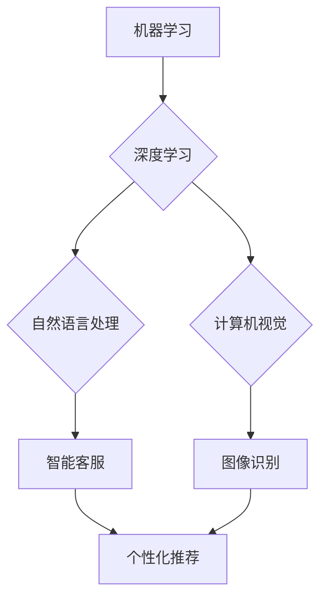

> 人工智能，创业公司，机遇，挑战，商业模式，技术发展，伦理问题

## 1. 背景介绍

人工智能（AI）技术近年来发展迅速，已渗透到各个领域，为社会带来了前所未有的变革。AI创业公司应运而生，涌现出许多创新产品和服务，为经济发展和社会进步做出了重要贡献。然而，AI创业公司也面临着诸多挑战，需要克服技术、商业、伦理等方面的难题才能取得成功。

### 1.1 AI技术发展现状

从语音识别、图像识别到自然语言处理、机器学习等，AI技术的进步日新月异。深度学习算法的突破，使得AI模型能够处理更复杂的数据，并取得更优的性能。开源平台和工具的普及，降低了AI技术的门槛，为创业者提供了更多机会。

### 1.2 AI创业公司的兴起

AI技术的快速发展，为创业者提供了广阔的市场空间。AI创业公司利用AI技术，开发出各种创新产品和服务，例如：

* **智能客服:** 利用自然语言处理技术，为用户提供24小时在线客服服务。
* **个性化推荐:** 利用机器学习算法，根据用户的行为数据，推荐个性化的产品和服务。
* **自动驾驶:** 利用计算机视觉和机器学习算法，开发自动驾驶汽车。
* **医疗诊断:** 利用机器学习算法，辅助医生进行疾病诊断。

## 2. 核心概念与联系

AI创业公司的成功离不开对核心概念的理解和应用。

**核心概念:**

* **机器学习:** 算法能够从数据中学习，并根据学习到的知识进行预测或决策。
* **深度学习:** 利用多层神经网络，模拟人类大脑的学习过程。
* **自然语言处理:** 使计算机能够理解和处理人类语言。
* **计算机视觉:** 使计算机能够“看”图像和视频，并从中提取信息。

**联系:**

AI创业公司通常会将这些核心概念结合起来，开发出更智能、更具价值的产品和服务。例如，智能客服系统会利用自然语言处理技术理解用户的需求，并利用机器学习算法提供个性化的回复。



## 3. 核心算法原理 & 具体操作步骤

### 3.1  算法原理概述

机器学习算法的核心是通过训练模型，使模型能够从数据中学习规律，并根据学习到的规律进行预测或决策。常见的机器学习算法包括：

* **监督学习:** 利用标记数据训练模型，例如分类和回归问题。
* **无监督学习:** 利用未标记数据训练模型，例如聚类和降维问题。
* **强化学习:** 通过奖励和惩罚机制训练模型，例如游戏和机器人控制问题。

### 3.2  算法步骤详解

以监督学习为例，其基本步骤如下：

1. **数据收集和预处理:** 收集相关数据，并进行清洗、转换、特征工程等预处理工作。
2. **模型选择:** 根据具体问题选择合适的机器学习算法。
3. **模型训练:** 利用训练数据训练模型，调整模型参数，使模型能够准确地预测或决策。
4. **模型评估:** 利用测试数据评估模型的性能，例如准确率、召回率、F1-score等。
5. **模型部署:** 将训练好的模型部署到实际应用场景中。

### 3.3  算法优缺点

不同的机器学习算法具有不同的优缺点，需要根据具体问题选择合适的算法。例如，决策树算法易于理解和解释，但泛化能力较弱；支持向量机算法具有较好的泛化能力，但训练时间较长。

### 3.4  算法应用领域

机器学习算法广泛应用于各个领域，例如：

* **图像识别:** 人脸识别、物体检测、图像分类等。
* **自然语言处理:** 文本分类、情感分析、机器翻译等。
* **推荐系统:** 商品推荐、内容推荐、用户画像等。
* **金融领域:** 欺诈检测、风险评估、信用评分等。

## 4. 数学模型和公式 & 详细讲解 & 举例说明

### 4.1  数学模型构建

机器学习算法通常基于数学模型，例如线性回归模型、逻辑回归模型、支持向量机模型等。这些模型通过数学公式来描述数据之间的关系，并利用这些关系进行预测或决策。

### 4.2  公式推导过程

例如，线性回归模型的目标是找到一条直线，使得这条直线与数据点之间的距离最小。其数学公式如下：

$$
y = w_0 + w_1x
$$

其中，$y$ 是预测值，$x$ 是输入特征，$w_0$ 和 $w_1$ 是模型参数。

通过最小化损失函数，可以求解出最佳的模型参数。

### 4.3  案例分析与讲解

例如，假设我们想要预测房价，输入特征包括房屋面积、房间数量等。我们可以使用线性回归模型，通过训练数据学习房价与输入特征之间的关系，并预测新房子的价格。

## 5. 项目实践：代码实例和详细解释说明

### 5.1  开发环境搭建

AI创业公司通常需要搭建一个开发环境，包括操作系统、编程语言、机器学习库等。例如，可以使用Python语言，并利用TensorFlow、PyTorch等机器学习库进行开发。

### 5.2  源代码详细实现

以下是一个简单的机器学习代码示例，使用Python语言和Scikit-learn库实现线性回归模型：

```python
from sklearn.linear_model import LinearRegression
from sklearn.model_selection import train_test_split
from sklearn.metrics import mean_squared_error

# 准备数据
X = [[100], [150], [200], [250], [300]]  # 房屋面积
y = [150000, 200000, 250000, 300000, 350000]  # 房价

# 将数据分成训练集和测试集
X_train, X_test, y_train, y_test = train_test_split(X, y, test_size=0.2)

# 创建线性回归模型
model = LinearRegression()

# 训练模型
model.fit(X_train, y_train)

# 预测测试集数据
y_pred = model.predict(X_test)

# 计算模型性能
mse = mean_squared_error(y_test, y_pred)
print(f"Mean Squared Error: {mse}")
```

### 5.3  代码解读与分析

这段代码首先准备了房屋面积和房价的数据，然后将数据分成训练集和测试集。接着，创建了一个线性回归模型，并使用训练集训练模型。最后，使用测试集数据预测房价，并计算模型的性能指标。

### 5.4  运行结果展示

运行这段代码后，会输出模型的性能指标，例如Mean Squared Error。

## 6. 实际应用场景

AI创业公司可以将AI技术应用于各个行业，例如：

### 6.1  医疗保健

* **疾病诊断:** 利用机器学习算法分析患者的医疗影像和病历数据，辅助医生进行疾病诊断。
* **药物研发:** 利用AI技术加速药物研发过程，例如预测药物的有效性、安全性等。

### 6.2  金融服务

* **欺诈检测:** 利用机器学习算法分析交易数据，识别异常交易行为，防止欺诈行为。
* **风险评估:** 利用AI技术评估客户的信用风险，为贷款和保险等服务提供参考。

### 6.3  零售业

* **个性化推荐:** 利用机器学习算法分析用户的购买历史和行为数据，推荐个性化的商品和服务。
* **库存管理:** 利用AI技术预测商品的需求量，优化库存管理，降低成本。

### 6.4  未来应用展望

AI技术的未来发展潜力巨大，将应用于更多领域，例如：

* **自动驾驶:** 自动驾驶汽车将改变交通出行方式，提高道路安全。
* **机器人技术:** AI驱动的机器人将广泛应用于制造业、服务业等领域，提高生产效率和服务质量。
* **教育领域:** AI技术可以个性化教学，提高学习效率。

## 7. 工具和资源推荐

### 7.1  学习资源推荐

* **在线课程:** Coursera、edX、Udacity等平台提供丰富的AI课程。
* **书籍:** 《深度学习》、《机器学习实战》等书籍是学习AI技术的经典教材。
* **开源社区:** TensorFlow、PyTorch等开源社区提供丰富的学习资源和技术支持。

### 7.2  开发工具推荐

* **Python:** Python是AI开发最常用的编程语言。
* **TensorFlow:** TensorFlow是Google开发的开源机器学习框架。
* **PyTorch:** PyTorch是Facebook开发的开源机器学习框架。

### 7.3  相关论文推荐

* **《ImageNet Classification with Deep Convolutional Neural Networks》:** 这篇论文介绍了AlexNet模型，标志着深度学习在图像识别领域的突破。
* **《Attention Is All You Need》:** 这篇论文介绍了Transformer模型，在自然语言处理领域取得了重大进展。

## 8. 总结：未来发展趋势与挑战

### 8.1  研究成果总结

AI技术取得了显著的进展，在各个领域都展现出巨大的应用潜力。

### 8.2  未来发展趋势

* **模型规模和复杂度提升:** 未来AI模型将更加庞大、复杂，能够处理更复杂的数据，并取得更优的性能。
* **边缘计算和联邦学习:** AI计算将更加分散，边缘设备和联邦学习将成为主流趋势。
* **AI伦理和可解释性:** 随着AI技术的应用越来越广泛，AI伦理和可解释性将成为重要的研究方向。

### 8.3  面临的挑战

* **数据获取和隐私保护:** AI模型的训练需要大量数据，如何获取高质量数据，并保护用户隐私是一个重要的挑战。
* **算法偏见和公平性:** AI算法可能存在偏见，导致不公平的结果，需要研究如何解决算法偏见问题。
* **安全性和可靠性:** AI系统需要保证安全性和可靠性，防止被恶意攻击或出现故障。

### 8.4  研究展望

未来AI研究将更加注重以下方面：

* **通用人工智能:** 研究能够像人类一样学习和解决各种问题的通用人工智能。
* **人机交互:** 研究更加自然、流畅的人机交互方式。
* **AI与社会发展:** 研究AI技术如何更好地服务于人类社会，促进社会进步。

## 9. 附录：常见问题与解答

### 9.1  什么是机器学习？

机器学习是一种人工智能技术，通过训练模型，使模型能够从数据中学习规律，并根据学习到的规律进行预测或决策。

### 9.2  有哪些常见的机器学习算法？

常见的机器学习算法包括监督学习、无监督学习和强化学习。

### 9.3  如何评估机器学习模型的性能？

常用的机器学习模型性能指标包括准确率、召回率、F1-score等。

### 9.4  AI技术有哪些伦理问题？

AI技术的应用可能带来一些伦理问题，例如算法偏见、隐私保护、责任归属等。

### 9.5  AI技术未来发展趋势如何？

未来AI技术将更加智能、更加广泛地应用于各个领域。


作者：禅与计算机程序设计艺术 / Zen and the Art of Computer Programming 
<end_of_turn>