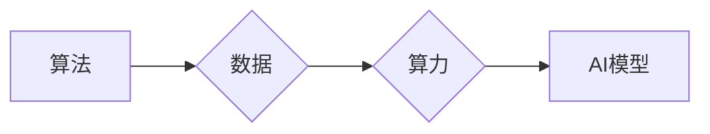

> 人工智能 (AI)
> 算法
> 算力
> 数据
> 深度学习
> 机器学习
> 训练

## 1. 背景介绍

人工智能 (AI) 作为科技发展的重要方向，近年来取得了令人瞩目的进展。从语音识别到图像识别，从自动驾驶到医疗诊断，AI 正在深刻地改变着我们的生活。然而，AI 的发展并非一蹴而就，它依赖于三个核心要素：算法、算力和数据，这三者相互依存，共同推动着 AI 的进步。

## 2. 核心概念与联系

**2.1 算法**

算法是 AI 的大脑，它提供了一种解决问题的逻辑步骤和规则。不同的算法适用于不同的任务，例如，用于图像识别的卷积神经网络 (CNN) 算法，用于自然语言处理 (NLP) 的循环神经网络 (RNN) 算法，等等。

**2.2 算力**

算力是 AI 的肌肉，它提供着执行算法所需的计算能力。随着 AI 模型的复杂性不断增加，对算力的需求也越来越高。高性能计算 (HPC) 、图形处理单元 (GPU) 和专用 AI 芯片等技术的发展，为 AI 的算力需求提供了强有力的支持。

**2.3 数据**

数据是 AI 的燃料，它为算法提供训练和学习的素材。高质量的数据是训练出优秀 AI 模型的关键。数据量越大，数据越丰富，训练出的 AI 模型就越智能。

**2.4 三者之间的联系**

算法、算力和数据相互依存，共同构成了 AI 的发展基础。

* 算法需要数据进行训练，才能学习到解决问题的规律。
* 算力决定了算法的训练速度和效率。
* 数据的质量和数量直接影响着算法的性能。

**Mermaid 流程图**



## 3. 核心算法原理 & 具体操作步骤

### 3.1  算法原理概述

深度学习是目前 AI 领域最热门的算法之一，它模拟了人脑神经网络的结构和功能，能够学习到复杂的数据模式。深度学习算法的核心是多层神经网络，每一层神经元都连接着上一层的输出，并进行非线性变换。通过不断调整神经元的权重和偏差，深度学习算法能够学习到数据的特征表示，并进行预测或分类。

### 3.2  算法步骤详解

1. **数据预处理:** 将原始数据进行清洗、转换和特征工程，使其适合深度学习算法的训练。
2. **网络结构设计:** 根据任务需求设计深度神经网络的结构，包括神经元的数量、连接方式和激活函数等。
3. **参数初始化:** 为神经网络的参数 (权重和偏差) 进行随机初始化。
4. **前向传播:** 将输入数据通过神经网络进行逐层传递，计算输出结果。
5. **损失函数计算:** 计算模型输出与真实值的差异，即损失函数的值。
6. **反向传播:** 根据损失函数的梯度，反向传播误差信息，更新神经网络的参数。
7. **迭代训练:** 重复前向传播、损失函数计算和反向传播的过程，直到模型的性能达到预期的水平。

### 3.3  算法优缺点

**优点:**

* 能够学习到复杂的数据模式，性能优异。
* 适用于多种任务，例如图像识别、自然语言处理、语音识别等。

**缺点:**

* 训练数据量大，计算资源消耗高。
* 模型解释性差，难以理解模型的决策过程。

### 3.4  算法应用领域

深度学习算法广泛应用于各个领域，例如：

* **计算机视觉:** 图像识别、物体检测、图像分割、人脸识别等。
* **自然语言处理:** 文本分类、情感分析、机器翻译、对话系统等。
* **语音识别:** 语音转文本、语音助手等。
* **医疗诊断:** 病理图像分析、疾病预测等。
* **金融分析:** 风险评估、欺诈检测等。

## 4. 数学模型和公式 & 详细讲解 & 举例说明

### 4.1  数学模型构建

深度学习算法的核心是多层神经网络，每个神经元接收来自上一层的输入信号，并进行线性变换和非线性激活函数处理，最终输出到下一层。

**神经元模型:**

$$
y = f(w^T x + b)
$$

其中：

* $y$ 是神经元的输出值。
* $x$ 是输入信号向量。
* $w$ 是权重向量。
* $b$ 是偏置项。
* $f$ 是激活函数。

**神经网络模型:**

一个深度神经网络由多个神经元层组成，每一层的神经元都连接着上一层的输出。

### 4.2  公式推导过程

深度学习算法的训练过程是通过反向传播算法来实现的。反向传播算法的核心是计算损失函数的梯度，并根据梯度更新神经网络的参数。

**损失函数:**

$$
L = \frac{1}{N} \sum_{i=1}^{N} (y_i - \hat{y}_i)^2
$$

其中：

* $L$ 是损失函数的值。
* $N$ 是样本数量。
* $y_i$ 是真实值。
* $\hat{y}_i$ 是模型预测值。

**梯度下降算法:**

$$
\theta = \theta - \alpha \nabla L(\theta)
$$

其中：

* $\theta$ 是模型参数。
* $\alpha$ 是学习率。
* $\nabla L(\theta)$ 是损失函数的梯度。

### 4.3  案例分析与讲解

**图像识别案例:**

假设我们训练一个深度神经网络来识别猫和狗的图像。

* **数据:** 我们收集了大量猫和狗的图像数据，并进行标记。
* **模型:** 我们设计了一个卷积神经网络 (CNN) 模型，用于提取图像特征。
* **训练:** 我们使用反向传播算法训练 CNN 模型，并使用损失函数来评估模型的性能。
* **测试:** 我们使用测试集上的图像数据来评估模型的识别准确率。

## 5. 项目实践：代码实例和详细解释说明

### 5.1  开发环境搭建

* **操作系统:** Ubuntu 20.04 LTS
* **编程语言:** Python 3.8
* **深度学习框架:** TensorFlow 2.0
* **GPU:** NVIDIA GeForce RTX 3080

### 5.2  源代码详细实现

```python
import tensorflow as tf

# 定义模型结构
model = tf.keras.models.Sequential([
    tf.keras.layers.Conv2D(32, (3, 3), activation='relu', input_shape=(28, 28, 1)),
    tf.keras.layers.MaxPooling2D((2, 2)),
    tf.keras.layers.Conv2D(64, (3, 3), activation='relu'),
    tf.keras.layers.MaxPooling2D((2, 2)),
    tf.keras.layers.Flatten(),
    tf.keras.layers.Dense(10, activation='softmax')
])

# 编译模型
model.compile(optimizer='adam',
              loss='sparse_categorical_crossentropy',
              metrics=['accuracy'])

# 训练模型
model.fit(x_train, y_train, epochs=10)

# 评估模型
loss, accuracy = model.evaluate(x_test, y_test)
print('Test loss:', loss)
print('Test accuracy:', accuracy)
```

### 5.3  代码解读与分析

* **模型结构:** 代码定义了一个简单的卷积神经网络 (CNN) 模型，包含两层卷积层、两层最大池化层、一层全连接层和一层输出层。
* **编译模型:** 使用 Adam 优化器、稀疏类别交叉熵损失函数和准确率作为评估指标来编译模型。
* **训练模型:** 使用训练数据训练模型，训练 10 个 epochs。
* **评估模型:** 使用测试数据评估模型的性能，打印测试损失和准确率。

### 5.4  运行结果展示

训练完成后，模型的准确率通常会达到较高的水平。

## 6. 实际应用场景

### 6.1  图像识别

深度学习算法在图像识别领域取得了突破性的进展，例如：

* **人脸识别:** 用于解锁手机、身份验证等。
* **物体检测:** 用于自动驾驶、安防监控等。
* **图像分类:** 用于医疗诊断、产品分类等。

### 6.2  自然语言处理

深度学习算法在自然语言处理领域也取得了显著的成果，例如：

* **机器翻译:** 将一种语言翻译成另一种语言。
* **文本摘要:** 自动生成文本的摘要。
* **情感分析:** 分析文本的情感倾向。

### 6.3  语音识别

深度学习算法在语音识别领域也取得了长足的进步，例如：

* **语音转文本:** 将语音转换为文本。
* **语音助手:** 例如 Siri、Alexa 等。

### 6.4  未来应用展望

随着 AI 技术的不断发展，深度学习算法将在更多领域得到应用，例如：

* **个性化推荐:** 根据用户的喜好推荐产品或服务。
* **医疗诊断:** 辅助医生进行疾病诊断。
* **自动驾驶:** 实现无人驾驶汽车。

## 7. 工具和资源推荐

### 7.1  学习资源推荐

* **书籍:**
    * 深度学习 (Deep Learning) - Ian Goodfellow, Yoshua Bengio, Aaron Courville
    * 构建深度学习模型 (Hands-On Machine Learning with Scikit-Learn, Keras & TensorFlow) - Aurélien Géron
* **在线课程:**
    * 深度学习 Specialization - Andrew Ng (Coursera)
    * fast.ai - Practical Deep Learning for Coders

### 7.2  开发工具推荐

* **深度学习框架:** TensorFlow, PyTorch, Keras
* **编程语言:** Python
* **数据处理工具:** Pandas, NumPy

### 7.3  相关论文推荐

* **ImageNet Classification with Deep Convolutional Neural Networks** - Alex Krizhevsky, Ilya Sutskever, Geoffrey E. Hinton
* **Attention Is All You Need** - Ashish Vaswani, Noam Shazeer, Niki Parmar, Jakob Uszkoreit, Llion Jones, Aidan N. Gomez, Łukasz Kaiser, Illia Polosukhin

## 8. 总结：未来发展趋势与挑战

### 8.1  研究成果总结

深度学习算法取得了令人瞩目的成果，在图像识别、自然语言处理、语音识别等领域取得了突破性的进展。

### 8.2  未来发展趋势

* **模型规模和复杂度:** 模型规模和复杂度将继续增加，以提高模型的性能。
* **新算法和架构:** 将会涌现出新的深度学习算法和架构，例如 Transformer、Generative Adversarial Networks (GANs) 等。
* **边缘计算:** 将深度学习模型部署到边缘设备上，实现更快速的推理和更低的延迟。
* **可解释性:** 研究如何提高深度学习模型的可解释性，使其决策过程更加透明。

### 8.3  面临的挑战

* **数据获取和标注:** 训练高质量的深度学习模型需要大量的标注数据，数据获取和标注成本高昂。
* **计算资源:** 训练大型深度学习模型需要大量的计算资源，成本高昂。
* **模型安全性:** 深度学习模型容易受到攻击，需要提高模型的安全性。

### 8.4  研究展望

未来，深度学习研究将继续朝着更智能、更安全、更可解释的方向发展。


## 9. 附录：常见问题与解答

**Q1: 深度学习算法和传统机器学习算法有什么区别？**

**A1:** 深度学习算法是一种更高级的机器学习算法，它能够学习到更复杂的特征表示，而传统机器学习算法需要人工特征工程。

**Q2: 如何选择合适的深度学习框架？**

**A2:** TensorFlow 和