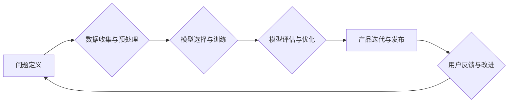

> AI商业模式,产品设计,机器学习,深度学习,自然语言处理,计算机视觉,代码实战,案例分析

## 1. 背景介绍

人工智能（AI）技术近年来发展迅速，已渗透到各个领域，并对商业模式和产品设计产生了深远影响。从智能客服到个性化推荐，从自动驾驶到医疗诊断，AI正在改变着我们的生活方式和工作模式。

然而，仅仅拥有强大的AI技术还不够，将AI技术转化为商业价值，需要深入理解AI商业模式和产品设计原理。本文将从AI商业模式、产品设计原理、核心算法原理、数学模型、代码实战等多个方面进行深入探讨，并结合实际案例，帮助读者更好地理解和应用AI技术。

## 2. 核心概念与联系

**2.1 AI商业模式**

AI商业模式是指利用人工智能技术创造价值、获取利润的商业模式。常见的AI商业模式包括：

* **数据驱动的订阅服务:** 通过收集和分析用户数据，提供个性化服务，例如推荐系统、精准营销等。
* **平台化服务:** 建立AI平台，为开发者提供AI工具和服务，例如语音识别、图像识别等。
* **AI赋能传统行业:** 将AI技术应用于传统行业，提高效率和降低成本，例如智能制造、金融风控等。

**2.2 产品设计原理**

AI产品设计需要考虑以下几个关键因素：

* **用户需求:** 深入了解用户需求，设计符合用户体验的产品。
* **数据驱动:** 利用数据分析和机器学习，不断优化产品功能和体验。
* **可解释性:** 确保AI模型的决策过程可解释，提高用户信任度。
* **安全性与隐私:** 保护用户数据安全和隐私，构建安全可靠的产品。

**2.3 AI产品设计流程**



## 3. 核心算法原理 & 具体操作步骤

**3.1 算法原理概述**

本文将重点介绍机器学习算法，特别是监督学习和深度学习算法。

* **监督学习:** 利用标记数据训练模型，预测未知数据。例如，分类问题（例如垃圾邮件分类）和回归问题（例如房价预测）。
* **深度学习:** 利用多层神经网络，学习复杂数据特征。例如，图像识别、自然语言处理等。

**3.2 算法步骤详解**

**3.2.1 监督学习算法步骤**

1. **数据收集与预处理:** 收集相关数据，并进行清洗、转换、特征工程等预处理操作。
2. **模型选择:** 根据具体问题选择合适的监督学习算法，例如线性回归、逻辑回归、决策树、支持向量机等。
3. **模型训练:** 利用标记数据训练模型，调整模型参数，使模型能够准确预测未知数据。
4. **模型评估:** 利用测试数据评估模型性能，例如准确率、召回率、F1-score等。
5. **模型优化:** 根据评估结果，调整模型参数或选择其他算法，提高模型性能。

**3.2.2 深度学习算法步骤**

1. **数据收集与预处理:** 与监督学习类似，需要收集和预处理数据。
2. **网络结构设计:** 设计多层神经网络结构，包括输入层、隐藏层和输出层。
3. **模型训练:** 利用标记数据训练模型，调整网络参数，使模型能够学习复杂数据特征。
4. **模型评估:** 利用测试数据评估模型性能，例如准确率、召回率、F1-score等。
5. **模型优化:** 根据评估结果，调整网络结构或训练参数，提高模型性能。

**3.3 算法优缺点**

**3.3.1 监督学习算法**

* **优点:** 准确率高，可解释性强。
* **缺点:** 需要大量标记数据，对数据质量要求高。

**3.3.2 深度学习算法**

* **优点:** 能够学习复杂数据特征，性能优异。
* **缺点:** 需要大量数据和计算资源，可解释性较差。

**3.4 算法应用领域**

* **监督学习:** 垃圾邮件分类、图像识别、文本分类、预测分析等。
* **深度学习:** 语音识别、机器翻译、图像生成、自然语言理解等。

## 4. 数学模型和公式 & 详细讲解 & 举例说明

**4.1 数学模型构建**

机器学习算法本质上是构建数学模型的过程。这些模型试图从数据中学习规律，并用数学公式来表示这些规律。例如，线性回归模型试图找到一条直线，将输入特征与输出变量联系起来。

**4.2 公式推导过程**

线性回归模型的目标是找到一条直线，使得预测值与真实值之间的误差最小。

假设我们有n个样本数据，每个样本包含一个输入特征x和一个输出变量y。线性回归模型的公式如下：

$$y = w_0 + w_1x$$

其中，$w_0$和$w_1$是模型参数，需要通过训练数据来学习。

为了找到最佳的模型参数，我们使用最小二乘法，即最小化预测值与真实值之间的平方误差。

**4.3 案例分析与讲解**

假设我们想预测房价，输入特征是房屋面积，输出变量是房价。我们可以收集一些房屋数据，并使用线性回归模型进行训练。

训练完成后，我们可以得到模型参数$w_0$和$w_1$。

例如，如果$w_0 = 10000$和$w_1 = 500$，则模型预测公式为：

$$y = 10000 + 500x$$

其中，$y$表示房价，$x$表示房屋面积。

如果我们知道一个房屋面积为100平方米的房价，我们可以使用模型公式进行预测：

$$y = 10000 + 500 * 100 = 20000$$

因此，模型预测该房屋的房价为20000元。

## 5. 项目实践：代码实例和详细解释说明

**5.1 开发环境搭建**

本项目使用Python语言进行开发，需要安装以下软件：

* Python 3.x
* Jupyter Notebook
* scikit-learn

**5.2 源代码详细实现**

```python
import pandas as pd
from sklearn.linear_model import LinearRegression
from sklearn.model_selection import train_test_split

# 加载数据
data = pd.read_csv('house_data.csv')

# 分割数据
X = data[['面积']]
y = data['房价']
X_train, X_test, y_train, y_test = train_test_split(X, y, test_size=0.2, random_state=42)

# 创建线性回归模型
model = LinearRegression()

# 训练模型
model.fit(X_train, y_train)

# 预测测试数据
y_pred = model.predict(X_test)

# 评估模型性能
from sklearn.metrics import mean_squared_error
mse = mean_squared_error(y_test, y_pred)
print(f'均方误差: {mse}')
```

**5.3 代码解读与分析**

1. 首先，我们加载数据，并将其分割为训练集和测试集。
2. 然后，我们创建线性回归模型，并使用训练数据进行训练。
3. 训练完成后，我们可以使用模型预测测试数据。
4. 最后，我们使用均方误差来评估模型性能。

**5.4 运行结果展示**

运行代码后，会输出模型的均方误差值。

## 6. 实际应用场景

**6.1 房价预测**

利用房价预测模型，可以帮助用户估算房屋价格，为购房决策提供参考。

**6.2 股票预测**

利用股票预测模型，可以帮助投资者预测股票价格走势，进行投资决策。

**6.3 医疗诊断**

利用医疗诊断模型，可以帮助医生诊断疾病，提高诊断准确率。

**6.4 未来应用展望**

AI技术将继续在各个领域得到广泛应用，例如自动驾驶、机器人、个性化教育等。

## 7. 工具和资源推荐

**7.1 学习资源推荐**

* **书籍:**
    * 《深度学习》
    * 《机器学习实战》
    * 《Python机器学习》
* **在线课程:**
    * Coursera
    * edX
    * Udacity

**7.2 开发工具推荐**

* **Python:** 
    * scikit-learn
    * TensorFlow
    * PyTorch

**7.3 相关论文推荐**

* **AlphaGo论文:** https://arxiv.org/abs/1607.02886
* **BERT论文:** https://arxiv.org/abs/1810.04805

## 8. 总结：未来发展趋势与挑战

**8.1 研究成果总结**

近年来，AI技术取得了显著进展，特别是深度学习算法在图像识别、自然语言处理等领域取得了突破性进展。

**8.2 未来发展趋势**

* **模型规模化:** 模型规模将继续扩大，训练数据量和计算资源也将进一步增加。
* **算法创新:** 新的AI算法将不断涌现，例如强化学习、联邦学习等。
* **跨领域融合:** AI技术将与其他领域融合，例如生物医学、材料科学等。

**8.3 面临的挑战**

* **数据安全与隐私:** AI模型训练需要大量数据，如何保护数据安全和隐私是一个重要挑战。
* **算法可解释性:** 许多AI模型的决策过程难以解释，如何提高算法可解释性是一个重要研究方向。
* **伦理问题:** AI技术的发展引发了一些伦理问题，例如算法偏见、工作岗位替代等，需要认真思考和解决。

**8.4 研究展望**

未来，AI技术将继续发展，并对我们的生活产生更深远的影响。我们需要加强AI技术研究，并积极应对AI技术带来的挑战，确保AI技术能够造福人类。

## 9. 附录：常见问题与解答

**9.1 如何选择合适的AI算法？**

选择合适的AI算法取决于具体问题和数据特点。例如，对于分类问题，可以考虑逻辑回归、决策树、支持向量机等算法；对于回归问题，可以考虑线性回归、支持向量回归等算法。

**9.2 如何评估AI模型的性能？**

常用的AI模型性能评估指标包括准确率、召回率、F1-score、均方误差等。

**9.3 如何解决AI模型的过拟合问题？**

过拟合是指AI模型对训练数据过拟合，导致在测试数据上性能下降。解决过拟合问题的方法包括：

* 减少模型复杂度
* 增加训练数据量
* 使用正则化技术
* 使用交叉验证

作者：禅与计算机程序设计艺术 / Zen and the Art of Computer Programming


<end_of_turn>