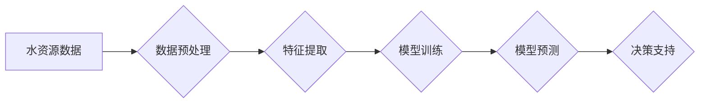

> 水资源管理，人工智能，机器学习，预测模型，优化算法，水资源分配，水质监测

## 1. 背景介绍

水是生命之源，是人类社会发展和生态系统维持的关键要素。然而，随着全球人口增长和经济发展，水资源面临着日益严峻的压力。水资源短缺、水污染、水灾等问题日益突出，严重威胁着人类生存和可持续发展。

传统的水资源管理模式往往依赖于经验和定性分析，难以有效应对复杂多变的水资源环境。而人工智能（AI）技术的快速发展为水资源管理提供了新的思路和解决方案。AI算法能够从海量水文数据中提取有价值的信息，建立精准的预测模型，优化水资源分配和利用，提高水资源管理的效率和科学性。

## 2. 核心概念与联系

**2.1  水资源管理**

水资源管理是指对水资源进行规划、开发、利用、保护和综合治理的系统工程。其目标是确保水资源的可持续利用，满足人类社会和生态系统的需求。

**2.2  人工智能（AI）**

人工智能是指模拟人类智能行为的计算机系统。AI技术涵盖了机器学习、深度学习、自然语言处理、计算机视觉等多个领域。

**2.3  AI在水资源管理中的应用**

AI技术在水资源管理中的应用主要包括以下几个方面：

* **水资源预测:** 利用AI算法对水资源的供需、水位、水质等进行预测，为水资源管理决策提供科学依据。
* **水资源优化分配:** 根据实时水情和需求，利用AI算法优化水资源的分配方案，提高水资源利用效率。
* **水质监测与预警:** 利用AI算法对水质数据进行分析，识别水污染源头，预警水质污染风险。
* **水资源风险评估:** 利用AI算法评估水资源面临的各种风险，制定相应的防灾减灾措施。

**2.4  AI技术架构**



## 3. 核心算法原理 & 具体操作步骤

**3.1  算法原理概述**

在AI水资源管理中，常用的算法包括机器学习算法、深度学习算法和优化算法。

* **机器学习算法:** 

例如线性回归、逻辑回归、支持向量机等，用于建立水资源预测模型，例如预测水位、水量、水质等。

* **深度学习算法:** 

例如卷积神经网络、循环神经网络等，用于处理复杂的水资源数据，例如遥感影像、水文监测数据等，提高预测精度。

* **优化算法:** 

例如遗传算法、模拟退火算法等，用于优化水资源分配方案，例如分配灌溉用水、工业用水等，提高水资源利用效率。

**3.2  算法步骤详解**

以水资源预测为例，详细说明AI算法的具体操作步骤：

1. **数据收集:** 收集水资源相关数据，例如水位、水量、降雨量、气温等。
2. **数据预处理:** 对数据进行清洗、转换、归一化等处理，去除噪声和异常值，使数据符合算法要求。
3. **特征提取:** 从原始数据中提取有价值的特征，例如时间特征、空间特征、气候特征等，为模型训练提供输入数据。
4. **模型训练:** 选择合适的机器学习算法，利用训练数据训练模型，学习数据之间的关系。
5. **模型评估:** 利用测试数据评估模型的预测精度，例如使用均方误差、R-squared等指标。
6. **模型部署:** 将训练好的模型部署到实际应用环境中，用于预测未来水资源状况。

**3.3  算法优缺点**

* **优点:**

AI算法能够从海量数据中提取有价值的信息，建立精准的预测模型，提高水资源管理的效率和科学性。

* **缺点:**

AI算法需要大量的训练数据，数据质量直接影响模型精度。此外，AI算法的解释性较差，难以理解模型的决策过程。

**3.4  算法应用领域**

AI算法在水资源管理中的应用领域广泛，例如：

* **水资源预测:** 预测水位、水量、水质等。
* **水资源优化分配:** 优化灌溉用水、工业用水等。
* **水质监测与预警:** 识别水污染源头，预警水质污染风险。
* **水资源风险评估:** 评估水资源面临的各种风险。

## 4. 数学模型和公式 & 详细讲解 & 举例说明

**4.1  数学模型构建**

在AI水资源管理中，常用的数学模型包括线性回归模型、时间序列模型、神经网络模型等。

* **线性回归模型:** 用于预测水资源的连续变量，例如水位、水量等。模型假设水资源变量与输入变量之间存在线性关系。

* **时间序列模型:** 用于预测水资源的时变趋势，例如水位、水量等。模型假设水资源变量随时间呈现一定的规律性变化。

* **神经网络模型:** 用于处理复杂的水资源数据，例如遥感影像、水文监测数据等。模型能够学习数据之间的非线性关系，提高预测精度。

**4.2  公式推导过程**

以线性回归模型为例，其目标是找到最佳的回归系数，使得模型预测值与实际值之间的误差最小。

模型公式：

$$y = \beta_0 + \beta_1x_1 + \beta_2x_2 + ... + \beta_nx_n + \epsilon$$

其中：

* $y$ 是预测值
* $x_1, x_2, ..., x_n$ 是输入变量
* $\beta_0, \beta_1, \beta_2, ..., \beta_n$ 是回归系数
* $\epsilon$ 是误差项

最小二乘法：

$$SSE = \sum_{i=1}^{n}(y_i - \hat{y}_i)^2$$

其中：

* $SSE$ 是误差平方和
* $y_i$ 是实际值
* $\hat{y}_i$ 是预测值

通过求解最小化 $SSE$ 的回归系数，可以得到最佳的线性回归模型。

**4.3  案例分析与讲解**

以水位预测为例，利用线性回归模型预测某水库的水位。

* **数据收集:** 收集该水库过去几年的水位数据，以及相关影响水位的因素数据，例如降雨量、气温、蒸发量等。
* **数据预处理:** 对数据进行清洗、转换、归一化等处理。
* **模型训练:** 利用收集的数据训练线性回归模型，得到最佳的回归系数。
* **模型评估:** 利用测试数据评估模型的预测精度，例如使用均方误差、R-squared等指标。
* **模型部署:** 将训练好的模型部署到实际应用环境中，用于预测未来水库的水位。

## 5. 项目实践：代码实例和详细解释说明

**5.1  开发环境搭建**

* 操作系统：Windows/Linux/macOS
* Python版本：3.6+
* 必要的库：pandas, numpy, scikit-learn, matplotlib等

**5.2  源代码详细实现**

```python
import pandas as pd
from sklearn.linear_model import LinearRegression
from sklearn.model_selection import train_test_split
from sklearn.metrics import mean_squared_error

# 1. 数据加载
data = pd.read_csv('water_level_data.csv')

# 2. 特征选择
features = ['rainfall', 'temperature', 'evaporation']
target = 'water_level'

# 3. 数据分割
X_train, X_test, y_train, y_test = train_test_split(data[features], data[target], test_size=0.2, random_state=42)

# 4. 模型训练
model = LinearRegression()
model.fit(X_train, y_train)

# 5. 模型评估
y_pred = model.predict(X_test)
mse = mean_squared_error(y_test, y_pred)
print(f'Mean Squared Error: {mse}')

# 6. 模型部署
# 将训练好的模型保存为文件，以便后续使用
import joblib
joblib.dump(model, 'water_level_prediction_model.pkl')
```

**5.3  代码解读与分析**

* 代码首先加载水位数据，并选择相关特征和目标变量。
* 然后将数据分割为训练集和测试集，用于模型训练和评估。
* 接着使用线性回归模型训练模型，并使用均方误差评估模型精度。
* 最后将训练好的模型保存为文件，以便后续使用。

**5.4  运行结果展示**

运行代码后，会输出模型的均方误差值，表示模型预测精度。

## 6. 实际应用场景

**6.1  水资源预测**

AI算法可以用于预测水位、水量、水质等，为水资源管理决策提供科学依据。例如，可以预测未来一段时间内某水库的水位，帮助水资源管理部门制定合理的调度方案。

**6.2  水资源优化分配**

AI算法可以优化水资源的分配方案，例如分配灌溉用水、工业用水等，提高水资源利用效率。例如，可以根据实时水情和需求，利用AI算法优化灌溉用水方案，减少水资源浪费。

**6.3  水质监测与预警**

AI算法可以用于监测水质数据，识别水污染源头，预警水质污染风险。例如，可以利用AI算法分析水质监测数据，识别水污染源头，并及时发出预警，避免水质污染事件发生。

**6.4  未来应用展望**

随着AI技术的不断发展，其在水资源管理中的应用将更加广泛和深入。例如，可以利用AI技术实现智能水资源管理系统，实现水资源的自动化管理和优化利用。

## 7. 工具和资源推荐

**7.1  学习资源推荐**

* **书籍:**

《深度学习》

《机器学习实战》

* **在线课程:**

Coursera上的机器学习课程

edX上的深度学习课程

**7.2  开发工具推荐**

* **Python:** 

Python是一种流行的编程语言，广泛应用于数据科学和机器学习领域。

* **Jupyter Notebook:** 

Jupyter Notebook是一种交互式编程环境，方便进行数据分析和模型开发。

* **Scikit-learn:** 

Scikit-learn是一个机器学习库，提供各种机器学习算法和工具。

**7.3  相关论文推荐**

* **AI for Water Resource Management: A Review**

* **Deep Learning for Water Quality Prediction**

* **Optimization of Water Allocation Using Machine Learning**

## 8. 总结：未来发展趋势与挑战

**8.1  研究成果总结**

AI技术在水资源管理领域取得了显著的成果，例如提高了水资源预测精度、优化了水资源分配方案、增强了水质监测能力等。

**8.2  未来发展趋势**

* **模型精度提升:** 

随着AI技术的不断发展，水资源管理模型的预测精度将进一步提升。

* **应用场景拓展:** 

AI技术将应用于更多水资源管理场景，例如水资源风险评估、水资源规划等。

* **智能化程度提升:** 

将实现智能水资源管理系统，实现水资源的自动化管理和优化利用。

**8.3  面临的挑战**

* **数据质量:** 

AI算法对数据质量要求较高，需要高质量的数据支持。

* **模型解释性:** 

AI算法的解释性较差，难以理解模型的决策过程。

* **技术可行性:** 

将AI技术应用到实际水资源管理中，需要克服技术难题。

**8.4  研究展望**

未来研究将重点关注以下几个