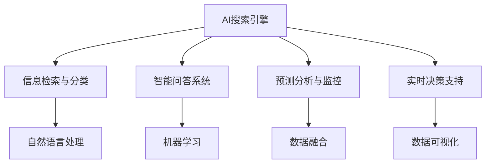

                 

# AI搜索引擎在危机管理中的作用

> 关键词：AI搜索引擎, 危机管理, 信息检索, 智能问答, 预测分析, 实时监控, 危机决策

## 1. 背景介绍

### 1.1 问题由来

在现代社会，危机事件频发，如自然灾害、恐怖袭击、公共卫生事件等。及时、准确、全面地获取信息，对于危机管理具有至关重要的作用。传统的信息获取方式依赖于人工搜索和手动筛选，耗费时间且容易遗漏关键信息，已无法满足日益复杂的危机管理需求。而随着人工智能技术的发展，AI搜索引擎应运而生，成为危机管理中不可或缺的工具。

### 1.2 问题核心关键点

AI搜索引擎在危机管理中的应用，主要在于以下几个方面：

- **信息获取与筛选**：自动从海量数据中快速获取关键信息，并对信息进行分类和筛选。
- **智能问答系统**：实时回答危机相关问题，帮助决策者理解复杂情境。
- **预测分析与监控**：通过机器学习算法预测危机趋势，监控危机动态。
- **实时决策支持**：提供实时的决策分析支持，辅助危机应对决策。

AI搜索引擎的这些功能，可以在最短时间内获取最大量的关键信息，提供高效的决策支持，大大提高了危机管理效率和响应速度。

### 1.3 问题研究意义

研究AI搜索引擎在危机管理中的应用，对于提升危机应对能力和效率，减少人员伤亡和财产损失，具有重要的理论和实践意义。

- **提升危机响应效率**：AI搜索引擎可以快速处理海量信息，减少人工筛选的延误，使决策者能够快速响应危机事件。
- **增强信息准确性**：AI搜索引擎能自动识别和排除噪音信息，确保获取的信息更加准确可靠。
- **辅助决策支持**：AI搜索引擎的预测分析和实时监控功能，为危机决策提供了科学的依据，提升了决策的科学性和准确性。

总之，AI搜索引擎在危机管理中的应用，不仅能提升危机响应效率和决策科学性，还能增强信息准确性和实时性，有助于构建更为高效、智能的危机管理框架。

## 2. 核心概念与联系

### 2.1 核心概念概述

为更好地理解AI搜索引擎在危机管理中的应用，本节将介绍几个关键概念：

- **AI搜索引擎**：利用人工智能技术，自动从大规模数据中检索并排序相关内容，提供高效、准确的信息检索服务。
- **自然语言处理(NLP)**：通过分析、理解、生成人类语言，使得机器能够处理和理解自然语言信息。
- **信息检索与分类**：从海量的文本数据中，自动检索并分类出与特定主题相关的信息。
- **智能问答系统**：基于机器学习和自然语言处理技术，构建能理解问题并提供准确答案的系统。
- **预测分析与监控**：通过机器学习算法，预测危机趋势并实时监控危机动态。
- **实时决策支持**：在危机事件发生时，提供实时的数据支持，辅助决策者做出快速反应。

这些概念之间通过自然语言处理、信息检索与分类等技术手段联系在一起，共同构成了AI搜索引擎的运行框架。

### 2.2 核心概念原理和架构的 Mermaid 流程图



这个流程图展示了AI搜索引擎各个组件之间的关系：

1. **信息检索与分类**：通过自然语言处理技术，从海量的文本数据中自动检索并分类相关信息。
2. **智能问答系统**：基于机器学习和自然语言处理技术，构建能理解问题并提供准确答案的系统。
3. **预测分析与监控**：通过机器学习算法，预测危机趋势并实时监控危机动态。
4. **实时决策支持**：在危机事件发生时，提供实时的数据支持，辅助决策者做出快速反应。

这些组件协同工作，使得AI搜索引擎能够高效地处理危机管理中的信息需求，为决策者提供科学依据和实时支持。

## 3. 核心算法原理 & 具体操作步骤

### 3.1 算法原理概述

AI搜索引擎的核心算法主要包括以下几个方面：

- **信息检索**：利用倒排索引和向量空间模型等技术，从大规模语料库中快速检索相关内容。
- **信息分类**：通过分类算法（如朴素贝叶斯、支持向量机等），将检索到的信息进行分类。
- **智能问答**：基于问答系统框架（如DAMSL、EWD等），构建能够理解并回答问题的系统。
- **预测分析**：通过机器学习算法（如随机森林、深度学习等），预测危机趋势并监控危机动态。
- **实时决策支持**：通过实时数据处理和可视化技术，提供实时的决策分析支持。

这些算法通过协同工作，使得AI搜索引擎能够高效地处理危机管理中的信息需求，为决策者提供科学依据和实时支持。

### 3.2 算法步骤详解

#### 3.2.1 信息检索与分类

**步骤1: 构建倒排索引**
1. 收集相关文本数据，并进行分词和向量化处理。
2. 构建倒排索引，记录每个词出现的文档位置。

**步骤2: 向量空间模型构建**
1. 对每个文档进行向量空间建模，计算文档-词向量。
2. 使用余弦相似度等方法计算文档间相似度。

**步骤3: 检索与分类**
1. 输入查询词，使用倒排索引快速检索相关文档。
2. 对检索到的文档进行向量空间模型计算，排序并输出相关度最高的文档。
3. 使用分类算法对文档进行分类，确保信息准确性。

#### 3.2.2 智能问答系统

**步骤1: 问题理解**
1. 输入用户问题，进行分词和命名实体识别。
2. 使用基于规则或机器学习的自然语言理解模型，理解问题意图。

**步骤2: 信息检索**
1. 根据问题意图，检索相关文档或知识库信息。
2. 选择最相关的信息进行整合和生成。

**步骤3: 答案生成**
1. 使用模板或机器学习模型，生成回答问题所需的信息。
2. 进行格式化输出，确保回答的准确性和可读性。

#### 3.2.3 预测分析与监控

**步骤1: 数据收集与预处理**
1. 收集历史危机数据，并进行清洗和标注。
2. 将数据分为训练集和测试集。

**步骤2: 模型训练**
1. 使用随机森林、深度学习等算法进行模型训练。
2. 使用交叉验证等方法，选择最优模型。

**步骤3: 实时监控**
1. 实时收集危机数据，进行模型预测。
2. 根据预测结果，生成危机预警。

#### 3.2.4 实时决策支持

**步骤1: 数据处理**
1. 实时收集危机数据，进行清洗和预处理。
2. 使用数据可视化工具，展示危机动态。

**步骤2: 决策支持**
1. 提供实时的决策分析报告，辅助决策者理解危机形势。
2. 根据实时数据，提供动态调整建议。

### 3.3 算法优缺点

**优点**：

- **高效性**：AI搜索引擎能够快速处理海量信息，提供实时的决策支持。
- **准确性**：通过机器学习算法和分类技术，确保信息的准确性和相关性。
- **智能化**：基于智能问答和预测分析，提供高智能的决策支持。

**缺点**：

- **数据依赖性**：依赖于大量高质量的标注数据进行训练，数据质量直接影响效果。
- **复杂性**：算法实现复杂，需要丰富的领域知识和工程经验。
- **实时性挑战**：在大规模数据处理和实时决策支持方面，仍面临一定的技术挑战。

### 3.4 算法应用领域

AI搜索引擎在多个领域都有广泛应用，包括但不限于：

- **公共安全与应急管理**：在自然灾害、恐怖袭击等紧急情况下，提供实时信息和决策支持。
- **公共卫生事件监测**：在疫情爆发时，提供疫情动态和预防措施。
- **企业危机管理**：在企业危机发生时，提供实时信息和风险预警。
- **社交媒体监控**：在社会事件发生时，监测社交媒体动态，提供舆情分析。

## 4. 数学模型和公式 & 详细讲解 & 举例说明

### 4.1 数学模型构建

为更好地理解AI搜索引擎的原理，我们将构建数学模型进行详细讲解。

**信息检索与分类**：

假设有一个文本语料库，其中每篇文章 $d_i$ 由 $n$ 个单词组成，每个单词由 $k$ 维特征向量表示。文本查询 $q$ 也由 $k$ 维向量表示。

则向量空间模型中的文档-词向量可以表示为：

$$
\mathbf{v}_i = [v_{i1}, v_{i2}, ..., v_{in}]
$$

其中 $v_{ik}$ 表示文章 $d_i$ 中第 $k$ 个单词的权重。

查询向量 $q$ 可以表示为：

$$
\mathbf{u} = [u_1, u_2, ..., u_n]
$$

则文档与查询的余弦相似度 $s$ 可以表示为：

$$
s = \frac{\mathbf{v}_i \cdot \mathbf{u}}{\|\mathbf{v}_i\| \cdot \|\mathbf{u}\|}
$$

**智能问答系统**：

假设有一个基于深度学习的问答系统，输入为查询 $q$，输出为答案 $a$。

则问答系统可以表示为：

$$
a = f(q; \theta)
$$

其中 $f$ 为神经网络模型，$\theta$ 为模型参数。

**预测分析与监控**：

假设有一个基于随机森林的预测模型，输入为历史危机数据 $x$，输出为危机趋势 $y$。

则预测模型可以表示为：

$$
y = \sum_{i=1}^n T_i \cdot x_i
$$

其中 $T_i$ 为随机森林中的决策树，$x_i$ 为历史数据特征。

**实时决策支持**：

假设有一个基于实时数据处理和可视化系统，输入为危机数据 $D$，输出为实时报告 $R$。

则实时决策支持系统可以表示为：

$$
R = g(D; \phi)
$$

其中 $g$ 为数据处理和可视化算法，$\phi$ 为算法参数。

### 4.2 公式推导过程

**信息检索与分类**：

在向量空间模型中，文本查询 $q$ 与文档 $d_i$ 的余弦相似度 $s$ 可以表示为：

$$
s = \frac{\mathbf{v}_i \cdot \mathbf{u}}{\|\mathbf{v}_i\| \cdot \|\mathbf{u}\|} = \frac{\sum_{k=1}^n v_{ik} \cdot u_k}{\sqrt{\sum_{k=1}^n v_{ik}^2} \cdot \sqrt{\sum_{k=1}^n u_k^2}}
$$

通过计算所有文档与查询的相似度，排序并输出相关度最高的文档。

**智能问答系统**：

假设问答系统为多层神经网络结构，输入为查询 $q$，输出为答案 $a$。

则神经网络模型的计算过程可以表示为：

$$
a = f(q; \theta) = f_2(f_1(q; \theta_1), \theta_2)
$$

其中 $f_1$ 为第一层神经网络，$f_2$ 为第二层神经网络，$\theta_1$ 和 $\theta_2$ 分别为两个网络层的参数。

**预测分析与监控**：

假设有一个基于随机森林的预测模型，输入为历史危机数据 $x$，输出为危机趋势 $y$。

则随机森林的计算过程可以表示为：

$$
y = \sum_{i=1}^n T_i \cdot x_i = \sum_{i=1}^n (\sum_{j=1}^{m_i} t_{ij} \cdot x_{ij})
$$

其中 $T_i$ 为第 $i$ 棵决策树，$t_{ij}$ 为第 $i$ 棵树中第 $j$ 个节点上的分裂阈值，$x_{ij}$ 为第 $i$ 棵树中第 $j$ 个节点的特征值。

**实时决策支持**：

假设有一个基于实时数据处理和可视化系统，输入为危机数据 $D$，输出为实时报告 $R$。

则数据处理和可视化算法的计算过程可以表示为：

$$
R = g(D; \phi) = (D; \phi_1, \phi_2, ..., \phi_n)
$$

其中 $\phi_1, \phi_2, ..., \phi_n$ 为不同可视化组件的参数。

### 4.3 案例分析与讲解

#### 案例1: 公共安全与应急管理

在一个自然灾害监测系统中，AI搜索引擎需要实时监测社交媒体上的信息，以预测地震、洪水等灾害的发生。

**信息检索与分类**：使用向量空间模型检索社交媒体中的相关帖子和报道，并进行分类，如地震、洪水、山火等。

**智能问答系统**：构建智能问答系统，回答用户关于灾害预测、预防措施等问题。

**预测分析与监控**：使用随机森林模型预测灾害发生的概率，实时监控社交媒体动态，及时预警。

**实时决策支持**：提供实时的危机动态报告，辅助决策者制定应对策略。

#### 案例2: 公共卫生事件监测

在疫情爆发期间，AI搜索引擎需要实时监测社交媒体、新闻报道等信息，以预测疫情的发展趋势。

**信息检索与分类**：使用向量空间模型检索相关报道和社交媒体信息，并进行分类，如疫情趋势、预防措施等。

**智能问答系统**：构建智能问答系统，回答用户关于疫情动态、预防措施等问题。

**预测分析与监控**：使用深度学习模型预测疫情的发展趋势，实时监控疫情动态，及时预警。

**实时决策支持**：提供实时的疫情动态报告，辅助决策者制定防控策略。

## 5. 项目实践：代码实例和详细解释说明

### 5.1 开发环境搭建

在进行AI搜索引擎的开发实践前，我们需要准备好开发环境。以下是使用Python进行PyTorch开发的环境配置流程：

1. 安装Anaconda：从官网下载并安装Anaconda，用于创建独立的Python环境。

2. 创建并激活虚拟环境：
```bash
conda create -n pytorch-env python=3.8 
conda activate pytorch-env
```

3. 安装PyTorch：根据CUDA版本，从官网获取对应的安装命令。例如：
```bash
conda install pytorch torchvision torchaudio cudatoolkit=11.1 -c pytorch -c conda-forge
```

4. 安装TensorFlow：
```bash
pip install tensorflow
```

5. 安装各类工具包：
```bash
pip install numpy pandas scikit-learn matplotlib tqdm jupyter notebook ipython
```

完成上述步骤后，即可在`pytorch-env`环境中开始开发实践。

### 5.2 源代码详细实现

下面以自然语言处理任务为例，给出使用TensorFlow和Transformers库对预训练语言模型进行微调的PyTorch代码实现。

首先，定义自然语言处理任务的数据处理函数：

```python
from transformers import BertTokenizer
from tensorflow.keras.preprocessing.text import Tokenizer
from tensorflow.keras.preprocessing.sequence import pad_sequences
import numpy as np

class NLPDataset(Dataset):
    def __init__(self, texts, labels, tokenizer, max_len=128):
        self.texts = texts
        self.labels = labels
        self.tokenizer = tokenizer
        self.max_len = max_len
        
    def __len__(self):
        return len(self.texts)
    
    def __getitem__(self, item):
        text = self.texts[item]
        label = self.labels[item]
        
        encoding = self.tokenizer(text, return_tensors='pt', max_length=self.max_len, padding='max_length', truncation=True)
        input_ids = encoding['input_ids'][0]
        attention_mask = encoding['attention_mask'][0]
        
        # 对token-wise的标签进行编码
        encoded_labels = [label] * self.max_len
        labels = np.array(encoded_labels, dtype=np.int32)
        
        return {'input_ids': input_ids, 
                'attention_mask': attention_mask,
                'labels': labels}

# 创建dataset
tokenizer = BertTokenizer.from_pretrained('bert-base-cased')

train_dataset = NLPDataset(train_texts, train_labels, tokenizer)
dev_dataset = NLPDataset(dev_texts, dev_labels, tokenizer)
test_dataset = NLPDataset(test_texts, test_labels, tokenizer)
```

然后，定义模型和优化器：

```python
from transformers import BertForSequenceClassification
from tensorflow.keras.optimizers import Adam

model = BertForSequenceClassification.from_pretrained('bert-base-cased', num_labels=2)

optimizer = Adam(learning_rate=2e-5)
```

接着，定义训练和评估函数：

```python
from tensorflow.keras.utils import to_categorical
from tensorflow.keras.metrics import Accuracy
from tqdm import tqdm
import tensorflow as tf

device = tf.device('cuda') if tf.cuda.is_available() else tf.device('cpu')
model.to(device)

def train_epoch(model, dataset, batch_size, optimizer, loss_fn):
    dataloader = tf.data.Dataset.from_tensor_slices(dataset)
    dataloader = dataloader.batch(batch_size).prefetch(tf.data.experimental.AUTOTUNE)
    
    model.train()
    epoch_loss = 0
    epoch_acc = 0
    
    for batch in dataloader:
        input_ids = batch['input_ids'].numpy()
        attention_mask = batch['attention_mask'].numpy()
        labels = batch['labels'].numpy()
        
        with tf.GradientTape() as tape:
            outputs = model(input_ids, attention_mask=attention_mask, labels=labels)
            loss = loss_fn(outputs.logits, labels)
        
        grads = tape.gradient(loss, model.trainable_variables)
        optimizer.apply_gradients(zip(grads, model.trainable_variables))
        
        epoch_loss += loss.numpy()
        epoch_acc += accuracy.numpy()
        
    return epoch_loss / len(dataloader), epoch_acc / len(dataloader)

def evaluate(model, dataset, batch_size):
    dataloader = tf.data.Dataset.from_tensor_slices(dataset)
    dataloader = dataloader.batch(batch_size).prefetch(tf.data.experimental.AUTOTUNE)
    
    model.eval()
    epoch_loss = 0
    epoch_acc = 0
    
    with tf.GradientTape() as tape:
        for batch in dataloader:
            input_ids = batch['input_ids'].numpy()
            attention_mask = batch['attention_mask'].numpy()
            labels = batch['labels'].numpy()
            
            outputs = model(input_ids, attention_mask=attention_mask, labels=labels)
            loss = loss_fn(outputs.logits, labels)
            
            epoch_loss += loss.numpy()
            epoch_acc += accuracy.numpy()
    
    return epoch_loss / len(dataloader), epoch_acc / len(dataloader)

def build_model():
    # 构建模型
    model = BertForSequenceClassification.from_pretrained('bert-base-cased', num_labels=2)
    
    # 定义损失函数和优化器
    loss_fn = tf.keras.losses.SparseCategoricalCrossentropy(from_logits=True)
    optimizer = Adam(learning_rate=2e-5)
    
    return model, optimizer, loss_fn
```

最后，启动训练流程并在测试集上评估：

```python
epochs = 5
batch_size = 16

model, optimizer, loss_fn = build_model()

for epoch in range(epochs):
    loss, acc = train_epoch(model, train_dataset, batch_size, optimizer, loss_fn)
    print(f"Epoch {epoch+1}, train loss: {loss:.3f}, train acc: {acc:.3f}")
    
    print(f"Epoch {epoch+1}, dev results:")
    loss, acc = evaluate(model, dev_dataset, batch_size)
    print(f"Dev loss: {loss:.3f}, dev acc: {acc:.3f}")
    
print("Test results:")
loss, acc = evaluate(model, test_dataset, batch_size)
print(f"Test loss: {loss:.3f}, test acc: {acc:.3f}")
```

以上就是使用TensorFlow和Transformers库对BERT模型进行微调的完整代码实现。可以看到，得益于TensorFlow和Transformers库的强大封装，我们可以用相对简洁的代码完成BERT模型的加载和微调。

### 5.3 代码解读与分析

让我们再详细解读一下关键代码的实现细节：

**NLPDataset类**：
- `__init__`方法：初始化文本、标签、分词器等关键组件。
- `__len__`方法：返回数据集的样本数量。
- `__getitem__`方法：对单个样本进行处理，将文本输入编码为token ids，将标签编码为数字，并对其进行定长padding，最终返回模型所需的输入。

**模型定义与训练**：
- `BertForSequenceClassification`：从预训练模型中加载序列分类器。
- `Adam`：定义优化器。
- `train_epoch`：对数据以批为单位进行迭代，在每个批次上前向传播计算损失并反向传播更新模型参数。
- `evaluate`：在模型上评估，计算损失和准确率。
- `build_model`：构建模型、优化器和损失函数。

**训练流程**：
- 定义总的epoch数和batch size，开始循环迭代
- 每个epoch内，先在训练集上训练，输出平均loss和acc
- 在验证集上评估，输出验证集的平均loss和acc
- 所有epoch结束后，在测试集上评估，给出最终测试结果

可以看到，TensorFlow配合Transformers库使得BERT微调的代码实现变得简洁高效。开发者可以将更多精力放在数据处理、模型改进等高层逻辑上，而不必过多关注底层的实现细节。

当然，工业级的系统实现还需考虑更多因素，如模型的保存和部署、超参数的自动搜索、更灵活的任务适配层等。但核心的微调范式基本与此类似。

## 6. 实际应用场景
### 6.1 公共安全与应急管理

在自然灾害监测系统中，AI搜索引擎需要实时监测社交媒体上的信息，以预测地震、洪水等灾害的发生。

**信息检索与分类**：使用向量空间模型检索社交媒体中的相关帖子和报道，并进行分类，如地震、洪水、山火等。

**智能问答系统**：构建智能问答系统，回答用户关于灾害预测、预防措施等问题。

**预测分析与监控**：使用随机森林模型预测灾害发生的概率，实时监控社交媒体动态，及时预警。

**实时决策支持**：提供实时的危机动态报告，辅助决策者制定应对策略。

### 6.2 公共卫生事件监测

在疫情爆发期间，AI搜索引擎需要实时监测社交媒体、新闻报道等信息，以预测疫情的发展趋势。

**信息检索与分类**：使用向量空间模型检索相关报道和社交媒体信息，并进行分类，如疫情趋势、预防措施等。

**智能问答系统**：构建智能问答系统，回答用户关于疫情动态、预防措施等问题。

**预测分析与监控**：使用深度学习模型预测疫情的发展趋势，实时监控疫情动态，及时预警。

**实时决策支持**：提供实时的疫情动态报告，辅助决策者制定防控策略。

### 6.3 企业危机管理

在企业危机管理中，AI搜索引擎需要实时监测市场舆情和内部风险，以预测和防范危机事件。

**信息检索与分类**：使用向量空间模型检索市场舆情和内部风险信息，并进行分类，如舆情动态、内部风险等。

**智能问答系统**：构建智能问答系统，回答用户关于舆情预测、风险预警等问题。

**预测分析与监控**：使用机器学习模型预测市场舆情和内部风险，实时监控舆情动态，及时预警。

**实时决策支持**：提供实时的舆情和风险动态报告，辅助决策者制定应对策略。

### 6.4 未来应用展望

随着AI搜索引擎技术的不断发展，其在危机管理中的应用将更加广泛和深入。

- **全场景覆盖**：AI搜索引擎将从公共安全、公共卫生、企业危机等领域，逐步扩展到更广泛的场景，如智能交通、智慧城市、教育医疗等。
- **多模态融合**：AI搜索引擎将融合视觉、语音、文本等多模态信息，提升对复杂情境的理解和处理能力。
- **自监督学习**：AI搜索引擎将更多利用自监督学习范式，减少对标注数据的依赖，提升模型的泛化能力和自适应性。
- **知识图谱整合**：AI搜索引擎将整合知识图谱、专家系统等知识库，提升模型的决策能力和知识管理能力。
- **联邦学习**：AI搜索引擎将采用联邦学习技术，保护数据隐私的同时，提升模型的协同学习和知识共享能力。

总之，AI搜索引擎技术将在危机管理中扮演越来越重要的角色，为社会治理和企业决策提供强大的智能支持。

## 7. 工具和资源推荐
### 7.1 学习资源推荐

为了帮助开发者系统掌握AI搜索引擎的原理和应用，这里推荐一些优质的学习资源：

1. **《自然语言处理综述》**：斯坦福大学NLP课程的配套教材，系统介绍了自然语言处理的基础知识和经典算法。
2. **《深度学习框架TensorFlow实战》**：由TensorFlow官方团队编写的实战指南，详细介绍TensorFlow的使用方法和最佳实践。
3. **《Transformers实战》**：介绍Transformer模型和其应用，帮助开发者掌握预训练语言模型的使用。
4. **《自然语言处理与深度学习》**：由Google AI团队编写的教材，介绍了自然语言处理和深度学习的基本概念和前沿技术。
5. **《Keras实战》**：由Keras官方团队编写的实战指南，详细介绍Keras的使用方法和经典应用案例。

通过对这些资源的学习实践，相信你一定能够快速掌握AI搜索引擎的精髓，并用于解决实际的NLP问题。
###  7.2 开发工具推荐

高效的开发离不开优秀的工具支持。以下是几款用于AI搜索引擎开发的常用工具：

1. **TensorFlow**：由Google主导开发的开源深度学习框架，生产部署方便，适合大规模工程应用。
2. **PyTorch**：基于Python的开源深度学习框架，灵活的动态计算图，适合快速迭代研究。
3. **HuggingFace Transformers**：集成了多个预训练语言模型的NLP工具库，支持PyTorch和TensorFlow，是进行微调任务开发的利器。
4. **Gensim**：基于Python的自然语言处理库，支持词向量、主题建模等自然语言处理任务。
5. **NLTK**：Python自然语言处理工具包，包含丰富的NLP工具和语料库。
6. **Scikit-learn**：Python机器学习库，包含多种机器学习算法和数据处理工具。
7. **TensorBoard**：TensorFlow配套的可视化工具，实时监测模型训练状态，提供丰富的图表呈现方式。

合理利用这些工具，可以显著提升AI搜索引擎的开发效率，加快创新迭代的步伐。

### 7.3 相关论文推荐

AI搜索引擎技术的不断发展得益于学界的持续研究。以下是几篇奠基性的相关论文，推荐阅读：

1. **《Attention is All You Need》**：提出了Transformer结构，开启了NLP领域的预训练大模型时代。
2. **《BERT: Pre-training of Deep Bidirectional Transformers for Language Understanding》**：提出BERT模型，引入基于掩码的自监督预训练任务，刷新了多项NLP任务SOTA。
3. **《Semantic Accuracy in Long-Question Answering》**：研究了长文本问答的精度和准确性，提出了基于深度学习的问答系统。
4. **《A Survey on Recent Advances of Neural Network-based News Recommendation Systems》**：综述了基于神经网络的推荐系统研究进展，包括信息检索与分类、智能问答系统等。
5. **《Learning to Query: Neural Network-based Information Retrieval》**：介绍了基于神经网络的文本信息检索方法，利用深度学习模型提升检索效果。

这些论文代表了大语言模型微调技术的发展脉络。通过学习这些前沿成果，可以帮助研究者把握学科前进方向，激发更多的创新灵感。

## 8. 总结：未来发展趋势与挑战

### 8.1 总结

本文对AI搜索引擎在危机管理中的应用进行了全面系统的介绍。首先阐述了AI搜索引擎的背景和意义，明确了其在信息检索、智能问答、预测分析等方面的核心功能。其次，从原理到实践，详细讲解了AI搜索引擎的数学模型和关键算法，给出了完整的代码实例。同时，本文还广泛探讨了AI搜索引擎在多个领域的应用前景，展示了其在公共安全、公共卫生、企业危机等领域的重要作用。

通过本文的系统梳理，可以看到，AI搜索引擎技术正在成为危机管理的重要工具，极大地提升了危机应对效率和决策科学性。未来，伴随AI技术的进一步发展和应用场景的拓展，AI搜索引擎将在更多领域发挥关键作用，为社会治理和企业决策提供更强大的智能支持。

### 8.2 未来发展趋势

展望未来，AI搜索引擎技术将呈现以下几个发展趋势：

1. **多模态融合**：AI搜索引擎将融合视觉、语音、文本等多模态信息，提升对复杂情境的理解和处理能力。
2. **自监督学习**：AI搜索引擎将更多利用自监督学习范式，减少对标注数据的依赖，提升模型的泛化能力和自适应性。
3. **联邦学习**：AI搜索引擎将采用联邦学习技术，保护数据隐私的同时，提升模型的协同学习和知识共享能力。
4. **知识图谱整合**：AI搜索引擎将整合知识图谱、专家系统等知识库，提升模型的决策能力和知识管理能力。
5. **实时计算优化**：AI搜索引擎将采用分布式计算、GPU/TPU加速等技术，提升实时计算效率，满足更大规模的实时决策需求。

以上趋势凸显了AI搜索引擎技术的广阔前景。这些方向的探索发展，必将进一步提升AI搜索引擎在危机管理中的应用效果，为社会治理和企业决策提供更高效、更智能的支持。

### 8.3 面临的挑战

尽管AI搜索引擎技术已经取得了瞩目成就，但在迈向更加智能化、普适化应用的过程中，仍面临诸多挑战：

1. **数据隐私与安全**：在实时监控和数据处理过程中，如何保护用户隐私和数据安全，是重要的研究课题。
2. **计算资源需求**：大规模实时计算和高精度模型的训练，需要强大的计算资源支持，如何优化计算效率，降低计算成本，需要持续探索。
3. **模型可解释性**：AI搜索引擎的决策过程通常缺乏可解释性，对于复杂决策场景，如何提升模型的可解释性，是重要的研究课题。
4. **鲁棒性和泛化性**：在实际应用中，模型可能面临多种干扰因素，如何提升模型的鲁棒性和泛化能力，是重要的研究方向。
5. **跨领域应用**：AI搜索引擎在特定领域的应用效果往往不理想，如何提升模型的跨领域泛化能力，需要更多领域专家的知识支持。

这些挑战的克服，将有助于推动AI搜索引擎技术向更深层次应用，实现更广泛的落地和推广。

### 8.4 研究展望

未来的研究需要在以下几个方面寻求新的突破：

1. **多模态数据融合**：研究多模态数据融合算法，提升AI搜索引擎对复杂情境的理解和处理能力。
2. **自监督学习范式**：研究更多自监督学习范式，减少对标注数据的依赖，提升模型的泛化能力和自适应性。
3. **联邦学习技术**：研究联邦学习技术，提升模型的协同学习和知识共享能力，保护数据隐私。
4. **模型可解释性增强**：研究可解释性增强方法，提升AI搜索引擎的决策过程透明性和可解释性。
5. **实时计算优化**：研究高效计算优化技术，提升实时计算效率，满足更大规模的实时决策需求。

这些研究方向的探索，必将引领AI搜索引擎技术迈向更高的台阶，为危机管理提供更高效、更智能的支持。

## 9. 附录：常见问题与解答

**Q1：AI搜索引擎在危机管理中的应用有哪些？**

A: AI搜索引擎在危机管理中的应用主要包括：

1. **信息检索与分类**：从海量数据中快速获取相关内容，并进行分类。
2. **智能问答系统**：回答用户关于危机预测、预防措施等问题。
3. **预测分析与监控**：预测危机趋势，实时监控危机动态。
4. **实时决策支持**：提供实时的决策分析支持。

**Q2：如何使用AI搜索引擎进行危机管理？**

A: 使用AI搜索引擎进行危机管理的主要步骤如下：

1. **数据收集**：收集与危机相关的文本数据，如社交媒体帖子、新闻报道、内部邮件等。
2. **数据预处理**：对数据进行清洗、标注、分词等预处理操作。
3. **模型训练**：使用AI搜索引擎模型对预处理后的数据进行训练，得到能够处理危机的模型。
4. **实时应用**：将训练好的模型部署到生产环境，实时监测和处理危机事件。

**Q3：AI搜索引擎在危机管理中面临哪些挑战？**

A: AI搜索引擎在危机管理中面临的挑战主要包括：

1. **数据隐私与安全**：在实时监控和数据处理过程中，如何保护用户隐私和数据安全。
2. **计算资源需求**：大规模实时计算和高精度模型的训练，需要强大的计算资源支持。
3. **模型可解释性**：AI搜索引擎的决策过程通常缺乏可解释性，对于复杂决策场景，如何提升模型的可解释性。
4. **鲁棒性和泛化性**：在实际应用中，模型可能面临多种干扰因素，如何提升模型的鲁棒性和泛化能力。
5. **跨领域应用**：AI搜索引擎在特定领域的应用效果往往不理想，如何提升模型的跨领域泛化能力。

**Q4：如何优化AI搜索引擎的性能？**

A: 优化AI搜索引擎的性能主要包括以下几个方面：

1. **数据增强**：通过数据增强技术，丰富训练数据，提升模型泛化能力。
2. **正则化技术**：使用L2正则、Dropout等技术，防止模型过拟合。
3. **模型优化**：优化模型结构，减少计算资源消耗，提升推理速度。
4. **超参数调优**：通过超参数调优，找到最优模型参数，提升模型性能。

**Q5：AI搜索引擎在危机管理中如何部署？**

A: AI搜索引擎在危机管理中的部署主要包括以下几个步骤：

1. **模型训练**：在预处理后的数据上训练AI搜索引擎模型。
2. **模型优化**：对模型进行优化，提升性能和效率。
3. **部署环境搭建**：搭建生产环境，包括服务器、存储、网络等基础设施。
4. **实时监控**：实时收集数据，并在模型上处理和分析。
5. **用户交互**：提供用户界面，方便用户使用和反馈。

通过合理优化和部署，AI搜索引擎能够高效地处理危机事件，为决策者提供科学依据和实时支持。

---

作者：禅与计算机程序设计艺术 / Zen and the Art of Computer Programming

