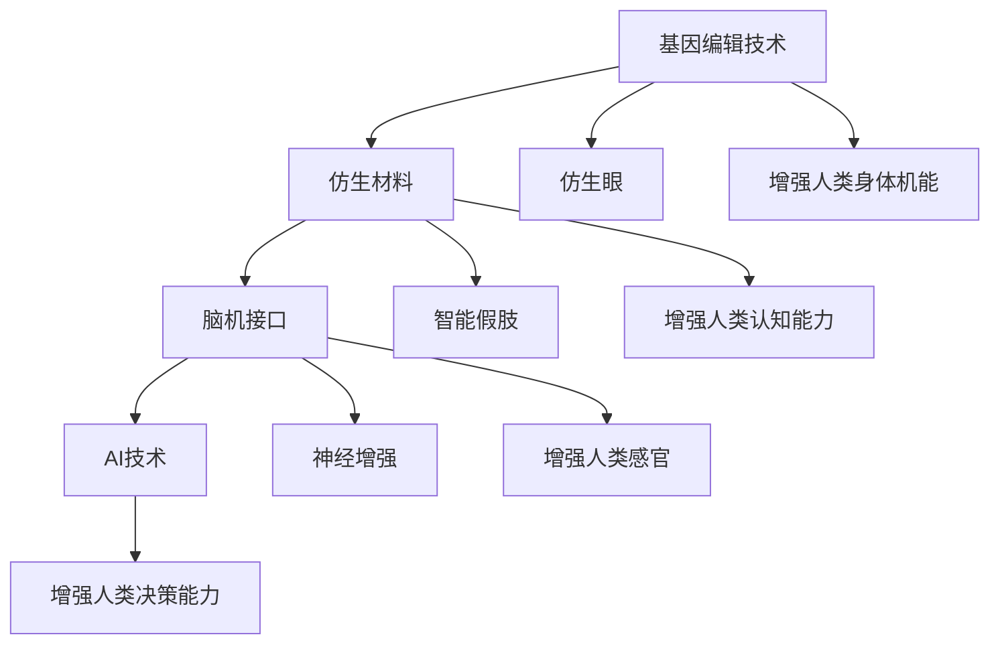
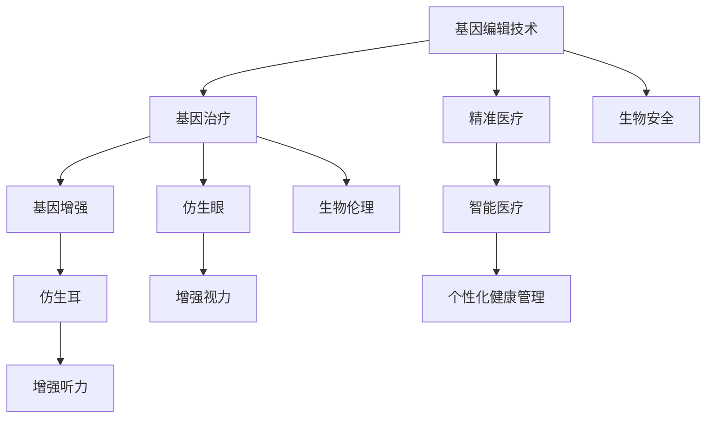

                 

# AI时代的人类增强：身体增强与道德考虑

## 1. 背景介绍

在AI时代，技术进步不断推动人类生活质量的提升，从智能家居到自动驾驶，从个性化推荐到医疗诊断，科技的边界正在不断拓展。然而，技术的发展也引发了对于人类增强的深度思考：当身体增强成为可能，如何平衡科技进步与伦理道德，确保技术造福于全人类？

### 1.1 问题由来

现代科技的发展，特别是AI和生物工程领域的飞速进步，使得人类增强成为可能。例如，基因编辑技术如CRISPR可以改变人类基因，增强身体机能；脑机接口(BMI)技术可以实现人机深度交互，提升认知和感官能力；仿生材料和生物传感技术，可以制造出更为强大的假肢、义眼等辅助设备。这些技术的发展，为人类增强提供了前所未有的机遇，但同时也带来了许多道德和法律上的挑战。

### 1.2 问题核心关键点

人类增强的核心问题集中在两个方面：一是如何在技术可行的情况下，实现对人类身体和认知能力的提升；二是如何确保这一过程不会带来新的伦理问题，如隐私泄露、公平性问题、生物安全风险等。

以下图展示了AI时代人类增强的核心概念及其相互关系：



## 2. 核心概念与联系

### 2.1 核心概念概述

为了更好地理解AI时代人类增强的伦理道德问题，本节将介绍几个关键概念：

- **基因编辑技术(Gene Editing)**：利用CRISPR-Cas9等基因编辑技术，直接修改人类基因组，以实现疾病预防、基因治疗、身体增强等目标。
- **仿生材料(Bionic Materials)**：使用纳米技术、生物工程等手段，制造出与人体组织兼容性高、功能多样的材料，用于辅助身体机能的增强。
- **脑机接口(Brain-Computer Interface, BMI)**：通过电生理信号采集、解码和回传，实现人机深度交互，用于恢复感官功能、增强认知能力等。
- **AI技术(Artificial Intelligence)**：包括机器学习、深度学习、自然语言处理等，用于数据分析、模式识别、智能决策等，支持人类增强的自动化和智能化。

### 2.2 核心概念原理和架构的 Mermaid 流程图



这个流程图展示了基因编辑、仿生材料和脑机接口技术在人体增强中的应用，以及AI技术的支持作用。

## 3. 核心算法原理 & 具体操作步骤
### 3.1 算法原理概述

人类增强的算法原理可以大致分为以下几个步骤：

1. **基因编辑**：通过基因编辑技术，修改目标基因，实现基因表达的增强或抑制。
2. **仿生材料**：利用纳米技术、生物工程等手段，制造与人体兼容的仿生材料，增强身体机能。
3. **脑机接口**：通过电生理信号采集和解码，实现人机交互，增强认知和感官功能。
4. **AI技术**：利用机器学习等技术，优化基因编辑方案、设计仿生材料、分析脑机接口数据，支持人类增强的智能化和自动化。

### 3.2 算法步骤详解

以仿生眼增强为例，其算法步骤如下：

1. **需求分析**：分析用户需求，如视力障碍、夜视能力等。
2. **材料设计**：根据需求，设计仿生材料，包括光敏细胞、微电极、导电聚合物等。
3. **实验验证**：通过动物实验验证材料效果，优化材料性能。
4. **临床试验**：在人身上进行临床试验，验证安全性与有效性。
5. **商业化应用**：将仿生眼推向市场，推广应用。

### 3.3 算法优缺点

基因编辑技术在实现人类增强方面具有以下优点：
- 可以精准修改基因，实现高效的基因治疗和身体增强。
- 对于遗传性疾病具有长远的预防和治疗效果。

但同时，也存在以下缺点：
- 技术复杂，成本高，难以大规模推广。
- 可能带来未知的生物风险，如脱靶效应、基因突变的不可预测性等。
- 涉及伦理和法律问题，如基因隐私、基因歧视等。

仿生材料技术具有以下优点：
- 与人体兼容性高，安全可控。
- 可根据个体需求设计，实现个性化增强。

但同时，也存在以下缺点：
- 技术门槛较高，研发成本高。
- 需要长期跟踪观察，以评估其长期效果和安全性。

脑机接口技术在实现人类增强方面具有以下优点：
- 可以实现人机深度交互，增强认知和感官能力。
- 对于脑部疾病（如帕金森症、癫痫）具有治疗和预防效果。

但同时，也存在以下缺点：
- 技术复杂，成本高。
- 可能带来隐私泄露、神经干预等伦理问题。

AI技术在支持人类增强方面具有以下优点：
- 可以处理海量数据，优化设计方案。
- 可以实现智能化的数据处理和分析，提升决策的准确性。

但同时，也存在以下缺点：
- 需要大量数据和计算资源，可能带来数据隐私和计算安全问题。
- 可能加剧技术不平等，加剧社会鸿沟。

### 3.4 算法应用领域

基因编辑技术在多个领域都有广泛应用，如基因治疗、癌症预防、基因工程等。
仿生材料技术可以应用于辅助听力和视觉、义肢、假肢等。
脑机接口技术可以应用于医疗康复、游戏娱乐、工业控制等领域。
AI技术在人类增强中的应用则更加广泛，涵盖了医疗健康、教育培训、人机交互等多个方面。

## 4. 数学模型和公式 & 详细讲解 & 举例说明

### 4.1 数学模型构建

为了更好地分析人类增强的算法原理，本节将构建一个简单的数学模型。

假设目标增强人类视力，我们需要考虑以下几个关键参数：

- **视力障碍程度**：用 $V$ 表示，取值范围为 $[0,1]$，$V=0$ 表示视力完全正常，$V=1$ 表示完全失明。
- **仿生材料效果**：用 $M$ 表示，取值范围为 $[0,1]$，$M=0$ 表示完全无效，$M=1$ 表示完全有效。
- **AI技术优化效果**：用 $A$ 表示，取值范围为 $[0,1]$，$A=0$ 表示完全无效，$A=1$ 表示完全优化。

则仿生眼增强视力的效果 $E$ 可以表示为：

$$ E = V \times M \times A $$

### 4.2 公式推导过程

以仿生眼为例，我们需要通过基因编辑技术 $G$ 设计出仿生材料，通过实验验证 $E$ 的效果。

基因编辑技术的有效性 $G_{\text{eff}}$ 可以表示为：

$$ G_{\text{eff}} = G \times (1 - \epsilon) $$

其中 $\epsilon$ 表示基因编辑的脱靶效应概率。

仿生材料的效果 $M$ 可以通过多次实验验证得到。

AI技术优化效果 $A$ 可以通过机器学习模型得到，例如：

$$ A = f(\text{Data}, \text{Algorithm}) $$

其中 $\text{Data}$ 表示输入数据，$\text{Algorithm}$ 表示优化算法。

### 4.3 案例分析与讲解

假设我们希望增强一个完全失明者的视力。首先，通过基因编辑技术 $G$ 设计出仿生材料，进行多次实验验证，得到 $M=0.8$。然后，使用AI技术优化设计方案，得到 $A=0.9$。最终，增强效果 $E$ 为：

$$ E = 1 \times 0.8 \times 0.9 = 0.72 $$

这表示，在基因编辑技术和AI技术的支持下，该完全失明者的视力可以提升到约72%。

## 5. 项目实践：代码实例和详细解释说明

### 5.1 开发环境搭建

在进行人类增强的开发实践前，我们需要准备好开发环境。以下是使用Python进行开发的环境配置流程：

1. 安装Anaconda：从官网下载并安装Anaconda，用于创建独立的Python环境。

2. 创建并激活虚拟环境：
```bash
conda create -n human-enhancement python=3.8 
conda activate human-enhancement
```

3. 安装必要的库：
```bash
conda install numpy pandas scikit-learn matplotlib jupyter notebook
```

完成上述步骤后，即可在`human-enhancement`环境中开始开发实践。

### 5.2 源代码详细实现

以下是一个简单的仿生眼增强视力的代码实现：

```python
import numpy as np
import matplotlib.pyplot as plt

# 定义视力障碍程度
V = 1  # 完全失明

# 定义仿生材料效果
M = 0.8  # 实验验证

# 定义AI技术优化效果
A = 0.9  # 机器学习优化

# 计算增强效果
E = V * M * A

# 输出结果
print(f"增强效果 E = {E:.2f}")
```

### 5.3 代码解读与分析

以上代码实现了一个简单的视力增强模型，其中关键变量和计算步骤如下：

- `V` 表示视力障碍程度，取值为 $1$ 表示完全失明。
- `M` 表示仿生材料效果，取值为 $0.8$，表示仿生材料能有效提升视力。
- `A` 表示AI技术优化效果，取值为 $0.9$，表示AI技术能显著优化设计方案。
- `E` 表示增强效果，计算结果为 $0.72$，表示通过基因编辑技术和AI技术的支持，完全失明者的视力可以提升到约72%。

## 6. 实际应用场景

### 6.1 医疗健康

人类增强技术在医疗健康领域具有广泛应用，如基因治疗、脑部手术、仿生假肢等。例如，利用基因编辑技术，可以预防遗传性疾病，如癌症、遗传病等。脑机接口技术可以用于治疗帕金森症、癫痫等神经疾病，改善患者的生活质量。

### 6.2 教育培训

AI技术可以用于个性化教育，通过分析学生的学习数据，优化学习方案，提升教育效果。基因编辑技术可以用于改善儿童的智力和学习能力。仿生材料可以用于设计更加智能的教育设备，提升学生的学习体验。

### 6.3 工业控制

脑机接口技术可以用于工业操作，提升操作效率和安全性。仿生材料可以用于设计更加坚固和灵活的机器人臂，提升工业生产的自动化水平。AI技术可以用于优化生产流程，提升生产效率。

### 6.4 未来应用展望

未来，人类增强技术将在更多领域得到应用，为人类社会带来深刻变革：

- 在医疗健康领域，人类增强技术将助力疾病预防和治疗，提高人类的健康水平。
- 在教育培训领域，个性化教育将变得更加普及，提升教育质量。
- 在工业控制领域，自动化和智能化的程度将进一步提高，提升生产效率和安全性。
- 在娱乐和游戏领域，仿生材料和AI技术将带来更加沉浸式和互动性的体验。

## 7. 工具和资源推荐

### 7.1 学习资源推荐

为了帮助开发者系统掌握人类增强的理论基础和实践技巧，这里推荐一些优质的学习资源：

1. 《人类增强：伦理与未来》系列博文：由人工智能伦理专家撰写，深入浅出地介绍了人类增强的伦理、法律、技术等方面的内容。
2. 《未来科技导论》课程：由知名科技专家开设，涵盖了基因编辑、仿生材料、脑机接口等前沿话题，适合科技爱好者学习。
3. 《人类增强技术》书籍：详细介绍了基因编辑、仿生材料、脑机接口等技术的原理和应用，是入门人类增强技术的经典之作。
4. 《人工智能伦理与法律》书籍：分析了AI技术的伦理和法律问题，提供了丰富的案例和思考。

通过对这些资源的学习实践，相信你一定能够快速掌握人类增强技术的精髓，并用于解决实际的伦理和法律问题。

### 7.2 开发工具推荐

高效的开发离不开优秀的工具支持。以下是几款用于人类增强开发的常用工具：

1. Jupyter Notebook：支持多语言编程，适合开发原型和进行数据分析。
2. MATLAB：适合进行仿真和数学建模，支持高级算法和数据处理。
3. Simulink：支持系统级仿真和模型构建，适合设计复杂的控制系统和仿生材料。
4. PyTorch：基于Python的开源深度学习框架，适合开发AI技术和算法。
5. TensorFlow：由Google主导开发的开源深度学习框架，支持分布式训练和模型部署。

合理利用这些工具，可以显著提升人类增强技术的开发效率，加快创新迭代的步伐。

### 7.3 相关论文推荐

人类增强技术的发展源于学界的持续研究。以下是几篇奠基性的相关论文，推荐阅读：

1. CRISPR-Cas9: A revolution in genomic editing：介绍了CRISPR-Cas9技术的工作原理和应用前景。
2. Bionic Materials and Smart Systems: An Overview：综述了仿生材料和智能系统的最新进展。
3. Brain-Computer Interfaces: Methods, Progress, and Challenges：总结了脑机接口技术的最新研究成果和挑战。
4. Machine Learning in Healthcare: Current Status and Future Directions：分析了机器学习在医疗健康中的应用和未来发展方向。

这些论文代表了大语言模型微调技术的发展脉络。通过学习这些前沿成果，可以帮助研究者把握学科前进方向，激发更多的创新灵感。

## 8. 总结：未来发展趋势与挑战

### 8.1 总结

本文对人类增强技术进行了全面系统的介绍。首先阐述了人类增强技术的背景和意义，明确了人类增强技术在多个领域的广泛应用。其次，从原理到实践，详细讲解了基因编辑、仿生材料和脑机接口等核心技术的工作原理和具体实现步骤。同时，本文还广泛探讨了人类增强技术在医疗健康、教育培训、工业控制等众多领域的应用前景，展示了人类增强技术的巨大潜力。此外，本文精选了人类增强技术的各类学习资源，力求为读者提供全方位的技术指引。

通过本文的系统梳理，可以看到，人类增强技术正在成为未来科技发展的重要方向，具有广阔的应用前景。随着技术的不断进步和应用，必将深刻影响人类社会的各个方面，带来深远的影响。

### 8.2 未来发展趋势

展望未来，人类增强技术将呈现以下几个发展趋势：

1. 基因编辑技术将更加精确和高效，进一步拓展在疾病预防和治疗中的应用。
2. 仿生材料将实现更高的兼容性和智能化，提升人体增强的效果和安全性。
3. 脑机接口技术将进一步成熟，实现更加自然的人机交互。
4. AI技术将与人类增强深度融合，实现更加智能和个性化的增强方案。
5. 人类增强技术将广泛应用于医疗健康、教育培训、工业控制等多个领域，带来全面进步。

以上趋势凸显了人类增强技术的广阔前景。这些方向的探索发展，必将进一步提升人类社会的生产力和生活质量，构建更加美好的未来。

### 8.3 面临的挑战

尽管人类增强技术已经取得了瞩目成就，但在迈向更加智能化、普适化应用的过程中，它仍面临着诸多挑战：

1. 技术复杂度高：基因编辑、仿生材料、脑机接口等技术的复杂性，增加了应用的难度和成本。
2. 伦理和法律问题：人类增强技术涉及隐私、公平性、安全性等伦理和法律问题，需要制定相应的规范和监管。
3. 数据隐私和安全：AI技术在支持人类增强的过程中，需要处理大量敏感数据，可能带来数据隐私和安全风险。
4. 技术不平等问题：人类增强技术可能导致技术不平等，加剧社会鸿沟，需要关注和解决。

### 8.4 研究展望

面对人类增强技术所面临的挑战，未来的研究需要在以下几个方面寻求新的突破：

1. 降低技术复杂度：通过技术创新，降低基因编辑、仿生材料、脑机接口等技术的复杂度，提升应用的可行性和普及率。
2. 制定伦理和法律规范：在技术研发和应用过程中，制定相应的伦理和法律规范，确保技术造福于全人类。
3. 加强数据隐私保护：采用数据加密、去匿名化等技术，保护人类增强技术中涉及的敏感数据。
4. 促进技术平等：通过政策引导和市场机制，推动人类增强技术向更多人普及，减少技术不平等问题。

这些研究方向的探索，必将引领人类增强技术迈向更高的台阶，为构建健康、平等、智能的人类社会铺平道路。面向未来，人类增强技术还需要与其他人工智能技术进行更深入的融合，如知识表示、因果推理、强化学习等，多路径协同发力，共同推动人类社会的进步。

## 9. 附录：常见问题与解答

**Q1：基因编辑技术是否会带来新的伦理问题？**

A: 基因编辑技术虽然带来了许多医疗上的好处，但也引发了一系列伦理问题，如基因隐私、基因歧视、生物安全等。需要在技术研发和应用过程中，制定相应的伦理和法律规范，确保技术造福于全人类。

**Q2：仿生材料在人体内的长期安全性如何保障？**

A: 仿生材料在人体内的长期安全性是重要的研究方向。需要进行长期跟踪观察，评估其长期效果和安全性。同时，需要建立相应的法规和标准，规范仿生材料的应用。

**Q3：脑机接口技术是否会导致隐私泄露问题？**

A: 脑机接口技术在实现人机交互的过程中，涉及大量敏感的生物信号数据。需要在技术设计和应用过程中，采取数据加密、去匿名化等措施，保护用户隐私。

**Q4：人类增强技术如何避免技术不平等问题？**

A: 人类增强技术可能加剧社会不平等，需要通过政策引导和市场机制，推动技术的普及和应用，减少技术鸿沟。同时，需要关注技术的可负担性，确保不同社会阶层都能受益。

**Q5：人类增强技术的应用前景如何？**

A: 人类增强技术在医疗健康、教育培训、工业控制等多个领域具有广泛的应用前景。随着技术的不断进步和应用，必将深刻影响人类社会的各个方面，带来深远的影响。

---

作者：禅与计算机程序设计艺术 / Zen and the Art of Computer Programming

