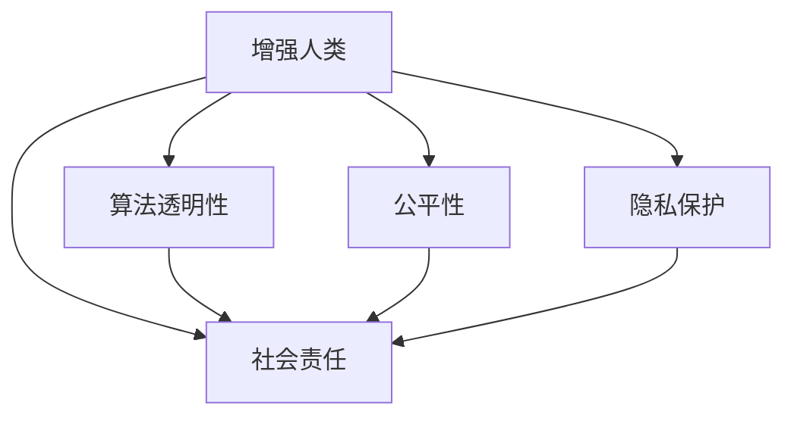

                 

# AI时代的人类增强：道德和社会的平衡

> 关键词：人工智能,增强人类,伦理道德,社会平衡,技术滥用

## 1. 背景介绍

### 1.1 问题由来

随着人工智能技术的飞速发展，AI在医疗、教育、工业等领域的应用如火如荼。AI技术正在深刻改变人类社会的方方面面，开启了一个新的“增强时代”。

### 1.2 问题核心关键点

人工智能的发展为人类带来了前所未有的助力，但同时也引发了关于道德和社会的诸多挑战：

1. **数据隐私与安全**：AI应用需要大量的数据进行训练，这引发了用户数据隐私和安全的担忧。如何保护用户隐私，确保数据使用安全，是AI应用落地的一个重大挑战。
2. **算法透明性与公平性**：AI系统的决策过程往往是“黑箱”，难以解释和理解。如何确保算法的透明性，避免算法偏见，提升算法的公平性，是AI系统设计的重要议题。
3. **伦理规范与法律监管**：AI技术在医疗、金融、司法等高风险领域的应用，亟需建立一套完善的伦理规范和法律监管框架，以保障技术的健康发展。
4. **人与AI的协作关系**：在智能交互中，如何平衡人类与AI的协作关系，既充分发挥AI的智能优势，又不使其取代人类的主体地位，成为关键问题。
5. **社会就业与职业伦理**：AI的广泛应用可能对就业市场产生重大影响，导致部分岗位的消失。如何确保AI技术的公平利用，避免加剧社会不平等，是AI社会化的重要考虑。

这些问题既是人工智能技术的潜在风险，也是社会发展的重大课题。如何在AI时代实现技术与社会的平衡，既发挥AI技术的潜力，又确保人类的尊严和权益，是本文探讨的核心。

## 2. 核心概念与联系

### 2.1 核心概念概述

为了更深刻地理解AI技术在社会中的应用，以及其可能带来的伦理和道德挑战，本文将介绍几个核心概念：

- **增强人类(Enhanced Humans)**：通过AI技术增强人类的认知、体力和能力，提升生活质量和工作效率。
- **算法透明性(Algorithmic Transparency)**：确保AI系统的决策过程可以被解释和理解，增强用户信任。
- **公平性(Fairness)**：确保AI系统在处理不同人群、不同情境时，不产生偏见，保证平等对待。
- **隐私保护(Privacy Protection)**：保护用户的数据隐私，确保数据使用符合道德和法律规范。
- **社会责任(Social Responsibility)**：AI系统应考虑到其对社会整体的影响，促进社会公平与和谐。

这些核心概念通过以下Mermaid流程图展示了相互之间的关系：



从上述流程图可以看出，增强人类的过程中，算法透明性、公平性、隐私保护和社会责任都是关键考量因素。只有在这几个方面取得平衡，AI技术才能真正为人类带来福祉。

## 3. 核心算法原理 & 具体操作步骤

### 3.1 算法原理概述

基于增强人类的AI系统，本质上是一个涉及多领域知识的复杂系统，其设计原理可以分为以下几步：

1. **数据收集与处理**：从各类传感器和交互平台中收集用户数据，并进行预处理和清洗，构建高质量的数据集。
2. **模型训练与优化**：使用深度学习等先进算法，在大规模数据集上进行模型训练，优化模型的性能。
3. **系统集成与部署**：将训练好的模型集成到应用系统中，进行功能开发和性能调优。
4. **用户体验优化**：通过用户反馈，不断迭代和优化系统的功能和界面，提升用户体验。

### 3.2 算法步骤详解

以智能医疗系统为例，其算法步骤包括：

1. **数据收集**：从医院、诊所等医疗机构收集患者的健康数据，如病历、检查结果、基因数据等。
2. **数据预处理**：对数据进行去噪、归一化、特征提取等预处理操作，确保数据质量。
3. **模型训练**：使用深度学习模型，如卷积神经网络(CNN)、循环神经网络(RNN)、变压器(Transformer)等，对数据进行训练，构建智能诊断系统。
4. **系统集成**：将训练好的模型集成到医疗系统中，实现智能诊断、个性化治疗推荐等功能。
5. **用户体验优化**：根据用户的反馈，不断优化系统的界面设计和功能实现，提升用户的使用体验。

### 3.3 算法优缺点

AI增强人类技术具有以下优点：

1. **提升效率**：通过自动化和智能化手段，大幅度提升工作效率和生产能力。
2. **降低成本**：减少人工干预和操作，降低人力成本。
3. **改善体验**：提供更加个性化、精准的服务，提升用户体验。
4. **促进创新**：通过数据驱动和算法优化，不断推动技术创新和应用创新。

但同时也存在一些缺点：

1. **数据隐私问题**：收集和使用数据时，需要确保用户隐私的安全，防止数据泄露和滥用。
2. **算法偏见**：模型训练时可能存在数据偏见，导致算法输出的不公和歧视。
3. **技术滥用**：技术被不当使用可能导致负面社会影响，如AI武器化、监控侵犯等。
4. **职业伦理**：AI技术可能取代某些岗位，导致就业问题，引发职业伦理的讨论。
5. **依赖性强**：AI系统高度依赖数据和算法，数据质量差或算法不足会导致系统失效。

### 3.4 算法应用领域

AI增强人类的技术已经在多个领域得到了广泛应用，包括：

- **医疗健康**：智能诊断、个性化治疗推荐、医疗机器人等。
- **教育培训**：智能教学、个性化学习推荐、虚拟助教等。
- **工业制造**：智能检测、自动化控制、机器人协作等。
- **商业零售**：智能客服、推荐系统、库存管理等。
- **交通运输**：智能驾驶、交通管理、路径规划等。
- **社会治理**：智能监控、公共安全、应急响应等。

## 4. 数学模型和公式 & 详细讲解 & 举例说明

### 4.1 数学模型构建

以智能医疗系统为例，其核心数学模型可以表示为：

$$ M = f(D, W) $$

其中：
- $M$ 为医疗诊断系统的输出，如疾病诊断结果。
- $D$ 为输入数据，包括患者的健康数据和医学知识库。
- $W$ 为模型参数，通过深度学习模型训练得到。

### 4.2 公式推导过程

以智能诊断系统为例，其诊断过程可以表示为：

$$ P(D_i | C_j) = \frac{P(C_j)}{P(C_j)P(D_i | C_j)} \prod_{k=1}^K P(D_{ik} | C_j) $$

其中：
- $P(D_i | C_j)$ 为条件概率，即给定疾病 $C_j$，数据 $D_i$ 出现的概率。
- $P(C_j)$ 为先验概率，即疾病 $C_j$ 发生的概率。
- $P(D_{ik} | C_j)$ 为模型输出，即特征 $D_{ik}$ 在给定疾病 $C_j$ 下的条件概率。

### 4.3 案例分析与讲解

以智能客服系统为例，其案例分析如下：

假设某智能客服系统基于深度学习模型，用于处理用户的咨询问题。系统首先通过自然语言处理(NLP)技术，对用户的咨询内容进行分析和理解，然后调用知识库和专家系统，进行问题解答和建议。

系统构建的数学模型可以表示为：

$$ P(Q_i | C_j) = \frac{P(C_j)}{P(C_j)P(Q_i | C_j)} \prod_{k=1}^K P(Q_{ik} | C_j) $$

其中：
- $P(Q_i | C_j)$ 为用户咨询内容 $Q_i$ 在给定疾病 $C_j$ 下的条件概率。
- $P(Q_{ik} | C_j)$ 为模型输出，即咨询内容 $Q_{ik}$ 在给定疾病 $C_j$ 下的条件概率。

## 5. 项目实践：代码实例和详细解释说明

### 5.1 开发环境搭建

进行智能医疗系统开发时，需要搭建以下开发环境：

1. **Python环境**：安装Python 3.x版本，推荐使用Anaconda进行环境管理。
2. **深度学习框架**：安装TensorFlow、PyTorch等深度学习框架，用于模型的训练和推理。
3. **自然语言处理库**：安装NLTK、spaCy等自然语言处理库，用于文本处理和分析。
4. **医疗数据集**：收集并整理医疗数据集，如患者病历、检查结果等。
5. **医疗知识库**：构建医疗知识库，如疾病描述、治疗方案等。

### 5.2 源代码详细实现

以智能诊断系统为例，其代码实现如下：

```python
import tensorflow as tf
import numpy as np

# 定义模型结构
class MedicalDiagnosisModel(tf.keras.Model):
    def __init__(self, input_shape):
        super(MedicalDiagnosisModel, self).__init__()
        self.dense1 = tf.keras.layers.Dense(64, activation='relu')
        self.dense2 = tf.keras.layers.Dense(10, activation='softmax')
    
    def call(self, inputs):
        x = self.dense1(inputs)
        x = self.dense2(x)
        return x

# 构建数据集
data = np.random.rand(1000, 50)  # 生成随机数据
labels = np.random.randint(0, 10, size=(1000,))  # 生成随机标签

# 构建模型并编译
model = MedicalDiagnosisModel(input_shape=(50,))
model.compile(optimizer='adam', loss='sparse_categorical_crossentropy', metrics=['accuracy'])

# 训练模型
model.fit(data, labels, epochs=10)

# 使用模型进行预测
test_data = np.random.rand(100, 50)
predictions = model.predict(test_data)
```

### 5.3 代码解读与分析

上述代码实现了基于TensorFlow的智能诊断系统。具体解读如下：

- **模型结构**：定义了一个包含两个全连接层的神经网络模型，用于处理医疗数据和输出诊断结果。
- **数据集构建**：生成了随机数据和标签，模拟医疗数据集。
- **模型编译与训练**：使用随机数据和标签训练模型，优化模型参数。
- **模型预测**：使用训练好的模型对测试数据进行预测，输出诊断结果。

## 6. 实际应用场景

### 6.1 智能医疗系统

智能医疗系统通过深度学习技术，从患者的健康数据中提取特征，自动生成诊断报告和治疗方案。其应用场景包括：

- **智能诊断**：对患者的病历、检查结果等数据进行分析，自动生成初步诊断报告。
- **个性化治疗**：根据患者的基因、病史等信息，推荐个性化的治疗方案。
- **健康监测**：通过智能穿戴设备收集患者健康数据，实时监测健康状态。

### 6.2 教育辅助系统

教育辅助系统通过自然语言处理技术，自动批改作业、提供学习建议、进行智能评估等。其应用场景包括：

- **智能批改**：对学生的作业进行自动批改，并给出详细反馈。
- **学习建议**：根据学生的学习情况，提供个性化学习建议。
- **智能评估**：对学生的学习表现进行智能评估，生成综合评估报告。

### 6.3 工业制造系统

工业制造系统通过智能检测、自动化控制、机器人协作等技术，提高生产效率和产品质量。其应用场景包括：

- **智能检测**：使用计算机视觉技术，自动检测产品缺陷。
- **自动化控制**：通过机器人手臂进行自动化操作，提高生产效率。
- **协作机器人**：与人类工人协同工作，提高生产灵活性和安全性。

## 7. 工具和资源推荐

### 7.1 学习资源推荐

1. **《人工智能伦理》课程**：斯坦福大学的公开课，探讨AI技术的伦理和社会影响。
2. **《深度学习与人工智能伦理》书籍**：介绍深度学习在伦理和社会方面的应用，引导读者思考AI技术的责任和限制。
3. **《AI伦理指南》报告**：美国AI伦理委员会发布的指南，涵盖AI技术在各个领域的应用伦理。
4. **Google AI平台**：提供丰富的AI伦理和社会影响相关资源，包括学术论文、案例分析、政策建议等。
5. **OpenAI伦理指南**：OpenAI发布的伦理指南，探讨AI技术在伦理和社会方面的挑战和应对措施。

### 7.2 开发工具推荐

1. **TensorFlow**：Google开发的深度学习框架，支持分布式计算和模型优化。
2. **PyTorch**：Facebook开发的深度学习框架，支持动态计算图和模型构建。
3. **NLTK**：Python自然语言处理库，提供文本处理和分析功能。
4. **spaCy**：Python自然语言处理库，提供高效文本处理和分析工具。
5. **TensorBoard**：TensorFlow配套的可视化工具，用于实时监控模型训练过程。

### 7.3 相关论文推荐

1. **《人工智能伦理和社会影响》论文**：探讨AI技术对社会各个方面的影响，提出相应的伦理和社会责任建议。
2. **《公平与透明：人工智能的伦理挑战》论文**：讨论AI系统的公平性和透明性，提出解决方案。
3. **《人工智能与隐私保护》论文**：探讨AI系统在数据隐私保护方面的挑战和解决方案。
4. **《AI技术的社会责任》论文**：分析AI技术在社会各个领域的应用，提出相应的社会责任建议。

## 8. 总结：未来发展趋势与挑战

### 8.1 研究成果总结

本文从AI时代人类增强的角度，探讨了AI技术的伦理和社会挑战。主要研究成果包括：

1. **算法透明性**：提出算法透明性的重要性和实现方法，探讨了如何提高AI系统的可解释性和用户信任度。
2. **公平性**：讨论了AI系统中的算法偏见问题，提出了解决方案，确保AI系统对不同人群的公平对待。
3. **隐私保护**：分析了AI系统在数据隐私保护方面的挑战，提出了相应的保护措施和法律法规建议。
4. **社会责任**：探讨了AI技术对社会各个领域的影响，提出相应的社会责任建议，确保AI技术的健康发展。

### 8.2 未来发展趋势

未来AI技术的发展趋势包括：

1. **智能化水平提升**：随着计算能力的提升和数据量的增加，AI系统的智能化水平将进一步提升，能够处理更加复杂和精细的任务。
2. **伦理和社会责任**：随着AI技术的广泛应用，其伦理和社会责任问题将受到越来越多的关注，相关的法律法规和伦理指南也将逐步完善。
3. **跨领域应用拓展**：AI技术将逐步应用于各个领域，如医疗、教育、工业、交通等，形成跨领域的智能化生态。
4. **技术融合和创新**：AI技术将与其他技术（如物联网、区块链、量子计算等）进行深度融合，形成新的技术创新和应用场景。
5. **开放和协作**：AI技术将逐渐开放和共享，促进全球范围内的技术合作和知识交流。

### 8.3 面临的挑战

尽管AI技术的发展前景广阔，但在推广应用过程中，仍面临诸多挑战：

1. **伦理和道德问题**：AI技术的滥用可能带来伦理和道德问题，如数据隐私泄露、算法偏见、技术滥用等。
2. **法律法规滞后**：现有法律法规无法完全覆盖AI技术的应用，亟需制定新的法律法规和伦理指南。
3. **数据隐私和安全**：大规模数据收集和使用可能导致隐私泄露和安全问题，需要建立严格的数据保护机制。
4. **技术普及和教育**：AI技术需要广泛普及和教育，才能被更多人接受和使用。
5. **跨领域协同**：AI技术的应用需要跨领域的协同合作，不同行业和学科之间的协作机制需要进一步建立和完善。

### 8.4 研究展望

未来的研究展望包括：

1. **伦理和社会责任研究**：深入探讨AI技术的伦理和社会责任问题，提出相应的解决方案，确保AI技术的应用符合伦理和社会价值。
2. **算法透明性和公平性研究**：研究如何提高AI系统的透明性和公平性，确保其决策过程可解释、可理解，避免偏见和歧视。
3. **数据隐私和安全研究**：探讨如何保护用户数据隐私，建立安全的数据保护机制，防止数据泄露和滥用。
4. **跨领域应用研究**：研究AI技术在不同领域的应用，推动AI技术在医疗、教育、工业等领域的落地和普及。
5. **技术融合和创新研究**：研究AI技术与其他技术（如物联网、区块链、量子计算等）的深度融合，推动新的技术创新和应用场景。

## 9. 附录：常见问题与解答

**Q1：AI技术会取代人类吗？**

A: AI技术可以在某些特定领域取代人类，如重复性劳动、数据处理等。但在需要高度人类情感和创造力的领域，如艺术、文化、社会工作等，AI技术无法完全取代人类。AI技术应作为人类的辅助工具，提升人类工作效率和生活质量。

**Q2：如何确保AI系统的公平性？**

A: 确保AI系统的公平性需要从数据、算法和输出三个层面进行控制：
1. 数据层面：确保数据集的多样性和代表性，避免数据偏见。
2. 算法层面：使用公平性优化算法，如公平损失函数、公平度量等。
3. 输出层面：对AI系统的输出进行公平性评估，避免算法偏见。

**Q3：如何保护用户数据隐私？**

A: 保护用户数据隐私需要从数据收集、存储和使用三个层面进行控制：
1. 数据收集：采用匿名化和去标识化技术，防止数据泄露。
2. 数据存储：采用加密和安全存储技术，防止数据被非法访问。
3. 数据使用：建立严格的数据使用协议，确保数据使用的合法性和透明性。

**Q4：AI技术如何融入社会治理？**

A: AI技术可以应用于社会治理的多个方面，如智能监控、公共安全、应急响应等。在应用过程中，需要确保AI技术的透明性和公平性，防止滥用和误用。同时，需要建立相应的法律法规和伦理指南，确保AI技术的应用符合社会价值和伦理规范。

---

作者：禅与计算机程序设计艺术 / Zen and the Art of Computer Programming

