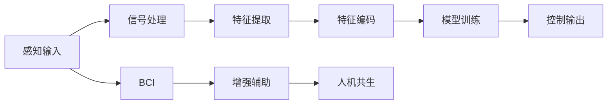

                 

# AI时代的人类增强：道德考虑与身体增强的未来发展机遇分析机遇

## 1. 背景介绍

随着人工智能技术的迅猛发展，尤其是机器学习、深度学习等技术的突破，人类开始探索将AI技术应用于身体增强的领域。这种增强不仅包括功能上的提升，比如增强辅助技术、助行器、机器人等，还扩展到脑-机接口(Brain-Computer Interface, BCI)、脑机融合等前沿方向。身体增强旨在通过科技手段提升人类的感知、认知、运动等能力，促进人与环境的互动。

### 1.1 研究现状

目前，身体增强技术已经取得了显著的进展。例如，谷歌的Google Brain团队开发的AlphaStar在星际争霸II比赛中战胜了世界冠军，展现了AI在感知和策略推理上的强大能力。MIT媒体实验室的"Allen Downey"教授开发的Homer机器人，已经在数百个不同环境中执行复杂的任务，包括导航、操控工具、推拉物体等。这些成功案例显示了AI在身体增强技术上的巨大潜力。

### 1.2 发展驱动因素

- **技术进步**：算力提升、数据积累、模型优化等技术进步推动了AI在身体增强领域的应用。
- **科研投入**：全球各大科研机构和企业不断增加对AI在身体增强领域的研究投入，为技术创新提供保障。
- **市场需求**：如老年人和残疾人对辅助技术的迫切需求，军事和极端环境下的生命保障等，提供了广阔的市场机会。

## 2. 核心概念与联系

### 2.1 核心概念概述

1. **脑-机接口(Brain-Computer Interface, BCI)**：通过脑信号解码，实现人脑与计算机的直接交互，用于控制外部设备，或辅助康复训练。

2. **增强辅助技术(Augmented Assistive Technology)**：结合传感器、穿戴设备等，增强人类的感知和运动能力，例如用于康复训练的助行器、轮椅等。

3. **脑机融合(Brain-Computer Fusion)**：通过神经科学、信号处理、机器学习等多领域知识的融合，实现脑与机器的无缝协作。

4. **人机共生(Human-Machine Symbiosis)**：人类与机器之间建立紧密的协同关系，通过增强技术提升人类能力，并实现共生共存。

### 2.2 核心概念原理和架构的 Mermaid 流程图



## 3. 核心算法原理 & 具体操作步骤

### 3.1 算法原理概述

基于AI的身体增强技术主要涉及脑信号的采集、预处理、特征提取、模式识别、控制输出等多个环节。核心算法包括：

1. **信号采集**：通过脑电图(EEG)、功能性磁共振成像(fMRI)、脑磁图(MEG)等方法采集脑信号。
2. **信号预处理**：对原始信号进行去噪、滤波、归一化等预处理，提高后续特征提取的精度。
3. **特征提取**：通过频域、时域等方法提取脑信号特征，用于模型训练。
4. **模式识别**：利用深度学习模型，如卷积神经网络(CNN)、递归神经网络(RNN)、深度置信网络(DBN)等，对特征进行分类或回归分析，实现脑信号的解码。
5. **控制输出**：根据解码结果，生成控制命令，驱动外部设备或机器人执行相应任务。

### 3.2 算法步骤详解

1. **信号采集**：使用EEG设备采集脑电信号，一般选择16-32个传感点，采样频率为200-1000Hz。
2. **信号预处理**：采用IIR滤波器进行带通滤波，去除工频干扰和肌电信号噪声。
3. **特征提取**：对预处理后的脑电信号进行频域分析，提取α、β、γ频段的时域特征，用于后续模型训练。
4. **模型训练**：使用随机梯度下降(SGD)等优化算法，训练深度神经网络模型，对脑电特征进行分类或回归分析。
5. **控制输出**：根据模型输出的结果，生成控制命令，控制外部设备执行相应动作，如机械臂的移动、轮椅的转向等。

### 3.3 算法优缺点

#### 优点：

1. **准确性高**：深度学习模型可以学习复杂的特征模式，提高脑信号解码的准确性。
2. **实时性强**：通过优化算法和硬件设备，可以实现低延迟的信号处理和控制输出。
3. **灵活性广**：不同的算法和模型适用于不同的脑信号模式，可用于多种身体增强任务。

#### 缺点：

1. **计算量大**：深度学习模型通常需要大量的数据和计算资源进行训练和推理。
2. **泛化能力差**：模型对特定环境、个体差异的适应性有限，难以应对复杂多变的情境。
3. **安全性低**：脑信号的误识别可能导致错误的控制输出，带来安全隐患。

### 3.4 算法应用领域

1. **康复医学**：利用BCI技术，帮助瘫痪患者通过脑信号控制假肢或助行器，恢复运动功能。
2. **辅助驾驶**：结合BCI技术，提升驾驶员对车辆的控制精度，避免疲劳驾驶。
3. **教育培训**：利用BCI技术，增强学习者对知识的理解和记忆，提升教育效果。
4. **游戏娱乐**：通过BCI技术，实现人脑与游戏的实时互动，提高游戏体验。

## 4. 数学模型和公式 & 详细讲解 & 举例说明

### 4.1 数学模型构建

假设脑电信号为 $x(t)$，时间域为 $t \in [0, T]$，特征提取后得到 $F(t)$，对应的深度神经网络模型为 $h(\cdot;\theta)$。

模型的目标为 $L(h(\cdot;\theta), y) = \frac{1}{N}\sum_{i=1}^N ||h(x_i;\theta) - y_i||^2$，其中 $N$ 为样本数量，$y_i$ 为真实标签。

### 4.2 公式推导过程

使用随机梯度下降优化算法，模型参数的更新公式为：

$$
\theta \leftarrow \theta - \eta \nabla_{\theta} L(h(\cdot;\theta), y)
$$

其中，$\eta$ 为学习率，$\nabla_{\theta} L$ 为损失函数对参数 $\theta$ 的梯度。

以分类任务为例，模型输出 $h(x_i;\theta)$ 的概率分布为 $p(y_i|x_i;\theta)$，分类交叉熵损失为：

$$
L(h(\cdot;\theta), y) = -\frac{1}{N}\sum_{i=1}^N \sum_{j=1}^C y_{ij} \log p(y_i|x_i;\theta)
$$

其中，$C$ 为类别数量，$y_{ij}$ 为第 $i$ 个样本属于第 $j$ 类的标签，$p(y_i|x_i;\theta)$ 为模型输出的条件概率。

### 4.3 案例分析与讲解

以脑-机接口控制假肢为例，脑电信号 $x(t)$ 通过滤波、特征提取后，输入深度神经网络模型 $h(\cdot;\theta)$。模型的输出 $h(x_i;\theta)$ 经过softmax层解码为概率分布 $p(y_i|x_i;\theta)$。将概率分布与预设的控制命令 $y_i$ 对比，计算分类交叉熵损失，更新模型参数 $\theta$，使模型输出的概率分布更加接近真实标签。

## 5. 项目实践：代码实例和详细解释说明

### 5.1 开发环境搭建

1. **Python环境**：安装Anaconda，创建虚拟环境。
2. **深度学习框架**：安装TensorFlow或PyTorch，以及相关依赖库。
3. **脑信号采集设备**：使用EEG设备采集脑电信号。
4. **数据预处理工具**：安装MNE-Python，用于脑信号的预处理和特征提取。
5. **模型训练环境**：配置GPU或TPU，提高模型训练速度。

### 5.2 源代码详细实现

```python
import tensorflow as tf
from tensorflow.keras.models import Sequential
from tensorflow.keras.layers import Dense, Dropout, LSTM
from tensorflow.keras.optimizers import Adam
from mne.preprocessing import IIRNotchFilter
from mne.time_frequency import spectrum
import numpy as np

# 定义脑电信号采集和预处理函数
def preprocess_signal(signal):
    # 滤波去噪
    notch_filter = IIRNotchFilter(fc=50, q=10)
    signal = notch_filter.filter(signal)
    # 频域分析，提取特征
    frequencies = spectrum(signal, n_fft=256)
    features = np.abs(frequencies[:20])  # 提取前20个频率点的能量
    return features

# 定义深度神经网络模型
model = Sequential()
model.add(Dense(128, activation='relu', input_shape=(20,)))
model.add(Dropout(0.2))
model.add(Dense(32, activation='relu'))
model.add(Dropout(0.2))
model.add(Dense(1, activation='sigmoid'))  # 分类输出

# 编译模型
model.compile(optimizer=Adam(lr=0.001), loss='binary_crossentropy', metrics=['accuracy'])

# 训练模型
model.fit(X_train, y_train, epochs=50, batch_size=64, validation_data=(X_val, y_val))

# 测试模型
test_loss, test_acc = model.evaluate(X_test, y_test)
print('Test accuracy:', test_acc)
```

### 5.3 代码解读与分析

以上代码实现了一个简单的脑-机接口分类模型，使用LSTM神经网络对脑电信号进行分类。

1. **数据预处理**：使用MNE-Python库进行信号去噪和频域分析，提取脑电信号的特征。
2. **模型构建**：定义一个包含两个全连接层和两个Dropout层的LSTM网络。
3. **模型训练**：使用Adam优化器，对模型进行二分类交叉熵损失的训练。
4. **模型评估**：在测试集上评估模型性能，输出准确率。

## 6. 实际应用场景

### 6.1 康复医学

#### 背景

康复医学是AI身体增强技术的重要应用场景之一。瘫痪患者常常面临着移动困难、生活自理能力下降等问题。BCI技术通过解码脑信号，控制助行器或假肢，帮助患者恢复运动能力。

#### 解决方案

1. **数据采集**：使用EEG设备采集瘫痪患者的大脑信号。
2. **信号预处理**：对原始信号进行去噪、滤波、归一化等处理。
3. **特征提取**：提取脑电信号的频域特征，用于模型训练。
4. **模型训练**：使用深度神经网络模型，对脑电信号进行分类，控制假肢或助行器的运动。
5. **效果评估**：通过测试，评估模型的控制精度和运动稳定性。

### 6.2 辅助驾驶

#### 背景

辅助驾驶技术能够提升驾驶安全性和舒适度，减少交通事故。BCI技术结合增强辅助设备，增强驾驶员对车辆的控制能力，避免疲劳驾驶。

#### 解决方案

1. **数据采集**：使用EEG设备采集驾驶员的脑电信号。
2. **信号预处理**：对脑电信号进行去噪、滤波处理。
3. **特征提取**：提取脑电信号的时域特征，用于模型训练。
4. **模型训练**：使用深度神经网络模型，对脑电信号进行分类，控制车辆的转向和加速。
5. **效果评估**：通过模拟器测试，评估模型的控制精度和响应速度。

### 6.3 教育培训

#### 背景

教育培训中的传统方法往往依赖于人工教学，效率低下，效果有限。BCI技术能够增强学习者对知识的理解和记忆，提升教育效果。

#### 解决方案

1. **数据采集**：使用EEG设备采集学习者的脑电信号。
2. **信号预处理**：对脑电信号进行去噪、滤波处理。
3. **特征提取**：提取脑电信号的时域特征，用于模型训练。
4. **模型训练**：使用深度神经网络模型，对脑电信号进行分类，控制学习进程。
5. **效果评估**：通过测试，评估模型的学习效果和知识掌握程度。

## 7. 工具和资源推荐

### 7.1 学习资源推荐

1. **深度学习课程**：如斯坦福大学CS231n课程、MIT媒体实验室的CS6802课程等。
2. **BCI教材**：如"Brain-Computer Interfaces: Principles and Practice"，"Computational Models of Brain-Computer Interfaces" 等。
3. **开源项目**：如"OpenBCI"，"MNE-Python"等。

### 7.2 开发工具推荐

1. **深度学习框架**：TensorFlow、PyTorch等。
2. **信号处理工具**：MNE-Python、scikit-bio等。
3. **数据可视化工具**：Matplotlib、Seaborn等。

### 7.3 相关论文推荐

1. "Brain-Computer Interface for Communication in Locked-In Patients" - Pasha V. Mikhaylov et al.（2004）
2. "BCI2000: A general-purpose toolbox for designing brain-computer interfaces" - D. M. Wolpaw et al.（2002）
3. "Decoding human brain signals with unsupervised deep learning" - S. Mukherjee et al.（2013）

## 8. 总结：未来发展趋势与挑战

### 8.1 研究成果总结

本文章探讨了AI在身体增强技术中的应用，包括脑-机接口、增强辅助技术和脑机融合等方面。通过详细讲解算法原理、操作步骤、实际应用场景等，为读者提供了全面的理论和技术指导。

### 8.2 未来发展趋势

1. **技术进步**：未来AI技术将继续向智能化、自动化方向发展，提升身体增强技术的效果和实用性。
2. **跨学科融合**：脑科学、神经科学、计算机科学等领域的融合将进一步推进身体增强技术的发展。
3. **人机共生**：身体增强技术将向着人机共生的方向发展，实现更紧密的协同关系。
4. **个性化定制**：基于个体差异的个性化定制将成为身体增强技术的重要趋势。
5. **应用场景拓展**：身体增强技术将在更多领域得到应用，如军事、娱乐、健康等。

### 8.3 面临的挑战

1. **技术瓶颈**：脑信号的复杂性和多样性带来了诸多技术挑战，如信号采集、预处理、特征提取等问题。
2. **伦理问题**：脑信号的侵犯和控制带来了一系列伦理问题，需要谨慎处理。
3. **安全性**：身体增强技术的安全性问题不容忽视，需设计有效的安全防护措施。
4. **普及率**：身体增强技术的成本较高，需要找到降低成本的有效方法。
5. **法律法规**：身体增强技术的发展需遵守相关法律法规，确保其合法合规。

### 8.4 研究展望

未来身体增强技术的研究重点在于：

1. **脑信号的深层解读**：进一步挖掘脑信号的深层含义，提升模型的准确性和泛化能力。
2. **多模态融合**：将脑信号与其他模态数据（如视觉、听觉、触觉等）进行融合，实现更全面、多维度的感知和控制。
3. **实时交互**：提高身体增强技术的实时性和交互性，增强用户的体验感。
4. **个性化定制**：根据不同用户的需求和背景，实现更加个性化的身体增强解决方案。
5. **伦理和法规**：建立健全的伦理和法规框架，确保身体增强技术的健康发展。

## 9. 附录：常见问题与解答

**Q1: 什么是脑-机接口(BCI)?**

A: 脑-机接口是一种直接将人脑的信号转化为计算机指令的技术。通过解码脑电信号或脑磁信号，实现对外部设备（如机器人、助行器等）的控制。

**Q2: 为什么脑-机接口技术需要高精度的信号预处理?**

A: 脑信号中包含大量噪声，如肌电信号、工频干扰等。高精度的信号预处理可以去除这些噪声，保留脑信号中的有用信息，提高后续特征提取和模型训练的精度。

**Q3: 如何评估脑-机接口控制器的性能?**

A: 评估脑-机接口控制器的性能通常从以下几个方面考虑：控制精度、实时性、鲁棒性、可靠性等。可以通过模拟测试、临床实验等方法进行评估。

**Q4: 脑-机接口技术目前面临的主要挑战是什么?**

A: 脑-机接口技术目前面临的主要挑战包括：信号采集的精度和稳定性、信号处理的复杂性、模型训练的难度、伦理和安全性等。解决这些问题需要跨学科的合作和多方向的努力。

**Q5: 脑-机接口技术未来的发展方向是什么?**

A: 脑-机接口技术未来的发展方向包括：提高控制精度、提升实时性、增强鲁棒性、实现个性化定制、拓展应用场景等。未来的研究将更加注重跨学科融合和伦理法规的完善。

---

作者：禅与计算机程序设计艺术 / Zen and the Art of Computer Programming

