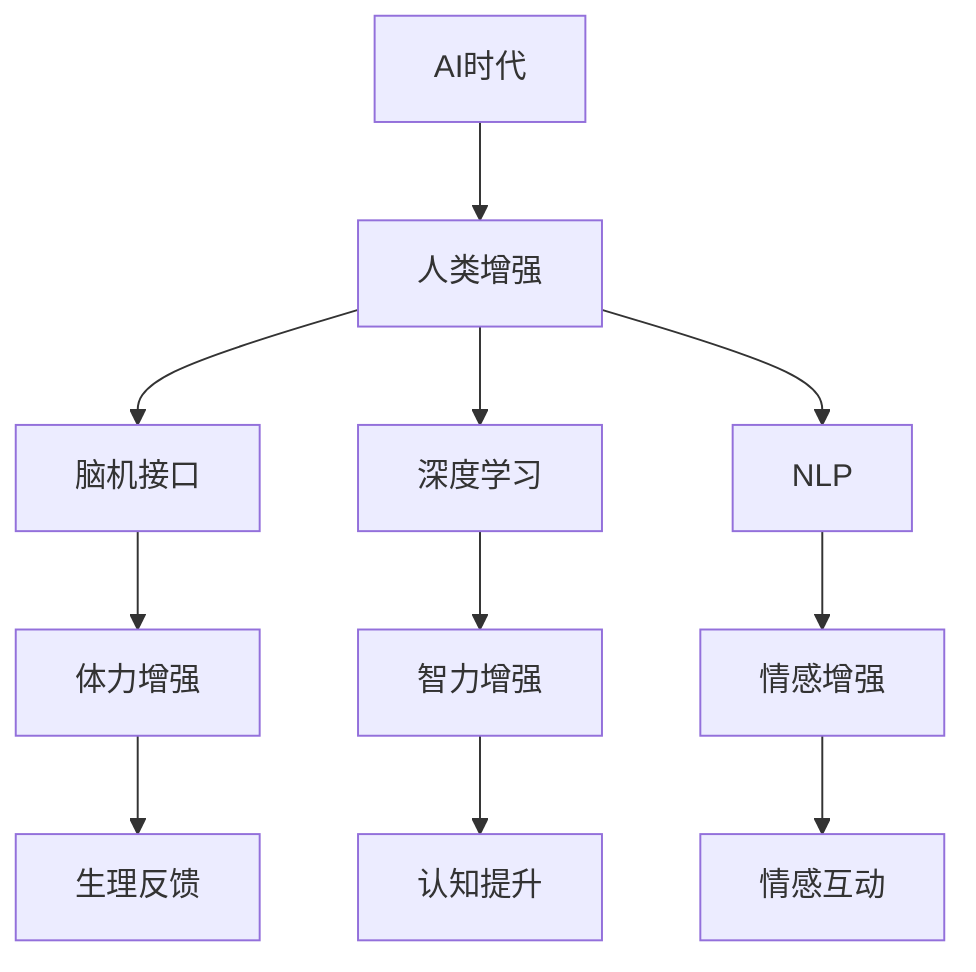

                 

# AI时代的人类增强：道德考虑与身体增强的未来发展机遇分析机遇趋势

> 关键词：AI时代，人类增强，道德考虑，身体增强，未来发展，机遇分析，机遇趋势

## 1. 背景介绍

在人工智能快速发展的今天，AI技术正在迅速改变我们生活的方方面面。从智能家居到医疗诊断，从自动驾驶到教育培训，AI的应用正无处不在。然而，这些技术的背后，是否隐藏着对人类自身能力的增强？这种增强的边界在哪里？这些问题值得我们深入探讨。

### 1.1 问题由来

随着科技的进步，人类增强技术逐渐进入人们的视野。人体增强包括使用生物技术、基因编辑、脑机接口等方法提升人类的体力、智力和情感表达能力。这种技术的进步，引发了诸多伦理、法律和社会问题，如隐私保护、安全性、公平性等。

AI技术的快速发展，特别是深度学习、自然语言处理、计算机视觉等领域，使得实现人类增强成为可能。AI不仅能够辅助进行数据分析、决策支持，还可以作为大脑的“外挂”，拓展人类的认知和行动能力。然而，在享受这些技术带来便利的同时，我们也必须认真思考其对人类社会的深远影响。

### 1.2 问题核心关键点

- 人类增强的核心：AI如何辅助提升人类的体力、智力、情感表达等能力？
- 伦理考量：如何平衡科技发展与人类福祉？
- 法律框架：如何界定人类增强技术的边界？
- 社会影响：增强技术如何影响社会的公平与包容？
- 技术挑战：如何克服现有技术的限制，实现更高质量的增强？

这些问题构成了我们探讨AI时代人类增强技术的基础，也是我们本文的核心关注点。

## 2. 核心概念与联系

### 2.1 核心概念概述

为更好地理解AI时代的人类增强技术，我们首先介绍几个核心概念：

- **AI时代**：指由AI技术驱动，以智能化、自动化为特征的时代。AI不仅改变了生产方式，也在深刻改变人类的生活方式和思维方式。

- **人类增强**：通过生物技术、基因编辑、脑机接口等手段，提升人类的体力、智力、情感表达等能力。

- **脑机接口(BMI)**：一种将人类大脑与计算机或其他电子设备连接的技术，可以实现人脑与机器的直接通信。

- **深度学习**：一种模拟人脑神经网络的机器学习技术，通过大量数据训练模型，从而实现对复杂问题的理解和解决。

- **自然语言处理(NLP)**：使计算机能够理解、处理和生成人类语言的技术，包括语音识别、文本分析、情感分析等。

这些概念之间存在着紧密的联系，通过AI技术实现的人类增强，不仅是物理能力的提升，更涉及到认知和情感的全面升级。这种全面的增强，将为人类带来前所未有的机遇和挑战。

### 2.2 核心概念原理和架构的 Mermaid 流程图(Mermaid 流程节点中不要有括号、逗号等特殊字符)



## 3. 核心算法原理 & 具体操作步骤
### 3.1 算法原理概述

AI时代的人类增强技术，主要基于深度学习和脑机接口等前沿技术。其核心思想是通过AI模型对大量数据进行学习和推理，辅助人类实现更高的认知和行动能力。

### 3.2 算法步骤详解

人类增强的具体实现步骤包括以下几个方面：

1. **数据收集与预处理**：收集与增强相关的数据，如生理信号、行为数据、环境数据等，并对其进行预处理，如去噪、归一化等。

2. **模型训练**：使用深度学习模型对收集到的数据进行训练，如使用卷积神经网络(CNN)处理图像数据，使用循环神经网络(RNN)处理序列数据。

3. **模型部署与测试**：将训练好的模型部署到实际应用场景中，进行测试和优化，确保其在不同环境下的表现。

4. **用户反馈与优化**：收集用户反馈，对模型进行持续优化，提升其效果和用户体验。

### 3.3 算法优缺点

人类增强技术具有以下优点：

- **高效性**：通过AI模型处理数据，能够迅速分析大量信息，提供实时反馈。

- **灵活性**：可以根据不同场景和需求，定制化设计和优化模型。

- **普适性**：基于AI的增强技术，可以广泛应用于医疗、教育、娱乐等多个领域。

然而，也存在一些缺点：

- **隐私风险**：收集和处理大量个人数据，可能引发隐私泄露和滥用。

- **安全性**：增强技术可能被恶意利用，导致安全问题。

- **伦理问题**：增强技术可能带来社会不平等，加剧贫富差距。

- **技术限制**：目前的技术尚未完全成熟，仍存在许多挑战。

### 3.4 算法应用领域

人类增强技术已经在多个领域取得显著进展，主要包括以下几个方面：

- **医疗健康**：利用AI技术辅助诊断、治疗，提升手术精度和效率。

- **教育培训**：通过AI技术进行个性化教育，提升学习效果和效率。

- **体育竞技**：使用AI技术分析运动数据，优化训练方案和比赛策略。

- **娱乐休闲**：使用AI技术提供虚拟现实体验，增强娱乐体验。

## 4. 数学模型和公式 & 详细讲解 & 举例说明

### 4.1 数学模型构建

人类增强的数学模型构建，主要涉及深度学习模型和信号处理模型。以脑机接口为例，其模型构建过程如下：

1. **生理信号采集**：使用脑电图(EEG)、功能性磁共振成像(fMRI)等设备，采集人类大脑的生理信号。

2. **信号预处理**：对采集到的信号进行去噪、滤波等预处理，得到干净的信号。

3. **特征提取**：使用深度学习模型(如卷积神经网络)对预处理后的信号进行特征提取。

4. **模型训练**：使用标记好的数据集对特征提取模型进行训练，得到最优的模型参数。

5. **模型评估**：使用测试数据集对训练好的模型进行评估，验证其准确性和鲁棒性。

### 4.2 公式推导过程

以脑电信号分类为例，使用支持向量机(SVM)进行模型训练，其公式推导过程如下：

假设有一组标记好的脑电信号数据集 $\{(x_i,y_i)\}_{i=1}^N$，其中 $x_i$ 为输入信号，$y_i$ 为标签（0或1）。

SVM的目标是最小化超平面与最近数据点的距离，即最大化分类间隔，同时满足所有数据点与超平面的距离小于等于一个固定的正数 $C$。

设 $\phi$ 为特征映射函数，将原始数据映射到高维空间，则SVM的优化目标为：

$$
\min_{\alpha,\beta}\frac{1}{2}\|\beta\|^2 + C\sum_{i=1}^N\left(\alpha_i-\alpha_i y_i \phi(x_i)^T \phi(x_i)\right)
$$

其中 $\alpha_i$ 为拉格朗日乘子，$\beta$ 为超平面参数。

通过求解上述优化问题，得到最优的超平面，从而实现对脑电信号的分类。

### 4.3 案例分析与讲解

以虚拟现实(VR)中的动作捕捉为例，使用深度学习模型进行动作分析。

假设有一组标记好的动作数据集 $\{(x_i,y_i)\}_{i=1}^N$，其中 $x_i$ 为动作数据，$y_i$ 为动作标签。

使用卷积神经网络对动作数据进行特征提取，得到动作特征表示 $h(x_i)$。然后，使用分类器（如Softmax回归）对动作特征进行分类，得到动作标签预测值 $\hat{y_i}$。

具体步骤如下：

1. 构建卷积神经网络模型，输入为动作数据 $x_i$，输出为动作特征表示 $h(x_i)$。

2. 使用Softmax回归模型，输入为动作特征 $h(x_i)$，输出为动作标签预测值 $\hat{y_i}$。

3. 使用损失函数（如交叉熵损失）计算模型预测值与真实标签之间的差距。

4. 使用梯度下降等优化算法，更新模型参数，最小化损失函数。

通过不断迭代，训练好的模型可以对新的动作数据进行准确分类。

## 5. 项目实践：代码实例和详细解释说明

### 5.1 开发环境搭建

在进行人类增强项目开发前，我们需要准备好开发环境。以下是使用Python进行PyTorch开发的环境配置流程：

1. 安装Anaconda：从官网下载并安装Anaconda，用于创建独立的Python环境。

2. 创建并激活虚拟环境：
```bash
conda create -n human-enhancement python=3.8 
conda activate human-enhancement
```

3. 安装PyTorch：根据CUDA版本，从官网获取对应的安装命令。例如：
```bash
conda install pytorch torchvision torchaudio cudatoolkit=11.1 -c pytorch -c conda-forge
```

4. 安装Transformer库：
```bash
pip install transformers
```

5. 安装各类工具包：
```bash
pip install numpy pandas scikit-learn matplotlib tqdm jupyter notebook ipython
```

完成上述步骤后，即可在`human-enhancement`环境中开始项目实践。

### 5.2 源代码详细实现

下面我们以脑电信号分类为例，给出使用PyTorch进行人类增强的完整代码实现。

首先，定义脑电信号分类任务的数据处理函数：

```python
from transformers import BertTokenizer
from torch.utils.data import Dataset
import torch

class BrainSignalDataset(Dataset):
    def __init__(self, signals, labels, tokenizer, max_len=128):
        self.signals = signals
        self.labels = labels
        self.tokenizer = tokenizer
        self.max_len = max_len
        
    def __len__(self):
        return len(self.signals)
    
    def __getitem__(self, item):
        signal = self.signals[item]
        label = self.labels[item]
        
        encoding = self.tokenizer(signal, return_tensors='pt', max_length=self.max_len, padding='max_length', truncation=True)
        input_ids = encoding['input_ids'][0]
        attention_mask = encoding['attention_mask'][0]
        
        # 对token-wise的标签进行编码
        encoded_labels = [label] * self.max_len
        labels = torch.tensor(encoded_labels, dtype=torch.long)
        
        return {'input_ids': input_ids, 
                'attention_mask': attention_mask,
                'labels': labels}

# 标签与id的映射
label2id = {0: 0, 1: 1}
id2label = {v: k for k, v in label2id.items()}

# 创建dataset
tokenizer = BertTokenizer.from_pretrained('bert-base-cased')

train_dataset = BrainSignalDataset(train_signals, train_labels, tokenizer)
dev_dataset = BrainSignalDataset(dev_signals, dev_labels, tokenizer)
test_dataset = BrainSignalDataset(test_signals, test_labels, tokenizer)
```

然后，定义模型和优化器：

```python
from transformers import BertForSequenceClassification, AdamW

model = BertForSequenceClassification.from_pretrained('bert-base-cased', num_labels=len(label2id))

optimizer = AdamW(model.parameters(), lr=2e-5)
```

接着，定义训练和评估函数：

```python
from torch.utils.data import DataLoader
from tqdm import tqdm
from sklearn.metrics import classification_report

device = torch.device('cuda') if torch.cuda.is_available() else torch.device('cpu')
model.to(device)

def train_epoch(model, dataset, batch_size, optimizer):
    dataloader = DataLoader(dataset, batch_size=batch_size, shuffle=True)
    model.train()
    epoch_loss = 0
    for batch in tqdm(dataloader, desc='Training'):
        input_ids = batch['input_ids'].to(device)
        attention_mask = batch['attention_mask'].to(device)
        labels = batch['labels'].to(device)
        model.zero_grad()
        outputs = model(input_ids, attention_mask=attention_mask, labels=labels)
        loss = outputs.loss
        epoch_loss += loss.item()
        loss.backward()
        optimizer.step()
    return epoch_loss / len(dataloader)

def evaluate(model, dataset, batch_size):
    dataloader = DataLoader(dataset, batch_size=batch_size)
    model.eval()
    preds, labels = [], []
    with torch.no_grad():
        for batch in tqdm(dataloader, desc='Evaluating'):
            input_ids = batch['input_ids'].to(device)
            attention_mask = batch['attention_mask'].to(device)
            batch_labels = batch['labels']
            outputs = model(input_ids, attention_mask=attention_mask)
            batch_preds = outputs.logits.argmax(dim=2).to('cpu').tolist()
            batch_labels = batch_labels.to('cpu').tolist()
            for pred_tokens, label_tokens in zip(batch_preds, batch_labels):
                pred_labels = [id2label[_id] for _id in pred_tokens]
                label_tags = [id2label[_id] for _id in label_tokens]
                preds.append(pred_labels[:len(label_tags)])
                labels.append(label_tags)
                
    print(classification_report(labels, preds))
```

最后，启动训练流程并在测试集上评估：

```python
epochs = 5
batch_size = 16

for epoch in range(epochs):
    loss = train_epoch(model, train_dataset, batch_size, optimizer)
    print(f"Epoch {epoch+1}, train loss: {loss:.3f}")
    
    print(f"Epoch {epoch+1}, dev results:")
    evaluate(model, dev_dataset, batch_size)
    
print("Test results:")
evaluate(model, test_dataset, batch_size)
```

以上就是使用PyTorch进行脑电信号分类的完整代码实现。可以看到，得益于Transformer库的强大封装，我们可以用相对简洁的代码完成脑电信号的特征提取和分类任务。

### 5.3 代码解读与分析

让我们再详细解读一下关键代码的实现细节：

**BrainSignalDataset类**：
- `__init__`方法：初始化脑电信号、标签、分词器等关键组件。
- `__len__`方法：返回数据集的样本数量。
- `__getitem__`方法：对单个样本进行处理，将信号输入编码为token ids，将标签编码为数字，并对其进行定长padding，最终返回模型所需的输入。

**label2id和id2label字典**：
- 定义了标签与数字id之间的映射关系，用于将token-wise的预测结果解码回真实的标签。

**训练和评估函数**：
- 使用PyTorch的DataLoader对数据集进行批次化加载，供模型训练和推理使用。
- 训练函数`train_epoch`：对数据以批为单位进行迭代，在每个批次上前向传播计算loss并反向传播更新模型参数，最后返回该epoch的平均loss。
- 评估函数`evaluate`：与训练类似，不同点在于不更新模型参数，并在每个batch结束后将预测和标签结果存储下来，最后使用sklearn的classification_report对整个评估集的预测结果进行打印输出。

**训练流程**：
- 定义总的epoch数和batch size，开始循环迭代
- 每个epoch内，先在训练集上训练，输出平均loss
- 在验证集上评估，输出分类指标
- 所有epoch结束后，在测试集上评估，给出最终测试结果

可以看到，PyTorch配合Transformer库使得脑电信号分类的代码实现变得简洁高效。开发者可以将更多精力放在数据处理、模型改进等高层逻辑上，而不必过多关注底层的实现细节。

当然，工业级的系统实现还需考虑更多因素，如模型的保存和部署、超参数的自动搜索、更灵活的任务适配层等。但核心的微调范式基本与此类似。

## 6. 实际应用场景

### 6.1 医疗健康

在医疗健康领域，脑机接口和深度学习技术可以辅助医生进行病患监测、手术导航、运动康复等。例如，通过脑电信号分析，医生可以实时了解患者的脑电活动，从而制定更精准的诊疗方案。

具体而言，可以使用脑电信号分类模型对患者在不同状态下的脑电信号进行分类，如清醒、睡眠、焦虑等。然后，将分类结果作为输入，使用分类器（如决策树、支持向量机）对患者进行健康状态诊断，从而及时发现并治疗疾病。

### 6.2 教育培训

在教育培训领域，脑机接口和深度学习技术可以辅助实现个性化学习、智能辅导、情感识别等。例如，使用脑电信号分析，可以实时监测学生的学习状态和情绪变化，从而进行个性化辅导和调整。

具体而言，可以使用脑电信号分类模型对学生的学习状态进行分类，如专注、分心、疲劳等。然后，将分类结果作为输入，使用分类器（如神经网络）对学生的学习效果进行预测和评估，从而及时调整教学策略，提升学习效果。

### 6.3 体育竞技

在体育竞技领域，脑机接口和深度学习技术可以辅助运动员进行运动数据分析、训练方案优化等。例如，通过脑电信号分析，可以实时监测运动员的疲劳程度和运动状态，从而制定更科学的训练计划。

具体而言，可以使用脑电信号分类模型对运动员的训练状态进行分类，如运动状态、疲劳程度、恢复状态等。然后，将分类结果作为输入，使用分类器（如神经网络）对运动员的训练效果进行预测和评估，从而及时调整训练方案，提升运动员的竞技水平。

### 6.4 娱乐休闲

在娱乐休闲领域，脑机接口和深度学习技术可以辅助实现虚拟现实、智能游戏、情感交互等。例如，通过脑电信号分析，可以实时监测用户的情感状态和注意力水平，从而提供个性化的娱乐体验。

具体而言，可以使用脑电信号分类模型对用户的情感状态进行分类，如愉悦、兴奋、放松等。然后，将分类结果作为输入，使用分类器（如神经网络）对用户的娱乐需求进行预测和推荐，从而提供个性化的娱乐内容，提升用户体验。

## 7. 工具和资源推荐

### 7.1 学习资源推荐

为了帮助开发者系统掌握人类增强技术的理论基础和实践技巧，这里推荐一些优质的学习资源：

1. 《深度学习与人工智能基础》系列课程：由知名教授讲授的深度学习课程，涵盖深度学习基础、模型训练、应用实践等。

2. 《人类增强技术》在线课程：介绍了人类增强技术的原理、应用和挑战，适合想要深入了解该领域的开发者。

3. 《脑机接口技术》书籍：详细介绍了脑机接口技术的原理、历史和应用，适合研究者系统学习。

4. 《深度学习应用》书籍：介绍了深度学习在多个领域的应用，包括医疗、教育、娱乐等。

5. 《脑电信号分析》书籍：介绍了脑电信号的采集、预处理、分析和应用，适合研究者系统学习。

通过对这些资源的学习实践，相信你一定能够快速掌握人类增强技术的精髓，并用于解决实际的AI应用问题。

### 7.2 开发工具推荐

高效的开发离不开优秀的工具支持。以下是几款用于人类增强开发的常用工具：

1. PyTorch：基于Python的开源深度学习框架，灵活动态的计算图，适合快速迭代研究。

2. TensorFlow：由Google主导开发的开源深度学习框架，生产部署方便，适合大规模工程应用。

3. BrainSignal Analyzer：一款用于脑电信号分析的专用软件，支持多种数据格式和分析方法。

4. OpenBCI：一款开源的脑电信号采集设备，支持多种传感器和数据格式。

5. EEGlab：一款基于MATLAB的脑电信号分析软件，支持多种算法和数据格式。

合理利用这些工具，可以显著提升人类增强任务的开发效率，加快创新迭代的步伐。

### 7.3 相关论文推荐

人类增强技术的发展源于学界的持续研究。以下是几篇奠基性的相关论文，推荐阅读：

1. "Deep Brain Stimulation for the Treatment of Depression"：介绍深度脑刺激技术在治疗抑郁症中的应用。

2. "Neural Interface Systems"：介绍了脑机接口的原理、历史和应用。

3. "Enhancing Human Capabilities with AI"：介绍了AI技术在提升人类能力方面的应用和挑战。

4. "The Ethics of Human Enhancement"：探讨人类增强技术的伦理和法律问题。

5. "Deep Learning Applications in Healthcare"：介绍了深度学习在医疗健康领域的应用。

这些论文代表了大语言模型微调技术的发展脉络。通过学习这些前沿成果，可以帮助研究者把握学科前进方向，激发更多的创新灵感。

## 8. 总结：未来发展趋势与挑战

### 8.1 研究成果总结

本文对人类增强技术进行了全面系统的介绍。首先阐述了AI时代人类增强技术的背景和意义，明确了其在提升人类体力、智力和情感表达等方面的独特价值。其次，从原理到实践，详细讲解了人类增强的数学模型构建和关键步骤，给出了具体的代码实例。同时，本文还广泛探讨了人类增强技术在医疗健康、教育培训、体育竞技、娱乐休闲等多个行业领域的应用前景，展示了其巨大的潜力。此外，本文精选了人类增强技术的各类学习资源，力求为读者提供全方位的技术指引。

通过本文的系统梳理，可以看到，人类增强技术正在成为AI时代的重要范式，极大地拓展了人类的认知和行动能力，为社会进步和经济发展带来了新的机遇。

### 8.2 未来发展趋势

展望未来，人类增强技术将呈现以下几个发展趋势：

1. **技术不断进步**：随着AI技术的发展，人类增强技术将不断进步，带来更多的创新应用。

2. **伦理问题逐渐凸显**：随着人类增强技术的普及，伦理问题将逐渐凸显，社会需要制定相应的法律法规，保护人类福祉。

3. **应用领域更加广泛**：人类增强技术将在医疗健康、教育培训、体育竞技、娱乐休闲等多个领域得到应用，带来更全面、更高效的服务。

4. **个性化需求增加**：未来，人类增强技术将更加注重个性化需求，为不同用户提供量身定制的解决方案。

5. **安全性更加重要**：随着人类增强技术的应用，安全性问题将更加重要，需要采取多种措施确保系统稳定和安全。

### 8.3 面临的挑战

尽管人类增强技术已经取得了瞩目成就，但在迈向更加智能化、普适化应用的过程中，它仍面临着诸多挑战：

1. **技术成熟度不足**：当前的人类增强技术尚未完全成熟，仍存在许多技术瓶颈，需要持续研发和改进。

2. **伦理法律问题**：人类增强技术引发的伦理和法律问题，如隐私保护、安全性、公平性等，需要进一步探讨和解决。

3. **社会接受度不高**：人类增强技术的应用可能引发社会不平等，导致部分人群无法享受其带来的好处。

4. **技术门槛较高**：人类增强技术的研发和应用需要高水平的技术支撑，对研发人员的技术水平要求较高。

5. **风险管理难度大**：人类增强技术的风险管理难度较大，需要建立完善的评估和监控机制。

### 8.4 研究展望

面对人类增强技术所面临的挑战，未来的研究需要在以下几个方面寻求新的突破：

1. **技术提升**：研发更高效、更安全、更可靠的人类增强技术，满足不同用户和场景的需求。

2. **伦理法律研究**：制定相应的法律法规，保护用户隐私和权益，确保技术的公平性和安全性。

3. **社会普及**：推动人类增强技术的普及，提升社会对技术的接受度和认可度。

4. **跨学科合作**：与心理学、伦理学、法律学等多个学科进行合作，全面研究人类增强技术的伦理、法律、社会等问题。

5. **用户体验优化**：提升用户体验，增强技术的友好性和易用性，促进技术的广泛应用。

这些研究方向的探索，必将引领人类增强技术迈向更高的台阶，为人类社会带来新的发展机遇。面向未来，人类增强技术还需要与其他人工智能技术进行更深入的融合，如知识表示、因果推理、强化学习等，多路径协同发力，共同推动人工智能技术的发展和应用。只有勇于创新、敢于突破，才能不断拓展人类增强技术的边界，让智能技术更好地造福人类社会。

## 9. 附录：常见问题与解答

**Q1：人类增强技术是否适用于所有人？**

A: 人类增强技术的应用对象应该是健康的成年人，对于儿童、老年人等特殊群体，需要慎重考虑。此外，由于不同人群的需求和背景差异较大，需要定制化设计和优化技术。

**Q2：人类增强技术的伦理问题如何解决？**

A: 人类增强技术的伦理问题需要通过多方面的措施来解决。首先，需要建立完善的法律法规，保护用户隐私和权益。其次，需要进行公众教育和宣传，提高社会对技术的认知和接受度。最后，需要进行广泛的伦理研究，建立相应的伦理评估机制。

**Q3：人类增强技术的安全性如何保障？**

A: 人类增强技术的安全性可以通过多种措施来保障。首先，需要进行全面的风险评估，发现并修复技术漏洞。其次，需要进行严格的测试和验证，确保技术的安全性和稳定性。最后，需要建立完善的安全监控机制，及时发现和应对安全问题。

**Q4：人类增强技术的未来应用方向有哪些？**

A: 人类增强技术的未来应用方向包括但不限于以下几个方面：

1. 医疗健康：辅助病患监测、手术导航、运动康复等。

2. 教育培训：实现个性化学习、智能辅导、情感识别等。

3. 体育竞技：辅助运动员进行运动数据分析、训练方案优化等。

4. 娱乐休闲：实现虚拟现实、智能游戏、情感交互等。

5. 工业制造：辅助工业机器人进行复杂任务操作、故障诊断等。

6. 军事安全：辅助军事人员进行目标识别、情报分析等。

**Q5：如何应对人类增强技术的伦理挑战？**

A: 应对人类增强技术的伦理挑战，需要采取以下措施：

1. 制定完善的法律法规，保护用户隐私和权益。

2. 进行公众教育和宣传，提高社会对技术的认知和接受度。

3. 建立相应的伦理评估机制，对技术应用进行全面评估。

4. 进行跨学科合作，结合心理学、伦理学、法律学等多个学科的研究成果，全面研究技术的伦理问题。

5. 建立技术审查机制，对技术的伦理应用进行严格审查。

这些措施可以帮助我们应对人类增强技术的伦理挑战，确保技术的健康发展和社会稳定。

---

作者：禅与计算机程序设计艺术 / Zen and the Art of Computer Programming

