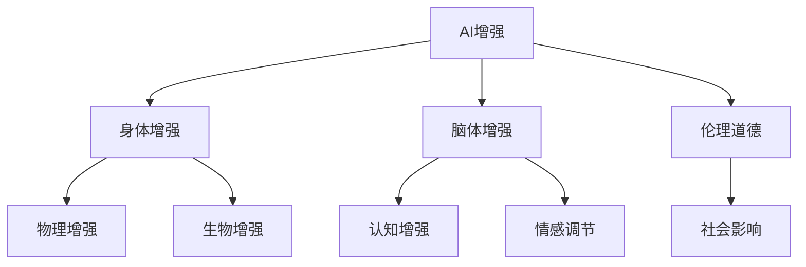

                 

# AI时代的人类增强：道德考虑与身体增强的未来发展机遇挑战趋势

> 关键词：AI增强, 人体增强, 道德问题, 技术发展, 未来展望, 挑战

## 1. 背景介绍

### 1.1 问题由来

随着人工智能（AI）技术的迅猛发展，人类社会正步入一个全新的智能时代。AI不仅在工业、农业、医疗、教育等传统领域发挥着重要作用，更逐步拓展到人类自身的增强领域，通过身体增强和脑体增强技术，为人类带来前所未有的生活和工作方式变革。

然而，这些技术的快速发展和广泛应用，也引发了一系列复杂的伦理道德问题和社会挑战。如何在享受AI带来便利的同时，兼顾技术应用的伦理和社会影响，成为当下亟待解决的重要课题。

### 1.2 问题核心关键点

人体增强技术的核心在于通过AI和生物工程等手段，提升人类身体和认知能力。主要包括：

1. **物理增强**：如肌肉强化、关节保护、视力增强等。
2. **脑体增强**：如脑机接口（BCI）、认知增强、情感调节等。
3. **非侵入式增强**：如智能义肢、增强现实（AR）眼镜、脑波控制汽车等。

这些技术的发展带来了巨大的机遇，同时也伴随着技术风险和伦理道德的挑战。如何在科技进步和伦理道德之间找到平衡点，确保技术的可持续发展，是一个复杂的系统工程。

## 2. 核心概念与联系

### 2.1 核心概念概述

为了更好地理解人体增强技术的伦理和社会影响，本节将介绍几个关键概念：

- **AI增强（AI Augmentation）**：利用AI技术提升人类能力的过程，包括但不限于自动化、智能化、优化化等。
- **人体增强（Human Enhancement）**：通过物理、生物、心理等手段，提升人类生理、心理和认知能力的过程。
- **脑体增强（Cognitive Enhancement）**：指通过AI和生物技术提升人类认知功能，如记忆力、注意力、学习能力等。
- **伦理道德（Ethics & Morality）**：在人体增强应用中，涉及的一系列道德原则和社会价值观，如公平、正义、隐私、自主等。
- **社会影响（Social Impact）**：技术应用对社会结构、文化、经济等方面的深远影响，如就业、贫富差距、健康等。

这些概念之间存在复杂的相互作用关系。AI增强技术的发展，带来了人类增强的可能性，同时也引发了一系列伦理道德和社会问题。本文将围绕这些核心概念，探讨AI时代人体增强技术的发展机遇与挑战。

### 2.2 核心概念原理和架构的 Mermaid 流程图



这个流程图展示了AI增强、身体增强、脑体增强、伦理道德和社会影响之间的联系。AI增强技术为身体增强和脑体增强提供了可能，而伦理道德和社会影响则是这些技术应用中必须考虑的重要因素。

## 3. 核心算法原理 & 具体操作步骤

### 3.1 算法原理概述

人体增强技术涉及多种AI算法和工程方法，其核心在于通过数据收集、模型训练、设备集成等步骤，实现对人类生理和认知能力的提升。主要算法包括：

1. **机器学习**：通过训练模型，预测和优化人类行为和生理状态。
2. **深度学习**：利用神经网络模型，识别和提取复杂模式，进行高精度预测。
3. **强化学习**：通过试错和反馈机制，优化行为策略，提升任务执行效率。
4. **计算机视觉**：利用图像处理技术，捕捉和分析人体动态信息，如步态分析、表情识别等。
5. **自然语言处理**：通过文本分析，理解人类语言和情感，提供个性化反馈。

这些算法和技术在实践中通常需要相互结合，形成一个复杂的系统架构。例如，在脑体增强中，可能会结合脑电波采集、神经网络解码、认知行为分析等技术，实现对人类认知能力的增强。

### 3.2 算法步骤详解

以下是一个典型的脑体增强系统开发流程：

1. **数据收集**：通过可穿戴设备、脑电波采集仪、摄像头等工具，收集大量的生理数据和行为数据。数据来源包括健康研究机构、运动实验室、医院等。

2. **预处理**：对收集到的数据进行清洗、归一化、特征提取等预处理步骤，确保数据质量和可用性。

3. **模型训练**：使用机器学习和深度学习技术，训练预测模型，实现对人类行为和生理状态的预测。

4. **设备集成**：将训练好的模型集成到可穿戴设备或医疗设备中，实现实时监测和反馈。

5. **用户交互**：通过用户界面或语音交互，收集用户反馈，进一步优化模型和设备。

6. **系统验证**：在实际应用场景中，验证系统的有效性和可靠性，收集更多用户数据进行迭代优化。

### 3.3 算法优缺点

人体增强技术的算法具有以下优点：

1. **高精度预测**：通过深度学习和强化学习等技术，可以实现高精度的行为预测和优化。
2. **实时反馈**：利用计算机视觉和自然语言处理技术，实现对用户行为的实时监测和反馈。
3. **个性化定制**：通过收集用户数据，提供个性化定制服务，满足不同用户的需求。

同时，这些技术也存在以下缺点：

1. **隐私风险**：大量数据的收集和分析可能涉及隐私问题，需要严格的数据保护措施。
2. **技术风险**：设备集成和数据处理可能存在技术问题，影响系统稳定性和安全性。
3. **伦理争议**：技术的应用可能引发伦理道德争议，如公平性、自主性、隐私权等。

### 3.4 算法应用领域

人体增强技术在多个领域具有广泛的应用前景，例如：

1. **健康医疗**：通过脑体增强技术，提升患者认知和运动能力，帮助康复训练。
2. **运动训练**：利用物理增强技术，优化运动姿势和训练方案，提高运动表现。
3. **教育培训**：通过认知增强技术，提升学生的注意力和学习能力，提供个性化教育。
4. **智能交通**：通过脑波控制技术，实现自动驾驶汽车和智能交通系统。
5. **娱乐休闲**：通过虚拟现实（VR）和增强现实（AR）技术，提供沉浸式娱乐体验。

## 4. 数学模型和公式 & 详细讲解 & 举例说明

### 4.1 数学模型构建

以脑体增强中常见的认知增强为例，可以构建如下数学模型：

设 $x_t$ 为时间 $t$ 的用户行为数据，$\theta$ 为认知增强模型的参数。认知增强模型的预测公式为：

$$
\hat{x}_{t+1} = f(x_t, \theta)
$$

其中，$f$ 为认知增强模型的映射函数，可以是深度神经网络。

### 4.2 公式推导过程

以一个简单的LSTM模型为例，进行推导：

设 $x_t$ 为时间 $t$ 的输入，$h_t$ 为时间 $t$ 的隐藏状态，$c_t$ 为时间 $t$ 的细胞状态。LSTM模型的更新公式为：

$$
h_{t+1} = \tanh(W_h h_t + U_x x_t + b_h)
$$
$$
i_t = \sigma(W_i h_t + U_x x_t + b_i)
$$
$$
f_t = \sigma(W_f h_t + U_x x_t + b_f)
$$
$$
o_t = \sigma(W_o h_t + U_x x_t + b_o)
$$
$$
c_{t+1} = f_t \odot c_t + i_t \odot \tanh(h_{t+1})
$$
$$
h_{t+1} = o_t \odot \tanh(c_{t+1})
$$

其中，$\tanh$ 为双曲正切函数，$\sigma$ 为Sigmoid函数，$\odot$ 为点乘运算。

### 4.3 案例分析与讲解

以一个简单的脑波分类任务为例，进行详细讲解：

1. **数据准备**：收集30名健康志愿者的脑电波数据，分为训练集和测试集。

2. **预处理**：对脑电波数据进行去噪、归一化、特征提取等预处理步骤。

3. **模型训练**：使用LSTM模型进行训练，输入为脑电波数据，输出为分类标签。训练过程中，通过交叉熵损失函数进行优化。

4. **模型评估**：在测试集上评估模型的准确率和召回率。

5. **结果分析**：分析模型在不同分类上的表现，优化模型结构，提高预测精度。

## 5. 项目实践：代码实例和详细解释说明

### 5.1 开发环境搭建

在进行人体增强技术开发前，需要准备好开发环境。以下是使用Python进行TensorFlow开发的环境配置流程：

1. 安装Anaconda：从官网下载并安装Anaconda，用于创建独立的Python环境。

2. 创建并激活虚拟环境：
```bash
conda create -n tf-env python=3.8 
conda activate tf-env
```

3. 安装TensorFlow：根据CUDA版本，从官网获取对应的安装命令。例如：
```bash
conda install tensorflow -c tensorflow -c conda-forge
```

4. 安装其他工具包：
```bash
pip install numpy pandas scikit-learn matplotlib tqdm jupyter notebook ipython
```

完成上述步骤后，即可在`tf-env`环境中开始开发实践。

### 5.2 源代码详细实现

以下是一个简单的脑波分类任务的TensorFlow代码实现：

```python
import tensorflow as tf
from tensorflow.keras import layers

# 定义LSTM模型
class LSTMClassifier(tf.keras.Model):
    def __init__(self, input_dim, output_dim):
        super(LSTMClassifier, self).__init__()
        self.lstm = layers.LSTM(64, return_sequences=True)
        self.dense = layers.Dense(output_dim, activation='softmax')
        
    def call(self, inputs, training=False):
        x = self.lstm(inputs)
        logits = self.dense(x)
        return logits

# 加载脑电波数据
# ...

# 构建模型
model = LSTMClassifier(input_dim=1024, output_dim=3)

# 编译模型
model.compile(optimizer='adam',
              loss='categorical_crossentropy',
              metrics=['accuracy'])

# 训练模型
# ...

# 评估模型
# ...
```

### 5.3 代码解读与分析

让我们再详细解读一下关键代码的实现细节：

**LSTMClassifier类**：
- `__init__`方法：初始化LSTM层和全连接层。
- `call`方法：定义模型的前向传播过程。

**模型加载和编译**：
- 使用TensorFlow的Keras API构建LSTM分类模型。
- 定义输入维度和输出维度，并进行编译，设置优化器和损失函数。

**训练和评估**：
- 使用Keras的fit方法训练模型。
- 使用evaluate方法在测试集上评估模型性能。

## 6. 实际应用场景

### 6.4 未来应用展望

人体增强技术在多个领域具有广阔的应用前景，以下是一些典型的应用场景：

1. **健康医疗**：通过脑体增强技术，帮助中风患者恢复语言和运动功能，改善生活质量。
2. **运动训练**：利用物理增强技术，提升运动员的体力和技能，提高运动成绩。
3. **教育培训**：通过认知增强技术，提升学生的学习能力和注意力，提供个性化教育。
4. **智能交通**：通过脑波控制技术，实现自动驾驶汽车和智能交通系统，提高交通安全性。
5. **娱乐休闲**：通过虚拟现实（VR）和增强现实（AR）技术，提供沉浸式娱乐体验，推动文化产业创新。

## 7. 工具和资源推荐

### 7.1 学习资源推荐

为了帮助开发者系统掌握人体增强技术的理论基础和实践技巧，这里推荐一些优质的学习资源：

1. **《人类增强：技术、伦理与社会》（Human Enhancement: Technology, Ethics, and Society）**：探讨人体增强技术的伦理和社会影响，提供丰富的案例分析。
2. **《AI增强：从理论到实践》（AI Augmentation: From Theory to Practice）**：介绍AI增强技术的基本概念和实践方法，涵盖多个应用领域。
3. **Coursera《人工智能与伦理》（AI & Ethics）**：斯坦福大学开设的伦理课程，涵盖人工智能伦理的多个方面，包括人体增强技术的伦理问题。
4. **IEEE《增强现实与虚拟现实》（AR & VR）**：提供AR和VR技术的最新研究进展和应用案例，探讨其伦理和安全性问题。
5. **DeepMind《深度学习》（Deep Learning）**：提供深度学习技术的全面介绍，涵盖从算法原理到实际应用的多方面内容。

通过这些资源的学习实践，相信你一定能够系统掌握人体增强技术的理论基础和实践技巧，为技术的可持续发展贡献力量。

### 7.2 开发工具推荐

高效的开发离不开优秀的工具支持。以下是几款用于人体增强技术开发的工具：

1. **TensorFlow**：由Google主导开发的开源深度学习框架，支持分布式训练，适合大规模工程应用。
2. **PyTorch**：Facebook开发的开源深度学习框架，灵活的动态计算图，适合快速迭代研究。
3. **MATLAB**：Simulink和MATLAB的结合，提供强大的仿真和控制工具，适用于脑机接口等研究。
4. **Brainstorm**：提供脑电波采集和分析的完整工具链，适用于脑体增强技术的研究。
5. **OpenBCI**：开源的脑电波采集设备，易于搭建和维护，适合小型研究团队使用。

合理利用这些工具，可以显著提升人体增强技术的开发效率，加快创新迭代的步伐。

### 7.3 相关论文推荐

人体增强技术的发展源于学界的持续研究。以下是几篇奠基性的相关论文，推荐阅读：

1. **《增强现实的现状与未来》（The State of Augmented Reality）**：提供AR技术的现状和未来发展趋势，探讨其伦理和安全性问题。
2. **《脑波控制：技术、伦理与社会》（Brain-Computer Interfaces: Technology, Ethics, and Society）**：探讨BCI技术的基本原理、应用案例和伦理问题。
3. **《AI增强的伦理与法律挑战》（The Ethical and Legal Challenges of AI Enhancement）**：探讨AI增强技术的伦理和法律问题，提出应对策略。
4. **《认知增强：技术、伦理与社会》（Cognitive Enhancement: Technology, Ethics, and Society）**：探讨认知增强技术的基本原理、应用案例和伦理问题。
5. **《智能义肢：技术、伦理与社会》（Smart Prosthetics: Technology, Ethics, and Society）**：探讨智能义肢技术的基本原理、应用案例和伦理问题。

这些论文代表了大语言模型微调技术的发展脉络。通过学习这些前沿成果，可以帮助研究者把握学科前进方向，激发更多的创新灵感。

## 8. 总结：未来发展趋势与挑战

### 8.1 研究成果总结

本文对基于监督学习的人体增强技术进行了全面系统的介绍。首先阐述了人体增强技术的伦理和社会影响，明确了AI增强技术在人体增强中的重要作用。其次，从原理到实践，详细讲解了认知增强模型的构建和训练过程，给出了TensorFlow代码实现。同时，本文还广泛探讨了人体增强技术在多个领域的应用前景，展示了技术的巨大潜力。

通过本文的系统梳理，可以看到，人体增强技术正在成为AI时代的重要应用方向，为人类带来了前所未有的发展机遇。AI增强技术的应用，可以极大提升人类的生理和认知能力，推动社会的全面进步。

### 8.2 未来发展趋势

展望未来，人体增强技术将呈现以下几个发展趋势：

1. **技术进步**：随着AI和生物工程技术的不断进步，人体增强技术将更加高效、可靠，能够实现更多功能的增强。
2. **伦理规范**：随着技术应用的普及，伦理规范将逐步完善，确保技术应用的公平、公正、透明。
3. **多学科融合**：人体增强技术将与更多学科领域进行交叉融合，如神经科学、心理学、伦理学等，推动技术的全面发展。
4. **国际合作**：各国将加强合作，制定统一的伦理标准和法规，推动技术的国际标准化。
5. **社会接受度**：随着技术的普及，社会接受度将逐步提高，推动技术的广泛应用。

以上趋势凸显了人体增强技术的广阔前景。这些方向的探索发展，必将进一步推动技术的可持续发展，为构建安全、可靠、可解释、可控的智能系统铺平道路。

### 8.3 面临的挑战

尽管人体增强技术已经取得了一定的进展，但在迈向更加智能化、普适化应用的过程中，仍面临诸多挑战：

1. **技术瓶颈**：现有技术仍存在一些瓶颈，如精度、稳定性和安全性问题。需要通过不断创新，克服技术难题。
2. **伦理争议**：人体增强技术的应用可能引发伦理争议，如自主性、隐私权等。需要通过伦理研究，确保技术的可持续发展。
3. **社会接受度**：技术应用需要社会的广泛接受和支持，需要不断进行宣传和教育。
4. **法律法规**：现有法律法规可能滞后于技术发展，需要通过立法和政策引导，推动技术规范应用。
5. **公平性**：技术应用可能带来新的社会不平等，需要通过政策调整，确保技术的公平性。

面对这些挑战，需要在技术、伦理、社会等多个层面进行全面考量，才能实现技术的健康发展。

### 8.4 研究展望

未来的人体增强技术研究，需要在以下几个方面寻求新的突破：

1. **多模态融合**：将不同模态的数据和技术进行整合，提升增强效果。
2. **个性化定制**：开发更加智能的算法，提供个性化的增强服务，满足不同用户需求。
3. **伦理道德**：加强伦理研究，确保技术的公平、公正、透明。
4. **安全保障**：提高技术的安全性，防范潜在风险。
5. **法律法规**：制定统一的伦理和法律规范，推动技术的规范化应用。

这些研究方向将推动人体增强技术的可持续发展，为构建更加智能、公正、安全的未来社会贡献力量。

## 9. 附录：常见问题与解答

**Q1：AI增强技术是否可以应用于所有领域？**

A: AI增强技术在多个领域具有广泛的应用前景，但并非适用于所有领域。需要考虑技术可行性、伦理道德和社会影响等因素。例如，在医疗领域，AI增强技术可以帮助康复训练和疾病预测，但在教育领域，AI增强技术的适用性需要进一步研究。

**Q2：AI增强技术是否会引发新的伦理问题？**

A: AI增强技术的应用可能会引发新的伦理问题，如公平性、自主性、隐私权等。例如，在教育领域，AI增强技术可能导致教育资源的分配不均，引发新的社会不平等。因此，需要加强伦理研究，确保技术的公平、公正、透明。

**Q3：AI增强技术是否会带来技术风险？**

A: AI增强技术的应用可能会带来技术风险，如精度不足、数据泄露等。例如，在脑体增强中，脑电波采集和分析的精度可能受环境因素影响，需要加强技术研究和优化。因此，需要确保技术的安全性和可靠性。

**Q4：AI增强技术是否会带来社会影响？**

A: AI增强技术的应用可能会带来社会影响，如就业、贫富差距等。例如，在医疗领域，AI增强技术可能导致部分医疗工作者失业。因此，需要加强政策引导，确保技术的公平性和社会接受度。

**Q5：AI增强技术是否会带来法律风险？**

A: AI增强技术的应用可能会带来法律风险，如隐私权、知情同意等。例如，在脑体增强中，脑电波采集和分析可能涉及隐私问题。因此，需要加强法律法规建设，确保技术的合法性和合规性。

---

作者：禅与计算机程序设计艺术 / Zen and the Art of Computer Programming

