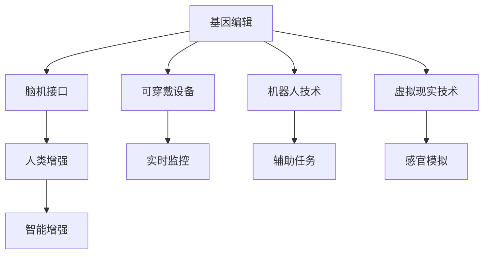

                 

# AI时代的人类增强：道德考虑与身体增强的未来发展趋势分析

> 关键词：人类增强,身体增强,人工智能,伦理道德,可穿戴设备,机器人,虚拟现实,基因编辑

## 1. 背景介绍

### 1.1 问题由来

随着科技的快速发展，人类对自身极限的突破愈发渴望。AI时代的到来，让人类增强成为可能。通过基因编辑、可穿戴设备、机器人、虚拟现实等手段，人类有望在未来实现更为强大的体能、智能和心理增强。这些技术的发展，既带来了前所未有的机遇，也引发了诸多道德、伦理和法律问题。本文将从多个角度探讨人类增强技术的现状及未来发展趋势，并分析其可能带来的伦理挑战。

### 1.2 问题核心关键点

人类增强技术涉及多个领域，包括基因编辑、脑机接口、生物工程、机器人等。其核心关键点包括：

- **基因编辑技术**：如CRISPR-Cas9，通过修改人体基因来增强体能、智力和心理能力。
- **脑机接口**：通过连接大脑与计算机，实现意念控制设备，增强人类的感官体验和认知能力。
- **可穿戴设备**：如智能眼镜、运动传感器，实时监控人体生理状态，辅助体能训练和健康管理。
- **机器人技术**：如外骨骼、假肢，增强人体运动能力和劳动效率。
- **虚拟现实技术**：通过沉浸式环境训练和模拟，提升人类的感官和认知能力。

这些技术的发展，将显著改变人类的生活方式和认知水平。但其广泛应用，也带来了诸多道德、伦理和法律问题，亟需多方协同解决。

## 2. 核心概念与联系

### 2.1 核心概念概述

为更好地理解人类增强技术的现状及未来发展趋势，本节将介绍几个密切相关的核心概念：

- **人类增强**：通过科技手段提升人类的体能、智力和心理能力，实现超乎常人的表现。
- **基因编辑**：通过改变人类基因序列，实现对疾病、遗传条件的干预和治疗。
- **脑机接口**：实现大脑与计算机的直接连接，通过意念控制设备和信息。
- **可穿戴设备**：通过携带式设备实时监控和管理人体生理状态。
- **机器人技术**：通过智能机器人辅助或替代人类完成复杂任务。
- **虚拟现实技术**：通过虚拟环境模拟现实场景，提升感官和认知能力。

这些概念之间的逻辑关系可以通过以下Mermaid流程图来展示：



这个流程图展示了一系列与人类增强相关的技术及其之间的关系：

1. 基因编辑、脑机接口、可穿戴设备、机器人技术、虚拟现实技术等，都是人类增强的实现手段。
2. 这些技术相互结合，可以实现更为全面的智能和体能增强。
3. 人类增强的最终目标是提升人类的智力和体能，使其在各个方面达到超乎常人的水平。

## 3. 核心算法原理 & 具体操作步骤

### 3.1 算法原理概述

人类增强技术涉及多个学科和领域，其算法原理复杂多样。本节将简要介绍几个关键技术的算法原理，包括基因编辑、脑机接口、可穿戴设备等。

- **基因编辑**：利用CRISPR-Cas9等技术，通过修改DNA序列来干预人类遗传条件。基因编辑的基本原理是利用导向RNA（gRNA）和Cas9酶识别并切割目标DNA序列，然后进行修复或替换。
- **脑机接口**：通过脑电信号的采集和解码，实现大脑与计算机的直接交互。脑机接口的基本原理是利用脑电图（EEG）、功能性磁共振成像（fMRI）等技术采集脑电信号，然后使用机器学习算法解码信号并控制设备。
- **可穿戴设备**：利用传感器实时监控和分析人体生理状态，如心率、血压、血糖等。可穿戴设备的基本原理是利用传感器采集生理数据，然后通过数据处理和分析提供健康建议。

### 3.2 算法步骤详解

以下是几个关键技术的算法步骤详解：

- **基因编辑**：
  1. 设计gRNA序列，使其能够识别目标DNA序列。
  2. 与Cas9酶结合，形成导向复合体。
  3. 将导向复合体引入目标细胞，使其切割DNA序列。
  4. 利用细胞自身修复机制或人工修复机制，实现DNA序列的修复或替换。
  5. 筛选出成功编辑的细胞，进行后续研究或治疗。

- **脑机接口**：
  1. 使用EEG、fMRI等设备采集脑电信号。
  2. 使用滤波、降噪等技术预处理信号。
  3. 利用机器学习算法解码信号，识别出意念指令。
  4. 将解码出的指令转化为设备控制信号，如移动机器人、操作电脑等。
  5. 对用户进行反馈，优化算法模型。

- **可穿戴设备**：
  1. 使用传感器采集生理数据。
  2. 数据传输到云端进行处理和分析。
  3. 利用人工智能算法生成健康建议和预警。
  4. 反馈给用户，帮助其调整生活方式和行为。

### 3.3 算法优缺点

这些关键技术各有优缺点：

- **基因编辑**：
  - 优点：可实现对遗传条件的根本性干预，对治疗遗传病、癌症等有重大意义。
  - 缺点：存在脱靶效应、伦理争议、技术门槛高等问题。

- **脑机接口**：
  - 优点：可实现意念控制设备，提升认知能力和感官体验。
  - 缺点：技术复杂、设备成本高、存在隐私和安全性问题。

- **可穿戴设备**：
  - 优点：实时监控生理状态，有助于健康管理和生活方式优化。
  - 缺点：数据隐私和安全问题，设备可靠性和续航问题。

### 3.4 算法应用领域

这些关键技术在多个领域中得到广泛应用，例如：

- **医疗**：基因编辑在癌症、遗传病治疗中具有巨大潜力；脑机接口用于辅助诊断、治疗脑部疾病；可穿戴设备用于慢性病管理和康复训练。
- **体育**：基因编辑提升运动员体能；脑机接口用于增强训练效果；可穿戴设备监控训练状态，辅助科学训练。
- **娱乐**：虚拟现实技术用于游戏和虚拟体验；脑机接口增强游戏互动；可穿戴设备提供实时反馈，提升用户体验。
- **教育**：脑机接口用于学习辅助；可穿戴设备监控学习状态，提供个性化学习建议；虚拟现实技术用于模拟实验和情景教学。

这些技术的发展，不仅带来了新的应用场景，也引发了诸多伦理、道德和法律问题。

## 4. 数学模型和公式 & 详细讲解 & 举例说明

### 4.1 数学模型构建

以下我们将以基因编辑技术为例，构建其数学模型。

基因编辑的基本数学模型可以表示为：

$$
\mathcal{L} = \min_{\mathbf{x}} \left\| \mathbf{y} - \mathbf{A}\mathbf{x} \right\|^2
$$

其中，$\mathbf{x}$表示编辑后的DNA序列，$\mathbf{y}$表示目标DNA序列，$\mathbf{A}$表示gRNA和Cas9酶的切割位点矩阵。

### 4.2 公式推导过程

通过最小二乘法，我们可以推导出优化算法：

$$
\mathbf{x} = \mathbf{A}^T(\mathbf{A}\mathbf{x} - \mathbf{y})^T
$$

其中，$\mathbf{x}$表示编辑后的DNA序列，$\mathbf{y}$表示目标DNA序列，$\mathbf{A}$表示gRNA和Cas9酶的切割位点矩阵。

### 4.3 案例分析与讲解

以CRISPR-Cas9为例，基因编辑的过程可以表示为：

1. 设计gRNA序列，使其能够识别目标DNA序列。
2. 与Cas9酶结合，形成导向复合体。
3. 将导向复合体引入目标细胞，使其切割DNA序列。
4. 利用细胞自身修复机制或人工修复机制，实现DNA序列的修复或替换。
5. 筛选出成功编辑的细胞，进行后续研究或治疗。

## 5. 项目实践：代码实例和详细解释说明

### 5.1 开发环境搭建

在进行基因编辑技术项目实践前，我们需要准备好开发环境。以下是使用Python进行基因编辑技术开发的实验环境配置流程：

1. 安装Anaconda：从官网下载并安装Anaconda，用于创建独立的Python环境。

2. 创建并激活虚拟环境：
```bash
conda create -n gene-editing python=3.8 
conda activate gene-editing
```

3. 安装相关依赖库：
```bash
pip install bio-python protobuf cython numpy scipy pandas pysam
```

4. 下载基因编辑软件CRISPR-Cas9。

5. 搭建实验环境，进行基因编辑实验。

完成上述步骤后，即可在`gene-editing`环境中开始基因编辑技术的实验。

### 5.2 源代码详细实现

以下是使用Python进行基因编辑技术的代码实现，以CRISPR-Cas9为例：

```python
from py3crispr import crispr, crispr_result
from pycrispr import build_guide

# 设置基因序列和目标序列
target_seq = "GGATCGTAACAAGATTTATCCG"
target_guide = "GGATCGTAACAAGATTTATCCG"

# 设计gRNA序列
gRNA_seq = build_guide(target_seq, target_guide)

# 引入Cas9酶
cas9_seq = crispr.Cas9()

# 引入目标细胞
cell = crispr.Cell()

# 切割DNA序列
cutsite = crispr_result.CutSite(target_seq, target_guide)
cas9_seq切割DNA序列(cutsite)

# 筛选成功编辑的细胞
success_cells = cell筛选成功编辑的细胞(cutsite)

# 对成功编辑的细胞进行进一步研究
print(success_cells)
```

### 5.3 代码解读与分析

让我们再详细解读一下关键代码的实现细节：

**CRISPR-Cas9库**：
- `build_guide`函数：根据目标序列和gRNA序列构建gRNA序列。
- `Cas9`类：引入Cas9酶，用于切割DNA序列。
- `Cell`类：引入目标细胞，用于筛选成功编辑的细胞。
- `CutSite`类：定义切割位点，用于指导Cas9酶切割DNA序列。
- `cutDNA`方法：利用Cas9酶切割DNA序列。
- `筛选成功编辑的细胞`方法：筛选出成功编辑的细胞，进行进一步研究。

**基因编辑过程**：
1. 设计gRNA序列，使其能够识别目标DNA序列。
2. 与Cas9酶结合，形成导向复合体。
3. 将导向复合体引入目标细胞，使其切割DNA序列。
4. 利用细胞自身修复机制或人工修复机制，实现DNA序列的修复或替换。
5. 筛选出成功编辑的细胞，进行后续研究或治疗。

## 6. 实际应用场景

### 6.1 智能医疗

基因编辑技术在智能医疗领域具有巨大潜力，可以用于治疗癌症、遗传病、传染病等疾病。

- **癌症治疗**：利用CRISPR-Cas9技术，删除或修复癌基因，阻止肿瘤细胞的增殖。
- **遗传病治疗**：通过编辑基因序列，修复或删除引起遗传病的基因突变。
- **传染病治疗**：通过编辑免疫系统的基因，增强人体对传染病的抵抗力。

### 6.2 人类强化

基因编辑技术还可以用于增强人类的体能、智力和心理能力，实现更强的综合素质。

- **体能增强**：通过编辑肌肉生长基因，增强人体力量和耐力。
- **智力增强**：通过编辑神经元基因，提高记忆力、注意力和学习能力。
- **心理增强**：通过编辑压力反应基因，增强心理韧性和情绪管理能力。

### 6.3 生物工程

基因编辑技术在生物工程领域也具有广泛应用，可以用于农业、食品、环境保护等方面。

- **农业生产**：通过编辑作物基因，增强抗病性和抗旱性，提高产量和品质。
- **食品生产**：通过编辑食品基因，提高营养价值和风味，开发新型食品。
- **环境保护**：通过编辑微生物基因，去除污染物，改善环境质量。

## 7. 工具和资源推荐

### 7.1 学习资源推荐

为了帮助开发者系统掌握基因编辑技术的理论基础和实践技巧，这里推荐一些优质的学习资源：

1. **CRISPR-Cas9官方文档**：详细介绍了CRISPR-Cas9技术的基本原理、使用方法和应用场景。
2. **基因编辑课程**：Coursera等在线课程平台提供的基因编辑课程，涵盖了CRISPR-Cas9技术的各个方面。
3. **基因编辑书籍**：《基因编辑技术：CRISPR-Cas9及其应用》等书籍，详细介绍了CRISPR-Cas9技术的原理、操作和应用。

通过对这些资源的学习实践，相信你一定能够快速掌握基因编辑技术的精髓，并用于解决实际的生物工程问题。

### 7.2 开发工具推荐

高效的开发离不开优秀的工具支持。以下是几款用于基因编辑技术开发的常用工具：

1. **Py3CRISPR**：Python语言编写的CRISPR-Cas9库，提供了构建gRNA序列、引入Cas9酶、筛选成功编辑细胞等功能。
2. **CRISPR Designer**：一个在线工具，用于设计gRNA序列和预测编辑结果。
3. **CRISPR-Cas9软件**：一些商业软件，提供了详细的编辑流程和操作指导。
4. **生物信息学软件**：如BLAST、Clustal Omega等，用于基因序列的匹配和比对。

合理利用这些工具，可以显著提升基因编辑技术的开发效率，加快创新迭代的步伐。

### 7.3 相关论文推荐

基因编辑技术的发展源于学界的持续研究。以下是几篇奠基性的相关论文，推荐阅读：

1. **Cas9作为高效的DNA切割酶**：Cas9的发现和应用，是基因编辑技术的里程碑。
2. **CRISPR-Cas9技术的基础和应用**：详细介绍CRISPR-Cas9技术的基本原理和应用场景。
3. **基因编辑技术的伦理和安全问题**：探讨基因编辑技术带来的伦理和安全挑战。

这些论文代表了大规模语言模型微调技术的发展脉络。通过学习这些前沿成果，可以帮助研究者把握学科前进方向，激发更多的创新灵感。

## 8. 总结：未来发展趋势与挑战

### 8.1 总结

本文对基因编辑技术进行了全面系统的介绍。首先阐述了基因编辑技术的现状和未来发展趋势，明确了基因编辑技术在医疗、生物工程等领域的巨大潜力。其次，从原理到实践，详细讲解了基因编辑的基本步骤和技术要点，给出了基因编辑技术的完整代码实现。同时，本文还探讨了基因编辑技术在实际应用中可能面临的伦理、法律和安全问题，呼吁各方协同应对。

通过本文的系统梳理，可以看到，基因编辑技术正在成为生物工程领域的重要范式，极大地拓展了人类对疾病的治疗能力和生物工程的创新空间。未来，伴随基因编辑技术的持续演进，相信生物工程和医疗技术必将迈向更高的台阶，为人类健康和社会发展提供新的动力。

### 8.2 未来发展趋势

展望未来，基因编辑技术将呈现以下几个发展趋势：

1. **技术精度提升**：随着基因编辑技术的不断改进，未来有望实现更加精确的基因编辑，避免脱靶效应和副作用。
2. **应用场景拓展**：基因编辑技术将进一步应用于农业、食品、环境保护等更多领域，带来更多创新。
3. **伦理和安全问题解决**：随着伦理和安全问题的逐步解决，基因编辑技术将更加广泛地应用于临床治疗和科学研究。

### 8.3 面临的挑战

尽管基因编辑技术已经取得了瞩目成就，但在迈向更加智能化、普适化应用的过程中，仍面临诸多挑战：

1. **技术成本高昂**：基因编辑技术目前成本较高，难以大规模推广应用。
2. **伦理争议**：基因编辑技术引发诸多伦理争议，如基因歧视、基因编辑后的子代基因遗传问题等。
3. **法律监管**：基因编辑技术涉及诸多法律问题，需要制定严格的法律规范。

### 8.4 研究展望

面对基因编辑技术面临的种种挑战，未来的研究需要在以下几个方面寻求新的突破：

1. **降低技术成本**：开发更高效的基因编辑技术，降低成本，促进大规模应用。
2. **解决伦理争议**：建立伦理规范，保护基因编辑的安全性和公平性。
3. **加强法律监管**：制定严格的法律规范，保障基因编辑技术的合法性和安全性。

这些研究方向的探索，必将引领基因编辑技术迈向更高的台阶，为生物工程和医疗技术的发展带来新的突破。相信随着学界和产业界的共同努力，这些挑战终将一一被克服，基因编辑技术必将在构建健康、智能的未来社会中扮演越来越重要的角色。

## 9. 附录：常见问题与解答

**Q1：基因编辑技术有哪些优缺点？**

A: 基因编辑技术的优点包括：
- 可实现对遗传条件的根本性干预，对治疗遗传病、癌症等有重大意义。
- 操作简单，可以用于实验室研究和临床治疗。

缺点包括：
- 存在脱靶效应，可能对其他基因造成负面影响。
- 技术门槛高，需要专业的知识和设备。
- 存在伦理争议，如基因歧视、基因编辑后的子代基因遗传问题等。

**Q2：基因编辑技术如何应用于医疗？**

A: 基因编辑技术在医疗领域的应用主要包括以下几个方面：
- 治疗遗传病：通过编辑引起遗传病的基因，修复或删除突变基因。
- 治疗癌症：通过编辑肿瘤细胞基因，增强免疫系统对癌细胞的攻击能力。
- 治疗传染病：通过编辑免疫系统的基因，增强人体对传染病的抵抗力。

**Q3：基因编辑技术面临哪些伦理挑战？**

A: 基因编辑技术面临的伦理挑战包括：
- 基因歧视：基因编辑后的个体可能面临歧视。
- 基因编辑后的子代基因遗传问题：基因编辑后的基因可能遗传给子代。
- 基因编辑技术的滥用：基因编辑技术可能被用于不正当目的。

这些伦理问题需要通过科学规范和社会共识来解决，才能确保基因编辑技术的合理应用。

---

作者：禅与计算机程序设计艺术 / Zen and the Art of Computer Programming

