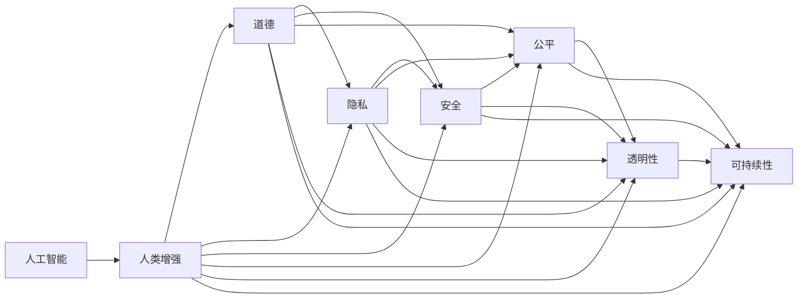

                 

# AI时代的人类增强：道德、隐私和安全的平衡

> 关键词：人工智能,人类增强,道德,隐私,安全,公平,透明,可持续

## 1. 背景介绍

### 1.1 问题由来
随着人工智能（AI）技术的飞速发展，尤其是深度学习、大数据和云计算技术的突破，AI已开始深刻影响社会的各个方面。从自动驾驶、智慧医疗、智能制造，到金融科技、教育培训，人工智能正在极大地提升人类的生产效率和生活质量。然而，随着AI应用的广泛深入，一系列道德、隐私和安全性问题也逐渐浮出水面，亟需全社会共同应对和解决。

人工智能技术的飞速发展带来了巨大的变革力量，但其应用过程中出现的伦理问题、隐私侵犯和安全隐患也引发了广泛关注。如何在确保人工智能技术带来正向效应的同时，兼顾道德、隐私和安全的平衡，成为当前人工智能领域的一个热点问题。本文将围绕这一主题，全面系统地探讨AI时代人类增强的道德、隐私和安全的平衡问题。

### 1.2 问题核心关键点
AI时代人类增强涉及的核心问题包括但不限于以下几个方面：

- **道德问题**：如何确保AI在决策和行动中遵循社会公认的伦理准则，避免损害人类尊严和价值。
- **隐私问题**：在AI系统的设计和使用过程中，如何保护个人隐私，避免数据滥用和泄露。
- **安全问题**：如何防止AI系统被恶意攻击或操控，保障系统的稳定性和安全性。
- **公平性问题**：AI系统在处理不同人群时，如何保证公平性，避免算法偏见和歧视。
- **透明性问题**：AI系统的决策过程如何向用户透明，确保用户能够理解并信任AI系统的行为。
- **可持续性问题**：AI技术如何实现可持续发展，避免资源浪费和环境破坏。

这些问题交织在一起，共同构成了AI时代人类增强的核心挑战。本文将从这些关键问题出发，深入分析其原理和应对策略，为AI技术的负责任应用提供参考。

### 1.3 问题研究意义
探讨AI时代人类增强的道德、隐私和安全的平衡问题，具有重要意义：

- **促进技术健康发展**：确保AI技术在发展过程中遵循伦理准则，避免技术滥用和负面影响。
- **保障个体权利**：保护用户隐私，避免数据泄露和滥用，保障用户的个人信息安全。
- **提升社会信任**：通过透明、公平、安全的AI系统，提升公众对AI技术的信任度，推动AI技术的广泛应用。
- **推动可持续发展**：确保AI技术在发展过程中兼顾资源和环境，实现可持续发展。

## 2. 核心概念与联系

### 2.1 核心概念概述

在探讨AI时代人类增强的道德、隐私和安全的平衡问题时，需要明确以下核心概念：

- **人工智能（AI）**：一种通过模拟人类智能，实现问题求解、决策制定和自主学习的技术。
- **人类增强（Human Augmentation）**：通过人工智能技术提升人类的认知能力、身体能力和社交能力。
- **道德（Ethics）**：指导人类行为和决策的道德原则和规范，用于评估和指导人工智能系统的行为准则。
- **隐私（Privacy）**：保护个人数据不被未授权访问和使用，维护个人信息的安全和自主权。
- **安全（Security）**：确保人工智能系统在运行过程中不受恶意攻击和操控，保障系统的稳定性和安全性。
- **公平（Fairness）**：确保AI系统在处理不同人群时，不会产生歧视和偏见，实现平等对待。
- **透明性（Transparency）**：AI系统在决策过程中，应向用户解释其行为依据，增强用户信任。
- **可持续性（Sustainability）**：确保AI技术在资源和环境上的可持续使用，避免对自然和社会造成负面影响。

这些概念相互关联，共同构成了AI时代人类增强的基本框架。理解这些概念，有助于更好地把握AI技术应用的伦理边界和价值取向。

### 2.2 核心概念原理和架构的 Mermaid 流程图

以下是Mermaid流程图，展示了AI时代人类增强的道德、隐私和安全的平衡关系：



该图展示了AI技术在提升人类能力的同时，需考虑的道德、隐私、安全和公平等多重因素，以及这些因素之间的相互作用。

## 3. 核心算法原理 & 具体操作步骤

### 3.1 算法原理概述

在AI时代人类增强的背景下，道德、隐私和安全的平衡问题主要通过以下几个关键算法和原理进行解决：

- **道德算法**：通过构建符合社会伦理准则的AI决策模型，确保AI系统的行为符合道德规范。
- **隐私保护算法**：采用差分隐私、同态加密等技术，保护个人数据的隐私性。
- **安全防护算法**：使用对抗训练、模型鲁棒性提升等方法，保障AI系统的安全性。
- **公平算法**：通过引入对抗性样本、公平性约束等技术，减少AI系统的偏见和歧视。
- **透明性算法**：通过可解释AI、模型可视化等技术，增强AI系统的透明性。
- **可持续性算法**：采用资源优化、环境监测等技术，实现AI技术的可持续发展。

这些算法和原理共同构建了AI时代人类增强的道德、隐私和安全的平衡框架，为AI技术的负责任应用提供了技术支撑。

### 3.2 算法步骤详解

以下是AI时代人类增强的道德、隐私和安全的平衡步骤详解：

**Step 1: 确定伦理准则和目标**

- 制定符合社会价值观和伦理准则的AI行为规范。
- 明确AI系统的应用目标和边界，避免过度应用带来的负面影响。

**Step 2: 设计隐私保护机制**

- 采用差分隐私技术，通过添加噪声或限制数据访问权限，保护个人隐私。
- 使用同态加密等技术，在不泄露原始数据的前提下，确保数据的安全性。

**Step 3: 构建安全防护体系**

- 引入对抗训练技术，提高AI系统的鲁棒性和安全性。
- 使用模型鲁棒性提升算法，减少模型被攻击的风险。

**Step 4: 实现公平性保障**

- 引入对抗性样本，减少AI系统在处理不同人群时的偏见和歧视。
- 引入公平性约束，确保AI系统在决策过程中对所有人群公平对待。

**Step 5: 增强系统透明性**

- 采用可解释AI技术，解释AI系统的决策依据。
- 使用模型可视化方法，展示AI系统的内部工作机制。

**Step 6: 实现可持续发展**

- 采用资源优化算法，减少AI系统运行对资源的需求。
- 引入环境监测机制，评估AI系统的环境影响。

### 3.3 算法优缺点

AI时代人类增强的道德、隐私和安全的平衡算法具有以下优点：

- **提升安全性**：通过安全防护技术，减少AI系统被攻击的风险，保障系统的稳定性和可靠性。
- **增强隐私性**：通过隐私保护技术，保护个人数据的隐私性，避免数据滥用和泄露。
- **促进公平性**：通过公平算法，减少AI系统的偏见和歧视，实现对所有人群的平等对待。
- **增强透明性**：通过透明性算法，增强AI系统的可解释性，提升用户信任度。
- **实现可持续发展**：通过可持续性算法，确保AI技术在资源和环境上的可持续发展。

同时，这些算法也存在一些缺点：

- **技术复杂性高**：实现道德、隐私和安全的平衡需要综合运用多种技术和策略，技术难度较大。
- **资源消耗大**：一些隐私保护和安全性技术可能需要大量的计算资源和存储资源，增加了系统成本。
- **效果难以量化**：道德、隐私和安全的平衡涉及伦理和价值观的判断，效果难以用数据进行精确量化。

### 3.4 算法应用领域

AI时代人类增强的道德、隐私和安全的平衡算法广泛应用于以下几个领域：

- **医疗健康**：确保AI系统在医疗决策中的公平性和透明性，保护患者隐私。
- **金融科技**：在金融交易、风险评估等场景中，保障数据安全，避免偏见和歧视。
- **智能制造**：通过安全防护和隐私保护技术，确保工业自动化系统的可靠性和安全性。
- **智慧城市**：在交通管理、公共安全等领域，通过公平性和可持续性算法，提升城市治理的效率和效果。
- **教育培训**：在个性化学习推荐和智能评估系统中，保障学生隐私，促进公平教育。

## 4. 数学模型和公式 & 详细讲解 & 举例说明

### 4.1 数学模型构建

在AI时代人类增强的道德、隐私和安全的平衡问题中，涉及多个维度和多个目标的优化模型。以隐私保护为例，可以构建以下数学模型：

- **差分隐私模型**：在数据发布前，通过添加噪声保护个人隐私，确保模型输出不泄露个体信息。
- **同态加密模型**：在不泄露原始数据的前提下，对数据进行加密和解密，确保数据安全。

### 4.2 公式推导过程

以下是差分隐私模型的公式推导过程：

$$
\begin{aligned}
& \min_{\epsilon} \frac{1}{N} \sum_{i=1}^{N} f(x_i) + \epsilon \\
& \text{s.t. } \mathbb{P}[Q(f(q_{\epsilon}(x))) = 1] \leq \delta
\end{aligned}
$$

其中，$f(x)$ 表示输入数据的处理函数，$q_{\epsilon}(x)$ 表示添加噪声后的数据，$\epsilon$ 表示噪声强度，$\delta$ 表示隐私保护水平。

### 4.3 案例分析与讲解

以医疗健康领域为例，探讨如何在AI医疗系统中实现道德、隐私和安全的平衡：

**道德问题**：在医疗AI系统中，确保医生和患者的知情同意，尊重患者的隐私权和自主权。

**隐私问题**：使用差分隐私技术，保护患者医疗数据的隐私性，避免数据泄露和滥用。

**安全问题**：使用对抗训练技术，确保AI系统的鲁棒性和安全性，防止恶意攻击和数据篡改。

## 5. 项目实践：代码实例和详细解释说明

### 5.1 开发环境搭建

以下是使用Python和TensorFlow进行隐私保护算法开发的环境配置流程：

1. 安装Anaconda：从官网下载并安装Anaconda，用于创建独立的Python环境。

2. 创建并激活虚拟环境：
```bash
conda create -n privacy-env python=3.8 
conda activate privacy-env
```

3. 安装TensorFlow和相关库：
```bash
conda install tensorflow scikit-learn pandas
```

4. 安装隐私保护工具包：
```bash
pip install differential_privacy python-ssdeep
```

完成上述步骤后，即可在`privacy-env`环境中开始隐私保护算法开发。

### 5.2 源代码详细实现

以下是使用TensorFlow实现差分隐私算法的代码示例：

```python
import tensorflow as tf
import differential_privacy as dp

def differential_privacy_model(data, noise_sigma):
    # 添加噪声保护隐私
    noisy_data = tf.random.normal(shape=tf.shape(data), mean=0, stddev=noise_sigma)

    # 进行差分隐私处理
    dp_algorithm = dp.Fexact(epsilon, delta)
    noisy_data = dp_algorithm.noisy_difference(data, noisy_data)

    # 输出差分隐私处理后的数据
    return noisy_data

# 加载数据
data = ...

# 设置噪声强度和隐私保护水平
epsilon = ...
delta = ...

# 构建差分隐私模型
noisy_data = differential_privacy_model(data, noise_sigma)

# 进行模型训练和预测
...
```

### 5.3 代码解读与分析

以下是关键代码的详细解读和分析：

**差分隐私算法**：
- `differential_privacy_model`函数：定义差分隐私处理函数，接收原始数据`data`和噪声强度`noise_sigma`作为输入。
- 通过`tf.random.normal`生成均值为0，标准差为`noise_sigma`的高斯噪声，与原始数据相加，生成差分隐私保护后的数据`noisy_data`。
- 使用`dp.Fexact`构建差分隐私算法实例，指定隐私保护水平`epsilon`和`delta`。
- 调用`noisy_difference`方法，进行差分隐私处理，生成差分隐私保护后的数据`noisy_data`。

**模型训练和预测**：
- 根据差分隐私保护后的数据`noisy_data`，进行模型训练和预测。

## 6. 实际应用场景

### 6.1 智能医疗

在智能医疗领域，AI系统可以辅助医生进行疾病诊断、治疗方案推荐等任务。然而，医疗数据涉及患者的隐私，如何保护这些敏感信息，同时确保AI系统的公平性和透明性，是一个重要的挑战。

**道德问题**：在医疗AI系统中，确保医生和患者的知情同意，尊重患者的隐私权和自主权。

**隐私问题**：使用差分隐私技术，保护患者医疗数据的隐私性，避免数据泄露和滥用。

**安全问题**：使用对抗训练技术，确保AI系统的鲁棒性和安全性，防止恶意攻击和数据篡改。

### 6.2 金融科技

金融科技领域，AI系统可以用于风险评估、欺诈检测等任务。然而，金融数据涉及用户的财务信息，如何保护这些数据，同时确保AI系统的公平性和透明性，是一个重要的挑战。

**道德问题**：在金融AI系统中，确保用户的数据使用符合伦理准则，尊重用户的隐私权和自主权。

**隐私问题**：使用差分隐私技术，保护用户财务数据的隐私性，避免数据泄露和滥用。

**安全问题**：使用对抗训练技术，确保AI系统的鲁棒性和安全性，防止恶意攻击和数据篡改。

### 6.3 智能制造

智能制造领域，AI系统可以用于质量检测、设备维护等任务。然而，制造数据涉及企业的商业机密，如何保护这些数据，同时确保AI系统的公平性和透明性，是一个重要的挑战。

**道德问题**：在智能制造AI系统中，确保企业的数据使用符合伦理准则，尊重企业的商业机密。

**隐私问题**：使用差分隐私技术，保护企业数据隐私性，避免数据泄露和滥用。

**安全问题**：使用对抗训练技术，确保AI系统的鲁棒性和安全性，防止恶意攻击和数据篡改。

### 6.4 未来应用展望

随着AI技术的发展，其在各个领域的应用将越来越广泛。未来，AI时代人类增强的道德、隐私和安全的平衡问题将得到更深入的探讨和应用。以下是未来可能的趋势：

- **多模态隐私保护**：结合文本、图像、语音等多种数据类型，进行更全面的隐私保护。
- **联邦学习**：在分布式环境中，通过多方安全计算，保护数据隐私性。
- **隐私计算**：采用多方安全计算、可信计算等技术，保护数据隐私性，确保数据安全。
- **透明性增强**：通过可视化、可解释性算法，增强AI系统的透明性，提升用户信任度。
- **道德算法优化**：通过优化道德算法，确保AI系统的决策符合社会伦理准则。

## 7. 工具和资源推荐

### 7.1 学习资源推荐

为了帮助开发者系统掌握AI时代人类增强的道德、隐私和安全的平衡问题，这里推荐一些优质的学习资源：

1. **《人工智能伦理导论》**：清华大学出版社，系统介绍了人工智能伦理的基本概念和应用案例。

2. **《数据隐私保护》**：IEEE Press，详细介绍了差分隐私、同态加密等隐私保护技术。

3. **《机器学习中的隐私保护》**：O'Reilly出版社，介绍了机器学习在隐私保护中的应用。

4. **Google AI Blog**：谷歌AI博客，定期发布人工智能伦理、隐私保护等主题的最新研究和技术进展。

5. **AIethics.org**：人工智能伦理网站，汇集了各类AI伦理问题的讨论和解决方案。

6. **《人工智能伦理与法律》**：腾讯研究院，介绍了人工智能伦理和法律的基本框架和实践案例。

通过对这些资源的学习实践，相信你一定能够全面掌握AI时代人类增强的道德、隐私和安全的平衡问题，为AI技术的负责任应用提供坚实的基础。

### 7.2 开发工具推荐

高效的开发离不开优秀的工具支持。以下是几款用于隐私保护算法开发的常用工具：

1. **TensorFlow**：由Google主导开发的开源深度学习框架，生产部署方便，适合大规模工程应用。

2. **Scikit-learn**：基于Python的机器学习库，提供丰富的算法和模型支持。

3. **Keras**：基于TensorFlow和Theano的高级神经网络API，易于使用，适合快速原型开发。

4. **Jupyter Notebook**：交互式Python开发环境，支持代码、数据和图形的可视化。

5. **Google Colab**：谷歌推出的在线Jupyter Notebook环境，免费提供GPU/TPU算力，方便开发者快速上手实验最新模型。

合理利用这些工具，可以显著提升隐私保护算法的开发效率，加快创新迭代的步伐。

### 7.3 相关论文推荐

AI时代人类增强的道德、隐私和安全的平衡问题，涉及多学科的研究，以下是几篇奠基性的相关论文，推荐阅读：

1. **《人工智能伦理的挑战与应对》**：Kritchevsky等，讨论了AI伦理问题的挑战和应对策略。

2. **《隐私保护与数据安全》**：Krum等，介绍了差分隐私和同态加密等隐私保护技术。

3. **《公平性、透明性和可解释性在人工智能中的应用》**：Perez等，讨论了AI系统在公平性、透明性和可解释性方面的挑战和解决方法。

4. **《可持续发展的智能系统设计》**：Lundberg等，探讨了AI系统的可持续性设计和优化方法。

5. **《道德算法与公平性约束》**：Dwork等，讨论了在AI系统中引入道德约束和公平性约束的方法。

这些论文代表了大规模AI技术的研究进展，通过学习这些前沿成果，可以帮助研究者把握学科前进方向，激发更多的创新灵感。

## 8. 总结：未来发展趋势与挑战

### 8.1 总结

本文对AI时代人类增强的道德、隐私和安全的平衡问题进行了全面系统的介绍。首先阐述了AI时代人类增强的伦理背景和研究意义，明确了在AI技术应用中需要考虑的道德、隐私和安全性问题。其次，从原理到实践，详细讲解了隐私保护、安全防护、公平性保障等核心算法和步骤，给出了隐私保护算法开发的完整代码实例。同时，本文还探讨了隐私保护、安全防护、公平性保障等技术在医疗健康、金融科技、智能制造等领域的实际应用，展示了其在保障数据隐私和安全、提升AI系统公平性和透明性方面的潜力。最后，本文精选了相关学习资源、开发工具和前沿论文，力求为读者提供全方位的技术指引。

通过本文的系统梳理，可以看到，AI时代人类增强的道德、隐私和安全的平衡问题涉及多学科的交叉，既需要理论上的深入探讨，也需要技术上的不断创新和优化。在AI技术广泛应用的过程中，如何平衡这些核心问题，是当前人工智能领域的重要挑战。

### 8.2 未来发展趋势

展望未来，AI时代人类增强的道德、隐私和安全的平衡问题将呈现以下几个发展趋势：

1. **隐私保护技术的不断进步**：随着差分隐私、同态加密等隐私保护技术的不断发展，数据隐私保护将更加全面和高效。

2. **安全防护体系的完善**：对抗训练、模型鲁棒性提升等技术将进一步完善，提高AI系统的安全性。

3. **公平性保障的优化**：通过引入对抗性样本、公平性约束等技术，减少AI系统的偏见和歧视，实现对所有人群的平等对待。

4. **透明性算法的创新**：通过可视化、可解释性算法等技术，增强AI系统的透明性，提升用户信任度。

5. **可持续性算法的推广**：采用资源优化、环境监测等技术，实现AI技术的可持续发展。

这些趋势凸显了AI时代人类增强的道德、隐私和安全的平衡问题的广阔前景。这些方向的探索发展，必将进一步提升AI技术的伦理、隐私和安全水平，为构建人机协同的智能社会提供坚实的技术基础。

### 8.3 面临的挑战

尽管AI时代人类增强的道德、隐私和安全的平衡问题已经取得了一些进展，但在迈向更加智能化、普适化应用的过程中，仍面临诸多挑战：

1. **技术复杂性高**：隐私保护、安全防护、公平性保障等技术难度较大，需要多学科交叉合作。

2. **资源消耗大**：一些隐私保护和安全性技术可能需要大量的计算资源和存储资源，增加了系统成本。

3. **效果难以量化**：道德、隐私和安全的平衡涉及伦理和价值观的判断，效果难以用数据进行精确量化。

4. **法律和政策不完善**：当前AI伦理法律和政策体系尚未完全建立，需要政府、企业和社会共同推动。

5. **用户信任度低**：AI系统的透明性和公平性不足，可能导致用户对AI系统的信任度较低。

6. **技术偏见**：AI系统的偏见和歧视问题尚未完全解决，需要更多的技术改进和监管机制。

这些挑战凸显了AI时代人类增强的道德、隐私和安全的平衡问题的重要性和复杂性。解决这些问题，需要全社会的共同努力和技术创新。

### 8.4 研究展望

面对AI时代人类增强的道德、隐私和安全的平衡问题，未来的研究需要在以下几个方面寻求新的突破：

1. **多学科交叉合作**：隐私保护、安全防护、公平性保障等技术需要多学科交叉合作，形成系统化的解决方案。

2. **技术创新与优化**：推动隐私保护、安全防护、公平性保障等技术的不断创新和优化，提升技术效果。

3. **政策与法律建设**：推动AI伦理法律和政策体系的建设，为AI技术的负责任应用提供法规保障。

4. **用户教育与参与**：通过教育和技术宣传，提升用户对AI技术的理解和信任度。

5. **技术偏见检测与纠正**：开发AI系统的偏见检测与纠正技术，确保AI系统的公平性和透明性。

这些研究方向将推动AI时代人类增强的道德、隐私和安全的平衡问题不断取得新的进展，为构建负责任的AI技术体系提供坚实的基础。

## 9. 附录：常见问题与解答

**Q1: 如何确保AI系统的公平性？**

A: 确保AI系统的公平性需要综合运用多种技术和策略，包括：

1. **引入对抗性样本**：在训练数据中加入对抗性样本，减少AI系统在处理不同人群时的偏见和歧视。
2. **使用公平性约束**：在模型设计中引入公平性约束，确保AI系统在决策过程中对所有人群公平对待。
3. **数据清洗与标注**：通过数据清洗和标注，减少训练数据中的偏见和歧视。

**Q2: 如何在AI系统中实现隐私保护？**

A: 在AI系统中实现隐私保护，可以采用以下几种方法：

1. **差分隐私技术**：通过添加噪声保护个人隐私，确保模型输出不泄露个体信息。
2. **同态加密技术**：在不泄露原始数据的前提下，对数据进行加密和解密，确保数据安全。
3. **联邦学习**：在分布式环境中，通过多方安全计算，保护数据隐私性。

**Q3: 如何提升AI系统的安全性？**

A: 提升AI系统的安全性，可以采用以下几种方法：

1. **对抗训练技术**：通过引入对抗样本，增强AI系统的鲁棒性和安全性，防止恶意攻击和数据篡改。
2. **模型鲁棒性提升**：通过优化模型结构和参数，提高AI系统的鲁棒性。
3. **安全防护机制**：在模型设计中引入安全防护机制，防止数据泄露和滥用。

**Q4: 如何增强AI系统的透明性？**

A: 增强AI系统的透明性，可以采用以下几种方法：

1. **可解释AI技术**：通过可解释AI技术，解释AI系统的决策依据。
2. **模型可视化**：使用模型可视化方法，展示AI系统的内部工作机制。
3. **用户反馈机制**：通过用户反馈机制，了解用户对AI系统的评价和建议。

**Q5: 如何处理AI系统的道德问题？**

A: 处理AI系统的道德问题，需要综合考虑以下几个方面：

1. **伦理准则的制定**：在AI系统的设计和使用过程中，遵循社会公认的伦理准则，确保AI系统的行为符合道德规范。
2. **用户知情同意**：在AI系统的应用过程中，确保用户对数据使用和决策结果的知情同意，尊重用户的隐私权和自主权。
3. **道德约束机制**：在AI系统的设计中引入道德约束机制，确保AI系统的行为符合伦理准则。

---

作者：禅与计算机程序设计艺术 / Zen and the Art of Computer Programming

