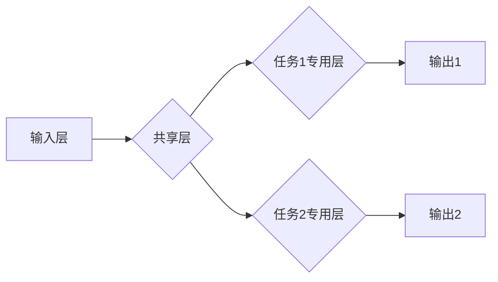

> 多任务学习，AI大模型，迁移学习，参数共享，模型泛化能力，任务相关性

## 1. 背景介绍

近年来，深度学习在人工智能领域取得了显著进展，尤其是大规模语言模型（LLM）的出现，例如GPT-3、BERT和LaMDA等，展现了强大的文本生成、理解和翻译能力。然而，训练这些大型模型需要海量数据和计算资源，且往往针对单一任务进行训练，导致模型在其他任务上的表现不佳。

多任务学习（Multi-Task Learning，MTL）作为一种有效的学习策略，旨在训练一个模型同时学习多个相关任务，从而提高模型的泛化能力和效率。与单任务学习相比，MTL可以更好地利用数据的多样性，学习更通用的特征表示，从而在新的任务上表现更出色。

## 2. 核心概念与联系

多任务学习的核心思想是，将多个相关任务共同训练在一个共享参数的模型中。通过学习多个任务的共同特征，模型可以获得更深层的理解和表示能力，从而提升在各个任务上的性能。

**MTL 架构示意图:**



**核心概念:**

* **共享参数:** MTL模型的核心是共享参数，即多个任务的学习都依赖于同一个参数集。
* **任务相关性:** MTL效果最佳时，训练的任务之间存在一定的相关性。
* **正则化:** MTL通常使用正则化技术，例如L2正则化，来防止模型过拟合，并鼓励模型学习更通用的特征表示。

## 3. 核心算法原理 & 具体操作步骤

### 3.1  算法原理概述

MTL算法的核心是通过优化一个联合损失函数来训练模型。该损失函数包含多个任务的损失函数，权重可以根据任务的重要性进行调整。

**联合损失函数:**

$$
L = \sum_{i=1}^{N} \lambda_i L_i
$$

其中：

* $L$ 是联合损失函数
* $N$ 是任务数量
* $\lambda_i$ 是第 $i$ 个任务的权重
* $L_i$ 是第 $i$ 个任务的损失函数

### 3.2  算法步骤详解

1. **数据预处理:** 对每个任务的数据进行预处理，例如文本分词、词向量化等。
2. **模型构建:** 设计一个共享参数的模型架构，包含共享层和每个任务专用层。
3. **参数初始化:** 对模型参数进行随机初始化。
4. **训练:** 使用联合损失函数对模型进行训练，并根据梯度下降算法更新模型参数。
5. **评估:** 在测试集上评估模型在各个任务上的性能。

### 3.3  算法优缺点

**优点:**

* **提高模型泛化能力:** 通过学习多个任务的共同特征，模型可以获得更通用的表示能力，从而在新的任务上表现更出色。
* **提高数据利用率:** MTL可以利用多个任务的数据进行联合训练，从而提高数据利用率。
* **减少训练时间和资源:** 通过共享参数，MTL可以减少模型参数数量，从而降低训练时间和资源消耗。

**缺点:**

* **任务相关性:** MTL效果最佳时，训练的任务之间存在一定的相关性。如果任务之间不相关，MTL效果可能不如单任务学习。
* **任务权重:** 需要合理设置每个任务的权重，以平衡不同任务的影响。
* **模型复杂度:** MTL模型通常比单任务学习模型更复杂，需要更多的计算资源进行训练。

### 3.4  算法应用领域

MTL在许多领域都有广泛的应用，例如：

* **自然语言处理:** 文本分类、情感分析、机器翻译等。
* **计算机视觉:** 图像识别、目标检测、图像分割等。
* **语音识别:** 语音转文本、语音合成等。
* **推荐系统:** 商品推荐、用户画像等。

## 4. 数学模型和公式 & 详细讲解 & 举例说明

### 4.1  数学模型构建

假设我们有 $N$ 个任务，每个任务都有自己的损失函数 $L_i(θ, x_i, y_i)$，其中 $θ$ 是模型参数，$x_i$ 是第 $i$ 个任务的输入，$y_i$ 是第 $i$ 个任务的输出。

MTL的目标是找到一个参数 $θ$，能够最小化所有任务的联合损失函数：

$$
L(θ) = \sum_{i=1}^{N} \lambda_i L_i(θ, x_i, y_i)
$$

其中 $\lambda_i$ 是第 $i$ 个任务的权重，用于平衡不同任务的影响。

### 4.2  公式推导过程

为了最小化联合损失函数，我们可以使用梯度下降算法进行优化。梯度下降算法的基本思想是，沿着负梯度方向更新模型参数，直到找到损失函数的最小值。

梯度下降算法的更新公式为：

$$
θ = θ - \eta \nabla_θ L(θ)
$$

其中 $\eta$ 是学习率，控制着参数更新的步长。

$\nabla_θ L(θ)$ 是联合损失函数 $L(θ)$ 对参数 $θ$ 的梯度。

### 4.3  案例分析与讲解

假设我们有两个任务：

* 任务 1: 文本分类
* 任务 2: 情感分析

我们可以使用一个共享参数的模型进行MTL训练。模型的共享层可以学习文本的语义特征，而每个任务专用层可以学习任务特定的特征。

在训练过程中，我们可以使用不同的权重来平衡两个任务的影响。例如，如果文本分类任务比情感分析任务更重要，我们可以将文本分类任务的权重设置为 0.8，而情感分析任务的权重设置为 0.2。

## 5. 项目实践：代码实例和详细解释说明

### 5.1  开发环境搭建

* Python 3.7+
* TensorFlow 2.0+
* PyTorch 1.0+

### 5.2  源代码详细实现

```python
import tensorflow as tf

# 定义模型架构
class MultiTaskModel(tf.keras.Model):
    def __init__(self, num_tasks):
        super(MultiTaskModel, self).__init__()
        self.shared_layer = tf.keras.layers.Dense(128, activation='relu')
        self.task_layers = [tf.keras.layers.Dense(1, activation='sigmoid') for _ in range(num_tasks)]

    def call(self, inputs):
        x = self.shared_layer(inputs)
        outputs = [task_layer(x) for task_layer in self.task_layers]
        return outputs

# 实例化模型
model = MultiTaskModel(num_tasks=2)

# 定义损失函数和优化器
loss_fn = tf.keras.losses.BinaryCrossentropy()
optimizer = tf.keras.optimizers.Adam(learning_rate=0.001)

# 训练模型
for epoch in range(10):
    for batch in dataset:
        with tf.GradientTape() as tape:
            outputs = model(batch['inputs'])
            loss = loss_fn(batch['labels'], outputs)
        gradients = tape.gradient(loss, model.trainable_variables)
        optimizer.apply_gradients(zip(gradients, model.trainable_variables))

```

### 5.3  代码解读与分析

* 模型架构: 模型包含一个共享层和多个任务专用层。共享层学习文本的语义特征，而每个任务专用层学习任务特定的特征。
* 损失函数: 使用二分类交叉熵损失函数，用于计算文本分类和情感分析任务的损失。
* 优化器: 使用Adam优化器，用于更新模型参数。
* 训练过程: 训练模型时，将所有任务的数据一起输入模型，并使用联合损失函数进行优化。

### 5.4  运行结果展示

训练完成后，可以将模型应用于新的文本数据进行预测。

## 6. 实际应用场景

### 6.1  自然语言处理

* **文本分类:** 将文本分类为不同的类别，例如新闻分类、邮件分类等。
* **情感分析:** 分析文本的情感倾向，例如判断文本是正面、负面还是中性。
* **机器翻译:** 将文本从一种语言翻译成另一种语言。

### 6.2  计算机视觉

* **图像识别:** 将图像分类为不同的类别，例如识别动物、物体、场景等。
* **目标检测:** 在图像中检测到特定目标，并标注其位置和类别。
* **图像分割:** 将图像分割成不同的区域，例如分割图像中的前景和背景。

### 6.3  语音识别

* **语音转文本:** 将语音转换为文本。
* **语音合成:** 将文本转换为语音。

### 6.4  未来应用展望

随着深度学习技术的不断发展，MTL在未来将有更广泛的应用场景，例如：

* **个性化推荐:** 根据用户的历史行为和偏好，推荐个性化的商品、服务和内容。
* **医疗诊断:** 利用MTL技术，可以训练一个模型来辅助医生诊断疾病。
* **自动驾驶:** MTL可以用于训练自动驾驶汽车，使其能够更好地感知周围环境并做出决策。

## 7. 工具和资源推荐

### 7.1  学习资源推荐

* **书籍:**
    * Deep Learning by Ian Goodfellow, Yoshua Bengio, and Aaron Courville
    * Hands-On Machine Learning with Scikit-Learn, Keras & TensorFlow by Aurélien Géron
* **课程:**
    * Stanford CS231n: Convolutional Neural Networks for Visual Recognition
    * Deep Learning Specialization by Andrew Ng on Coursera

### 7.2  开发工具推荐

* **TensorFlow:** 开源深度学习框架，提供丰富的API和工具。
* **PyTorch:** 开源深度学习框架，以其灵活性和易用性而闻名。
* **Keras:** 高级深度学习API，可以运行在TensorFlow、Theano或CNTK后端。

### 7.3  相关论文推荐

* **Multi-Task Learning** by Richard S. Sutton and Andrew G. Barto
* **Learning Transferable Features with Multi-Task Learning** by Ross Girshick et al.
* **Multi-Task Deep Neural Networks** by  Yanran Li et al.

## 8. 总结：未来发展趋势与挑战

### 8.1  研究成果总结

MTL在近年来取得了显著进展，在许多领域都取得了优异的性能。

### 8.2  未来发展趋势

* **更有效的MTL算法:** 研究更有效的MTL算法，例如动态MTL、联邦MTL等，以提高模型的泛化能力和效率。
* **更广泛的应用场景:** 将MTL应用于更多领域，例如医疗、金融、教育等。
* **跨模态MTL:** 研究跨模态MTL，例如文本-图像、文本-音频等，以更好地理解和处理多模态数据。

### 8.3  面临的挑战

* **任务相关性:** MTL效果最佳时，训练的任务之间存在一定的相关性。如何有效地选择相关任务仍然是一个挑战。
* **模型复杂度:** MTL模型通常比单任务学习模型更复杂，需要更多的计算资源进行训练。
* **数据稀缺性:** 许多领域的数据稀缺，这会影响MTL模型的训练效果。

### 8.4  研究展望

未来，MTL研究将继续朝着更有效、更广泛、更智能的方向发展，为人工智能的进步做出更大的贡献。

## 9. 附录：常见问题与解答

**Q1: MTL和单任务学习相比有什么优势？**

**A1:** MTL可以利用多个任务的数据进行联合训练，从而提高数据利用率，并学习更通用的特征表示，从而提高模型的泛化能力。

**Q2: 如何选择MTL中的任务？**

**A2:** MTL效果最佳时，训练的任务之间存在一定的相关性。可以根据任务之间的相似性、数据分布等因素进行