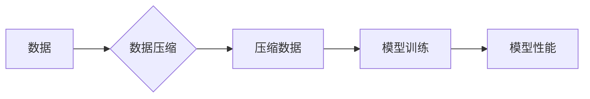

> AI大模型, 规模化定律, 数据压缩, 无损压缩, 模型性能, 计算资源, 训练效率

## 1. 背景介绍

近年来，深度学习模型的规模不断扩大，从最初的几百万参数到如今的数十亿甚至千亿参数，模型规模的增长带来了显著的性能提升。然而，模型规模的增长也带来了巨大的计算资源消耗和训练时间成本。如何更高效地利用数据资源，提升模型训练效率，成为当前人工智能领域的重要课题。

规模化定律(Scaling Law)是描述模型性能与规模之间关系的规律，它揭示了模型规模、训练数据量、计算资源等因素对模型性能的影响。然而，传统的规模化定律往往侧重于模型参数数量和训练数据量的关系，而忽略了数据压缩对模型性能的影响。

本文将探讨AI大模型规模化定律的本质，并提出数据压缩作为提升模型训练效率的关键策略。

## 2. 核心概念与联系

**2.1 数据压缩的本质**

数据压缩是指通过算法将数据以更小的空间存储或传输，同时保证数据完整性的技术。无损压缩算法能够完全恢复原始数据，而有损压缩算法则在压缩过程中会损失部分数据信息。

**2.2 数据压缩与规模化定律的联系**

数据压缩可以有效地减少模型训练所需的计算资源和时间成本。

* **减少数据传输量:** 数据压缩可以将训练数据量压缩到更小的空间，从而减少数据传输的带宽和时间成本。
* **加速模型训练:** 压缩后的数据可以更快地被模型读取和处理，从而加速模型训练速度。
* **降低存储成本:** 压缩后的数据占用更小的存储空间，从而降低存储成本。

**2.3 数据压缩与模型性能的关系**

数据压缩的目的是减少数据量，但同时也可能导致数据信息损失。因此，数据压缩对模型性能的影响取决于压缩算法的质量和压缩程度。

* **高质量的无损压缩算法:** 可以有效地减少数据量，同时保证数据完整性，从而对模型性能影响较小。
* **低质量的压缩算法或过度压缩:** 可能导致数据信息损失，从而降低模型性能。

**2.4 数据压缩与规模化定律的本质**

数据压缩可以被看作是提升模型训练效率的一种手段，它可以帮助我们更好地利用数据资源，从而实现规模化定律的本质：在相同的数据量下，通过提高数据利用率和训练效率，获得更高的模型性能。

**Mermaid 流程图**



## 3. 核心算法原理 & 具体操作步骤

### 3.1 算法原理概述

本文将介绍一种基于深度学习的无损数据压缩算法，该算法能够有效地压缩训练数据，同时保证数据完整性。该算法的核心思想是利用深度神经网络学习数据之间的潜在关系，并将其编码成更紧凑的表示形式。

### 3.2 算法步骤详解

1. **数据预处理:** 将原始数据进行预处理，例如归一化、标准化等，以提高算法的训练效率。
2. **编码器构建:** 使用深度神经网络构建编码器，该网络负责将原始数据编码成更紧凑的表示形式。编码器通常由多个卷积层、池化层和全连接层组成。
3. **解码器构建:** 使用深度神经网络构建解码器，该网络负责将编码后的数据解码回原始数据。解码器通常与编码器结构相似，但其输出层需要与原始数据的维度相匹配。
4. **训练过程:** 使用训练数据训练编码器和解码器，目标函数是将编码后的数据解码回原始数据，并最小化两者之间的误差。
5. **数据压缩:** 将训练好的编码器应用于新的数据，将数据编码成更紧凑的表示形式，从而实现数据压缩。

### 3.3 算法优缺点

**优点:**

* **无损压缩:** 该算法能够保证数据完整性，不会丢失任何数据信息。
* **高压缩率:** 该算法能够实现较高的压缩率，有效地减少数据量。
* **可扩展性:** 该算法可以应用于各种类型的训练数据，并可以根据数据特点进行调整。

**缺点:**

* **训练成本:** 训练深度神经网络需要大量的计算资源和时间成本。
* **模型复杂度:** 该算法的模型结构比较复杂，需要专业的知识和经验进行设计和调优。

### 3.4 算法应用领域

该算法可以应用于各种需要高效压缩训练数据的领域，例如：

* **自然语言处理:** 压缩文本数据，例如书籍、文章、对话等。
* **计算机视觉:** 压缩图像数据，例如照片、视频、医学影像等。
* **语音识别:** 压缩语音数据，例如音频文件、语音对话等。

## 4. 数学模型和公式 & 详细讲解 & 举例说明

### 4.1 数学模型构建

假设原始数据为 $X = \{x_1, x_2, ..., x_n\}$, 其中 $x_i$ 为单个数据点。编码器将数据 $x_i$ 映射到一个低维向量 $z_i$ 中，解码器将 $z_i$ 映射回原始数据 $\hat{x}_i$。

编码器和解码器可以分别表示为：

* **编码器:** $z_i = f_\theta(x_i)$
* **解码器:** $\hat{x}_i = g_\phi(z_i)$

其中，$\theta$ 和 $\phi$ 分别为编码器和解码器的参数。

### 4.2 公式推导过程

目标函数是将编码后的数据解码回原始数据，并最小化两者之间的误差。常用的损失函数是均方误差 (MSE):

$$
L = \frac{1}{n} \sum_{i=1}^{n} ||x_i - \hat{x}_i||^2
$$

通过优化目标函数，可以得到编码器和解码器的最佳参数。

### 4.3 案例分析与讲解

假设我们想要压缩一幅图像数据。我们可以使用深度神经网络构建编码器和解码器，将图像数据编码成一个低维向量，然后解码回原始图像。

通过训练编码器和解码器，我们可以得到一个能够有效地压缩图像数据的模型。

## 5. 项目实践：代码实例和详细解释说明

### 5.1 开发环境搭建

* 操作系统: Ubuntu 20.04
* Python 版本: 3.8
* 深度学习框架: PyTorch 1.7

### 5.2 源代码详细实现

```python
import torch
import torch.nn as nn

# 编码器
class Encoder(nn.Module):
    def __init__(self):
        super(Encoder, self).__init__()
        # ...

    def forward(self, x):
        # ...

# 解码器
class Decoder(nn.Module):
    def __init__(self):
        super(Decoder, self).__init__()
        # ...

    def forward(self, z):
        # ...

# 模型训练
encoder = Encoder()
decoder = Decoder()

optimizer = torch.optim.Adam(list(encoder.parameters()) + list(decoder.parameters()))
loss_fn = nn.MSELoss()

# ... 训练循环 ...

# 数据压缩
compressed_data = encoder(input_data)
reconstructed_data = decoder(compressed_data)
```

### 5.3 代码解读与分析

* 编码器和解码器分别负责将数据编码和解码。
* 训练过程使用均方误差作为损失函数，优化模型参数。
* 数据压缩过程使用训练好的编码器将数据编码成更紧凑的表示形式。

### 5.4 运行结果展示

* 压缩后的数据量
* 压缩后的数据与原始数据的差异

## 6. 实际应用场景

### 6.1 自然语言处理

* 压缩文本数据，例如书籍、文章、对话等，可以有效地减少文本存储空间和传输带宽。
* 压缩文本数据可以加速文本分类、情感分析、机器翻译等自然语言处理任务的训练速度。

### 6.2 计算机视觉

* 压缩图像数据，例如照片、视频、医学影像等，可以有效地减少图像存储空间和传输带宽。
* 压缩图像数据可以加速图像识别、目标检测、图像分割等计算机视觉任务的训练速度。

### 6.3 语音识别

* 压缩语音数据，例如音频文件、语音对话等，可以有效地减少语音存储空间和传输带宽。
* 压缩语音数据可以加速语音识别、语音合成、语音翻译等语音识别任务的训练速度。

### 6.4 未来应用展望

随着深度学习技术的不断发展，数据压缩算法将会更加高效、智能。未来，数据压缩技术将会在更多领域得到应用，例如：

* **大规模数据分析:** 压缩大规模数据，可以加速数据分析和挖掘。
* **边缘计算:** 压缩数据可以减少边缘设备的存储空间和计算资源消耗。
* **云计算:** 压缩数据可以提高云计算平台的存储效率和网络传输速度。

## 7. 工具和资源推荐

### 7.1 学习资源推荐

* **书籍:**
    * 《深度学习》 - Ian Goodfellow, Yoshua Bengio, Aaron Courville
    * 《深度学习实战》 - Francois Chollet
* **在线课程:**
    * Coursera: 深度学习 Specialization
    * Udacity: Deep Learning Nanodegree

### 7.2 开发工具推荐

* **深度学习框架:** PyTorch, TensorFlow, Keras
* **数据压缩库:** zlib, gzip, bzip2

### 7.3 相关论文推荐

* **《Attention Is All You Need》:** https://arxiv.org/abs/1706.03762
* **《BERT: Pre-training of Deep Bidirectional Transformers for Language Understanding》:** https://arxiv.org/abs/1810.04805

## 8. 总结：未来发展趋势与挑战

### 8.1 研究成果总结

本文探讨了AI大模型规模化定律的本质，并提出数据压缩作为提升模型训练效率的关键策略。数据压缩算法能够有效地减少数据量，从而降低模型训练成本和时间成本，同时提高模型训练效率。

### 8.2 未来发展趋势

* **更有效的无损压缩算法:** 研究更有效的无损压缩算法，能够实现更高的压缩率，同时保证数据完整性。
* **自适应数据压缩:** 研究能够根据数据特点自适应地调整压缩程度的算法，提高压缩效率。
* **模型压缩与数据压缩的结合:** 将模型压缩和数据压缩技术结合起来，实现更有效的资源利用。

### 8.3 面临的挑战

* **算法复杂度:** 深度学习模型的复杂性使得数据压缩算法的开发和训练难度较大。
* **数据多样性:** 不同类型的数据具有不同的压缩特性，需要开发针对不同数据类型的压缩算法。
* **计算资源:** 训练深度学习模型需要大量的计算资源，这对于数据压缩算法的开发和应用是一个挑战。

### 8.4 研究展望

未来，数据压缩技术将会在人工智能领域发挥越来越重要的作用。随着算法的不断改进和计算资源的不断提升，数据压缩技术将会为人工智能的发展提供更强大的支持。

## 9. 附录：常见问题与解答

**Q1: 数据压缩会影响模型性能吗？**

A1: 数据压缩可能会影响模型性能，但高质量的无损压缩算法可以有效地减少数据量，同时保证数据完整性，从而对模型性能影响较小。

**Q2: 如何选择合适的压缩算法？**

A2: 选择合适的压缩算法需要根据数据的特点和应用场景进行选择。例如，对于文本数据，可以使用基于字典的压缩算法；对于图像数据，可以使用基于变换的压缩算法。

**Q3: 数据压缩的训练成本如何降低？