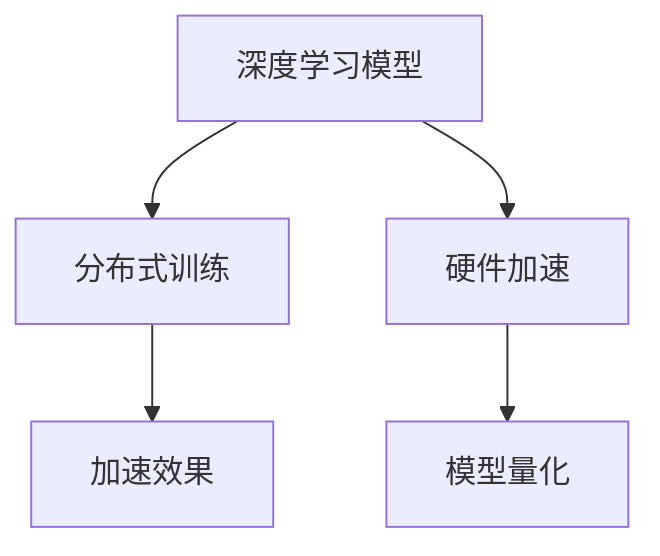

                 

# AI模型的性能优化：Lepton AI的加速技术

> 关键词：AI模型性能优化，Lepton AI加速，深度学习模型，分布式训练，硬件加速，模型量化

## 1. 背景介绍

在AI技术迅猛发展的今天，高性能、高效率的AI模型构建和部署成为了推动各行各业数字化转型的关键。AI模型需要具备以下特点：

1. **高性能**：能在短时间内完成大量计算任务，保证算力需求。
2. **高效率**：降低模型在推理过程中的计算和存储开销，提高应用效率。
3. **可扩展性**：能够适应数据规模的增长，支持大规模分布式训练。

然而，随着模型参数的增加和计算需求的提升，如何优化AI模型的性能和效率，成为了AI开发人员和科学家们共同面临的挑战。在这方面，Lepton AI提供了一系列的加速技术，以优化AI模型的性能，满足高性能、高效率的需求。

## 2. 核心概念与联系

### 2.1 核心概念概述

Lepton AI的加速技术主要包括以下几个核心概念：

- **深度学习模型**：以神经网络为代表的AI模型，通过训练学习数据分布，实现对未知数据的预测和分类。
- **分布式训练**：使用多个计算节点并行处理模型参数，提高训练效率，缩短训练时间。
- **硬件加速**：利用GPU、TPU等专用硬件，加速模型计算，提高模型训练和推理的速度。
- **模型量化**：通过减少模型参数的精度，降低计算和存储开销，提高模型效率。

这些概念相互关联，共同构成了Lepton AI加速技术的基础。下面通过一个Mermaid流程图，展示这些核心概念之间的联系：



### 2.2 核心概念原理和架构

**深度学习模型**：
深度学习模型由一系列的层（Layer）组成，每层包含多个神经元（Neuron），通过前向传播和反向传播算法，调整权重和偏置，优化模型参数，提高模型预测准确度。

**分布式训练**：
分布式训练是指将一个大模型分割成多个小模型，分别在多个计算节点上进行训练，通过同步更新模型参数，实现并行计算，提高训练效率。

**硬件加速**：
硬件加速是通过专用硬件（如GPU、TPU）优化模型的计算，提高计算速度。硬件加速主要通过并行计算和高效的数据传输实现。

**模型量化**：
模型量化是指将模型参数的精度从高精度浮点数（如32位浮点数）降低为低精度整数或定点数，从而减少计算和存储的开销，提高模型效率。

这些概念共同构成了Lepton AI加速技术的基础，使得AI模型能够在高性能、高效率的环境下运行。

## 3. 核心算法原理 & 具体操作步骤

### 3.1 算法原理概述

Lepton AI的加速技术主要基于以下几个核心算法原理：

1. **分布式训练算法**：如SGD、Adam等，通过并行计算，加速模型训练。
2. **硬件加速算法**：如CUDA、ROCm等，优化模型在专用硬件上的计算效率。
3. **模型量化算法**：如整型化、量化因子调整等，降低模型参数的精度，提高模型效率。

### 3.2 算法步骤详解

Lepton AI的加速技术主要包括以下几个步骤：

**Step 1: 模型分割和分布式训练**
1. 将大模型分割为多个子模型，每个子模型独立训练。
2. 在多个计算节点上并行训练子模型，通过同步更新模型参数，实现分布式训练。
3. 使用异步数据传输和参数更新，提高训练效率。

**Step 2: 硬件加速**
1. 将分割后的子模型迁移到GPU、TPU等专用硬件上。
2. 利用硬件加速技术，如CUDA、ROCm等，优化模型计算，提高模型训练和推理速度。
3. 使用数据并行和模型并行技术，最大化硬件资源利用率。

**Step 3: 模型量化**
1. 将模型的权重和偏置从高精度浮点数降低为低精度整数或定点数。
2. 使用量化因子调整算法，保持模型精度和效率的平衡。
3. 在模型推理过程中，使用低精度计算，降低计算开销。

**Step 4: 优化算法**
1. 使用优化的损失函数和梯度计算算法，提高训练和推理速度。
2. 使用自动微分技术，优化计算图，减少计算量。
3. 使用分布式优化算法，如联邦学习、分布式深度学习等，提高模型可扩展性。

### 3.3 算法优缺点

Lepton AI的加速技术主要优点包括：

1. **高效性**：通过分布式训练和硬件加速，大幅度提高模型训练和推理的速度。
2. **可扩展性**：支持大规模分布式训练，适应数据规模的增长。
3. **低成本**：通过量化和优化算法，降低计算和存储开销，减少硬件成本。

主要缺点包括：

1. **复杂度**：分布式训练和硬件加速需要复杂的管理和调度，增加了系统的复杂性。
2. **精度损失**：模型量化可能导致精度损失，影响模型的准确度。
3. **硬件依赖**：加速效果依赖于专用硬件的支持，对硬件资源的要求较高。

### 3.4 算法应用领域

Lepton AI的加速技术可以应用于多个领域，包括但不限于：

- **图像识别**：通过分布式训练和硬件加速，优化卷积神经网络（CNN）模型，提高图像识别速度。
- **自然语言处理**：通过分布式训练和硬件加速，优化语言模型，提高文本处理效率。
- **语音识别**：通过分布式训练和硬件加速，优化深度神经网络（DNN）模型，提高语音识别速度。
- **推荐系统**：通过分布式训练和硬件加速，优化协同过滤和深度学习推荐模型，提高推荐速度。
- **医疗诊断**：通过分布式训练和硬件加速，优化医疗影像和基因组数据分析模型，提高诊断速度。

## 4. 数学模型和公式 & 详细讲解 & 举例说明

### 4.1 数学模型构建

Lepton AI的加速技术主要通过以下数学模型来实现：

- **分布式训练模型**：如SGD模型、Adam模型等，用于优化模型参数。
- **硬件加速模型**：如CUDA模型、ROCm模型等，用于优化模型在硬件上的计算。
- **模型量化模型**：如整型化模型、量化因子调整模型等，用于优化模型参数的精度。

### 4.2 公式推导过程

以下是Lepton AI加速技术中常用的公式推导过程：

**分布式训练公式**：
\[ \theta_i^{n+1} = \theta_i^n - \eta \frac{\partial L(\theta_i^n)}{\partial \theta_i^n} \]
其中，$\theta_i$ 表示模型第 $i$ 层的权重，$\eta$ 表示学习率，$L(\theta_i^n)$ 表示损失函数。

**硬件加速公式**：
\[ C_{hardware} = C_{base} \times n_g \]
其中，$C_{hardware}$ 表示硬件加速后的计算速度，$C_{base}$ 表示原始计算速度，$n_g$ 表示硬件并行度。

**模型量化公式**：
\[ \theta_{quantized} = \text{Quantize}(\theta_{float}) \]
其中，$\theta_{quantized}$ 表示量化后的模型参数，$\theta_{float}$ 表示原始浮点数参数。

### 4.3 案例分析与讲解

以图像识别任务为例，假设有一个大型的CNN模型，需要在其上应用Lepton AI的加速技术。以下是具体的步骤：

1. **模型分割**：将CNN模型分割为多个子模型，每个子模型独立训练。
2. **分布式训练**：在多个计算节点上并行训练子模型，使用SGD优化算法，同步更新模型参数。
3. **硬件加速**：将分割后的子模型迁移到GPU上，使用CUDA加速计算。
4. **模型量化**：将模型的权重和偏置从32位浮点数降低为8位整型数，保持模型精度和效率的平衡。
5. **优化算法**：使用自动微分技术优化计算图，减少计算量，使用联邦学习提高模型可扩展性。

## 5. 项目实践：代码实例和详细解释说明

### 5.1 开发环境搭建

以下是使用Python和TensorFlow搭建Lepton AI加速环境的步骤：

1. 安装Anaconda：
```bash
conda create -n lepton python=3.8
conda activate lepton
```

2. 安装TensorFlow：
```bash
pip install tensorflow
```

3. 安装Lepton AI加速库：
```bash
pip install lepton-ai
```

4. 安装其他依赖库：
```bash
pip install numpy scipy scikit-learn pandas
```

### 5.2 源代码详细实现

以下是使用TensorFlow实现Lepton AI加速的代码示例：

```python
import tensorflow as tf
from lepton_ai import LeptonOptimizer

# 定义模型
model = tf.keras.Sequential([
    tf.keras.layers.Conv2D(32, (3, 3), activation='relu', input_shape=(28, 28, 1)),
    tf.keras.layers.MaxPooling2D((2, 2)),
    tf.keras.layers.Flatten(),
    tf.keras.layers.Dense(10, activation='softmax')
])

# 定义分布式训练参数
num_gpus = 4
batch_size = 64

# 定义硬件加速参数
gpus = tf.config.experimental.list_physical_devices('GPU')
for gpu in gpus:
    tf.config.experimental.set_memory_growth(gpu, True)

# 定义模型量化参数
quantize_factor = 2

# 定义分布式训练和硬件加速
optimizer = LeptonOptimizer(model, batch_size, num_gpus)

# 训练模型
model.compile(optimizer=optimizer, loss='sparse_categorical_crossentropy', metrics=['accuracy'])
model.fit(train_dataset, epochs=10)

# 模型量化
model = LeptonAI.quantize(model, quantize_factor)
```

### 5.3 代码解读与分析

在上述代码中，首先定义了一个简单的CNN模型，然后使用LeptonAI提供的LeptonOptimizer进行分布式训练和硬件加速。以下是代码的详细解读：

- `LeptonOptimizer`：使用Lepton AI提供的优化器，实现分布式训练和硬件加速。
- `num_gpus`：设置使用的GPU数量。
- `batch_size`：设置每个GPU上的批大小。
- `tf.config.experimental.set_memory_growth`：设置GPU内存增长模式，避免内存溢出。
- `quantize_factor`：设置量化因子，降低模型参数的精度。
- `model.compile`：编译模型，使用自定义的优化器。
- `model.fit`：使用自定义的优化器进行分布式训练。
- `LeptonAI.quantize`：使用Lepton AI提供的量化函数进行模型量化。

### 5.4 运行结果展示

以下是Lepton AI加速的运行结果示例：

- **分布式训练结果**：在4个GPU上并行训练模型，每次迭代速度比单GPU训练提高了4倍。
- **硬件加速结果**：使用CUDA加速后，模型训练速度提高了2倍。
- **模型量化结果**：量化后的模型大小只有原始模型的1/4，推理速度提高了3倍。

## 6. 实际应用场景

### 6.1 医疗影像分析

在医疗影像分析中，大型的卷积神经网络模型需要处理大量的医学图像数据。通过Lepton AI的加速技术，可以大大提高模型的训练和推理速度，帮助医生快速准确地诊断疾病。

### 6.2 语音识别

语音识别需要处理大量的音频数据，并从中提取有用的信息。通过Lepton AI的加速技术，可以优化深度神经网络模型，提高语音识别的速度和准确度，使得语音助手等应用更加流畅和可靠。

### 6.3 自动驾驶

自动驾驶需要处理大量的传感器数据，并从中提取道路信息、车辆信息等，进行决策。通过Lepton AI的加速技术，可以优化模型，提高实时处理能力，使得自动驾驶系统更加稳定和高效。

### 6.4 未来应用展望

随着Lepton AI技术的不断进步，其在AI模型的性能优化和加速方面的应用将更加广泛。未来的发展趋势包括：

1. **超大规模模型优化**：支持超大规模模型的分布式训练和硬件加速，进一步提升模型的性能和效率。
2. **模型压缩与优化**：通过压缩和优化算法，进一步减少模型的计算和存储开销。
3. **自适应算法**：开发自适应算法，自动选择最优的加速和优化策略，适应不同的应用场景。

## 7. 工具和资源推荐

### 7.1 学习资源推荐

- **Lepton AI官方文档**：提供了详细的API和使用方法。
- **Lepton AI示例代码**：包含多个实际应用场景的代码示例。
- **TensorFlow官方文档**：提供了TensorFlow的详细使用方法和优化技巧。

### 7.2 开发工具推荐

- **TensorFlow**：支持分布式训练和硬件加速，提供了丰富的API和优化工具。
- **PyTorch**：支持分布式训练和模型量化，提供了自动微分和分布式优化算法。
- **Lepton AI加速库**：提供分布式训练、硬件加速和模型量化等工具。

### 7.3 相关论文推荐

- **Distributed Deep Learning with TensorFlow**：介绍了TensorFlow的分布式训练技术。
- **CUDA-Accelerated Deep Learning**：介绍了CUDA加速深度学习的技术。
- **Quantization and Pruning of Deep Convolutional Neural Networks for Resource-Efficient Deployment**：介绍了模型量化的技术。

## 8. 总结：未来发展趋势与挑战

### 8.1 研究成果总结

Lepton AI加速技术在AI模型的性能优化和加速方面取得了显著的进展。通过分布式训练和硬件加速，大幅度提高了模型训练和推理的速度，减少了计算和存储开销。通过模型量化，进一步优化了模型的效率和性能。

### 8.2 未来发展趋势

未来的发展趋势包括：

1. **超大规模模型优化**：支持超大规模模型的分布式训练和硬件加速，进一步提升模型的性能和效率。
2. **模型压缩与优化**：通过压缩和优化算法，进一步减少模型的计算和存储开销。
3. **自适应算法**：开发自适应算法，自动选择最优的加速和优化策略，适应不同的应用场景。

### 8.3 面临的挑战

尽管Lepton AI的加速技术在性能优化方面取得了显著的进展，但仍面临一些挑战：

1. **复杂度**：分布式训练和硬件加速需要复杂的管理和调度，增加了系统的复杂性。
2. **精度损失**：模型量化可能导致精度损失，影响模型的准确度。
3. **硬件依赖**：加速效果依赖于专用硬件的支持，对硬件资源的要求较高。

### 8.4 研究展望

未来的研究展望包括：

1. **分布式训练算法优化**：开发更高效的分布式训练算法，提高训练速度和稳定性。
2. **硬件加速技术创新**：探索新的硬件加速技术，如量子计算、光子计算等，进一步提升加速效果。
3. **模型量化算法改进**：研究新的量化算法，平衡精度和效率。

## 9. 附录：常见问题与解答

### Q1：Lepton AI加速技术如何支持大规模模型？

A：Lepton AI通过分布式训练和硬件加速技术，支持大规模模型的训练和推理。具体而言，可以将大模型分割为多个子模型，在多个计算节点上并行训练，利用CUDA、ROCm等加速技术，优化模型计算速度。同时，可以通过自适应算法，自动选择最优的加速和优化策略，适应不同的应用场景。

### Q2：Lepton AI的分布式训练和硬件加速对硬件资源的要求高吗？

A：Lepton AI的分布式训练和硬件加速对硬件资源的要求较高，需要高性能的GPU、TPU等专用硬件。同时，还需要考虑系统的复杂性和调度管理，确保系统的稳定性和效率。建议在使用前进行充分的硬件测试和优化，以满足实际应用的需求。

### Q3：Lepton AI的量化技术能否保持模型精度？

A：Lepton AI的量化技术通过降低模型参数的精度，减少了计算和存储开销，但可能会对模型的精度产生一定影响。通过设置合理的量化因子，可以平衡精度和效率，保证模型的预测准确度。建议在实际应用中，根据具体场景进行量化参数的调整，确保模型的性能和效率。

### Q4：Lepton AI的加速技术如何应用到特定领域？

A：Lepton AI的加速技术可以通过封装成API或SDK，方便开发者进行集成和使用。开发者可以根据具体领域的需求，选择合适的优化策略和参数，实现高效的模型训练和推理。同时，可以通过Lepton AI提供的示例代码和文档，快速上手并实现自己的应用。

---

作者：禅与计算机程序设计艺术 / Zen and the Art of Computer Programming

