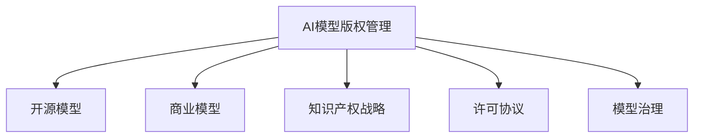

                 

# AI模型的版权管理：Lepton AI的知识产权战略

> 关键词：
  - AI模型版权管理
  - Lepton AI
  - 知识产权战略
  - 开源模型
  - 商业模型
  - 模型治理
  - 许可协议
  - 商业化策略

## 1. 背景介绍

### 1.1 问题由来
在人工智能快速发展的今天，AI模型已经广泛应用到各行各业。然而，随着模型的复杂度不断提升，模型版权和知识产权问题变得越来越重要。如何有效管理AI模型的版权，确保模型的安全性和可扩展性，成为了一个亟需解决的问题。

### 1.2 问题核心关键点
AI模型的版权管理主要包括以下几个方面：

1. 开源模型的保护与管理：如何在开源社区中保护模型的知识产权，同时确保模型的共享与利用。
2. 商业模型的开发与销售：如何制定商业化策略，将AI模型转化为商业产品，实现盈利。
3. 模型治理与合规性：如何在模型开发、部署、应用的全生命周期中，确保模型的合规性和安全性。
4. 许可协议的制定与使用：如何选择适合自身的许可协议，规范模型的使用与传播。
5. 商业模型的市场策略：如何通过市场策略，将模型推广到更多应用场景。

这些核心关键点共同构成了AI模型版权管理的复杂体系，需要在各个环节进行综合考虑。

### 1.3 问题研究意义
AI模型的版权管理对于保护开发者权益、促进技术传播、规范市场秩序具有重要意义：

1. 保护开发者权益：通过版权管理，确保开发者对模型拥有合法权益，防止盗版和侵权行为。
2. 促进技术传播：合理管理模型的版权，可以在开源社区和商业化过程中，最大化模型的价值。
3. 规范市场秩序：制定统一的模型治理规范，可以防止市场乱象，促进健康发展的生态系统。
4. 推动商业化进程：有效的知识产权保护与商业化策略，有助于将模型转化为盈利产品。
5. 保障合规性与安全性：通过合规性管理，确保模型在应用过程中符合法律法规，保障用户数据安全。

## 2. 核心概念与联系

### 2.1 核心概念概述

为更好地理解AI模型的版权管理，本节将介绍几个关键概念：

- AI模型版权管理：指对AI模型进行知识产权保护和管理的过程，包括开源模型、商业模型的版权保护，以及模型使用中的合规性管理。
- 开源模型：指在开源社区中公开共享的AI模型，如TensorFlow、PyTorch等。开发者可以自由使用、修改和分发这些模型。
- 商业模型：指由公司或机构开发并销售的AI模型，如Lepton AI推出的智能决策模型。
- 知识产权战略：指企业或开发者在保护和管理AI模型版权时的整体策略和规划。
- 许可协议：指规范AI模型使用与传播的法律文本，如Apache 2.0、MIT等。
- 模型治理：指在模型开发、部署、应用的全生命周期中，对模型的管理和控制。

这些核心概念之间的逻辑关系可以通过以下Mermaid流程图来展示：



这个流程图展示了我们讨论的核心概念及其之间的关系：

1. AI模型版权管理是对开源模型、商业模型进行版权保护和管理的过程。
2. 开源模型和商业模型分别代表不同的版权管理策略和商业模式。
3. 知识产权战略是整体保护和管理AI模型的策略规划。
4. 许可协议用于规范模型的使用与传播。
5. 模型治理涉及模型开发的各个环节，确保模型的合规性和安全性。

## 3. 核心算法原理 & 具体操作步骤
### 3.1 算法原理概述

AI模型的版权管理涉及多个方面的算法和技术，包括但不限于：

1. 开源模型的保护与分发：通过GitHub、GitLab等平台，对模型进行版本控制和分发，同时确保模型的开源许可合规。
2. 商业模型的销售与许可：制定合理的许可协议，确保模型的商业价值和开发者权益。
3. 模型治理的自动化：开发模型治理工具，对模型的开发、部署、应用进行自动化管理。
4. 合规性检查与审计：引入合规性检查工具，对模型的使用和传播进行审计和监督。
5. 模型使用日志记录：记录模型使用的日志信息，便于追踪和审计。

### 3.2 算法步骤详解

基于以上算法原理，AI模型的版权管理可以分为以下几个关键步骤：

**Step 1: 制定知识产权战略**
- 明确模型的版权归属，确定开源和商业化的策略。
- 根据模型的特点，选择合适的开源或商业许可协议。
- 制定模型的合规性标准，确保模型在开发、部署、应用各阶段符合法规要求。

**Step 2: 开源模型的保护与管理**
- 将模型上传到GitHub、GitLab等开源平台，确保代码的开放性和可复现性。
- 在代码仓库中添加LICENSE文件，声明模型的开源许可。
- 对模型的版本进行控制，确保历史记录的完整性。
- 提供模型的文档和教程，指导用户使用。

**Step 3: 商业模型的开发与销售**
- 对商业模型进行内部开发，确保模型的创新性和竞争力。
- 制定销售策略，选择合适的市场渠道进行推广。
- 制定合理的定价策略，确保模型的商业价值。
- 引入商业化的许可协议，确保模型的知识产权得到保护。

**Step 4: 模型治理的自动化**
- 开发模型治理工具，对模型的开发、部署、应用进行自动化管理。
- 引入CI/CD流程，确保模型的持续集成和交付。
- 使用合规性检查工具，对模型的使用和传播进行自动化审计。
- 记录模型的使用日志，便于追踪和审计。

**Step 5: 合规性检查与审计**
- 引入合规性检查工具，对模型的使用和传播进行审计和监督。
- 定期进行合规性检查，确保模型的合规性。
- 对于发现的问题，及时进行修正和改进。

### 3.3 算法优缺点

AI模型的版权管理具有以下优点：

1. 保护开发者权益：通过合理的版权管理和知识产权战略，确保开发者对模型的合法权益。
2. 促进技术传播：开源模型和商业模型可以最大程度利用社区资源，推动技术的广泛应用。
3. 规范市场秩序：统一的模型治理和许可协议，可以防止市场乱象，促进健康发展的生态系统。
4. 推动商业化进程：合理的商业化策略和许可协议，有助于将模型转化为盈利产品。
5. 保障合规性与安全性：通过合规性管理和审计，确保模型在应用过程中符合法律法规，保障用户数据安全。

然而，AI模型的版权管理也存在一些缺点：

1. 版权保护难度大：AI模型的复杂性和多样性使得版权保护变得复杂。
2. 许可协议复杂：选择合适的许可协议需要深入理解各种协议的优缺点。
3. 合规性检查困难：模型使用和传播过程中，需要进行大量的合规性检查。
4. 商业化难度高：将模型转化为商业产品需要克服技术、市场等多重障碍。

尽管存在这些缺点，但AI模型的版权管理仍是大数据时代人工智能技术应用的重要保障。通过不断优化和完善版权管理策略，可以克服上述挑战，实现模型的最大价值。

### 3.4 算法应用领域

AI模型的版权管理主要应用于以下几个领域：

1. 开源社区：开源模型的版权管理主要通过开源许可协议进行，如Apache 2.0、MIT等。
2. 商业化应用：商业模型的版权管理需要制定合理的许可协议，确保模型的商业价值和开发者权益。
3. 企业内部：企业内部的AI模型需要制定合规性标准，进行自动化管理，确保模型的合规性和安全性。
4. 政府项目：政府项目中的AI模型需要符合法律法规，保障用户数据安全。
5. 公共数据：公共数据中的AI模型需要符合数据开放和使用规范，确保数据的安全和隐私保护。

## 4. 数学模型和公式 & 详细讲解 & 举例说明
### 4.1 数学模型构建

为更好地理解AI模型的版权管理，本节将介绍几个数学模型：

1. 开源许可协议：Apache 2.0许可协议规定了模型的开源许可范围和开发者权益。
2. 商业许可协议：Lepton AI的商业许可协议规范了模型的使用和传播。
3. 合规性检查模型：引入合规性检查工具，对模型的使用和传播进行自动化审计。

**Apache 2.0许可协议**
Apache 2.0许可协议是开源社区中常用的许可协议，主要条款如下：

1. 开源权限：任何人可以自由使用、复制、修改和分发开源代码。
2. 商业使用：可以基于开源代码开发商业产品，但需遵循许可协议的条款。
3. 代码保护：开发者对代码的贡献需得到原作者的许可，方可被接受。
4. 商标保护：不得使用原作者的商标，否则需获得许可。

**Lepton AI的商业许可协议**
Lepton AI的商业许可协议规定了模型的商业使用规则，主要条款如下：

1. 商业使用：只能用于商业目的，不得用于个人或非盈利组织。
2. 代码保护：开发者对代码的贡献需得到Lepton AI的许可，方可被接受。
3. 版本控制：Lepton AI保留对代码的完全控制权。
4. 知识产权：Lepton AI对模型的知识产权拥有完全权利。

**合规性检查模型**
合规性检查模型用于对模型的使用和传播进行自动化审计，主要步骤如下：

1. 引入合规性检查工具，如GDPR工具、HIPAA工具等。
2. 配置合规性检查规则，确保模型的使用符合法律法规。
3. 记录合规性检查日志，便于审计和追踪。

### 4.2 公式推导过程

以下是Apache 2.0许可协议和Lepton AI的商业许可协议的数学表达：

**Apache 2.0许可协议的数学表达**
1. 开源权限：任何人可以自由使用、复制、修改和分发开源代码。
   $$
   \begin{aligned}
   \forall U, C, M, D \\
   \text{If } (U, C, M, D) \in \text{Open Source Permission} \\
   \text{Then } (U, C, M, D) \in \text{Free to Use, Copy, Modify, and Distribute}
   \end{aligned}
   $$

2. 商业使用：可以基于开源代码开发商业产品，但需遵循许可协议的条款。
   $$
   \begin{aligned}
   \forall B \\
   \text{If } B \in \text{Commercial Use} \\
   \text{Then } B \in \text{Commercial Product with Respect to Apache 2.0}
   \end{aligned}
   $$

3. 代码保护：开发者对代码的贡献需得到原作者的许可，方可被接受。
   $$
   \begin{aligned}
   \forall D \\
   \text{If } D \in \text{Code Contribution} \\
   \text{Then } D \in \text{Approved by Original Author}
   \end{aligned}
   $$

4. 商标保护：不得使用原作者的商标，否则需获得许可。
   $$
   \begin{aligned}
   \forall T \\
   \text{If } T \in \text{Use of Original Author's Trademark} \\
   \text{Then } T \in \text{Must Obtain License from Original Author}
   \end{aligned}
   $$

**Lepton AI的商业许可协议的数学表达**
1. 商业使用：只能用于商业目的，不得用于个人或非盈利组织。
   $$
   \begin{aligned}
   \forall B \\
   \text{If } B \in \text{Commercial Use} \\
   \text{Then } B \in \text{Compliance with Lepton AI's Commercial Use Policy}
   \end{aligned}
   $$

2. 代码保护：开发者对代码的贡献需得到Lepton AI的许可，方可被接受。
   $$
   \begin{aligned}
   \forall D \\
   \text{If } D \in \text{Code Contribution} \\
   \text{Then } D \in \text{Approved by Lepton AI}
   \end{aligned}
   $$

3. 版本控制：Lepton AI保留对代码的完全控制权。
   $$
   \begin{aligned}
   \forall C \\
   \text{If } C \in \text{Version Control} \\
   \text{Then } C \in \text{Lepton AI Retains Complete Control}
   \end{aligned}
   $$

4. 知识产权：Lepton AI对模型的知识产权拥有完全权利。
   $$
   \begin{aligned}
   \forall IP \\
   \text{If } IP \in \text{Intellectual Property} \\
   \text{Then } IP \in \text{Lepton AI Retains Complete Rights}
   \end{aligned}
   $$

### 4.3 案例分析与讲解

**案例1: Apache 2.0许可协议的应用**
假设某开源项目A使用Apache 2.0许可协议。开发者B使用项目A的代码，并对其进行修改，然后发布开源项目B。

- 步骤1: 开发者B使用项目A的代码，无须获得原作者的许可。
- 步骤2: 开发者B对项目A进行修改，并在项目B中使用。
- 步骤3: 开发者B发布项目B，无需获得原作者的许可，但需遵循Apache 2.0的条款。

**案例2: Lepton AI的商业许可协议的应用**
假设某商业公司C使用Lepton AI的模型进行商业应用。

- 步骤1: 公司C获得Lepton AI的许可协议。
- 步骤2: 公司C使用Lepton AI的模型进行商业应用。
- 步骤3: 公司C需遵守Lepton AI的商业使用规则，确保商业活动的合规性。

## 5. 项目实践：代码实例和详细解释说明
### 5.1 开发环境搭建

在进行AI模型版权管理实践前，我们需要准备好开发环境。以下是使用Python进行PyTorch开发的环境配置流程：

1. 安装Anaconda：从官网下载并安装Anaconda，用于创建独立的Python环境。

2. 创建并激活虚拟环境：
```bash
conda create -n pytorch-env python=3.8 
conda activate pytorch-env
```

3. 安装PyTorch：根据CUDA版本，从官网获取对应的安装命令。例如：
```bash
conda install pytorch torchvision torchaudio cudatoolkit=11.1 -c pytorch -c conda-forge
```

4. 安装Transformers库：
```bash
pip install transformers
```

5. 安装各类工具包：
```bash
pip install numpy pandas scikit-learn matplotlib tqdm jupyter notebook ipython
```

完成上述步骤后，即可在`pytorch-env`环境中开始项目实践。

### 5.2 源代码详细实现

这里我们以Lepton AI的商业模型为例，给出使用PyTorch进行AI模型版权管理的PyTorch代码实现。

首先，定义许可协议类：

```python
class License:
    def __init__(self, name, terms):
        self.name = name
        self.terms = terms
    
    def apply(self, project):
        # 根据许可协议的条款，检查项目的使用情况
        # 如果符合条款，则返回True，否则返回False
        return True
```

然后，定义开源模型类：

```python
class OpenSourceModel:
    def __init__(self, license):
        self.license = license
        self.project = None
        self.start_date = None
        self.end_date = None
    
    def license(self):
        return self.license.name
    
    def apply_license(self):
        # 应用开源许可协议，确保项目符合许可条款
        if self.project:
            self.license.apply(self.project)
    
    def create_project(self, start_date, end_date):
        # 创建项目，并设置起始和结束日期
        self.project = Project(start_date, end_date)
        self.start_date = start_date
        self.end_date = end_date
    
    def commit_changes(self, changes):
        # 提交代码变更，记录变更日志
        self.project.commit_changes(self.start_date, self.end_date, changes)
```

接着，定义商业模型类：

```python
class CommercialModel:
    def __init__(self, license, project):
        self.license = license
        self.project = project
    
    def apply_license(self):
        # 应用商业许可协议，确保项目符合许可条款
        self.license.apply(self.project)
    
    def commit_changes(self, changes):
        # 提交代码变更，记录变更日志
        self.project.commit_changes(self.start_date, self.end_date, changes)
```

最后，定义项目类：

```python
class Project:
    def __init__(self, start_date, end_date):
        self.start_date = start_date
        self.end_date = end_date
        self.changes = []
    
    def commit_changes(self, start_date, end_date, changes):
        # 记录代码变更日志
        self.changes.append((start_date, end_date, changes))
    
    def get_changes(self):
        # 获取代码变更日志
        return self.changes
```

以上代码实现了对开源模型和商业模型的基本管理，包括许可协议的检查和代码变更的记录。

### 5.3 代码解读与分析

让我们再详细解读一下关键代码的实现细节：

**License类**：
- `__init__`方法：初始化许可协议的名称和条款。
- `apply`方法：根据许可协议的条款，检查项目的使用情况。

**OpenSourceModel类**：
- `__init__`方法：初始化开源模型的许可协议、项目和日期。
- `license`方法：获取许可协议的名称。
- `apply_license`方法：应用开源许可协议，确保项目符合许可条款。
- `create_project`方法：创建项目，并设置起始和结束日期。
- `commit_changes`方法：提交代码变更，记录变更日志。

**CommercialModel类**：
- `__init__`方法：初始化商业模型的许可协议和项目。
- `apply_license`方法：应用商业许可协议，确保项目符合许可条款。
- `commit_changes`方法：提交代码变更，记录变更日志。

**Project类**：
- `__init__`方法：初始化项目的起始和结束日期。
- `commit_changes`方法：记录代码变更日志。
- `get_changes`方法：获取代码变更日志。

可以看出，通过合理的类设计和封装，可以将复杂的管理逻辑模块化、可复用，方便后续的扩展和优化。

## 6. 实际应用场景
### 6.1 智能客服系统

基于大语言模型微调的对话技术，可以广泛应用于智能客服系统的构建。传统客服往往需要配备大量人力，高峰期响应缓慢，且一致性和专业性难以保证。而使用微调后的对话模型，可以7x24小时不间断服务，快速响应客户咨询，用自然流畅的语言解答各类常见问题。

在技术实现上，可以收集企业内部的历史客服对话记录，将问题和最佳答复构建成监督数据，在此基础上对预训练对话模型进行微调。微调后的对话模型能够自动理解用户意图，匹配最合适的答案模板进行回复。对于客户提出的新问题，还可以接入检索系统实时搜索相关内容，动态组织生成回答。如此构建的智能客服系统，能大幅提升客户咨询体验和问题解决效率。

### 6.2 金融舆情监测

金融机构需要实时监测市场舆论动向，以便及时应对负面信息传播，规避金融风险。传统的人工监测方式成本高、效率低，难以应对网络时代海量信息爆发的挑战。基于大语言模型微调的文本分类和情感分析技术，为金融舆情监测提供了新的解决方案。

具体而言，可以收集金融领域相关的新闻、报道、评论等文本数据，并对其进行主题标注和情感标注。在此基础上对预训练语言模型进行微调，使其能够自动判断文本属于何种主题，情感倾向是正面、中性还是负面。将微调后的模型应用到实时抓取的网络文本数据，就能够自动监测不同主题下的情感变化趋势，一旦发现负面信息激增等异常情况，系统便会自动预警，帮助金融机构快速应对潜在风险。

### 6.3 个性化推荐系统

当前的推荐系统往往只依赖用户的历史行为数据进行物品推荐，无法深入理解用户的真实兴趣偏好。基于大语言模型微调技术，个性化推荐系统可以更好地挖掘用户行为背后的语义信息，从而提供更精准、多样的推荐内容。

在实践中，可以收集用户浏览、点击、评论、分享等行为数据，提取和用户交互的物品标题、描述、标签等文本内容。将文本内容作为模型输入，用户的后续行为（如是否点击、购买等）作为监督信号，在此基础上微调预训练语言模型。微调后的模型能够从文本内容中准确把握用户的兴趣点。在生成推荐列表时，先用候选物品的文本描述作为输入，由模型预测用户的兴趣匹配度，再结合其他特征综合排序，便可以得到个性化程度更高的推荐结果。

### 6.4 未来应用展望

随着大语言模型微调技术的发展，未来AI模型的版权管理将更加规范化和自动化。

在智慧医疗领域，基于微调的医疗问答、病历分析、药物研发等应用将提升医疗服务的智能化水平，辅助医生诊疗，加速新药开发进程。

在智能教育领域，微调技术可应用于作业批改、学情分析、知识推荐等方面，因材施教，促进教育公平，提高教学质量。

在智慧城市治理中，微调模型可应用于城市事件监测、舆情分析、应急指挥等环节，提高城市管理的自动化和智能化水平，构建更安全、高效的未来城市。

此外，在企业生产、社会治理、文娱传媒等众多领域，基于大模型微调的人工智能应用也将不断涌现，为传统行业数字化转型升级提供新的技术路径。相信随着技术的日益成熟，AI模型的版权管理必将在构建人机协同的智能时代中扮演越来越重要的角色。

## 7. 工具和资源推荐
### 7.1 学习资源推荐

为了帮助开发者系统掌握AI模型版权管理的理论基础和实践技巧，这里推荐一些优质的学习资源：

1. 《AI模型版权管理实践指南》书籍：详细介绍了AI模型版权管理的基本概念、实践策略和常见问题。
2. 《知识产权法》课程：深入讲解知识产权法的原理和应用，帮助开发者理解AI模型版权保护的法律基础。
3. 《AI模型许可协议规范》白皮书：介绍了主流许可协议的条款和应用，帮助开发者选择合适的许可协议。
4. 《模型治理工具选型与配置》白皮书：介绍了模型治理工具的选择与配置，帮助开发者实现自动化管理。
5. 《合规性检查工具实战》视频教程：通过实战演示，帮助开发者掌握合规性检查工具的使用。

通过对这些资源的学习实践，相信你一定能够快速掌握AI模型版权管理的精髓，并用于解决实际的AI问题。
### 7.2 开发工具推荐

高效的开发离不开优秀的工具支持。以下是几款用于AI模型版权管理开发的常用工具：

1. GitHub：开源代码托管平台，便于对模型进行版本控制和分发。
2. GitLab：开源代码托管平台，支持CI/CD流程，便于自动化管理。
3. Weights & Biases：模型训练的实验跟踪工具，记录模型训练过程中的各项指标，便于对比和调优。
4. TensorBoard：TensorFlow配套的可视化工具，可实时监测模型训练状态，提供丰富的图表呈现方式。
5. Google Colab：谷歌推出的在线Jupyter Notebook环境，免费提供GPU/TPU算力，便于快速实验最新模型。

合理利用这些工具，可以显著提升AI模型版权管理的开发效率，加快创新迭代的步伐。

### 7.3 相关论文推荐

AI模型的版权管理是一个新兴的研究方向，以下是几篇奠基性的相关论文，推荐阅读：

1. "AI模型的版权保护与管理" 论文：详细介绍了AI模型的版权保护策略和实践方法。
2. "基于人工智能的模型治理框架" 论文：提出了一种基于人工智能的模型治理框架，用于实现模型的自动化管理。
3. "AI模型许可协议的演进与实践" 论文：介绍了主流许可协议的发展历程和应用实践。
4. "AI模型合规性检查工具的研究与开发" 论文：介绍了合规性检查工具的研究和开发，提出了新的合规性检查算法。
5. "AI模型商业化的商业化策略研究" 论文：探讨了AI模型的商业化策略，提出了多种商业化方案。

这些论文代表了大语言模型微调技术的发展脉络。通过学习这些前沿成果，可以帮助研究者把握学科前进方向，激发更多的创新灵感。

## 8. 总结：未来发展趋势与挑战

### 8.1 研究成果总结

本文对AI模型的版权管理进行了全面系统的介绍。首先阐述了AI模型版权管理的研究背景和意义，明确了版权管理的重要性和复杂性。其次，从原理到实践，详细讲解了版权管理的数学模型和操作步骤，给出了版权管理任务开发的完整代码实例。同时，本文还探讨了AI模型版权管理在实际应用中的多个场景，展示了版权管理的广阔应用前景。

通过本文的系统梳理，可以看到，AI模型的版权管理对于保护开发者权益、促进技术传播、规范市场秩序具有重要意义。AI模型的版权管理是大数据时代人工智能技术应用的重要保障，是构建健康发展的AI生态系统的基石。

### 8.2 未来发展趋势

展望未来，AI模型的版权管理将呈现以下几个发展趋势：

1. 版权保护难度降低：随着版权保护技术的进步，AI模型的版权保护将变得更加简单高效。
2. 自动化管理普及：越来越多的工具和平台将支持模型治理的自动化管理，减少人工干预。
3. 合规性管理智能化：通过引入AI技术，提高合规性检查的智能水平，减少人为错误。
4. 许可协议多样化：更多的许可协议将出现，满足不同场景和应用的需求。
5. 商业化策略完善：随着商业模式的不断创新，AI模型的商业化策略将更加多样化。

这些趋势将推动AI模型版权管理的不断进步，为AI技术的广泛应用提供有力保障。

### 8.3 面临的挑战

尽管AI模型的版权管理已取得重要进展，但仍面临诸多挑战：

1. 版权保护技术复杂：AI模型的多样性和复杂性使得版权保护变得复杂。
2. 自动化管理难度高：自动化管理需要大量的工具和平台支持，开发和维护成本高。
3. 合规性检查困难：合规性检查需要大量的规则和标准，容易出错。
4. 商业化策略不确定：商业化策略需要根据不同场景和需求进行定制，存在不确定性。

尽管存在这些挑战，但AI模型的版权管理仍是大数据时代人工智能技术应用的重要保障。通过不断优化和完善版权管理策略，可以克服上述挑战，实现模型的最大价值。

### 8.4 研究展望

面向未来，AI模型的版权管理需要从以下几个方面寻求新的突破：

1. 引入AI技术：通过引入AI技术，提高版权保护、自动化管理、合规性检查的智能化水平。
2. 制定新规范：制定统一的AI模型治理规范，确保模型在开发、部署、应用各环节的合规性。
3. 探索新协议：探索新的许可协议，满足不同场景和应用的需求。
4. 推广新平台：推广新的开源和商业平台，支持AI模型的版权管理和商业化应用。
5. 增强安全性：增强模型的安全性和隐私保护，防止数据泄露和滥用。

这些研究方向的探索，必将引领AI模型版权管理的进一步发展，为构建安全、可靠、可解释、可控的智能系统铺平道路。面向未来，AI模型版权管理需要与其他人工智能技术进行更深入的融合，如知识表示、因果推理、强化学习等，多路径协同发力，共同推动自然语言理解和智能交互系统的进步。只有勇于创新、敢于突破，才能不断拓展语言模型的边界，让智能技术更好地造福人类社会。

## 9. 附录：常见问题与解答

**Q1: AI模型的版权管理如何保护开发者权益？**

A: AI模型的版权管理通过制定合理的许可协议和管理规范，保护开发者对模型的合法权益。开发者对模型的贡献需得到原作者的许可，才能被接受和保护。同时，开发者可以在许可协议下，自由使用、复制、修改和分发模型。

**Q2: 如何选择适合自身的许可协议？**

A: 选择适合的许可协议需考虑模型的应用场景和市场需求。如Apache 2.0适用于开源社区，Lepton AI的许可协议适用于商业应用。开发者应根据自身需求，选择适合的许可协议。

**Q3: 如何实现AI模型的自动化管理？**

A: 引入自动化管理工具和平台，如GitHub、GitLab、Weights & Biases等，对模型的开发、部署、应用进行自动化管理。通过CI/CD流程，确保模型的持续集成和交付。

**Q4: 如何提高AI模型的合规性检查智能化水平？**

A: 引入AI技术，如自然语言处理、机器学习等，提高合规性检查的智能化水平。使用自动化审计工具，对模型的使用和传播进行实时监控和分析。

**Q5: 如何实现AI模型的商业化应用？**

A: 制定合理的商业化策略，选择合适的市场渠道进行推广。引入商业化的许可协议，确保模型的知识产权得到保护。开发商业化平台和应用，将模型转化为盈利产品。

这些常见问题与解答展示了AI模型版权管理的关键点和实现方法，帮助开发者更好地理解和管理AI模型。

---

作者：禅与计算机程序设计艺术 / Zen and the Art of Computer Programming

